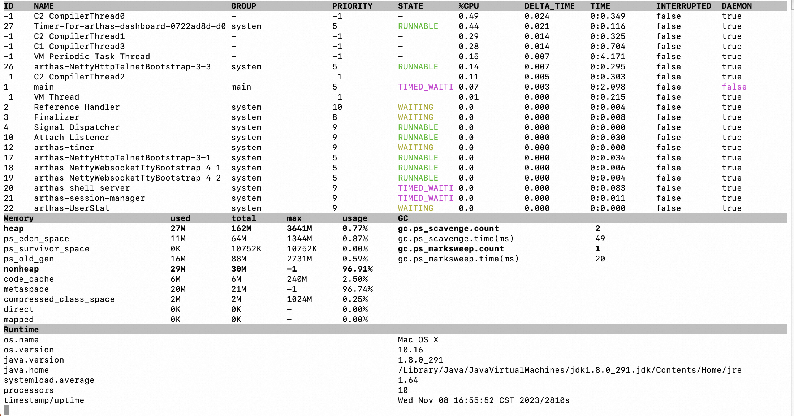
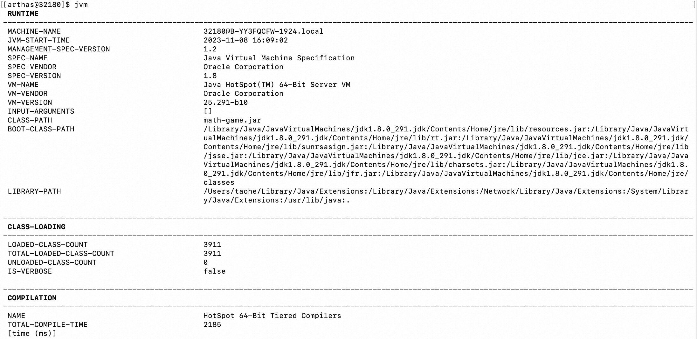
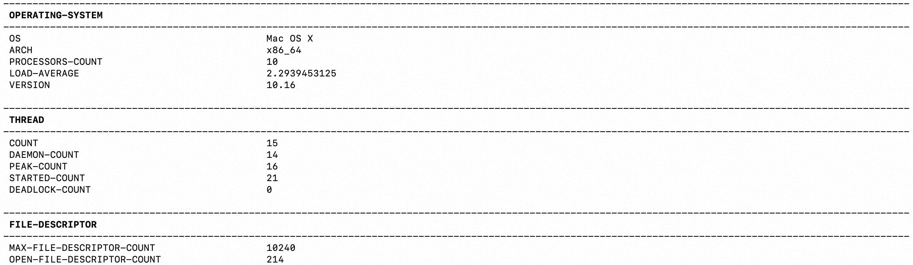
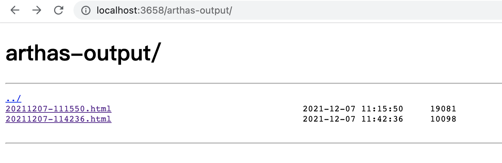
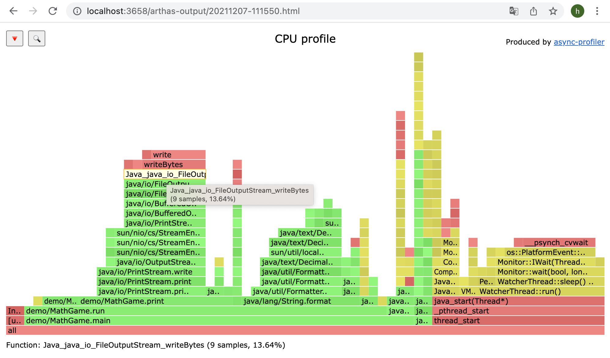
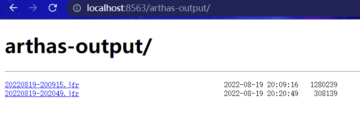

# 简介


Arthas 是一款线上监控诊断产品，通过全局视角实时查看应用 load、内存、gc、线程的状态信息，并能在不修改应用代码的情况下，对业务问题进行诊断，包括查看方法调用的出入参、异常，监测方法执行耗时，类加载信息等，大大提升线上问题排查效率。


## 背景

通常，本地开发环境无法访问生产环境。如果在生产环境中遇到问题，则无法使用 IDE 远程调试。更糟糕的是，在生产环境中调试是不可接受的，因为它会暂停所有线程，导致服务暂停。

开发人员可以尝试在测试环境或者预发环境中复现生产环境中的问题。但是，某些问题无法在不同的环境中轻松复现，甚至在重新启动后就消失了。

如果您正在考虑在代码中添加一些日志以帮助解决问题，您将必须经历以下阶段：测试、预发，然后生产。这种方法效率低下，更糟糕的是，该问题可能无法解决，因为一旦 JVM 重新启动，它可能无法复现，如上文所述。

Arthas 旨在解决这些问题。开发人员可以在线解决生产问题。无需 JVM 重启，无需代码更改。 Arthas 作为观察者永远不会暂停正在运行的线程。


## Arthas（阿尔萨斯）能为你做什么？

`Arthas` 是 Alibaba 开源的 Java 诊断工具，深受开发者喜爱。

当你遇到以下类似问题而束手无策时，`Arthas `可以帮助你解决：

1. 这个类从哪个 jar 包加载的？为什么会报各种类相关的 Exception？
2. 我改的代码为什么没有执行到？难道是我没 commit？分支搞错了？
3. 遇到问题无法在线上 debug，难道只能通过加日志再重新发布吗？
4. 线上遇到某个用户的数据处理有问题，但线上同样无法 debug，线下无法重现！
5. 是否有一个全局视角来查看系统的运行状况？
6. 有什么办法可以监控到 JVM 的实时运行状态？
7. 怎么快速定位应用的热点，生成火焰图？
8. 怎样直接从 JVM 内查找某个类的实例？

`Arthas` 支持 JDK 6+，支持 Linux/Mac/Windows，采用命令行交互模式，同时提供丰富的 `Tab` 自动补全功能，进一步方便进行问题的定位和诊断。


# 快速入门

可以通过下面的方式自己动手实践，也可以通过我们的[在线教程](https://arthas.aliyun.com/doc/arthas-tutorials.html?language=cn&id=arthas-basics)，跟随教程快速入门。


## 1. 启动 math-game

```bash
curl -O https://arthas.aliyun.com/math-game.jar
java -jar math-game.jar
```

`math-game`是一个简单的程序，每隔一秒生成一个随机数，再执行质因数分解，并打印出分解结果。

`math-game`源代码：[查看](https://github.com/alibaba/arthas/blob/master/math-game/src/main/java/demo/MathGame.java)

```java
package demo;

import java.util.ArrayList;
import java.util.List;
import java.util.Random;
import java.util.concurrent.TimeUnit;

public class MathGame {
    private static Random random = new Random();

    private int illegalArgumentCount = 0;

    public static void main(String[] args) throws InterruptedException {
        MathGame game = new MathGame();
        while (true) {
            game.run();
            TimeUnit.SECONDS.sleep(1);
        }
    }

    public void run() throws InterruptedException {
        try {
            int number = random.nextInt()/10000;
            List<Integer> primeFactors = primeFactors(number);
            print(number, primeFactors);

        } catch (Exception e) {
            System.out.println(String.format("illegalArgumentCount:%3d, ", illegalArgumentCount) + e.getMessage());
        }
    }

    public static void print(int number, List<Integer> primeFactors) {
        StringBuffer sb = new StringBuffer(number + "=");
        for (int factor : primeFactors) {
            sb.append(factor).append('*');
        }
        if (sb.charAt(sb.length() - 1) == '*') {
            sb.deleteCharAt(sb.length() - 1);
        }
        System.out.println(sb);
    }

    public List<Integer> primeFactors(int number) {
        if (number < 2) {
            illegalArgumentCount++;
            throw new IllegalArgumentException("number is: " + number + ", need >= 2");
        }

        List<Integer> result = new ArrayList<Integer>();
        int i = 2;
        while (i <= number) {
            if (number % i == 0) {
                result.add(i);
                number = number / i;
                i = 2;
            } else {
                i++;
            }
        }

        return result;
    }
}
```


## 2. 启动 arthas

在命令行下面执行（使用和目标进程一致的用户启动，否则可能 attach 失败）：

```bash
curl -O https://arthas.aliyun.com/arthas-boot.jar
java -jar arthas-boot.jar
```

- 执行该程序的用户需要和目标进程具有相同的权限。比如以`admin`用户来执行：`sudo su admin && java -jar arthas-boot.jar` 或 `sudo -u admin -EH java -jar arthas-boot.jar`。

- 如果 attach 不上目标进程，可以查看 `~/logs/arthas/` 目录下的日志。

- 如果下载速度比较慢，可以使用 aliyun 的镜像：`java -jar arthas-boot.jar --repo-mirror aliyun --use-http`

- `java -jar arthas-boot.jar -h` 打印更多参数信息。

- 如果端口被占用，可以通过以下命令换另外一个端口号执行：

    ```bash
    java -jar arthas-boot.jar --lelnet-port 9998 --http-port -1
    ```

- 安装了多个版本的 Java 时，可能会出现 attach 不成功的问题，排查以下两个方向：

    - 是否配置了环境变量
    - arthas 与被 attach 的进程是否使用的同一个 java

选择应用 java 进程：

```bash
$ $ java -jar arthas-boot.jar
* [1]: 35542
  [2]: 71560 math-game.jar
```

`math-game`进程是第 2 个，则输入 2，再输入`回车/enter`。Arthas 会 attach 到目标进程上，并输出日志：

```bash
[INFO] Try to attach process 71560
[INFO] Attach process 71560 success.
[INFO] arthas-client connect 127.0.0.1 3658
  ,---.  ,------. ,--------.,--.  ,--.  ,---.   ,---.
 /  O  \ |  .--. ''--.  .--'|  '--'  | /  O  \ '   .-'
|  .-.  ||  '--'.'   |  |   |  .--.  ||  .-.  |`.  `-.
|  | |  ||  |\  \    |  |   |  |  |  ||  | |  |.-'    |
`--' `--'`--' '--'   `--'   `--'  `--'`--' `--'`-----'


wiki: https://arthas.aliyun.com/doc
version: 3.0.5.20181127201536
pid: 71560
time: 2018-11-28 19:16:24

$
```

当计算机中并无 Java 子进程在运行时，启动 arthas 会直接退出。


## 3. 查看 dashboard

输入 dashboard，按`回车/enter`，会展示当前进程的信息，按`ctrl+c`可以中断执行。

```bash
$ dashboard
ID     NAME                   GROUP          PRIORI STATE  %CPU    TIME   INTERRU DAEMON
17     pool-2-thread-1        system         5      WAITIN 67      0:0    false   false
27     Timer-for-arthas-dashb system         10     RUNNAB 32      0:0    false   true
11     AsyncAppender-Worker-a system         9      WAITIN 0       0:0    false   true
9      Attach Listener        system         9      RUNNAB 0       0:0    false   true
3      Finalizer              system         8      WAITIN 0       0:0    false   true
2      Reference Handler      system         10     WAITIN 0       0:0    false   true
4      Signal Dispatcher      system         9      RUNNAB 0       0:0    false   true
26     as-command-execute-dae system         10     TIMED_ 0       0:0    false   true
13     job-timeout            system         9      TIMED_ 0       0:0    false   true
1      main                   main           5      TIMED_ 0       0:0    false   false
14     nioEventLoopGroup-2-1  system         10     RUNNAB 0       0:0    false   false
18     nioEventLoopGroup-2-2  system         10     RUNNAB 0       0:0    false   false
23     nioEventLoopGroup-2-3  system         10     RUNNAB 0       0:0    false   false
15     nioEventLoopGroup-3-1  system         10     RUNNAB 0       0:0    false   false
Memory             used   total max    usage GC
heap               32M    155M  1820M  1.77% gc.ps_scavenge.count  4
ps_eden_space      14M    65M   672M   2.21% gc.ps_scavenge.time(m 166
ps_survivor_space  4M     5M    5M           s)
ps_old_gen         12M    85M   1365M  0.91% gc.ps_marksweep.count 0
nonheap            20M    23M   -1           gc.ps_marksweep.time( 0
code_cache         3M     5M    240M   1.32% ms)
Runtime
os.name                Mac OS X
os.version             10.13.4
java.version           1.8.0_162
java.home              /Library/Java/JavaVir
                       tualMachines/jdk1.8.0
                       _162.jdk/Contents/Hom
                       e/jre
```


## 4. 通过 thread 命令来获取到`math-game`进程的 Main Class

`thread 1`会打印线程 ID 1 的栈，通常是 main 函数的线程。

```bash
$ thread 1 | grep 'main('
    at demo.MathGame.main(MathGame.java:17)
```


## 5. 通过 jad 来反编译 Main Class

```java
$ jad demo.MathGame

ClassLoader:
+-sun.misc.Launcher$AppClassLoader@3d4eac69
  +-sun.misc.Launcher$ExtClassLoader@66350f69

Location:
/tmp/math-game.jar

/*
 * Decompiled with CFR 0_132.
 */
package demo;

import java.io.PrintStream;
import java.util.ArrayList;
import java.util.Iterator;
import java.util.List;
import java.util.Random;
import java.util.concurrent.TimeUnit;

public class MathGame {
    private static Random random = new Random();
    private int illegalArgumentCount = 0;

    public static void main(String[] args) throws InterruptedException {
        MathGame game = new MathGame();
        do {
            game.run();
            TimeUnit.SECONDS.sleep(1L);
        } while (true);
    }

    public void run() throws InterruptedException {
        try {
            int number = random.nextInt();
            List<Integer> primeFactors = this.primeFactors(number);
            MathGame.print(number, primeFactors);
        }
        catch (Exception e) {
            System.out.println(String.format("illegalArgumentCount:%3d, ", this.illegalArgumentCount) + e.getMessage());
        }
    }

    public static void print(int number, List<Integer> primeFactors) {
        StringBuffer sb = new StringBuffer("" + number + "=");
        Iterator<Integer> iterator = primeFactors.iterator();
        while (iterator.hasNext()) {
            int factor = iterator.next();
            sb.append(factor).append('*');
        }
        if (sb.charAt(sb.length() - 1) == '*') {
            sb.deleteCharAt(sb.length() - 1);
        }
        System.out.println(sb);
    }

    public List<Integer> primeFactors(int number) {
        if (number < 2) {
            ++this.illegalArgumentCount;
            throw new IllegalArgumentException("number is: " + number + ", need >= 2");
        }
        ArrayList<Integer> result = new ArrayList<Integer>();
        int i = 2;
        while (i <= number) {
            if (number % i == 0) {
                result.add(i);
                number /= i;
                i = 2;
                continue;
            }
            ++i;
        }
        return result;
    }
}

Affect(row-cnt:1) cost in 970 ms.
```


## 6. watch

通过[watch](https://arthas.aliyun.com/doc/watch.html)命令来查看`demo.MathGame#primeFactors`函数的返回值：

```bash
$ watch demo.MathGame primeFactors returnObj
Press Ctrl+C to abort.
Affect(class-cnt:1 , method-cnt:1) cost in 107 ms.
ts=2018-11-28 19:22:30; [cost=1.715367ms] result=null
ts=2018-11-28 19:22:31; [cost=0.185203ms] result=null
ts=2018-11-28 19:22:32; [cost=19.012416ms] result=@ArrayList[
    @Integer[5],
    @Integer[47],
    @Integer[2675531],
]
ts=2018-11-28 19:22:33; [cost=0.311395ms] result=@ArrayList[
    @Integer[2],
    @Integer[5],
    @Integer[317],
    @Integer[503],
    @Integer[887],
]
ts=2018-11-28 19:22:34; [cost=10.136007ms] result=@ArrayList[
    @Integer[2],
    @Integer[2],
    @Integer[3],
    @Integer[3],
    @Integer[31],
    @Integer[717593],
]
ts=2018-11-28 19:22:35; [cost=29.969732ms] result=@ArrayList[
    @Integer[5],
    @Integer[29],
    @Integer[7651739],
]
```

更多的功能可以查看[进阶教程](https://arthas.aliyun.com/doc/arthas-tutorials.html?language=cn&id=arthas-advanced)。


## 7. 退出 arthas

如果只是退出当前的连接，可以用`quit`或者`exit`命令。Attach 到目标进程上的 arthas 还会继续运行，端口会保持开放，下次连接时可以直接连接上。

如果想完全退出 arthas，可以执行`stop`命令。


# Arthas Install


## 快速安装

### 使用`arthas-boot`（推荐）

下载`arthas-boot.jar`，然后用`java -jar`的方式启动：

```bash
curl -O https://arthas.aliyun.com/arthas-boot.jar
java -jar arthas-boot.jar
```

打印帮助信息：

```bash
java -jar arthas-boot.jar -h
```

- 如果下载速度比较慢，可以使用 aliyun 的镜像：

    ```bash
    java -jar arthas-boot.jar --repo-mirror aliyun --use-http
    ```

### 使用`as.sh`

Arthas 支持在 Linux/Unix/Mac 等平台上一键安装，请复制以下内容，并粘贴到命令行中，敲 `回车` 执行即可：

```bash
curl -L https://arthas.aliyun.com/install.sh | sh
```

上述命令会下载启动脚本文件 `as.sh` 到当前目录，你可以放在任何地方或将其加入到 `$PATH` 中。

直接在 shell 下面执行`./as.sh`，就会进入交互界面。

也可以执行`./as.sh -h`来获取更多参数信息。


## 全量安装

最新版本，点击下载：[](https://arthas.aliyun.com/download/latest_version?mirror=aliyun)

解压后，在文件夹里有`arthas-boot.jar`，直接用`java -jar`的方式启动：

```bash
java -jar arthas-boot.jar
```

打印帮助信息：

```bash
java -jar arthas-boot.jar -h
```


## 手动安装

[手动安装](https://arthas.aliyun.com/doc/manual-install.html)

### 下载全量包

#### 从 Maven 仓库下载

最新版本，点击下载：[](https://arthas.aliyun.com/download/latest_version?mirror=aliyun)

#### 从 Github Releases 页下载

[https://github.com/alibaba/arthas/releases在新窗口打开](https://github.com/alibaba/arthas/releases)

#### 用 as.sh 启动

解压后，在文件夹里有`as.sh`，直接用`./as.sh`的方式启动：

```bash
./as.sh
```

打印帮助信息：

```bash
./as.sh -h
```

#### 用 arthas-boot 启动

或者在解压后，在文件夹里有`arthas-boot.jar`，直接用`java -jar`的方式启动：

```bash
java -jar arthas-boot.jar
```

打印帮助信息：

```bash
java -jar arthas-boot.jar -h
```

### 下载离线文档

下载文档：[](https://arthas.aliyun.com/download/doc/latest_version?mirror=aliyun)


## 通过 rpm/deb 来安装

在 releases 页面下载 rpm/deb 包： https://github.com/alibaba/arthas/releases

### 安装 deb

```bash
sudo dpkg -i arthas*.deb
```

### 安装 rpm

```bash
sudo rpm -i arthas*.rpm
```

### deb/rpm 安装的用法

在安装后，可以直接执行：

```bash
as.sh
```


## 通过 Cloud Toolkit 插件使用 Arthas

- [通过 Cloud Toolkit 插件使用 Arthas 一键诊断远程服务器在新窗口打开](https://github.com/alibaba/arthas/issues/570)


## 离线帮助文档

最新版本离线文档下载：[](https://arthas.aliyun.com/download/doc/latest_version?mirror=aliyun)


## 卸载

- 在 Linux/Unix/Mac 平台

    删除下面文件：

    ```bash
    rm -rf ~/.arthas/
    rm -rf ~/logs/arthas
    ```

- Windows 平台直接删除 user home 下面的`.arthas`和`logs/arthas`目录


# 表达式核心变量

无论是匹配表达式也好、观察表达式也罢，他们核心判断变量都是围绕着一个 Arthas 中的通用通知对象 `Advice` 进行。

它的简略代码结构如下

```java
public class Advice {

    private final ClassLoader loader;
    private final Class<?> clazz;
    private final ArthasMethod method;
    private final Object target;
    private final Object[] params;
    private final Object returnObj;
    private final Throwable throwExp;
    private final boolean isBefore;
    private final boolean isThrow;
    private final boolean isReturn;

    // getter/setter
}
```

这里列一个表格来说明不同变量的含义

|    变量名 | 变量解释                                                     |
| --------: | :----------------------------------------------------------- |
|    loader | 本次调用类所在的 ClassLoader                                 |
|     clazz | 本次调用类的 Class 引用                                      |
|    method | 本次调用方法反射引用                                         |
|    target | 本次调用类的实例                                             |
|    params | 本次调用参数列表，这是一个数组，如果方法是无参方法则为空数组 |
| returnObj | 本次调用返回的对象。当且仅当 `isReturn==true` 成立时候有效，表明方法调用是以正常返回的方式结束。如果当前方法无返回值 `void`，则值为 null |
|  throwExp | 本次调用抛出的异常。当且仅当 `isThrow==true` 成立时有效，表明方法调用是以抛出异常的方式结束。 |
|  isBefore | 辅助判断标记，当前的通知节点有可能是在方法一开始就通知，此时 `isBefore==true` 成立，同时 `isThrow==false` 和 `isReturn==false`，因为在方法刚开始时，还无法确定方法调用将会如何结束。 |
|   isThrow | 辅助判断标记，当前的方法调用以抛异常的形式结束。             |
|  isReturn | 辅助判断标记，当前的方法调用以正常返回的形式结束。           |

所有变量都可以在表达式中直接使用，如果在表达式中编写了不符合 OGNL 脚本语法或者引入了不在表格中的变量，则退出命令的执行；用户可以根据当前的异常信息修正`条件表达式`或`观察表达式`

- 特殊用法请参考：[https://github.com/alibaba/arthas/issues/71](https://github.com/alibaba/arthas/issues/71)
- OGNL 表达式官网：https://commons.apache.org/proper/commons-ognl/language-guide.html


# 命令列表


## 分类

### jvm 相关

- [dashboard](https://arthas.aliyun.com/doc/dashboard.html) - 当前系统的实时数据面板
- [getstatic](https://arthas.aliyun.com/doc/getstatic.html) - 查看类的静态属性
- [heapdump](https://arthas.aliyun.com/doc/heapdump.html) - dump java heap, 类似 jmap 命令的 heap dump 功能
- [jvm](https://arthas.aliyun.com/doc/jvm.html) - 查看当前 JVM 的信息
- [logger](https://arthas.aliyun.com/doc/logger.html) - 查看和修改 logger
- [mbean](https://arthas.aliyun.com/doc/mbean.html) - 查看 Mbean 的信息
- [memory](https://arthas.aliyun.com/doc/memory.html) - 查看 JVM 的内存信息
- [ognl](https://arthas.aliyun.com/doc/ognl.html) - 执行 ognl 表达式
- [perfcounter](https://arthas.aliyun.com/doc/perfcounter.html) - 查看当前 JVM 的 Perf Counter 信息
- [sysenv](https://arthas.aliyun.com/doc/sysenv.html) - 查看 JVM 的环境变量
- [sysprop](https://arthas.aliyun.com/doc/sysprop.html) - 查看和修改 JVM 的系统属性
- [thread](https://arthas.aliyun.com/doc/thread.html) - 查看当前 JVM 的线程堆栈信息
- [vmoption](https://arthas.aliyun.com/doc/vmoption.html) - 查看和修改 JVM 里诊断相关的 option
- [vmtool](https://arthas.aliyun.com/doc/vmtool.html) - 从 jvm 里查询对象，执行 forceGc

### class/classloader 相关

- [classloader](https://arthas.aliyun.com/doc/classloader.html) - 查看 classloader 的继承树，urls，类加载信息，使用 classloader 去 getResource
- [dump](https://arthas.aliyun.com/doc/dump.html) - dump 已加载类的 byte code 到特定目录
- [jad](https://arthas.aliyun.com/doc/jad.html) - 反编译指定已加载类的源码
- [mc](https://arthas.aliyun.com/doc/mc.html) - 内存编译器，内存编译`.java`文件为`.class`文件
- [redefine](https://arthas.aliyun.com/doc/redefine.html) - 加载外部的`.class`文件，redefine 到 JVM 里
- [retransform](https://arthas.aliyun.com/doc/retransform.html) - 加载外部的`.class`文件，retransform 到 JVM 里
- [sc](https://arthas.aliyun.com/doc/sc.html) - 查看 JVM 已加载的类信息
- [sm](https://arthas.aliyun.com/doc/sm.html) - 查看已加载类的方法信息

### monitor/watch/trace 相关

注意

请注意，这些命令，都通过字节码增强技术来实现的，会在指定类的方法中插入一些切面来实现数据统计和观测，因此在线上、预发使用时，请尽量明确需要观测的类、方法以及条件，诊断结束要执行 `stop` 或将增强过的类执行 `reset` 命令。

- [monitor](https://arthas.aliyun.com/doc/monitor.html) - 方法执行监控
- [stack](https://arthas.aliyun.com/doc/stack.html) - 输出当前方法被调用的调用路径
- [trace](https://arthas.aliyun.com/doc/trace.html) - 方法内部调用路径，并输出方法路径上的每个节点上耗时
- [tt](https://arthas.aliyun.com/doc/tt.html) - 方法执行数据的时空隧道，记录下指定方法每次调用的入参和返回信息，并能对这些不同的时间下调用进行观测
- [watch](https://arthas.aliyun.com/doc/watch.html) - 方法执行数据观测

### profiler/火焰图

- [profiler](https://arthas.aliyun.com/doc/profiler.html) - 使用[async-profiler](https://github.com/jvm-profiling-tools/async-profiler)对应用采样，生成火焰图
- [jfr](https://arthas.aliyun.com/doc/jfr.html) - 动态开启关闭 JFR 记录

### 鉴权

- [auth](https://arthas.aliyun.com/doc/auth.html) - 鉴权

### options

- [options](https://arthas.aliyun.com/doc/options.html) - 查看或设置 Arthas 全局开关

### 管道

Arthas 支持使用管道对上述命令的结果进行进一步的处理，如`sm java.lang.String * | grep 'index'`

- [grep](https://arthas.aliyun.com/doc/grep.html) - 搜索满足条件的结果
- plaintext - 将命令的结果去除 ANSI 颜色
- wc - 按行统计输出结果

### 后台异步任务

当线上出现偶发的问题，比如需要 watch 某个条件，而这个条件一天可能才会出现一次时，异步后台任务就派上用场了，详情请参考[这里](https://arthas.aliyun.com/doc/async.html)

- 使用 `>` 将结果重写向到日志文件，使用 `&` 指定命令是后台运行，session 断开不影响任务执行（生命周期默认为 1 天）
- jobs - 列出所有 job
- kill - 强制终止任务
- fg - 将暂停的任务拉到前台执行
- bg - 将暂停的任务放到后台执行


### 基础命令

- [base64](https://arthas.aliyun.com/doc/base64.html) - base64 编码转换，和 linux 里的 base64 命令类似
- [cat](https://arthas.aliyun.com/doc/cat.html) - 打印文件内容，和 linux 里的 cat 命令类似
- [cls](https://arthas.aliyun.com/doc/cls.html) - 清空当前屏幕区域
- [echo](https://arthas.aliyun.com/doc/echo.html) - 打印参数，和 linux 里的 echo 命令类似
- [grep](https://arthas.aliyun.com/doc/grep.html) - 匹配查找，和 linux 里的 grep 命令类似
- [help](https://arthas.aliyun.com/doc/help.html) - 查看命令帮助信息
- [history](https://arthas.aliyun.com/doc/history.html) - 打印命令历史
- [keymap](https://arthas.aliyun.com/doc/keymap.html) - Arthas 快捷键列表及自定义快捷键
- [pwd](https://arthas.aliyun.com/doc/pwd.html) - 返回当前的工作目录，和 linux 命令类似
- [quit](https://arthas.aliyun.com/doc/quit.html) - 退出当前 Arthas 客户端，其他 Arthas 客户端不受影响
- [reset](https://arthas.aliyun.com/doc/reset.html) - 重置增强类，将被 Arthas 增强过的类全部还原，Arthas 服务端关闭时会重置所有增强过的类
- [session](https://arthas.aliyun.com/doc/session.html) - 查看当前会话的信息
- [stop](https://arthas.aliyun.com/doc/stop.html) - 关闭 Arthas 服务端，所有 Arthas 客户端全部退出
- [tee](https://arthas.aliyun.com/doc/tee.html) - 复制标准输入到标准输出和指定的文件，和 linux 里的 tee 命令类似
- [version](https://arthas.aliyun.com/doc/version.html) - 输出当前目标 Java 进程所加载的 Arthas 版本号


## 基础命令

### base64

base64 编码转换，和 linux 里的 base64 命令类似。

#### man

```bash
 USAGE:                                                                                   
   base64 [-d] [-h] [-i <value>] [-o <value>] [-M <value>] [file]                         
                                                                                          
 SUMMARY:                                                                                 
   Encode and decode using Base64 representation                                          
                                                                                          
 EXAMPLES:                                                                                
   base64 /tmp/test.txt                                                                   
   base64 --input /tmp/test.txt --output /tmp/result.txt                                  
   base64 -d /tmp/result.txt                                                              
                                                                                          
 WIKI:                                                                                    
   https://arthas.aliyun.com/doc/base64                                                   
                                                                                          
 OPTIONS:                                                                                 
 -d, --decode                  decodes input                                              
 -h, --help                    this help                                                  
 -i, --input <value>           input file                                                 
 -o, --output <value>          output file                                                
 -M, --sizeLimit <value>       Upper size limit in bytes for the result (128 * 1024 by default, the maximum value is 8 * 1024 * 1024)               
 <file>                        file  
```

#### 示例

##### 对文件进行 base64 编码

```bash
[arthas@70070]$ echo 'abc' > /tmp/test.txt
[arthas@70070]$ cat /tmp/test.txt
abc

[arthas@70070]$ base64 /tmp/test.txt
YWJjCg==
```

##### 对文件进行 base64 编码并把结果保存到文件里

```bash
$ base64 --input /tmp/test.txt --output /tmp/result.txt
```

##### 用 base64 解码文件

```bash
$ base64 -d /tmp/result.txt
abc
```

##### 用 base64 解码文件并保存结果到文件里

```bash
$ base64 -d /tmp/result.txt --output /tmp/bbb.txt
```

### cat

打印文件内容，和 Linux 里的 cat 命令类似。

#### man

```bash
USAGE:                                                                                   
   cat [--encoding <value>] [-h] [-M <value>] files...                                    
                                                                                          
SUMMARY:                                                                                 
   Concatenate and print files                                                            
                                                                                          
OPTIONS:                                                                                 
     --encoding <value>        File encoding                                              
 -h, --help                    this help                                                  
 -M, --sizeLimit <value>       Upper size limit in bytes for the result (128 * 1024 by default, the maximum value is 8 * 1024 * 1024)               
 <files>                       files  
```

#### 示例

```bash
$ cat /tmp/a.txt
```

### cls

清空当前屏幕区域。

> 非终端模式下使用 cls 指令，会提示"Command 'cls' is only support tty session."。

> 在 cmd 环境下的清屏指令也是 cls，但在 Linux 环境下的清屏指令是 clear 或者 Ctrl + L

### echo

打印参数，和 Linux 里的 echo 命令类似。

#### man

```bash
 USAGE:                                                                                   
   echo [-h] [message]                                                                    
                                                                                          
 SUMMARY:                                                                                 
   write arguments to the standard output                                                 
                                                                                          
 Examples:                                                                                
   echo 'abc'                                                                             
                                                                                          
 WIKI:                                                                                    
   https://arthas.aliyun.com/doc/echo                                                     
                                                                                          
 OPTIONS:                                                                                 
 -h, --help                    this help                                                  
 <message>                     message     
```

#### 示例

```bash
$ echo 'hello'
```

### grep

类似传统的 `grep` 命令，但只能处理管道输入。

#### man

```bash
 USAGE:                                                                                   
   grep [-A <value>] [-B <value>] [-C <value>] [-h] [-i] [-v] [-n] [-m <value>] [-e] [--trim-end <value>] pattern                                                                 
                                                                                          
 SUMMARY:                                                                                 
   grep command for pipes.                                                                
                                                                                          
 EXAMPLES:                                                                                
  sysprop | grep java                                                                     
  sysprop | grep java -n                                                                  
  sysenv | grep -v JAVA                                                                   
  sysenv | grep -e "(?i)(JAVA|sun)" -m 3  -C 2                                            
  sysenv | grep JAVA -A2 -B3                                                              
  thread | grep -m 10 -e  "TIMED_WAITING|WAITING"                                         
                                                                                          
 WIKI:                                                                                    
   https://arthas.aliyun.com/doc/grep                                                     
                                                                                          
 OPTIONS:                                                                                 
 -A, --after-context <value>   Print NUM lines of trailing context)                       
 -B, --before-context <value>  Print NUM lines of leading context)                        
 -C, --context <value>         Print NUM lines of output context)                         
 -h, --help                    this help                                                  
 -i, --ignore-case             Perform case insensitive matching.  By default, grep is case sensitive.                                              
 -v, --invert-match            Select non-matching lines                                  
 -n, --line-number             Print line number with output lines                        
 -m, --max-count <value>       stop after NUM selected lines)                             
 -e, --regex                   Enable regular expression to match                         
     --trim-end <value>        Remove whitespaces at the end of the line, default value true                                                        
 <pattern>                     Pattern       
```

### help

查看命令帮助信息，可以查看当前 arthas 版本支持的指令，或者查看具体指令的使用说明。

[help 指令]的等同于[指令 -help]，都是查看具体指令的使用说明。

#### 参数

| 参数名称 | 参数说明                                   |
| :------- | :----------------------------------------- |
| 不接参数 | 查询当前 arthas 版本支持的指令以及指令描述 |
| [name:]  | 查询具体指令的使用说明                     |

### history

打印指令历史（包含当前指令）

> 历史指令会通过一个名叫 history 的文件持久化，所以 history 指令可以查看当前 arthas 服务器的所有历史命令，而不仅只是当前次会话使用过的命令

#### 参数

| 参数名称 | 参数说明                                |
| -------- | --------------------------------------- |
| n        | 显示最近执行的 n 条指令（包含当前指令） |
| c        | 清空历史指令                            |

> 使用参数 n 时要这样：`history 5`
>
> 而使用参数 c 是要这样：`history -c`，并且不会有任何输出，也不会记录该条指令到 history 中。该条指令的副作用是使 ↑ 和 ↓ 失效

#### 示例

```bash
#查看最近执行的3条指令
$ history 3
  269  thread
  270  cls
  271  history 3

 #清空指令
 $ history -c
 $ history 3
  1  history 3
```

### keymap

`keymap` 命令输出当前的快捷键映射表：

默认的快捷键如下：

| 快捷键        | 快捷键说明       | 命令名称             | 命令说明                         |
| ------------- | ---------------- | -------------------- | -------------------------------- |
| `"\C-a"`      | ctrl + a         | beginning-of-line    | 跳到行首                         |
| `"\C-e"`      | ctrl + e         | end-of-line          | 跳到行尾                         |
| `"\C-f"`      | ctrl + f         | forward-word         | 向前移动一个单词                 |
| `"\C-b"`      | ctrl + b         | backward-word        | 向后移动一个单词                 |
| `"\e[D"`      | 键盘左方向键     | backward-char        | 光标向前移动一个字符             |
| `"\e[C"`      | 键盘右方向键     | forward-char         | 光标向后移动一个字符             |
| `"\e[B"`      | 键盘下方向键     | next-history         | 下翻显示下一个命令               |
| `"\e[A"`      | 键盘上方向键     | previous-history     | 上翻显示上一个命令               |
| `"\C-h"`      | ctrl + h         | backward-delete-char | 向后删除一个字符                 |
| `"\C-?"`      | ctrl + shift + / | backward-delete-char | 向后删除一个字符                 |
| `"\C-u"`      | ctrl + u         | undo                 | 撤销上一个命令，相当于清空当前行 |
| `"\C-d"`      | ctrl + d         | delete-char          | 删除当前光标所在字符             |
| `"\C-k"`      | ctrl + k         | kill-line            | 删除当前光标到行尾的所有字符     |
| `"\C-i"`      | ctrl + i         | complete             | 自动补全，相当于敲`TAB`          |
| `"\C-j"`      | ctrl + j         | accept-line          | 结束当前行，相当于敲回车         |
| `"\C-m"`      | ctrl + m         | accept-line          | 结束当前行，相当于敲回车         |
| `"\C-w"`      |                  | backward-delete-word |                                  |
| `"\C-x\e[3~"` |                  | backward-kill-line   |                                  |
| `"\e\C-?"`    |                  | backward-kill-word   |                                  |

- 任何时候 `tab` 键，会根据当前的输入给出提示
- 命令后敲 `-` 或 `--` ，然后按 `tab` 键，可以展示出此命令具体的选项

#### **自定义快捷键**

在当前用户目录下新建 `$USER_HOME/.arthas/conf/inputrc` 文件，加入自定义配置。

假设我是 vim 的重度用户，我要把 `ctrl+h` 设置为光标向前一个字符，则设置如下，首先拷贝默认配置

```text
"\C-a": beginning-of-line
"\C-e": end-of-line
"\C-f": forward-word
"\C-b": backward-word
"\e[D": backward-char
"\e[C": forward-char
"\e[B": next-history
"\e[A": previous-history
"\C-h": backward-delete-char
"\C-?": backward-delete-char
"\C-u": undo
"\C-d": delete-char
"\C-k": kill-line
"\C-i": complete
"\C-j": accept-line
"\C-m": accept-line
"\C-w": backward-delete-word
"\C-x\e[3~": backward-kill-line
"\e\C-?": backward-kill-word
```

然后把`"\C-h": backward-delete-char`换成`"\C-h": backward-char`，然后重新连接即可。

**后台异步命令相关快捷键**

- ctrl + c: 终止当前命令
- ctrl + z: 挂起当前命令，后续可以 bg/fg 重新支持此命令，或 kill 掉
- ctrl + a: 回到行首
- ctrl + e: 回到行尾

### pwd

返回当前的工作目录，和 Linux 命令类似

### quit

退出当前 Arthas 客户端，其他 Arthas 客户端不受影响。等同于 **exit**、**logout**、**q **三个指令。

只是退出当前 Arthas 客户端，Arthas 的服务器端并没有关闭，所做的修改也不会被重置。

### reset

重置增强类，将被 Arthas 增强过的类全部还原，Arthas 服务端 `stop` 时会重置所有增强过的类。

只会还原当前会话所增强过的类。

#### man

```bash
$ reset -h
 USAGE:
   reset [-h] [-E] [class-pattern]

 SUMMARY:
   Reset all the enhanced classes

 EXAMPLES:
   reset
   reset *List
   reset -E .*List

 OPTIONS:
 -h, --help                                        帮助手册
 -E, --regex                                       启用正则表达式匹配，默认情况下是通配符匹配
 <class-pattern>                                   匹配模式
```

#### 示例

```bash
# 还原指定类
$ reset Test
Affect(class-cnt:1 , method-cnt:0) cost in 11 ms.

# 还原所有类
$ reset
Affect(class-cnt:1 , method-cnt:0) cost in 9 ms.
```

### session

查看当前会话的信息，显示当前绑定的 pid 以及会话 id。

session 为每个 Arthas 客户端唯一，即使是 attach 在同一个进程上。

> 如果配置了 tunnel server，会追加打印 代理 id、tunnel 服务器的 url 以及连接状态。
>
> 如果使用了 staturl 做统计，会追加显示 statUrl 地址。

#### 示例

```bash
$ session
  Name        Value
--------------------------------------------------
 JAVA_PID    14584
 SESSION_ID  c2073d3b-443a-4a9b-9249-0c5d24a5756c
```

### stop

#### 功能

关闭 Arthas 服务端，所有 Arthas 客户端全部退出。

关闭 Arthas 服务器之前，会重置掉所有做过的增强类。但是用 redefine 重加载的类内容不会被重置。

### tee

#### 功能

类似传统的`tee`命令, 用于读取标准输入的数据，并将其内容输出成文件。

tee 指令会从标准输入设备读取数据，将其内容输出到标准输出设备，同时保存成文件。

#### man

```bash
 USAGE:                                                                         
   tee [-a] [-h] [file]                                                         
                                                                                
 SUMMARY:                                                                       
   tee command for pipes.                                                       
                                                                                
 EXAMPLES:                                                                      
  sysprop | tee /path/to/logfile | grep java                                    
  sysprop | tee -a /path/to/logfile | grep java                                 
                                                                                
 WIKI:                                                                          
   https://arthas.aliyun.com/doc/tee                                            
                                                                                
 OPTIONS:                                                                       
 -a, --append               Append to file                                      
 -h, --help                 this help                                           
 <file>                     File path        
```

### version

输出当前目标 Java 进程所加载的 Arthas 版本号

#### 示例

```bash
$ version
3.7.1
```


## JVM 相关

### dashboard

当前系统的实时数据面板，按 q 或 ctrl+c 退出。

>  当运行在 Ali-tomcat 时，会显示当前 tomcat 的实时信息，如 HTTP 请求的 qps, rt, 错误数, 线程池信息等等。

#### 参数

| 参数名称 | 参数说明                                 |
| :------- | :--------------------------------------- |
| [i:]     | 刷新实时数据的时间间隔 (ms)，默认 5000ms |
| [n:]     | 刷新实时数据的次数                       |

#### man

```bash
 USAGE:                                                                         
   dashboard [-h] [-i <value>] [-n <value>]                                     
                                                                                
 SUMMARY:                                                                       
   Overview of target jvm's thread, memory, gc, vm, tomcat info.                
                                                                                
 EXAMPLES:                                                                      
   dashboard                                                                    
   dashboard -n 10                                                              
   dashboard -i 2000                                                            
                                                                                
 WIKI:                                                                          
   https://arthas.aliyun.com/doc/dashboard                                      
                                                                                
 OPTIONS:                                                                       
 -h, --help                 this help                                           
 -i, --interval <value>     The interval (in ms) between two executions, defaul 
                            t is 5000 ms.                                       
 -n, --number-of-execution  The number of times this command will be executed.  
  <value>                     
```

#### 示例



**数据说明**

- ID: Java 级别的线程 ID，注意这个 ID 不能跟 jstack 中的 nativeID 一一对应。
- NAME: 线程名
- GROUP: 线程组名
- PRIORITY: 线程优先级, 1~10 之间的数字，越大表示优先级越高
- STATE: 线程的状态
- CPU%: 线程的 cpu 使用率。比如采样间隔 1000ms，某个线程的增量 cpu 时间为 100ms，则 cpu 使用率=100/1000=10%
- DELTA_TIME: 上次采样之后线程运行增量 CPU 时间，数据格式为`秒`
- TIME: 线程运行总 CPU 时间，数据格式为`分:秒`
- INTERRUPTED: 线程当前的中断位状态
- DAEMON: 是否是 daemon 线程

**JVM 内部线程**

Java 8 之后支持获取 JVM 内部线程 CPU 时间，这些线程只有名称和 CPU 时间，没有 ID 及状态等信息（显示 ID 为-1）。 通过内部线程可以观测到 JVM 活动，如 GC、JIT 编译等占用 CPU 情况，方便了解 JVM 整体运行状况。

- 当 JVM 堆(heap)/元数据(metaspace)空间不足或 OOM 时，可以看到 GC 线程的 CPU 占用率明显高于其他的线程。
- 当执行`trace/watch/tt/redefine`等命令后，可以看到 JIT 线程活动变得更频繁。因为 JVM 热更新 class 字节码时清除了此 class 相关的 JIT 编译结果，需要重新编译。

JVM 内部线程包括下面几种：

- JIT 编译线程: 如 `C1 CompilerThread0`, `C2 CompilerThread0`
- GC 线程: 如`GC Thread0`, `G1 Young RemSet Sampling`
- 其它内部线程: 如`VM Periodic Task Thread`, `VM Thread`, `Service Thread`

### getstatic

查看类的静态属性

> 推荐直接使用 ognl 命令，更灵活

#### man

```bash
 USAGE:                                                                                               
   getstatic [-c <value>] [--classLoaderClass <value>] [-x <value>] [-h] [-E] class-pattern field-pattern [express]                                                                                       
                                                                                                      
 SUMMARY:                                                                                             
   Show the static field of a class                                                                   
                                                                                                      
 EXAMPLES:                                                                                            
   getstatic demo.MathGame random                                                                     
   getstatic -c 39eb305e org.apache.log4j.LogManager DEFAULT_CONFIGURATION_FILE                       
                                                                                                      
 WIKI:                                                                                                
   https://arthas.aliyun.com/doc/getstatic                                                            
                                                                                                      
 OPTIONS:                                                                                             
 -c, --classloader <value>         The hash code of the special class's classLoader                   
     --classLoaderClass <value>    The class name of the special class's classLoader.                 
 -x, --expand <value>              Expand level of object (1 by default)                              
 -h, --help                        this help                                                          
 -E, --regex                       Enable regular expression to match (wildcard matching by default)  
 <class-pattern>                   Class name pattern, use either '.' or '/' as separator             
 <field-pattern>                   Field name pattern                                                 
 <express>                         the content you want to watch, written by ognl    
```

#### 示例

##### 查看类的静态属性

```bash
[arthas@49028]$ getstatic demo.MathGame random
field: random
@Random[
    serialVersionUID=@Long[3905348978240129619],
    seed=@AtomicLong[145168843400115],
    multiplier=@Long[25214903917],
    addend=@Long[11],
    mask=@Long[281474976710655],
    DOUBLE_UNIT=@Double[1.1102230246251565E-16],
    BadBound=@String[bound must be positive],
    BadRange=@String[bound must be greater than origin],
    BadSize=@String[size must be non-negative],
    seedUniquifier=@AtomicLong[3620162808252824828],
    nextNextGaussian=@Double[0.0],
    haveNextNextGaussian=@Boolean[false],
    serialPersistentFields=@ObjectStreamField[][isEmpty=false;size=3],
    unsafe=@Unsafe[sun.misc.Unsafe@152a1030],
    seedOffset=@Long[24],
]
Affect(row-cnt:1) cost in 28 ms.
```

##### 指定 classLoader

注意 hashcode 是变化的，需要先查看当前的 ClassLoader 信息，使用`sc -d <ClassName>`提取对应 ClassLoader 的 hashcode。

如果你使用`-c`，你需要手动输入 hashcode：`-c <hashcode>`

```bash
[arthas@49028]$ sc -d demo.MathGame
 class-info        demo.MathGame                                                                      
 code-source       /Users/taohe/study/arthas/material/math-game.jar                                   
 name              demo.MathGame                                                                      
 isInterface       false                                                                              
 isAnnotation      false                                                                              
 isEnum            false                                                                              
 isAnonymousClass  false                                                                              
 isArray           false                                                                              
 isLocalClass      false                                                                              
 isMemberClass     false                                                                              
 isPrimitive       false                                                                              
 isSynthetic       false                                                                              
 simple-name       MathGame                                                                           
 modifier          public                                                                             
 annotation                                                                                           
 interfaces                                                                                           
 super-class       +-java.lang.Object                                                                 
 class-loader      +-sun.misc.Launcher$AppClassLoader@5c647e05                                        
                     +-sun.misc.Launcher$ExtClassLoader@4554617c                                      
 classLoaderHash   5c647e05                                                                           

Affect(row-cnt:1) cost in 30 ms.


[arthas@49028]$ getstatic -c 5c647e05 demo.MathGame random
field: random
@Random[
    serialVersionUID=@Long[3905348978240129619],
    seed=@AtomicLong[14873374848774],
    multiplier=@Long[25214903917],
    addend=@Long[11],
    mask=@Long[281474976710655],
    DOUBLE_UNIT=@Double[1.1102230246251565E-16],
    BadBound=@String[bound must be positive],
    BadRange=@String[bound must be greater than origin],
    BadSize=@String[size must be non-negative],
    seedUniquifier=@AtomicLong[3620162808252824828],
    nextNextGaussian=@Double[0.0],
    haveNextNextGaussian=@Boolean[false],
    serialPersistentFields=@ObjectStreamField[][isEmpty=false;size=3],
    unsafe=@Unsafe[sun.misc.Unsafe@152a1030],
    seedOffset=@Long[24],
]
Affect(row-cnt:1) cost in 13 ms.
```

对于只有唯一实例的 ClassLoader 可以通过`--classLoaderClass`指定 class name，使用起来更加方便：

```sh
getstatic --classLoaderClass sun.misc.Launcher$AppClassLoader demo.MathGame random
```

- 注: 这里 classLoaderClass 在 java 8 是 sun.misc.Launcher$AppClassLoader，而java 11的classloader是jdk.internal.loader.ClassLoaders$AppClassLoader，katacoda 目前环境是 java8。

`--classLoaderClass` 的值是 ClassLoader 的类名，只有匹配到唯一的 ClassLoader 实例时才能工作，目的是方便输入通用命令，而`-c <hashcode>`是动态变化的。

> 如果该静态属性是一个复杂对象，还可以支持在该属性上通过 ognl 表示进行遍历，过滤，访问对象的内部属性等操作。
>
> - OGNL 特殊用法请参考：[https://github.com/alibaba/arthas/issues/71](https://github.com/alibaba/arthas/issues/71)
> - OGNL 表达式官方指南：[https://commons.apache.org/proper/commons-ognl/language-guide.html](https://commons.apache.org/proper/commons-ognl/language-guide.html)
>
> 例如，假设 n 是一个 Map，Map 的 Key 是一个 Enum，我们想过滤出 Map 中 Key 为某个 Enum 的值，可以写如下命令
>
> ```sh
> $ getstatic com.alibaba.arthas.Test n 'entrySet().iterator.{? #this.key.name()=="STOP"}'
> field: n
> @ArrayList[
>     @Node[STOP=bbb],
> ]
> Affect(row-cnt:1) cost in 68 ms.
> 
> 
> $ getstatic com.alibaba.arthas.Test m 'entrySet().iterator.{? #this.key=="a"}'
> field: m
> @ArrayList[
>     @Node[a=aaa],
> ]
> ```

### heapdump

dump java heap, 类似 jmap 命令的 heap dump 功能。

#### man

```bash
 USAGE:                                                                                               
   heapdump [-h] [-l] [file]                                                                          
                                                                                                      
 SUMMARY:                                                                                             
   Heap dump                                                                                          
                                                                                                      
 Examples:                                                                                            
   heapdump                                                                                           
   heapdump --live                                                                                    
   heapdump --live /tmp/dump.hprof                                                                    
                                                                                                      
 WIKI:                                                                                                
   https://arthas.aliyun.com/doc/heapdump                                                             
                                                                                                      
 OPTIONS:                                                                                             
 -h, --help                        this help                                                          
 -l, --live                        Dump only live objects; if not specified, all objects in the heap  
                                   are dumped.                                                        
 <file>                            Output file 
```

#### 示例

##### dump 到指定文件

```bash
[arthas@58205]$ heapdump arthas-output/dump.hprof
Dumping heap to arthas-output/dump.hprof ...
Heap dump file created
```

生成文件在`arthas-output`目录，可以通过浏览器下载： http://localhost:8563/arthas-output/

##### 只 dump live 对象

```bash
[arthas@58205]$ heapdump --live /tmp/dump.hprof
Dumping heap to /tmp/dump.hprof ...
Heap dump file created
```

##### dump 到临时文件

```bash
[arthas@58205]$ heapdump
Dumping heap to /var/folders/my/wy7c9w9j5732xbkcyt1mb4g40000gp/T/heapdump2019-09-03-16-385121018449645518991.hprof...
Heap dump file created
```

### jvm

查看当前 JVM 信息

#### 示例






**THREAD 相关**

- COUNT: JVM 当前活跃的线程数
- DAEMON-COUNT: JVM 当前活跃的守护线程数
- PEAK-COUNT: 从 JVM 启动开始曾经活着的最大线程数
- STARTED-COUNT: 从 JVM 启动开始总共启动过的线程次数
- DEADLOCK-COUNT: JVM 当前死锁的线程数

**文件描述符相关**

- MAX-FILE-DESCRIPTOR-COUNT：JVM 进程最大可以打开的文件描述符数
- OPEN-FILE-DESCRIPTOR-COUNT：JVM 当前打开的文件描述符数

### logger

查看 logger 信息，更新 logger level

#### man

```bash
 USAGE:                                                                                               
   logger [-c <value>] [--classLoaderClass <value>] [-h] [--include-no-appender] [-l <value>] [-n <value>]                                                                                                
                                                                                                      
 SUMMARY:                                                                                             
   Print logger info, and update the logger level                                                     
                                                                                                      
 Examples:                                                                                            
   logger                                                                                             
   logger -c 327a647b                                                                                 
   logger -c 327a647b --name ROOT --level debug                                                       
   logger --include-no-appender                                                                       
                                                                                                      
 WIKI:                                                                                                
   https://arthas.aliyun.com/doc/logger                                                               
                                                                                                      
 OPTIONS:                                                                                             
 -c, --classloader <value>         classLoader hashcode, if no value is set, default value is SystemClassLoader                                                         
     --classLoaderClass <value>    The class name of the special class's classLoader.                 
 -h, --help                        this help                                                          
     --include-no-appender         include the loggers which don't have appenders, default value false                                                                  
 -l, --level <value>               set logger level                                                   
 -n, --name <value>                logger name     
```

#### 示例

##### 查看所有 logger 信息

以下面的`logback.xml`为例：

```xml
<?xml version="1.0" encoding="UTF-8"?>
<configuration>
    <appender name="APPLICATION" class="ch.qos.logback.core.rolling.RollingFileAppender">
        <file>app.log</file>
        <rollingPolicy class="ch.qos.logback.core.rolling.SizeAndTimeBasedRollingPolicy">
            <fileNamePattern>mylog-%d{yyyy-MM-dd}.%i.txt</fileNamePattern>
            <maxFileSize>100MB</maxFileSize>
            <maxHistory>60</maxHistory>
            <totalSizeCap>2GB</totalSizeCap>
        </rollingPolicy>
        <encoder>
            <pattern>%logger{35} - %msg%n</pattern>
        </encoder>
    </appender>

    <appender name="ASYNC" class="ch.qos.logback.classic.AsyncAppender">
        <appender-ref ref="APPLICATION" />
    </appender>

    <appender name="CONSOLE" class="ch.qos.logback.core.ConsoleAppender">
        <encoder>
            <pattern>%-4relative [%thread] %-5level %logger{35} - %msg %n
            </pattern>
            <charset>utf8</charset>
        </encoder>
    </appender>

    <root level="INFO">
        <appender-ref ref="CONSOLE" />
        <appender-ref ref="ASYNC" />
    </root>
</configuration>
```

使用`logger`命令打印的结果是：

```bash
[arthas@2062]$ logger
 name                                   ROOT
 class                                  ch.qos.logback.classic.Logger
 classLoader                            sun.misc.Launcher$AppClassLoader@2a139a55
 classLoaderHash                        2a139a55
 level                                  INFO
 effectiveLevel                         INFO
 additivity                             true
 codeSource                             file:/Users/hengyunabc/.m2/repository/ch/qos/logback/logback-classic/1.2.3/logback-classic-1.2.3.jar
 appenders                              name            CONSOLE
                                        class           ch.qos.logback.core.ConsoleAppender
                                        classLoader     sun.misc.Launcher$AppClassLoader@2a139a55
                                        classLoaderHash 2a139a55
                                        target          System.out
                                        name            APPLICATION
                                        class           ch.qos.logback.core.rolling.RollingFileAppender
                                        classLoader     sun.misc.Launcher$AppClassLoader@2a139a55
                                        classLoaderHash 2a139a55
                                        file            app.log
                                        name            ASYNC
                                        class           ch.qos.logback.classic.AsyncAppender
                                        classLoader     sun.misc.Launcher$AppClassLoader@2a139a55
                                        classLoaderHash 2a139a55
                                        appenderRef     [APPLICATION]
```

从`appenders`的信息里，可以看到

- `CONSOLE` logger 的 target 是`System.out`

- `APPLICATION` logger 是`RollingFileAppender`，它的 file 是`app.log`

- `ASYNC`它的`appenderRef`是`APPLICATION`，即异步输出到文件里

##### 查看指定名字的 logger 信息

```bash
[arthas@2062]$ logger -n org.springframework.web
 name                                   org.springframework.web
 class                                  ch.qos.logback.classic.Logger
 classLoader                            sun.misc.Launcher$AppClassLoader@2a139a55
 classLoaderHash                        2a139a55
 level                                  null
 effectiveLevel                         INFO
 additivity                             true
 codeSource                             file:/Users/hengyunabc/.m2/repository/ch/qos/logback/logback-classic/1.2.3/logback-classic-1.2.3.jar
```

##### 查看指定 classloader 的 logger 信息

注意 hashcode 是变化的，需要先查看当前的 ClassLoader 信息，提取对应 ClassLoader 的 hashcode。

如果你使用`-c`，你需要手动输入 hashcode：`-c <hashcode>`

```bash
[arthas@2062]$ logger -c 2a139a55
 name                                   ROOT
 class                                  ch.qos.logback.classic.Logger
 classLoader                            sun.misc.Launcher$AppClassLoader@2a139a55
 classLoaderHash                        2a139a55
 level                                  DEBUG
 effectiveLevel                         DEBUG
 additivity                             true
 codeSource                             file:/Users/hengyunabc/.m2/repository/ch/qos/logback/logback-classic/1.2.3/logback-classic-1.2.3.jar
 appenders                              name            CONSOLE
                                        class           ch.qos.logback.core.ConsoleAppender
                                        classLoader     sun.misc.Launcher$AppClassLoader@2a139a55
                                        classLoaderHash 2a139a55
                                        target          System.out
                                        name            APPLICATION
                                        class           ch.qos.logback.core.rolling.RollingFileAppender
                                        classLoader     sun.misc.Launcher$AppClassLoader@2a139a55
                                        classLoaderHash 2a139a55
                                        file            app.log
                                        name            ASYNC
                                        class           ch.qos.logback.classic.AsyncAppender
                                        classLoader     sun.misc.Launcher$AppClassLoader@2a139a55
                                        classLoaderHash 2a139a55
                                        appenderRef     [APPLICATION]
```

对于只有唯一实例的 ClassLoader 可以通过`--classLoaderClass`指定 class name，使用起来更加方便：

```bash
logger --classLoaderClass sun.misc.Launcher$AppClassLoader
```

> 注: 这里 classLoaderClass 在 java 8 是 sun.misc.Launcher$AppClassLoader，而java 11的classloader是jdk.internal.loader.ClassLoaders$AppClassLoader。

`--classLoaderClass` 的值是 ClassLoader 的类名，只有匹配到唯一的 ClassLoader 实例时才能工作，目的是方便输入通用命令，而`-c <hashcode>`是动态变化的。

##### 更新 logger level

```bash
[arthas@2062]$ logger --name ROOT --level debug
update logger level success.
```

##### 指定 classloader 更新 logger level

默认情况下，logger 命令会在 SystemClassloader 下执行，如果应用是传统的`war`应用，或者 spring boot fat jar 启动的应用，那么需要指定 classloader。

可以先用 `sc -d yourClassName` 来查看具体的 classloader hashcode，然后在更新 level 时指定 classloader：

```bash
[arthas@2062]$ logger -c 2a139a55 --name ROOT --level debug
```

##### 查看没有 appender 的 logger 的信息

默认情况下，`logger`命令只打印有 appender 的 logger 的信息。如果想查看没有`appender`的 logger 的信息，可以加上参数`--include-no-appender`。

> 注意，通常输出结果会很长。

```bash
[arthas@2062]$ logger --include-no-appender
 name                                   ROOT
 class                                  ch.qos.logback.classic.Logger
 classLoader                            sun.misc.Launcher$AppClassLoader@2a139a55
 classLoaderHash                        2a139a55
 level                                  DEBUG
 effectiveLevel                         DEBUG
 additivity                             true
 codeSource                             file:/Users/hengyunabc/.m2/repository/ch/qos/logback/logback-classic/1.2.3/logback-classic-1.2.3.jar
 appenders                              name            CONSOLE
                                        class           ch.qos.logback.core.ConsoleAppender
                                        classLoader     sun.misc.Launcher$AppClassLoader@2a139a55
                                        classLoaderHash 2a139a55
                                        target          System.out
                                        name            APPLICATION
                                        class           ch.qos.logback.core.rolling.RollingFileAppender
                                        classLoader     sun.misc.Launcher$AppClassLoader@2a139a55
                                        classLoaderHash 2a139a55
                                        file            app.log
                                        name            ASYNC
                                        class           ch.qos.logback.classic.AsyncAppender
                                        classLoader     sun.misc.Launcher$AppClassLoader@2a139a55
                                        classLoaderHash 2a139a55
                                        appenderRef     [APPLICATION]

 name                                   com
 class                                  ch.qos.logback.classic.Logger
 classLoader                            sun.misc.Launcher$AppClassLoader@2a139a55
 classLoaderHash                        2a139a55
 level                                  null
 effectiveLevel                         DEBUG
 additivity                             true
 codeSource                             file:/Users/hengyunabc/.m2/repository/ch/qos/logback/logback-classic/1.2.3/logback-classic-1.2.3.jar

 name                                   com.alibaba
 class                                  ch.qos.logback.classic.Logger
 classLoader                            sun.misc.Launcher$AppClassLoader@2a139a55
 classLoaderHash                        2a139a55
 level                                  null
 effectiveLevel                         DEBUG
 additivity                             true
 codeSource                             file:/Users/hengyunabc/.m2/repository/ch/qos/logback/logback-classic/1.2.3/logback-classic-1.2.3.jar
...
```

### mbean

查看或监控 Mbean 的属性信息。

#### man

```bash
 USAGE:                                                                                                                             
   mbean [-h] [-i <value>] [-m] [-n <value>] [-E] [name-pattern] [attribute-pattern]                                                
                                                                                                                                    
 SUMMARY:                                                                                                                           
   Display the mbean information                                                                                                    
                                                                                                                                    
 Examples:                                                                                                                          
   mbean                                                                                                                            
   mbean -m java.lang:type=Threading                                                                                                
   mbean java.lang:type=Threading                                                                                                   
   mbean java.lang:type=Threading *Count                                                                                            
   mbean java.lang:type=MemoryPool,name=PS\ Old\ Gen                                                                                
   mbean java.lang:type=MemoryPool,name=*                                                                                           
   mbean java.lang:type=MemoryPool,name=* Usage                                                                                     
   mbean -E java.lang:type=Threading PeakThreadCount|ThreadCount|DaemonThreadCount                                                  
   mbean -i 1000 java.lang:type=Threading *Count                                                                                    
                                                                                                                                    
 WIKI:                                                                                                                              
   https://arthas.aliyun.com/doc/mbean                                                                                              
                                                                                                                                    
 OPTIONS:                                                                                                                           
 -h, --help                                  this help                                                                              
 -i, --interval <value>                      The interval (in ms) between two executions.                                           
 -m, --metadata                              Show metadata of mbean.                                                                
 -n, --number-of-execution <value>           The number of times this command will be executed.                                     
 -E, --regex                                 Enable regular expression to match attribute name (wildcard matching by default).      
 <name-pattern>                              ObjectName pattern, see javax.management.ObjectName for more detail.                   
                                             It looks like this:                                                                    
                                               domain: key-property-list                                                            
                                             For example:                                                                           
                                               java.lang:name=G1 Old Gen,type=MemoryPool                                            
                                               java.lang:name=*,type=MemoryPool                                                     
 <attribute-pattern>                         Attribute name pattern.   
```

#### 参数

| 参数名称            | 参数说明                                             |
| :------------------ | :--------------------------------------------------- |
| *name-pattern*      | 名称表达式匹配                                       |
| *attribute-pattern* | 属性名表达式匹配                                     |
| [m]                 | 查看元信息                                           |
| [i:]                | 刷新属性值的时间间隔 (ms)                            |
| [n:]                | 刷新属性值的次数                                     |
| [E]                 | 开启正则表达式匹配，默认为通配符匹配。仅对属性名有效 |

#### 示例

##### 列出所有 Mbean 的名称

```bash
mbean
```

##### 查看 Mbean 的元信息

```bash
mbean -m java.lang:type=Threading
```

##### 查看 mbean 属性信息

```bash
mbean java.lang:type=Threading
```

##### mbean 的 name 支持通配符匹配：

```bash
mbean java.lang:type=Th*
```

> 注意：ObjectName 的匹配规则与正常的通配符存在差异，详细参见：[javax.management.ObjectName](https://docs.oracle.com/javase/8/docs/api/javax/management/ObjectName.html?is-external=true)

##### 通配符匹配特定的属性字段：

```bash
mbean java.lang:type=Threading *Count
```

##### 使用`-E`命令切换为正则匹配：

```bash
mbean -E java.lang:type=Threading PeakThreadCount|ThreadCount|DaemonThreadCount
```

##### 使用`-i`命令实时监控：

```bash
mbean -i 1000 java.lang:type=Threading *Count
```

##### 实时监控使用`-i`，使用`-n`命令执行命令的次数（默认为 100 次）：

```bash
mbean -i 1000 -n 50 java.lang:type=Threading *Count
```

### memory

查看 JVM 内存信息

#### 示例

```bash
$ memory
Memory                           used      total      max        usage
heap                             32M       256M       4096M      0.79%
g1_eden_space                    11M       68M        -1         16.18%
g1_old_gen                       17M       184M       4096M      0.43%
g1_survivor_space                4M        4M         -1         100.00%
nonheap                          35M       39M        -1         89.55%
codeheap_'non-nmethods'          1M        2M         5M         20.53%
metaspace                        26M       27M        -1         96.88%
codeheap_'profiled_nmethods'     4M        4M         117M       3.57%
compressed_class_space           2M        3M         1024M      0.29%
codeheap_'non-profiled_nmethods' 685K      2496K      120032K    0.57%
mapped                           0K        0K         -          0.00%
direct                           48M       48M        -          100.00%
```

### ognl

执行 ognl 表达式

> 从 3.0.5 版本增加

#### man

```bash
 USAGE:                                                                                                                             
   ognl [-c <value>] [--classLoaderClass <value>] [-x <value>] [-h] express                                                         
                                                                                                                                    
 SUMMARY:                                                                                                                           
   Execute ognl expression.                                                                                                         
                                                                                                                                    
 EXAMPLES:                                                                                                                          
   ognl '@java.lang.System@out.println("hello \u4e2d\u6587")'                                                                       
   ognl -x 2 '@Singleton@getInstance()'                                                                                             
   ognl '@Demo@staticFiled'                                                                                                         
   ognl '#value1=@System@getProperty("java.home"), #value2=@System@getProperty("java.runtime.name"), {#value1, #value2}'            
   ognl -c 5d113a51 '@com.taobao.arthas.core.GlobalOptions@isDump'                                                                  
                                                                                                                                    
 WIKI:                                                                                                                              
   https://arthas.aliyun.com/doc/ognl                                                                                               
   https://commons.apache.org/proper/commons-ognl/language-guide.html                                                               
                                                                                                                                    
 OPTIONS:                                                                                                                           
 -c, --classLoader <value>                   The hash code of the special class's classLoader, default classLoader is SystemClassLo 
                                             ader.                                                                                  
     --classLoaderClass <value>              The class name of the special class's classLoader.                                     
 -x, --expand <value>                        Expand level of object (1 by default).                                                 
 -h, --help                                  this help                                                                              
 <express>                                   The ognl expression.     
```

#### 参数

| 参数名称              | 参数说明                                                     |
| :-------------------- | :----------------------------------------------------------- |
| *express*             | 执行的表达式（需要使用单引号括起来）                         |
| `[c:]`                | 执行表达式的 ClassLoader 的 hashcode，默认值是 SystemClassLoader |
| `[classLoaderClass:]` | 指定执行表达式的 ClassLoader 的 class name                   |
| [x]                   | 结果对象的展开层次，默认值 1                                 |

#### 示例

> OGNL 特殊用法请参考：[https://github.com/alibaba/arthas/issues/71](https://github.com/alibaba/arthas/issues/71)
>
> OGNL 表达式官方指南：[https://commons.apache.org/proper/commons-ognl/language-guide.html](https://commons.apache.org/proper/commons-ognl/language-guide.html)

##### 调用静态函数：

```sh
$ ognl '@java.lang.System@out.println("hello")'
null
```

##### 获取静态类的静态字段：

```sh
$ ognl '@demo.MathGame@random'
@Random[
    serialVersionUID=@Long[3905348978240129619],
    seed=@AtomicLong[125451474443703],
    multiplier=@Long[25214903917],
    addend=@Long[11],
    mask=@Long[281474976710655],
    DOUBLE_UNIT=@Double[1.1102230246251565E-16],
    BadBound=@String[bound must be positive],
    BadRange=@String[bound must be greater than origin],
    BadSize=@String[size must be non-negative],
    seedUniquifier=@AtomicLong[-3282039941672302964],
    nextNextGaussian=@Double[0.0],
    haveNextNextGaussian=@Boolean[false],
    serialPersistentFields=@ObjectStreamField[][isEmpty=false;size=3],
    unsafe=@Unsafe[sun.misc.Unsafe@28ea5898],
    seedOffset=@Long[24],
]
```

##### 通过 hashcode 指定 ClassLoader：

```sh
$ classloader -t
+-BootstrapClassLoader
+-jdk.internal.loader.ClassLoaders$PlatformClassLoader@301ec38b
  +-com.taobao.arthas.agent.ArthasClassloader@472067c7
  +-jdk.internal.loader.ClassLoaders$AppClassLoader@4b85612c
    +-org.springframework.boot.loader.LaunchedURLClassLoader@7f9a81e8

$ ognl -c 7f9a81e8 @org.springframework.boot.SpringApplication@logger
@Slf4jLocationAwareLog[
    FQCN=@String[org.apache.commons.logging.LogAdapter$Slf4jLocationAwareLog],
    name=@String[org.springframework.boot.SpringApplication],
    logger=@Logger[Logger[org.springframework.boot.SpringApplication]],
]
```

注意 hashcode 是变化的，需要先查看当前的 ClassLoader 信息，提取对应 ClassLoader 的 hashcode。

对于只有唯一实例的 ClassLoader 可以通过 class name 指定，使用起来更加方便：

```sh
$ ognl --classLoaderClass org.springframework.boot.loader.LaunchedURLClassLoader  @org.springframework.boot.SpringApplication@logger
@Slf4jLocationAwareLog[
    FQCN=@String[org.apache.commons.logging.LogAdapter$Slf4jLocationAwareLog],
    name=@String[org.springframework.boot.SpringApplication],
    logger=@Logger[Logger[org.springframework.boot.SpringApplication]],
]
```

##### 执行多行表达式，赋值给临时变量，返回一个 List：

```sh
$ ognl '#value1=@System@getProperty("java.home"), #value2=@System@getProperty("java.runtime.name"), {#value1, #value2}'
@ArrayList[
    @String[/opt/java/8.0.181-zulu/jre],
    @String[OpenJDK Runtime Environment],
]
```

### perfcounter

查看当前 JVM 的 Perf Counter 信息

#### man

```bash
 USAGE:                                                                                                                             
   perfcounter [-d] [-h]                                                                                                            
                                                                                                                                    
 SUMMARY:                                                                                                                           
   Display the perf counter information.                                                                                            
                                                                                                                                    
 Examples:                                                                                                                          
   perfcounter                                                                                                                      
   perfcounter -d                                                                                                                   
                                                                                                                                    
 WIKI:                                                                                                                              
   https://arthas.aliyun.com/doc/perfcounter                                                                                        
                                                                                                                                    
 OPTIONS:                                                                                                                           
 -d, --details                               print all perf counter details                                                         
 -h, --help                                  this help                                 
```

#### 示例

```bash
$ perfcounter
 java.ci.totalTime                            2325637411
 java.cls.loadedClasses                       3403
 java.cls.sharedLoadedClasses                 0
 java.cls.sharedUnloadedClasses               0
 java.cls.unloadedClasses                     0
 java.property.java.version                   11.0.4
 java.property.java.vm.info                   mixed mode
 java.property.java.vm.name                   OpenJDK 64-Bit Server VM
...
```

可以用`-d`参数打印更多信息：

```bash
$ perfcounter -d
 Name                                   Variability   Units        Value
---------------------------------------------------------------------------------
 java.ci.totalTime                      Monotonic     Ticks        3242526906
 java.cls.loadedClasses                 Monotonic     Events       3404
 java.cls.sharedLoadedClasses           Monotonic     Events       0
 java.cls.sharedUnloadedClasses         Monotonic     Events       0
 java.cls.unloadedClasses               Monotonic     Events       0
```

> jdk9 以上的应用
>
> 如果没有打印出信息，应用在启动时，加下面的参数：
>
> ```bash
> --add-opens java.base/jdk.internal.perf=ALL-UNNAMED --add-exports java.base/jdk.internal.perf=ALL-UNNAMED --add-opens java.management/sun.management.counter.perf=ALL-UNNAMED --add-opens java.management/sun.management.counter=ALL-UNNAMED
> ```

### sysenv

查看当前 JVM 的环境属性(`System Environment Variables`)

> 不可修改

#### man

```bash
 USAGE:                                                                                                                             
   sysenv [-h] [env-name]                                                                                                           
                                                                                                                                    
 SUMMARY:                                                                                                                           
   Display the system env.                                                                                                          
                                                                                                                                    
 EXAMPLES:                                                                                                                          
   sysenv                                                                                                                           
   sysenv USER                                                                                                                      
                                                                                                                                    
 WIKI:                                                                                                                              
   https://arthas.aliyun.com/doc/sysenv                                                                                             
                                                                                                                                    
 OPTIONS:                                                                                                                           
 -h, --help                                  this help                                                                              
 <env-name>                                  env name                                       
```

#### 示例

##### 查看所有属性

```bash
[arthas@49028]$ sysenv
 KEY                       VALUE                                                                                                    
------------------------------------------------------------------------------------------------------------------------------------
 PATH                      /Library/Java/JavaVirtualMachines/jdk1.8.0_291.jdk/Contents/Home/bin:/opt/homebrew/bin:/opt/homebrew/sbi 
                           n:/usr/local/bin:/System/Cryptexes/App/usr/bin:/usr/bin:/bin:/usr/sbin:/sbin:/Users/taohe/service/maven/ 
                           apache-maven-3.9.5/bin:/Users/taohe/Library/Application Support/JetBrains/Toolbox/scripts:.              
 MANPATH                   /opt/homebrew/share/man::                                                                                
 JAVA_HOME                 /Library/Java/JavaVirtualMachines/jdk1.8.0_291.jdk/Contents/Home                                         
 TERM                      xterm-256color                                                                                           
 LANG                      zh_CN.UTF-8                                                                                              
 HOMEBREW_PREFIX           /opt/homebrew                                                                                            
 MAVEN_HOME                /Users/taohe/service/maven/apache-maven-3.9.5                                                            
 LOGNAME                   taohe                                                                                                    
 HOMEBREW_REPOSITORY       /opt/homebrew                                                                                            
 PWD                       /Users/taohe/study/arthas/material                                                                       
 TERM_PROGRAM_VERSION      447                                                                                                      
 XPC_SERVICE_NAME          0                                                                                                        
 INFOPATH                  /opt/homebrew/share/info:                                                                                
 _                         /Library/Java/JavaVirtualMachines/jdk1.8.0_291.jdk/Contents/Home/bin/java                                
 HOMEBREW_PIP_INDEX_URL    https://pypi.tuna.tsinghua.edu.cn/simple                                                                 
 __CFBundleIdentifier      com.apple.Terminal                                                                                       
 SHELL                     /bin/zsh                                                                                                 
 TERM_PROGRAM              Apple_Terminal                                                                                           
 HOMEBREW_BOTTLE_DOMAIN    https://mirrors.aliyun.com/homebrew/homebrew-bottles                                                     
 HOMEBREW_CELLAR           /opt/homebrew/Cellar                                                                                     
 OLDPWD                    /Users/taohe                                                                                             
 USER                      taohe                                                                                                    
 CLASSPATH                 /Library/Java/JavaVirtualMachines/jdk1.8.0_291.jdk/Contents/Home/lib/tools.jar:/Library/Java/JavaVirtual 
                           Machines/jdk1.8.0_291.jdk/Contents/Home/lib/dt.jar:.                                                     
 JAVA_MAIN_CLASS_49028     demo.MathGame                                                                                            
 TMPDIR                    /var/folders/nh/l98_z29s243dyg4vp6qvm3mr0000gp/T/                                                        
 SSH_AUTH_SOCK             /private/tmp/com.apple.launchd.7IbqmPbNXA/Listeners                                                      
 XPC_FLAGS                 0x0                                                                                                      
 TERM_SESSION_ID           2C61BDFD-F5DF-49C9-B65A-27A1A69A0EB0                                                                     
 __CF_USER_TEXT_ENCODING   0x1F6:0x19:0x34                                                                                          
 SHLVL                     1                                                                                                        
 HOME                      /Users/taohe                                                                                             
 HOMEBREW_API_DOMAIN       https://mirrors.tuna.tsinghua.edu.cn/homebrew-bottles/api      
```

##### 查看单个属性

```bash
[arthas@49028]$ sysenv USER
 KEY                       VALUE                                                                                                    
------------------------------------------------------------------------------------------------------------------------------------
 USER                      taohe 
```

### sysprop

查看或修改当前 JVM 的系统属性

#### man

```bash
 USAGE:                                                                                                                             
   sysprop [-h] [property-name] [property-value]                                                                                    
                                                                                                                                    
 SUMMARY:                                                                                                                           
   Display and change the system properties.                                                                                        
                                                                                                                                    
 EXAMPLES:                                                                                                                          
   sysprop                                                                                                                          
   sysprop file.encoding                                                                                                            
   sysprop production.mode true                                                                                                     
                                                                                                                                    
 WIKI:                                                                                                                              
   https://arthas.aliyun.com/doc/sysprop                                                                                            
                                                                                                                                    
 OPTIONS:                                                                                                                           
 -h, --help                                  this help                                                                              
 <property-name>                             property name                                                                          
 <property-value>                            property value  
```

#### 示例

##### 查看所有属性

```bash
[arthas@49028]$ sysprop
 KEY                       VALUE                                                                                                    
------------------------------------------------------------------------------------------------------------------------------------
 gopherProxySet            false                                                                                                    
 awt.toolkit               sun.lwawt.macosx.LWCToolkit                                                                              
 file.encoding.pkg         sun.io                                                                                                   
 java.specification.versi  1.8                                                                                                      
 on                                                                                                                                 
 sun.cpu.isalist                                                                                                                    
 sun.jnu.encoding          UTF-8                                                                                                    
 java.class.path           math-game.jar                                                                                            
 java.vm.vendor            Oracle Corporation                                                                                       
 sun.arch.data.model       64                                                                                                       
 java.vendor.url           http://java.oracle.com/                                                                                  
 user.timezone             Asia/Shanghai                                                                                            
 os.name                   Mac OS X                                                                                                 
 java.vm.specification.ve  1.8                                                                                                      
 rsion                                                                                                                              
 user.country              CN                                                                                                       
 sun.java.launcher         SUN_STANDARD                                                                                             
 sun.boot.library.path     /Library/Java/JavaVirtualMachines/jdk1.8.0_291.jdk/Contents/Home/jre/lib                                 
 sun.java.command          math-game.jar                                                                                            
 sun.cpu.endian            little                                                                                                   
 user.home                 /Users/taohe                                                                                             
 user.language             zh                                                                                                       
 java.specification.vendo  Oracle Corporation                                                                                       
 r                                                                                                                                  
 java.home                 /Library/Java/JavaVirtualMachines/jdk1.8.0_291.jdk/Contents/Home/jre                                     
 file.separator            /                                                                                                        
 line.separator                                                                                                                     
 java.vm.specification.ve  Oracle Corporation                                                                                       
 ndor                                                                                                                               
 java.specification.name   Java Platform API Specification                                                                          
 java.awt.graphicsenv      sun.awt.CGraphicsEnvironment                                                                             
 sun.boot.class.path       /Library/Java/JavaVirtualMachines/jdk1.8.0_291.jdk/Contents/Home/jre/lib/resources.jar:/Library/Java/Jav 
                           aVirtualMachines/jdk1.8.0_291.jdk/Contents/Home/jre/lib/rt.jar:/Library/Java/JavaVirtualMachines/jdk1.8. 
                           0_291.jdk/Contents/Home/jre/lib/sunrsasign.jar:/Library/Java/JavaVirtualMachines/jdk1.8.0_291.jdk/Conten 
                           ts/Home/jre/lib/jsse.jar:/Library/Java/JavaVirtualMachines/jdk1.8.0_291.jdk/Contents/Home/jre/lib/jce.ja 
                           r:/Library/Java/JavaVirtualMachines/jdk1.8.0_291.jdk/Contents/Home/jre/lib/charsets.jar:/Library/Java/Ja 
                           vaVirtualMachines/jdk1.8.0_291.jdk/Contents/Home/jre/lib/jfr.jar:/Library/Java/JavaVirtualMachines/jdk1. 
                           8.0_291.jdk/Contents/Home/jre/classes                                                                    
 sun.management.compiler   HotSpot 64-Bit Tiered Compilers                                                                          
 java.runtime.version      1.8.0_291-b10                                                                                            
 user.name                 taohe                                                                                                    
 path.separator            :                                                                                                        
 os.version                10.16                                                                                                    
 java.endorsed.dirs        /Library/Java/JavaVirtualMachines/jdk1.8.0_291.jdk/Contents/Home/jre/lib/endorsed                        
 java.runtime.name         Java(TM) SE Runtime Environment                                                                          
 file.encoding             UTF-8                                                                                                    
 java.vm.name              Java HotSpot(TM) 64-Bit Server VM                                                                        
 java.vendor.url.bug       http://bugreport.sun.com/bugreport/                                                                      
 java.io.tmpdir            /var/folders/nh/l98_z29s243dyg4vp6qvm3mr0000gp/T/                                                        
 java.version              1.8.0_291                                                                                                
 user.dir                  /Users/taohe/study/arthas/material                                                                       
 os.arch                   x86_64                                                                                                   
 java.vm.specification.na  Java Virtual Machine Specification                                                                       
 me                                                                                                                                 
 java.awt.printerjob       sun.lwawt.macosx.CPrinterJob                                                                             
 sun.os.patch.level        unknown                                                                                                  
 java.library.path         /Users/taohe/Library/Java/Extensions:/Library/Java/Extensions:/Network/Library/Java/Extensions:/System/L 
                           ibrary/Java/Extensions:/usr/lib/java:.                                                                   
 java.vm.info              mixed mode                                                                                               
 java.vendor               Oracle Corporation                                                                                       
 java.vm.version           25.291-b10                                                                                               
 java.ext.dirs             /Users/taohe/Library/Java/Extensions:/Library/Java/JavaVirtualMachines/jdk1.8.0_291.jdk/Contents/Home/jr 
                           e/lib/ext:/Library/Java/Extensions:/Network/Library/Java/Extensions:/System/Library/Java/Extensions:/usr 
                           /lib/java                                                                                                
 sun.io.unicode.encoding   UnicodeBig                                                                                               
 java.class.version        52.0   
```

##### 查看单个属性

> 支持通过`TAB`键自动补全

```bash
[arthas@49028]$ sysprop java.home 
 KEY                       VALUE                                                                                                    
------------------------------------------------------------------------------------------------------------------------------------
 java.home                 /Library/Java/JavaVirtualMachines/jdk1.8.0_291.jdk/Contents/Home/jre     
```

##### 修改单个属性

```bash
[arthas@49028]$ sysprop user.country
 KEY                       VALUE                                                                                                    
------------------------------------------------------------------------------------------------------------------------------------
 user.country              CN                                                                                                       
[arthas@49028]$ sysprop user.country US
Successfully changed the system property.
 KEY                       VALUE                                                                                                    
------------------------------------------------------------------------------------------------------------------------------------
 user.country              US                                                                                                       
[arthas@49028]$ sysprop user.country
 KEY                       VALUE                                                                                                    
------------------------------------------------------------------------------------------------------------------------------------
 user.country              US      
```

### thread

查看当前线程信息，查看线程的堆栈

#### man

```bash
 USAGE:                                                                                                                             
   thread [--all] [-h] [-b] [--lockedMonitors] [--lockedSynchronizers] [-i <value>] [--state <value>] [-n <value>] [id]             
                                                                                                                                    
 SUMMARY:                                                                                                                           
   Display thread info, thread stack                                                                                                
                                                                                                                                    
 EXAMPLES:                                                                                                                          
   thread                                                                                                                           
   thread 51                                                                                                                        
   thread -n -1                                                                                                                     
   thread -n 5                                                                                                                      
   thread -b                                                                                                                        
   thread -i 2000                                                                                                                   
   thread --state BLOCKED                                                                                                           
                                                                                                                                    
 WIKI:                                                                                                                              
   https://arthas.aliyun.com/doc/thread                                                                                             
                                                                                                                                    
 OPTIONS:                                                                                                                           
     --all                                   Display all thread results instead of the first page                                   
 -h, --help                                  this help                                                                              
 -b, --include-blocking-thread               Find the thread who is holding a lock that blocks the most number of threads.          
     --lockedMonitors                        Find the thread info with lockedMonitors flag, default value is false.                 
     --lockedSynchronizers                   Find the thread info with lockedSynchronizers flag, default value is false.            
 -i, --sample-interval <value>               Specify the sampling interval (in ms) when calculating cpu usage.                      
     --state <value>                         Display the thead filter by the state. NEW, RUNNABLE, TIMED_WAITING, WAITING, BLOCKED, 
                                              TERMINATED is optional.                                                               
 -n, --top-n-threads <value>                 The number of thread(s) to show, ordered by cpu utilization, -1 to show all.           
 <id>                                        Show thread stack  
```

#### 参数

| 参数名称      | 参数说明                                                |
| :------------ | :------------------------------------------------------ |
| id            | 线程 id                                                 |
| [n:]          | 指定最忙的前 N 个线程并打印堆栈                         |
| [b]           | 找出当前阻塞其他线程的线程                              |
| [i `<value>`] | 指定 cpu 使用率统计的采样间隔，单位为毫秒，默认值为 200 |
| [--all]       | 显示所有匹配的线程                                      |

> cpu 使用率是如何统计出来的？
>
> 这里的 cpu 使用率与 linux 命令`top -H -p <pid>` 的线程`%CPU`类似，一段采样间隔时间内，当前 JVM 里各个线程的增量 cpu 时间与采样间隔时间的比例。
>
> - 首先第一次采样，获取所有线程的 CPU 时间(调用的是`java.lang.management.ThreadMXBean#getThreadCpuTime()`及`sun.management.HotspotThreadMBean.getInternalThreadCpuTimes()`接口)
> - 然后睡眠等待一个间隔时间（默认为 200ms，可以通过`-i`指定间隔时间）
> - 再次第二次采样，获取所有线程的 CPU 时间，对比两次采样数据，计算出每个线程的增量 CPU 时间
> - 线程 CPU 使用率 = 线程增量 CPU 时间 / 采样间隔时间 * 100%
>
> 注意
>
> 这个统计也会产生一定的开销（JDK 这个接口本身开销比较大），因此会看到 as 的线程占用一定的百分比，为了降低统计自身的开销带来的影响，可以把采样间隔拉长一些，比如 5000 毫秒。
>
> 提示
>
> 另外一种查看 Java 进程的线程 cpu 使用率方法：可以使用[`show-busy-java-threads`](https://github.com/oldratlee/useful-scripts/blob/dev-2.x/docs/java.md#-show-busy-java-threads)这个脚本。

#### 示例

##### 支持一键展示当前最忙的前 N 个线程并打印堆栈：

```bash
[arthas@49028]$ thread -n 3
"arthas-command-execute" Id=246 cpuUsage=1.72% deltaTime=3ms time=168ms RUNNABLE
    at sun.management.ThreadImpl.dumpThreads0(Native Method)
    at sun.management.ThreadImpl.getThreadInfo(ThreadImpl.java:448)
    at com.taobao.arthas.core.command.monitor200.ThreadCommand.processTopBusyThreads(ThreadCommand.java:206)
    at com.taobao.arthas.core.command.monitor200.ThreadCommand.process(ThreadCommand.java:122)
    at com.taobao.arthas.core.shell.command.impl.AnnotatedCommandImpl.process(AnnotatedCommandImpl.java:82)
    at com.taobao.arthas.core.shell.command.impl.AnnotatedCommandImpl.access$100(AnnotatedCommandImpl.java:18)
    at com.taobao.arthas.core.shell.command.impl.AnnotatedCommandImpl$ProcessHandler.handle(AnnotatedCommandImpl.java:111)
    at com.taobao.arthas.core.shell.command.impl.AnnotatedCommandImpl$ProcessHandler.handle(AnnotatedCommandImpl.java:108)
    at com.taobao.arthas.core.shell.system.impl.ProcessImpl$CommandProcessTask.run(ProcessImpl.java:385)
    at java.util.concurrent.Executors$RunnableAdapter.call(Executors.java:511)
    at java.util.concurrent.FutureTask.run(FutureTask.java:266)
    at java.util.concurrent.ScheduledThreadPoolExecutor$ScheduledFutureTask.access$201(ScheduledThreadPoolExecutor.java:180)
    at java.util.concurrent.ScheduledThreadPoolExecutor$ScheduledFutureTask.run(ScheduledThreadPoolExecutor.java:293)
    at java.util.concurrent.ThreadPoolExecutor.runWorker(ThreadPoolExecutor.java:1149)
    at java.util.concurrent.ThreadPoolExecutor$Worker.run(ThreadPoolExecutor.java:624)
    at java.lang.Thread.run(Thread.java:748)


"C2 CompilerThread0" [Internal] cpuUsage=0.24% deltaTime=0ms time=812ms


"VM Periodic Task Thread" [Internal] cpuUsage=0.1% deltaTime=0ms time=2527ms
```

- 没有线程 ID，包含`[Internal]`表示为 JVM 内部线程，参考dashboard命令的介绍。

- `cpuUsage`为采样间隔时间内线程的 CPU 使用率，与dashboard命令的数据一致。

- `deltaTime`为采样间隔时间内线程的增量 CPU 时间，小于 1ms 时被取整显示为 0ms。

- `time` 线程运行总 CPU 时间。

> 注意：线程栈为第二采样结束时获取，不能表明采样间隔时间内该线程都是在处理相同的任务。建议间隔时间不要太长，可能间隔时间越大越不准确。 可以根据具体情况尝试指定不同的间隔时间，观察输出结果。

##### 当没有参数时，显示第一页线程的信息

默认按照 CPU 增量时间降序排列，只显示第一页数据。

```bash
[arthas@49028]$ thread
Threads Total: 30, NEW: 0, RUNNABLE: 7, BLOCKED: 0, WAITING: 4, TIMED_WAITING: 3, TERMINATED: 0, Internal threads: 16               
ID    NAME                             GROUP           PRIORITY   STATE      %CPU       DELTA_TIME TIME       INTERRUPTE DAEMON     
245   arthas-NettyHttpTelnetBootstrap- system          5          RUNNABLE   0.82       0.001      0:0.832    false      true       
-1    C1 CompilerThread3               -               -1         -          0.34       0.000      0:1.591    false      true       
246   arthas-command-execute           system          5          RUNNABLE   0.25       0.000      0:0.200    false      true       
1     main                             main            5          TIMED_WAIT 0.2        0.000      0:2.612    false      false      
-1    VM Periodic Task Thread          -               -1         -          0.11       0.000      0:2.601    false      true       
-1    C2 CompilerThread2               -               -1         -          0.01       0.000      0:0.775    false      true       
-1    C2 CompilerThread1               -               -1         -          0.01       0.000      0:0.824    false      true       
-1    C2 CompilerThread0               -               -1         -          0.01       0.000      0:0.835    false      true       
2     Reference Handler                system          10         WAITING    0.0        0.000      0:0.008    false      true       
3     Finalizer                        system          8          WAITING    0.0        0.000      0:0.018    false      true       
4     Signal Dispatcher                system          9          RUNNABLE   0.0        0.000      0:0.000    false      true       
10    Attach Listener                  system          9          RUNNABLE   0.0        0.000      0:0.058    false      true       
233   arthas-timer                     system          9          WAITING    0.0        0.000      0:0.000    false      true       
238   arthas-NettyHttpTelnetBootstrap- system          5          RUNNABLE   0.0        0.000      0:0.025    false      true       
239   arthas-NettyWebsocketTtyBootstra system          5          RUNNABLE   0.0        0.000      0:0.005    false      true       
240   arthas-NettyWebsocketTtyBootstra system          5          RUNNABLE   0.0        0.000      0:0.003    false      true       
241   arthas-shell-server              system          9          TIMED_WAIT 0.0        0.000      0:0.029    false      true       
242   arthas-session-manager           system          9          TIMED_WAIT 0.0        0.000      0:0.005    false      true       
243   arthas-UserStat                  system          9          WAITING    0.0        0.000      0:0.002    false      true       
-1    GC task thread#8 (ParallelGC)    -               -1         -          0.0        0.000      0:0.063    false      true      
```

##### thread --all, 显示所有匹配的线程

显示所有匹配线程信息，有时需要获取全部 JVM 的线程数据进行分析。

```bash
[arthas@49028]$ thread --all
Threads Total: 30, NEW: 0, RUNNABLE: 7, BLOCKED: 0, WAITING: 4, TIMED_WAITING: 3, TERMINATED: 0, Internal threads: 16               
ID    NAME                             GROUP           PRIORITY   STATE      %CPU       DELTA_TIME TIME       INTERRUPTE DAEMON     
246   arthas-command-execute           system          5          RUNNABLE   0.65       0.001      0:0.225    false      true       
-1    C1 CompilerThread3               -               -1         -          0.23       0.000      0:1.601    false      true       
-1    VM Periodic Task Thread          -               -1         -          0.08       0.000      0:2.645    false      true       
2     Reference Handler                system          10         WAITING    0.0        0.000      0:0.008    false      true       
3     Finalizer                        system          8          WAITING    0.0        0.000      0:0.018    false      true       
4     Signal Dispatcher                system          9          RUNNABLE   0.0        0.000      0:0.000    false      true       
10    Attach Listener                  system          9          RUNNABLE   0.0        0.000      0:0.058    false      true       
233   arthas-timer                     system          9          WAITING    0.0        0.000      0:0.000    false      true       
238   arthas-NettyHttpTelnetBootstrap- system          5          RUNNABLE   0.0        0.000      0:0.025    false      true       
239   arthas-NettyWebsocketTtyBootstra system          5          RUNNABLE   0.0        0.000      0:0.005    false      true       
240   arthas-NettyWebsocketTtyBootstra system          5          RUNNABLE   0.0        0.000      0:0.003    false      true       
241   arthas-shell-server              system          9          TIMED_WAIT 0.0        0.000      0:0.031    false      true       
242   arthas-session-manager           system          9          TIMED_WAIT 0.0        0.000      0:0.005    false      true       
243   arthas-UserStat                  system          9          WAITING    0.0        0.000      0:0.002    false      true       
245   arthas-NettyHttpTelnetBootstrap- system          5          RUNNABLE   0.0        0.000      0:0.855    false      true       
1     main                             main            5          TIMED_WAIT 0.0        0.000      0:2.639    false      false      
-1    C2 CompilerThread2               -               -1         -          0.0        0.000      0:0.776    false      true       
-1    GC task thread#8 (ParallelGC)    -               -1         -          0.0        0.000      0:0.063    false      true       
-1    GC task thread#7 (ParallelGC)    -               -1         -          0.0        0.000      0:0.062    false      true       
-1    GC task thread#6 (ParallelGC)    -               -1         -          0.0        0.000      0:0.056    false      true       
-1    GC task thread#0 (ParallelGC)    -               -1         -          0.0        0.000      0:0.063    false      true       
-1    C2 CompilerThread0               -               -1         -          0.0        0.000      0:0.836    false      true       
-1    Service Thread                   -               -1         -          0.0        0.000      0:0.000    false      true       
-1    C2 CompilerThread1               -               -1         -          0.0        0.000      0:0.825    false      true       
-1    GC task thread#1 (ParallelGC)    -               -1         -          0.0        0.000      0:0.064    false      true       
-1    VM Thread                        -               -1         -          0.0        0.000      0:0.404    false      true       
-1    GC task thread#2 (ParallelGC)    -               -1         -          0.0        0.000      0:0.055    false      true       
-1    GC task thread#3 (ParallelGC)    -               -1         -          0.0        0.000      0:0.063    false      true       
-1    GC task thread#5 (ParallelGC)    -               -1         -          0.0        0.000      0:0.061    false      true       
-1    GC task thread#4 (ParallelGC)    -               -1         -          0.0        0.000      0:0.060    false      true  
```

##### thread id, 显示指定线程的运行堆栈

```bash
[arthas@49028]$ thread 1
"main" Id=1 TIMED_WAITING
    at java.lang.Thread.sleep(Native Method)
    at java.lang.Thread.sleep(Thread.java:340)
    at java.util.concurrent.TimeUnit.sleep(TimeUnit.java:386)
    at demo.MathGame.main(MathGame.java:17)
```

##### thread -b, 找出当前阻塞其他线程的线程

有时候我们发现应用卡住了， 通常是由于某个线程拿住了某个锁， 并且其他线程都在等待这把锁造成的。 为了排查这类问题， arthas 提供了`thread -b`， 一键找出那个罪魁祸首。

```sh
$ thread -b
"http-bio-8080-exec-4" Id=27 TIMED_WAITING
    at java.lang.Thread.sleep(Native Method)
    at test.arthas.TestThreadBlocking.doGet(TestThreadBlocking.java:22)
    -  locked java.lang.Object@725be470 <---- but blocks 4 other threads!
    at javax.servlet.http.HttpServlet.service(HttpServlet.java:624)
    at javax.servlet.http.HttpServlet.service(HttpServlet.java:731)
    at org.apache.catalina.core.ApplicationFilterChain.internalDoFilter(ApplicationFilterChain.java:303)
    at org.apache.catalina.core.ApplicationFilterChain.doFilter(ApplicationFilterChain.java:208)
    at org.apache.tomcat.websocket.server.WsFilter.doFilter(WsFilter.java:52)
    at org.apache.catalina.core.ApplicationFilterChain.internalDoFilter(ApplicationFilterChain.java:241)
    at org.apache.catalina.core.ApplicationFilterChain.doFilter(ApplicationFilterChain.java:208)
    at test.filter.TestDurexFilter.doFilter(TestDurexFilter.java:46)
    at org.apache.catalina.core.ApplicationFilterChain.internalDoFilter(ApplicationFilterChain.java:241)
    at org.apache.catalina.core.ApplicationFilterChain.doFilter(ApplicationFilterChain.java:208)
    at org.apache.catalina.core.StandardWrapperValve.invoke(StandardWrapperValve.java:220)
    at org.apache.catalina.core.StandardContextValve.invoke(StandardContextValve.java:122)
    at org.apache.catalina.authenticator.AuthenticatorBase.invoke(AuthenticatorBase.java:505)
    at com.taobao.tomcat.valves.ContextLoadFilterValve$FilterChainAdapter.doFilter(ContextLoadFilterValve.java:191)
    at com.taobao.eagleeye.EagleEyeFilter.doFilter(EagleEyeFilter.java:81)
    at com.taobao.tomcat.valves.ContextLoadFilterValve.invoke(ContextLoadFilterValve.java:150)
    at org.apache.catalina.core.StandardHostValve.invoke(StandardHostValve.java:170)
    at org.apache.catalina.valves.ErrorReportValve.invoke(ErrorReportValve.java:103)
    at org.apache.catalina.core.StandardEngineValve.invoke(StandardEngineValve.java:116)
    at org.apache.catalina.connector.CoyoteAdapter.service(CoyoteAdapter.java:429)
    at org.apache.coyote.http11.AbstractHttp11Processor.process(AbstractHttp11Processor.java:1085)
    at org.apache.coyote.AbstractProtocol$AbstractConnectionHandler.process(AbstractProtocol.java:625)
    at org.apache.tomcat.util.net.JIoEndpoint$SocketProcessor.run(JIoEndpoint.java:318)
    -  locked org.apache.tomcat.util.net.SocketWrapper@7127ee12
    at java.util.concurrent.ThreadPoolExecutor.runWorker(ThreadPoolExecutor.java:1142)
    at java.util.concurrent.ThreadPoolExecutor$Worker.run(ThreadPoolExecutor.java:617)
    at org.apache.tomcat.util.threads.TaskThread$WrappingRunnable.run(TaskThread.java:61)
    at java.lang.Thread.run(Thread.java:745)

    Number of locked synchronizers = 1
    - java.util.concurrent.ThreadPoolExecutor$Worker@31a6493e
```

> 目前只支持找出 synchronized 关键字阻塞住的线程， 如果是`java.util.concurrent.Lock`， 目前还不支持。

##### thread -i, 指定采样时间间隔

- `thread -i 1000` : 统计最近 1000ms 内的线程 CPU 时间。

- `thread -n 3 -i 1000` : 列出 1000ms 内最忙的 3 个线程栈

    ```bash
    [arthas@49028]$ thread -n 3 -i 1000
    "main" Id=1 cpuUsage=0.34% deltaTime=3ms time=2694ms TIMED_WAITING
        at java.lang.Thread.sleep(Native Method)
        at java.lang.Thread.sleep(Thread.java:340)
        at java.util.concurrent.TimeUnit.sleep(TimeUnit.java:386)
        at demo.MathGame.main(MathGame.java:17)
    
    
    "arthas-command-execute" Id=246 cpuUsage=0.25% deltaTime=2ms time=249ms RUNNABLE
        at sun.management.ThreadImpl.dumpThreads0(Native Method)
        at sun.management.ThreadImpl.getThreadInfo(ThreadImpl.java:448)
        at com.taobao.arthas.core.command.monitor200.ThreadCommand.processTopBusyThreads(ThreadCommand.java:206)
        at com.taobao.arthas.core.command.monitor200.ThreadCommand.process(ThreadCommand.java:122)
        at com.taobao.arthas.core.shell.command.impl.AnnotatedCommandImpl.process(AnnotatedCommandImpl.java:82)
        at com.taobao.arthas.core.shell.command.impl.AnnotatedCommandImpl.access$100(AnnotatedCommandImpl.java:18)
        at com.taobao.arthas.core.shell.command.impl.AnnotatedCommandImpl$ProcessHandler.handle(AnnotatedCommandImpl.java:111)
        at com.taobao.arthas.core.shell.command.impl.AnnotatedCommandImpl$ProcessHandler.handle(AnnotatedCommandImpl.java:108)
        at com.taobao.arthas.core.shell.system.impl.ProcessImpl$CommandProcessTask.run(ProcessImpl.java:385)
        at java.util.concurrent.Executors$RunnableAdapter.call(Executors.java:511)
        at java.util.concurrent.FutureTask.run(FutureTask.java:266)
        at java.util.concurrent.ScheduledThreadPoolExecutor$ScheduledFutureTask.access$201(ScheduledThreadPoolExecutor.java:180)
        at java.util.concurrent.ScheduledThreadPoolExecutor$ScheduledFutureTask.run(ScheduledThreadPoolExecutor.java:293)
        at java.util.concurrent.ThreadPoolExecutor.runWorker(ThreadPoolExecutor.java:1149)
        at java.util.concurrent.ThreadPoolExecutor$Worker.run(ThreadPoolExecutor.java:624)
        at java.lang.Thread.run(Thread.java:748)
    
    
    "C1 CompilerThread3" [Internal] cpuUsage=0.14% deltaTime=1ms time=1620ms
    ```

##### thread --state ，查看指定状态的线程

```bash
[arthas@49028]$ thread --state WAITING
Threads Total: 14, NEW: 0, RUNNABLE: 7, BLOCKED: 0, WAITING: 4, TIMED_WAITING: 3, TERMINATED: 0                                     
ID    NAME                             GROUP           PRIORITY   STATE      %CPU       DELTA_TIME TIME       INTERRUPTE DAEMON     
2     Reference Handler                system          10         WAITING    0.0        0.000      0:0.008    false      true       
3     Finalizer                        system          8          WAITING    0.0        0.000      0:0.018    false      true       
233   arthas-timer                     system          9          WAITING    0.0        0.000      0:0.000    false      true       
243   arthas-UserStat                  system          9          WAITING    0.0        0.000      0:0.003    false      true 
```

### vmoption

查看，更新 VM 诊断相关的参数

#### man

```bash
 USAGE:                                                                                                                             
   vmoption [-h] [name] [value]                                                                                                     
                                                                                                                                    
 SUMMARY:                                                                                                                           
   Display, and update the vm diagnostic options.                                                                                   
                                                                                                                                    
 Examples:                                                                                                                          
   vmoption                                                                                                                         
   vmoption PrintGC                                                                                                                 
   vmoption PrintGC true                                                                                                            
   vmoption PrintGCDetails true                                                                                                     
                                                                                                                                    
 WIKI:                                                                                                                              
   https://arthas.aliyun.com/doc/vmoption                                                                                           
                                                                                                                                    
 OPTIONS:                                                                                                                           
 -h, --help                                  this help                                                                              
 <name>                                      VMOption name                                                                          
 <value>                                     VMOption value     
```

#### 示例

##### 查看所有属性

```bash
[arthas@49028]$ vmoption
 KEY                              VALUE                            ORIGIN                           WRITEABLE                       
------------------------------------------------------------------------------------------------------------------------------------
 HeapDumpBeforeFullGC             false                            DEFAULT                          true                            
 HeapDumpAfterFullGC              false                            DEFAULT                          true                            
 HeapDumpOnOutOfMemoryError       false                            DEFAULT                          true                            
 HeapDumpPath                                                      DEFAULT                          true                            
 CMSAbortablePrecleanWaitMillis   100                              DEFAULT                          true                            
 CMSWaitDuration                  2000                             DEFAULT                          true                            
 CMSTriggerInterval               -1                               DEFAULT                          true                            
 PrintGC                          false                            DEFAULT                          true                            
 PrintGCDetails                   false                            DEFAULT                          true                            
 PrintGCDateStamps                false                            DEFAULT                          true                            
 PrintGCTimeStamps                false                            DEFAULT                          true                            
 PrintGCID                        false                            DEFAULT                          true                            
 PrintClassHistogramBeforeFullGC  false                            DEFAULT                          true                            
 PrintClassHistogramAfterFullGC   false                            DEFAULT                          true                            
 PrintClassHistogram              false                            DEFAULT                          true                            
 MinHeapFreeRatio                 0                                DEFAULT                          true                            
 MaxHeapFreeRatio                 100                              DEFAULT                          true                            
 PrintConcurrentLocks             false                            DEFAULT                          true                            
 UnlockCommercialFeatures         false                            DEFAULT                          true   
```

##### 查看单一属性

```bash
[arthas@49028]$ vmoption PrintGC
 KEY                              VALUE                            ORIGIN                           WRITEABLE                       
------------------------------------------------------------------------------------------------------------------------------------
 PrintGC                          false                            DEFAULT                          true   
```

##### 修改单一属性

```bash
[arthas@49028]$ vmoption PrintGCDetails true
Successfully updated the vm option.
 NAME            BEFORE-VALUE  AFTER-VALUE                                                                                          
-------------------------------------------                                                                                         
 PrintGCDetails  false         true                                                                                                 
[arthas@49028]$ vmoption PrintGCDetails
 KEY                              VALUE                            ORIGIN                           WRITEABLE                       
------------------------------------------------------------------------------------------------------------------------------------
 PrintGCDetails                   true                             MANAGEMENT                       true                            
[arthas@49028]$ vmoption PrintGCDetails false
Successfully updated the vm option.
 NAME            BEFORE-VALUE  AFTER-VALUE                                                                                          
-------------------------------------------                                                                                         
 PrintGCDetails  true          false                                                                                                
[arthas@49028]$ vmoption PrintGCDetails
 KEY                              VALUE                            ORIGIN                           WRITEABLE                       
------------------------------------------------------------------------------------------------------------------------------------
 PrintGCDetails                   false                            MANAGEMENT                       true      
```

### vmtool

> @since 3.5.1

`vmtool` 利用`JVMTI`接口，实现查询内存对象，强制 GC 等功能。

- [JVM Tool Interface](https://docs.oracle.com/javase/8/docs/platform/jvmti/jvmti.html)

#### man

```bash
 USAGE:                                                                                                                             
   vmtool -a {forceGc, getInstances, interruptThread} [-c <value>] [--classLoaderClass <value>] [--className <value>] [-x <value>]  
 [--express <value>] [-h] [--libPath <value>] [-l <value>] [-t <value>]                                                             
                                                                                                                                    
 SUMMARY:                                                                                                                           
   jvm tool                                                                                                                         
                                                                                                                                    
 EXAMPLES:                                                                                                                          
   vmtool --action getInstances --className demo.MathGame                                                                           
   vmtool --action getInstances --className demo.MathGame --express 'instances.length'                                              
   vmtool --action getInstances --className demo.MathGame --express 'instances[0]'                                                  
   vmtool --action getInstances --className demo.MathGame -x 2                                                                      
   vmtool --action getInstances --className java.lang.String --limit 10                                                             
   vmtool --action getInstances --classLoaderClass org.springframework.boot.loader.LaunchedURLClassLoader --className org.springfra 
 mework.context.ApplicationContext                                                                                                  
   vmtool --action forceGc                                                                                                          
   vmtool --action interruptThread -t 1                                                                                             
                                                                                                                                    
 WIKI:                                                                                                                              
   https://arthas.aliyun.com/doc/vmtool                                                                                             
                                                                                                                                    
 OPTIONS:                                                                                                                           
 -a, --action <value>                        Action to execute                                                                      
 -c, --classloader <value>                   The hash code of the special class's classLoader                                       
     --classLoaderClass <value>              The class name of the special class's classLoader.                                     
     --className <value>                     The class name                                                                         
 -x, --expand <value>                        Expand level of object (1 by default)                                                  
     --express <value>                       The ognl expression, default value is `instances`.                                     
 -h, --help                                  this help                                                                              
     --libPath <value>                       The specify lib path.                                                                  
 -l, --limit <value>                         Set the limit value of the getInstances action, default value is 10, set to -1 is unli 
                                             mited                                                                                  
 -t, --threadId <value>                      The id of the thread to be interrupted  
```

#### 示例

##### 获取对象

```bash
$ vmtool --action getInstances --className java.lang.String --limit 10
@String[][
    @String[com/taobao/arthas/core/shell/session/Session],
    @String[com.taobao.arthas.core.shell.session.Session],
    @String[com/taobao/arthas/core/shell/session/Session],
    @String[com/taobao/arthas/core/shell/session/Session],
    @String[com/taobao/arthas/core/shell/session/Session.class],
    @String[com/taobao/arthas/core/shell/session/Session.class],
    @String[com/taobao/arthas/core/shell/session/Session.class],
    @String[com/],
    @String[java/util/concurrent/ConcurrentHashMap$ValueIterator],
    @String[java/util/concurrent/locks/LockSupport],
]
```

> 提示
>
> 通过 `--limit`参数，可以限制返回值数量，避免获取超大数据时对 JVM 造成压力。默认值是 10。

##### 指定 classloader name

```bash
vmtool --action getInstances --classLoaderClass org.springframework.boot.loader.LaunchedURLClassLoader --className org.springframework.context.ApplicationContext
```

##### 指定 classloader hash

可以通过`sc`命令查找到加载 class 的 classloader。

```bash
$ sc -d org.springframework.context.ApplicationContext
 class-info        org.springframework.boot.context.embedded.AnnotationConfigEmbeddedWebApplicationContext
 code-source       file:/private/tmp/demo-arthas-spring-boot.jar!/BOOT-INF/lib/spring-boot-1.5.13.RELEASE.jar!/
 name              org.springframework.boot.context.embedded.AnnotationConfigEmbeddedWebApplicationContext
...
 class-loader      +-org.springframework.boot.loader.LaunchedURLClassLoader@19469ea2
                     +-sun.misc.Launcher$AppClassLoader@75b84c92
                       +-sun.misc.Launcher$ExtClassLoader@4f023edb
 classLoaderHash   19469ea2
```

然后用`-c`/`--classloader` 参数指定：

```bash
vmtool --action getInstances -c 19469ea2 --className org.springframework.context.ApplicationContext
```

##### 指定返回结果展开层数

> 提示
>
> `getInstances` action 返回结果绑定到`instances`变量上，它是数组。
>
> 通过 `-x`/`--expand` 参数可以指定结果的展开层次，默认值是 1。

```bash
vmtool --action getInstances -c 19469ea2 --className org.springframework.context.ApplicationContext -x 2
```

##### 执行表达式

> 提示
>
> `getInstances` action 返回结果绑定到`instances`变量上，它是数组。可以通过`--express`参数执行指定的表达式。

```bash
vmtool --action getInstances --classLoaderClass org.springframework.boot.loader.LaunchedURLClassLoader --className org.springframework.context.ApplicationContext --express 'instances[0].getBeanDefinitionNames()'
```

##### 强制 GC

```bash
vmtool --action forceGc
```

- 可以结合 `vmoption`命令动态打开`PrintGC`开关。

##### interrupt 指定线程

thread id 通过`-t`参数指定，可以使用 `thread`命令获取。

```bash
vmtool --action interruptThread -t 1
```


## class/classloader 相关

### classloader

查看 classloader 的继承树，urls，类加载信息

`classloader` 命令将 JVM 中所有的 classloader 的信息统计出来，并可以展示继承树，urls 等。

可以让指定的 classloader 去 getResources，打印出所有查找到的 resources 的 url。对于`ResourceNotFoundException`比较有用。

#### man

```bash
[arthas@49028]$ classloader -h
 USAGE:                                                                                                                             
   classloader [-a] [-c <value>] [--classLoaderClass <value>] [-h] [-i] [-l] [--load <value>] [-r <value>] [-t] [-u]                
                                                                                                                                    
 SUMMARY:                                                                                                                           
   Show classloader info                                                                                                            
                                                                                                                                    
 EXAMPLES:                                                                                                                          
   classloader                                                                                                                      
   classloader -t                                                                                                                   
   classloader -l                                                                                                                   
   classloader -c 327a647b                                                                                                          
   classloader -c 327a647b -r META-INF/MANIFEST.MF                                                                                  
   classloader -a                                                                                                                   
   classloader -a -c 327a647b                                                                                                       
   classloader -c 659e0bfd --load demo.MathGame                                                                                     
   classloader -u      # url statistics                                                                                             
                                                                                                                                    
 WIKI:                                                                                                                              
   https://arthas.aliyun.com/doc/classloader                                                                                        
                                                                                                                                    
 OPTIONS:                                                                                                                           
 -a, --all                                   Display all classes loaded by ClassLoader                                              
 -c, --classloader <value>                   The hash code of the special ClassLoader                                               
     --classLoaderClass <value>              The class name of the special class's classLoader.                                     
 -h, --help                                  this help                                                                              
 -i, --include-reflection-classloader        Include sun.reflect.DelegatingClassLoader                                              
 -l, --list-classloader                      Display statistics info by classloader instance                                        
     --load <value>                          Use ClassLoader to load class, won't work without -c specified                         
 -r, --resource <value>                      Use ClassLoader to find resources, won't work without -c specified                     
 -t, --tree                                  Display ClassLoader tree                                                               
 -u, --url-stat                              Display classloader url statistics 
```

#### 参数

| 参数名称              | 参数说明                                   |
| :-------------------- | :----------------------------------------- |
| [l]                   | 按类加载实例进行统计                       |
| [t]                   | 打印所有 ClassLoader 的继承树              |
| [a]                   | 列出所有 ClassLoader 加载的类，请谨慎使用  |
| `[c:]`                | ClassLoader 的 hashcode                    |
| `[classLoaderClass:]` | 指定执行表达式的 ClassLoader 的 class name |
| `[c: r:]`             | 用 ClassLoader 去查找 resource             |
| `[c: load:]`          | 用 ClassLoader 去加载指定的类              |

#### 示例

##### 按类加载类型查看统计信息

```sh
$ classloader
 name                                       numberOfInstances  loadedCountTotal
 com.taobao.arthas.agent.ArthasClassloader  1                  2115
 BootstrapClassLoader                       1                  1861
 sun.reflect.DelegatingClassLoader          5                  5
 sun.misc.Launcher$AppClassLoader           1                  4
 sun.misc.Launcher$ExtClassLoader           1                  1
Affect(row-cnt:5) cost in 3 ms.
```

##### 按类加载实例查看统计信息

```bash
$ classloader -l
 name                                                loadedCount  hash      parent
 BootstrapClassLoader                                1861         null      null
 com.taobao.arthas.agent.ArthasClassloader@68b31f0a  2115         68b31f0a  sun.misc.Launcher$ExtClassLoader@66350f69
 sun.misc.Launcher$AppClassLoader@3d4eac69           4            3d4eac69  sun.misc.Launcher$ExtClassLoader@66350f69
 sun.misc.Launcher$ExtClassLoader@66350f69           1            66350f69  null
Affect(row-cnt:4) cost in 2 ms.
```

##### 查看 ClassLoader 的继承树

```bash
$ classloader -t
+-BootstrapClassLoader
+-sun.misc.Launcher$ExtClassLoader@66350f69
  +-com.taobao.arthas.agent.ArthasClassloader@68b31f0a
  +-sun.misc.Launcher$AppClassLoader@3d4eac69
Affect(row-cnt:4) cost in 3 ms.
```

##### 查看 **URLClassLoader** 实际的 urls

```bash
$ classloader -c 3d4eac69
file:/private/tmp/math-game.jar
file:/Users/hengyunabc/.arthas/lib/3.0.5/arthas/arthas-agent.jar

Affect(row-cnt:9) cost in 3 ms.
```

注意 hashcode 是变化的，需要先查看当前的 ClassLoader 信息，提取对应 ClassLoader 的 hashcode。

对于只有唯一实例的 ClassLoader 可以通过 class name 指定，使用起来更加方便：

```bash
$ classloader --classLoaderClass sun.misc.Launcher$AppClassLoader
file:/private/tmp/math-game.jar
file:/Users/hengyunabc/.arthas/lib/3.0.5/arthas/arthas-agent.jar

Affect(row-cnt:9) cost in 3 ms.
```

##### 使用 ClassLoader 去查找 resource

```bash
$ classloader -c 3d4eac69 -r META-INF/MANIFEST.MF
 jar:file:/System/Library/Java/Extensions/MRJToolkit.jar!/META-INF/MANIFEST.MF
 jar:file:/private/tmp/math-game.jar!/META-INF/MANIFEST.MF
 jar:file:/Users/hengyunabc/.arthas/lib/3.0.5/arthas/arthas-agent.jar!/META-INF/MANIFEST.MF
```

也可以尝试查找类的 class 文件：

```bash
$ classloader -c 1b6d3586 -r java/lang/String.class
 jar:file:/Library/Java/JavaVirtualMachines/jdk1.8.0_60.jdk/Contents/Home/jre/lib/rt.jar!/java/lang/String.class
```

##### 使用 ClassLoader 去加载类

```bash
$ classloader -c 3d4eac69 --load demo.MathGame
load class success.
 class-info        demo.MathGame
 code-source       /private/tmp/math-game.jar
 name              demo.MathGame
 isInterface       false
 isAnnotation      false
 isEnum            false
 isAnonymousClass  false
 isArray           false
 isLocalClass      false
 isMemberClass     false
 isPrimitive       false
 isSynthetic       false
 simple-name       MathGame
 modifier          public
 annotation
 interfaces
 super-class       +-java.lang.Object
 class-loader      +-sun.misc.Launcher$AppClassLoader@3d4eac69
                     +-sun.misc.Launcher$ExtClassLoader@66350f69
 classLoaderHash   3d4eac69
```

##### 统计 ClassLoader 实际使用 URL 和未使用的 URL

注意，基于 JVM 目前已加载的所有类统计，不代表`Unused URLs`可以从应用中删掉。因为可能将来需要从`Unused URLs`里加载类，或者需要加载`resources`。

```bash
$ classloader --url-stat
 com.taobao.arthas.agent.ArthasClassloader@3c41660, hash:3c41660
 Used URLs:
 file:/Users/admin/.arthas/lib/3.5.6/arthas/arthas-core.jar
 Unused URLs:

 sun.misc.Launcher$AppClassLoader@75b84c92, hash:75b84c92
 Used URLs:
 file:/Users/admin/code/java/arthas/math-game/target/math-game.jar
 file:/Users/admin/.arthas/lib/3.5.6/arthas/arthas-agent.jar
 Unused URLs:

 sun.misc.Launcher$ExtClassLoader@7f31245a, hash:7f31245a
 Used URLs:
 file:/tmp/jdk1.8/Contents/Home/jre/lib/ext/sunec.jar
 file:/tmp/jdk1.8/Contents/Home/jre/lib/ext/sunjce_provider.jar
 file:/tmp/jdk1.8/Contents/Home/jre/lib/ext/localedata.jar
 Unused URLs:
 file:/tmp/jdk1.8/Contents/Home/jre/lib/ext/nashorn.jar
 file:/tmp/jdk1.8/Contents/Home/jre/lib/ext/cldrdata.jar
 file:/tmp/jdk1.8/Contents/Home/jre/lib/ext/legacy8ujsse.jar
 file:/tmp/jdk1.8/Contents/Home/jre/lib/ext/jfxrt.jar
 file:/tmp/jdk1.8/Contents/Home/jre/lib/ext/dnsns.jar
 file:/tmp/jdk1.8/Contents/Home/jre/lib/ext/openjsse.jar
 file:/tmp/jdk1.8/Contents/Home/jre/lib/ext/sunpkcs11.jar
 file:/tmp/jdk1.8/Contents/Home/jre/lib/ext/jaccess.jar
 file:/tmp/jdk1.8/Contents/Home/jre/lib/ext/zipfs.jar
```

### dump

dump 已加载类的 bytecode 到特定目录

dump 命令将 JVM 中实际运行的 class 的 byte code dump 到指定目录，适用场景批量下载指定包目录的 class 字节码。

#### man

```bash
 USAGE:                                                                                                                             
   dump [--classLoaderClass <value>] [-c <value>] [-d <value>] [-h] [-l <value>] [-E] class-pattern                                 
                                                                                                                                    
 SUMMARY:                                                                                                                           
   Dump class byte array from JVM                                                                                                   
                                                                                                                                    
 EXAMPLES:                                                                                                                          
   dump java.lang.String                                                                                                            
   dump -d /tmp/output java.lang.String                                                                                             
   dump org/apache/commons/lang/StringUtils                                                                                         
   dump *StringUtils                                                                                                                
   dump -E org\\.apache\\.commons\\.lang\\.StringUtils                                                                              
                                                                                                                                    
 WIKI:                                                                                                                              
   https://arthas.aliyun.com/doc/dump                                                                                               
                                                                                                                                    
 OPTIONS:                                                                                                                           
     --classLoaderClass <value>              The class name of the special class's classLoader.                                     
 -c, --code <value>                          The hash code of the special class's classLoader                                       
 -d, --directory <value>                     Sets the destination directory for class files                                         
 -h, --help                                  this help                                                                              
 -l, --limit <value>                         The limit of dump classes size, default value is 50                                    
 -E, --regex                                 Enable regular expression to match (wildcard matching by default)                      
 <class-pattern>                             Class name pattern, use either '.' or '/' as separator
```

#### 参数

| 参数名称              | 参数说明                                   |
| :-------------------- | :----------------------------------------- |
| *class-pattern*       | 类名表达式匹配                             |
| `[c:]`                | 类所属 ClassLoader 的 hashcode             |
| `[classLoaderClass:]` | 指定执行表达式的 ClassLoader 的 class name |
| `[d:]`                | 设置类文件的目标目录                       |
| [E]                   | 开启正则表达式匹配，默认为通配符匹配       |

#### **示例**

##### 基本使用

```bash
$ dump java.lang.String
 HASHCODE  CLASSLOADER  LOCATION
 null                   /Users/admin/logs/arthas/classdump/java/lang/String.class
Affect(row-cnt:1) cost in 119 ms.
```

```bash
$ dump demo.*
 HASHCODE  CLASSLOADER                                    LOCATION
 3d4eac69  +-sun.misc.Launcher$AppClassLoader@3d4eac69    /Users/admin/logs/arthas/classdump/sun.misc.Launcher$AppClassLoader-3d4eac69/demo/MathGame.class
             +-sun.misc.Launcher$ExtClassLoader@66350f69
Affect(row-cnt:1) cost in 39 ms.
```

```bash
$ dump -d /tmp/output java.lang.String
 HASHCODE  CLASSLOADER  LOCATION
 null                   /tmp/output/java/lang/String.class
Affect(row-cnt:1) cost in 138 ms.
```

##### 指定 classLoader

注意 hashcode 是变化的，需要先查看当前的 ClassLoader 信息，提取对应 ClassLoader 的 hashcode。

如果你使用`-c`，你需要手动输入 hashcode：`-c <hashcode>`

```bash
$ dump -c 3d4eac69 demo.*
```

对于只有唯一实例的 ClassLoader 可以通过`--classLoaderClass`指定 class name，使用起来更加方便：

```bash
$ dump --classLoaderClass sun.misc.Launcher$AppClassLoader demo.*
 HASHCODE  CLASSLOADER                                    LOCATION
 3d4eac69  +-sun.misc.Launcher$AppClassLoader@3d4eac69    /Users/admin/logs/arthas/classdump/sun.misc.Launcher$AppClassLoader-3d4eac69/demo/MathGame.class
             +-sun.misc.Launcher$ExtClassLoader@66350f69
Affect(row-cnt:1) cost in 39 ms.
```

- 注：这里 classLoaderClass 在 java 8 是 sun.misc.Launcher$AppClassLoader，而 java 11 的 classloader 是 jdk.internal.loader.ClassLoaders$AppClassLoader，katacoda 目前环境是 java8。

`--classLoaderClass` 的值是 ClassLoader 的类名，只有匹配到唯一的 ClassLoader 实例时才能工作，目的是方便输入通用命令，而`-c <hashcode>`是动态变化的。

### jad

反编译指定已加载类的源码

`jad` 命令将 JVM 中实际运行的 class 的 byte code 反编译成 java 代码，便于你理解业务逻辑；如需批量下载指定包的目录的 class 字节码可以参考 [dump](https://arthas.aliyun.com/doc/dump.html)。

- 在 Arthas Console 上，反编译出来的源码是带语法高亮的，阅读更方便
- 当然，反编译出来的 java 代码可能会存在语法错误，但不影响你进行阅读理解

#### man

```bash
 USAGE:                                                                                                                    
   jad [--classLoaderClass <value>] [-c <value>] [-h] [--hideUnicode] [--lineNumber <value>] [-E] [--source-only] class-pa 
 ttern [method-name]                                                                                                       
                                                                                                                           
 SUMMARY:                                                                                                                  
   Decompile class                                                                                                         
                                                                                                                           
 EXAMPLES:                                                                                                                 
   jad java.lang.String                                                                                                    
   jad java.lang.String toString                                                                                           
   jad --source-only java.lang.String                                                                                      
   jad -c 39eb305e org/apache/log4j/Logger                                                                                 
   jad -c 39eb305e -E org\\.apache\\.*\\.StringUtils                                                                       
                                                                                                                           
 WIKI:                                                                                                                     
   https://arthas.aliyun.com/doc/jad                                                                                       
                                                                                                                           
 OPTIONS:                                                                                                                  
     --classLoaderClass <value>           The class name of the special class's classLoader.                               
 -c, --code <value>                       The hash code of the special class's classLoader                                 
 -h, --help                               this help                                                                        
     --hideUnicode                        hide unicode, default value false                                                
     --lineNumber <value>                 Output source code contins line number, default value true                       
 -E, --regex                              Enable regular expression to match (wildcard matching by default)                
     --source-only                        Output source code only                                                          
 <class-pattern>                          Class name pattern, use either '.' or '/' as separator                           
 <method-name>                            method name pattern, decompile a specific method instead of the whole class 
```

#### 参数

| 参数名称              | 参数说明                                   |
| :-------------------- | :----------------------------------------- |
| *class-pattern*       | 类名表达式匹配                             |
| `[c:]`                | 类所属 ClassLoader 的 hashcode             |
| `[classLoaderClass:]` | 指定执行表达式的 ClassLoader 的 class name |
| [E]                   | 开启正则表达式匹配，默认为通配符匹配       |

#### 示例

##### 反编译指定类

```java
$ jad java.lang.String

ClassLoader:

Location:


        /*
         * Decompiled with CFR.
         */
        package java.lang;

        import java.io.ObjectStreamField;
        import java.io.Serializable;
...
        public final class String
        implements Serializable,
        Comparable<String>,
        CharSequence {
            private final char[] value;
            private int hash;
            private static final long serialVersionUID = -6849794470754667710L;
            private static final ObjectStreamField[] serialPersistentFields = new ObjectStreamField[0];
            public static final Comparator<String> CASE_INSENSITIVE_ORDER = new CaseInsensitiveComparator();
...
            public String(byte[] byArray, int n, int n2, Charset charset) {
/*460*/         if (charset == null) {
                    throw new NullPointerException("charset");
                }
/*462*/         String.checkBounds(byArray, n, n2);
/*463*/         this.value = StringCoding.decode(charset, byArray, n, n2);
            }
...
```

##### 反编译只显示源代码

默认情况下，反编译结果里会带有`ClassLoader`信息，通过`--source-only`选项，可以只打印源代码。方便和mc/retransform命令结合使用。

```java
$ jad --source-only demo.MathGame
/*
 * Decompiled with CFR 0_132.
 */
package demo;

import java.io.PrintStream;
import java.util.ArrayList;
import java.util.Iterator;
import java.util.List;
import java.util.Random;
import java.util.concurrent.TimeUnit;

public class MathGame {
    private static Random random = new Random();
    public int illegalArgumentCount = 0;
...
```

##### 反编译指定的方法

```java
$ jad demo.MathGame main

ClassLoader:
+-sun.misc.Launcher$AppClassLoader@232204a1
  +-sun.misc.Launcher$ExtClassLoader@7f31245a

Location:
/private/tmp/math-game.jar

       public static void main(String[] args) throws InterruptedException {
           MathGame game = new MathGame();
           while (true) {
/*16*/         game.run();
/*17*/         TimeUnit.SECONDS.sleep(1L);
           }
       }
```

##### 反编译时不显示行号

`--lineNumber` 参数默认值为 true，显示指定为 false 则不打印行号。

```java
$ jad demo.MathGame main --lineNumber false

ClassLoader:
+-sun.misc.Launcher$AppClassLoader@232204a1
  +-sun.misc.Launcher$ExtClassLoader@7f31245a

Location:
/private/tmp/math-game.jar

public static void main(String[] args) throws InterruptedException {
    MathGame game = new MathGame();
    while (true) {
        game.run();
        TimeUnit.SECONDS.sleep(1L);
    }
}
```

##### 反编译时指定 ClassLoader

当有多个 `ClassLoader` 都加载了这个类时，`jad` 命令会输出对应 `ClassLoader` 实例的 `hashcode`，然后你只需要重新执行 `jad` 命令，并使用参数 `-c <hashcode>` 就可以反编译指定 ClassLoader 加载的那个类了；

```java
$ jad org.apache.log4j.Logger

Found more than one class for: org.apache.log4j.Logger, Please use jad -c hashcode org.apache.log4j.Logger
HASHCODE  CLASSLOADER
69dcaba4  +-monitor's ModuleClassLoader
6e51ad67  +-java.net.URLClassLoader@6e51ad67
            +-sun.misc.Launcher$AppClassLoader@6951a712
            +-sun.misc.Launcher$ExtClassLoader@6fafc4c2
2bdd9114  +-pandora-qos-service's ModuleClassLoader
4c0df5f8  +-pandora-framework's ModuleClassLoader

Affect(row-cnt:0) cost in 38 ms.
$ jad org.apache.log4j.Logger -c 69dcaba4

ClassLoader:
+-monitor's ModuleClassLoader

Location:
/Users/admin/app/log4j-1.2.14.jar

package org.apache.log4j;

import org.apache.log4j.spi.*;

public class Logger extends Category
{
    private static final String FQCN;

    protected Logger(String name)
    {
        super(name);
    }

...

Affect(row-cnt:1) cost in 190 ms.
```

对于只有唯一实例的 ClassLoader 还可以通过`--classLoaderClass`指定 class name，使用起来更加方便：

`--classLoaderClass` 的值是 ClassLoader 的类名，只有匹配到唯一的 ClassLoader 实例时才能工作，目的是方便输入通用命令，而`-c <hashcode>`是动态变化的。

### mc

内存编译器，内存编译`.java`文件为`.class`文件

> 一般要写绝对路径，除非这个文件与 arthas 的工作目录一致

> 注意，mc 命令有可能失败。如果编译失败可以在本地编译好`.class`文件，再上传到服务器。

#### man

```bash
 USAGE:                                                                                                                    
   mc [-c <value>] [--classLoaderClass <value>] [-d <value>] [--encoding <value>] [-h] sourcefiles...                      
                                                                                                                           
 SUMMARY:                                                                                                                  
   Memory compiler, compiles java files into bytecode and class files in memory.                                           
                                                                                                                           
 EXAMPLES:                                                                                                                 
   mc /tmp/Test.java                                                                                                       
   mc -c 327a647b /tmp/Test.java                                                                                           
   mc -d /tmp/output /tmp/ClassA.java /tmp/ClassB.java                                                                     
                                                                                                                           
 WIKI:                                                                                                                     
   https://arthas.aliyun.com/doc/mc                                                                                        
                                                                                                                           
 OPTIONS:                                                                                                                  
 -c, --classloader <value>                The hash code of the special ClassLoader                                         
     --classLoaderClass <value>           The class name of the special class's classLoader.                               
 -d, --directory <value>                  Sets the destination directory for class files                                   
     --encoding <value>                   Source file encoding                                                             
 -h, --help                               this help                                                                        
 <sourcefiles>                            source files      
```

#### 示例

```bash
mc /tmp/Test.java
```

可以通过`-c`参数指定 classloader：

```bash
mc -c 327a647b /tmp/Test.java
```

也可以通过`--classLoaderClass`参数指定 ClassLoader：

```bash
$ mc --classLoaderClass org.springframework.boot.loader.LaunchedURLClassLoader /tmp/UserController.java -d /tmp
Memory compiler output:
/tmp/com/example/demo/arthas/user/UserController.class
Affect(row-cnt:1) cost in 346 ms
```

可以通过`-d`命令指定输出目录：

```bash
mc -d /tmp/output /tmp/ClassA.java /tmp/ClassB.java
```

编译生成`.class`文件之后，可以结合retransform命令实现热更新代码。

### redefine

> 推荐使用 retransform 命令

加载外部的`.class`文件，redefine jvm 已加载的类。

- redefine 的 class 不能修改、添加、删除类的 field 和 method，包括方法参数、方法名称及返回值
- 如果 mc 失败，可以在本地开发环境编译好 class 文件，上传到目标系统，使用 redefine 热加载 class
- 目前 redefine 和 watch/trace/jad/tt 等命令冲突，以后重新实现 redefine 功能会解决此问题

> redefine 后的原来的类不能恢复，redefine 有可能失败（比如增加了新的 field），参考 jdk 本身的文档。

> `reset`命令对`redefine`的类无效。如果想重置，需要`redefine`原始的字节码。

> `redefine`命令和`jad`/`watch`/`trace`/`monitor`/`tt`等命令会冲突。执行完`redefine`之后，如果再执行上面提到的命令，则会把`redefine`的字节码重置。 原因是 jdk 本身 redefine 和 Retransform 是不同的机制，同时使用两种机制来更新字节码，只有最后修改的会生效。

#### man

```bash
 USAGE:                                                                                                                    
   redefine [-c <value>] [--classLoaderClass <value>] [-h] classfilePaths...                                               
                                                                                                                           
 SUMMARY:                                                                                                                  
   Redefine classes. @see Instrumentation#redefineClasses(ClassDefinition...)                                              
                                                                                                                           
 EXAMPLES:                                                                                                                 
   redefine /tmp/Test.class                                                                                                
   redefine -c 327a647b /tmp/Test.class /tmp/Test\$Inner.class                                                             
   redefine --classLoaderClass 'sun.misc.Launcher$AppClassLoader' /tmp/Test.class                                          
                                                                                                                           
 WIKI:                                                                                                                     
   https://arthas.aliyun.com/doc/redefine                                                                                  
                                                                                                                           
 OPTIONS:                                                                                                                  
 -c, --classloader <value>                classLoader hashcode                                                             
     --classLoaderClass <value>           The class name of the special class's classLoader.                               
 -h, --help                               this help                                                                        
 <classfilePaths>                         .class file paths   
```

#### 参数

| 参数名称              | 参数说明                                   |
| :-------------------- | :----------------------------------------- |
| [c:]                  | ClassLoader 的 hashcode                    |
| `[classLoaderClass:]` | 指定执行表达式的 ClassLoader 的 class name |

#### 示例

```sh
 redefine /tmp/Test.class
 redefine -c 327a647b /tmp/Test.class /tmp/Test\$Inner.class
 redefine --classLoaderClass sun.misc.Launcher$AppClassLoader /tmp/Test.class /tmp/Test\$Inner.class
```

##### 结合 jad/mc 命令使用

```bash
jad --source-only com.example.demo.arthas.user.UserController > /tmp/UserController.java

mc /tmp/UserController.java -d /tmp

redefine /tmp/com/example/demo/arthas/user/UserController.class
```

- jad 命令反编译，然后可以用其它编译器，比如 vim 来修改源码
- mc 命令来内存编译修改过的代码
- 用 redefine 命令加载新的字节码

> **上传 .class 文件到服务器的技巧**
>
> 使用`mc`命令来编译`jad`的反编译的代码有可能失败。可以在本地修改代码，编译好后再上传到服务器上。有的服务器不允许直接上传文件，可以使用`base64`命令来绕过。
>
> 1. 在本地先转换`.class`文件为 base64，再保存为 result.txt
>
>     ```bash
>     base64 < Test.class > result.txt
>     ```
>
> 2. 到服务器上，新建并编辑`result.txt`，复制本地的内容，粘贴再保存
>
> 3. 把服务器上的 `result.txt`还原为`.class`
>
>     ```text
>     base64 -d < result.txt > Test.class
>     ```
>
> 4. 用 md5 命令计算哈希值，校验是否一致

#### **redefine 的限制**

- 不允许新增加 field/method

- 正在跑的函数，没有退出不能生效，比如下面新增加的`System.out.println`，只有`run()`函数里的会生效

    ```java
    public class MathGame {
        public static void main(String[] args) throws InterruptedException {
            MathGame game = new MathGame();
            while (true) {
                game.run();
                TimeUnit.SECONDS.sleep(1);
                // 这个不生效，因为代码一直跑在 while里
                System.out.println("in loop");
            }
        }
    
        public void run() throws InterruptedException {
            // 这个生效，因为run()函数每次都可以完整结束
            System.out.println("call run()");
            try {
                int number = random.nextInt();
                List<Integer> primeFactors = primeFactors(number);
                print(number, primeFactors);
    
            } catch (Exception e) {
                System.out.println(String.format("illegalArgumentCount:%3d, ", illegalArgumentCount) + e.getMessage());
            }
        }
    }
    ```

### retransform

加载外部的`.class`文件，retransform jvm 已加载的类。

#### man

```bash
 USAGE:                                                                                                                    
   retransform [-c <value>] [--classLoaderClass <value>] [--classPattern <value>] [-d <value>] [--deleteAll] [-h] [--limit 
  <value>] [-l] [classfilePaths...]                                                                                        
                                                                                                                           
 SUMMARY:                                                                                                                  
   Retransform classes. @see Instrumentation#retransformClasses(Class...)                                                  
                                                                                                                           
 EXAMPLES:                                                                                                                 
   retransform /tmp/Test.class                                                                                             
   retransform -l                                                                                                          
   retransform -d 1                    # delete retransform entry                                                          
   retransform --deleteAll             # delete all retransform entries                                                    
   retransform --classPattern demo.*   # triger retransform classes                                                        
   retransform -c 327a647b /tmp/Test.class /tmp/Test\$Inner.class                                                          
   retransform --classLoaderClass 'sun.misc.Launcher$AppClassLoader' /tmp/Test.class                                       
                                                                                                                           
 WIKI:                                                                                                                     
   https://arthas.aliyun.com/doc/retransform                                                                               
                                                                                                                           
 OPTIONS:                                                                                                                  
 -c, --classloader <value>                classLoader hashcode                                                             
     --classLoaderClass <value>           The class name of the special class's classLoader.                               
     --classPattern <value>               trigger retransform matched classes by class pattern.                            
 -d, --delete <value>                     delete retransform entry by id.                                                  
     --deleteAll                          delete all retransform entries.                                                  
 -h, --help                               this help                                                                        
     --limit <value>                      The limit of dump classes size, default value is 50                              
 -l, --list                               list all retransform entry.                                                      
 <classfilePaths>                         .class file paths   
```

#### 示例

```bash
 retransform /tmp/Test.class
 retransform -l
 retransform -d 1                    # delete retransform entry
 retransform --deleteAll             # delete all retransform entries
 retransform --classPattern demo.*   # triger retransform classes
 retransform -c 327a647b /tmp/Test.class /tmp/Test\$Inner.class
 retransform --classLoaderClass 'sun.misc.Launcher$AppClassLoader' /tmp/Test.class
```

##### retransform 指定的 .class 文件

```bash
$ retransform /tmp/MathGame.class
retransform success, size: 1, classes:
demo.MathGame
```

加载指定的 .class 文件，然后解析出 class name，再 retransform jvm 中已加载的对应的类。每加载一个 `.class` 文件，则会记录一个 retransform entry.

提示

如果多次执行 retransform 加载同一个 class 文件，则会有多条 retransform entry.

##### 查看 retransform entry

```bash
$ retransform -l
Id              ClassName       TransformCount  LoaderHash      LoaderClassName
1               demo.MathGame   1               null            null
```

- TransformCount 统计在 ClassFileTransformer#transform 函数里尝试返回 entry 对应的 .class 文件的次数，但并不表明 transform 一定成功。

##### 删除指定 retransform entry

需要指定 id：

```bash
retransform -d 1
```

##### 删除所有 retransform entry

```bash
retransform --deleteAll
```

##### 显式触发 retransform

```bash
$ retransform --classPattern demo.MathGame
retransform success, size: 1, classes:
demo.MathGame
```

> 注意：对于同一个类，当存在多个 retransform entry 时，如果显式触发 retransform ，则最后添加的 entry 生效(id 最大的)。

##### 消除 retransform 的影响

如果对某个类执行 retransform 之后，想消除影响，则需要：

- 删除这个类对应的 retransform entry
- 重新触发 retransform

提示

如果不清除掉所有的 retransform entry，并重新触发 retransform ，则 arthas stop 时，retransform 过的类仍然生效。

##### 结合 jad/mc 命令使用

```bash
jad --source-only com.example.demo.arthas.user.UserController > /tmp/UserController.java

mc /tmp/UserController.java -d /tmp

retransform /tmp/com/example/demo/arthas/user/UserController.class
```

- jad 命令反编译，然后可以用其它编译器，比如 vim 来修改源码
- mc 命令来内存编译修改过的代码
- 用 retransform 命令加载新的字节码

#### retransform 的限制

- 不允许新增加 field/method

- 正在跑的函数，没有退出不能生效，比如下面新增加的`System.out.println`，只有`run()`函数里的会生效

    ```java
    public class MathGame {
        public static void main(String[] args) throws InterruptedException {
            MathGame game = new MathGame();
            while (true) {
                game.run();
                TimeUnit.SECONDS.sleep(1);
                // 这个不生效，因为代码一直跑在 while里
                System.out.println("in loop");
            }
        }
    
        public void run() throws InterruptedException {
            // 这个生效，因为run()函数每次都可以完整结束
            System.out.println("call run()");
            try {
                int number = random.nextInt();
                List<Integer> primeFactors = primeFactors(number);
                print(number, primeFactors);
    
            } catch (Exception e) {
                System.out.println(String.format("illegalArgumentCount:%3d, ", illegalArgumentCount) + e.getMessage());
            }
        }
    }
    ```


### sc

“Search-Class” 的简写，这个命令能搜索出所有已经加载到 JVM 中的 Class 信息

#### man

```bash
 USAGE:                                                                                                                                                                   
   sc [-c <value>] [--classLoaderClass <value>] [-cs <value>] [-d] [-x <value>] [-f] [-h] [-n <value>] [-E] class-pattern                                                 
                                                                                                                                                                          
 SUMMARY:                                                                                                                                                                 
   Search all the classes loaded by JVM                                                                                                                                   
                                                                                                                                                                          
 EXAMPLES:                                                                                                                                                                
   sc -d org.apache.commons.lang.StringUtils                                                                                                                              
   sc -d org/apache/commons/lang/StringUtils                                                                                                                              
   sc -d *StringUtils                                                                                                                                                     
   sc -d -f org.apache.commons.lang.StringUtils                                                                                                                           
   sc -E org\\.apache\\.commons\\.lang\\.StringUtils                                                                                                                      
                                                                                                                                                                          
 WIKI:                                                                                                                                                                    
   https://arthas.aliyun.com/doc/sc                                                                                                                                       
                                                                                                                                                                          
 OPTIONS:                                                                                                                                                                 
 -c, --classloader <value>                                The hash code of the special class's classLoader                                                                
     --classLoaderClass <value>                           The class name of the special class's classLoader.                                                              
 -cs, --classLoaderStr <value>                            The return value of the special class's ClassLoader#toString().                                                 
 -d, --details                                            Display the details of class                                                                                    
 -x, --expand <value>                                     Expand level of object (0 by default)                                                                           
 -f, --field                                              Display all the member variables                                                                                
 -h, --help                                               this help                                                                                                       
 -n, --limits <value>                                     Maximum number of matching classes with details (100 by default)                                                
 -E, --regex                                              Enable regular expression to match (wildcard matching by default)                                               
 <class-pattern>                                          Class name pattern, use either '.' or '/' as separator
```

#### 参数

| 参数名称              | 参数说明                                                     |
| :-------------------- | :----------------------------------------------------------- |
| *class-pattern*       | 类名表达式匹配                                               |
| *method-pattern*      | 方法名表达式匹配                                             |
| [d]                   | 输出当前类的详细信息，包括这个类所加载的原始文件来源、类的声明、加载的 ClassLoader 等详细信息。 如果一个类被多个 ClassLoader 所加载，则会出现多次 |
| [E]                   | 开启正则表达式匹配，默认为通配符匹配                         |
| [f]                   | 输出当前类的成员变量信息（需要配合参数 -d 一起使用）         |
| [x:]                  | 指定输出静态变量时属性的遍历深度，默认为 0，即直接使用 `toString` 输出 |
| `[c:]`                | 指定 class 的 ClassLoader 的 hashcode                        |
| `[classLoaderClass:]` | 指定执行表达式的 ClassLoader 的 class name                   |
| `[n:]`                | 具有详细信息的匹配类的最大数量（默认为 100）                 |
| `[cs <arg>]`          | 指定 class 的 ClassLoader#toString() 返回值。长格式`[classLoaderStr <arg>]` |

> class-pattern 支持全限定名，如 com.taobao.test.AAA，也支持 com/taobao/test/AAA 这样的格式，这样，我们从异常堆栈里面把类名拷贝过来的时候，不需要在手动把`/`替换为`.`啦。

> sc 默认开启了子类匹配功能，也就是说所有当前类的子类也会被搜索出来，想要精确的匹配，请打开`options disable-sub-class true`开关

#### 示例

##### 模糊搜索

```bash
$ sc demo.*
demo.MathGame
Affect(row-cnt:1) cost in 55 ms.
```

##### 打印类的详细信息

```bash
$ sc -d demo.MathGame
class-info        demo.MathGame
code-source       /private/tmp/math-game.jar
name              demo.MathGame
isInterface       false
isAnnotation      false
isEnum            false
isAnonymousClass  false
isArray           false
isLocalClass      false
isMemberClass     false
isPrimitive       false
isSynthetic       false
simple-name       MathGame
modifier          public
annotation
interfaces
super-class       +-java.lang.Object
class-loader      +-sun.misc.Launcher$AppClassLoader@3d4eac69
                    +-sun.misc.Launcher$ExtClassLoader@66350f69
classLoaderHash   3d4eac69

Affect(row-cnt:1) cost in 875 ms.
```

##### 打印出类的 Field 信息

```bash
$ sc -d -f demo.MathGame
class-info        demo.MathGame
code-source       /private/tmp/math-game.jar
name              demo.MathGame
isInterface       false
isAnnotation      false
isEnum            false
isAnonymousClass  false
isArray           false
isLocalClass      false
isMemberClass     false
isPrimitive       false
isSynthetic       false
simple-name       MathGame
modifier          public
annotation
interfaces
super-class       +-java.lang.Object
class-loader      +-sun.misc.Launcher$AppClassLoader@3d4eac69
                    +-sun.misc.Launcher$ExtClassLoader@66350f69
classLoaderHash   3d4eac69
fields            modifierprivate,static
                  type    java.util.Random
                  name    random
                  value   java.util.Random@522b4
                          08a

                  modifierprivate
                  type    int
                  name    illegalArgumentCount


Affect(row-cnt:1) cost in 19 ms.
```

##### 通过 ClassLoader#toString 查找类

>   前提：有一个 toString()返回值是`apo`的类加载器，加载的类中包含`demo.MathGame`, `demo.MyBar`,` demo.MyFoo`3 个类

```bash
$ sc -cs apo *demo*
demo.MathGame
demo.MyBar
demo.MyFoo
Affect(row-cnt:3) cost in 56 ms.
```

### sm

查看已加载类的方法信息

“Search-Method” 的简写，这个命令能搜索出所有已经加载了 Class 信息的方法信息。

`sm` 命令只能看到由当前类所声明 (declaring) 的方法，父类则无法看到。

#### man

```bash
 USAGE:                                                                                                                                                                   
   sm [-c <value>] [--classLoaderClass <value>] [-d] [-h] [-n <value>] [-E] class-pattern [method-pattern]                                                                
                                                                                                                                                                          
 SUMMARY:                                                                                                                                                                 
   Search the method of classes loaded by JVM                                                                                                                             
                                                                                                                                                                          
 EXAMPLES:                                                                                                                                                                
   sm java.lang.String                                                                                                                                                    
   sm -d org.apache.commons.lang.StringUtils                                                                                                                              
   sm -d org/apache/commons/lang/StringUtils                                                                                                                              
   sm *StringUtils *                                                                                                                                                      
   sm -Ed org\\.apache\\.commons\\.lang\.StringUtils .*                                                                                                                   
                                                                                                                                                                          
 WIKI:                                                                                                                                                                    
   https://arthas.aliyun.com/doc/sm                                                                                                                                       
                                                                                                                                                                          
 OPTIONS:                                                                                                                                                                 
 -c, --classloader <value>                                The hash code of the special class's classLoader                                                                
     --classLoaderClass <value>                           The class name of the special class's classLoader.                                                              
 -d, --details                                            Display the details of method                                                                                   
 -h, --help                                               this help                                                                                                       
 -n, --limits <value>                                     Maximum number of matching classes (100 by default)                                                             
 -E, --regex                                              Enable regular expression to match (wildcard matching by default)                                               
 <class-pattern>                                          Class name pattern, use either '.' or '/' as separator                                                          
 <method-pattern>                                         Method name pattern 
```

#### 参数

| 参数名称              | 参数说明                                     |
| :-------------------- | :------------------------------------------- |
| *class-pattern*       | 类名表达式匹配                               |
| *method-pattern*      | 方法名表达式匹配                             |
| [d]                   | 展示每个方法的详细信息                       |
| [E]                   | 开启正则表达式匹配，默认为通配符匹配         |
| `[c:]`                | 指定 class 的 ClassLoader 的 hashcode        |
| `[classLoaderClass:]` | 指定执行表达式的 ClassLoader 的 class name   |
| `[n:]`                | 具有详细信息的匹配类的最大数量（默认为 100） |

#### 示例

##### 查看类中定义的所有方法

```sh
$ sm java.lang.String
java.lang.String-><init>
java.lang.String->equals
java.lang.String->toString
java.lang.String->hashCode
java.lang.String->compareTo
java.lang.String->indexOf
java.lang.String->valueOf
java.lang.String->checkBounds
java.lang.String->length
java.lang.String->isEmpty
java.lang.String->charAt
java.lang.String->codePointAt
java.lang.String->codePointBefore
java.lang.String->codePointCount
java.lang.String->offsetByCodePoints
java.lang.String->getChars
java.lang.String->getBytes
java.lang.String->contentEquals
java.lang.String->nonSyncContentEquals
java.lang.String->equalsIgnoreCase
java.lang.String->compareToIgnoreCase
java.lang.String->regionMatches
java.lang.String->startsWith
java.lang.String->endsWith
java.lang.String->indexOfSupplementary
java.lang.String->lastIndexOf
java.lang.String->lastIndexOfSupplementary
java.lang.String->substring
java.lang.String->subSequence
java.lang.String->concat
java.lang.String->replace
java.lang.String->matches
java.lang.String->contains
java.lang.String->replaceFirst
java.lang.String->replaceAll
java.lang.String->split
java.lang.String->join
java.lang.String->toLowerCase
java.lang.String->toUpperCase
java.lang.String->trim
java.lang.String->toCharArray
java.lang.String->format
java.lang.String->copyValueOf
java.lang.String->intern
Affect(row-cnt:44) cost in 1342 ms.
```

##### 查看类中定义的单个方法

```sh
$ sm -d java.lang.String toString
 declaring-class  java.lang.String
 method-name      toString
 modifier         public
 annotation
 parameters
 return           java.lang.String
 exceptions

Affect(row-cnt:1) cost in 3 ms.
```


## monitor/watch/trace 相关

请注意，这些命令，都通过字节码增强技术来实现的，会在指定类的方法中插入一些切面来实现数据统计和观测，因此在线上、预发使用时，请尽量明确需要观测的类、方法以及条件，诊断结束要执行 `stop` 或将增强过的类执行 `reset` 命令。

### monitor

对匹配 `class-pattern`／`method-pattern`／`condition-express`的类、方法的调用进行监控。

`monitor` 命令是一个非实时返回命令。

实时返回命令是输入之后立即返回，而非实时返回的命令，则是不断的等待目标 Java 进程返回信息，直到用户输入 `Ctrl+C` 为止。

服务端是以任务的形式在后台跑任务，植入的代码随着任务的中止而不会被执行，所以任务关闭后，不会对原有性能产生太大影响，而且原则上，任何 Arthas 命令不会引起原有业务逻辑的改变。

#### 监控维度

| 监控项    | 说明                       |
| :-------- | :------------------------- |
| timestamp | 时间戳                     |
| class     | Java 类                    |
| method    | 方法（构造方法、普通方法） |
| total     | 调用次数                   |
| success   | 成功次数                   |
| fail      | 失败次数                   |
| rt        | 平均 RT                    |
| fail-rate | 失败率                     |

#### man

```bash
 USAGE:                                                                                                                                                                   
   monitor [-b] [-c <value>] [--exclude-class-pattern <value>] [-h] [-n <value>] [--listenerId <value>] [-m <value>] [-E] [-v] class-pattern method-pattern [condition-ex 
 press]                                                                                                                                                                   
                                                                                                                                                                          
 SUMMARY:                                                                                                                                                                 
   Monitor method execution statistics, e.g. total/success/failure count, average rt, fail rate, etc.                                                                     
                                                                                                                                                                          
 Examples:                                                                                                                                                                
   monitor org.apache.commons.lang.StringUtils isBlank                                                                                                                    
   monitor org.apache.commons.lang.StringUtils isBlank -c 5                                                                                                               
   monitor org.apache.commons.lang.StringUtils isBlank params[0]!=null                                                                                                    
   monitor -b org.apache.commons.lang.StringUtils isBlank params[0]!=null                                                                                                 
   monitor -E org\.apache\.commons\.lang\.StringUtils isBlank                                                                                                             
                                                                                                                                                                          
 WIKI:                                                                                                                                                                    
   https://arthas.aliyun.com/doc/monitor                                                                                                                                  
                                                                                                                                                                          
 OPTIONS:                                                                                                                                                                 
 -b, --before                                             Evaluate the condition-express before method invoke                                                             
 -c, --cycle <value>                                      The monitor interval (in seconds), 60 seconds by default                                                        
     --exclude-class-pattern <value>                      exclude class name pattern, use either '.' or '/' as separator                                                  
 -h, --help                                               this help                                                                                                       
 -n, --limits <value>                                     Threshold of execution times                                                                                    
     --listenerId <value>                                 The special listenerId                                                                                          
 -m, --maxMatch <value>                                   The maximum of matched class.                                                                                   
 -E, --regex                                              Enable regular expression to match (wildcard matching by default)                                               
 -v, --verbose                                            Enables print verbose information, default value false.                                                         
 <class-pattern>                                          Path and classname of Pattern Matching                                                                          
 <method-pattern>                                         Method of Pattern Matching                                                                                      
 <condition-express>                                      Conditional expression in ognl style, for example:                                                              
                                                            TRUE  : 1==1                                                                                                  
                                                            TRUE  : true                                                                                                  
                                                            FALSE : false                                                                                                 
                                                            TRUE  : 'params.length>=0'                                                                                    
                                                            FALSE : 1==2                                                                                                  
                                                            '#cost>100' 
```

#### 参数

方法拥有一个命名参数 `[c:]`，意思是统计周期（cycle of output），拥有一个整型的参数值

| 参数名称            | 参数说明                                                     |
| :------------------ | :----------------------------------------------------------- |
| *class-pattern*     | 类名表达式匹配                                               |
| *method-pattern*    | 方法名表达式匹配                                             |
| *condition-express* | 条件表达式                                                   |
| [E]                 | 开启正则表达式匹配，默认为通配符匹配                         |
| `[c:]`              | 统计周期，默认值为 120 秒                                    |
| [b]                 | 在**方法调用之前**计算 condition-express                     |
| `[m <arg>]`         | 指定 Class 最大匹配数量，默认值为 50。长格式为`[maxMatch <arg>]`。 |

#### 示例

##### 每隔 5s 监控特定方法

```bash
$ monitor -c 5 demo.MathGame primeFactors
Press Ctrl+C to abort.
Affect(class-cnt:1 , method-cnt:1) cost in 94 ms.
 timestamp            class          method        total  success  fail  avg-rt(ms)  fail-rate
-----------------------------------------------------------------------------------------------
 2018-12-03 19:06:38  demo.MathGame  primeFactors  5      1        4     1.15        80.00%

 timestamp            class          method        total  success  fail  avg-rt(ms)  fail-rate
-----------------------------------------------------------------------------------------------
 2018-12-03 19:06:43  demo.MathGame  primeFactors  5      3        2     42.29       40.00%

 timestamp            class          method        total  success  fail  avg-rt(ms)  fail-rate
-----------------------------------------------------------------------------------------------
 2018-12-03 19:06:48  demo.MathGame  primeFactors  5      3        2     67.92       40.00%

 timestamp            class          method        total  success  fail  avg-rt(ms)  fail-rate
-----------------------------------------------------------------------------------------------
 2018-12-03 19:06:53  demo.MathGame  primeFactors  5      2        3     0.25        60.00%

 timestamp            class          method        total  success  fail  avg-rt(ms)  fail-rate
-----------------------------------------------------------------------------------------------
 2018-12-03 19:06:58  demo.MathGame  primeFactors  1      1        0     0.45        0.00%

 timestamp            class          method        total  success  fail  avg-rt(ms)  fail-rate
-----------------------------------------------------------------------------------------------
 2018-12-03 19:07:03  demo.MathGame  primeFactors  2      2        0     3182.72     0.00%
```

##### 指定 Class 最大匹配数量

```bash
$ monitor -c 1 -m 1 demo.MathGame primeFactors
Press Q or Ctrl+C to abort.
Affect(class count:1 , method count:1) cost in 384 ms, listenerId: 6.
 timestamp            class          method        total  success  fail  avg-rt(ms)  fail-rate
-----------------------------------------------------------------------------------------------
 2022-12-25 21:12:58  demo.MathGame  primeFactors  1      1        0     0.18        0.00%

 timestamp            class          method        total  success  fail  avg-rt(ms)  fail-rate
-----------------------------------------------------------------------------------------------
 2022-12-25 21:12:59  demo.MathGame  primeFactors  0      0        0     0.00       0.00%
```

##### 计算条件表达式过滤统计结果(方法执行完毕之后)

```bash
$ monitor -c 5 demo.MathGame primeFactors "params[0] <= 2"
Press Q or Ctrl+C to abort.
Affect(class count: 1 , method count: 1) cost in 19 ms, listenerId: 5
 timestamp            class          method         total  success  fail  avg-rt(ms)  fail-rate
-----------------------------------------------------------------------------------------------
 2020-09-02 09:42:36  demo.MathGame  primeFactors    5       3       2      0.09       40.00%

 timestamp            class          method         total  success  fail  avg-rt(ms)  fail-rate
----------------------------------------------------------------------------------------------
 2020-09-02 09:42:41  demo.MathGame  primeFactors    5       2       3      0.11       60.00%

 timestamp            class          method         total  success  fail  avg-rt(ms)  fail-rate
----------------------------------------------------------------------------------------------
 2020-09-02 09:42:46  demo.MathGame  primeFactors    5       1       4      0.06       80.00%

 timestamp            class          method         total  success  fail  avg-rt(ms)  fail-rate
----------------------------------------------------------------------------------------------
 2020-09-02 09:42:51  demo.MathGame  primeFactors    5       1       4      0.12       80.00%

 timestamp            class          method         total  success  fail  avg-rt(ms)  fail-rate
----------------------------------------------------------------------------------------------
 2020-09-02 09:42:56  demo.MathGame  primeFactors    5       3       2      0.15       40.00%
```

##### 计算条件表达式过滤统计结果(方法执行完毕之前)

```bash
$ monitor -b -c 5 com.test.testes.MathGame primeFactors "params[0] <= 2"
Press Q or Ctrl+C to abort.
Affect(class count: 1 , method count: 1) cost in 21 ms, listenerId: 4
 timestamp            class          method         total  success  fail  avg-rt(ms)  fail-rate
----------------------------------------------------------------------------------------------
 2020-09-02 09:41:57  demo.MathGame  primeFactors    1       0        1      0.10      100.00%

 timestamp            class          method         total  success  fail  avg-rt(ms)  fail-rate
----------------------------------------------------------------------------------------------
 2020-09-02 09:42:02  demo.MathGame  primeFactors    3       0        3      0.06      100.00%

 timestamp            class          method         total  success  fail  avg-rt(ms)  fail-rate
----------------------------------------------------------------------------------------------
 2020-09-02 09:42:07  demo.MathGame  primeFactors    2       0        2      0.06      100.00%

 timestamp            class          method         total  success  fail  avg-rt(ms)  fail-rate
----------------------------------------------------------------------------------------------
 2020-09-02 09:42:12  demo.MathGame  primeFactors    1       0        1      0.05      100.00%

 timestamp            class          method         total  success  fail  avg-rt(ms)  fail-rate
----------------------------------------------------------------------------------------------
 2020-09-02 09:42:17  demo.MathGame  primeFactors    2       0        2      0.10      100.00%
```

### stack

输出当前方法被调用的调用路径

很多时候我们都知道一个方法被执行，但这个方法被执行的路径非常多，或者你根本就不知道这个方法是从那里被执行了，此时你需要的是 stack 命令。

#### man

```bash
 USAGE:                                                                                                                                                                   
   stack [--exclude-class-pattern <value>] [-h] [-n <value>] [--listenerId <value>] [-m <value>] [-E] [-v] class-pattern [method-pattern] [condition-express]             
                                                                                                                                                                          
 SUMMARY:                                                                                                                                                                 
   Display the stack trace for the specified class and method                                                                                                             
   The express may be one of the following expression (evaluated dynamically):                                                                                            
           target : the object                                                                                                                                            
            clazz : the object's class                                                                                                                                    
           method : the constructor or method                                                                                                                             
           params : the parameters array of method                                                                                                                        
     params[0..n] : the element of parameters array                                                                                                                       
        returnObj : the returned object of method                                                                                                                         
         throwExp : the throw exception of method                                                                                                                         
         isReturn : the method ended by return                                                                                                                            
          isThrow : the method ended by throwing exception                                                                                                                
            #cost : the execution time in ms of method invocation                                                                                                         
 EXAMPLES:                                                                                                                                                                
   stack org.apache.commons.lang.StringUtils isBlank                                                                                                                      
   stack *StringUtils isBlank                                                                                                                                             
   stack *StringUtils isBlank params[0].length==1                                                                                                                         
   stack *StringUtils isBlank '#cost>100'                                                                                                                                 
   stack -E org\.apache\.commons\.lang\.StringUtils isBlank                                                                                                               
                                                                                                                                                                          
 WIKI:                                                                                                                                                                    
   https://arthas.aliyun.com/doc/stack                                                                                                                                    
                                                                                                                                                                          
 OPTIONS:                                                                                                                                                                 
     --exclude-class-pattern <value>                      exclude class name pattern, use either '.' or '/' as separator                                                  
 -h, --help                                               this help                                                                                                       
 -n, --limits <value>                                     Threshold of execution times                                                                                    
     --listenerId <value>                                 The special listenerId                                                                                          
 -m, --maxMatch <value>                                   The maximum of matched class.                                                                                   
 -E, --regex                                              Enable regular expression to match (wildcard matching by default)                                               
 -v, --verbose                                            Enables print verbose information, default value false.                                                         
 <class-pattern>                                          Path and classname of Pattern Matching                                                                          
 <method-pattern>                                         Method of Pattern Matching                                                                                      
 <condition-express>                                      Conditional expression in ognl style, for example:                                                              
                                                            TRUE  : 1==1                                                                                                  
                                                            TRUE  : true                                                                                                  
                                                            FALSE : false                                                                                                 
                                                            TRUE  : 'params.length>=0'                                                                                    
                                                            FALSE : 1==2                                                                                                  
                                                            '#cost>100' 
```

#### 参数

| 参数名称            | 参数说明                                                     |
| :------------------ | :----------------------------------------------------------- |
| *class-pattern*     | 类名表达式匹配                                               |
| *method-pattern*    | 方法名表达式匹配                                             |
| *condition-express* | 条件表达式                                                   |
| [E]                 | 开启正则表达式匹配，默认为通配符匹配                         |
| `[n:]`              | 执行次数限制                                                 |
| `[m <arg>]`         | 指定 Class 最大匹配数量，默认值为 50。长格式为`[maxMatch <arg>]`。 |

这里重点要说明的是观察表达式，观察表达式的构成主要由 ognl 表达式组成，所以你可以这样写`"{params,returnObj}"`，只要是一个合法的 ognl 表达式，都能被正常支持。

观察的维度也比较多，主要体现在参数 `advice` 的数据结构上。`Advice` 参数最主要是封装了通知节点的所有信息。

请参考[表达式核心变量](https://arthas.aliyun.com/doc/advice-class.html)中关于该节点的描述。

- 特殊用法请参考：[https://github.com/alibaba/arthas/issues/71](https://github.com/alibaba/arthas/issues/71)
- OGNL 表达式官网：[https://commons.apache.org/proper/commons-ognl/language-guide.html](https://commons.apache.org/proper/commons-ognl/language-guide.html)

#### 示例

```bash
$ stack demo.MathGame primeFactors
Press Ctrl+C to abort.
Affect(class-cnt:1 , method-cnt:1) cost in 36 ms.
ts=2018-12-04 01:32:19;thread_name=main;id=1;is_daemon=false;priority=5;TCCL=sun.misc.Launcher$AppClassLoader@3d4eac69
    @demo.MathGame.run()
        at demo.MathGame.main(MathGame.java:16)
```

##### 指定 Class 最大匹配数量

```bash
$ stack demo.MathGame primeFactors -m 1
Press Q or Ctrl+C to abort.
Affect(class count:1 , method count:1) cost in 561 ms, listenerId: 5.
ts=2022-12-25 21:07:07;thread_name=main;id=1;is_daemon=false;priority=5;TCCL=sun.misc.Launcher$AppClassLoader@b4aac2
    @demo.MathGame.primeFactors()
        at demo.MathGame.run(MathGame.java:46)
        at demo.MathGame.main(MathGame.java:38)
```

##### 据条件表达式来过滤

```bash
$ stack demo.MathGame primeFactors 'params[0]<0' -n 2
Press Ctrl+C to abort.
Affect(class-cnt:1 , method-cnt:1) cost in 30 ms.
ts=2018-12-04 01:34:27;thread_name=main;id=1;is_daemon=false;priority=5;TCCL=sun.misc.Launcher$AppClassLoader@3d4eac69
    @demo.MathGame.run()
        at demo.MathGame.main(MathGame.java:16)

ts=2018-12-04 01:34:30;thread_name=main;id=1;is_daemon=false;priority=5;TCCL=sun.misc.Launcher$AppClassLoader@3d4eac69
    @demo.MathGame.run()
        at demo.MathGame.main(MathGame.java:16)

Command execution times exceed limit: 2, so command will exit. You can set it with -n option.
```

##### 据执行时间来过滤

```bash
$ stack demo.MathGame primeFactors '#cost>5'
Press Ctrl+C to abort.
Affect(class-cnt:1 , method-cnt:1) cost in 35 ms.
ts=2018-12-04 01:35:58;thread_name=main;id=1;is_daemon=false;priority=5;TCCL=sun.misc.Launcher$AppClassLoader@3d4eac69
    @demo.MathGame.run()
        at demo.MathGame.main(MathGame.java:16)
```

### trace

方法内部调用路径，并输出方法路径上的每个节点上耗时

`trace` 命令能主动搜索 `class-pattern`／`method-pattern` 对应的方法调用路径，渲染和统计整个调用链路上的所有性能开销和追踪调用链路。

#### man

```bash
 USAGE:                                                                                                                                                                   
   trace [--exclude-class-pattern <value>] [-h] [-n <value>] [--listenerId <value>] [-m <value>] [-p <value>] [-E] [--skipJDKMethod <value>] [-v] class-pattern method-pa 
 ttern [condition-express]                                                                                                                                                
                                                                                                                                                                          
 SUMMARY:                                                                                                                                                                 
   Trace the execution time of specified method invocation.                                                                                                               
   The express may be one of the following expression (evaluated dynamically):                                                                                            
           target : the object                                                                                                                                            
            clazz : the object's class                                                                                                                                    
           method : the constructor or method                                                                                                                             
           params : the parameters array of method                                                                                                                        
     params[0..n] : the element of parameters array                                                                                                                       
        returnObj : the returned object of method                                                                                                                         
         throwExp : the throw exception of method                                                                                                                         
         isReturn : the method ended by return                                                                                                                            
          isThrow : the method ended by throwing exception                                                                                                                
            #cost : the execution time in ms of method invocation                                                                                                         
 EXAMPLES:                                                                                                                                                                
   trace org.apache.commons.lang.StringUtils isBlank                                                                                                                      
   trace *StringUtils isBlank                                                                                                                                             
   trace *StringUtils isBlank params[0].length==1                                                                                                                         
   trace *StringUtils isBlank '#cost>100'                                                                                                                                 
   trace -E org\\.apache\\.commons\\.lang\\.StringUtils isBlank                                                                                                           
   trace -E com.test.ClassA|org.test.ClassB method1|method2|method3                                                                                                       
   trace demo.MathGame run -n 5                                                                                                                                           
   trace demo.MathGame run --skipJDKMethod false                                                                                                                          
   trace javax.servlet.Filter * --exclude-class-pattern com.demo.TestFilter                                                                                               
   trace OuterClass$InnerClass *                                                                                                                                          
                                                                                                                                                                          
 WIKI:                                                                                                                                                                    
   https://arthas.aliyun.com/doc/trace                                                                                                                                    
                                                                                                                                                                          
 OPTIONS:                                                                                                                                                                 
     --exclude-class-pattern <value>                      exclude class name pattern, use either '.' or '/' as separator                                                  
 -h, --help                                               this help                                                                                                       
 -n, --limits <value>                                     Threshold of execution times                                                                                    
     --listenerId <value>                                 The special listenerId                                                                                          
 -m, --maxMatch <value>                                   The maximum of matched class.                                                                                   
 -p, --path <value>                                       path tracing pattern                                                                                            
 -E, --regex                                              Enable regular expression to match (wildcard matching by default)                                               
     --skipJDKMethod <value>                              skip jdk method trace, default value true.                                                                      
 -v, --verbose                                            Enables print verbose information, default value false.                                                         
 <class-pattern>                                          Class name pattern, use either '.' or '/' as separator                                                          
 <method-pattern>                                         Method name pattern                                                                                             
 <condition-express>                                      Conditional expression in ognl style, for example:                                                              
                                                            TRUE  : 1==1                                                                                                  
                                                            TRUE  : true                                                                                                  
                                                            FALSE : false                                                                                                 
                                                            TRUE  : 'params.length>=0'                                                                                    
                                                            FALSE : 1==2                                                                                                  
                                                            '#cost>100'  =
```

#### 参数

| 参数名称            | 参数说明                                                     |
| :------------------ | :----------------------------------------------------------- |
| *class-pattern*     | 类名表达式匹配                                               |
| *method-pattern*    | 方法名表达式匹配                                             |
| *condition-express* | 条件表达式                                                   |
| [E]                 | 开启正则表达式匹配，默认为通配符匹配                         |
| `[n:]`              | 命令执行次数                                                 |
| `#cost`             | 方法执行耗时                                                 |
| `[m <arg>]`         | 指定 Class 最大匹配数量，默认值为 50。长格式为`[maxMatch <arg>]`。 |

这里重点要说明的是`条件表达式`，`条件表达式`的构成主要由 ognl 表达式组成，所以你可以这样写`"params[0]<0"`，只要是一个合法的 ognl 表达式，都能被正常支持。

请参考[表达式核心变量](https://arthas.aliyun.com/doc/advice-class.html)中关于该节点的描述。

- 特殊用法请参考：[https://github.com/alibaba/arthas/issues/71](https://github.com/alibaba/arthas/issues/71)
- OGNL 表达式官网：[https://commons.apache.org/proper/commons-ognl/language-guide.html](https://commons.apache.org/proper/commons-ognl/language-guide.html)

很多时候我们只想看到某个方法的 rt 大于某个时间之后的 trace 结果，现在 Arthas 可以按照方法执行的耗时来进行过滤了，例如`trace *StringUtils isBlank '#cost>100'`表示当执行时间超过 100ms 的时候，才会输出 trace 的结果。

> 提示
>
> watch/stack/trace 这个三个命令都支持`#cost`

#### 注意事项

- `trace` 能方便的帮助你定位和发现因 RT 高而导致的性能问题缺陷，但其每次只能跟踪一级方法的调用链路。

    参考：[Trace 命令的实现原理](https://github.com/alibaba/arthas/issues/597)

- 3.3.0 版本后，可以使用动态 Trace 功能，不断增加新的匹配类，参考下面的示例。

- 目前不支持 `trace java.lang.Thread getName`，参考 issue: [#1610](https://github.com/alibaba/arthas/issues/1610) ，考虑到不是非常必要场景，且修复有一定难度，因此当前暂不修复

#### 示例

##### trace 函数

```bash
$ trace demo.MathGame run
Press Q or Ctrl+C to abort.
Affect(class-cnt:1 , method-cnt:1) cost in 28 ms.
`---ts=2019-12-04 00:45:08;thread_name=main;id=1;is_daemon=false;priority=5;TCCL=sun.misc.Launcher$AppClassLoader@3d4eac69
    `---[0.617465ms] demo.MathGame:run()
        `---[0.078946ms] demo.MathGame:primeFactors() #24 [throws Exception]

`---ts=2019-12-04 00:45:09;thread_name=main;id=1;is_daemon=false;priority=5;TCCL=sun.misc.Launcher$AppClassLoader@3d4eac69
    `---[1.276874ms] demo.MathGame:run()
        `---[0.03752ms] demo.MathGame:primeFactors() #24 [throws Exception]
```

>  提示
>
>  结果里的 `#24`，表示在 run 函数里，在源文件的第`24`行调用了`primeFactors()`函数。

##### 指定 Class 匹配的最大数量

```bash
$ trace demo.MathGame run -m 1
Press Q or Ctrl+C to abort.
Affect(class count: 1 , method count: 1) cost in 412 ms, listenerId: 4
`---ts=2022-12-25 21:00:00;thread_name=main;id=1;is_daemon=false;priority=5;TCCL=sun.misc.Launcher$AppClassLoader@b4aac2
    `---[0.762093ms] demo.MathGame:run()
        `---[30.21% 0.230241ms] demo.MathGame:primeFactors() #46 [throws Exception]

`---ts=2022-12-25 21:00:10;thread_name=main;id=1;is_daemon=false;priority=5;TCCL=sun.misc.Launcher$AppClassLoader@b4aac2
    `---[0.315298ms] demo.MathGame:run()
        `---[13.95% 0.043995ms] demo.MathGame:primeFactors() #46 [throws Exception]
```

##### trace 次数限制

如果方法调用的次数很多，那么可以用`-n`参数指定捕捉结果的次数。比如下面的例子里，捕捉到一次调用就退出命令。

```bash
$ trace demo.MathGame run -n 1
Press Q or Ctrl+C to abort.
Affect(class-cnt:1 , method-cnt:1) cost in 20 ms.
`---ts=2019-12-04 00:45:53;thread_name=main;id=1;is_daemon=false;priority=5;TCCL=sun.misc.Launcher$AppClassLoader@3d4eac69
    `---[0.549379ms] demo.MathGame:run()
        +---[0.059839ms] demo.MathGame:primeFactors() #24
        `---[0.232887ms] demo.MathGame:print() #25

Command execution times exceed limit: 1, so command will exit. You can set it with -n option.
```

##### 包含 jdk 的函数

- `--skipJDKMethod <value> `skip jdk method trace, default value true.

默认情况下，trace 不会包含 jdk 里的函数调用，如果希望 trace jdk 里的函数，需要显式设置`--skipJDKMethod false`。

```bash
$ trace --skipJDKMethod false demo.MathGame run
Press Q or Ctrl+C to abort.
Affect(class-cnt:1 , method-cnt:1) cost in 60 ms.
`---ts=2019-12-04 00:44:41;thread_name=main;id=1;is_daemon=false;priority=5;TCCL=sun.misc.Launcher$AppClassLoader@3d4eac69
    `---[1.357742ms] demo.MathGame:run()
        +---[0.028624ms] java.util.Random:nextInt() #23
        +---[0.045534ms] demo.MathGame:primeFactors() #24 [throws Exception]
        +---[0.005372ms] java.lang.StringBuilder:<init>() #28
        +---[0.012257ms] java.lang.Integer:valueOf() #28
        +---[0.234537ms] java.lang.String:format() #28
        +---[min=0.004539ms,max=0.005778ms,total=0.010317ms,count=2] java.lang.StringBuilder:append() #28
        +---[0.013777ms] java.lang.Exception:getMessage() #28
        +---[0.004935ms] java.lang.StringBuilder:toString() #28
        `---[0.06941ms] java.io.PrintStream:println() #28

`---ts=2019-12-04 00:44:42;thread_name=main;id=1;is_daemon=false;priority=5;TCCL=sun.misc.Launcher$AppClassLoader@3d4eac69
    `---[3.030432ms] demo.MathGame:run()
        +---[0.010473ms] java.util.Random:nextInt() #23
        +---[0.023715ms] demo.MathGame:primeFactors() #24 [throws Exception]
        +---[0.005198ms] java.lang.StringBuilder:<init>() #28
        +---[0.006405ms] java.lang.Integer:valueOf() #28
        +---[0.178583ms] java.lang.String:format() #28
        +---[min=0.011636ms,max=0.838077ms,total=0.849713ms,count=2] java.lang.StringBuilder:append() #28
        +---[0.008747ms] java.lang.Exception:getMessage() #28
        +---[0.019768ms] java.lang.StringBuilder:toString() #28
        `---[0.076457ms] java.io.PrintStream:println() #28
```

##### 根据调用耗时过滤

```bash
$ trace demo.MathGame run '#cost > 10'
Press Ctrl+C to abort.
Affect(class-cnt:1 , method-cnt:1) cost in 41 ms.
`---ts=2018-12-04 01:12:02;thread_name=main;id=1;is_daemon=false;priority=5;TCCL=sun.misc.Launcher$AppClassLoader@3d4eac69
    `---[12.033735ms] demo.MathGame:run()
        +---[0.006783ms] java.util.Random:nextInt()
        +---[11.852594ms] demo.MathGame:primeFactors()
        `---[0.05447ms] demo.MathGame:print()
```

> 提示
>
> 只会展示耗时大于 10ms 的调用路径，有助于在排查问题的时候，只关注异常情况

- 是不是很眼熟，没错，在 JProfiler 等收费软件中你曾经见识类似的功能，这里你将可以通过命令就能打印出指定调用路径。 友情提醒下，`trace` 在执行的过程中本身是会有一定的性能开销，在统计的报告中并未像 JProfiler 一样预先减去其自身的统计开销。所以这统计出来有些许的不准，渲染路径上调用的类、方法越多，性能偏差越大。但还是能让你看清一些事情的。

- [12.033735ms] 的含义，`12.033735` 的含义是：当前节点在当前步骤的耗时，单位为毫秒
- [0,0,0ms,11]xxx:yyy() [throws Exception]，对该方法中相同的方法调用进行了合并，`0,0,0ms,11` 表示方法调用耗时，`min,max,total,count`；`throws Exception` 表明该方法调用中存在异常返回
- 这里存在一个统计不准确的问题，就是所有方法耗时加起来可能会小于该监测方法的总耗时，这个是由于 Arthas 本身的逻辑会有一定的耗时

##### trace 多个类或者多个函数

trace 命令只会 trace 匹配到的函数里的子调用，并不会向下 trace 多层。因为 trace 是代价比较贵的，多层 trace 可能会导致最终要 trace 的类和函数非常多。

可以用正则表匹配路径上的多个类和函数，一定程度上达到多层 trace 的效果。

```bash
trace -E com.test.ClassA|org.test.ClassB method1|method2|method3
```

##### 排除掉指定的类

使用 `--exclude-class-pattern` 参数可以排除掉指定的类，比如：

```bash
trace javax.servlet.Filter * --exclude-class-pattern com.demo.TestFilter
```

##### 动态 trace

> 提示
>
> 3.3.0 版本后支持。

打开终端 1，trace 上面 demo 里的`run`函数，可以看到打印出 `listenerId: 1`：

```bash
[arthas@59161]$ trace demo.MathGame run
Press Q or Ctrl+C to abort.
Affect(class count: 1 , method count: 1) cost in 112 ms, listenerId: 1
`---ts=2020-07-09 16:48:11;thread_name=main;id=1;is_daemon=false;priority=5;TCCL=sun.misc.Launcher$AppClassLoader@3d4eac69
    `---[1.389634ms] demo.MathGame:run()
        `---[0.123934ms] demo.MathGame:primeFactors() #24 [throws Exception]

`---ts=2020-07-09 16:48:12;thread_name=main;id=1;is_daemon=false;priority=5;TCCL=sun.misc.Launcher$AppClassLoader@3d4eac69
    `---[3.716391ms] demo.MathGame:run()
        +---[3.182813ms] demo.MathGame:primeFactors() #24
        `---[0.167786ms] demo.MathGame:print() #25
```

现在想要深入子函数`primeFactors`，可以打开一个新终端 2，使用`telnet localhost 3658`连接上 arthas，再 trace `primeFactors`时，指定`listenerId`。

```bash
[arthas@59161]$ trace demo.MathGame primeFactors --listenerId 1
Press Q or Ctrl+C to abort.
Affect(class count: 1 , method count: 1) cost in 34 ms, listenerId: 1
```

这时终端 2 打印的结果，说明已经增强了一个函数：`Affect(class count: 1 , method count: 1)`，但不再打印更多的结果。

再查看终端 1，可以发现 trace 的结果增加了一层，打印了`primeFactors`函数里的内容：

```bash
`---ts=2020-07-09 16:49:29;thread_name=main;id=1;is_daemon=false;priority=5;TCCL=sun.misc.Launcher$AppClassLoader@3d4eac69
    `---[0.492551ms] demo.MathGame:run()
        `---[0.113929ms] demo.MathGame:primeFactors() #24 [throws Exception]
            `---[0.061462ms] demo.MathGame:primeFactors()
                `---[0.001018ms] throw:java.lang.IllegalArgumentException() #46

`---ts=2020-07-09 16:49:30;thread_name=main;id=1;is_daemon=false;priority=5;TCCL=sun.misc.Launcher$AppClassLoader@3d4eac69
    `---[0.409446ms] demo.MathGame:run()
        +---[0.232606ms] demo.MathGame:primeFactors() #24
        |   `---[0.1294ms] demo.MathGame:primeFactors()
        `---[0.084025ms] demo.MathGame:print() #25
```

通过指定`listenerId`的方式动态 trace，可以不断深入。另外 `watch`/`tt`/`monitor`等命令也支持类似的功能。

##### trace 结果时间不准确问题

比如下面的结果里：`0.705196 > (0.152743 + 0.145825)`

```bash
$ trace demo.MathGame run -n 1
Press Q or Ctrl+C to abort.
Affect(class count: 1 , method count: 1) cost in 66 ms, listenerId: 1
`---ts=2021-02-08 11:27:36;thread_name=main;id=1;is_daemon=false;priority=5;TCCL=sun.misc.Launcher$AppClassLoader@232204a1
    `---[0.705196ms] demo.MathGame:run()
        +---[0.152743ms] demo.MathGame:primeFactors() #24
        `---[0.145825ms] demo.MathGame:print() #25
```

那么其它的时间消耗在哪些地方？

1. 没有被 trace 到的函数。比如`java.*` 下的函数调用默认会忽略掉。通过增加`--skipJDKMethod false`参数可以打印出来。

    ```bash
    $ trace demo.MathGame run --skipJDKMethod false
    Press Q or Ctrl+C to abort.
    Affect(class count: 1 , method count: 1) cost in 35 ms, listenerId: 2
    `---ts=2021-02-08 11:27:48;thread_name=main;id=1;is_daemon=false;priority=5;TCCL=sun.misc.Launcher$AppClassLoader@232204a1
        `---[0.810591ms] demo.MathGame:run()
            +---[0.034568ms] java.util.Random:nextInt() #23
            +---[0.119367ms] demo.MathGame:primeFactors() #24 [throws Exception]
            +---[0.017407ms] java.lang.StringBuilder:<init>() #28
            +---[0.127922ms] java.lang.String:format() #57
            +---[min=0.01419ms,max=0.020221ms,total=0.034411ms,count=2] java.lang.StringBuilder:append() #57
            +---[0.021911ms] java.lang.Exception:getMessage() #57
            +---[0.015643ms] java.lang.StringBuilder:toString() #57
            `---[0.086622ms] java.io.PrintStream:println() #57
    ```

2. 非函数调用的指令消耗。比如 `i++`, `getfield`等指令。

3. 在代码执行过程中，JVM 可能出现停顿，比如 GC，进入同步块等。

##### 使用 -v 参数打印更多信息

> watch/trace/monitor/stack/tt 命令都支持 `-v` 参数

当命令执行之后，没有输出结果。有两种可能：

1. 匹配到的函数没有被执行
2. 条件表达式结果是 false

但用户区分不出是哪种情况。

使用 `-v`选项，则会打印`Condition express`的具体值和执行结果，方便确认。

### tt

方法执行数据的时空隧道，记录下指定方法每次调用的入参和返回信息，并能对这些不同的时间下调用进行观测

`watch` 虽然很方便和灵活，但需要提前想清楚观察表达式的拼写，这对排查问题而言要求太高，因为很多时候我们并不清楚问题出自于何方，只能靠蛛丝马迹进行猜测。

这个时候如果能记录下当时方法调用的所有入参和返回值、抛出的异常会对整个问题的思考与判断非常有帮助。

于是乎，TimeTunnel 命令就诞生了。

#### man

```bash
 USAGE:                                                                                                                                                                   
   tt [-d] [--delete-all] [--exclude-class-pattern <value>] [-x <value>] [-h] [-i <value>] [-n <value>] [-l] [--listenerId <value>] [-m <value>] [-p] [-E] [--replay-inte 
 rval <value>] [--replay-times <value>] [-s <value>] [-M <value>] [-t] [-v] [-w <value>] [class-pattern] [method-pattern] [condition-express]                             
                                                                                                                                                                          
 SUMMARY:                                                                                                                                                                 
   Time Tunnel                                                                                                                                                            
   The express may be one of the following expression (evaluated dynamically):                                                                                            
           target : the object                                                                                                                                            
            clazz : the object's class                                                                                                                                    
           method : the constructor or method                                                                                                                             
           params : the parameters array of method                                                                                                                        
     params[0..n] : the element of parameters array                                                                                                                       
        returnObj : the returned object of method                                                                                                                         
         throwExp : the throw exception of method                                                                                                                         
         isReturn : the method ended by return                                                                                                                            
          isThrow : the method ended by throwing exception                                                                                                                
            #cost : the execution time in ms of method invocation                                                                                                         
 EXAMPLES:                                                                                                                                                                
   tt -t *StringUtils isEmpty                                                                                                                                             
   tt -t *StringUtils isEmpty params[0].length==1                                                                                                                         
   tt -l                                                                                                                                                                  
   tt -i 1000                                                                                                                                                             
   tt -i 1000 -w params[0]                                                                                                                                                
   tt -i 1000 -p                                                                                                                                                          
   tt -i 1000 -p --replay-times 3 --replay-interval 3000                                                                                                                  
   tt -s '{params[0] > 1}' -w '{params}'                                                                                                                                  
   tt --delete-all                                                                                                                                                        
                                                                                                                                                                          
 WIKI:                                                                                                                                                                    
   https://arthas.aliyun.com/doc/tt                                                                                                                                       
                                                                                                                                                                          
 OPTIONS:                                                                                                                                                                 
 -d, --delete                                             Delete time fragment specified by index                                                                         
     --delete-all                                         Delete all the time fragments                                                                                   
     --exclude-class-pattern <value>                      exclude class name pattern, use either '.' or '/' as separator                                                  
 -x, --expand <value>                                     Expand level of object (1 by default)                                                                           
 -h, --help                                               this help                                                                                                       
 -i, --index <value>                                      Display the detailed information from specified time fragment                                                   
 -n, --limits <value>                                     Threshold of execution times                                                                                    
 -l, --list                                               List all the time fragments                                                                                     
     --listenerId <value>                                 The special listenerId                                                                                          
 -m, --maxMatch <value>                                   The maximum of matched class.                                                                                   
 -p, --play                                               Replay the time fragment specified by index                                                                     
 -E, --regex                                              Enable regular expression to match (wildcard matching by default)                                               
     --replay-interval <value>                            replay interval  for  play tt with option r greater than 1                                                      
     --replay-times <value>                               execution times when play tt                                                                                    
 -s, --search-express <value>                             Search-expression, to search the time fragments by ognl express.                                                
                                                          The structure of 'advice' like conditional expression                                                           
 -M, --sizeLimit <value>                                  Upper size limit in bytes for the result (10 * 1024 * 1024 by default)                                          
 -t, --time-tunnel                                        Record the method invocation within time fragments                                                              
 -v, --verbose                                            Enables print verbose information, default value false.                                                         
 -w, --watch-express <value>                              watch the time fragment by ognl express.                                                                        
                                                          Examples:                                                                                                       
                                                            params                                                                                                        
                                                            params[0]                                                                                                     
                                                            'params[0]+params[1]'                                                                                         
                                                            '{params[0], target, returnObj}'                                                                              
                                                            returnObj                                                                                                     
                                                            throwExp                                                                                                      
                                                            target                                                                                                        
                                                            clazz                                                                                                         
                                                            method                                                                                                        
 <class-pattern>                                          Path and classname of Pattern Matching                                                                          
 <method-pattern>                                         Method of Pattern Matching                                                                                      
 <condition-express>                                      Conditional expression in ognl style, for example:                                                              
                                                            TRUE  : 1==1                                                                                                  
                                                            TRUE  : true                                                                                                  
                                                            FALSE : false                                                                                                 
                                                            TRUE  : 'params.length>=0'                                                                                    
                                                            FALSE : 1==2                                                                                                  
                                                            '#cost>100' 
```

#### 示例

##### 记录调用

对于一个最基本的使用来说，就是记录下当前方法的每次调用环境现场。

```bash
$ tt -t demo.MathGame primeFactors
Press Ctrl+C to abort.
Affect(class-cnt:1 , method-cnt:1) cost in 66 ms.
 INDEX   TIMESTAMP            COST(ms)  IS-RET  IS-EXP   OBJECT         CLASS                          METHOD
-------------------------------------------------------------------------------------------------------------------------------------
 1000    2018-12-04 11:15:38  1.096236  false   true     0x4b67cf4d     MathGame                       primeFactors
 1001    2018-12-04 11:15:39  0.191848  false   true     0x4b67cf4d     MathGame                       primeFactors
 1002    2018-12-04 11:15:40  0.069523  false   true     0x4b67cf4d     MathGame                       primeFactors
 1003    2018-12-04 11:15:41  0.186073  false   true     0x4b67cf4d     MathGame                       primeFactors
 1004    2018-12-04 11:15:42  17.76437  true    false    0x4b67cf4d     MathGame                       primeFactors
```

##### 指定 Class 最大匹配数量

```bash
$ tt -t -m 1 demo.MathGame primeFactors
Press Q or Ctrl+C to abort.
Affect(class count:1 , method count:1) cost in 130 ms, listenerId: 1.
 INDEX   TIMESTAMP            COST(ms)  IS-RET  IS-EXP   OBJECT         CLASS                          METHOD
-------------------------------------------------------------------------------------------------------------------------------------
 1000    2022-12-25 19:41:45  2.629929  true    false    0x3bf400       MathGame                       primeFactors
 1001    2022-12-25 19:41:55  0.146161  false   true     0x3bf400       MathGame                       primeFactors
```

- 命令参数解析

    - `-t`

        tt 命令有很多个主参数，`-t` 就是其中之一。这个参数的表明希望记录下类 `*Test` 的 `print` 方法的每次执行情况。

    - `-n 3`

        当你执行一个调用量不高的方法时可能你还能有足够的时间用 `CTRL+C` 中断 tt 命令记录的过程，但如果遇到调用量非常大的方法，瞬间就能将你的 JVM 内存撑爆。

        此时你可以通过 `-n` 参数指定你需要记录的次数，当达到记录次数时 Arthas 会主动中断 tt 命令的记录过程，避免人工操作无法停止的情况。

    - `-m 1`

        通过 `-m` 参数指定 Class 匹配的最大数量，防止匹配到的 Class 数量太多导致 JVM 挂起，默认值是 50。

- 表格字段说明

    | 表格字段  | 字段解释                                                     |
    | :-------- | :----------------------------------------------------------- |
    | INDEX     | 时间片段记录编号，每一个编号代表着一次调用，后续 tt 还有很多命令都是基于此编号指定记录操作，非常重要。 |
    | TIMESTAMP | 方法执行的本机时间，记录了这个时间片段所发生的本机时间       |
    | COST(ms)  | 方法执行的耗时                                               |
    | IS-RET    | 方法是否以正常返回的形式结束                                 |
    | IS-EXP    | 方法是否以抛异常的形式结束                                   |
    | OBJECT    | 执行对象的`hashCode()`，注意，曾经有人误认为是对象在 JVM 中的内存地址，但很遗憾他不是。但他能帮助你简单的标记当前执行方法的类实体 |
    | CLASS     | 执行的类名                                                   |
    | METHOD    | 执行的方法名                                                 |


##### 条件表达式

不知道大家是否有在使用过程中遇到以下困惑

- Arthas 似乎很难区分出重载的方法
- 我只需要观察特定参数，但是 tt 却全部都给我记录了下来

条件表达式也是用 `OGNL` 来编写，核心的判断对象依然是 `Advice` 对象。除了 `tt` 命令之外，`watch`、`trace`、`stack` 命令也都支持条件表达式。

##### 解决方法重载

`tt -t *Test print params.length==1`

通过制定参数个数的形式解决不同的方法签名，如果参数个数一样，你还可以这样写

`tt -t *Test print 'params[1] instanceof Integer'`

##### 解决指定参数

`tt -t *Test print params[0].mobile=="13989838402"`

##### 构成条件表达式的 `Advice` 对象

前边看到了很多条件表达式中，都使用了 `params[0]`，有关这个变量的介绍，请参考[表达式核心变量](https://arthas.aliyun.com/doc/advice-class.html)

##### 检索调用记录

当你用 `tt` 记录了一大片的时间片段之后，你希望能从中筛选出自己需要的时间片段，这个时候你就需要对现有记录进行检索。

假设我们有这些记录

```bash
$ tt -l
 INDEX   TIMESTAMP            COST(ms)  IS-RET  IS-EXP   OBJECT         CLASS                          METHOD
-------------------------------------------------------------------------------------------------------------------------------------
 1000    2018-12-04 11:15:38  1.096236  false   true     0x4b67cf4d     MathGame                       primeFactors
 1001    2018-12-04 11:15:39  0.191848  false   true     0x4b67cf4d     MathGame                       primeFactors
 1002    2018-12-04 11:15:40  0.069523  false   true     0x4b67cf4d     MathGame                       primeFactors
 1003    2018-12-04 11:15:41  0.186073  false   true     0x4b67cf4d     MathGame                       primeFactors
 1004    2018-12-04 11:15:42  17.76437  true    false    0x4b67cf4d     MathGame                       primeFactors
                              9
 1005    2018-12-04 11:15:43  0.4776    false   true     0x4b67cf4d     MathGame                       primeFactors
Affect(row-cnt:6) cost in 4 ms.
```

我需要筛选出 `primeFactors` 方法的调用信息

```bash
$ tt -s 'method.name=="primeFactors"'
 INDEX   TIMESTAMP            COST(ms)  IS-RET  IS-EXP   OBJECT         CLASS                          METHOD
-------------------------------------------------------------------------------------------------------------------------------------
 1000    2018-12-04 11:15:38  1.096236  false   true     0x4b67cf4d     MathGame                       primeFactors
 1001    2018-12-04 11:15:39  0.191848  false   true     0x4b67cf4d     MathGame                       primeFactors
 1002    2018-12-04 11:15:40  0.069523  false   true     0x4b67cf4d     MathGame                       primeFactors
 1003    2018-12-04 11:15:41  0.186073  false   true     0x4b67cf4d     MathGame                       primeFactors
 1004    2018-12-04 11:15:42  17.76437  true    false    0x4b67cf4d     MathGame                       primeFactors
                              9
 1005    2018-12-04 11:15:43  0.4776    false   true     0x4b67cf4d     MathGame                       primeFactors
Affect(row-cnt:6) cost in 607 ms.
```

你需要一个 `-s` 参数。同样的，搜索表达式的核心对象依旧是 `Advice` 对象。

##### 查看调用信息

对于具体一个时间片的信息而言，你可以通过 `-i` 参数后边跟着对应的 `INDEX` 编号查看到他的详细信息。

```bash
$ tt -i 1003
 INDEX            1003
 GMT-CREATE       2018-12-04 11:15:41
 COST(ms)         0.186073
 OBJECT           0x4b67cf4d
 CLASS            demo.MathGame
 METHOD           primeFactors
 IS-RETURN        false
 IS-EXCEPTION     true
 PARAMETERS[0]    @Integer[-564322413]
 THROW-EXCEPTION  java.lang.IllegalArgumentException: number is: -564322413, need >= 2
                      at demo.MathGame.primeFactors(MathGame.java:46)
                      at demo.MathGame.run(MathGame.java:24)
                      at demo.MathGame.main(MathGame.java:16)

Affect(row-cnt:1) cost in 11 ms.
```

##### 重做一次调用

当你稍稍做了一些调整之后，你可能需要前端系统重新触发一次你的调用，此时得求爷爷告奶奶的需要前端配合联调的同学再次发起一次调用。而有些场景下，这个调用不是这么好触发的。

`tt` 命令由于保存了当时调用的所有现场信息，所以我们可以自己主动对一个 `INDEX` 编号的时间片自主发起一次调用，从而解放你的沟通成本。此时你需要 `-p` 参数。通过 `--replay-times` 指定 调用次数，通过 `--replay-interval` 指定多次调用间隔(单位 ms, 默认 1000ms)

```bash
$ tt -i 1004 -p
 RE-INDEX       1004
 GMT-REPLAY     2018-12-04 11:26:00
 OBJECT         0x4b67cf4d
 CLASS          demo.MathGame
 METHOD         primeFactors
 PARAMETERS[0]  @Integer[946738738]
 IS-RETURN      true
 IS-EXCEPTION   false
 COST(ms)         0.186073
 RETURN-OBJ     @ArrayList[
                    @Integer[2],
                    @Integer[11],
                    @Integer[17],
                    @Integer[2531387],
                ]
Time fragment[1004] successfully replayed.
Affect(row-cnt:1) cost in 14 ms.
```

你会发现结果虽然一样，但调用的路径发生了变化，由原来的程序发起变成了 Arthas 自己的内部线程发起的调用了。

##### 观察表达式

`-w, --watch-express` 观察时空隧道使用`ognl` 表达式

- 使用[表达式核心变量](https://arthas.aliyun.com/doc/advice-class.html)中所有变量作为已知条件编写表达式。

    ```bash
    [arthas@10718]$ tt -t demo.MathGame run -n 5
    Press Q or Ctrl+C to abort.
    Affect(class count: 1 , method count: 1) cost in 56 ms, listenerId: 1
     INDEX      TIMESTAMP                   COST(ms)     IS-RET     IS-EXP      OBJECT              CLASS                                     METHOD
    ----------------------------------------------------------------------------------------------------------------------------------------------------------------------------------
     1000       2021-01-08 21:54:17         0.901091     true       false       0x7699a589          MathGame                                  run
    [arthas@10718]$ tt -w 'target.illegalArgumentCount'  -x 1 -i 1000
    @Integer[60]
    Affect(row-cnt:1) cost in 7 ms.
    ```

- 获取类的静态字段、调用类的静态方法

    ```bash
    [arthas@10718]$ tt -t demo.MathGame run -n 5
    Press Q or Ctrl+C to abort.
    Affect(class count: 1 , method count: 1) cost in 56 ms, listenerId: 1
     INDEX      TIMESTAMP                   COST(ms)     IS-RET     IS-EXP      OBJECT              CLASS                                     METHOD
    ----------------------------------------------------------------------------------------------------------------------------------------------------------------------------------
     1000       2021-01-08 21:54:17         0.901091     true       false       0x7699a589          MathGame                                  run
    [arthas@10718]$ tt -w '@demo.MathGame@random.nextInt(100)'  -x 1 -i 1000
    @Integer[46]
    ```

    注意这里使用 `com.taobao.arthas.core.advisor.Advice#getLoader`加载,使用精确`classloader` [ognl](https://arthas.aliyun.com/doc/ognl.html)更好。

##### 高级用法

 [获取 spring context 调用 bean 方法](https://github.com/alibaba/arthas/issues/482)

#### 注意

1. **ThreadLocal 信息丢失**

    很多框架偷偷的将一些环境变量信息塞到了发起调用线程的 ThreadLocal 中，由于调用线程发生了变化，这些 ThreadLocal 线程信息无法通过 Arthas 保存，所以这些信息将会丢失。

    一些常见的 CASE 比如：鹰眼的 TraceId 等。

2. **引用的对象**

    需要强调的是，`tt` 命令是将当前环境的对象引用保存起来，但仅仅也只能保存一个引用而已。如果方法内部对入参进行了变更，或者返回的对象经过了后续的处理，那么在 `tt` 查看的时候将无法看到当时最准确的值。这也是为什么 `watch` 命令存在的意义。

### watch

函数执行数据观测

让你能方便的观察到指定函数的调用情况。能观察到的范围为：`返回值`、`抛出异常`、`入参`，通过编写 OGNL 表达式进行对应变量的查看。

#### man

```bash
 USAGE:                                                                                                                                                                   
   watch [-b] [-e] [--exclude-class-pattern <value>] [-x <value>] [-f] [-h] [-n <value>] [--listenerId <value>] [-m <value>] [-E] [-M <value>] [-s] [-v] class-pattern me 
 thod-pattern [express] [condition-express]                                                                                                                               
                                                                                                                                                                          
 SUMMARY:                                                                                                                                                                 
   Display the input/output parameter, return object, and thrown exception of specified method invocation                                                                 
   The express may be one of the following expression (evaluated dynamically):                                                                                            
           target : the object                                                                                                                                            
            clazz : the object's class                                                                                                                                    
           method : the constructor or method                                                                                                                             
           params : the parameters array of method                                                                                                                        
     params[0..n] : the element of parameters array                                                                                                                       
        returnObj : the returned object of method                                                                                                                         
         throwExp : the throw exception of method                                                                                                                         
         isReturn : the method ended by return                                                                                                                            
          isThrow : the method ended by throwing exception                                                                                                                
            #cost : the execution time in ms of method invocation                                                                                                         
 Examples:                                                                                                                                                                
   watch org.apache.commons.lang.StringUtils isBlank                                                                                                                      
   watch org.apache.commons.lang.StringUtils isBlank '{params, target, returnObj, throwExp}' -x 2                                                                         
   watch *StringUtils isBlank params[0] params[0].length==1                                                                                                               
   watch *StringUtils isBlank params '#cost>100'                                                                                                                          
   watch -f *StringUtils isBlank params                                                                                                                                   
   watch *StringUtils isBlank params[0]                                                                                                                                   
   watch -E -b org\.apache\.commons\.lang\.StringUtils isBlank params[0]                                                                                                  
   watch javax.servlet.Filter * --exclude-class-pattern com.demo.TestFilter                                                                                               
   watch OuterClass$InnerClass                                                                                                                                            
                                                                                                                                                                          
 WIKI:                                                                                                                                                                    
   https://arthas.aliyun.com/doc/watch                                                                                                                                    
                                                                                                                                                                          
 OPTIONS:                                                                                                                                                                 
 -b, --before                                             Watch before invocation                                                                                         
 -e, --exception                                          Watch after throw exception                                                                                     
     --exclude-class-pattern <value>                      exclude class name pattern, use either '.' or '/' as separator                                                  
 -x, --expand <value>                                     Expand level of object (1 by default), the max value is 4                                                       
 -f, --finish                                             Watch after invocation, enable by default                                                                       
 -h, --help                                               this help                                                                                                       
 -n, --limits <value>                                     Threshold of execution times                                                                                    
     --listenerId <value>                                 The special listenerId                                                                                          
 -m, --maxMatch <value>                                   The maximum of matched class.                                                                                   
 -E, --regex                                              Enable regular expression to match (wildcard matching by default)                                               
 -M, --sizeLimit <value>                                  Upper size limit in bytes for the result (10 * 1024 * 1024 by default)                                          
 -s, --success                                            Watch after successful invocation                                                                               
 -v, --verbose                                            Enables print verbose information, default value false.                                                         
 <class-pattern>                                          The full qualified class name you want to watch                                                                 
 <method-pattern>                                         The method name you want to watch                                                                               
 <express>                                                The content you want to watch, written by ognl. Default value is '{params, target, returnObj}'                  
                                                          Examples:                                                                                                       
                                                            params                                                                                                        
                                                            params[0]                                                                                                     
                                                            'params[0]+params[1]'                                                                                         
                                                            '{params[0], target, returnObj}'                                                                              
                                                            returnObj                                                                                                     
                                                            throwExp                                                                                                      
                                                            target                                                                                                        
                                                            clazz                                                                                                         
                                                            method                                                                                                        
 <condition-express>                                      Conditional expression in ognl style, for example:                                                              
                                                            TRUE  : 1==1                                                                                                  
                                                            TRUE  : true                                                                                                  
                                                            FALSE : false                                                                                                 
                                                            TRUE  : 'params.length>=0'                                                                                    
                                                            FALSE : 1==2                                                                                                  
                                                            '#cost>100' 
```

#### 参数

watch 的参数比较多，主要是因为它能在 4 个不同的场景观察对象

| 参数名称            | 参数说明                                                     |
| :------------------ | :----------------------------------------------------------- |
| *class-pattern*     | 类名表达式匹配                                               |
| *method-pattern*    | 函数名表达式匹配                                             |
| *express*           | 观察表达式，默认值：`{params, target, returnObj}`            |
| *condition-express* | 条件表达式                                                   |
| [b]                 | 在**函数调用之前**观察                                       |
| [e]                 | 在**函数异常之后**观察                                       |
| [s]                 | 在**函数返回之后**观察                                       |
| [f]                 | 在**函数结束之后**(正常返回和异常返回)观察                   |
| [E]                 | 开启正则表达式匹配，默认为通配符匹配                         |
| [x:]                | 指定输出结果的属性遍历深度，默认为 1，最大值是 4             |
| `[m <arg>]`         | 指定 Class 最大匹配数量，默认值为 50。长格式为`[maxMatch <arg>]`。 |

这里重点要说明的是观察表达式，观察表达式的构成主要由 ognl 表达式组成，所以你可以这样写`"{params,returnObj}"`，只要是一个合法的 ognl 表达式，都能被正常支持。

观察的维度也比较多，主要体现在参数 `advice` 的数据结构上。`Advice` 参数最主要是封装了通知节点的所有信息。请参考[表达式核心变量](https://arthas.aliyun.com/doc/advice-class.html)中关于该节点的描述。

- 特殊用法请参考：[https://github.com/alibaba/arthas/issues/71](https://github.com/alibaba/arthas/issues/71)
- OGNL 表达式官网：[https://commons.apache.org/proper/commons-ognl/language-guide.html](https://commons.apache.org/proper/commons-ognl/language-guide.html)

**特别说明**：

- watch 命令定义了 4 个观察事件点，即 `-b` 函数调用前，`-e` 函数异常后，`-s` 函数返回后，`-f` 函数结束后
- 4 个观察事件点 `-b`、`-e`、`-s` 默认关闭，`-f` 默认打开，当指定观察点被打开后，在相应事件点会对观察表达式进行求值并输出
- 这里要注意`函数入参`和`函数出参`的区别，有可能在中间被修改导致前后不一致，除了 `-b` 事件点 `params` 代表函数入参外，其余事件都代表函数出参
- 当使用 `-b` 时，由于观察事件点是在函数调用前，此时返回值或异常均不存在
- 在 watch 命令的结果里，会打印出`location`信息。`location`有三种可能值：`AtEnter`，`AtExit`，`AtExceptionExit`。对应函数入口，函数正常 return，函数抛出异常。

#### 示例

##### 1、观察函数调用返回时的参数、this 对象和返回值

> 提示
>
> 观察表达式，默认值是`{params, target, returnObj}`

```bash
[arthas@37798]$ watch demo.MathGame primeFactors
Press Q or Ctrl+C to abort.
Affect(class count: 1 , method count: 1) cost in 93 ms, listenerId: 5
method=demo.MathGame.primeFactors location=AtExit
ts=2023-11-09 16:07:47; [cost=1.907041ms] result=@ArrayList[
    @Object[][isEmpty=false;size=1],
    @MathGame[demo.MathGame@6f94fa3e],
    @ArrayList[isEmpty=false;size=6],
]
method=demo.MathGame.primeFactors location=AtExceptionExit
ts=2023-11-09 16:07:48; [cost=5.780084ms] result=@ArrayList[
    @Object[][isEmpty=false;size=1],
    @MathGame[demo.MathGame@6f94fa3e],
    null,
]
# 此处按 Q 或 Ctrl+C 退出
```

- 上面的结果说明函数在被观测期间被执行了两次
- 第一次结果里是`location=AtExit`，说明函数正常返回，因此可以看到`returnObj`结果是一个 ArrayList
- 第二次结果是`location=AtExceptionExit`，说明函数抛出异常了，因此`returnObj`是 null

##### 2、指定 Class 最大匹配数量

```bash
[arthas@37798]$ watch demo.MathGame primeFactors -m 1
Press Q or Ctrl+C to abort.
Affect(class count: 1 , method count: 1) cost in 56 ms, listenerId: 2
method=demo.MathGame.primeFactors location=AtExceptionExit
ts=2023-11-09 15:59:58; [cost=2.721167ms] result=@ArrayList[
    @Object[][isEmpty=false;size=1],
    @MathGame[demo.MathGame@6f94fa3e],
    null,
]
```

##### 3、观察函数调用入口的参数和返回值

```bash
[arthas@37798]$ watch demo.MathGame primeFactors "{params,returnObj}" -x 2 -b
Press Q or Ctrl+C to abort.
Affect(class count: 1 , method count: 1) cost in 66 ms, listenerId: 3
method=demo.MathGame.primeFactors location=AtEnter
ts=2023-11-09 16:02:49; [cost=0.489792ms] result=@ArrayList[
    @Object[][
        @Integer[-205410],
    ],
    null,
]

[arthas@37798]$ watch demo.MathGame primeFactors "{params,returnObj}" -x 1 -b
Press Q or Ctrl+C to abort.
Affect(class count: 1 , method count: 1) cost in 90 ms, listenerId: 4
method=demo.MathGame.primeFactors location=AtEnter
ts=2023-11-09 16:03:52; [cost=0.44175ms] result=@ArrayList[
    @Object[][isEmpty=false;size=1],
    null,
]
```

- 对比前一个例子，返回值为空（事件点为函数执行前，因此获取不到返回值）

##### 4、同时观察函数调用前和函数返回后

```bash
$ watch demo.MathGame primeFactors "{params,target,returnObj}" -x 2 -b -s -n 2
Press Ctrl+C to abort.
Affect(class-cnt:1 , method-cnt:1) cost in 46 ms.


ts=2018-12-03 19:29:54; [cost=0.01696ms] result=@ArrayList[
    @Object[][
        @Integer[1],
    ],
    @MathGame[
        random=@Random[java.util.Random@522b408a],
        illegalArgumentCount=@Integer[13038],
    ],
    null,
]


ts=2018-12-03 19:29:54; [cost=4.277392ms] result=@ArrayList[
    @Object[][
        @Integer[1],
    ],
    @MathGame[
        random=@Random[java.util.Random@522b408a],
        illegalArgumentCount=@Integer[13038],
    ],
    @ArrayList[
        @Integer[2],
        @Integer[2],
        @Integer[2],
        @Integer[5],
        @Integer[5],
        @Integer[73],
        @Integer[241],
        @Integer[439],
    ],
]
```

- 参数里`-n 2`，表示只执行两次
- 这里输出结果中，第一次输出的是函数调用前的观察表达式的结果，第二次输出的是函数返回后的表达式的结果
- 结果的输出顺序和事件发生的先后顺序一致，和命令中 `-s -b` 的顺序无关

##### 5、调整`-x`的值，观察具体的函数参数值

```bash
$ watch demo.MathGame primeFactors "{params,target}" -x 3
Press Ctrl+C to abort.
Affect(class-cnt:1 , method-cnt:1) cost in 58 ms.
ts=2018-12-03 19:34:19; [cost=0.587833ms] result=@ArrayList[
    @Object[][
        @Integer[1],
    ],
    @MathGame[
        random=@Random[
            serialVersionUID=@Long[3905348978240129619],
            seed=@AtomicLong[3133719055989],
            multiplier=@Long[25214903917],
            addend=@Long[11],
            mask=@Long[281474976710655],
            DOUBLE_UNIT=@Double[1.1102230246251565E-16],
            BadBound=@String[bound must be positive],
            BadRange=@String[bound must be greater than origin],
            BadSize=@String[size must be non-negative],
            seedUniquifier=@AtomicLong[-3282039941672302964],
            nextNextGaussian=@Double[0.0],
            haveNextNextGaussian=@Boolean[false],
            serialPersistentFields=@ObjectStreamField[][isEmpty=false;size=3],
            unsafe=@Unsafe[sun.misc.Unsafe@2eaa1027],
            seedOffset=@Long[24],
        ],
        illegalArgumentCount=@Integer[13159],
    ],
]
```

- `-x`表示遍历深度，可以调整来打印具体的参数和结果内容，默认值是 1。
- `-x`最大值是 4，防止展开结果占用太多内存。用户可以在`ognl`表达式里指定更具体的 field。

对比以下两次结果，其中指令只有`-x`的参数不同

- `-x 1`

    ```bash
    [arthas@37798]$ watch demo.MathGame primeFactors -x 1
    Press Q or Ctrl+C to abort.
    Affect(class count: 1 , method count: 1) cost in 104 ms, listenerId: 6
    method=demo.MathGame.primeFactors location=AtExit
    ts=2023-11-09 16:15:32; [cost=9.826708ms] result=@ArrayList[
        @Object[][isEmpty=false;size=1],
        @MathGame[demo.MathGame@6f94fa3e],
        @ArrayList[isEmpty=false;size=4],
    ]
    ```

- `-x 2`

    ```bash
    [arthas@37798]$ watch demo.MathGame primeFactors -x 2
    Press Q or Ctrl+C to abort.
    Affect(class count: 1 , method count: 1) cost in 105 ms, listenerId: 7
    method=demo.MathGame.primeFactors location=AtExit
    ts=2023-11-09 16:15:39; [cost=4.548625ms] result=@ArrayList[
        @Object[][
            @Integer[1],
        ],
        @MathGame[
            random=@Random[java.util.Random@266474c2],
            illegalArgumentCount=@Integer[10411],
        ],
        @ArrayList[
            @Integer[11],
            @Integer[15101],
        ],
    ]
    ```

所以`-x`可以指定入参或者出参的展开深度，在入参或者出参是对象或者数组类型时有奇效。

##### 6、条件表达式的例子

```bash
$ watch demo.MathGame primeFactors "{params[0],target}" "params[0]<0"
Press Ctrl+C to abort.
Affect(class-cnt:1 , method-cnt:1) cost in 68 ms.
ts=2018-12-03 19:36:04; [cost=0.530255ms] result=@ArrayList[
    @Integer[-18178089],
    @MathGame[demo.MathGame@41cf53f9],
]
```

- 只有满足条件的调用，才会有响应。

##### 7、观察异常信息的例子

```bash
[arthas@37798]$ watch demo.MathGame primeFactors "{params[0],throwExp}" -e -x 2 -n 2
Press Q or Ctrl+C to abort.
Affect(class count: 1 , method count: 1) cost in 108 ms, listenerId: 8
method=demo.MathGame.primeFactors location=AtExceptionExit
ts=2023-11-09 16:25:36; [cost=7.37225ms] result=@ArrayList[
    @Integer[-164683],
    java.lang.IllegalArgumentException: number is: -164683, need >= 2
	at demo.MathGame.primeFactors(MathGame.java:46)
	at demo.MathGame.run(MathGame.java:24)
	at demo.MathGame.main(MathGame.java:16)
,
]
method=demo.MathGame.primeFactors location=AtExceptionExit
ts=2023-11-09 16:25:37; [cost=2.294875ms] result=@ArrayList[
    @Integer[-119284],
    java.lang.IllegalArgumentException: number is: -119284, need >= 2
	at demo.MathGame.primeFactors(MathGame.java:46)
	at demo.MathGame.run(MathGame.java:24)
	at demo.MathGame.main(MathGame.java:16)
,
]
Command execution times exceed limit: 2, so command will exit. You can set it with -n option.
```

- `-e`表示抛出异常时才触发
- express 中，表示异常信息的变量是`throwExp`

##### 8、按照耗时进行过滤

```bash
$ watch demo.MathGame primeFactors '{params, returnObj}' '#cost>200' -x 2
Press Ctrl+C to abort.
Affect(class-cnt:1 , method-cnt:1) cost in 66 ms.
ts=2018-12-03 19:40:28; [cost=2112.168897ms] result=@ArrayList[
    @Object[][
        @Integer[1],
    ],
    @ArrayList[
        @Integer[5],
        @Integer[428379493],
    ],
]
```

- `#cost>200`(单位是`ms`)表示只有当耗时大于 200ms 时才会输出，过滤掉执行时间小于 200ms 的调用

##### 9、观察当前对象中的属性

如果想查看函数运行前后，当前对象中的属性，可以使用`target`关键字，代表当前对象

```bash
$ watch demo.MathGame primeFactors 'target'
Press Ctrl+C to abort.
Affect(class-cnt:1 , method-cnt:1) cost in 52 ms.
ts=2018-12-03 19:41:52; [cost=0.477882ms] result=@MathGame[
    random=@Random[java.util.Random@522b408a],
    illegalArgumentCount=@Integer[13355],
]
```

然后使用`target.field_name`访问当前对象的某个属性

```bash
$ watch demo.MathGame primeFactors 'target.illegalArgumentCount'
Press Ctrl+C to abort.
Affect(class-cnt:1 , method-cnt:1) cost in 67 ms.
ts=2018-12-03 20:04:34; [cost=131.303498ms] result=@Integer[8]
ts=2018-12-03 20:04:35; [cost=0.961441ms] result=@Integer[8]
```

##### 10、获取类的静态字段、调用类的静态函数的例子

```bash
[arthas@37798]$ watch demo.MathGame * '{params,@demo.MathGame@random.nextInt(100)}' -n 1 -x 2
Press Q or Ctrl+C to abort.
Affect(class count: 1 , method count: 5) cost in 133 ms, listenerId: 10
method=demo.MathGame.primeFactors location=AtExceptionExit
ts=2023-11-09 16:30:19; [cost=4.03625ms] result=@ArrayList[
    @Object[][
        @Integer[-161284],
    ],
    @Integer[14],
]
Command execution times exceed limit: 1, so command will exit. You can set it with -n option.
```

- 注意这里使用 `Thread.currentThread().getContextClassLoader()` 加载,使用精确`classloader` [ognl](https://arthas.aliyun.com/doc/ognl.html)更好。

##### 11、排除掉指定的类

> 提示
>
> watch/trace/monitor/stack/tt 命令都支持 `--exclude-class-pattern` 参数

使用 `--exclude-class-pattern` 参数可以排除掉指定的类，比如：

```bash
watch javax.servlet.Filter * --exclude-class-pattern com.demo.TestFilter
```

##### 12、不匹配子类

默认情况下 watch/trace/monitor/stack/tt 命令都会匹配子类。如果想不匹配，可以通过全局参数关掉。

```bash
options disable-sub-class true
```

##### 13、使用 -v 参数打印更多信息

> 提示
>
> watch/trace/monitor/stack/tt 命令都支持 `-v` 参数

当命令执行之后，没有输出结果。有两种可能：

1. 匹配到的函数没有被执行
2. 条件表达式结果是 false

但用户区分不出是哪种情况。

使用 `-v`选项，则会打印`Condition express`的具体值和执行结果，方便确认。

比如：

```bash
$ watch -v -x 2 demo.MathGame print 'params' 'params[0] > 100000'
Press Q or Ctrl+C to abort.
Affect(class count: 1 , method count: 1) cost in 29 ms, listenerId: 11
Condition express: params[0] > 100000 , result: false
Condition express: params[0] > 100000 , result: false
Condition express: params[0] > 100000 , result: true
ts=2020-12-02 22:38:56; [cost=0.060843ms] result=@Object[][
    @Integer[200033],
    @ArrayList[
        @Integer[200033],
    ],
]
Condition express: params[0] > 100000 , result: true
ts=2020-12-02 22:38:57; [cost=0.052877ms] result=@Object[][
    @Integer[123047],
    @ArrayList[
        @Integer[29],
        @Integer[4243],
    ],
]
```


## profiler/火焰图

### profiler

使用 [async-profiler](https://github.com/jvm-profiling-tools/async-profiler) 生成火焰图

`profiler` 命令支持生成应用热点的火焰图。本质上是通过不断的采样，然后把收集到的采样结果生成火焰图。

`profiler` 命令基本运行结构是 `profiler action [actionArg]`

#### man

```bash
 USAGE:                                                                                                                                                                   
   profiler [--allkernel] [--alluser] [-d <value>] [-e <value>] [--exclude <value>] [-f <value>] [--format <value>] [-b <value>] [-h] [--include <value>] [-i <value>] [- 
 -threads] action [actionArg]                                                                                                                                             
                                                                                                                                                                          
 SUMMARY:                                                                                                                                                                 
   Async Profiler. https://github.com/jvm-profiling-tools/async-profiler                                                                                                  
                                                                                                                                                                          
 EXAMPLES:                                                                                                                                                                
   profiler start                                                                                                                                                         
   profiler stop                                                                                                                                                          
   profiler list                # list all supported events                                                                                                               
   profiler actions             # list all supported actions                                                                                                              
   profiler start --event alloc                                                                                                                                           
   profiler stop --format html   # output file format, support html,jfr                                                                                                   
   profiler stop --file /tmp/result.html                                                                                                                                  
   profiler stop --threads                                                                                                                                                
   profiler start --include 'java/*' --include 'demo/*' --exclude '*Unsafe.park*'                                                                                         
   profiler status                                                                                                                                                        
   profiler resume              # Start or resume profiling without resetting collected data.                                                                             
   profiler getSamples          # Get the number of samples collected during the profiling session                                                                        
   profiler dumpFlat            # Dump flat profile, i.e. the histogram of the hottest methods                                                                            
   profiler dumpCollapsed       # Dump profile in 'collapsed stacktraces' format                                                                                          
   profiler dumpTraces          # Dump collected stack traces                                                                                                             
   profiler execute 'start,framebuf=5000000'      # Execute an agent-compatible profiling command                                                                         
   profiler execute 'stop,file=/tmp/result.html'   # Execute an agent-compatible profiling command                                                                        
                                                                                                                                                                          
 WIKI:                                                                                                                                                                    
   https://arthas.aliyun.com/doc/profiler                                                                                                                                 
                                                                                                                                                                          
 OPTIONS:                                                                                                                                                                 
     --allkernel                                          include only kernel-mode events                                                                                 
     --alluser                                            include only user-mode events                                                                                   
 -d, --duration <value>                                   run profiling for <duration> seconds                                                                            
 -e, --event <value>                                      which event to trace (cpu, alloc, lock, cache-misses etc.), default value is cpu                                
     --exclude <value>                                    exclude stack traces containing PATTERN, for example: '*Unsafe.park*'                                           
 -f, --file <value>                                       dump output to <filename>                                                                                       
     --format <value>                                     dump output file format(html, jfr), default valut is html                                                       
 -b, --framebuf <value>                                   size of the buffer for stack frames (default: 1'000'000)                                                        
 -h, --help                                               this help                                                                                                       
     --include <value>                                    include stack traces containing PATTERN, for example: 'java/*'                                                  
 -i, --interval <value>                                   sampling interval in ns (default: 10'000'000, i.e. 10 ms)                                                       
     --threads                                            profile different threads separately                                                                            
 <action>                                                 Action to execute                                                                                               
 <actionArg>                                              Attribute name pattern.    
```

#### 参数

| 参数名称    | 参数说明                                                     |
| :---------- | :----------------------------------------------------------- |
| *action*    | 要执行的操作                                                 |
| *actionArg* | 属性名模式                                                   |
| [i:]        | 采样间隔（单位：ns）（默认值：10'000'000，即 10 ms）         |
| [f:]        | 将输出转储到指定路径                                         |
| [d:]        | 运行评测指定秒                                               |
| [e:]        | 要跟踪哪个事件（cpu, alloc, lock, cache-misses 等），默认是 cpu |

#### 示例

##### 启动 profiler

```bash
$ profiler start
Started [cpu] profiling
```

默认情况下，生成的是 cpu 的火焰图，即 event 为 `cpu`。可以用 `--event` 参数来指定。

##### 获取已采集的 sample 的数量

```bash
$ profiler getSamples
23
```

##### 查看 profiler 状态

```bash
$ profiler status
[cpu] profiling is running for 4 seconds
```

可以查看当前 profiler 在采样哪种 `event` 和采样时间。

##### 停止 profiler

-   生成 html 格式结果

默认情况下，结果文件是 `html` 格式，也可以用 `--format` 参数指定：

```bash
$ profiler stop --format html
profiler output file: /tmp/test/arthas-output/20211207-111550.html
OK
```

或者在 `--file `参数里用文件名指名格式。比如 `--file /tmp/result.html` 。

-   通过浏览器查看 arthas-output 下面的 profiler 结果

默认情况下，arthas 使用 3658 端口，则可以打开： [http://localhost:3658/arthas-output/](http://localhost:3658/arthas-output/) 查看到 `arthas-output` 目录下面的 profiler 结果：



点击可以查看具体的结果：



> 提示
>
> 如果是 chrome 浏览器，可能需要多次刷新。

##### profiler 支持的 events

在不同的平台，不同的 OS 下面，支持的 events 各有不同。比如在 macos 下面：

```bash
$ profiler list
Basic events:
  cpu
  alloc
  lock
  wall
  itimer
```

在 Linux 下面

```bash
$ profiler list
Basic events:
  cpu
  alloc
  lock
  wall
  itimer
Perf events:
  page-faults
  context-switches
  cycles
  instructions
  cache-references
  cache-misses
  branches
  branch-misses
  bus-cycles
  L1-dcache-load-misses
  LLC-load-misses
  dTLB-load-misses
  mem:breakpoint
  trace:tracepoint
```

如果遇到 OS 本身的权限/配置问题，然后缺少部分 event，可以参考 `async-profiler` 本身文档：[async-profiler](https://github.com/jvm-profiling-tools/async-profiler)

可以用 `--event` 参数指定要采样的事件，比如对 `alloc` 事件进入采样：

```bash
$ profiler start --event alloc
```

##### 恢复采样

```bash
$ profiler resume
Started [cpu] profiling
```

`start` 和 `resume` 的区别是：`start` 是新开始采样，`resume` 会保留上次 `stop` 时的数据。

通过执行 `profiler getSamples` 可以查看 samples 的数量来验证。

##### 使用 execute 来执行复杂的命令

比如开始采样：

```bash
profiler execute 'start,framebuf=5000000'
```

停止采样，并保存到指定文件里：

```bash
profiler execute 'stop,file=/tmp/result.html'
```

具体的格式参考： [arguments.cpp](https://github.com/jvm-profiling-tools/async-profiler/blob/v2.5/src/arguments.cpp#L50)，关键内容如下：

```cpp
// Parses agent arguments.
// The format of the string is:
//     arg[,arg...]
// where arg is one of the following options:
//     start            - start profiling
//     resume           - start or resume profiling without resetting collected data
//     stop             - stop profiling
//     dump             - dump collected data without stopping profiling session
//     check            - check if the specified profiling event is available
//     status           - print profiling status (inactive / running for X seconds)
//     list             - show the list of available profiling events
//     version[=full]   - display the agent version
//     event=EVENT      - which event to trace (cpu, wall, cache-misses, etc.)
//     alloc[=BYTES]    - profile allocations with BYTES interval
//     lock[=DURATION]  - profile contended locks longer than DURATION ns
//     collapsed        - dump collapsed stacks (the format used by FlameGraph script)
//     flamegraph       - produce Flame Graph in HTML format
//     tree             - produce call tree in HTML format
//     jfr              - dump events in Java Flight Recorder format
//     jfrsync[=CONFIG] - start Java Flight Recording with the given config along with the profiler 
//     traces[=N]       - dump top N call traces
//     flat[=N]         - dump top N methods (aka flat profile)
//     samples          - count the number of samples (default)
//     total            - count the total value (time, bytes, etc.) instead of samples
//     chunksize=N      - approximate size of JFR chunk in bytes (default: 100 MB)
//     chunktime=N      - duration of JFR chunk in seconds (default: 1 hour)
//     interval=N       - sampling interval in ns (default: 10'000'000, i.e. 10 ms)
//     jstackdepth=N    - maximum Java stack depth (default: 2048)
//     safemode=BITS    - disable stack recovery techniques (default: 0, i.e. everything enabled)
//     file=FILENAME    - output file name for dumping
//     log=FILENAME     - log warnings and errors to the given dedicated stream
//     filter=FILTER    - thread filter
//     threads          - profile different threads separately
//     sched            - group threads by scheduling policy
//     cstack=MODE      - how to collect C stack frames in addition to Java stack
//                        MODE is 'fp' (Frame Pointer), 'lbr' (Last Branch Record) or 'no'
//     allkernel        - include only kernel-mode events
//     alluser          - include only user-mode events
//     fdtransfer       - use fdtransfer to pass fds to the profiler
//     simple           - simple class names instead of FQN
//     dot              - dotted class names
//     sig              - print method signatures
//     ann              - annotate Java method names
//     lib              - prepend library names
//     include=PATTERN  - include stack traces containing PATTERN
//     exclude=PATTERN  - exclude stack traces containing PATTERN
//     begin=FUNCTION   - begin profiling when FUNCTION is executed
//     end=FUNCTION     - end profiling when FUNCTION is executed
//     title=TITLE      - FlameGraph title
//     minwidth=PCT     - FlameGraph minimum frame width in percent
//     reverse          - generate stack-reversed FlameGraph / Call tree
//
// It is possible to specify multiple dump options at the same time
```

##### 查看所有支持的 action

```bash
$ profiler actions
Supported Actions: [resume, dumpCollapsed, getSamples, start, list, execute, version, stop, load, dumpFlat, actions, dumpTraces, status]
```

##### 查看版本

```bash
$ profiler version
Async-profiler 1.6 built on Sep  9 2019
Copyright 2019 Andrei Pangin
```

##### 配置 framebuf 参数

> 如果遇到生成的火焰图有 `[frame_buffer_overflow]`，则需要增大 framebuf（默认值是 1 000 000），可以显式配置，比如：

```bash
profiler start --framebuf 5000000
```

##### 配置 include/exclude 来过滤数据

如果应用比较复杂，生成的内容很多，想只关注部分数据，可以通过 include/exclude 来过滤。比如

```bash
profiler start --include 'java/*' --include 'demo/*' --exclude '*Unsafe.park*'
```

> include/exclude 都支持设置多个值 ，但是需要配置在命令行的最后。

##### 指定执行时间

比如，希望 profiler 执行 300 秒自动结束，可以用 `-d`/`--duration` 参数指定：

```bash
profiler start --duration 300
```

##### 生成 jfr 格式结果

> 注意，jfr 只支持在 `start` 时配置。如果是在 `stop` 时指定，则不会生效。

```bash
profiler start --file /tmp/test.jfr
```

`file `参数支持一些变量：

- 时间戳： `--file /tmp/test-%t.jfr`
- 进程 ID： `--file /tmp/test-%p.jfr`

生成的结果可以用支持 jfr 格式的工具来查看。比如：

- JDK Mission Control ： https://github.com/openjdk/jmc
- JProfiler ： https://github.com/alibaba/arthas/issues/1416

##### 生成的火焰图里的 unknown

- https://github.com/jvm-profiling-tools/async-profiler/discussions/409

### jfr

Java Flight Recorder (JFR) 是一种用于收集有关正在运行的 Java 应用程序的诊断和分析数据的工具。它集成到 Java 虚拟机 (JVM) 中，几乎不会造成性能开销，因此即使在负载较重的生产环境中也可以使用。

`jfr` 命令支持在程序动态运行过程中开启和关闭 JFR 记录。 记录收集有关 event 的数据。事件在特定时间点发生在 JVM 或 Java 应用程序中。每个事件都有一个名称、一个时间戳和一个可选的有效负载。负载是与事件相关的数据，例如 CPU 使用率、事件前后的 Java 堆大小、锁持有者的线程 ID 等。

`jfr` 命令基本运行结构是 `jfr cmd [actionArg]`

> 注意： JDK8 的 8u262 版本之后才支持 jfr

#### 参数

| 参数名称      | 参数说明                                                     |
| :------------ | :----------------------------------------------------------- |
| *cmd*         | 要执行的操作 支持的命令【start，status，dump，stop】         |
| *actionArg*   | 属性名模式                                                   |
| [n:]          | 记录名称                                                     |
| [r:]          | 记录 id 值                                                   |
| [dumponexit:] | 程序退出时，是否要 dump 出 .jfr 文件，默认为 false           |
| [d:]          | 延迟多久后启动 JFR 记录，支持带单位配置，eg: 60s, 2m, 5h, 3d. 不带单位就是秒，默认无延迟 |
| [duration:]   | JFR 记录持续时间，支持单位配置，不带单位就是秒，默认一直记录 |
| [s:]          | 采集 Event 的详细配置文件，默认是 default.jfc 位于 `$JAVA_HOME/lib/jfr/default.jfc` |
| [f:]          | 将输出转储到指定路径                                         |
| [maxage:]     | 缓冲区数据最大文件记录保存时间，支持单位配置，不带单位就是秒，默认是不限制 |
| [maxsize:]    | 缓冲区的最大文件大小，支持单位配置， 不带单位是字节，m 或者 M 代表 MB，g 或者 G 代表 GB。 |
| [state:]      | jfr 记录状态                                                 |

#### 示例

##### 启动 JFR 记录

默认情况下，开启的是默认参数的 jfr 记录

```bash
$ jfr start
Started recording 1. No limit specified, using maxsize=250MB as default.
```

启动 JFR 记录，指定记录名，记录持续时间，记录文件保存路径。

```bash
$ jfr start -n myRecording --duration 60s -f /tmp/myRecording.jfr
Started recording 2. The result will be written to:
/tmp/myRecording.jfr
```

##### 查看 JFR 记录状态

默认是查看所有 JFR 记录信息

```bash
$ jfr status
Recording: recording=1 name=Recording-1 (running)
Recording: recording=2 name=myRecording duration=PT1M (closed)
```

查看指定记录 id 的记录信息

```bash
$ jfr status -r 1
Recording: recording=1 name=Recording-1 (running)
```

查看指定状态的记录信息

```bash
$ jfr status --state closed
Recording: recording=2 name=myRecording duration=PT1M (closed)
```

##### dump jfr 记录

`jfr dump` 会输出从开始到运行该命令这段时间内的记录到 JFR 文件，且不会停止 `jfr` 的记录

指定记录输出路径

```bash
$ jfr dump -r 1 -f /tmp/myRecording1.jfr
Dump recording 1, The result will be written to:
/tmp/myRecording1.jfr
```

不指定文件输出路径，默认是保存到 `arthas-output` 目录下

```bash
$ jfr dump -r 1
Dump recording 1, The result will be written to:
/tmp/test/arthas-output/20220819-200915.jfr
```

##### 停止 jfr 记录

不指定记录输出路径，默认是保存到 `arthas-output` 目录下

```bash
$ jfr stop -r 1
Stop recording 1, The result will be written to:
/tmp/test/arthas-output/20220819-202049.jfr
```

> 注意一条记录只能停止一次。

也可以指定记录输出路径。

##### 查看 JFR 记录

通过浏览器查看 arthas-output 下面 JFR 记录的结果

默认情况下，arthas 使用 8563 端口，则可以打开： [http://localhost:8563/arthas-output/](http://localhost:8563/arthas-output/) 查看到 `arthas-output` 目录下面的 JFR 记录结果：



生成的结果可以用支持 jfr 格式的工具来查看。比如：[JDK Mission Control](https://github.com/openjdk/jmc)


## 鉴权

### auth

验证当前会话

#### 配置用户名和密码

在 attach 时，可以在命令行指定密码。比如：

```bash
java -jar arthas-boot.jar --password ppp
```

- 可以通过 `--username` 选项来指定用户，默认值是 `arthas`。

- 也可以在 `arthas.properties` 里中配置 username/password。命令行的优先级大于配置文件。

- 如果只配置 `username`，没有配置 `password`，则会生成随机密码，打印在 `~/logs/arthas/arthas.log` 中

    ```bash
    Using generated security password: 0vUBJpRIppkKuZ7dYzYqOKtranj4unGh
    ```

#### 本地连接不鉴权

默认情况下，在 `arthas.properties` 文件里有配置：

```properties
arthas.localConnectionNonAuth=true
```

当配置密码时，使用本地连接，也不需要鉴权。默认配置值是 true，方便本地连接使用。只有远程连接时，才需要鉴权。

#### 在 telnet console 里鉴权

连接到 arthas 后，直接执行命令会提示需要鉴权：

```bash
[arthas@37430]$ help
Error! command not permitted, try to use 'auth' command to authenticates.
```

使用 `auth` 命令来鉴权，成功之后可以执行其它命令。

```bash
[arthas@37430]$ auth ppp
Authentication result: true
```

- 可以通过 `--username` 选项来指定用户，默认值是 `arthas`。

#### Web console 密码验证

打开浏览器，会有弹窗提示需要输入 用户名 和 密码。

成功之后，则可以直接连接上 web console。

#### HTTP API 验证

##### Authorization Header 方式（推荐）

Arthas 采用的是 HTTP 标准的 Basic Authorization，客户端请求时增加对应的 header 即可。

- 参考：[https://developer.mozilla.org/en-US/docs/Web/HTTP/Authentication](https://developer.mozilla.org/en-US/docs/Web/HTTP/Authentication)

例如，用户名是：`admin`，密码是 `admin`，则组合为字符串： `admin:admin`，base64 结果是： `YWRtaW46YWRtaW4=`，则 HTTP 请求增加 `Authorization` header：

```bash
curl 'http://localhost:8563/api' \
  -H 'Authorization: Basic YWRtaW46YWRtaW4=' \
  --data-raw '{"action":"exec","command":"version"}'
```

##### URL 参数传递方式

为了方便各种特殊情况，支持了以 parameters 方式传递 username 和 password。比如：

```bash
curl 'http://localhost:8563/api?password=admin' \
  --data-raw '{"action":"exec","command":"version"}'
```


## options

### options

全局开关

| 名称                   | 默认值 | 描述                                                         |
| ---------------------- | ------ | ------------------------------------------------------------ |
| unsafe                 | false  | 是否支持对系统级别的类进行增强，打开该开关可能导致把 JVM 搞挂，请慎重选择！ |
| dump                   | false  | 是否支持被增强了的类 dump 到外部文件中，如果打开开关，class 文件会被 dump 到`/${application working dir}/arthas-class-dump/`目录下，具体位置详见控制台输出 |
| batch-re-transform     | true   | 是否支持批量对匹配到的类执行 retransform 操作                |
| json-format            | false  | 是否支持 json 化的输出                                       |
| disable-sub-class      | false  | 是否禁用子类匹配，默认在匹配目标类的时候会默认匹配到其子类，如果想精确匹配，可以关闭此开关 |
| support-default-method | true   | 是否支持匹配到 default method， 默认会查找 interface，匹配里面的 default method。参考 [#1105在新窗口打开](https://github.com/alibaba/arthas/issues/1105) |
| save-result            | false  | 是否打开执行结果存日志功能，打开之后所有命令的运行结果都将保存到`~/logs/arthas-cache/result.log`中 |
| job-timeout            | 1d     | 异步后台任务的默认超时时间，超过这个时间，任务自动停止；比如设置 1d, 2h, 3m, 25s，分别代表天、小时、分、秒 |
| print-parent-fields    | true   | 是否打印在 parent class 里的 filed                           |
| verbose                | false  | 是否打印更多详细信息                                         |
| strict                 | true   | 是否启用 strict 模式                                         |

#### 查看所有的 options

```bash
$ options
 LEVEL  TYPE    NAME          VALUE   SUMMARY               DESCRIPTION
-------------------------------------------------------------------------------------------------------
 0      boolea  unsafe        false   Option to support sy  This option enables to proxy functionality
        n                             stem-level class       of JVM classes. Due to serious security r
                                                            isk a JVM crash is possibly be introduced.
                                                             Do not activate it unless you are able to
                                                             manage.
 1      boolea  dump          false   Option to dump the e  This option enables the enhanced classes t
        n                             nhanced classes       o be dumped to external file for further d
                                                            e-compilation and analysis.
 1      boolea  batch-re-tra  true    Option to support ba  This options enables to reTransform classe
        n       nsform                tch reTransform Clas  s with batch mode.
                                      s
 2      boolea  json-format   false   Option to support JS  This option enables to format object outpu
        n                             ON format of object   t with JSON when -x option selected.
                                      output
 1      boolea  disable-sub-  false   Option to control in  This option disable to include sub class w
        n       class                 clude sub class when  hen matching class.
                                       class matching
 1      boolea  support-defa  true    Option to control in  This option disable to include default met
        n       ult-method            clude default method  hod in interface when matching class.
                                       in interface when c
                                      lass matching
 1      boolea  save-result   false   Option to print comm  This option enables to save each command's
        n                             and's result to log    result to log file, which path is ${user.
                                      file                  home}/logs/arthas-cache/result.log.
 2      String  job-timeout   1d      Option to job timeou  This option setting job timeout,The unit c
                                      t                     an be d, h, m, s for day, hour, minute, se
                                                            cond. 1d is one day in default
 1      boolea  print-parent  true    Option to print all   This option enables print files in parent
        n       -fields               fileds in parent cla  class, default value true.
                                      ss
 1      boolea  verbose       false   Option to print verb  This option enables print verbose informat
        n                             ose information       ion, default value false.
 1      boolea  strict        true    Option to strict mod  By default, strict mode is true, not allow
        n                             e                     ed to set object properties. Want to set o
                                                            bject properties, execute `options strict
                                                            false`
```

#### 获取 option 的值

```bash
$ options json-format
 LEVEL  TYPE  NAME         VALUE  SUMMARY             DESCRIPTION
--------------------------------------------------------------------------------------------
 2      bool  json-format  false  Option to support   This option enables to format object
        ean                       JSON format of obj  output with JSON when -x option selec
                                  ect output          ted.
```

默认情况下 `json-format` 为 false，如果希望 `watch`/`tt` 等命令结果以 json 格式输出，则可以设置 `json-format` 为 true。

#### 设置指定的 option

例如，想打开执行结果存日志功能，输入如下命令即可：

```bash
$ options save-result true
 NAME         BEFORE-VALUE  AFTER-VALUE
----------------------------------------
 save-result  false         true
```

#### 打开 unsafe 开关，支持 jdk package 下的类

默认情况下，`watch`/`trace`/`tt`/`trace`/`monitor` 等命令不支持 `java.*` package 下的类。可以设置 `unsafe` 为 true，则可以增强。

```bash
$ options unsafe true
 NAME    BEFORE-VALUE  AFTER-VALUE
-----------------------------------
 unsafe  false         true
```

```bash
$ watch java.lang.invoke.Invokers callSiteForm
Press Q or Ctrl+C to abort.
Affect(class count: 1 , method count: 1) cost in 61 ms, listenerId: 1
```

#### 关闭 strict 模式，允许在 ognl 表达式里设置对象属性

> since 3.6.0

对于新用户，在编写 ognl 表达式时，可能会出现误用。

比如对于 `Student`，判断年龄等于 18 时，可能条件表达式会误写为 `target.age=18`，这个表达式实际上是把当前对象的 `age` 设置为 18 了。正确的写法是 `target.age==18`。

为了防止出现类似上面的误用，Arthas 默认启用 `strict` 模式，在 `ognl` 表达式里，禁止更新对象的 Property 或者调用 `setter` 函数。

以 `MathGame` 为例，会出现以下的错误提示。

```bash
$ watch demo.MathGame primeFactors 'target' 'target.illegalArgumentCount=1'
Press Q or Ctrl+C to abort.
Affect(class count: 1 , method count: 1) cost in 206 ms, listenerId: 1
watch failed, condition is: target.illegalArgumentCount=1, express is: target, By default, strict mode is true, not allowed to set object properties. Want to set object properties, execute `options strict false`, visit /Users/admin/logs/arthas/arthas.log for more details.
```

用户如果确定要在 `ognl` 表达式里更新对象，可以执行 `options strict false`，关闭 `strict` 模式。

- 更多信息参考： https://github.com/alibaba/arthas/issues/2128


# 其他特性

## Arthas 后台异步任务

当需要排查一个问题，但是这个问题的出现时间不能确定，那我们就可以把检测命令挂在后台运行，并将保存到输出日志。

arthas 中的后台异步任务，使用了仿 linux 系统任务相关的命令。

> [linux 任务相关介绍](https://ehlxr.me/2017/01/18/Linux-中-fg、bg、jobs、-指令/)。

### 1. 使用 & 在后台执行任务

比如希望执行后台执行 trace 命令，那么调用下面命令

```bash
trace Test t &
```

这时命令在后台执行，可以在 console 中继续执行其他命令。

### 2. 通过 jobs 查看任务

如果希望查看当前有哪些 arthas 任务在执行，可以执行 jobs 命令，执行结果如下

```bash
$ jobs
[10]*
       Stopped           watch com.taobao.container.Test test "params[0].{? #this.name == null }" -x 2
       execution count : 19
       start time      : Fri Sep 22 09:59:55 CST 2017
       timeout date    : Sat Sep 23 09:59:55 CST 2017
       session         : 3648e874-5e69-473f-9eed-7f89660b079b (current)
```

可以看到目前有一个后台任务在执行。

- job id 是 10, `*` 表示此 job 是当前 session 创建
- 状态是 Stopped
- execution count 是执行次数，从启动开始已经执行了 19 次
- timeout date 是超时的时间，到这个时间，任务将会自动超时退出

### 3. 任务暂停和取消

当任务正在前台执行，比如直接调用命令 `trace Test t` 或者调用后台执行命令 `trace Test t &` 后又通过 `fg` 命令将任务转到前台。这时 console 中无法继续执行命令，但是可以接收并处理以下事件：

- ‘ctrl + z’：将任务暂停。通过 `jobs` 查看任务状态将会变为 Stopped，通过 `bg <job-id>` 或者 `fg <job-id>` 可让任务重新开始执行
- ‘ctrl + c’：停止任务
- ‘ctrl + d’：按照 Linux 语义应当是退出终端，目前 arthas 中是空实现，不处理

### 4. fg、bg 命令，将命令转到前台、后台继续执行

- 任务在后台执行或者暂停状态（`ctrl + z` 暂停任务）时，执行 `fg <job-id>` 将可以把对应的任务转到前台继续执行。在前台执行时，无法在 console 中执行其他命令
- 当任务处于暂停状态时（`ctrl + z` 暂停任务），执行 `bg <job-id>` 将可以把对应的任务在后台继续执行
- 非当前 session 创建的 job，只能由当前 session fg 到前台执行

### 5. 任务输出重定向

可通过 `>` 或者 `>>` 将任务输出结果输出到指定的文件中，可以和 `&` 一起使用，实现 arthas 命令的后台异步任务。比如：

```bash
$ trace Test t >> test.out &
```

这时 trace 命令会在后台执行，并且把结果输出到应用工作目录下面的 `test.out` 文件。可继续执行其他命令。并可查看文件中的命令执行结果。可以执行 `pwd` 命令查看当前应用的工作目录。

```bash
$ cat test.out
```

如果没有指定重定向文件，则会把结果输出到 `~/logs/arthas-cache/` 目录下，比如：

```bash
$ trace Test t >> &
job id  : 2
cache location  : /Users/admin/logs/arthas-cache/28198/2
```

此时命令会在后台异步执行，并将结果异步保存在文件（`~/logs/arthas-cache/${PID}/${JobId}`）中；

- 此时任务的执行不受 session 断开的影响；任务默认超时时间是 1 天，可以通过全局 `options` 命令修改默认超时时间；
- 此命令的结果将异步输出到 文件中；此时不管 `save-result` 是否为 true，都不会再往 `~/logs/arthas-cache/result.log` 中异步写结果。

### 6. 停止命令

异步执行的命令，如果希望停止，可执行 `kill <job-id>`

### 7. 其他

- 最多同时支持 8 个命令使用重定向将结果写日志
- 请勿同时开启过多的后台异步命令，以免对目标 JVM 性能造成影响
- 如果不想停止 arthas，继续执行后台任务，可以执行 `quit` 退出 arthas 控制台（`stop` 会停止 arthas 服务）