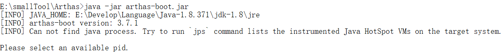

# 概述


# 快速入门

- 当计算机中并无 Java 子进程在运行时，直接启动 arthas 会退出，如图所示

  

- 如果端口被占用，可以通过以下命令换另外一个端口号执行：

  ```bash
  java -jar arthas-boot.jar --lelnet-port 9998 --http-port -1
  ```

  

# 安装


# 命令列表


## reset

**功能**

重置增强类，将被 Arthas 增强过的类全部还原，Arthas 服务端`stop`时会重置所有增强过的类。

只会还原当前会话所增强过的类。

**参数**

```bash
$ reset -h
 USAGE:
   reset [-h] [-E] [class-pattern]

 SUMMARY:
   Reset all the enhanced classes

 EXAMPLES:
   reset
   reset *List
   reset -E .*List

 OPTIONS:
 -h, --help                                        帮助手册
 -E, --regex                                       启用正则表达式匹配，默认情况下是通配符匹配
 <class-pattern>                                   匹配模式
```

**示例**

```bash
# 还原指定类
$ reset Test
Affect(class-cnt:1 , method-cnt:0) cost in 11 ms.

# 还原所有类
$ reset
Affect(class-cnt:1 , method-cnt:0) cost in 9 ms.
```


## version

**功能**

输出当前目标 Java 进程所加载的 Arthas 版本号

**示例**

```bash
$ version
3.7.1
```


### history

**功能**

打印指令历史（包含当前指令）

> 历史指令会通过一个名叫 history 的文件持久化，所以 history 指令可以查看当前 arthas 服务器的所有历史命令，而不仅只是当前次会话使用过的命令

**参数**

| 参数名称 | 参数说明                                |
| -------- | --------------------------------------- |
| n        | 显示最近执行的 n 条指令（包含当前指令） |
| c        | 清空历史指令                            |

> 离谱的设计
>
> 使用参数 n 时要这样：`history 5`
>
> 而使用参数 c 是要这样：`history -c`，并且不会有任何输出，也不会记录该条指令到 history 中。该条指令的副作用是使 ↑ 和 ↓ 失效

**示例**

```bash
#查看最近执行的3条指令
$ history 3
  269  thread
  270  cls
  271  history 3

 #清空指令
 $ history -c
 $ history 3
  1  history 3
```


## quit

退出当前 Arthas 客户端，其他 Arthas 客户端不受影响。等同于**exit**、**logout**、**q**三个指令。

> 只是退出当前 Arthas 客户端，Arthas 的服务器端并没有关闭，所做的修改也不会被重置。


## stop

关闭 Arthas 服务端，所有 Arthas 客户端全部退出。

> 关闭 Arthas 服务器之前，会重置掉所有做过的增强类。但是用 redefine 重加载的类内容不会被重置。