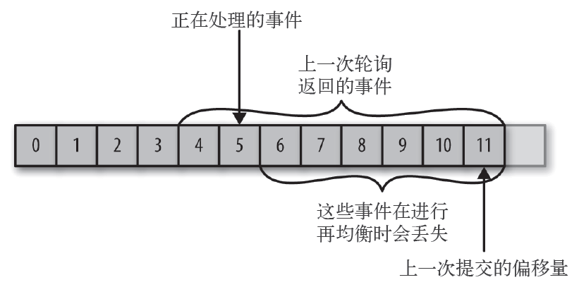

# 第 1 章 初始 Kafka

数据为企业的发展提供动力。我们从数据中获取信息，对它们进行分析处理，然后生成更多的数据。每个应用程序都会产生数据，包括日志消息、度量指标、用户活动记录、响应消息等。数据的点点滴滴都在暗示一些重要的事情，比如下一步行动的方向。我们把数据从源头移动到可以对它们进行分析处理的地方，然后把得到的结果应用到实际场景中，这样才能够确切地知道这些数据要告诉我们什么。例如，我们每天在 Amazon 网站上浏览感兴趣的商品，浏览信息被转化成商品推荐，并在稍后展示给我们。

这个过程完成得越快，组织的反应就越敏捷。花费越少的精力在数据移动上，就越能专注于核心业务。这就是为什么在一个以数据为驱动的企业里，数据管道会成为关键性组件。如何移动数据，几乎变得与数据本身一样重要。

> 每一次科学家们发生分歧，都是因为掌握的数据不够充分。所以我们可以先就获取哪一类数据达成一致。只要获取了数据，问题也就迎刃而解了。要么我是对的，要么你是对的，要么我们都是错的。然后我们继续研究。
> ——Neil deGrasse Tyson

## 1.1 发布与订阅消息系统

在正式讨论 Apache Kafka（以下简称 Kafka）之前，先来了解发布与订阅消息系统的概念，并认识这个系统的重要性。数据（消息）的发送者（发布者）不会直接把消息发送给接收者，这是发布与订阅消息系统的一个特点。发布者以某种方式对消息进行分类，接收者（订阅者）订阅它们，以便接收特定类型的消息。发布与订阅系统一般会有一个 broker，也就是发布消息的中心点。

### 1.1.1 如何开始
发布与订阅消息系统的大部分应用场景都是从一个简单的消息队列或一个进程间通道开始的。例如，你的应用程序需要往别处发送监控信息，可以直接在你的应用程序和另一个可以在仪表盘上显示度量指标的应用程序之间建立连接，然后通过这个连接推送度量指标，如图所示。


这是刚接触监控系统时简单问题的应对方案。过了不久，你需要分析更长时间片段的度量指标，而此时的仪表盘程序满足不了需求，于是，你启动了一个新的服务来接收度量指标。该服务把度量指标保存起来，然后进行分析。与此同时，你修改了原来的应用程序，把度量指标同时发送到两个仪表盘系统上。现在，你又多了 3 个可以生成度量指标的应用程序，它们都与这两个服务直接相连。而你的同事认为最好可以对这些服务进行轮询以便获得告警功能，于是你为每一个应用程序增加了一个服务器，用于提供度量指标。再过一阵子，有更多的应用程序出于各自的目的，都从这些服务器获取度量指标。这时的架构看起来就像下图所示的那样，节点间的连接一团糟。


这时，技术债务开始凸显出来，于是你决定偿还掉一些。你创建了一个独立的应用程序，用于接收来自其他应用程序的度量指标，并为其他系统提供了一个查询服务器。这样，之前架构的复杂度被降低到下图所示的那样。那么恭喜你，你已经创建了一个基于发布与订阅的消息系统。


### 1.1.2 独立的队列系统

在你跟度量指标打得不可开交的时候，你的一个同事也正在跟日志消息奋战。还有另一个同事正在跟踪网站用户的行为，为负责机器学习开发的同事提供信息，同时为管理团队生成报告。你和同事们使用相同的方式创建这些系统，解耦信息的发布者和订阅者。下图所示的架构包含了 3 个独立的发布与订阅系统。


这种方式比直接使用点对点的连接要好得多，但这里有太多重复的地方。你的公司因此要为数据队列维护多个系统，每个系统又有各自的缺陷和不足。而且，接下来可能会有更多的场景需要用到消息系统。此时，你真正需要的是一个单一的集中式系统，它可以用来发布通用类型的数据，其规模可以随着公司业务的增长而增长。

## 1.2 Kafka登场
Kafka 就是为了解决上述问题而设计的一款基于发布与订阅的消息系统。它一般被称为“分布式提交日志”或者“分布式流平台”。文件系统或数据库提交日志用来提供所有事务的持久记录，通过重放这些日志可以重建系统的状态。同样地，Kafka 的数据是按照一定顺序持久化保存的，可以按需读取。此外，Kafka 的数据分布在整个系统里，具备数据故障保护和性能伸缩能力。

### 1.2.1 消息和批次
Kafka 的数据单元被称为消息。如果你在使用 Kafka 之前已经有数据库使用经验，那么可以把消息看成是数据库里的一个“数据行”或一条“记录”。消息由字节数组组成，所以对于 Kafka 来说，消息里的数据没有特别的格式或含义。消息可以有一个可选的元数据，也就是键。键也是一个字节数组，与消息一样，对于 Kafka 来说也没有特殊的含义。当消息以一种可控的方式写入不同的分区时，会用到键。最简单的例子就是为键生成一个一致性散列值，然后使用散列值对主题分区数进行取模，为消息选取分区。这样可以保证具有相同键的消息总是被写到相同的分区上。第 3 章将详细介绍键的用法。

为了提高效率，消息被分批次写入 Kafka。批次就是一组消息，这些消息属于同一个主题和分区。如果每一个消息都单独穿行于网络，会导致大量的网络开销，把消息分成批次传输可以减少网络开销。不过，这要在时间延迟和吞吐量之间作出权衡：批次越大，单位时间内处理的消息就越多，单个消息的传输时间就越长。批次数据会被压缩，这样可以提升数据的传输和存储能力，但要做更多的计算处理。

### 1.2.2 模式

对于 Kafka 来说，消息不过是晦涩难懂的字节数组，所以有人建议用一些额外的结构来定义消息内容，让它们更易于理解。根据应用程序的需求，消息模式（schema）有许多可用的选项。像 JSON 和 XML 这些简单的系统，不仅易用，而且可读性好。不过，它们缺乏强类型处理能力，不同版本之间的兼容性也不是很好。Kafka 的许多开发者喜欢使用 Apache Avro，它最初是为 Hadoop 开发的一款序列化框架。Avro 提供了一种紧凑的序列化格式，模式和消息体是分开的，当模式发生变化时，不需要重新生成代码；它还支持强类型和模式进化，其版本既向前兼容，也向后兼容。

数据格式的一致性对于 Kafka 来说很重要，它消除了消息读写操作之间的耦合性。如果读写操作紧密地耦合在一起，消息订阅者需要升级应用程序才能同时处理新旧两种数据格式。在消息订阅者升级了之后，消息发布者才能跟着升级，以便使用新的数据格式。新的应用程序如果需要使用数据，就要与消息发布者发生耦合，导致开发者需要做很多繁杂的工作。定义良好的模式，并把它们存放在公共仓库，可以方便我们理解 Kafka 的消息结构。第 3 章将详细讨论模式和序列化。

### 1.2.3 主体和分区

Kafka 的消息通过主题进行分类。主题就好比数据库的表，或者文件系统里的文件夹。主题可以被分为若干个分区，一个分区就是一个提交日志。消息以追加的方式写入分区，然后以先入先出的顺序读取。要注意，由于一个主题一般包含几个分区，因此无法在整个主题范围内保证消息的顺序，但可以保证消息在单个分区内的顺序。下图所示的主题有 4 个分区，消息被追加写入每个分区的尾部。Kafka 通过分区来实现数据冗余和伸缩性。分区可以分布在不同的服务器上，也就是说，一个主题可以横跨多个服务器，以此来提供比单个服务器更强大的性能。


我们通常会使用流这个词来描述 Kafka 这类系统的数据。很多时候，人们把一个主题的数据看成一个流，不管它有多少个分区。流是一组从生产者移动到消费者的数据。当我们讨论流式处理时，一般都是这样描述消息的。Kafka Streams、Apache Samza 和 Storm 这些框架以实时的方式处理消息，也就是所谓的流式处理。我们可以将流式处理与离线处理进行比较，比如 Hadoop 就是被设计用于在稍后某个时刻处理大量的数据。第 11 章将会介绍流式处理。

### 1.2.4 生产者和消费者

Kafka 的客户端就是 Kafka 系统的用户，它们被分为两种基本类型：生产者和消费者。除此之外，还有其他高级客户端 API ——用于数据集成的 Kafka Connect API 和用于流式处理的 Kafka Streams。这些高级客户端 API 使用生产者和消费者作为内部组件，提供了高级的功能。

生产者创建消息。在其他发布与订阅系统中，生产者可能被称为发布者或写入者。一般情况下，一个消息会被发布到一个特定的主题上。生产者在默认情况下把消息均衡地分布到主题的所有分区上，而并不关心特定消息会被写到哪个分区。不过，在某些情况下，生产者会把消息直接写到指定的分区。这通常是通过消息键和分区器来实现的，分区器为键生成一个散列值，并将其映射到指定的分区上。这样可以保证包含同一个键的消息会被写到同一个分区上。生产者也可以使用自定义的分区器，根据不同的业务规则将消息映射到分区。第 3 章将详细介绍生产者。

消费者读取消息。在其他发布与订阅系统中，消费者可能被称为订阅者或读者。消费者订阅一个或多个主题，并按照消息生成的顺序读取它们。消费者通过检查消息的偏移量来区分已经读取过的消息。偏移量是另一种元数据，它是一个不断递增的整数值，在创建消息时，Kafka 会把它添加到消息里。在给定的分区里，每个消息的偏移量都是唯一的。消费者把每个分区最后读取的消息偏移量保存在 Zookeeper 或 Kafka 上，如果消费者关闭或重启，它的读取状态不会丢失。

消费者是消费者群组的一部分，也就是说，会有一个或多个消费者共同读取一个主题。群组保证每个分区只能被一个消费者使用。下图所示的群组中，有 3 个消费者同时读取一个主题。其中的两个消费者各自读取一个分区，另外一个消费者读取其他两个分区。消费者与分区之间的映射通常被称为消费者对分区的所有权关系。

通过这种方式，消费者可以消费包含大量消息的主题。而且，如果一个消费者失效，群组里的其他消费者可以接管失效消费者的工作。第 4 章将详细介绍消费者和消费者群组。


### 1.2.5 broker 和集群

一个独立的 Kafka 服务器被称为 broker。broker 接收来自生产者的消息，为消息设置偏移量，并提交消息到磁盘保存。broker 为消费者提供服务，对读取分区的请求作出响应，返回已经提交到磁盘上的消息。根据特定的硬件及其性能特征，单个 broker 可以轻松处理数千个分区以及每秒百万级的消息量。

broker 是集群的组成部分。每个集群都有一个 broker 同时充当了集群控制器的角色（自动从集群的活跃成员中选举出来）。控制器负责管理工作，包括将分区分配给 broker 和监控 broker。在集群中，一个分区从属于一个broker，该 broker 被称为分区的首领。一个分区可以分配给多个 broker，这个时候会发生分区复制（见下图）。这种复制机制为分区提供了消息冗余，如果有一个 broker 失效，其他 broker 可以接管领导权。不过，相关的消费者和生产者都要重新连接到新的首领。第 6 章将详细介绍集群的操作，包括分区复制。


保留消息（在一定期限内）是 Kafka 的一个重要特性。Kafka broker 默认的消息保留策略是这样的：要么保留一段时间（比如 7 天），要么保留到消息达到一定大小的字节数（比如 1GB）。当消息数量达到这些上限时，旧消息就会过期并被删除，所以在任何时刻，可用消息的总量都不会超过配置参数所指定的大小。主题可以配置自己的保留策略，可以将消息保留到不再使用它们为止。例如，用于跟踪用户活动的数据可能需要保留几天，而应用程序的度量指标可能只需要保留几个小时。可以通过配置把主题当作紧凑型日志，只有最后一个带有特定键的消息会被保留下来。这种情况对于变更日志类型的数据来说比较适用，因为人们只关心最后时刻发生的那个变更。

### 1.2.6 多集群

随着 Kafka 部署数量的增加，基于以下几点原因，最好使用多个集群。

- 数据类型分离
- 安全需求隔离
- 多数据中心（灾难恢复）

如果使用多个数据中心，就需要在它们之间复制消息。这样，在线应用程序才可以访问到多个站点的用户活动信息。例如，如果一个用户修改了他们的资料信息，不管从哪个数据中心都应该能看到这些改动。或者多个站点的监控数据可以被聚集到一个部署了分析程序和告警系统的中心位置。不过，Kafka 的消息复制机制只能在单个集群里进行，不能在多个集群之间进行。

Kafka 提供了一个叫作 MirrorMaker 的工具， 可以用它来实现集群间的消息复制。MirrorMaker 的核心组件包含了一个生产者和一个消费者，两者之间通过一个队列相连。消费者从一个集群读取消息，生产者把消息发送到另一个集群上。下图展示了一个使用 MirrorMaker 的例子，两个“本地”集群的消息被聚集到一个“聚合”集群上，然后将
该集群复制到其他数据中心。不过，这种方式在创建复杂的数据管道方面显得有点力不从心。第 7 章将详细讨论这些案例。


## 1.3 为什么选择Kafka
基于发布与订阅的消息系统那么多，为什么 Kafka 会是一个更好的选择呢？

### 1.3.1 多个生产者

Kafka 可以无缝地支持多个生产者，不管客户端在使用单个主题还是多个主题。所以它很适合用来从多个前端系统收集数据，并以统一的格式对外提供数据。例如，一个包含了多个微服务的网站，可以为页面视图创建一个单独的主题，所有服务都以相同的消息格式向该主题写入数据。消费者应用程序会获得统一的页面视图，而无需协调来自不同生产者的数据流。

### 1.3.2 多个消费者
除了支持多个生产者外，Kafka 也支持多个消费者从一个单独的消息流上读取数据，而且消费者之间互不影响。这与其他队列系统不同，其他队列系统的消息一旦被一个客户端读取，其他客户端就无法再读取它。另外，多个消费者可以组成一个群组，它们共享一个消息流，并保证整个群组对每个给定的消息只处理一次。

### 1.3.3 基于磁盘的数据存储
Kafka 不仅支持多个消费者，还允许消费者非实时地读取消息，这要归功于 Kafka 的数据保留特性。消息被提交到磁盘，根据设置的保留规则进行保存。每个主题可以设置单独的保留规则，以便满足不同消费者的需求，各个主题可以保留不同数量的消息。消费者可能会因为处理速度慢或突发的流量高峰导致无法及时读取消息，而持久化数据可以保证数据不会丢失。消费者可以在进行应用程序维护时离线一小段时间，而无需担心消息丢失或堵塞在生产者端。消费者可以被关闭，但消息会继续保留在 Kafka 里。消费者可以从上次中断的地方继续处理消息。

### 1.3.4 伸缩性

为了能够轻松处理大量数据，Kafka 从一开始就被设计成一个具有灵活伸缩性的系统。用户在开发阶段可以先使用单个 broker，再扩展到包含 3 个 broker 的小型开发集群，然后随着数据量不断增长，部署到生产环境的集群可能包含上百个 broker。对在线集群进行扩展丝毫不影响整体系统的可用性。也就是说，一个包含多个 broker 的集群，即使个别 broker 失效，仍然可以持续地为客户提供服务。要提高集群的容错能力，需要配置较高的复制系
数。第 6 章将讨论关于复制的更多细节。

### 1.3.5 高性能
上面提到的所有特性，让 Kafka 成为了一个高性能的发布与订阅消息系统。通过横向扩展生产者、消费者和broker，Kafka 可以轻松处理巨大的消息流。在处理大量数据的同时，它还能保证亚秒级的消息延迟。

## 1.4 数据生态系统
已经有很多应用程序加入到了数据处理的大军中。我们定义了输入和应用程序，负责生成数据或者把数据引入系统。我们定义了输出，它们可以是度量指标、报告或者其他类型的数据。我们创建了一些循环，使用一些组件从系统读取数据，对读取的数据进行处理，然后把它们导到数据基础设施上，以备不时之需。数据类型可以多种多样，每一种数据类型可以有不同的内容、大小和用途。

Kafka 为数据生态系统带来了循环系统，如下图所示。它在基础设施的各个组件之间传递消息，为所有客户端提供一致的接口。当与提供消息模式的系统集成时，生产者和消费者之间不再有紧密的耦合，也不需要在它们之间建立任何类型的直连。我们可以根据业务需要添加或移除组件，因为生产者不再关心谁在使用数据，也不关心有多少个消费者。


下面是一些典型的使用场景：

1. 活动跟踪

   Kafka 最初的使用场景是跟踪用户的活动。网站用户与前端应用程序发生交互，前端应用程序生成用户活动相关的消息。这些消息可以是一些静态的信息，比如页面访问次数和点击量，也可以是一些复杂的操作，比如添加用户资料。这些消息被发布到一个或多个主题上，由后端应用程序负责读取。这样，我们就可以生成报告，为机器学习系统提供数据，更新搜索结果，或者实现其他更多的功能。

2. 传递消息

   Kafka 的另一个基本用途是传递消息。应用程序向用户发送通知（比如邮件）就是通过传递消息来实现的。这些应用程序组件可以生成消息，而不需要关心消息的格式，也不需要关心消息是如何被发送的。一个公共应用程序会读取这些消息，对它们进行处理：

   - 格式化消息（也就是所谓的装饰）；
   - 将多个消息放在同一个通知里发送；
   - 根据用户配置的首选项来发送数据。

   使用公共组件的好处在于，不需要在多个应用程序上开发重复的功能，而且可以在公共组件上做一些有趣的转换，比如把多个消息聚合成一个单独的通知，而这些工作是无法在其他地方完成的。

3. 度量指标和日志记录

   Kafka 也可以用于收集应用程序和系统度量指标以及日志。Kafka 支持多个生产者的特性在这个时候就可以派上用场。应用程序定期把度量指标发布到 Kafka 主题上，监控系统或告警系统读取这些消息。Kafka 也可以用在像 Hadoop 这样的离线系统上，进行较长时间片段的数据分析，比如年度增长走势预测。日志消息也可以被发布到 Kafka 主题上，然后被路由到专门的日志搜索系统（比如 Elasticsearch）或安全分析应用程序。更改目标系统（比如日志存储系统）不会影响到前端应用或聚合方法，这是 Kafka 的另一个优点。

4. 提交日志

   Kafka 的基本概念来源于提交日志，所以使用 Kafka 作为提交日志是件顺理成章的事。我们可以把数据库的更新发布到 Kafka 上，应用程序通过监控事件流来接收数据库的实时更新。这种变更日志流也可以用于把数据库的更新复制到远程系统上，或者合并多个应用程序的更新到一个单独的数据库视图上。数据持久化为变更日志提供了缓冲区，也就是说，如果消费者应用程序发生故障，可以通过重放这些日志来恢复系统状态。另外，紧凑型日志主题只为每个键保留一个变更数据，所以可以长时间使用，不需要担心消息过期问题。

5. 流处理

   流处理是又一个能提供多种类型应用程序的领域。可以说，它们提供的功能与 Hadoop 里的 map 和 reduce 有点类似，只不过它们操作的是实时数据流，而 Hadoop 则处理更长时间片段的数据，可能是几个小时或者几天，Hadoop 会对这些数据进行批处理。通过使用流式处理框架，用户可以编写小型应用程序来操作 Kafka 消息，比如计算度量指标，为其他应用程序有效地处理消息分区，或者对来自多个数据源的消息进行转换。第11 章将通过其他案例介绍流处理。

## 1.5 起源故事
Kafka 是为了解决 LinkedIn 数据管道问题应运而生的。它的设计目的是提供一个高性能的消息系统，可以处理多种数据类型，并能够实时提供纯净且结构化的用户活动数据和系统度量指标。

> 数据为我们所做的每一件事提供了动力。
> ——Jeff Weiner，LinkedIn CEO

### 1.5.1 LinkedIn 的问题
本章开头提到过，LinkedIn 有一个数据收集系统和应用程序指标，它使用自定义的收集器和一些开源工具来保存和展示内部数据。除了跟踪 CPU 使用率和应用性能这些一般性指标外，LinkedIn 还有一个比较复杂的用户请求跟踪功能。它使用了监控系统，可以跟踪单个用户的请求是如何在内部应用间传播的。不过监控系统存在很多不足。它使用的是轮询拉取度量指标的方式，指标之间的时间间隔较长，而且没有自助服务能力。它使用起来不太方便，很多简单的任务需要人工介入才能完成，而且一致性较差，同一个度量指标的名字在不同系统里的叫法不一样。

与此同时，我们还创建了另一个用于收集用户活动信息的系统。这是一个 HTTP 服务，前端的服务器会定期连接进来，在上面发布一些消息（XML 格式）。这些消息文件被转移到线下进行解析和校对。同样，这个系统也存在很多不足。XML 文件的格式无法保持一致，而且解析 XML 文件非常耗费计算资源。要想更改所创建的活动类型，需要在前端应用和离线处理程序之间做大量的协调工作。即使是这样，在更改数据结构时，仍然经常出现系统崩溃现象。而且批处理时间以小时计算，无法用它完成实时的任务。

监控和用户活动跟踪无法使用同一个后端服务。监控服务太过笨重，数据格式不适用于活动跟踪，而且无法在活动跟踪中使用轮询拉取模型。另一方面，把跟踪服务用在度量指标上也过于脆弱，批处理模型不适用于实时的监控和告警。不过，好在数据间存在很多共性，信息（比如特定类型的用户活动对应用程序性能的影响）之间的关联度还是很高的。特定类型用户活动数量的下降说明相关应用程序存在问题，不过批处理的长时间延迟意味着无法对这类问题作出及时的反馈。

最开始，我们调研了一些现成的开源解决方案，希望能够找到一个系统，可以实时访问数据，并通过横向扩展来处理大量的消息。我们使用 ActiveMQ 创建了一个原型系统，但它当时还无法满足横向扩展的需求。LinkedIn 不得不使用这种脆弱的解决方案，虽然 ActiveMQ 有很多缺陷会导致 broker 暂停服务。客户端的连接因此被阻塞，处理用户请求的能力也受到影响。于是我们最后决定构建自己的基础设施。

### 1.5.2 Kafka 的诞生

LinkedIn 的开发团队由 Jay Kreps 领导。Jay Kreps 是 LinkedIn 的首席工程师，之前负责分布式键值存储系统Voldemort 的开发。初建团队成员还包括 Neha Narkhede，不久之后，Jun Rao 也加入了进来。他们一起着手创建一个消息系统，可以同时满足上述的两种需求，并且可以在未来进行横向扩展。他们的主要目标如下：

- 使用推送和拉取模型解耦生产者和消费者；
- 为消息传递系统中的消息提供数据持久化，以便支持多个消费者；
- 通过系统优化实现高吞吐量；
- 系统可以随着数据流的增长进行横向扩展。

最后我们看到的这个发布与订阅消息系统具有典型的消息系统接口，但从存储层来看，它更像是一个日志聚合系统。Kafka 使用 Avro 作为消息序列化框架，每天高效地处理数十亿级别的度量指标和用户活动跟踪信息。LinkedIn 已经拥有超过万亿级别的消息使用量（截止到 2015 年 8 月），而且每天仍然需要处理超过千万亿字节的数据。

### 1.5.3 走向开源
2010 年底，Kafka 作为开源项目在 GitHub 上发布。2011 年 7 月，因为倍受开源社区的关注，它成为 Apache 软件基金会的孵化器项目。2012 年 10 月，Kafka 从孵化器项目毕业。从那时起，来自 LinkedIn 内部的开发团队一直为 Kafka 提供大力支持，而且吸引了大批来自 LinkedIn 外部的贡献者和参与者。现在，Kafka 被很多组织用在一些大型的数据管道上。2014 年秋天，Jay Kreps、Neha Narkhede 和 Jun Rao 离开 LinkedIn，创办了Confluent。

Confluent 是一个致力于为企业开发提供支持、为 Kafka 提供培训的公司。这两家公司连同来自开源社区持续增长的贡献力量，一直在开发和维护 Kafka，让 Kafka 成为大数据管道的不二之选。

### 1.5.4 命名
关于 Kafka 的历史，人们经常会问到的一个问题就是，Kafka 这个名字是怎么想出来的，以及这个名字和这个项目之间有着怎样的联系。对于这个问题，Jay Kreps 解释如下：

> 我想既然 Kafka 是为了写数据而产生的，那么用作家的名字来命名会显得更有意义。我在大学时期上过很多文学课程，很喜欢 Franz Kafka。况且，对于开源项目来说，这个名字听起来很酷。因此，名字和应用本身基本没有太多联系。

## 1.6 开始Kafka之旅
现在我们对 Kafka 已经有了一个大体的了解，还知道了一些常见的术语，接下来可以开始使用 Kafka 来创建数据管道了。在下一章，我们将探究如何安装和配置 Kafka，还会讨论如何选择合适的硬件来运行 Kafka，以及把Kafka 应用到生产环境需要注意的事项。


# 第 2 章 安装 Kafka

// TODO


# 第 3 章 Kafka 生产者

不管是把 Kafka 作为消息队列、消息总线还是数据存储平台来使用，总是需要有一个可以往 Kafka 写入数据的生产者和一个可以从 Kafka 读取数据的消费者，或者一个兼具两种角色的应用程序。

例如，在一个信用卡事务处理系统里，有一个客户端应用程序，它可能是一个在线商店，每当有支付行为发生时，它负责把事务发送到 Kafka 上。另一个应用程序根据规则引擎检查这个事务，决定是批准还是拒绝。批准或拒绝的响应消息被写回 Kafka，然后发送给发起事务的在线商店。第三个应用程序从 Kafka 上读取事务和审核状态，把它们保存到数据库，随后分析师可以对这些结果进行分析，或许还能借此改进规则引擎。

开发者们可以使用 Kafka 内置的客户端 API 开发 Kafka 应用程序。

在这一章，我们将从 Kafka 生产者的设计和组件讲起，学习如何使用 Kafka 生产者。我们将演示如何创建KafkaProducer 和 ProducerRecords 对象、如何将记录发送给 Kafka，以及如何处理从 Kafka 返回的错误，然后介绍用于控制生产者行为的重要配置选项，最后深入探讨如何使用不同的分区方法和序列化器，以及如何自定义序列化器和分区器。

在第 4 章，我们将会介绍 Kafka 的消费者客户端，以及如何从 Kafka 读取消息。

> 第三方客户端
>
> 除了内置的客户端外，Kafka 还提供了二进制连接协议，也就是说，我们直接向 Kafka 网络端口发送适当的字节序列，就可以实现从 Kafka 读取消息或往 Kafka 写入消息。还有很多用其他语言实现的 Kafka 客户端，比如 C++、Python、Go 语言等，它们都实现了 Kafka 的连接协议，使得 Kafka 不仅仅局限于在 Java 里使用。这些客户端不属于 Kafka 项目，不过 Kafka 项目 wiki 上提供了一个清单，列出了所有可用的客户端。连接协议和第三方客户端超出了本章的讨论范围。

## 3.1 生产者概览
一个应用程序在很多情况下需要往 Kafka 写入消息：记录用户的活动（用于审计和分析）、记录度量指标、保存日志消息、记录智能家电的信息、与其他应用程序进行异步通信、缓冲即将写入到数据库的数据，等等。

多样的使用场景意味着多样的需求：是否每个消息都很重要？是否允许丢失一小部分消息？偶尔出现重复消息是否可以接受？是否有严格的延迟和吞吐量要求？

在之前提到的信用卡事务处理系统里，消息丢失或消息重复是不允许的，可以接受的延迟最大为 500ms，对吞吐量要求较高——我们希望每秒钟可以处理一百万个消息。

保存网站的点击信息是另一种使用场景。在这个场景里，允许丢失少量的消息或出现少量的消息重复，延迟可以高一些，只要不影响用户体验就行。换句话说，只要用户点击链接后可以马上加载页面，那么我们并不介意消息要在几秒钟之后才能到达 Kafka 服务器。吞吐量则取决于网站用户使用网站的频度。

不同的使用场景对生产者 API 的使用和配置会有直接的影响。

尽管生产者 API 使用起来很简单，但消息的发送过程还是有点复杂的。下图展示了向 Kafka 发送消息的主要步骤。


我们从创建一个 ProducerRecord 对象开始，ProducerRecord 对象需要包含目标主题和要发送的内容。我们还可以指定键或分区。在发送 ProducerRecord 对象时，生产者要先把键和值对象序列化成字节数组，这样它们才能够在网络上传输。

接下来，数据被传给分区器。如果之前在 ProducerRecord 对象里指定了分区，那么分区器就不会再做任何事情，直接把指定的分区返回。如果没有指定分区，那么分区器会根据 ProducerRecord 对象的键来选择一个分区。选好分区以后，生产者就知道该往哪个主题和分区发送这条记录了。紧接着，这条记录被添加到一个记录批次里，这个批次里的所有消息会被发送到相同的主题和分区上。有一个独立的线程负责把这些记录批次发送到相应的
broker 上。

服务器在收到这些消息时会返回一个响应。如果消息成功写入 Kafka，就返回一个 RecordMetaData 对象，它包含了主题和分区信息，以及记录在分区里的偏移量。如果写入失败，则会返回一个错误。生产者在收到错误之后会尝试重新发送消息，几次之后如果还是失败，就返回错误信息。

## 3.2 创建 Kafka 生产者
要往 Kafka 写入消息，首先要创建一个生产者对象，并设置一些属性。Kafka 生产者有 3 个必选的属性。

- bootstrap.servers

  该属性指定 broker 的地址清单，地址的格式为 `host:port`。**清单里不需要包含所有的 broker 地址，生产者会从给定的 broker 里查找到其他 broker 的信息**。不过建议至少要提供两个 broker 的信息，一旦其中一个宕机，生产者仍然能够连接到集群上。

- key.serializer

  broker 希望接收到的消息的键和值都是字节数组。生产者接口允许使用参数化类型，因此可以把 Java 对象作为键和值发送给 broker。这样的代码具有良好的可读性，不过生产者需要知道如何把这些 Java 对象转换成字节数组。key.serializer 必须被设置为一个实现了 `org.apache.kafka.common.serialization.Serializer` 接口的类，生产者会使用这个类把键对象序列化成字节数组。Kafka 客户端默认提供了 ByteArraySerializer
  （这个只做很少的事情）、StringSerializer 和 IntegerSerializer，因此，如果你只使用常见的几种 Java 对象类型，那么就没必要实现自己的序列化器。要注意，**key.serializer 是必须设置的，就算你打算只发送值内容**。

- value.serializer

  与 key.serializer 一样，value.serializer 指定的类会将值序列化。如果键和值都是字符串，可以使用与key.serializer 一样的序列化器。如果键是整数类型而值是字符串，那么需要使用不同的序列化器。

下面的代码片段演示了如何创建一个新的生产者，这里只指定了必要的属性，其他使用默认设置。

```java
private Properties kafkaProps = new Properties(); // 1
kafkaProps.put("bootstrap.servers", "broker1:9092,broker2:9092");
kafkaProps.put("key.serializer",
               "org.apache.kafka.common.serialization.StringSerializer"); // 2
kafkaProps.put("value.serializer",
               "org.apache.kafka.common.serialization.StringSerializer");
producer = new KafkaProducer<String, String>(kafkaProps); // 3
```

1. 新建一个 Properties 对象。
2. 因为我们打算把键和值定义成字符串类型，所以使用内置的 StringSerializer。
3. 在这里我们创建了一个新的生产者对象，并为键和值设置了恰当的类型，然后把 Properties 对象传给它。

这个接口很简单，通过配置生产者的不同属性就可以很大程度地控制它的行为。Kafka 的文档涵盖了所有的配置参数，我们将在这一章的后面部分介绍其中几个比较重要的参数。

实例化生产者对象后，接下来就可以开始发送消息了。发送消息主要有以下 3 种方式。

- 发送并忘记（fire-and-forget）

  我们把消息发送给服务器，但并不关心它是否正常到达。大多数情况下，消息会正常到达，因为 Kafka 是高可用的，而且生产者会自动尝试重发。不过，使用这种方式有时候也会丢失一些消息。

- 同步发送

  我们使用 send() 方法发送消息，它会返回一个 Future 对象，调用 get() 方法进行等待，就可以知道消息是否发送成功。

- 异步发送

  我们调用 send() 方法，并指定一个回调函数，服务器在返回响应时调用该函数。

在下面的几个例子中，我们会介绍如何使用上述几种方式来发送消息，以及如何处理可能发生的异常情况。

本章的所有例子都使用单线程，但其实生产者是可以使用多线程来发送消息的。刚开始的时候可以使用单个消费者和单个线程。如果需要更高的吞吐量，可以在生产者数量不变的前提下增加线程数量。如果这样做还不够，可以增加生产者数量。

## 3.3 发送消息到 Kafka
最简单的消息发送方式如下所示：

```java
ProducerRecord<String, String> record = 
    new ProducerRecord<>("CustomerCountry", "Precision Products", "France"); // 1
try {
    producer.send(record); // 2
} catch (Exception e) {
    e.printStackTrace(); // 3
}
```

1. 生产者的 send() 方法将 ProducerRecord 对象作为参数， 所以我们要先创建一个 ProducerRecord 对象。ProducerRecord 有多个构造函数，稍后我们会详细讨论。这里使用其中一个构造函数，它需要目标主题的名字和要发送的键和值对象，它们都是字符串。键和值对象的类型必须与序列化器和生产者对象相匹配。
2. 我们使用生产者的 send() 方法发送 ProducerRecord 对象。从生产者的架构图里可以看到，消息先是被放进缓冲区，然后使用单独的线程发送到服务器端。send() 方法会返回一个包含 RecordMetadata 的 Future 对象，不过因为我们会忽略返回值，所以无法知道消息是否发送成功。如果不关心发送结果，那么可以使用这种发送方式。比如，记录 Twitter 消息日志，或记录不太重要的应用程序日志。
3. 我们可以忽略发送消息时可能发生的错误或在服务器端可能发生的错误，但在发送消息之前，生产者还是有可能发生其他的异常。这些异常有可能是 SerializationException（说明序列化消息失败）、BufferExhaustedException 或 TimeoutException（说明缓冲区已满），又或者是 InterruptException（说明发送线程被中断）

### 3.3.1 同步发送消息
最简单的同步发送消息方式如下所示：

```java
ProducerRecord<String, String> record =
    new ProducerRecord<>("CustomerCountry", "Precision Products", "France");
try {
    producer.send(record).get(); // 1
} catch (Exception e) {
    e.printStackTrace(); // 2
}
```

1. 在这里，producer.send() 方法先返回一个 Future 对象，然后调用 Future 对象的 get() 方法等待 Kafka 响应。如果服务器返回错误，get() 方法会抛出异常。如果没有发生错误，我们会得到一个 RecordMetadata 对象，可以用它获取消息的偏移量。
2. 如果在发送数据之前或者在发送过程中发生了任何错误，比如 broker 返回了一个不允许重发消息的异常或者已经超过了重发的次数，那么就会抛出异常。我们只是简单地把异常信息打印出来。

KafkaProducer 一般会发生两类错误。其中一类是可重试错误，这类错误可以通过重发消息来解决。比如对于连接错误，可以通过再次建立连接来解决，“无主（no leader）”错误则可以通过重新为分区选举首领来解决。KafkaProducer 可以被配置成自动重试，如果在多次重试后仍无法解决问题，应用程序会收到一个重试异常。另一类错误无法通过重试解决，比如“消息太大”异常。对于这类错误，KafkaProducer 不会进行任何重试，直接抛出异常。

### 3.3.2 异步发送消息
假设消息在应用程序和 Kafka 集群之间一个来回需要10ms。如果在发送完每个消息后都等待回应，那么发送 100 个消息需要 1 秒。但如果只发送消息而不等待响应，那么发送 100 个消息所需要的时间会少很多。大多数时候，我们并不需要等待响应——尽管 Kafka会把目标主题、分区信息和消息的偏移量发送回来，但对于发送端的应用程序来说不是必需的。不过在遇到消息发送失败时，我们需要抛出异常、记录错误日志，或者把消息写入“错误消息”文件以便日后分析。

为了在异步发送消息的同时能够对异常情况进行处理，生产者提供了回调支持。下面是使用回调的一个例子。

```java
private class DemoProducerCallback implements Callback { // 1
    @Override
    public void onCompletion(RecordMetadata recordMetadata, Exception e) {
        if (e != null) {
            e.printStackTrace(); // 2
        }
    }
}
ProducerRecord<String, String> record =
    new ProducerRecord<>("CustomerCountry", "Biomedical Materials", "USA"); // 3
producer.send(record, new DemoProducerCallback()); // 4
```

1. 为了使用回调，需要一个实现了 `org.apache.kafka.clients.producer.Callback` 接口的类，这个接口只有一个 onCompletion 方法。
2. 如果 Kafka 返回一个错误，onCompletion 方法会抛出一个非空（non null）异常。这里我们只是简单地把它打印出来，但是在生产环境应该有更好的处理方式。
3. 记录与之前的一样。
4. 在发送消息时传进去一个回调对象。

## 3.4 生产者的配置

到目前为止，我们只介绍了生产者的几个必要配置参数——bootstrap.servers API 以及序列化器。

生产者还有很多可配置的参数，在 Kafka 文档里都有说明，它们大部分都有合理的默认值，所以没有必要去修改它们。不过有几个参数在内存使用、性能和可靠性方面对生产者影响比较大，接下来我们会一一说明。

- acks

  acks 参数指定了必须要有多少个分区副本收到消息，生产者才会认为消息写入是成功的。这个参数对消息丢失的可能性有重要影响。该参数有如下选项：

  - 如果 `acks = 0`，生产者在成功写入消息之前不会等待任何来自服务器的响应。也就是说，如果当中出现了问题，导致服务器没有收到消息，那么生产者就无从得知，消息也就丢失了。不过，因为生产者不需要等待服务器的响应，所以它可以以网络能够支持的最大速度发送消息，从而达到很高的吞吐量。
  - 如果 `acks = 1`，只要集群的首领节点收到消息，生产者就会收到一个来自服务器的成功响应。如果消息无法到达首领节点（比如首领节点崩溃，新的首领还没有被选举出来），生产者会收到一个错误响应，为了避免数据丢失，生产者会重发消息。不过，如果一个没有收到消息的节点成为新首领，消息还是会丢失。这个时候的吞吐量取决于使用的是同步发送还是异步发送。如果让发送客户端等待服务器的响应（通过调用 Future 对象的 get() 方法），显然会增加延迟（在网络上传输一个来回的延迟）。如果客户端使用回调，延迟问题就可以得到缓解，不过吞吐量还是会受发送中消息数量的限制（比如，生产者在收到服务器响应之前可以发送多少个消息）。
  - 如果 `acks = all`，只有当所有参与复制的节点全部收到消息时，生产者才会收到一个来自服务器的成功响应。这种模式是最安全的，它可以保证不止一个服务器收到消息，就算有服务器发生崩溃，整个集群仍然可以运行（第 5 章将讨论更多的细节）。不过，它的延迟比 `acks = 1` 时更高，因为我们要等待不只一个服务器节点接收消息。

- buffer.memory

  该参数用来设置生产者内存缓冲区的大小，生产者用它缓冲要发送到服务器的消息。如果应用程序发送消息的速度超过发送到服务器的速度，会导致生产者空间不足。这个时候，send() 方法调用要么被阻塞，要么抛出异常，取决于如何设置 `block.on.buffer.full` 参数（在 0.9.0.0 版本里被替换成了 `max.block.ms`，表示在抛出异常之前可以阻塞一段时间）。

- compression.type

  默认情况下，消息发送时不会被压缩。该参数可以设置为 snappy、gzip 或 lz4，它指定了消息被发送给broker 之前使用哪一种压缩算法进行压缩。snappy 压缩算法由 Google 发明，它占用较少的 CPU，却能提供较好的性能和相当可观的压缩比，如果比较关注性能和网络带宽，可以使用这种算法。gzip 压缩算法一般会占用较多的 CPU，但会提供更高的压缩比，所以如果网络带宽比较有限，可以使用这种算法。使用压缩可以降低网络传输开销和存储开销，而这往往是向 Kafka 发送消息的瓶颈所在。

- retries

  生产者从服务器收到的错误有可能是临时性的错误（比如分区找不到首领）。在这种情况下，retries 参数的值决定了生产者可以重发消息的次数，如果达到这个次数，生产者会放弃重试并返回错误。默认情况下，生产者会在每次重试之间等待 100ms，不过可以通过 `retry.backoff.ms` 参数来改变这个时间间隔。建议在设置重试次数和重试时间间隔之前，先测试一下恢复一个崩溃节点需要多少时间（比如所有分区选举出首领需要多长时间），让总的重试时间比 Kafka 集群从崩溃中恢复的时间长，否则生产者会过早地放弃重试。不过有些错误不是临时性错误，没办法通过重试来解决（比如“消息太大”错误）。一般情况下，因为生产者会自动进行重试，所以就没必要在代码逻辑里处理那些可重试的错误。你只需要处理那些不可重试的错误或重试次数超出上限的情况。

- batch.size

  当有多个消息需要被发送到同一个分区时，生产者会把它们放在同一个批次里。该参数指定了一个批次可以使用的内存大小，按照字节数计算（而不是消息个数）。当批次被填满，批次里的所有消息会被发送出去。不过生产者并不一定都会等到批次被填满才发送，半满的批次，甚至只包含一个消息的批次也有可能被发送。所以就算把批次大小设置得很大，也不会造成延迟，只是会占用更多的内存而已。但如果设置得太小，因为生产者需要更频繁地发送消息，会增加一些额外的开销。

- linger.ms

  该参数指定了生产者在发送批次之前等待更多消息加入批次的时间。KafkaProducer 会在批次填满或linger.ms 达到上限时把批次发送出去。默认情况下，只要有可用的线程，生产者就会把消息发送出去，就算批次里只有一个消息。把 linger.ms 设置成比 0 大的数，让生产者在发送批次之前等待一会儿，使更多的消息加入到这个批次。虽然这样会增加延迟，但也会提升吞吐量（因为一次性发送更多的消息，每个消息的开销就变小了）。

- client.id

  该参数可以是任意的字符串，服务器会用它来识别消息的来源，还可以用在日志和配额指标里。

- max.in.flight.requests.per.connection

  该参数指定了生产者在收到服务器响应之前可以发送多少个消息。它的值越高，就会占用越多的内存，不过也会提升吞吐量。把它设为 1 可以保证消息是按照发送的顺序写入服务器的，即使发生了重试。

- timeout.ms、request.timeout.ms 和 metadata.fetch.timeout.ms
  `request.timeout.ms` 指定了生产者在发送数据时等待服务器返回响应的时间，`metadata.fetch.timeout.ms` 指定了生产者在获取元数据（比如目标分区的首领是谁）时等待服务器返回响应的时间。如果等待响应超时，那么生产者要么重试发送数据，要么返回一个错误（抛出异常或执行回调）。`timeout.ms` 指定了 broker 等待同步副本返回消息确认的时间，与 asks 的配置相匹配——如果在指定时间内没有收到同步副本的确认，那么 broker 就会返回一个错误。

- max.block.ms

  该参数指定了在调用 send() 方法或使用 partitionsFor() 方法获取元数据时生产者的阻塞时间。当生产者的发送缓冲区已满，或者没有可用的元数据时，这些方法就会阻塞。在阻塞时间达到 `max.block.ms` 时，生产者会抛出超时异常。

- max.request.size

  该参数用于控制生产者发送的请求大小。它可以指能发送的单个消息的最大值，也可以指单个请求里所有消息总的大小。例如，假设这个值为 1MB，那么可以发送的单个最大消息为 1MB，或者生产者可以在单个请求里发送一个批次，该批次包含了 1000 个消息，每个消息大小为 1KB。另外，broker 对可接收的消息最大值也有自己的限制（`message.max.bytes`），所以两边的配置最好可以匹配，避免生产者发送的消息被 broker 拒绝。

- receive.buffer.bytes 和 send.buffer.bytes

  这两个参数分别指定了 TCP socket 接收和发送数据包的缓冲区大小。如果它们被设为 -1，就使用操作系统的默认值。如果生产者或消费者与 broker 处于不同的数据中心，那么可以适当增大这些值，因为跨数据中心的网络一般都有比较高的延迟和比较低的带宽。

> 顺序保证
>
> Kafka 可以保证同一个分区里的消息是有序的。也就是说，如果生产者按照一定的顺序发送消息，broker 就会按照这个顺序把它们写入分区，消费者也会按照同样的顺序读取它们。在某些情况下，顺序是非常重要的。例如，往一个账户存入 100 元再取出来，这个与先取钱再存钱是截然不同的！不过，有些场景对顺序不是很敏感。
>
> 如果把 retries 设为非零整数，同时把 `max.in.flight.requests.per.connection` 设为比 1 大的数，那么，如果第一个批次消息写入失败，而第二个批次写入成功，broker 会重试写入第一个批次。如果此时第一个批次也写入成功，那么两个批次的顺序就反过来了。
>
> 一般来说，如果某些场景要求消息是有序的，那么消息是否写入成功也是很关键的，所以不建议把 retries 设为 0。可以把 `max.in.flight.requests.per.connection` 设为1，这样在生产者尝试发送第一批消息时，就不会有其他的消息发送给 broker。不过这样会严重影响生产者的吞吐量，所以只有在对消息的顺序有严格要求的情况下才能这么做。

## 3.5 序列化器

我们已经在之前的例子里看到，创建一个生产者对象必须指定序列化器。我们已经知道如何使用默认的字符串序列化器，Kafka 还提供了整型和字节数组序列化器，不过它们还不足以满足大部分场景的需求。到最后，我们需要序列化的记录类型会越来越多。

接下来演示如何开发自己的序列化器，并介绍 Avro 序列化器作为推荐的备选方案。

### 3.5.1 自定义序列化器

如果发送到 Kafka 的对象不是简单的字符串或整型，那么可以使用序列化框架来创建消息记录，如 Avro、Thrift 或 Protobuf，或者使用自定义序列化器。我们强烈建议使用通用的序列化框架。不过，为了了解序列化器的工作原理，也为了说明为什么要使用序列化框架，让我们一起来看看如何自定义一个序列化器。

假设你创建了一个简单的类来表示一个客户：

```java
public class Customer {
    private int customerID;
    private String customerName;

    public Customer(int ID, String name) {
        this.customerID = ID;
        this.customerName = name;
    }

    public int getID() {
        return customerID;
    }

    public String getName() {
        return customerName;
    }
}
```

现在我们要为这个类创建一个序列化器，它看起来可能是这样的：

```java
import java.nio.ByteBuffer;
import java.util.Map;

public class CustomerSerializer implements Serializer<Customer> {
    @Override
    public void configure(Map configs, boolean isKey) {
        // 不做任何配置
    }

    @Override
    /**
	 * Customer对象被序列化成：
	 * 表示customerID的4字节整数
	 * 表示customerName长度的4字节整数（如果customerName为空，则长度为0）
	 * 表示customerName的N个字节
	 */
    public byte[] serialize(String topic, Customer data) {
        try {
            byte[] serializedName;
            int stringSize;
            if (data == null)
                return null;
            else {
                if (data.getName() != null) {
                    serializedName = data.getName().getBytes("UTF-8");
                    stringSize = serializedName.length;
                } else {
                    serializedName = new byte[0];
                    stringSize = 0;
                }
            }
            ByteBuffer buffer = ByteBuffer.allocate(4 + 4 + stringSize);
            buffer.putInt(data.getID());
            buffer.putInt(stringSize);
            buffer.put(serializedName);
            return buffer.array();
        } catch (Exception e) {
            throw new SerializationException(
                "Error when serializing Customer to byte[] " + e);
        }
    }

    @Override
    public void close() {
        // 不需要关闭任何东西
    }
}
```

只要使用这个 CustomerSerializer，就可以把消息记录定义成 ProducerRecord<String, Customer>，并且可以直接把 Customer 对象传给生产者。这个例子很简单，不过代码看起来太脆弱了——如果我们有多种类型的消费者，可能需要把 customerID 字段变成长整型，或者为 Customer 添加 startDate 字段，这样就会出现新旧消息的兼容性问题。在不同版本的序列化器和反序列化器之间调试兼容性问题着实是个挑战——你需要比较原始的字节数组。更糟糕的是，如果同一个公司的不同团队都需要往 Kafka 写入 Customer 数据，那么他们就需要使用相同的序列化器，如果序列化器发生改动，他们几乎要在同一时间修改代码。

基于以上几点原因，我们不建议使用自定义序列化器，而是使用已有的序列化器和反序列化器，比如 JSON、Avro、Thrift 或 Protobuf。下面我们将会介绍 Avro，然后演示如何序列化 Avro 记录并发送给 Kafka。

### 3.5.2 使用 Avro 序列化
Apache Avro（以下简称 Avro）是一种与编程语言无关的序列化格式。Doug Cutting 创建了这个项目，目的是提供一种共享数据文件的方式。

Avro 数据通过与语言无关的 schema 来定义。schema 通过 JSON 来描述，数据被序列化成二进制文件或 JSON 文件，不过一般会使用二进制文件。Avro 在读写文件时需要用到 schema，schema 一般会被内嵌在数据文件里。

Avro 有一个很有意思的特性是，当负责写消息的应用程序使用了新的 schema，负责读消息的应用程序可以继续处理消息而无需做任何改动，这个特性使得它特别适合用在像 Kafka 这样的消息系统上。

假设最初的 schema 是这样的：

```json
{"namespace": "customerManagement.avro",
 "type": "record",
 "name": "Customer",
 "fields": [
     {"name": "id", "type": "int"},
     {"name": "name", "type": "string"},
     {"name": "faxNumber", "type": ["null", "string"], "default": "null"} // 1
 ]
}
```

1. id 和 name 字段是必需的，faxNumber 是可选的，默认为 null。

假设我们已经使用了这个 schema 几个月的时间，并用它生成了几个太字节的数据。现在，我们决定在新版本里做一些修改。因为在 21 世纪不再需要 faxNumber 字段，需要用 email 字段来代替它。

新的 schema 如下：

```json
{"namespace": "customerManagement.avro",
 "type": "record",
 "name": "Customer",
 "fields": [
     {"name": "id", "type": "int"},
     {"name": "name", "type": "string"},
     {"name": "email", "type": ["null", "string"], "default": "null"}
 ]
}
```

更新到新版的 schema 后，旧记录仍然包含 faxNumber 字段，而新记录则包含 email 字段。部分负责读取数据的应用程序进行了升级，那么它们是如何处理这些变化的呢？

在应用程序升级之前，它们会调用类似 getName()、getId() 和 getFaxNumber() 这样的方法。如果碰到使用新schema 构建的消息，getName() 和 getId() 方法仍然能够正常返回，但 getFaxNumber() 方法会返回 null，因为消息里不包含传真号码。

在应用程序升级之后，getEmail() 方法取代了 getFaxNumber() 方法。如果碰到一个使用旧 schema 构建的消息，那么 getEmail() 方法会返回 null，因为旧消息不包含邮件地址。

现在可以看出使用 Avro 的好处了：我们修改了消息的 schema，但并没有更新所有负责读取数据的应用程序，而这样仍然不会出现异常或阻断性错误，也不需要对现有数据进行大幅更新。

不过这里有以下两个需要注意的地方。

- 用于写入数据和读取数据的 schema 必须是相互兼容的。Avro 文档提到了一些兼容性原则。
- 反序列化器需要用到用于写入数据的 schema，即使它可能与用于读取数据的 schema 不一样。Avro 数据文件里就包含了用于写入数据的 schema，不过在 Kafka 里有一种更好的处理方式，下一小节我们会介绍它。

### 3.5.3 在 Kafka 里使用 Avro
Avro 的数据文件里包含了整个 schema，不过这样的开销是可接受的。但是如果在每条 Kafka 记录里都嵌入schema，会让记录的大小成倍地增加。不过不管怎样，在读取记录时仍然需要用到整个 schema，所以要先找到schema。我们遵循通用的结构模式并使用“schema 注册表”来达到目的。schema 注册表并不属于 Kafka，现在已经有一些开源的 schema 注册表实现。在这个例子里，我们使用的是 Confluent Schema Registry。该注册表的代码可以在 GitHub 上找到，你也可以把它作为 Confluent 平台的一部分进行安装。如果你决定使用这个注册表，可以参考它的文档。

我们把所有写入数据需要用到的 schema 保存在注册表里，然后在记录里引用 schema 的标识符。负责读取数据的应用程序使用标识符从注册表里拉取 schema 来反序列化记录。序列化器和反序列化器分别负责处理 schema 的注册和拉取。Avro 序列化器的使用方法与其他序列化器是一样的。


下面的例子演示了如何把生成的 Avro 对象发送到 Kafka（关于如何使用 Avro 生成代码请参考 Avro 文档）：

```java
Properties props = new Properties();
props.put("bootstrap.servers", "localhost:9092");
props.put("key.serializer",
          "io.confluent.kafka.serializers.KafkaAvroSerializer");
props.put("value.serializer",
          "io.confluent.kafka.serializers.KafkaAvroSerializer"); // 1
props.put("schema.registry.url", schemaUrl); // 2

String topic = "customerContacts";
Producer<String, Customer> producer = new KafkaProducer<String, Customer>(props); //3

// 不断生成事件，直到有人按下Ctrl+C组合键
while (true) {
    Customer customer = CustomerGenerator.getNext();
    System.out.println("Generated customer " + customer.toString());
    ProducerRecord<String, Customer> record =
        new ProducerRecord<>(topic, customer.getId(), customer); // 4
    producer.send(record); // 5
}
```

1. 使用 Avro 的 KafkaAvroSerializer 来序列化对象。注意，AvroSerializer 也可以处理原语，这就是我们以后可以使用字符串作为记录键、使用客户对象作为值的原因。
2. schema.registry.url 是一个新的参数，指向 schema 的存储位置。
3. Customer 是生成的对象。我们会告诉生产者 Customer 对象就是记录的值。
4. 实例化一个 ProducerRecord 对象，并指定 Customer 为值的类型，然后再传给它一个 Customer 对象。
5. 把 Customer 对象作为记录发送出去，KafkaAvroSerializer 会处理剩下的事情。

如果你选择使用一般的 Avro 对象而非生成的 Avro 对象该怎么办？不用担心，这个时候你只需提供 schema 就可以了：

```java
Properties props = new Properties();
props.put("bootstrap.servers", "localhost:9092");
props.put("key.serializer",
          "io.confluent.kafka.serializers.KafkaAvroSerializer"); // 1
props.put("value.serializer",
          "io.confluent.kafka.serializers.KafkaAvroSerializer");
props.put("schema.registry.url", url); // 2

String schemaString = "{\"namespace\": \"customerManagement.avro\",
    \"type\": \"record\", " + // 3
    "\"name\": \"Customer\"," +
    "\"fields\": [" +
    "{\"name\": \"id\", \"type\": \"int\"}," +
    "{\"name\": \"name\", \"type\": \"string\"}," +
    "{\"name\": \"email\", \"type\": [\"null\",\"string
    \"], \"default\":\"null\" }" +
    "]}";
Schema.Parser parser = new Schema.Parser();
Schema schema = parser.parse(schemaString);

Producer<String, GenericRecord> producer =
    new KafkaProducer<String, GenericRecord>(props); // 4

for (int nCustomers = 0; nCustomers < customers; nCustomers++) {
    String name = "exampleCustomer" + nCustomers;
    String email = "example" + nCustomers + "@example.com";

    GenericRecord customer = new GenericData.Record(schema); // 5
    customer.put("id", nCustomers);
    customer.put("name", name);
    customer.put("email", email);

    ProducerRecord<String, GenericRecord> data =
        new ProducerRecord<String, GenericRecord>("customerContacts", name,customer);
    producer.send(data);
}
```

1. 仍然使用同样的 KafkaAvroSerializer。
2. 提供同样的 schema 注册表 URI。
3. 这里需要提供 Avro schema，因为我们没有使用 Avro 生成的对象。
4. 对象类型是 Avro GenericRecord，我们通过 schema 和需要写入的数据来初始化它。
5. ProducerRecord 的值就是一个 GenericRecord 对象，它包含了 schema 和数据。序列化器知道如何从记录里获取 schema，把它保存到注册表里，并用它序列化对象数据。

## 3.6 分区

在之前的例子里，ProducerRecord 对象包含了目标主题、键和值。Kafka 的消息是一个个键值对，ProducerRecord 对象可以只包含目标主题和值，键可以设置为默认的 null，不过大多数应用程序会用到键。键有两个用途：可以作为消息的附加信息，也可以用来决定消息该被写到主题的哪个分区。拥有相同键的消息将被写到同一个分区。也就是说，如果一个进程只从一个主题的分区读取数据（第 4 章会介绍更多细节），那么具有相同键的所有记录都会被该进程读取。要创建一个包含键值的记录，只需像下面这样创建 ProducerRecord 对象：

```java
ProducerRecord<Integer, String> record =
    new ProducerRecord<>("CustomerCountry", "Laboratory Equipment", "USA");
```

如果要创建键为 null 的消息，不指定键就可以了：

```java
ProducerRecord<Integer, String> record =
    new ProducerRecord<>("CustomerCountry", "USA");
```

如果键值为 null，并且使用了默认的分区器，那么记录将被随机地发送到主题内各个可用的分区上。分区器使用轮询（Round Robin）算法将消息均衡地分布到各个分区上。

如果键不为空，并且使用了默认的分区器，那么 Kafka 会对键进行散列（使用 Kafka 自己的散列算法，即使升级Java 版本，散列值也不会发生变化），然后根据散列值把消息映射到特定的分区上。这里的关键之处在于，同一个键总是被映射到同一个分区上，所以在进行映射时，我们会使用主题所有的分区，而不仅仅是可用的分区。这也意味着，如果写入数据的分区是不可用的，那么就会发生错误。但这种情况很少发生。我们将在第 6 章讨论 Kafka 的复制功能和可用性。

只有在不改变主题分区数量的情况下，键与分区之间的映射才能保持不变。举个例子，在分区数量保持不变的情况下，可以保证用户 045189 的记录总是被写到分区 34。在从分区读取数据时，可以进行各种优化。不过，一旦主题增加了新的分区，这些就无法保证了——旧数据仍然留在分区 34，但新的记录可能被写到其他分区上。如果要使用键来映射分区，那么最好在创建主题的时候就把分区规划好（第 2 章介绍了如何确定合适的分区数量），而且永远不要增加新分区。

**实现自定义分区策略**

我们已经讨论了默认分区器的特点，它是使用次数最多的分区器。不过，除了散列分区之外，有时候也需要对数据进行不一样的分区。假设你是一个 B2B 供应商，你有一个大客户，它是手持设备 Banana 的制造商。Banana 占据了你整体业务 10% 的份额。如果使用默认的散列分区算法，Banana 的账号记录将和其他账号记录一起被分配给相同的分区，导致这个分区比其他分区要大一些。服务器可能因此出现存储空间不足、处理缓慢等问题。我们需要给 Banana 分配单独的分区，然后使用散列分区算法处理其他账号。

下面是一个自定义分区器的例子：

```java
public class BananaPartitioner implements Partitioner {

    public void configure(Map<String, ?> configs) {} // 1

    public int partition(String topic, Object key, byte[] keyBytes,
                         Object value, byte[] valueBytes,
                         Cluster cluster) {
        List<PartitionInfo> partitions = cluster.partitionsForTopic(topic);
        int numPartitions = partitions.size();
        if ((keyBytes == null) || (!(key instanceOf String))) {// 2
            throw new InvalidRecordException(
                "We expect all messages to have customer name as key");
        }
        if (((String) key).equals("Banana")) {
            return numPartitions; // Banana总是被分配到最后一个分区
        }
        // 其他记录被散列到其他分区
        return (Math.abs(Utils.murmur2(keyBytes)) % (numPartitions - 1));
    }

    public void close() {}
}
```

1. Partitioner 接口包含了 configure、partition 和 close 这 3 个方法。这里我们只实现 partition 方法，不过我们真不应该在 partition 方法里硬编码客户的名字，而应该通过 configure 方法传进来。
2. 我们只接受字符串作为键，如果不是字符串，就抛出异常。

## 3.7 旧版的生产者 API
在这一章，我们讨论了生产者的 Java 客户端，它是 org.apache.kafka.clients 包的一部分。在写到这一章的时候，Kafka 还有两个旧版的 Scala 客户端，它们是 Kafka.producer 包的一部分，同时也是 Kafka 的核心模块，它们是 SyncProducer（根据 acks 参数的具体配置情况，在发送更多的消息之前，它会等待服务器对已发消息或批次进行确认）和 AsyncProducer（在后台将消息分为不同的批次，使用单独的线程发送这些批次，不为客户端提供发送结果）。

因为当前版本的生产者 API 同时支持上述两种发送方式，而且为开发者提供了更高的可靠性和灵活性，所以我们不再讨论旧版的 API。如果你想使用它们，那么在使用之前请再三考虑，如果确定要使用，可以从 Kafka 文档中了解更多的信息。

## 3.8 总结
我们以一个生产者示例开始了本章的内容——使用 10 行代码将消息发送到 Kafka。然后我们在代码中加入错误处理逻辑，并介绍了同步和异步两种发送方式。接下来，我们介绍了生产者的一些重要配置参数以及它们对生产者行为的影响。我们还讨论了用于控制消息格式的序列化器，并深入探讨了 Avro——一种在 Kafka 中得到广泛应用的序列化方式。最后，我们讨论了 Kafka 的分区机制，并给出了一个自定义分区的例子。

现在我们已经知道如何向 Kafka 写入消息，在第 4 章，我们将学习如何从 Kafka 读取消息。


# 第 4 章 Kafka 消费者

应用程序使用 KafkaConsumer 向 Kafka 订阅主题，并从订阅的主题上接收消息。从 Kafka 读取数据不同于从其他消息系统读取数据，它涉及一些独特的概念和想法。如果不先理解这些概念，就难以理解如何使用消费者 API。所以我们接下来先解释这些重要的概念，然后再举几个例子，演示如何使用消费者 API 实现不同的应用程序。

## 4.1 KafkaConsumer概念
要想知道如何从 Kafka 读取消息，需要先了解消费者和消费者群组的概念。以下章节将解释这些概念。

### 4.1.1 消费者和消费者群组
假设我们有一个应用程序需要从一个 Kafka 主题读取消息并验证这些消息，然后再把它们保存起来。应用程序需要创建一个消费者对象，订阅主题并开始接收消息，然后验证消息并保存结果。过了一阵子，生产者往主题写入消息的速度超过了应用程序验证数据的速度，这个时候该怎么办？如果只使用单个消费者处理消息，应用程序会远跟不上消息生成的速度。显然，此时很有必要对消费者进行横向伸缩。就像多个生产者可以向相同的主题写入消息一样，我们也可以使用多个消费者从同一个主题读取消息，对消息进行分流。

Kafka 消费者从属于消费者群组。一个群组里的消费者订阅的是同一个主题，每个消费者接收主题一部分分区的消息。

假设主题 T1 有 4 个分区，我们创建了消费者 C1，它是群组 G1 里唯一的消费者，我们用它订阅主题 T1。消费者C1 将收到主题 T1 全部 4 个分区的消息，如下图所示。


如果在群组 G1 里新增一个消费者 C2，那么每个消费者将分别从两个分区接收消息。我们假设消费者 C1 接收分区 0 和分区 2 的消息，消费者 C2 接收分区 1 和分区 3 的消息，如下图所示。


如果群组 G1 有 4 个消费者，那么每个消费者可以分配到一个分区，如下图所示。


如果我们往群组里添加更多的消费者，超过主题的分区数量，那么有一部分消费者就会被闲置，不会接收到任何消息，如下图所示。


往群组里增加消费者是横向伸缩消费能力的主要方式。Kafka 消费者经常会做一些高延迟的操作，比如把数据写到数据库或 HDFS，或者使用数据进行比较耗时的计算。在这些情况下，单个消费者无法跟上数据生成的速度，所以可以增加更多的消费者，让它们分担负载，每个消费者只处理部分分区的消息，这就是横向伸缩的主要手段。我们有必要为主题创建大量的分区，在负载增长时可以加入更多的消费者。不过要注意，不要让消费者的数量超过主题分区的数量，多余的消费者只会被闲置。第 2 章介绍了如何为主题选择合适的分区数量。

除了通过增加消费者来横向伸缩单个应用程序外，还经常出现多个应用程序从同一个主题读取数据的情况。实际上，Kafka 设计的主要目标之一，就是要让 Kafka 主题里的数据能够满足企业各种应用场景的需求。在这些场景里，每个应用程序可以获取到所有的消息，而不只是其中的一部分。只要保证每个应用程序有自己的消费者群组，就可以让它们获取到主题所有的消息。不同于传统的消息系统，横向伸缩 Kafka 消费者和消费者群组并不会对性能造成负面影响。

在上面的例子里，如果新增一个只包含一个消费者的群组 G2，那么这个消费者将从主题 T1 上接收所有的消息，与群组 G1 之间互不影响。群组 G2 可以增加更多的消费者，每个消费者可以消费若干个分区，就像群组 G1 那样，如下图所示。总的来说，群组 G2 还是会接收到所有消息，不管有没有其他群组存在。

简而言之，为每一个需要获取一个或多个主题全部消息的应用程序创建一个消费者群组，然后往群组里添加消费者来伸缩读取能力和处理能力，群组里的每个消费者只处理一部分消息。


### 4.1.2 消费者群组和分区再均衡
我们已经从上一个小节了解到，群组里的消费者共同读取主题的分区。一个新的消费者加入群组时，它读取的是原本由其他消费者读取的消息。当一个消费者被关闭或发生崩溃时，它就离开群组，原本由它读取的分区将由群组里的其他消费者来读取。在主题发生变化时，比如管理员添加了新的分区，会发生分区重分配。

分区的所有权从一个消费者转移到另一个消费者，这样的行为被称为再均衡。再均衡非常重要，它为消费者群组带来了高可用性和伸缩性（我们可以放心地添加或移除消费者），不过在正常情况下，我们并不希望发生这样的行为。**在再均衡期间，消费者无法读取消息，造成整个群组一小段时间的不可用**。另外，**当分区被重新分配给另一个消费者时，消费者当前的读取状态会丢失**，它有可能还需要去刷新缓存，在它重新恢复状态之前会拖慢应用程序。我们将在本章讨论如何进行安全的再均衡，以及如何避免不必要的再均衡。

消费者通过向被指派为群组协调器的 broker（不同的群组可以有不同的协调器）发送心跳来维持它们和群组的从属关系以及它们对分区的所有权关系。只要消费者以正常的时间间隔发送心跳，就被认为是活跃的，说明它还在读取分区里的消息。消费者会在轮询消息（为了获取消息）或提交偏移量时发送心跳。如果消费者停止发送心跳的时间足够长，会话就会过期，群组协调器认为它已经死亡，就会触发一次再均衡。

如果一个消费者发生崩溃，并停止读取消息，群组协调器会等待几秒钟，确认它死亡了才会触发再均衡。在这几秒钟时间里，死掉的消费者不会读取分区里的消息。在清理消费者时，消费者会通知协调器它将要离开群组，协调器会立即触发一次再均衡，尽量降低处理停顿。在本章的后续部分，我们将讨论一些用于控制发送心跳频率和会话过期时间的配置参数，以及如何根据实际需要来配置这些参数。

> 心跳行为在最近版本中的变化
>
> 在 0.10.1 版本里，Kafka 社区引入了一个独立的心跳线程，可以在轮询消息的空档发送心跳。这样一来，发送心跳的频率（也就是消费者群组用于检测发生崩溃的消费者或不再发送心跳的消费者的时间）与消息轮询的频率（由处理消息所花费的时间来确定）之间就是相互独立的。在新版本的 Kafka 里，可以指定消费者在离开群组并触发再均衡之前可以有多长时间不进行消息轮询，这样可以避免出现活锁（livelock），比如有时候应用程序并没有崩溃，只是由于某些原因导致无法正常运行。这个配置与 session.timeout.ms 是相互独立的，后者用于控制检测消费者发生崩溃的时间和停止发送心跳的时间。
>
> 本章的剩余部分将会讨论使用旧版本 Kafka 会面临的一些问题，以及如何解决这些问题。本章还包括如何应对需要较长时间来处理消息的情况的讨论，这些与 0.10.1 或更高版本的 Kafka 没有太大关系。如果你使用的是较新版本的 Kafka，并且需要处理耗费较长时间的消息，只需要加大 max.poll.interval.ms 的值来增加轮询间隔的时长。

> 分配分区是怎样的一个过程
>
> 当消费者要加入群组时，它会向群组协调器发送一个 JoinGroup 请求。第一个加入群组的消费者将成为“群主”。群主从协调器那里获得群组的成员列表（列表中包含了所有最近发送过心跳的消费者，它们被认为是活跃的），并负责给每一个消费者分配分区。它使用一个实现了 PartitionAssignor 接口的类来决定哪些分区应该被分配给哪个消费者。
>
> Kafka 内置了两种分配策略，在后面的配置参数小节我们将深入讨论。分配完毕之后，群主把分配情况列表发送给群组协调器，协调器再把这些信息发送给所有消费者。每个消费者只能看到自己的分配信息，只有群主知道群组里所有消费者的分配信息。这个过程会在每次再均衡时重复发生。

## 4.2  创建 Kafka 消费者

在读取消息之前，需要先创建一个 KafkaConsumer 对象。创建 KafkaConsumer 对象与创建 KafkaProducer 对象非常相似——把想要传给消费者的属性放在 Properties 对象里。本章后续部分会深入讨论所有的属性。在这里，我们只需要使用 3 个必要的属性：bootstrap.servers、key.deserializer 和 value.deserializer。

第 1 个属性 bootstrap.servers 指定了 Kafka 集群的连接字符串。它的用途与在 KafkaProducer 中的用途是一样的，可以参考第 3 章了解它的详细定义。另外两个属性 key.deserializer 和 value.deserializer 与生产者的serializer 定义也很类似，不过它们不是使用指定的类把 Java 对象转成字节数组，而是使用指定的类把字节数组转成 Java 对象。

第 4 个属性 group.id 不是必需的， 不过我们现在姑且认为它是必需的。它指定了 KafkaConsumer 属于哪一个消费者群组。创建不属于任何一个群组的消费者也是可以的，只是这样做不太常见，在本书的大部分章节，我们都假设消费者是属于某个群组的。

下面的代码片段演示了如何创建一个 KafkaConsumer 对象：

```java
Properties props = new Properties();
props.put("bootstrap.servers", "broker1:9092,broker2:9092");
props.put("group.id", "CountryCounter");
props.put("key.deserializer",
          "org.apache.kafka.common.serialization.StringDeserializer");
props.put("value.deserializer",
          "org.apache.kafka.common.serialization.StringDeserializer");
KafkaConsumer<String, String> consumer = new KafkaConsumer<String, String>(props);
```

如果在第 3 章看过如何创建生产者，就应该很熟悉上面的这段代码。我们假设消费的键和值都是字符串类型，所以使用的是内置的 StringDeserializer，并且使用字符串类型创建了 KafkaConsumer 对象。唯一不同的是新增了group.id 属性，它指定了消费者所属群组的名字。

## 4.3 订阅主题

创建好消费者之后，下一步可以开始订阅主题了。subscribe() 方法接受一个主题列表作为参数，使用起来很简单：

```java
consumer.subscribe(Collections.singletonList("customerCountries"));
```

为了简单起见，我们创建了一个只包含单个元素的列表，主题的名字叫作“customerCountries”。

我们也可以在调用 subscribe() 方法时传入一个正则表达式。正则表达式可以匹配多个主题，如果有人创建了新的主题，并且主题的名字与正则表达式匹配，那么会立即触发一次再均衡，消费者就可以读取新添加的主题。如果应用程序需要读取多个主题，并且可以处理不同类型的数据，那么这种订阅方式就很管用。在 Kafka 和其他系统之间复制数据时，使用正则表达式的方式订阅多个主题是很常见的做法。

要订阅所有与 test 相关的主题，可以这样做：

```java
consumer.subscribe("test.*");
```

## 4.4 轮询

消息轮询是消费者 API 的核心，通过一个简单的轮询向服务器请求数据。**一旦消费者订阅了主题，轮询就会处理所有的细节，包括群组协调、分区再均衡、发送心跳和获取数据**，开发者只需要使用一组简单的 API 来处理从分区返回的数据。消费者代码的主要部分如下所示：

```java
try {
    while (true) { // 1
        ConsumerRecords<String, String> records = consumer.poll(100); // 2
        for (ConsumerRecord<String, String> record : records) // 3
        {
            log.debug("topic = %s, partition = %s, offset = %d, customer = %s, \							country = %s\n", record.topic(), record.partition(), 								record.offset(), record.key(), record.value());
            int updatedCount = 1;
            if (custCountryMap.countainsValue(record.value())) {
                updatedCount = custCountryMap.get(record.value()) + 1;
            }
            custCountryMap.put(record.value(), updatedCount);
            JSONObject json = new JSONObject(custCountryMap);
            System.out.println(json.toString()) // 4
        }
    }
} finally {
    consumer.close(); // 5
}
```

1. 这是一个无限循环。消费者实际上是一个长期运行的应用程序，它通过持续轮询向 Kafka 请求数据。稍后我们会介绍如何退出循环，并关闭消费者。
2. 这一行代码非常重要。就像鲨鱼停止移动就会死掉一样，消费者必须持续对 Kafka 进行轮询，否则会被认为已经死亡，它的分区会被移交给群组里的其他消费者。传给 poll() 方法的参数是一个超时时间，用于控制 poll() 方法的阻塞时间（在消费者的缓冲区里没有可用数据时会发生阻塞）。如果该参数被设为 0，poll() 会立即返回，否则它会在指定的毫秒数内一直等待 broker 返回数据。
3. poll() 方法返回一个记录列表。每条记录都包含了记录所属主题的信息、记录所在分区的信息、记录在分区里的偏移量，以及记录的键值对。我们一般会遍历这个列表，逐条处理这些记录。poll() 方法有一个超时参数，它指定了方法在多久之后可以返回，不管有没有可用的数据都要返回。超时时间的设置取决于应用程序对响应速度的要求，比如要在多长时间内把控制权归还给执行轮询的线程。
4. 把结果保存起来或者对已有的记录进行更新，处理过程也随之结束。在这里，我们的目的是统计来自各个地方的客户数量，所以使用了一个散列表来保存结果，并以 JSON 的格式打印结果。在真实场景里，结果一般会被保存到数据存储系统里。
5. 在退出应用程序之前使用 close() 方法关闭消费者。网络连接和 socket 也会随之关闭，并立即触发一次再均衡，而不是等待群组协调器发现它不再发送心跳并认定它已死亡，因为那样需要更长的时间，导致整个群组在一段时间内无法读取消息。

轮询不只是获取数据那么简单。在第一次调用新消费者的 poll() 方法时，它会负责查找 GroupCoordinator，然后加入群组，接受分配的分区。如果发生了再均衡，整个过程也是在轮询期间进行的。当然，心跳也是从轮询里发送出去的。所以，我们要确保在轮询期间所做的任何处理工作都应该尽快完成。

> 线程安全
>
> 在同一个群组里，我们无法让一个线程运行多个消费者，也无法让多个线程安全地共享一个消费者。按照规则，一个消费者使用一个线程。如果要在同一个消费者群组里运行多个消费者，需要让每个消费者运行在自己的线程里。最好是把消费者的逻辑封装在自己的对象里，然后使用 Java 的 ExecutorService 启动多个线程，使每个消费者运行在自己的线程上。
>
> Confluent 的博客（https://www.confluent.io/blog/）上有一个教程介绍如何处理这种情况。

## 4.5 消费者的配置

到目前为止，我们学习了如何使用消费者 API，不过只介绍了几个配置属性——bootstrap.servers、group.id、key.deserializer 和 value.deserializer。Kafka 的文档列出了所有与消费者相关的配置说明。大部分参数都有合理的默认值，一般不需要修改它们，不过有一些参数与消费者的性能和可用性有很大关系。接下来介绍这些重要的属性。

- fetch.min.bytes

  该属性指定了消费者从服务器获取记录的最小字节数。broker 在收到消费者的数据请求时，如果可用的数据量小于 fetch.min.bytes 指定的大小，那么它会等到有足够的可用数据时才把它返回给消费者。这样可以降低消费者和 broker 的工作负载，因为它们在主题不是很活跃的时候（或者一天里的低谷时段）就不需要来来回回地处理消息。如果没有很多可用数据，但消费者的 CPU 使用率却很高，那么就需要把该属性的值设得比默认值大。如果消费者的数量比较多，把该属性的值设置得大一点可以降低 broker 的工作负载。

- fetch.max.wait.ms

  我们通过 fetch.min.bytes 告诉 Kafka，等到有足够的数据时才把它返回给消费者。而 fetch.max.wait.ms 则用于指定 broker 的等待时间，默认是 500ms。如果没有足够的数据流入 Kafka，消费者获取最小数据量的要求就得不到满足，最终导致 500ms 的延迟。如果要降低潜在的延迟（为了满足 SLA），可以把该参数值设置得小一些。如果 fetch.max.wait.ms 被设为 100ms，并且 fetch.min.bytes 被设为 1MB，那么 Kafka 在收到消费者的请求后，要么返回 1MB 数据，要么在 100ms 后返回所有可用的数据，就看哪个条件先得到满足。

- max.partition.fetch.bytes

  该属性指定了服务器从每个分区里返回给消费者的最大字节数。它的默认值是 1MB，也就是说，KafkaConsumer.poll() 方法从每个分区里返回的记录最多不超过 max.partition.fetch.bytes 指定的字节。如果一个主题有 20 个分区和 5 个消费者，那么每个消费者需要至少 4MB 的可用内存来接收记录。在为消费者分配内存时，可以给它们多分配一些，因为如果群组里有消费者发生崩溃，剩下的消费者需要处理更多的分区。max.partition.fetch.bytes 的值必须比 broker 能够接收的最大消息的字节数（通过 max.message.size 属性配置）大，否则消费者可能无法读取这些消息，导致消费者一直挂起重试。在设置该属性时，另一个需要考虑的因素是消费者处理数据的时间。消费者需要频繁调用 poll() 方法来避免会话过期和发生分区再均衡，如果单次调用 poll() 返回的数据太多，消费者需要更多的时间来处理，可能无法及时进行下一个轮询来避免会话过期。如果出现这种情况，可以把 max.partition.fetch.bytes 值改小，或者延长会话过期时间。

- session.timeout.ms

  该属性指定了消费者在被认为死亡之前可以与服务器断开连接的时间，默认是 3s。如果消费者没有在session.timeout.ms 指定的时间内发送心跳给群组协调器，就被认为已经死亡，协调器就会触发再均衡，把它的分区分配给群组里的其他消费者。该属性与 heartbeat.interval.ms 紧密相关。heartbeat.interval.ms 指定了 poll() 方法向协调器发送心跳的频率，session.timeout.ms 则指定了消费者可以多久不发送心跳。所以，一般需要同时修改这两个属性，heartbeat.interval.ms 必须比 session.timeout.ms 小，一般是session.timeout.ms 的三分之一。如果 session.timeout.ms 是 3s，那么 heartbeat.interval.ms 应该是 1s。把 session.timeout.ms 值设得比默认值小，可以更快地检测和恢复崩溃的节点，不过长时间的轮询或垃圾收集可能导致非预期的再均衡。把该属性的值设置得大一些，可以减少意外的再均衡，不过检测节点崩溃需要更长的时间。

- auto.offset.reset

  该属性指定了消费者在读取一个没有偏移量的分区或者偏移量无效的情况下（因消费者长时间失效，包含偏移量的记录已经过时并被删除）该作何处理。它的默认值是 latest，意思是说，在偏移量无效的情况下，消费者将从最新的记录开始读取数据（在消费者启动之后生成的记录）。另一个值是 earliest，意思是说，在偏移量无效的情况下，消费者将从起始位置读取分区的记录。

- enable.auto.commit

  我们稍后将介绍几种不同的提交偏移量的方式。该属性指定了消费者是否自动提交偏移量，默认值是 true。为了尽量避免出现重复数据和数据丢失，可以把它设为 false，由自己控制何时提交偏移量。如果把它设为true，还可以通过配置 auto.commit.interval.ms 属性来控制提交的频率。

- partition.assignment.strategy

  我们知道，分区会被分配给群组里的消费者。PartitionAssignor 根据给定的消费者和主题，决定哪些分区应该被分配给哪个消费者。Kafka 有两个默认的分配策略。

  - Range

    该策略会把主题的若干个连续的分区分配给消费者。假设消费者 C1 和消费者 C2 同时订阅了主题 T1 和主题 T2，并且每个主题有 3 个分区。那么消费者 C1 有可能分配到这两个主题的分区 0 和分区 1，而消费者C2 分配到这两个主题的分区 2。因为每个主题拥有奇数个分区，而分配是在主题内独立完成的，第一个消费者最后分配到比第二个消费者更多的分区。只要使用了 Range 策略，而且分区数量无法被消费者数量整除，就会出现这种情况。

  - RoundRobin

    该策略把主题的所有分区逐个分配给消费者。如果使用 RoundRobin 策略来给消费者 C1 和消费者 C2 分配分区，那么消费者 C1 将分到主题 T1 的分区 0 和分区 2 以及主题 T2 的分区 1，消费者 C2 将分配到主题 T1 的分区 1 以及主题 T2 的分区 0 和分区 2。一般来说，如果所有消费者都订阅相同的主题（这种情况很常见），RoundRobin 策略会给所有消费者分配相同数量的分区（或最多就差一个分区）。

  可以通过设置 partition.assignment.strategy 来选择分区策略。默认使用的是 `org.apache.kafka.clients.consumer.RangeAssignor`，这个类实现了 Range 策略，不过也可以把它改成 `org.apache.kafka.clients.consumer.RoundRobinAssignor`。我们还可以使用自定义策略，在这种情况下，partition.assignment.strategy 属性的值就是自定义类的名字。

- client.id

  该属性可以是任意字符串，broker 用它来标识从客户端发送过来的消息，通常被用在日志、度量指标和配额里。

- max.poll.records

  该属性用于控制单次调用 call() 方法能够返回的记录数量，可以帮你控制在轮询里需要处理的数据量。

- receive.buffer.bytes 和 send.buffer.bytes

  socket 在读写数据时用到的 TCP 缓冲区也可以设置大小。如果它们被设为 -1，就使用操作系统的默认值。如果生产者或消费者与 broker 处于不同的数据中心内，可以适当增大这些值，因为跨数据中心的网络一般都有比较高的延迟和比较低的带宽。

## 4.6 提交和偏移量

每次调用 poll() 方法，它总是返回由生产者写入 Kafka 但还没有被消费者读取过的记录，我们因此可以追踪到哪些记录是被群组里的哪个消费者读取的。之前已经讨论过，Kafka 不会像其他 JMS 队列那样需要得到消费者的确认，这是 Kafka 的一个独特之处。相反，消费者可以使用 Kafka 来追踪消息在分区里的位置（偏移量）。

我们把更新分区当前位置的操作叫作提交。

那么消费者是如何提交偏移量的呢？消费者往一个叫作 _consumer_offset 的特殊主题发送消息，消息里包含每个分区的偏移量。如果消费者一直处于运行状态，那么偏移量就没有什么用处。不过，如果消费者发生崩溃或者有新的消费者加入群组，就会触发再均衡，完成再均衡之后，每个消费者可能分配到新的分区，而不是之前处理的那个。为了能够继续之前的工作，消费者需要读取每个分区最后一次提交的偏移量，然后从偏移量指定的地方继续处理。

如果提交的偏移量小于客户端处理的最后一个消息的偏移量，那么处于两个偏移量之间的消息就会被重复处理，如下图所示。


如果提交的偏移量大于客户端处理的最后一个消息的偏移量，那么处于两个偏移量之间的消息将会丢失，如下图所示。



所以，处理偏移量的方式对客户端会有很大的影响。

KafkaConsumer API 提供了很多种方式来提交偏移量。

### 4.6.1 自动提交

最简单的提交方式是让消费者自动提交偏移量。如果 enable.auto.commit 被设为 true，那么每过 5s，消费者会自动把从 poll() 方法接收到的最大偏移量提交上去。提交时间间隔由 auto.commit.interval.ms 控制，默认值是5s。与消费者里的其他东西一样，**自动提交也是在轮询里进行的。消费者每次在进行轮询时会检查是否该提交偏移量了，如果是，那么就会提交从上一次轮询返回的偏移量**。

不过，在使用这种简便的方式之前，需要知道它将会带来怎样的结果。

假设我们仍然使用默认的 5s 提交时间间隔，在最近一次提交之后的 3s 发生了再均衡，再均衡之后，消费者从最后一次提交的偏移量位置开始读取消息。这个时候偏移量已经落后了 3s，所以在这 3s 内到达的消息会被重复处理。可以通过修改提交时间间隔来更频繁地提交偏移量，减小可能出现重复消息的时间窗，不过这种情况是无法完全避免的。

在使用自动提交时，每次调用轮询方法都会把上一次调用返回的偏移量提交上去，它并不知道具体哪些消息已经被处理了，所以在再次调用之前最好确保所有当前调用返回的消息都已经处理完毕（在调用 close() 方法之前也会进行自动提交）。一般情况下不会有什么问题，不过在处理异常或提前退出轮询时要格外小心。

自动提交虽然方便，不过并没有为开发者留有余地来避免重复处理消息。

### 4.6.2 提交当前偏移量

大部分开发者通过控制偏移量提交时间来消除丢失消息的可能性，并在发生再均衡时减少重复消息的数量。消费者API 提供了另一种提交偏移量的方式，开发者可以在必要的时候提交当前偏移量，而不是基于时间间隔。

把 auto.commit.offset 设为 false，让应用程序决定何时提交偏移量。使用 commitSync() 提交偏移量最简单也最可靠。这个 API 会提交由 poll() 方法返回的最新偏移量，提交成功后马上返回，如果提交失败就抛出异常。

要记住，commitSync() 将会提交由 poll() 返回的最新偏移量，所以在处理完所有记录后要确保调用了commitSync()，否则还是会有丢失消息的风险。如果发生了再均衡，从最近一批消息到发生再均衡之间的所有消息都将被重复处理。

下面是我们在处理完最近一批消息后使用 commitSync() 方法提交偏移量的例子。

```java
while (true) {
    ConsumerRecords<String, String> records = consumer.poll(100);
    for (ConsumerRecord<String, String> record : records)
    {
        System.out.printf("topic = %s, partition = %s, offset = %d, customer = %s, \ 							country = %s\n", record.topic(), record.partition(),
                          record.offset(), record.key(), record.value()); // 1
    }
    try {
        consumer.commitSync(); // 2
    } catch (CommitFailedException e) {
        log.error("commit failed", e); // 3
    }
}
```

我们假设把记录内容打印出来就算处理完毕，这个是由应用程序根据具体的使用场景来决定的。

处理完当前批次的消息，在轮询更多的消息之前，调用 commitSync() 方法提交当前批次最新的偏移量。

只要没有发生不可恢复的错误，commitSync() 方法会一直尝试直至提交成功。如果提交失败，我们也只能把异常记录到错误日志里。

### 4.6.3 异步提交
手动提交有一个不足之处，在 broker 对提交请求作出回应之前，应用程序会一直阻塞，这样会限制应用程序的吞吐量。我们可以通过降低提交频率来提升吞吐量，但如果发生了再均衡，会增加重复消息的数量。

这个时候可以使用异步提交 API。我们只管发送提交请求，无需等待 broker 的响应。

```java
while (true) {
    ConsumerRecords<String, String> records = consumer.poll(100);
    for (ConsumerRecord<String, String> record : records)
    {
        System.out.printf("topic = %s, partition = %s, offset = %d, customer = %s, \ 							country = %s\n", record.topic(), record.partition(), 								record.offset(), record.key(), record.value());
    }
    consumer.commitAsync(); // 1
}
```

1. 提交最后一个偏移量，然后继续做其他事情。

在成功提交或碰到无法恢复的错误之前，commitSync() 会一直重试，但是 commitAsync() 不会，这也是commitAsync() 不好的一个地方。它之所以不进行重试，是因为在它收到服务器响应的时候，可能有一个更大的偏移量已经提交成功。假设我们发出一个请求用于提交偏移量 2000，这个时候发生了短暂的通信问题，服务器收不到请求，自然也不会作出任何响应。与此同时，我们处理了另外一批消息，并成功提交了偏移量 3000。如果
commitAsync() 重新尝试提交偏移量 2000，它有可能在偏移量 3000 之后提交成功。这个时候如果发生再均衡，就会出现重复消息。

我们之所以提到这个问题的复杂性和提交顺序的重要性，是因为 commitAsync() 也支持回调，在 broker 作出响应时会执行回调。回调经常被用于记录提交错误或生成度量指标，不过如果你要用它来进行重试，一定要注意提交的顺序。

```java
while (true) {
    ConsumerRecords<String, String> records = consumer.poll(100);
    for (ConsumerRecord<String, String> record : records) {
        System.out.printf("topic = %s, partition = %s,\
                          offset = %d, customer = %s, country = %s\n",
                          record.topic(), record.partition(), record.offset(),
                          record.key(), record.value());
    }
    consumer.commitAsync(new OffsetCommitCallback() {
        public void onComplete(Map<TopicPartition,
                               OffsetAndMetadata> offsets, Exception e) {
            if (e != null)
                log.error("Commit failed for offsets {}", offsets, e);
        }
    }); // 1
}
```

1. 发送提交请求然后继续做其他事情，如果提交失败，错误信息和偏移量会被记录下来。

> 重试异步提交
>
> 我们可以使用一个单调递增的序列号来维护异步提交的顺序。在每次提交偏移量之后或在回调里提交偏移量时递增序列号。在进行重试前，先检查回调的序列号和即将提交的偏移量是否相等，如果相等，说明没有新的提交，那么可以安全地进行重试。如果序列号比较大，说明有一个新的提交已经发送出去了，应该停止重试。

### 4.6.4 同步和异步组合提交
一般情况下，针对偶尔出现的提交失败，不进行重试不会有太大问题，因为如果提交失败是因为临时问题导致的，那么后续的提交总会有成功的。但如果这是发生在关闭消费者或再均衡前的最后一次提交，就要确保能够提交成功。

因此，在消费者关闭前一般会组合使用 commitAsync() 和 commitSync()。它们的工作原理如下（后面讲到再均衡监听器时，我们会讨论如何在发生再均衡前提交偏移量）:

```java
try {
    while (true) {
        ConsumerRecords<String, String> records = consumer.poll(100);
        for (ConsumerRecord<String, String> record : records) {
            System.out.println("topic = %s, partition = %s, offset = %d,\
                               customer = %s, country = %s\n",
                               record.topic(), record.partition(),
                               record.offset(), record.key(), record.value());
        }
        consumer.commitAsync(); // 1
    }
} catch (Exception e) {
    log.error("Unexpected error", e);
} finally {
    try {
        consumer.commitSync(); // 2
    } finally {
        consumer.close();
    }
}
```

1. 如果一切正常，我们使用 commitAsync() 方法来提交。这样速度更快，而且即使这次提交失败，下一次提交很可能会成功。
2. 如果直接关闭消费者，就没有所谓的“下一次提交”了。使用 commitSync() 方法会一直重试，直到提交成功或发生无法恢复的错误。

### 4.6.5 提交特定的偏移量
提交偏移量的频率与处理消息批次的频率是一样的。但如果想要更频繁地提交该怎么办？如果 poll() 方法返回一大批数据，为了避免因再均衡引起的重复处理整批消息，想要在批次中间提交偏移量该怎么办？这种情况无法通过调用 commitSync() 或 commitAsync() 来实现，因为它们只会提交最后一个偏移量，而此时该批次里的消息还没有处理完。

幸运的是，消费者 API 允许在调用 commitSync() 和 commitAsync() 方法时传进去希望提交的分区和偏移量的map。假设你处理了半个批次的消息，最后一个来自主题“customers”分区 3 的消息的偏移量是 5000，你可以调用 commitSync() 方法来提交它。不过，因为消费者可能不只读取一个分区，你需要跟踪所有分区的偏移量，所以在这个层面上控制偏移量的提交会让代码变复杂。

下面是提交特定偏移量的例子：

```java
private Map<TopicPartition, OffsetAndMetadata> currentOffsets = new HashMap<>(); // 1
int count = 0;
// ...
while (true) {
    ConsumerRecords<String, String> records = consumer.poll(100);
    for (ConsumerRecord<String, String> record : records)
    {
        System.out.printf("topic = %s, partition = %s, offset = %d,\
                              customer = %s, country = %s\n",
                          record.topic(), record.partition(), record.offset(),
                          record.key(), record.value()); // 2
        currentOffsets.put(new TopicPartition(record.topic(),record.partition()), 
                           new OffsetAndMetadata(record.offset()+1, "no metadata")); // 3
        if (count % 1000 == 0) // 4
            consumer.commitAsync(currentOffsets,null); // 5
        count++;
    }
}
```

1. 用于跟踪偏移量的 map。
2. 记住，printf 只是处理消息的临时方案。
3. 在读取每条记录之后，使用期望处理的下一个消息的偏移量更新 map 里的偏移量。下一次就从这里开始读取消息。
4. 我们决定每处理 1000 条记录就提交一次偏移量。在实际应用中，你可以根据时间或记录的内容进行提交。
5. 这里调用的是 commitAsync()，不过调用 commitSync() 也是完全可以的。当然，在提交特定偏移量时，仍然要处理可能发生的错误。

## 4.7 再均衡监听器
在提交偏移量一节中提到过，消费者在退出和进行分区再均衡之前，会做一些清理工作。你会在消费者失去对一个分区的所有权之前提交最后一个已处理记录的偏移量。如果消费者准备了一个缓冲区用于处理偶发的事件，那么在失去分区所有权之前，需要处理在缓冲区累积下来的记录。你可能还需要关闭文件句柄、数据库连接等。

在为消费者分配新分区或移除旧分区时，可以通过消费者 API 执行一些应用程序代码，在调用 subscribe() 方法时传进去一个 ConsumerRebalanceListener 实例就可以了。ConsumerRebalanceListener 有两个需要实现的方法。

1. `public void onPartitionsRevoked(Collection<TopicPartition> partitions)` 方法会在再均衡开始之前和消费者停止读取消息之后被调用。如果在这里提交偏移量，下一个接管分区的消费者就知道该从哪里开始读取了。
2. `public void onPartitionsAssigned(Collection<TopicPartition> partitions)` 方法会在重新分配分区之后和消费者开始读取消息之前被调用。

下面的例子将演示如何在失去分区所有权之前通过 onPartitionsRevoked() 方法来提交偏移量。在下一节，我们会演示另一个同时使用了 onPartitionsAssigned() 方法的例子。

```java
private Map<TopicPartition, OffsetAndMetadata> currentOffsets = new HashMap<>();

private class HandleRebalance implements ConsumerRebalanceListener { // 1
    public void onPartitionsAssigned(Collection<TopicPartition> partitions) {
        // 2
    }

    public void onPartitionsRevoked(Collection<TopicPartition> partitions) {
        System.out.println("Lost partitions in rebalance. Committing current offsets: " + currentOffsets);
        consumer.commitSync(currentOffsets); // 3
    }
}

try {
    consumer.subscribe(topics, new HandleRebalance()); // 4

    while (true) {
        ConsumerRecords<String, String> records = consumer.poll(100);
        for (ConsumerRecord<String, String> record : records) {
            System.out.printf(
                "topic = %s, partition = %s, offset = %d, customer = %s, country = %s%n",
                record.topic(),
                record.partition(),
                record.offset(),
                record.key(),
                record.value()
            );

            currentOffsets.put(
                new TopicPartition(record.topic(), record.partition()),
                new OffsetAndMetadata(record.offset() + 1, "no metadata")
            );
        }
        consumer.commitAsync(currentOffsets, null);
    }
} catch (WakeupException e) {
    // Ignore the exception, closing the consumer
} catch (Exception e) {
    log.error("Unexpected error", e);
} finally {
    try {
        consumer.commitSync(currentOffsets);
    } finally {
        consumer.close();
        System.out.println("Closed consumer, and we are done");
    }
}

```

1. 首先实现 ConsumerRebalanceListener 接口。
2. 在获得新分区后开始读取消息，不需要做其他事情。
3. 如果发生再均衡，我们要在即将失去分区所有权时提交偏移量。要注意，提交的是最近处理过的偏移量，而不是批次中还在处理的最后一个偏移量。因为分区有可能在我们还在处理消息的时候被撤回。**我们要提交所有分区的偏移量，而不只是那些即将失去所有权的分区的偏移量**——因为提交的偏移量是已经处理过的，所以不会有什么问题。调用 commitSync() 方法，确保在再均衡发生之前提交偏移量。
4. 把 ConsumerRebalanceListener 对象传给 subscribe() 方法，这是最重要的一步。

## 4.8 从特定偏移量处开始处理记录
到目前为止，我们知道了如何使用 poll() 方法从各个分区的最新偏移量处开始处理消息。不过，有时候我们也需要从特定的偏移量处开始读取消息。如果你想从分区的起始位置开始读取消息，或者直接跳到分区的末尾开始读取消息，可以使用  `seekToBeginning(Collection<TopicPartition> tp)`  和 `seekToEnd(Collection<TopicPartition> tp)`  这两个方法。

不过，Kafka 也为我们提供了用于查找特定偏移量的 API。它有很多用途，比如向后回退几个消息或者向前跳过几个消息（对时间比较敏感的应用程序在处理滞后的情况下希望能够向前跳过若干个消息）。在使用 Kafka 以外的系统来存储偏移量时，它将给我们带来更大的惊喜。

试想一下这样的场景：应用程序从 Kafka 读取事件（可能是网站的用户点击事件流），对它们进行处理（可能是使用自动程序清理点击操作并添加会话信息），然后把结果保存到数据库、NoSQL 存储引擎或 Hadoop。假设我们真的不想丢失任何数据，也不想在数据库里多次保存相同的结果。

这种情况下，消费者的代码可能是这样的：

```java
while (true) {
    ConsumerRecords<String, String> records = consumer.poll(100);
    for (ConsumerRecord<String, String> record : records) {
        currentOffsets.put(
            new TopicPartition(record.topic(), record.partition()),
            new OffsetAndMetadata(record.offset() + 1)
        );

        processRecord(record);
        storeRecordInDB(record);

        consumer.commitAsync(currentOffsets);
    }
}
```

在这个例子里，每处理一条记录就提交一次偏移量。尽管如此，在记录被保存到数据库之后以及偏移量被提交之前，应用程序仍然有可能发生崩溃，导致重复处理数据，数据库里就会出现重复记录。

如果保存记录和偏移量可以在一个原子操作里完成，就可以避免出现上述情况。记录和偏移量要么都被成功提交，要么都不提交。如果记录是保存在数据库里而偏移量是提交到 Kafka 上，那么就无法实现原子操作。

不过，如果在同一个事务里把记录和偏移量都写到数据库里会怎样呢？那么我们就会知道记录和偏移量要么都成功提交，要么都没有，然后重新处理记录。

现在的问题是：如果偏移量是保存在数据库里而不是 Kafka 里，那么消费者在得到新分区时怎么知道该从哪里开始读取？这个时候可以使用 seek() 方法。在消费者启动或分配到新分区时，可以使用 seek() 方法查找保存在数据库里的偏移量。

下面的例子大致说明了如何使用这个 API。使用 ConsumerRebalanceListener 和 seek() 方法确保我们是从数据库里保存的偏移量所指定的位置开始处理消息的。

```java
public class SaveOffsetsOnRebalance implements ConsumerRebalanceListener {
    public void onPartitionsRevoked(Collection<TopicPartition> partitions) {
        commitDBTransaction(); // 1
    }

    public void onPartitionsAssigned(Collection<TopicPartition> partitions) {
        for (TopicPartition partition : partitions) {
            consumer.seek(partition, getOffsetFromDB(partition)); // 2
        }
    }
}

consumer.subscribe(topics, new SaveOffsetsOnRebalance(consumer));
consumer.poll(0);

for (TopicPartition partition : consumer.assignment()) {
    consumer.seek(partition, getOffsetFromDB(partition)); // 3
}

while (true) {
    ConsumerRecords<String, String> records = consumer.poll(100);
    for (ConsumerRecord<String, String> record : records) {
        processRecord(record);
        storeRecordInDB(record);
        storeOffsetInDB(record.topic(), record.partition(), record.offset()); // 4
    }
    commitDBTransaction();
}
```

1. 使用一个虚构的方法来提交数据库事务。大致想法是这样的：在处理完记录之后，将记录和偏移量插入数据库，然后在即将失去分区所有权之前提交事务，确保成功保存了这些信息。
2. 使用另一个虚构的方法来从数据库获取偏移量，在分配到新分区的时候，使用 seek() 方法定位到那些记录。
3. 订阅主题之后，开始启动消费者，我们调用一次 poll() 方法，让消费者加入到消费者群组里，并获取分配到的分区，然后马上调用 seek() 方法定位分区的偏移量。要记住，seek() 方法只更新我们正在使用的位置，在下一次调用 poll() 时就可以获得正确的消息。如果 seek() 发生错误（比如偏移量不存在），poll() 就会抛出异常。
4. 另一个虚构的方法，这次要更新的是数据库里用于保存偏移量的表。假设更新记录的速度非常快，所以每条记录都需要更新一次数据库，但提交的速度比较慢，所以只在每个批次末尾提交一次。这里可以通过很多种方式进行优化。

通过把偏移量和记录保存到同一个外部系统来实现单次语义可以有很多种方式，不过它们都需要结合使用ConsumerRebalanceListener 和 seek() 方法来确保能够及时保存偏移量，并保证消费者总是能够从正确的位置开始读取消息。

## 4.9 如何退出

在之前讨论轮询时就说过，不需要担心消费者会在一个无限循环里轮询消息，我们会告诉消费者如何优雅地退出循环。

如果确定要退出循环，需要通过另一个线程调用 consumer.wakeup() 方法。如果循环运行在主线程里，可以在ShutdownHook 里调用该方法。要记住，consumer.wakeup() 是消费者唯一一个可以从其他线程里安全调用的方法。调用 consumer.wakeup() 可以退出 poll()，并抛出 WakeupException 异常，或者**如果调用consumer.wakeup() 时线程没有等待轮询，那么异常将在下一轮调用 poll() 时抛出**。我们不需要处理WakeupException，因为它只是用于跳出循环的一种方式。不过，在退出线程之前调用 consumer.close() 是很有必要的，它会提交任何还没有提交的东西，并向群组协调器发送消息，告知自己要离开群组，接下来就会触发再均衡，而不需要等待会话超时。

下面是运行在主线程上的消费者退出线程的代码。这些代码经过了简化，你可以在这里查看完整的代码：http://bit.ly/2u47e9A。

```java
Runtime.getRuntime().addShutdownHook(new Thread() {
    public void run() {
        System.out.println("Starting exit...");
        consumer.wakeup(); // 1
        try {
            mainThread.join();
        } catch (InterruptedException e) {
            e.printStackTrace();
        }
    }
});

...

// 循环，直到按下Ctrl+C键，关闭的钩子会在退出时进行清理
try {
    while (true) {
        ConsumerRecords<String, String> records = movingAvg.consumer.poll(1000);
        System.out.println(System.currentTimeMillis() + " -- waiting for data...");
        for (ConsumerRecord<String, String> record : records) {
            System.out.printf("offset = %d, key = %s, value = %s\n", record.offset(), record.key(), record.value());
        }
        for (TopicPartition tp : consumer.assignment()) {
            System.out.println("Committing offset at position: " + consumer.position(tp));
        }
        movingAvg.consumer.commitSync();
    }
} catch (WakeupException e) {
    // 忽略关闭异常 2
} finally {
    consumer.close(); 3
    System.out.println("Closed consumer, and we are done");
}

```

1. ShutdownHook 运行在单独的线程里，所以退出循环最安全的方式只能是调用 wakeup() 方法。
2. 在另一个线程里调用 wakeup() 方法，导致 poll() 抛出 WakeupException。你可能想捕获异常以确保应用不会意外终止，但实际上这不是必需的。
3. 在退出之前，确保彻底关闭了消费者。

## 4.10 反序列化器
在之前的章节里提到过，生产者需要用序列化器把对象转换成字节数组再发送给 Kafka。类似地，消费者需要用反序列化器把从 Kafka 接收到的字节数组转换成 Java 对象。 在前面的例子里，我们假设每个消息的键值对都是字符串，所以我们使用了默认的 StringDeserializer。

在上一章讲解 Kafka 生产者的时候，我们已经介绍了如何序列化自定义对象类型，以及如何使用 Avro 和AvroSerializer 根据定义好的 schema 生成 Avro 对象。现在来看看如何为对象自定义反序列化器，以及如何使用Avro 和 Avro 反序列化器。

很显然，生成消息使用的序列化器与读取消息使用的反序列化器应该是一一对应的。使用 IntSerializer 序列化，然后使用 StringDeserializer 进行反序列化，会出现不可预测的结果。对于开发者来说，必须知道写入主题的消息使用的是哪一种序列化器，并确保每个主题里只包含能够被反序列化器解析的数据。使用 Avro 和 schema 注册表进行序列化和反序列化的优势在于：AvroSerializer 可以保证写入主题的数据与主题的 schema 是兼容的，也就是
说，可以使用相应的反序列化器和 schema 来反序列化数据。另外，在生产者或消费者里出现的任何一个与兼容性有关的错误都会被捕捉到，它们都带有消息描述，也就是说，在出现序列化错误时，就没必要再去调试字节数组了。

尽管不建议使用自定义的反序列化器，我们仍然会简单地演示如何自定义反序列化器，然后再举例演示如何使用Avro 来反序列化消息的键和值。

1. 自定义反序列化器

   我们以在第 3 章使用过的自定义对象为例，为它写一个反序列化器。

   ```java
   public class Customer {
       private int customerID;
       private String customerName;
   
       public Customer(int ID, String name) {
           this.customerID = ID;
           this.customerName = name;
       }
   
       public int getID() {
           return customerID;
       }
   
       public String getName() {
           return customerName;
       }
   }
   ```

   自定义反序列化器看起来是这样的：

   ```java
   import org.apache.kafka.common.errors.SerializationException;
   import java.nio.ByteBuffer;
   import java.util.Map;
   
   public class CustomerDeserializer implements Deserializer<Customer> { ➊
       @Override
       public void configure(Map<String, ?> configs, boolean isKey) {
           // 不需要做任何配置
       }
   
       @Override
       public Customer deserialize(String topic, byte[] data) {
           int id;
           int nameSize;
           String name;
           try {
               if (data == null)
                   return null;
               if (data.length < 8)
                   throw new SerializationException("Size of data received by IntegerDeserializer is shorter than expected");
               ByteBuffer buffer = ByteBuffer.wrap(data);
               id = buffer.getInt();
               nameSize = buffer.getInt();
               byte[] nameBytes = new byte[nameSize];
               buffer.get(nameBytes);
               name = new String(nameBytes, "UTF-8");
               return new Customer(id, name); ➋
           } catch (Exception e) {
               throw new SerializationException("Error when serializing Customer to byte[] " + e);
           }
       }
   
       @Override
       public void close() {
           // 不需要关闭任何东西
       }
   }
   ```

   1. 消费者也需要使用 Customer 类，这个类和序列化器在生产者和消费者应用程序里要相互匹配。在一个大型的企业里，会有很多消费者和生产者共享这些数据，这对于企业来说算是一个挑战。
   2. 我们把序列化器的逻辑反过来，从字节数组里获取 customer ID 和 name，再用它们构建需要的对象。

   使用反序列化器的消费者代码看起来是这样的：

   ```java
   Properties props = new Properties();
   props.put("bootstrap.servers", "broker1:9092,broker2:9092");
   props.put("group.id", "CountryCounter");
   props.put("key.deserializer", "org.apache.kafka.common.serialization.StringDeserializer");
   props.put("value.deserializer", "org.apache.kafka.common.serialization.CustomerDeserializer");
   
   KafkaConsumer<String, Customer> consumer = new KafkaConsumer<>(props);
   consumer.subscribe(Collections.singletonList("customerCountries"));
   
   while (true) {
       ConsumerRecords<String, Customer> records = consumer.poll(100);
       for (ConsumerRecord<String, Customer> record : records) {
           System.out.println("current customer Id: " + record.value().getID() + " and current customer name: " + record.value().getName());
       }
   }
   
   ```

   再强调一次，我们并不建议使用自定义序列化器和自定义反序列化器。它们把生产者和消费者紧紧地耦合在一起，并且很脆弱，容易出错。我们建议使用标准的消息格式，比如 JSON、Thrift、Protobuf 或 Avro。接下来，我们会看到如何在消费者里使用 Avro 反序列化器。可以回到第 3 章查看有关 Avro 的项目背景、schema 和 schema 的兼容能力。

2. 在消费者里进行 Avro 反序列化

   我们在 Avro 里使用第 3 章出现过的 Customer 类，为了读取这些对象，需要实现一个类似这样的消费者应用程序：

   ```java
   Properties props = new Properties();
   props.put("bootstrap.servers", "broker1:9092,broker2:9092");
   props.put("group.id", "CountryCounter");
   props.put("key.serializer", "org.apache.kafka.common.serialization.StringDeserializer");
   props.put("value.serializer", "io.confluent.kafka.serializers.KafkaAvroDeserializer"); // 1
   props.put("schema.registry.url", schemaUrl); // 2
   
   String topic = "customerContacts";
   KafkaConsumer<String, Customer> consumer = new KafkaConsumer<>(createConsumerConfig(brokers, groupId, url));
   consumer.subscribe(Collections.singletonList(topic));
   System.out.println("Reading topic: " + topic);
   
   while (true) {
       ConsumerRecords<String, Customer> records = consumer.poll(1000); // 3
       for (ConsumerRecord<String, Customer> record : records) {
           System.out.println("Current customer name is: " + record.value().getName()); // 4
       }
       consumer.commitSync();
   }
   ```

   1. 使用 KafkaAvroDeserializer 来反序列化 Avro 消息。
   2. schema.registry.url 是一个新的参数，它指向 schema 的存放位置。消费者可以使用由生产者注册的schema 来反序列化消息。
   3. 将生成的类 Customer 作为值的类型。
   4. record.value() 返回的是一个 Customer 实例，接下来就可以使用它了。

## 4.11 独立消费者——为什么以及怎样使用没有群组的消费者
到目前为止，我们讨论了消费者群组，分区被自动分配给群组里的消费者，在群组里新增或移除消费者时自动触发再均衡。通常情况下，这些行为刚好是你所需要的，不过有时候你需要一些更简单的东西。比如，你可能只需要一个消费者从一个主题的所有分区或者某个特定的分区读取数据。这个时候就不需要消费者群组和再均衡了，只需要把主题或者分区分配给消费者，然后开始读取消息并提交偏移量。

如果是这样的话，就不需要订阅主题，取而代之的是为自己分配分区。一个消费者可以订阅主题（并加入消费者群组），或者为自己分配分区，但不能同时做这两件事情。

下面的例子演示了一个消费者是如何为自己分配分区并从分区里读取消息的：

```java
List<PartitionInfo> partitionInfos = null;
partitionInfos = consumer.partitionsFor("topic"); // 1
if (partitionInfos != null) {
    for (PartitionInfo partition : partitionInfos) {
        partitions.add(new TopicPartition(partition.topic(), partition.partition()));
    }
    consumer.assign(partitions); // 2

    while (true) {
        ConsumerRecords<String, String> records = consumer.poll(1000);
        for (ConsumerRecord<String, String> record : records) {
            System.out.printf(
                "topic = %s, partition = %s, offset = %d, customer = %s, country = %s%n",
                record.topic(),
                record.partition(),
                record.offset(),
                record.key(),
                record.value()
            );
        }
        consumer.commitSync();
    }
}
```

1. 向集群请求主题可用的分区。如果只打算读取特定分区，可以跳过这一步。
2. 知道需要哪些分区之后，调用 assign() 方法。

除了不会发生再均衡，也不需要手动查找分区，其他的看起来一切正常。不过要记住，如果主题增加了新的分区，消费者并不会收到通知。所以，要么周期性地调用 consumer.partitionsFor() 方法来检查是否有新分区加入，要么在添加新分区后重启应用程序。

## 4.12 旧版的消费者 API
我们在这一章讨论的 Java KafkaConsumer 客户端是 `org.apache.kafka.clients` 包的一部分。在本书写到这一章的时候，Kafka 还有两个旧版本的 Scala 消费者客户端，它们是 kafka.consumer 包的一部分，属于 Kafka 核心模块。它们分别被叫作 SimpleConsumer（简单消费者，实际上也不是那么简单，它们是对 Kafka API 的轻度包装，可以用于从特定的分区和偏移量开始读取消息）和高级消费者。高级消费者指的就是ZookeeperConsumerConnector，它有点像现在的消费者，有消费者群组，有分区再均衡，不过它使用Zookeeper 来管理消费者群组，并不具备提交偏移量和再均衡的可操控性。

因为现在的消费者同时支持以上两种行为，并且为开发人员提供了更高的可靠性和可操控性，所以我们不打算讨论旧版 API。如果你想使用它们，那么请三思，如果确定要使用，可以从 Kafka 文档中了解更多的信息。

## 4.13 总结

我们在本章开头解释了 Kafka 消费者群组概念，消费者群组支持多个消费者从主题上读取消息。在介绍完概念之后，我们又给出了一个消费订阅主题并持续读取消息的例子。然后介绍了一些重要的消费者配置参数以及它们对消费者行为的影响。我们用一大部分内容解释偏移量以及消费者是如何管理偏移量的。了解消费者提交偏移量的方式有助更好地使用消费者客户端，所以我们介绍了几种不同的偏移量提交方式。然后又探讨了消费者 API 的其他话题，比如如何处理再均衡以及如何关闭消费者。

最后，我们介绍了反序列化器，消费者客户端使用反序列化器将保存在 Kafka 里的字节转换成应用程序可以处理的 Java 对象。我们主要介绍了 Avro 反序列化器，虽然有很多可用的反序列化器，但在 Kafka 里，Avro 是最为常用的一个。

现在，我们已经知道如何生成和读取 Kafka 消息，下一章将介绍 Kafka 内部的实现细节。


# 第 5 章 深入 Kafka

本章集中讨论以下话题：

- Kafka 如何进行复制
- Kafka 如何处理来自生产者和消费者的请求
- Kafka 的存储细节，比如文件格式和索引

## 5.1 集群成员关系

Kafka 使用 Zookeeper 来维护集群成员的信息。每个 broker 都有一个唯一标识符，这个标识符可以在配置文件里指定，也可以自动生成。在 broker 启动的时候，它通过创建临时节点把自己的 ID 注册到 Zookeeper。Kafka 组件订阅 Zookeeper 的 `/brokers/ids` 路径
（broker 在 Zookeeper 上的注册路径），当有 broker 加入集群或退出集群时，这些组件就可以获得通知。

如果你要启动另一个具有相同 ID 的 broker，会得到一个错误 —— 新 broker 会试着进行注册，但不会成功，因为 Zookeeper 里已经有一个具有相同 ID 的 broker。

在 broker 停机、出现网络分区或长时间垃圾回收停顿时，broker 会从 Zookeeper 上断开连接，此时 broker 在启动时创建的临时节点会自动从 Zookeeper 上移除。监听 broker 列表的 Kafka 组件会被告知该 broker 已移除。

在关闭 broker 时，它对应的节点也会消失，不过它的 ID 会继续存在于其他数据结构中。例如，主题的副本列表（下面会介绍）里就可能包含这些 ID。在完全关闭一个 broker 之后，如果使用相同的 ID 启动另一个全新的 broker，它会立即加入集群，并拥有与旧 broker 相同的分区和主题。

> **临时节点 vs. 持久节点**：
>
> Zookeeper中的节点可以是临时的或持久的。Kafka的broker使用临时节点来注册，这意味着如果broker断开连接，节点会自动删除。而主题的元数据、配置等则通常存储在持久节点中。
>
> 临时节点的生命周期与创建它的客户端会话相关联。一旦客户端会话结束（例如，由于客户端故障、网络故障或会话超时），临时节点会被Zookeeper自动删除。

> ### ID的持久性
>
> - Kafka中的每个broker都有一个唯一ID，这通常是在其配置中指定的，或者在第一次启动时自动生成并持久化。这确保了每个broker都可以被明确地识别。
> - 当一个broker因故障离线，然后恢复，或者当管理员故意停止一个broker然后重启它，该broker仍然使用相同的ID重新加入集群。
> - 这种ID的持久性有其好处。例如，它简化了集群管理和监控，因为管理员可以轻松识别和跟踪每个broker的历史和性能。
> - 但这也带来了一些挑战。考虑以下场景：一个旧的broker故障并离线，然后一个全新的broker实例（可能在新的硬件或虚拟机上）使用相同的ID启动并加入集群。此时，新broker继承了旧broker的角色，包括旧broker未完成的任何数据复制任务。
> - Kafka的复制机制设计得足够鲁棒，可以处理这种情况。由于Kafka的ISR（In-Sync Replica）列表始终跟踪哪些副本与主题领导者保持同步，所以当一个新broker使用旧ID加入时，Kafka知道它需要更新哪些数据。
> - 这意味着即使一个新broker继承了旧broker的ID和任务，Kafka的设计确保了数据的完整性和一致性。这种处理方式防止了数据丢失或重复处理的情况。

## 5.2 控制器

控制器其实就是一个 broker，只不过它除了具有一般 broker 的功能之外，还负责分区首领的选举（我们将在5.3 节讨论分区首领选举）。集群里第一个启动的 broker 通过在 Zookeeper 里创建一个临时节点 `/controller` 让自己成为控制器。其他 broker 在启动时也
会尝试创建这个节点，不过它们会收到一个“节点已存在”的异常，然后“意识”到控制器节点已存在，也就是说集群里已经有一个控制器了。其他 broker 在控制器节点上创建 Zookeeper watch 对象，这样它们就可以收到这个节点的变更通知。这种方式可以确保集群里一次只有一个控制器存在。

> 由于Zookeeper的原子性操作和临时节点的特性，任何时候都只能有一个broker成功创建`/controller`节点。这确保了Kafka集群中在任何给定时刻只有一个控制器。

如果控制器被关闭或者与 Zookeeper 断开连接，Zookeeper 上的临时节点就会消失。集群里的其他 broker 通过 watch 对象得到控制器节点消失的通知，它们会尝试让自己成为新的控制器。第一个在 Zookeeper 里成功创建控制器节点的 broker 就会成为新的控制器，其他
节点会收到“节点已存在”的异常，然后在新的控制器节点上再次创建 watch 对象。每个新选出的控制器通过 Zookeeper 的条件递增操作获得一个全新的、数值更大的 controller epoch。其他 broker 在知道当前 controller epoch 后，如果收到由控制器发出的包含较旧 epoch 的消息，就会忽略它们。

当控制器发现一个 broker 已经离开集群（通过观察相关的 Zookeeper 路径），它就知道，那些失去首领的分区需要一个新首领（这些分区的首领刚好是在这个 broker 上）。控制器遍历这些分区，并确定谁应该成为新首领（简单来说就是分区副本列表里的下一个副本），然后向所有包含新首领或现有跟随者的 broker 发送请求。该请求消息包含了谁是新首领以及谁是分区跟随者的信息。随后，新首领开始处理来自生产者和消费者的请求，而跟随者开始从新首领那里复制消息。

当控制器发现一个 broker 加入集群时，它会使用 broker ID 来检查新加入的 broker 是否包含现有分区的副本。如果有，控制器就把变更通知发送给新加入的 broker 和其他 broker，新 broker 上的副本开始从首领那里复制消息。

> 1. **检查新加入的Broker**：
>    - 当新的broker加入集群时，它会在Zookeeper中注册自己。控制器会监测这种变化，并识别新加入的broker的ID。
> 2. **确定新Broker的职责**：
>    - 控制器会检查集群元数据以确定新加入的broker是否应该持有某些分区的副本。这通常是基于brokers的ID和主题配置（例如副本分配策略）来决定的。
> 3. **启动数据同步**：
>    - 如果新加入的broker应该持有某个分区的副本，并且该分区在其他brokers上已经有数据，那么需要开始一个复制过程。这确保新的broker上的副本与分区的领导者副本同步。
>    - 这个复制过程是由Kafka的内部复制协议管理的，确保数据的完整性和一致性。
> 4. **通知其他Brokers**：
>    - 控制器会将有关新broker的信息和任何相关的分区重新分配信息通知给集群中的所有其他brokers。这样，所有的brokers都知道新的broker存在，并且知道它负责哪些分区的副本。

简而言之，Kafka 使用 Zookeeper 的临时节点来选举控制器，并在节点加入集群或退出集群时通知控制器。控制器负责在节点加入或离开集群时进行分区首领选举。控制器使用 epoch 来避免“脑裂”。“脑裂”是指两个节点同时认为自己是当前的控制器。

> 1. **控制器Epoch**：
>    - 控制器Epoch是一个递增的整数，每当控制器变更（例如，由于当前的控制器宕机，一个新的broker被选为控制器）时，这个数字就会递增。这个数字在Zookeeper上存储，并且每次控制器更改时都会更新。
> 2. **避免脑裂**：
>    - 当一个broker认为自己应该成为控制器时（例如，当它观察到当前的控制器不再与Zookeeper通信时），它首先会检查控制器Epoch。如果这个broker观察到的Epoch比它上次看到的还要大，那么它知道在此期间已经有一个新的控制器被选出，因此它不会尝试成为控制器。
>    - 只有当broker确定自己看到的是最新的Epoch时，它才会尝试成为新的控制器，并且在成功地成为控制器后会增加Epoch。
> 3. **确保命令的有序性**：
>    - 除了避免脑裂，控制器还使用Epoch来确保对集群的命令（如分区的领导者选举或broker的添加/删除）是有序的和一致的。每个由控制器发出的命令都与当前的控制器Epoch关联，确保只有当前的、有效的控制器可以发出集群级命令。
> 4. **处理网络分区**：
>    - 在分布式系统中，网络分区是导致脑裂的常见原因。有可能由于网络问题，一个broker错误地认为控制器已经宕机，并试图自己成为控制器。通过使用Epoch并在Zookeeper中集中存储，Kafka可以避免这种情况，确保在任何给定时刻只有一个认可的控制器。

## 5.3 复制

复制功能是 Kafka 架构的核心。在 Kafka 的文档里，Kafka 把自己描述成“一个分布式的、可分区的、可复制的提交日志服务”。复制之所以这么关键，是因为它可以在个别节点失效时仍能保证 Kafka 的可用性和持久性。

Kafka 使用主题来组织数据，每个主题被分为若干个分区，每个分区有多个副本。那些副本被保存在 broker 上，每个 broker 可以保存成百上千个属于不同主题和分区的副本。

副本有以下两种类型：

- 首领副本

  每个分区都有一个首领副本。为了保证一致性，**所有生产者请求和消费者请求都会经过这个副本**。

- 跟随者副本

  首领以外的副本都是跟随者副本。**跟随者副本不处理来自客户端的请求，它们唯一的任务就是从首领那里复制消息，保持与首领一致的状态**。如果首领发生崩溃，其中的一个跟随者会被提升为新首领。

**首领的另一个任务是搞清楚哪个跟随者的状态与自己是一致的**。跟随者为了保持与首领的状态一致，在有新消息到达时尝试从首领那里复制消息，不过有各种原因会导致同步失败。例如，网络拥塞导致复制变慢，broker 发生崩溃导致复制滞后，直到重启 broker 后复制才会继续。

为了与首领保持同步，跟随者向首领发送获取数据的请求，这种请求与消费者为了读取消息而发送的请求是一样的。首领将响应消息发给跟随者。请求消息里包含了跟随者想要获取消息的偏移量，而且这些偏移量总是有序的。

一个跟随者副本先请求消息 1，接着请求消息 2，然后请求消息 3，在收到这 3 个请求的响应之前，它是不会发送第 4 个请求消息的。如果跟随者发送了请求消息 4，那么首领就知道它已经收到了前面 3 个请求的响应。通过查看每个跟随者请求的最新偏移量，首领就会知道每个跟随者复制的进度。如果跟随者在 10s 内没有请求任何消息，或者虽然在请求消息，但在 10s 内没有请求最新的数据，那么它就会被认为是不同步的。如果一个副本无法与首领保持一致，在首领发生失效时，它就不可能成为新首领 —— 毕竟它没有包含全部的消息。

相反，持续请求得到的最新消息副本被称为同步的副本。在首领发生失效时，只有同步副本才有可能被选为新首领。

跟随者的正常不活跃时间或在成为不同步副本之前的时间是通过 `replica.lag.time.max.ms` 参数来配置的。这个时间间隔直接影响着首领选举期间的客户端行为和数据保留机制。我们将在第 6 章讨论可靠性保证，到时候会深入讨论这个问题。

除了当前首领之外，每个分区都有一个首选首领 —— 创建主题时选定的首领就是分区的首选首领。之所以把它叫作首选首领，是因为在创建分区时，需要在 broker 之间均衡首领（后面会介绍在 broker 间分布副本和首领的算法）。因此，我们希望首选首领在成为真正的
首领时，broker 间的负载最终会得到均衡。默认情况下，Kafka 的 `auto.leader.rebalance.enable` 被设为 true，它会检查首选首领是不是当前首领，如果不是，并且该副本是同步的，那么就会触发首领选举，让首选首领成为当前首领。

> 如何找到首选首领
>
> 从分区的副本清单里可以很容易找到首选首领（可以使用 kafka.topics.sh 工具查看副本和分区的详细信息，我们将在第 10 章介绍管理工具）。清单里的第一个副本一般就是首选首领。不管当前首领是哪一个副本，都不会改变这个事实，即使使用副本分配工具将副本重新分配给其他 broker。要记住，如果你手动进行副本分配，第一个指定的副本就是首选首领，所以要确保首选首领被传播到其他 broker 上，避免让包含了首领的 broker 负载过重，而其他 broker 却无法为它们分担负载。

## 5.4 处理请求

broker 的大部分工作是处理客户端、分区副本和控制器发送给分区首领的请求。Kafka 提供了一个二进制协议（基于TCP），指定了请求消息的格式以及 broker 如何对请求作出响应 —— 包括成功处理请求或在处理请求过程中遇到错误。客户端发起连接并发送请求，broker 处理请求并作出响应。broker 按照请求到达的顺序来处理它们 —— 这种顺序保证让 Kafka 具有了消息队列的特性，同时保证保存的消息也是有序的。

所有的请求消息都包含一个标准消息头：

- Request type（也就是 API key）
- Request version（broker 可以处理不同版本的客户端请求，并根据客户端版本作出不同的响应）
- Correlation ID —— 一个具有唯一性的数字，用于标识请求消息，同时也会出现在响应消息和错误日志里（用于诊断问题）
- Client ID —— 用于标识发送请求的客户端

我们不打算在这里描述该协议，因为在 Kafka 文档里已经有很详细的说明。不过，了解 broker 如何处理请求还是有必要的 —— 后面在我们讨论 Kafka 监控和各种配置选项时，你就会了解到那些与队列和线程有关的度量指标和配置参数。

broker 会在它所监听的每一个端口上运行一个 Acceptor 线程，这个线程会创建一个连接，并把它交给 Processor 线程去处理。Processor 线程（也被叫作“网络线程”）的数量是可配置的。网络线程负责从客户端获取请求消息，把它们放进请求队列，然后从响应队列获取响应消息，把它们发送给客户端。下图为 Kafka 处理请求的内部流程。


请求消息被放到请求队列后，IO 线程会负责处理它们。下面是几种最常见的请求类型：

- 生产请求

  生产者发送的请求，它包含客户端要写入 broker 的消息。

- 获取请求

  在消费者和跟随者副本需要从 broker 读取消息时发送的请求。

生产请求和获取请求都必须发送给分区的首领副本。如果 broker 收到一个针对特定分区的请求，而该分区的首领在另一个 broker 上，那么发送请求的客户端会收到一个“非分区首领”的错误响应。当针对特定分区的获取请求被发送到一个不含有该分区首领的 broker
上，也会出现同样的错误。**Kafka 客户端要自己负责把生产请求和获取请求发送到正确的broker 上**。

那么客户端怎么知道该往哪里发送请求呢？客户端使用了另一种请求类型，也就是**元数据请求**。这种请求包含了客户端感兴趣的主题列表。服务器端的响应消息里指明了这些主题所包含的分区、每个分区都有哪些副本，以及哪个副本是首领。元数据请求可以发送给任意一个 broker，因为所有 broker 都缓存了这些信息。

一般情况下，客户端会把这些信息缓存起来，并直接往目标 broker 上发送生产请求和获取请求。它们需要时不时地通过发送元数据请求来刷新这些信息（刷新的时间间隔通过 `metadata.max.age.ms` 参数来配置），从而知道元数据是否发生了变更 —— 比如，在新 broker 加入集群时，部分副本会被移动到新的 broker 上。另外，如果客户端收到“非首领”错误，它会在尝试重发请求之前先刷新元数据，因为这个错误说明了客户端正在使用过期的元数据信息，之前的请求被发到了错误的 broker 上。


### 5.4.1 生产请求

我们在第 3 章讨论如何配置生产者的时候，提到过 acks 这个配置参数 —— 该参数指定了需要多少个 broker 确认才可以认为一个消息写入是成功的。不同的配置对“写入成功”的界定是不一样的，如果 `acks = 1`，那么只要首领收到消息就认为写入成功；如果 `acks = all`，那么需要所有同步副本收到消息才算写入成功；如果 `acks = 0`，那么生产者在把消息发出去之后，完全不需要等待 broker 的响应。

包含首领副本的 broker 在收到生产请求时，会对请求做一些验证：

- 发送数据的用户是否有主题写入权限？
- 请求里包含的 acks 值是否有效（只允许出现0、1 或 all）？
- 如果 `acks = all`，是否有足够多的同步副本保证消息已经被安全写入？（我们可以对 broker 进行配置，如果同步副本的数量不足，broker 可以拒绝处理新消息。在第 6 章介绍 Kafka 持久性和可靠性保证时，我们会讨论更多这方面的细节。）

之后，消息被写入本地磁盘。**在 Linux 系统上，消息会被写到文件系统缓存里，并不保证它们何时会被刷新到磁盘上。Kafka 不会一直等待数据被写到磁盘上 —— 它依赖复制功能来保证消息的持久性**。

在消息被写入分区的首领之后，broker 开始检查 acks 配置参数 —— 如果 acks 被设为 0 或 1，那么 broker 立即返回响应；如果 acks 被设为 all，那么请求会被保存在一个叫作炼狱（purge）的缓冲区里，直到首领发现所有跟随者副本都复制了消息，响应才会被返回给客户端。

> **TODO：acks为0时，broker会不会返回响应？**
>
> 对于`acks=0`的设置，生产者在发送消息到broker后不等待任何确认。具体来说，当broker接收到生产者的消息请求，它会立即返回一个响应，而不等待消息被写入leader分区的日志。因此，对于`acks=0`，一旦broker接收到消息，它就会立即响应，无论消息是否已经被持久化到leader的日志中。
>
> 对于`acks=1`的设置，生产者在发送消息后会等待分区leader的确认，确保消息已经被写入leader的本地日志。broker在确认消息已被写入leader分区的日志后才向生产者返回响应。

> **broker 如何验证发送数据的用户是否有主题写入权限**
>
> Kafka具有一个授权模块，允许管理员配置哪些用户（或客户端）可以执行特定的操作（如读、写、创建或删除）在特定的主题或其他资源上。这种授权策略是通过Kafka的Access Control Lists（ACLs）实现的。
>
> 以下是Kafka如何检查用户（或客户端）是否具有写入特定主题的权限的步骤：
>
> 1. **配置安全性**：首先，为了使用ACLs，Kafka需要配置为支持安全性。最常用的安全认证方式是SASL/PLAIN或SASL/SCRAM，但Kafka还支持SSL和Kerberos。
>
> 2. **设定ACL**：使用Kafka的命令行工具，管理员可以为特定的用户和主题设置ACLs。例如，以下的命令为用户`userA`在`topicA`上设置写权限：
>
> ```
> bin/kafka-acls.sh --add --allow-principal User:userA --producer --topic topicA
> ```
>
> 3. **请求写入时的检查**：当用户或客户端试图生产（写入）消息到某个主题时，Kafka的broker会首先查找与该请求相关的ACLs。它会检查请求的身份信息（根据之前的身份验证得到）并确定该用户是否具有该主题的写权限。
>
> 4. **授权或拒绝**：如果找到了匹配的ACL，并且它允许写操作，那么请求会被授权。否则，请求将被拒绝，并且客户端会收到一个错误消息，说明它没有该操作的权限。
>
> 5. **缓存**：为了提高效率，broker通常会缓存ACL的决策结果。这样，它就不必为同一用户的每个请求都重新评估ACLs。
>
> 6. **Zookeeper的角色**：在早期的Kafka版本中，ACLs实际上存储在Zookeeper中。但请注意，随着Kafka的发展，对Zookeeper的依赖正在逐渐减少。
>
> 当管理员需要细粒度的访问控制时，ACLs是一个非常有用的工具，它可以确保只有经授权的用户能够生产或消费特定主题的消息。然而，对于ACLs的管理需要细心，确保配置正确且与系统的安全需求相匹配。

### 5.4.2 获取请求

broker 处理获取请求的方式与处理生产请求的方式很相似。客户端发送请求，向 broker 请求主题分区里具有特定偏移量的消息，好像在说：“请把主题 Test 分区 0 偏移量从 53 开始的消息以及主题 Test 分区 3 偏移量从 64 开始的消息发给我。”客户端还可以指定 broker 最
多可以从一个分区里返回多少数据。这个限制是非常重要的，因为客户端需要为 broker 返回的数据分配足够的内存。如果没有这个限制，broker 返回的大量数据有可能耗尽客户端的内存。

我们之前讨论过，请求需要先到达指定的分区首领上，然后客户端通过查询元数据来确保请求的路由是正确的。首领在收到请求时，它会先检查请求是否有效——比如，指定的偏移量在分区上是否存在？如果客户端请求的是已经被删除的数据，或者请求的偏移量不存在，那么 broker 将返回一个错误。

如果请求的偏移量存在，broker 将按照客户端指定的数量上限从分区里读取消息，再把消息返回给客户端。Kafka 使用零复制技术向客户端发送消息——也就是说，Kafka 直接把消息从文件（或者更确切地说是 Linux 文件系统缓存）里发送到网络通道，而不需要经过任何中间缓冲区。这是 Kafka 与其他大部分数据库系统不一样的地方，其他数据库在将数据发送给客户端之前会先把它们保存在本地缓存里。这项技术避免了字节复制，也不需要管理内存缓冲区，从而获得更好的性能。

客户端除了可以设置 broker 返回数据的上限，也可以设置下限。例如，如果把下限设置为 10KB，就好像是在告诉 broker：“等到有 10KB 数据的时候再把它们发送给我。”在主题消息流量不是很大的情况下，这样可以减少 CPU 和网络开销。客户端发送一个请求，broker 等到有足够的数据时才把它们返回给客户端，然后客户端再发出请求，而不是让客户端每隔几毫秒就发送一次请求，每次只能得到很少的数据甚至没有数据。对比这两种情况，它们最终读取的数据总量是一样的，但前者的来回传送次数更少，因此开销也更小。


当然，我们不会让客户端一直等待 broker 累积数据。在等待了一段时间之后，就可以把可用的数据拿回处理，而不是一直等待下去。所以，客户端可以定义一个超时时间，告诉 broker：“如果你无法在 X 毫秒内累积满足要求的数据量，那么就把当前这些数据返回
给我。”

有意思的是，并不是所有保存在分区首领上的数据都可以被客户端读取。大部分客户端只能读取已经被写入所有同步副本的消息。分区首领知道每个消息会被复制到哪个副本上，在消息还没有被写入所有同步副本之前，是不会发送给消费者的——尝试获取这些消息的请求会得到空的响应而不是错误。

因为还没有被足够多副本复制的消息被认为是“不安全”的——如果首领发生崩溃，另一个副本成为新首领，那么这些消息就丢失了。如果我们允许消费者读取这些消息，可能就会破坏一致性。试想，一个消费者读取并处理了这样的一个消息，而另一个消费者发现这个消息其实并不存在。所以，我们会等到所有同步副本复制了这些消息，才允许消费者读取它们。这也意味着，如果 broker 间的消息复制因为某些原因变慢，那么消息到达消费者的时间也会随之变长（因为我们会先等待消息复制完毕）。延迟时间可以通过参数 `replica.lag.time.max.ms` 来配置，它指定了副本在复制消息时可被允许的最大延迟时间。


### 5.4.3 其他请求

到此为止，我们讨论了 Kafka 最为常见的几种请求类型：**元数据请求、生产请求和获取请求**。重要的是，我们讨论的是客户端在网络上使用的通用二进制协议。Kafka 内置了由开源社区贡献者实现和维护的 Java 客户端，同时也有用其他语言实现的客户端，如 C、Python、Go 语言等。Kafka 网站上有它们的完整清单，这些客户端就是使用这个二进制协议与 broker 通信的。

另外，**broker 之间也使用同样的通信协议**。它们之间的请求发生在 Kafka 内部，客户端不应该使用这些请求。例如，当一个新首领被选举出来，控制器会发送 LeaderAndIsr 请求给新首领（这样它就可以开始接收来自客户端的请求）和跟随者（这样它们就知道要开始跟随新首领）。

在我们写这本书的时候，Kafka 协议可以处理 20 种不同类型的请求，而且会有更多的类型加入进来。协议在持续演化——随着客户端功能的不断增加，我们需要改进协议来满足需求。例如，之前的 Kafka 消费者使用 Zookeeper 来跟踪偏移量，在消费者启动的时候，它通过检查保存在 Zookeeper 上的偏移量就可以知道从哪里开始处理消息。因为各种原因，我们决定不再使用 Zookeeper 来保存偏移量，而是把偏移量保存在特定的 Kafka 主题上。为了达到这个目的，我们不得不往协议里增加几种请求类型：OffsetCommitRequest、OffsetFetchRequest 和 ListOffsetsRequest。现在，在应用程序调用 commitOffset() 方法时，客户端不再把偏移量写入 Zookeeper，而是往 Kafka 发送 OffsetCommitRequest 请求。

主题的创建仍然需要通过命令行工具来完成，命令行工具会直接更新 Zookeeper 里的主题列表，broker 监听这些主题列表，在有新主题加入时，它们会收到通知。我们正在改进 Kafka，增加了 CreateTopicRequest 请求类型，这样客户端（包括那些不支持 Zookeeper 客
户端的编程语言）就可以直接向 broker 请求创建新主题了。

除了往协议里增加新的请求类型外，我们也会通过修改已有的请求类型来给它们增加新功能。例如，从 Kafka 0.9.0 到 Kafka 0.10.0，我们希望能够让客户端知道谁是当前的控制器，于是把控制器信息添加到元数据响应消息里。我们还在元数据请求消息和响应消息里添加了
一个新的 version 字段。现在，0.9.0 版本的客户端发送的元数据请求里 version 为0（0.9.0 版本客户端的 version 不会是 1）。不管是0.9.0 版本的 broker，还是 0.10.0 版本的 broker，它们都知道应该返回 version 为 0 的响应，也就是不包含控制器信息的响应。0.9.0 版本的客户端不需要控制器的信息，而且也没必要知道如何去解析它。0.10.0 版本的客户端会发送 version为 1 的元数据请求，0.10.0 版本的 broker 会返回 version 为 1 的响应，里面包含了控制器的信息。如果 0.10.0 版本的客户端发送 version 为 1 的请求给 0.9.0 版本的 broker，这个版本的 broker 不知道该如何处理这个请求，就会返回一个错误。**这就是为什么我们建议在升级客户端之前先升级 broker，因为新的 broker 知道如何处理旧的请求，反过来则不然**。

我们在 0.10.0 版本的 Kafka 里加入了 ApiVersionRequest——客户端可以询问 broker 支持哪些版本的请求，然后使用正确的版本与 broker 通信。如果能够正确使用这个新功能，客户端就可以与旧版本的 broker 通信，只要 broker 支持这个版本的协议。

## 5.5 物理存储

Kafka 的基本存储单元是分区。分区无法在多个 broker 间进行再细分，也无法在同一个 broker 的多个磁盘上进行再细分。所以，分区的大小受到单个挂载点可用空间的限制（一个挂载点由单个磁盘或多个磁盘组成，如果配置了 JBOD，就是单个磁盘，如果配置了 RAID，就是多个磁盘。请参考第 2 章）。

在配置 Kafka 的时候，管理员指定了一个用于存储分区的目录清单——也就是 `log.dirs` 参数的值（不要把它与存放错误日志的目录混淆了，日志目录是配置在 `log4j.properties` 文件里的）。该参数一般会包含每个挂载点的目录。

接下来我们会介绍 Kafka 是如何使用这些目录来存储数据的。首先，我们要知道数据是如何被分配到集群的 broker 上以及 broker 的目录里的。然后，我们还要知道 broker 是如何管理这些文件的，特别是如何进行数据保留的。随后，我们会深入探讨文件和索引格式。最
后，我们会讨论日志压缩及其工作原理。日志压缩是 Kafka 的一个高级特性，因为有了这个特性，Kafka 可以用来长时间地保存数据。

### 5.5.1 分区分配

在创建主题时，Kafka 首先会决定如何在 broker 间分配分区。假设你有 6 个 broker，打算创建一个包含 10 个分区的主题，并且复制系数为 3。那么 Kafka 就会有 30 个分区副本，它们可以被分配给6 个broker。在进行分区分配时，我们要达到如下的目标：

- 在 broker 间平均地分布分区副本。对于我们的例子来说，就是要保证每个 broker 可以分到 5 个副本。
- 确保每个分区的每个副本分布在不同的 broker 上。假设分区 0 的首领副本在 broker 2 上，那么可以把跟随者副本放在 broker 3 和 broker 4 上，但不能放在 broker 2 上，也不能两个都放在 broker 3 上。
- 如果为 broker 指定了机架信息，那么尽可能把每个分区的副本分配到不同机架的 broker上。这样做是为了保证一个机架的不可用不会导致整体的分区不可用。

为了实现这个目标，我们先随机选择一个 broker（假设是 4），然后使用轮询的方式给每个 broker 分配分区来确定首领分区的位置。于是，首领分区 0 会在 broker 4 上，首领分区 1 会在 broker 5 上，首领分区 2 会在 broker 0 上（只有 6 个 broker），并以此类推。然后，我们从分区首领开始，依次分配跟随者副本。如果分区 0 的首领在 broker 4 上，那么它的第一个跟随者副本会在 broker 5 上，第二个跟随者副本会在 broker 0 上。分区 1 的首领在 broker 5 上，那么它的第一个跟随者副本在 broker 0 上，第二个跟随者副本在 broker 1 上。

如果配置了机架信息，那么就不是按照数字顺序来选择 broker 了，而是按照交替机架的方式来选择 broker。假设 broker 0、broker 1 和 broker 2 放置在同一个机架上，broker 3、broker 4 和 broker 5 分别放置在其他不同的机架上。我们不是按照从 0 到 5 的顺序来选择 broker，而是按照 0，3，1，4，2，5 的顺序来选择，这样每个相邻的 broker 都在不同的机架上（如图 5-5 所示）。于是，如果分区 0 的首领在 broker 4 上，那么第一个跟随者副本会在 broker 2 上，这两个 broker 在不同的机架上。如果第一个机架下线，还有其他副本仍然活跃着，所以分区仍然可用。这对所有副本来说都是一样的，因此在机架下线时仍然能够保证可用性。


为分区和副本选好合适的 broker 之后，接下来要决定这些分区应该使用哪个目录。我们单独为每个分区分配目录，规则很简单：计算每个目录里的分区数量，新的分区总是被添加到数量最小的那个目录里。也就是说，如果添加了一个新磁盘，所有新的分区都会被创建到这个磁盘上。因为在完成分配工作之前，新磁盘的分区数量总是最少的。

> **注意磁盘空间**
>
> 要注意，在为 broker 分配分区时并没有考虑可用空间和工作负载问题，但在将分区分配到磁盘上时会考虑分区数量，不过不考虑分区大小。也就是说，如果有些 broker 的磁盘空间比其他 broker 要大（有可能是因为集群同时使用了旧服务器和新服务器），有些分区异常大，或者同一个 broker 上有大小不同的磁盘，那么在分配分区时要格外小心。在后面的章节中，我们会讨论 Kafka 管理员该如何解决这种 broker 负载不均衡的问题。

### 5.5.2 文件管理

保留数据是 Kafka 的一个基本特性，Kafka 不会一直保留数据，也不会等到所有消费者都读取了消息之后才删除消息。相反，Kafka 管理员为每个主题配置了数据保留期限，规定数据被删除之前可以保留多长时间，或者清理数据之前可以保留的数据量大小。

因为在一个大文件里查找和删除消息是很费时的，也很容易出错，所以我们把分区分成若干个片段。默认情况下，每个片段包含 1GB 或一周的数据，以较小的那个为准。在 broker 往分区写入数据时，如果达到片段上限，就关闭当前文件，并打开一个新文件。当前正在写入数据的片段叫作活跃片段。活动片段永远不会被删除，所以如果你要保留数据 1 天，但片段里包含了 5 天的数据，那么这些数据会被保留 5 天，因为在片段被关闭之前这些数据无法被删除。如果你要保留数据一周，而且每天使用一个新片段，那么你就会看到，每天在使用一个新片段的同时会删除一个最老的片段——所以大部分时间该分区会有 7 个片段存在。

我们在第 2 章讲过，**broker 会为分区里的每个片段打开一个文件句柄，哪怕片段是不活跃的。这样会导致打开过多的文件句柄**，所以操作系统必须根据实际情况做一些调优。

### 5.5.3 文件格式

我们把 Kafka 的消息和偏移量保存在文件里。**保存在磁盘上的数据格式与从生产者发送过来或者发送给消费者的消息格式是一样的**。因为使用了相同的消息格式进行磁盘存储和网络传输，Kafka 可以使用零复制技术给消费者发送消息，同时避免了对生产者已经压缩过的消息进行解压和再压缩。

除了键、值和偏移量外，消息里还包含了消息大小、校验和、消息格式版本号、压缩算法（Snappy、GZip 或 LZ4）和时间戳（在 0.10.0 版本里引入的）。时间戳可以是生产者发送消息的时间，也可以是消息到达 broker 的时间，这个是可配置的。

如果生产者发送的是压缩过的消息，那么同一个批次的消息会被压缩在一起，被当作“包装消息”进行发送（如图所示）。于是，broker 就会收到一个这样的消息，然后再把它发送给消费者。消费者在解压这个消息之后，会看到整个批次的消息，它们都有自己的时间戳和偏移量。


也就是说，如果在生产者端使用了压缩功能（极力推荐），那么发送的批次越大，就意味着在网络传输和磁盘存储方面会获得越好的压缩性能，同时意味着如果修改了消费者使用的消息格式（例如，在消息里增加了时间戳），那么网络传输和磁盘存储的格式也要随之修改，而且 broker 要知道如何处理包含了两种消息格式的文件。

Kafka 附带了一个叫 DumpLogSegment 的工具，可以用它查看片段的内容。它可以显示每个消息的偏移量、校验和、魔术数字节、消息大小和压缩算法。运行该工具的方法如下：

```bash
bin/kafka-run-class.sh kafka.tools.DumpLogSegments
```

如果使用了 `--deep-iteration` 参数，可以显示被压缩到包装消息里的消息。

### 5.5.4 索引

消费者可以从 Kafka 的任意可用偏移量位置开始读取消息。假设消费者要读取从偏移量 100 开始的 1MB 消息，那么 broker 必须立即定位到偏移量 100（可能是在分区的任意一个片段里），然后开始从这个位置读取消息。为了帮助 broker 更快地定位到指定的偏移量，Kafka 为每个分区维护了一个索引。索引把偏移量映射到片段文件和偏移量在文件里的位置。

索引也被分成片段，所以在删除消息时，也可以删除相应的索引。Kafka 不维护索引的校验和。如果索引出现损坏，Kafka 会通过重新读取消息并录制偏移量和位置来重新生成索引。如果有必要，管理员可以删除索引，这样做是绝对安全的，Kafka 会自动重新生成这些索引。

### 5.5.5 清理

一般情况下，Kafka 会根据设置的时间保留数据，把超过时效的旧数据删除掉。不过，试想一下这样的场景，如果你使用 Kafka 保存客户的收货地址，那么保存客户的最新地址比保存客户上周甚至去年的地址要有意义得多，这样你就不用担心会用错旧地址，而且短时间内客户也不会修改新地址。另外一个场景，一个应用程序使用 Kafka 保存它的状态，每次状态发生变化，它就把状态写入 Kafka。在应用程序从崩溃中恢复时，它从 Kafka 读取消息来恢复最近的状态。在这种情况下，应用程序只关心它在崩溃前的那个状态，而不关心运行过程中的那些状态。

Kafka 通过改变主题的保留策略来满足这些使用场景。早于保留时间的旧事件会被删除，为每个键保留最新的值，从而达到清理的效果。很显然，只有当应用程序生成的事件里包含了键值对时，为这些主题设置 compact 策略才有意义。**如果主题包含 null 键，清理就会失败**。

### 5.5.6 清理的工作原理

每个日志片段可以分为以下两个部分：

- 干净的部分

  这些消息之前被清理过，每个键只有一个对应的值，这个值是上一次清理时保留下来的。

- 污浊的部分

  这些消息是在上一次清理之后写入的。

两个部分的日志片段示意如图所示。


如果在 Kafka 启动时启用了清理功能（通过配置 `log.cleaner.enabled` 参数），每个 broker 会启动一个清理管理器线程和多个清理线程，它们负责执行清理任务。这些线程会选择污浊率（污浊消息占分区总大小的比例）较高的分区进行清理。

为了清理分区，清理线程会读取分区的污浊部分，并在内存里创建一个 map。map 里的每个元素包含了消息键的散列值和消息的偏移量，键的散列值是 16B，加上偏移量总共是 24B。如果要清理一个 1GB 的日志片段，并假设每个消息大小为 1KB，那么这个片段就包含一百万个消息，而我们只需要用 24MB 的 map 就可以清理这个片段。（如果有重复的键，可以重用散列项，从而使用更少的内存。）这是非常高效的！

管理员在配置 Kafka 时可以对 map 使用的内存大小进行配置。每个线程都有自己的 map，而这个参数指的是所有线程可使用的内存总大小。如果你为 map 分配了 1GB 内存，并使用了 5 个清理线程，那么每个线程可以使用 200MB 内存来创建自己的 map。Kafka 并不要求分区的整个污浊部分来适应这个 map 的大小，但要求至少有一个完整的片段必须符合。如果不符合，那么 Kafka 就会报错，管理员要么分配更多的内存，要么减少清理线程数量。如果只有少部分片段可以完全符合，Kafka 将从最旧的片段开始清理，等待下一次清理剩余的部分。

清理线程在创建好偏移量 map 后，开始从干净的片段处读取消息，从最旧的消息开始，把它们的内容与 map 里的内容进行比对。它会检查消息的键是否存在于 map 中，如果不存在，那么说明消息的值是最新的，就把消息复制到替换片段上。如果键已存在，消息会被忽略，因为在分区的后部已经有一个具有相同键的消息存在。在复制完所有的消息之后，我们就将替换片段与原始片段进行交换，然后开始清理下一个片段。完成整个清理过程之后，每个键对应一个不同的消息——这些消息的值都是最新的。清理前后的分区片段如图所示。


### 5.5.7 被删除的事件

如果只为每个键保留最近的一个消息，那么当需要删除某个特定键所对应的所有消息时，我们该怎么办？这种情况是有可能发生的，比如一个用户不再使用我们的服务，那么完全可以把与这个用户相关的所有信息从系统中删除。

为了彻底把一个键从系统里删除，应用程序必须发送一个包含该键且值为 null 的消息。清理线程发现该消息时，会先进行常规的清理，只保留值为 null 的消息。该消息（被称为墓碑消息）会被保留一段时间，时间长短是可配置的。在这期间，消费者可以看到这个墓碑消息，并且发现它的值已经被删除。于是，如果消费者往数据库里复制 Kafka 的数据，当它看到这个墓碑消息时，就知道应该要把相关的用户信息从数据库里删除。在这个时间段过后，清理线程会移除这个墓碑消息，这个键也将从 Kafka 分区里消失。重要的是，要留给消费者足够多的时间，让他看到墓碑消息，因为如果消费者离线几个小时并错过了墓碑消息，就看不到这个键，也就不知道它已经从 Kafka 里删除，从而也就不会去删除数据库里的相关数据了。

### 5.5.8 何时会清理主题

就像 delete 策略不会删除当前活跃的片段一样，compact 策略也不会对当前片段进行清理。只有旧片段里的消息才会被清理。

在 0.10.0 和更早的版本里，Kafka 会在包含脏记录的主题数量达到 50% 时进行清理。这样做的目的是避免太过频繁的清理（因为清理会影响主题的读写性能），同时也避免存在太多脏记录（因为它们会占用磁盘空间）。浪费 50% 的磁盘空间给主题存放脏记录，然后进行一次清理，这是个合理的折中，管理员也可以对它进行调整。

我们计划在未来的版本中加入宽限期，在宽限期内，我们保证消息不会被清理。对于想看到主题的每个消息的应用程序来说，它们就有了足够的时间，即使时间有点滞后。

## 5.9 总结

我们无法在这一章里涵盖所有的内容，但希望大家能够对我们在这个项目上所做的设计和优化有所了解，同时本章也为大家解释了在使用Kafka 时可能碰到的一些晦涩难懂的现象和参数配置问题。

如果大家真的对 Kafka 内部原理感兴趣，唯一的途径是阅读它的源代码。Kafka 开发者邮件组（dev@kafka.apache.org）是一个非常友好的社区，在那里会有人回答有关 Kafka 工作原理的问题。或许你在阅读源代码时还能够修复一些缺陷——开源社区的大门总是向贡献
者敞开。


# 第 6 章 可靠的数据传递

对于系统来说，可靠的数据传递不能成为马后炮。与性能一样，在系统的设计之初就应该考虑可靠性问题，而不能在事后才来考虑。而且，可靠性是系统的一个属性，而不是一个独立的组件，所以在讨论 Kafka 的可靠性保证时，还是要从系统的整体出发。说到可靠性，那些与 Kafka 集成的系统与 Kafka 本身一样重要。正因为可靠性是系统层面的概念，所以它不只是某个个体的事情。Kafka 管理员、Linux 系统管理员、网络和存储管理员以及应用程序开发者，所有人必须协同作战，才能构建一个可靠的系统。

Kafka 在数据传递可靠性方面具备很大的灵活性。我们知道，Kafka 可以被用在很多场景里，从跟踪用户点击动作到处理信用卡支付操作。有些场景要求很高的可靠性，而有些则更看重速度和简便性。Kafka 被设计成高度可配置的，而且它的客户端 API 可以满足不同
程度的可靠性需求。

不过，灵活性有时候也很容易让人掉入陷阱。有时候，你的系统看起来是可靠的，但实际上有可能不是。本章先讨论各种各样的可靠性及其在 Kafka 场景中的含义。然后介绍 Kafka 的复制功能，以及它是如何提高系统可靠性的。随后探讨如何配置 Kafka 的 broker 和主题来满足不同的使用场景需求，也会涉及生产者和消费者以及如何在各种可靠性场景里使用它们。最后介绍如何验证系统的可靠性，因为系统的可靠性涉及方方面面——一些前提条件必须先得到满足。

## 6.1 可靠性保证

在讨论可靠性时，我们一般会使用**保证**这个词，它是指确保系统在各种不同的环境下能够发生一致的行为。

ACID 大概是大家最熟悉的一个例子，它是关系型数据库普遍支持的标准可靠性保证。ACID 指的是原子性、一致性、隔离性和持久性。如果一个供应商说他们的数据库遵循 ACID 规范，其实就是在说他们的数据库支持与事务相关的行为。

有了这些保证，我们才能相信关系型数据库的事务特性可以确保应用程序的安全。我们知道系统承诺可以做到些什么，也知道在不同条件下它们会发生怎样的行为。我们了解这些保证机制，并基于这些保证机制开发安全的应用程序。

所以，了解系统的保证机制对于构建可靠的应用程序来说至关重要，这也是能够在不同条件下解释系统行为的前提。那么 Kafka 可以在哪些方面作出保证呢？

- Kafka 可以保证分区消息的顺序。如果使用同一个生产者往同一个分区写入消息，而且消息 B 在消息 A 之后写入，那么 Kafka 可以保证消息 B 的偏移量比消息 A 的偏移量大，而且消费者会先读取消息 A 再读取消息 B。
- 只有当消息被写入分区的所有同步副本时（但不一定要写入磁盘），它才被认为是“已提交”的。生产者可以选择接收不同类型的确认，比如在消息被完全提交时的确认，或者在消息被写入首领副本时的确认，或者在消息被发送到网络时的确认。
- 只要还有一个副本是活跃的，那么已经提交的消息就不会丢失。
- 消费者只能读取已经提交的消息。

这些基本的保证机制可以用来构建可靠的系统，但仅仅依赖它们是无法保证系统完全可靠的。构建一个可靠的系统需要作出一些权衡，Kafka 管理员和开发者可以在配置参数上作出权衡，从而得到他们想要达到的可靠性。这种权衡一般是指消息存储的可靠性和一致性的重要程度与可用性、高吞吐量、低延迟和硬件成本的重要程度之间的权衡。下面将介绍 Kafka 的复制机制，并探讨 Kafka 是如何实现可靠性的，最后介绍一些重要的配置参数。

## 6.2 复制

Kafka 的复制机制和分区的多副本架构是 Kafka 可靠性保证的核心。把消息写入多个副本可以使 Kafka 在发生崩溃时仍能保证消息的持久性。

我们已经在第 5 章深入解释了 Kafka 的复制机制，现在重新回顾一下主要内容。

Kafka 的主题被分为多个分区，分区是基本的数据块。分区存储在单个磁盘上，Kafka 可以保证分区里的事件是有序的，分区可以在线（可用），也可以离线（不可用）。每个分区可以有多个副本，其中一个副本是首领。所有的事件都直接发送给首领副本，或者直接从首领副本读取事件。其他副本只需要与首领保持同步，并及时复制最新的事件。当首领副本不可用时，其中一个同步副本将成为新首领。

分区首领是同步副本，而对于跟随者副本来说，它需要满足以下条件才能被认为是同步的：

- 与 Zookeeper 之间有一个活跃的会话，也就是说，它在过去的 6s（可配置）内向 Zookeeper 发送过心跳。
- 在过去的 10s 内（可配置）从首领那里获取过消息。
- 在过去的 10s 内从首领那里获取过最新的消息。光从首领那里获取消息是不够的，它还必须是几乎零延迟的。

如果跟随者副本不能满足以上任何一点，比如与 Zookeeper 断开连接，或者不再获取新消息，或者获取消息滞后了 10s 以上，那么它就被认为是不同步的。一个不同步的副本通过与 Zookeeper 重新建立连接，并从首领那里获取最新消息，可以重新变成同步的。这个过程在网络出现临时问题并很快得到修复的情况下会很快完成，但如果 broker 发生崩溃就需要较长的时间。

> 非同步副本
>
> 如果一个或多个副本在同步和非同步状态之间快速切换，说明集群内部出现了问题，通常是 Java 不恰当的垃圾回收配置导致的。不恰当的垃圾回收配置会造成几秒钟的停顿，从而让 broker 与 Zookeeper 之间断开连接，最后变成不同步的，进而发生状态切换。

一个滞后的同步副本会导致生产者和消费者变慢，因为在消息被认为已提交之前，客户端会等待所有同步副本接收消息。而如果一个副本不再同步了，我们就不再关心它是否已经收到消息。虽然非同步副本同样滞后，但它并不会对性能产生任何影响。但是，更少的同步副本意味着更低的有效复制系数，在发生宕机时丢失数据的风险更大。

我们将在下一节讲解在实际项目中这将意味着什么。

## 6.3 broker 配置

broker 有 3 个配置参数会影响 Kafka 消息存储的可靠性。与其他配置参数一样，它们可以应用在 broker 级别，用于控制所有主题的行为，也可以应用在主题级别，用于控制个别主题的行为。

在主题级别控制可靠性，意味着 Kafka 集群可以同时拥有可靠的主题和非可靠的主题。例如，在银行里，管理员可能把整个集群设置为可靠的，但把其中的一个主题设置为非可靠的，用于保存来自客户的投诉，因为这些消息是允许丢失的。

让我们来逐个介绍这些配置参数，看看它们如何影响消息存储的可靠性，以及 Kafka 在哪些方面作出了权衡。

### 6.3.1 复制系数

主题级别的配置参数是 `replication.factor`， 而在 broker 级别则可以通过 `default.replication.factor` 来配置自动创建的主题。

在这本书里，我们假设主题的复制系数都是 3，也就是说每个分区总共会被 3 个不同的 broker 复制 3 次。这样的假设是合理的，因为 Kafka 的默认复制系数就是 3——不过用户可以修改它。即使是在主题创建之后，也可以通过新增或移除副本来改变复制系数。

如果复制系数为 N，那么在 N - 1 个 broker 失效的情况下，仍然能够从主题读取数据或向主题写入数据。所以，更高的复制系数会带来更高的可用性、可靠性和更少的故障。另一方面，复制系数 N 需要至少 N 个 broker，而且会有 N 个数据副本，也就是说它们会占用 N 倍的磁盘空间。我们一般会在可用性和存储硬件之间作出权衡。

那么该如何确定一个主题需要几个副本呢？这要看主题的重要程度，以及你愿意付出多少成本来换取可用性。有时候这与你的偏执程度也有点关系。

如果因 broker 重启导致的主题不可用是可接受的（这在集群里是很正常的行为），那么把复制系数设为 1 就可以了。在作出这个权衡的时候，要确保这样不会对你的组织和用户造成影响，因为你在节省了硬件成本的同时也降低了可用性。复制系数为 2 意味着可以容忍 1 个 broker 发生失效，看起来已经足够了。不过要记住，有时候 1 个 broker 发生失效会导致集群不稳定（通常是旧版的 Kafka），迫使你重启另一个 broker——集群控制器。也就是说，如果将复制系数设为 2，就有可能因为重启等问题导致集群不可用。所以这是一个两
难的选择。

基于以上几点原因，我们建议在要求可用性的场景里把复制系数设为 3。在大多数情况下，这已经足够安全了——不过我们也见过有些银行使用 5 个副本，以防不测。

副本的分布也很重要。默认情况下，Kafka 会确保分区的每个副本被放在不同的  broker 上。不过，有时候这样仍然不够安全。如果这些broker 处于同一个机架上，一旦机架的交换机发生故障，分区就会不可用，这时候把复制系数设为多少都不管用。为了避免机架级别的故障，我们建议把 broker 分布在多个不同的机架上，并使用 `broker.rack` 参数来为每个 broker 配置所在机架的名字。如果配置了机架名字，Kafka 会保证分区的副本被分布在多个机架上，从而获得更高的可用性。我们已经在第 5 章介绍了如何在 broker 和机架上分布副本，如果你对此感兴趣，可以参考第 5 章的内容。

### 6.3.2 不完全的首领选举

`unclean.leader.election` 只能在 broker 级别（实际上是在集群范围内）进行配置，它的默认值是 true。

我们之前提到过，当分区首领不可用时，一个同步副本会被选为新首领。如果在选举过程中没有丢失数据，也就是说提交的数据同时存在于所有的同步副本上，那么这个选举就是“完全”的。

但如果在首领不可用时其他副本都是不同步的，我们该怎么办呢？

这种情况会在以下两种场景里出现。

- 分区有 3 个副本，其中的两个跟随者副本不可用（比如有两个 broker 发生崩溃）。这个时候，如果生产者继续往首领写入数据，所有消息都会得到确认并被提交（因为此时首领是唯一的同步副本）。现在我们假设首领也不可用了（又一个 broker 发生崩溃），这个时候，如果之前的一个跟随者重新启动，它就成为了分区的唯一不同步副本。
- 分区有 3 个副本，因为网络问题导致两个跟随者副本复制消息滞后，所以尽管它们还在复制消息，但已经不同步了。首领作为唯一的同步副本继续接收消息。这个时候，如果首领变为不可用，另外两个副本就再也无法变成同步的了。

对于这两种场景，我们要作出一个两难的选择。

- 如果不同步的副本不能被提升为新首领，那么分区在旧首领（最后一个同步副本）恢复之前是不可用的。有时候这种状态会持续数小时（比如更换内存芯片）。
- 如果不同步的副本可以被提升为新首领，那么在这个副本变为不同步之后写入旧首领的消息会全部丢失，导致数据不一致。为什么会这样呢？假设在副本 0 和副本 1 不可用时，偏移量 100 ~ 200 的消息被写入副本 2（首领）。现在副本 2 变为不可用的，而副本 0 变
  为可用的。副本 0 只包含偏移量 0 ~ 100 的消息，不包含偏移量 100 ~ 200 的消息。如果我们允许副本 0 成为新首领，生产者就可以继续写入数据，消费者可以继续读取数据。于是，新首领就有了偏移量 100 ~ 200 的新消息。这样，部分消费者会读取到偏移 100 ~ 200 的旧消息，部分消费者会读取到偏移量 100 ~ 200 的新消息，还有部分消费者读取的是二者的混合。这样会导致非常不好的结果，比如生成不准确的报表。另外，副本 2 可能会重新变为可用，并成为新首领的跟随者。这个时候，它会把比当前首领旧的消息全部删除，而这些消息对于所有消费者来说都是不可用的。

简而言之，如果我们允许不同步的副本成为首领，那么就要承担丢失数据和出现数据不一致的风险。如果不允许它们成为首领，那么就要接受较低的可用性，因为我们必须等待原先的首领恢复到可用状态。

如果把 `unclean.leader.election.enable` 设为 true，就是允许不同步的副本成为首领（也就是“不完全的选举”），那么我们将面临丢失消息的风险。如果把这个参数设为 false，就要等待原先的首领重新上线，从而降低了可用性。我们经常看到一些对数据质量和数据一致性要求较高的系统会禁用这种不完全的首领选举（把这个参数设为 false）。银行系统是这方面最好的例子，大部分银行系统宁愿选择在几分钟甚至几个小时内不处理信用卡支付事务，也不会冒险处理错误的消息。不过在对可用性要求较高的系统里，比如实时点击流分析系统，一般会启用不完全的首领选举。

### 6.3.3 最少同步副本

在主题级别和 broker 级别上，这个参数都叫 `min.insync.replicas`。

我们知道，尽管为一个主题配置了 3 个副本，还是会出现只有一个同步副本的情况。如果这个同步副本变为不可用，我们必须在可用性和一致性之间作出选择 —— 这是一个两难的选择。根据 Kafka 对可靠性保证的定义，消息只有在被写入到所有同步副本之后才被认为是已提交的。但如果这里的“所有副本”只包含一个同步副本，那么在这个副本变为不可用时，数据就会丢失。

如果要确保已提交的数据被写入不止一个副本，就需要把最少同步副本数量设置为大一点的值。对于一个包含 3 个副本的主题，如果`min.insync.replicas` 被设为 2，那么至少要存在两个同步副本才能向分区写入数据。

如果 3 个副本都是同步的，或者其中一个副本变为不可用，都不会有什么问题。不过，如果有两个副本变为不可用，那么 broker 就会停止接受生产者的请求。尝试发送数据的生产者会收到 NotEnoughReplicasException 异常。**消费者仍然可以继续读取已有的数据**。实际上，如果使用这样的配置，那么当只剩下一个同步副本时，它就变成只读了，这是为了避免在发生不完全选举时数据的写入和读取出现非预期的行为。为了从只读状态中恢复，必须让两个不可用分区中的一个重新变为可用的（比如重启 broker），并等待它变为同步的。

## 6.4 在可靠的系统里使用生产者

即使我们尽可能把 broker 配置得很可靠，但如果没有对生产者进行可靠性方面的配置，整个系统仍然有可能出现突发性的数据丢失。

请看以下两个例子。

- 为 broker 配置了 3 个副本，并且禁用了不完全首领选举，这样应该可以保证万无一失。我们把生产者发送消息的 acks 设为 1（只要首领接收到消息就可以认为消息写入成功）。生产者发送一个消息给首领，首领成功写入，但跟随者副本还没有接收到这个消息。首领向生产者发送了一个响应，告诉它“消息写入成功”，然后它崩溃了，而此时消息还没有被其他副本复制过去。另外两个副本此时仍然被认为是同步的（毕竟判定一个副本不同步需要一小段时间），而且其中的一个副本成了新的首领。因为消息还没有被写入这个副本，所以就丢失了，但发送消息的客户端却认为消息已成功写入。因为消费者看不到丢失的消息，所以此时的系统仍然是一致的（因为副本没有收到这个消息，所以消息不算已提交），但从生产者角度来看，它丢失了一个消息。
- 为 broker 配置了 3 个副本，并且禁用了不完全首领选举。我们接受了之前的教训，把生产者的 acks 设为 all。假设现在往 Kafka 发送消息，分区的首领刚好崩溃，新的首领正在选举当中，Kafka 会向生产者返回“首领不可用”的响应。在这个时候，如果生产者没能正确处理这个错误，也没有重试发送消息直到发送成功，那么消息也有可能丢失。这算不上是 broker 的可靠性问题，因为 broker 并没有收到这个消息。这也不是一致性问题，因为消费者并没有读到这个消息。问题在于如果生产者没能正确处理这些错误，弄丢消息的是它们自己。

那么，我们该如何避免这些悲剧性的后果呢？从上面两个例子可以看出，每个使用 Kafka 的开发人员都要注意两件事情。

- 根据可靠性需求配置恰当的 acks 值。
- 在参数配置和代码里正确处理错误。

第 3 章已经深入讨论了生产者的几种模式，现在回顾几个要点。

### 6.4.1 发送确认

生产者可以选择以下 3 种不同的确认模式。

- acks = 0 意味着如果生产者能够通过网络把消息发送出去，那么就认为消息已成功写入 Kafka。在这种情况下还是有可能发生错误，比如发送的对象无法被序列化或者网卡发生故障，但如果是分区离线或整个集群长时间不可用，那就不会收到任何错误。即使是在发生完全首领选举的情况下，这种模式仍然会丢失消息，因为在新首领选举过程中它并不知道首领已经不可用了。在 acks = 0 模式下的运行速度是非常快的（这就是为什么很多基准测试都是基于这个模式），你可以得到惊人的吞吐量和带宽利用率，不过如果选择了这种模式，一定会丢失一些消息。
- acks = 1 意味着首领在收到消息并把它写入到分区数据文件（不一定同步到磁盘上）时会返回确认或错误响应。在这个模式下，如果发生正常的首领选举，生产者会在选举时收到一个 LeaderNotAvailableException 异常，如果生产者能恰当地处理这个错误（参考6.4.2 节），它会重试发送消息，最终消息会安全到达新的首领那里。不过在这个模式下仍然有可能丢失数据，比如消息已经成功写入首领，但在消息被复制到跟随者副本之前首领发生崩溃。
- acks = all 意味着首领在返回确认或错误响应之前，会等待所有同步副本都收到消息。如果和 `min.insync.replicas` 参数结合起来，就可以决定在返回确认前至少有多少个副本能够收到消息。这是最保险的做法——生产者会一直重试直到消息被成功提交。不过这也是最慢的做法，生产者在继续发送其他消息之前需要等待所有副本都收到当前的消息。可以通过使用异步模式和更大的批次来加快速度，但这样做通常会降低吞吐量。

### 6.4.2 配置生产者的重试参数

生产者需要处理的错误包括两部分：一部分是生产者可以自动处理的错误，还有一部分是需要开发者手动处理的错误。

如果 broker 返回的错误可以通过重试来解决，那么生产者会自动处理这些错误。生产者向 broker 发送消息时，broker 可以返回一个成功响应码或者一个错误响应码。错误响应码可以分为两种，一种是在重试之后可以解决的，还有一种是无法通过重试解决的。例如，如果 broker 返回的是 LEADER_NOT_AVAILABLE 错误，生产者可以尝试重新发送消息。也许在这个时候一个新的首领被选举出来了，那么这次发送就会成功。也就是说，LEADER_NOT_AVAILABLE 是一个可重试错误。另一方面，如果 broker 返回的是 INVALID_CONFIG 错误，即使通过重试也无法改变配置选项，所以这样的重试是没有意义的。这种错误是不可重试错误。

一般情况下，如果你的目标是不丢失任何消息，那么最好让生产者在遇到可重试错误时能够保持重试。为什么要这样？因为像首领选举或网络连接这类问题都可以在几秒钟之内得到解决，如果让生产者保持重试，你就不需要额外去处理这些问题了。经常会有人问：“为生产者配置多少重试次数比较好？”这个要看你在生产者放弃重试并抛出异常之后想做些什么。如果你想抓住异常并再多重试几次，那么就可以把重试次数设置得多一点，让生产者继续重试；如果你想直接丢弃消息，多次重试造成的延迟已经失去发送消息的意义；如果你想把消息保存到某个地方然后回过头来再继续处理，那就可以停止重试。Kafka 的跨数据中心复制工具（MirrorMaker，我们将在第 8 章介绍）默认会进行无限制的重试（例如 retries = MAX_INT）。作为一个具有高可靠性的复制工具，它决不会丢失消息。

要注意，重试发送一个已经失败的消息会带来一些风险，如果两个消息都写入成功，会导致消息重复。例如，生产者因为网络问题没有收到 broker 的确认，但实际上消息已经写入成功，生产者会认为网络出现了临时故障，就重试发送该消息（因为它不知道消息已经写入成功）。在这种情况下，broker 会收到两个相同的消息。重试和恰当的错误处理可以保证每个消息“至少被保存一次”，但当前的 Kafka 版本（0.10.0）无法保证每个消息“只被保存一次”。现实中的很多应用程序在消息里加入唯一标识符，用于检测重复消息，消费者在读取消息时可以对它们进行清理。还要一些应用程序可以做到消息的“幂等”，也就是说，即使出现了重复消息，也不会对处理结果的正确性造成负面影响。例如，消息“这个账号里有 110 美元”就是幂等的，因为即使多次发送这样的消息，产生的结果都是一样的。不过消息“往这个账号里增加 10 美元”就不是幂等的。

### 6.4.3 额外的错误处理

使用生产者内置的重试机制可以在不造成消息丢失的情况下轻松地处理大部分错误，不过对于开发人员来说，仍然需要处理其他类型的错误，包括：

- 不可重试的 broker 错误，例如消息大小错误、认证错误等；
- 在消息发送之前发生的错误，例如序列化错误；
- 在生产者达到重试次数上限时或者在消息占用的内存达到上限时发生的错误。

我们在第 3 章讨论了如何为同步发送消息和异步发送消息编写错误处理器。这些错误处理器的代码逻辑与具体的应用程序及其目标有关。丢弃“不合法的消息”？把错误记录下来？把这些消息保存在本地磁盘上？回调另一个应用程序？具体使用哪一种逻辑要根据具体的架构来决定。只要记住，**如果错误处理只是为了重试发送消息，那么最好还是使用生产者内置的重试机制**。

## 6.5 在可靠的系统里使用消费者

我们已经学习了如何在保证 Kafka 可靠性的前提下生产数据，现在来看看如何在同样的前提下读取数据。

在本章的开始部分可以看到，只有那些被提交到 Kafka 的数据，也就是那些已经被写入所有同步副本的数据，对消费者是可用的，这意味着消费者得到的消息已经具备了一致性。消费者唯一要做的是跟踪哪些消息是已经读取过的，哪些是还没有读取过的。这是在读取消息时不丢失消息的关键。

在从分区读取数据时，消费者会获取一批事件，检查这批事件里最大的偏移量，然后从这个偏移量开始读取另外一批事件。这样可以保证消费者总能以正确的顺序获取新数据，不会错过任何事件。

如果一个消费者退出，另一个消费者需要知道从什么地方开始继续处理，它需要知道前一个消费者在退出前处理的最后一个偏移量是多少。所谓的“另一个”消费者，也可能就是它自己重启之后重新回来工作。这也就是为什么消费者要“提交”它们的偏移量。它们把当前读取的偏移量保存起来，在退出之后，同一个群组里的其他消费者就可以接手它们的工作。如果消费者提交了偏移量却未能处理完消息，那么就有可能造成消息丢失，这也是消费者丢失消息的主要原因。在这种情况下，如果其他消费者接手了工作，那些没有被处理完的消息就会被忽略，永远得不到处理。这就是为什么我们非常重视偏移量提交的时间点和提交的方式。

> 已提交消息与已提交偏移量
>
> 要注意，此处的已提交消息与之前讨论过的已提交消息是不一样的，它是指已经被写入所有同步副本并且对消费者可见的消息，而已提交偏移量是指消费者发送给 Kafka 的偏移量，用于确认它已经收到并处理好的消息位置。

我们在第 4 章已经详细介绍了消费者 API 的使用，还介绍了多种提交偏移量的方式。下面会介绍一些关键的注意事项，如果要了解消费者 API 的使用细节，请参考第 4 章。

### 6.5.1 消费者的可靠性配置

为了保证消费者行为的可靠性，需要注意以下 4 个非常重要的配置参数。

第 1 个是 `group.id`。这个参数在第 4 章已经详细解释过了，如果两个消费者具有相同的 `group.id`，并且订阅了同一个主题，那么每个消费者会分到主题分区的一个子集，也就是说它们只能读到所有消息的一个子集（不过群组会读取主题所有的消息）。如果你希望消费者可以看到主题的所有消息，那么需要为它们设置唯一的 `group.id`。

第 2 个是 `auto.offset.reset`。这个参数指定了在没有偏移量可提交时（比如消费者第 1 次启动时）或者请求的偏移量在 broker 上不存在时（第 4 章已经解释过这种场景），消费者会做些什么。这个参数有两种配置。一种是 earliest，如果选择了这种配置，消费者会从分区的开始位置读取数据，不管偏移量是否有效，这样会导致消费者读取大量的重复数据，但可以保证最少的数据丢失。一种是 latest，如果选择了这种配置，消费者会从分区的末尾开始读取数据，这样可以减少重复处理消息，但很有可能会错过一些消息。

第 3 个是 `enable.auto.commit`。这是一个非常重要的配置参数，你可以让消费者基于任务调度自动提交偏移量，也可以在代码里手动提交偏移量。自动提交的一个最大好处是，在实现消费者逻辑时可以少考虑一些问题。如果你在消费者轮询操作里处理所有的数据，那么自动提交可以保证只提交已经处理过的偏移量（如果忘了消费者轮询是什么，请回顾一下第 4 章的内容）。自动提交的主要缺点是，无法控制重复处理消息（比如消费者在自动提交偏移量之前停止处理消息），而且如果把消息交给另外一个后台线程去处理，自动提交机制可能会在消息还没有处理完毕就提交偏移量。

第 4 个配置参数 `auto.commit.interval.ms` 与第 3 个参数有直接的联系。如果选择了自动提交偏移量，可以通过该参数配置提交的频度，默认值是每 5 秒钟提交一次。一般来说，频繁提交会增加额外的开销，但也会降低重复处理消息的概率。

### 6.5.2 显式提交偏移量

如果选择了自动提交偏移量，就不需要关心显式提交的问题。不过如果希望能够更多地控制偏移量提交的时间点，那么就要仔细想想该如何提交偏移量了——要么是为了减少重复处理消息，要么是因为把消息处理逻辑放在了轮询之外。

这里我们不再重复说明这个机制以及如何使用相关的 API，因为第 4 章里已经有很详细的介绍。相反，我们会着重说明几个在开发具有可靠性的消费者应用程序时需要注意的事项。我们先从简单的开始，再逐步深入。

1. 总是在处理完事件后再提交偏移量

   如果所有的处理都是在轮询里完成，并且不需要在轮询之间维护状态（比如为了实现聚合操作），那么可以使用自动提交，或者在轮询结束时进行手动提交。

2. 提交频度是性能与重复消息数量之间的权衡

   即使是在最简单的场景里，比如所有的处理都在轮询里完成，并且不需要在轮询之间维护状态，你仍然可以在一个循环里多次提交偏移量（甚至可以在每处理完一个事件之后），或者多个循环里只提交一次（与生产者的 acks = all 配置有点类似），这完全取决于你在性能和重复处理消息之间作出的权衡。

3. 确保对提交的偏移量心里有数

   在轮询过程中提交偏移量有一个不好的地方，就是提交的偏移量有可能是读取到的最新偏移量，而不是处理过的最新偏移量。要记住，在处理完消息后再提交偏移量是非常关键的——否则会导致消费者错过消息。我们已经在第 4 章给出了示例。

4. 再均衡

   在设计应用程序时要注意处理消费者的再均衡问题。我们在第 4 章举了几个例子，一般要在分区被撤销之前提交偏移量，并在分配到新分区时清理之前的状态。

5. 消费者可能需要重试

   有时候，在进行轮询之后，有些消息不会被完全处理，你想稍后再来处理。例如，假设要把 Kafka 的数据写到数据库里，不过那个时候数据库不可用，于是你想稍后重试。要注意，你提交的是偏移量，而不是对消息的“确认”，这个与传统的发布和订阅消息系统不太一样。如果记录 #30 处理失败，但记录 #31 处理成功，那么你不应该提交 #31，否则会导致 #31 以内的偏移量都被提交，包括 #30在内，而这可能不是你想看到的结果。不过可以采用以下两种模式来解决这个问题。

   第一种模式，在遇到可重试错误时，提交最后一个处理成功的偏移量，然后把还没有处理好的消息保存到缓冲区里（这样下一个轮询就不会把它们覆盖掉），调用消费者的 pause() 方法来确保其他的轮询不会返回数据（不需要担心在重试时缓冲区溢出），在保持轮询的同时尝试重新处理（关于为什么不能停止轮询，请参考第 4 章）。如果重试成功，或者重试次数达到上限并决定放弃，那么把错误记录下来并丢弃消息，然后调用 resume() 方法让消费者继续从轮询里获取新数据。

   第二种模式，在遇到可重试错误时，把错误写入一个独立的主题，然后继续。一个独立的消费者群组负责从该主题上读取错误消息，并进行重试，或者使用其中的一个消费者同时从该主题上读取错误消息并进行重试，**不过在重试时需要暂停该主题**。这种模式有点像其他消息系统里的 dead-letter-queue。

6. 消费者可能需要维护状态

   有时候你希望在多个轮询之间维护状态，例如，你想计算消息的移动平均数，希望在首次轮询之后计算平均数，然后在后续的轮询中更新这个结果。如果进程重启，你不仅需要从上一个偏移量开始处理数据，还要恢复移动平均数。有一种办法是在提交偏移量的同时把最近计算的平均数写到一个“结果”主题上。消费者线程在重新启动之后，它就可以拿到最近的平均数并接着计算。不过这并不能完全地解决问题，因为 Kafka 并没有提供事务支持。消费者有可能在写入平均数之后来不及提交偏移量就崩溃了，或者反过来也一样。这是一个很复杂的问题，你不应该尝试自己去解决这个问题，建议尝试一下 KafkaStreams 这个类库，它为聚合、连接、时间窗和其他复杂的分析提供了高级的 DSL API。

7. 长时间处理

   有时候处理数据需要很长时间：你可能会从发生阻塞的外部系统获取信息，或者把数据写到外部系统，或者进行一个非常复杂的计算。要记住，暂停轮询的时间不能超过几秒钟。即使不想获取更多的数据，也要保持轮询，这样客户端才能往 broker 发送心跳。在
   这种情况下，一种常见的做法是使用一个线程池来处理数据，因为使用多个线程可以进行并行处理，从而加快处理速度。在把数据移交给线程池去处理之后，你就可以暂停消费者，然后保持轮询，但不获取新数据，直到工作线程处理完成。在工作线程处理完成之后，可以让消费者继续获取新数据。因为消费者一直保持轮询，心跳会正常发送，就不会发生再均衡。

8. 仅一次传递

   有些应用程序不仅仅需要“至少一次”（at-least-once）语义（意味着没有数据丢失），还需要“仅一次”（exactly-once）语义。尽管 Kafka 现在还不能完全支持仅一次语义，消费者还是有一些办法可以保证 Kafka 里的每个消息只被写到外部系统一次（但不会处理向 Kafka 写入数据时可能出现的重复数据）。实现仅一次处理最简单且最常用的办法是把结果写到一个支持唯一键的系统里，比如键值
   存储引擎、关系型数据库、ElasticSearch 或其他数据存储引擎。在这种情况下，要么消息本身包含一个唯一键（通常都是这样），要么使用主题、分区和偏移量的组合来创建唯一键——它们的组合可以唯一标识一个 Kafka 记录。如果你把消息和一个唯一键写入系统，然后碰巧又读到一个相同的消息，只要把原先的键值覆盖掉即可。数据存储引擎会覆盖已经存在的键值对，就像没有出现过重复数据一样。这个模式被叫作幂等性写入，它是一种很常见也很有用的模式。

   如果写入消息的系统支持事务，那么就可以使用另一种方法。最简单的是使用关系型数据库，不过 HDFS 里有一些被重新定义过的原子操作也经常用来达到相同的目的。我们把消息和偏移量放在同一个事务里，这样它们就能保持同步。在消费者启动时，它会获取最近处理过的消息偏移量，然后调用 seek() 方法从该偏移量位置继续读取数据。我们在第 4 章已经介绍了一个相关的例子。

	## 6.6 验证系统可靠性

你经过了所有的流程，从确认可靠性需求，到配置 broker，再到配置客户端，并小心谨慎地使用 API……现在可以把所有东西都放到生产环境里去运行，然后高枕无忧，自信不会丢失任何消息了，对吗？

你当然可以这么做，不过建议还是先对系统可靠性做一些验证。我们建议做 3 个层面的验证 ——配置验证、应用程序验证以及生产环境的应用程序监控。让我们来看看每一步都要做些什么以及该怎么做。

### 6.6.1 验证配置

从应用程序里可以很容易对 broker 和客户端配置进行验证，我们之所以建议这么做，有以下两方面的原因。

- 验证配置是否满足你的需求。
- 帮助你理解系统的行为，了解系统的真正行为是什么，了解你对 Kafka 基本准则的理解是否存在偏差，然后加以改进，同时了解这些准则是如何被应用到各种场景里的。这一章的内容偏重理论，所以要确保你能够理解这些理论是如何运用于实际当中的。

Kafka 提供了两个重要的工具用于验证配置：org.apache.kafka.tools 包里的 VerifiableProducer 和 VerifiableConsumer 这两个类。我们可以从命令行运行这两个类，或者把它们嵌入到自动化测试框架里。

其思想是，VerifiableProducer 生成一系列消息，这些消息包含从 1 到你指定的某个数字。你可以使用与生产者相同的方式来配置 VerifiableProducer，比如配置相同的 acks、重试次数和消息生成速度。在运行 VerifiableProducer 时，它会把每个消息是否成功发送
到 broker 的结果打印出来。VerifiableConsumer 执行的是另一个检查——它读取事件（由 VerifiableProducer 生成）并按顺序打印出这些事件。它也会打印出已提交的偏移量和再均衡的相关信息。

你可以考虑运行以下一些测试。

- 首领选举：如果我停掉首领会发生什么事情？生产者和消费者重新恢复正常状态需要多长时间？
- 控制器选举：重启控制器后系统需要多少时间来恢复状态？
- 依次重启：可以依次重启 broker 而不丢失任何数据吗？
- 不完全首领选举测试：如果依次停止所有副本（确保每个副本都变为不同步的），然后启动一个不同步的 broker 会发生什么？要怎样恢复正常？这样做是可接受的吗？

然后你从中选择一个场景，启动 VerifiableProducer 和 VerifiableConsumer 并开始测试这个场景，例如，停掉正在接收消息的分区首领。如果期望在一个短暂的暂停之后状态恢复正常并且没有任何数据丢失，那么只要确保生产者生成的数据个数与消费者读取的数据个
数是匹配的就可以了。

Kafka 的代码库里包含了大量测试用例。它们大部分都遵循相同的准则—— 使用 VerifiableProducer 和 VerifiableConsumer 来确保迭代的版本能够正常工作。

### 6.6.2 应用程序验证

在确定 broker 和客户端的配置可以满足你的需求之后，接下来要验证应用程序是否能够保证达到你的期望。应用程序的验证包括检查自定义的错误处理代码、偏移量提交的方式、再均衡监听器以及其他使用了 Kafka 客户端的地方。

因为应用程序是你自己的，关于如何测试应用程序的逻辑，我们无法提供更多的指导，但愿你的开发流程里已经包含了集成测试。不管如何验证你的应用程序，我们都建议基于如下的故障条件做一些测试：

- 客户端从服务器断开连接（系统管理员可以帮忙模拟网络故障）；
- 首领选举；
- 依次重启broker；
- 依次重启消费者；
- 依次重启生产者。

你对每一个测试场景都会有期望的行为，也就是在开发应用程序时所期望看到的行为，然后运行测试看看真实的结果是否符合预期。例如，在测试“依次重启消费者”这一场景时，你期望看到“在短暂的再均衡之后出现的重复消息个数不超过 1000 个”。测试结果会告诉我们应用程序提交偏移量的方式和处理再均衡的方式是否与预期的一样。

### 6.6.3 在生产环境监控可靠性

测试应用程序是很重要的，不过它无法代替生产环境的持续监控，这些监控是为了确保数据按照期望的方式流动。我们将会在第 9 章详细介绍如何监控 Kafka 集群，不过除了监控集群的健康状况之外，监控客户端和数据流也是很重要的。

首先，Kafka 的 Java 客户端包含了 JMX 度量指标，这些指标可以用于监控客户端的状态和事件。对于生产者来说，最重要的两个可靠性指标是消息的 error-rate 和 retry-rate（聚合过的）。如果这两个指标上升，说明系统出现了问题。除此以外，还要监控生产者日志——发送消息的错误日志被设为 WARN 级别，可以在“Got error produce response with correlation id 5689 on topic-partition [topic-1,3], retrying (two attempts left). Error: ... ”中找到它们。如果你看到消息剩余的重试次数为 0，说明生产者已经没有多余的重试机会。就像我们在 6.4 节所讨论的那样，你也许可以增加重试次数，或者把造成这个错误的问题先解决掉。

对于消费者来说，最重要的指标是 consumer-lag，该指标表明了消费者的处理速度与最近提交到分区里的偏移量之间还有多少差距。理想情况下，该指标总是为 0，消费者总能读到最新的消息。不过在实际当中，因为 poll() 方法会返回很多消息，消费者在获取更多数据之前需要花一些时间来处理它们，所以该指标会有些波动。关键是要确保消费者最终会赶上去，而不是越落越远。因为该指标会正常波动，所以在告警系统里配置该指标有一定难度。Burrow 是 LinkedIn 公司开发的一个 consumer-lag 检测工具，它可以让这件事情变得容易一些。

监控数据流是为了确保所有生成的数据会被及时地读取（你的需求决定了“及时”的具体含义）。为了确保数据能够被及时读取，你需要知道数据是什么时候生成的。0.10.0 版本的 Kafka 在消息里增加了时间戳，表明了消息的生成时间。如果你使用的是更早版本的客户端，我们建议自己在消息里加入时间戳、应用程序的名字和机器名，这样有助于将来诊断问题。

为了确保所有消息能够在合理的时间内被读取，应用程序需要记录生成消息的数量（一般用每秒多少个消息来表示），而消费者需要记录已读取消息的数量（也用每秒多少个消息来表示）以及消息生成时间（生成消息的时间）到当前时间（读取消息的时间）之间的时间差。然后，你需要使用工具来比较生产者和消费者记录的消息数量（为了确保没有丢失消息），确保这两者之间的时间差不会超出我们允许的范围。为了做到更好的监控，我们可以增加一个“监控消费者”，这个消费者订阅一个特别的主题，它只进行消息的计数操作，并把数值与生成的消息数量进行对比，这样我们就可以在没有消费者的情况下仍然能够准确地监控生产者。这种端到端的监控系统实现起来很耗费时间，具有一定挑战性。据我们所知，目前还没有开源的实现。Confluent 提供了一个商业的实现版本，它是 Confluent Control Center 的一部分。

## 6.7 总结

正如我们在本章开头所说的，可靠性并不只是 Kafka 单方面的事情。我们应该从整个系统层面来考虑可靠性问题，包括应用程序的架构、生产者和消费者 API 的使用方式、生产者和消费者的配置、主题的配置以及 broker 的配置。系统的可靠性需要在许多方面作出权衡，比如复杂性、性能、可用性和磁盘空间的使用。掌握 Kafka 的各种配置和常用模式，对使用场景的需求做到心中有数，你就可以在应用程序和 Kafka 的可靠性程度以及各种权衡之间作出更好的选择。


# 第 7 章 构建数据管道

在使用 Kafka 构建数据管道时，通常有两种使用场景：第一种，把 Kafka 作为数据管道的两个端点之一，例如，把 Kafka 里的数据移动到 S3 上，或者把 MongoDB 里的数据移动到 Kafka 里；第二种，把 Kafka 作为数据管道两个端点的中间媒介，例如，为了把 Twitter 的数据移动到 ElasticSearch 上，需要先把它们移动到 Kafka 里，再将它们从 Kafka 移动到 ElasticSearch 上。

LinkedIn 和其他一些大公司都将 Kafka 用在上述两种场景中，后来，我们在 0.9 版本的 Kafka 里增加了 Kafka Connect（以下简称 Connect）。我们注意到，企业在将 Kafka 与数据管道进行集成时总会碰到一些特定的问题，所以决定往 Kafka 里增加一些 API 来帮助他们解决这些问题，而不是等着他们提出这些问题。

Kafka 为数据管道带来的主要价值在于，它可以作为数据管道各个数据段之间的大型缓冲区，有效地解耦管道数据的生产者和消费者。Kafka 的解耦能力以及在安全和效率方面的可靠性，使它成为构建数据管道的最佳选择。

> 数据集成的场景
>
> 有些组织把 Kafka 看成是数据管道的一个端点，他们会想“我怎么才能把数据从 Kafka 移到 ElasticSearch 里”。这么想是理所当然的——特别是当你需要的数据在到达 ElasticSearch 之前还停留在 Kafka 里的时候，其实我们也是这么想的。不过我们要讨论的是如何在更大的场景里使用 Kafka，这些场景至少包含两个端点（可能会更多），而且这些端点都不是 Kafka。对于那些面临数据集成问题的人来说，我们建议他们从大局考虑问题，而不只是把注意力集中在少量的端点上。过度聚焦在短期问题上，只会增加后期维护的复杂性，付出更高的成本。

本章将讨论在构建数据管道时需要考虑的几个常见问题。这些问题并非 Kafka 独有，它们都是与数据集成相关的一般性问题。我们将解释为什么可以使用 Kafka 进行数据集成，以及它是如何解决这些问题的。我们将讨论 Connect API 与普通的客户端 API（Producer 和
Consumer）之间的区别，以及这些客户端 API 分别适合在什么情况下使用。然后我们会介绍 Connect。Connect 的完整手册不在本章的讨论范围之内，不过我们会举几个例子来帮助你入门，而且会告诉你可以从哪里了解到更多关于 Connect 的信息。最后介绍其他数据集
成系统，以及如何将它们与 Kafka 集成起来。

## 7.1 构建数据管道时需要考虑的问题

本书不打算讲解所有有关构建数据管道的细节，我们会着重讨论在集成多个系统时需要考虑的几个最重要的问题。

### 7.1.1 及时性

有些系统希望每天一次性地接收大量数据，而有些则希望在数据生成几毫秒之内就能拿到它们。大部分数据管道介于这两者之间。一个好的数据集成系统能够很好地支持数据管道的各种及时性需求，而且在业务需求发生变更时，具有不同及时性需求的数据表之间可以方便地进行迁移。Kafka 作为一个基于流的数据平台，提供了可靠且可伸缩的数据存储，可以支持几近实时的数据管道和基于小时的批处理。生产者可以频繁地向 Kafka 写入数据，也可以按需写入；消费者可以在数据到达的第一时间读取它们，也可以每隔一段时间读取一次积压的数据。

Kafka 在这里扮演了一个大型缓冲区的角色，降低了生产者和消费者之间的时间敏感度。实时的生产者和基于批处理的消费者可以同时存在，也可以任意组合。实现回压策略也因此变得更加容易，Kafka 本身就使用了回压策略（必要时可以延后向生产者发送确认），消费速率完全取决于消费者自己。

### 7.1.2 可靠性

我们要避免单点故障，并能够自动从各种故障中快速恢复。数据通过数据管道到达业务系统，哪怕出现几秒钟的故障，也会造成灾难性的影响，对于那些要求毫秒级的及时性系统来说尤为如此。数据传递保证是可靠性的另一个重要因素。有些系统允许数据丢失，不过在大多数情况下，它们要求至少一次传递。也就是说，源系统的每一个事件都必须到达目的地，不过有时候需要进行重试，而重试可能造成重复传递。有些系统甚至要求仅一次传递——源系统的每一个事件都必须到达目的地，不允许丢失，也不允许重复。

我们已经在第 6 章深入讨论了 Kafka 的可用性和可靠性保证。Kafka 本身就支持“至少一次传递”，如果再结合具有事务模型或唯一键特性的外部存储系统，Kafka 也能实现“仅一次传递”。因为大部分的端点都是数据存储系统，它们提供了“仅一次传递”的原语支持，所以基于 Kafka 的数据管道也能实现“仅一次传递”。值得一提的是，Connect API 为集成外部系统提供了处理偏移量的 API，连接器因此可以构建仅一次传递的端到端数据管道。实际上，很多开源的连接器都支持仅一次传递。

### 7.1.3 高吞吐量和动态吞吐量

为了满足现代数据系统的要求，数据管道需要支持非常高的吞吐量。更重要的是，在某些情况下，数据管道还需要能够应对突发的吞吐量增长。

由于我们将 Kafka 作为生产者和消费者之间的缓冲区，消费者的吞吐量和生产者的吞吐量就不会耦合在一起了。我们也不再需要实现复杂的回压机制，如果生产者的吞吐量超过了消费者的吞吐量，可以把数据积压在 Kafka 里，等待消费者追赶上来。通过增加额外的消费者或生产者可以实现 Kafka 的伸缩，因此我们可以在数据管道的任何一边进行动态的伸缩，以便满足持续变化的需求。

因为 Kafka 是一个高吞吐量的分布式系统，一个适当规模的集群每秒钟可以处理数百兆的数据，所以根本无需担心数据管道无法满足伸缩性需求。另外，Connect API 不仅支持伸缩，而且擅长并行处理任务。稍后，我们将会介绍数据源和数据池（Data Sink）如何在多个线程间拆分任务，最大限度地利用 CPU 资源，哪怕是运行在单台机器上。

Kafka 支持多种类型的压缩，在增长吞吐量时，Kafka 用户和管理员可以通过压缩来调整网络和存储资源的使用。

### 7.1.4 数据格式

数据管道需要协调各种数据格式和数据类型，这是数据管道的一个非常重要的因素。数据类型取决于不同的数据库和数据存储系统。你可能会通过 Avro 将 XML 或关系型数据加载到 Kafka 里，然后将它们转成 JSON 写入 ElasticSearch，或者转成 Parquet 写入 HDFS，或者转成 CSV 写入 S3。

Kafka 和 Connect API 与数据格式无关。我们已经在之前的章节介绍过，生产者和消费者可以使用各种序列化器来表示任意格式的数据。Connect API 有自己的内存对象模型，包括数据类型和 schema。不过，可以使用一些可插拔的转换器将这些对象保存成任意的格式，也就是说，不管数据是什么格式的，都不会限制我们使用连接器。

很多数据源和数据池都有 schema，我们从数据源读取 schema，把它们保存起来，并用它们验证数据格式的兼容性，甚至用它们更新数据池的 schema。从 MySQL 到 Hive 的数据管道就是一个很好的例子。如果有人在 MySQL 里增加了一个字段，那么在加载数据时，数据管道可以保证 Hive 里也添加了相应的字段。

另外，数据池连接器将 Kafka 的数据写入外部系统，因此需要负责处理数据格式。有些连接器把数据格式的处理做成可插拔的，比如 HDFS 的连接器就支持 Avro 和 Parquet。通用的数据集成框架不仅要支持各种不同的数据类型，而且要处理好不同数据源和数据池之间的行为差异。例如，在关系型数据库向 Syslog 发起抓取数据请求时，Syslog 会将数据推送给它们，而 HDFS 只支持追加写入模式，只能向 HDFS 写入新数据，而对于其他很多系统来说，既可以追加数据，也可以更新已有的数据。

### 7.1.5 转换

数据转换比其他需求更具争议性。数据管道的构建可以分为两大阵营，即 ETL 和 ELT。

ETL 表示提取—转换—加载（Extract-Transform-Load），也就是说，当数据流经数据管道时，数据管道会负责处理它们。这种方式为我们节省了时间和存储空间，因为不需要经过保存数据、修改数据、再保存数据这样的过程。不过，这种好处也要视情况而定。有时候，这种方式会给我们带来实实在在的好处，但也有可能给数据管道造成不适当的计算和存储负担。这种方式有一个明显不足，就是数据的转换会给数据管道下游的应用造成一些限制，特别是当下游的应用希望对数据进行进一步处理的时候。假设有人在 MongoDB 和 MySQL 之间建立了数据管道，并且过滤掉了一些事件记录，或者移除了一些字段，那么下游应用从 MySQL 中访问到的数据是不完整的。如果它们想要访问被移除的字段，只能重新构建管道，并重新处理历史数据（如果可能的话）。

ELT 表示提取—加载—转换（Extract-Load-Transform）。在这种模式下，数据管道只做少量的转换（主要是数据类型转换），确保到达数据池的数据尽可能地与数据源保持一致。这种情况也被称为高保真（high fidelity）数据管道或数据湖（data lake）架构。目标系统收集“原始数据”，并负责处理它们。这种方式为目标系统的用户提供了最大的灵活性，因为它们可以访问到完整的数据。在这些系统里诊断问题也变得更加容易，因为数据被集中在同一个系统里进行处理，而不是分散在数据管道和其他应用里。这种方式的不足在于，数据的转换占用了目标系统太多的 CPU 和存储资源。有时候，目标系统造价高昂，如果有可能，人们希望能够将计算任务移出这些系统。

### 7.1.6 安全性

安全性是人们一直关心的问题。对于数据管道的安全性来说，人们主要关心如下几个方面。

- 我们能否保证流经数据管道的数据是经过加密的？这是跨数据中心数据管道通常需要考虑的一个主要方面。
- 谁能够修改数据管道？
- 如果数据管道需要从一个不受信任的位置读取或写入数据，是否有适当的认证机制？

Kafka 支持加密传输数据，从数据源到 Kafka，再从 Kafka 到数据池。它还支持认证（通过 SASL 来实现）和授权，所以你可以确信，如果一个主题包含了敏感信息，在不经授权的情况下，数据是不会流到不安全的系统里的。Kafka 还提供了审计日志用于跟踪访问记录。通过编写额外的代码，还可能跟踪到每个事件的来源和事件的修改者，从而在每个记录之间建立起整体的联系。

### 7.1.7 故障处理能力

我们不能总是假设数据是完美的，而要事先做好应对故障的准备。能否总是把缺损的数据挡在数据管道之外？能否恢复无法解析的记录？能否修复（或许可以手动进行）并重新处理缺损的数据？如果在若干天之后才发现原先看起来正常的数据其实是缺损数据，该怎么办？

因为 Kafka 会长时间地保留数据，所以我们可以在适当的时候回过头来重新处理出错的数据。

### 7.1.8 耦合性和灵活性

数据管道最重要的作用之一是解耦数据源和数据池。它们在很多情况下可能发生耦合。

- 临时数据管道

  有些公司为每一对应用程序建立单独的数据管道。例如， 他们使用 Logstash 向 ElasticSearch 导入日志，使用 Flume 向 HDFS 导入日志，使用 GoldenGate 将 Oracle 的数据导到 HDFS，使用 Informatica 将 MySQL 的数据或 XML 导到 Oracle，等等。他们将数据管道与特定的端点耦合起来，并创建了大量的集成点，需要额外的部署、维护和监控。当有新的系统加入时，他们需要构建额外的数据管道，从而增加了采用新技术的成本，同时遏制了创新。

- 元数据丢失

  如果数据管道没有保留 schema 元数据，而且不允许 schema 发生变更，那么最终会导致生产者和消费者之间发生紧密的耦合。没有了 schema，生产者和消费者需要额外的信息来解析数据。假设数据从 Oracle 流向HDFS，如果 DBA 在 Oracle 里添加了一个字段，而且没有保留 schema 信息，也不允许修改 schema，那么从 HDFS 读取数据时可能会发生错误，因此需要双方的开发人员同时升级应用程序才能解决这个问题。不管是哪一种情况，它们的解决方案都不具备灵活性。如果数据管道允许 schema 发生变更，应用程序各方就可以修改自己的代码，无需担心对整个系统造成破坏。

- 末端处理

  我们在讨论数据转换时就已提到，数据管道难免要做一些数据处理。在不同的系统之间移动数据肯定会碰到不同的数据格式和不同的应用场景。不过，如果数据管道过多地处理数据，那么就会给下游的系统造成一些限制。在构建数据管道时所做的设计决定都会对下游的系统造成束缚，比如应该保留哪些字段或应该如何聚合数据，等等。如果下游的系统有新的需求，那么数据管道就要作出相应的变更，这种方式不仅不灵活，而且低效、不安全。更为灵活的方式是尽量保留原始数据的完整性，让下游的应用自己决定如何处理和聚合数据。

## 7.2 如何在 Connect API 和客户端 API 之间作出选择

在向 Kafka 写入数据或从 Kafka 读取数据时，要么使用传统的生产者和消费者客户端，就像第 3 章和第 4 章所描述的那样，要么使用后面即将介绍的 Connect API 和连接器。在具体介绍 Connect API 之前，我们不妨先问自己一个问题：“什么时候适合用哪一个？”

我们知道，Kafka 客户端是要被内嵌到应用程序里的，应用程序使用它们向 Kafka 写入数据或从 Kafka 读取数据。如果你是开发人员，你会使用 Kafka 客户端将应用程序连接到 Kafka，并修改应用程序的代码，将数据推送到Kafka 或者从 Kafka 读取数据。

如果要将 Kafka 连接到数据存储系统，可以使用 Connect，因为这些系统不是你开发的，你无法或者也不想修改它们的代码。Connect 可以用于从外部数据存储系统读取数据，或者将数据推送到外部存储系统。如果数据存储系统提供了相应的连接器，那么非开发人员就可以通过配置连接器的方式来使用 Connect。如果你要连接的数据存储系统没有相应的连接器，那么可以考虑使用客户端 API 或 Connect API 开发一个应用程序。我们建议首选Connect，因为它提供了一些开箱即用的特性，比如配置管理、偏移量存储、并行处理、错误处理，而且支持多种数据类型和标准的 REST 管理 API。开发一个连接 Kafka 和外部数据存储系统的小应用程序看起来很简单，但其实还有很多细节需要处理，比如数据类型和配置选项，这些无疑加大了开发的复杂性——Connect 处理了大部分细节，让你可以专注于数据的传输。

## 7.3 Kafka Connect

Connect 是 Kafka 的一部分，它为在 Kafka 和外部数据存储系统之间移动数据提供了一种可靠且可伸缩的方式。它为连接器插件提供了一组 API 和一个运行时——Connect 负责运行这些插件，它们则负责移动数据。Connect 以 worker 进程集群的方式运行，我们基于 worker 进程安装连接器插件，然后使用 REST API 来管理和配置connector，这些 worker 进程都是长时间持续运行的作业。连接器启动额外的 task，有效地利用工作节点的资源，以并行的方式移动大量的数据。数据源的连接器负责从源系统读取数据，并把数据对象提供给 worker 进程。数据池的连接器负责从 worker 进程获取数据，并把它们写入目标系统。Connect 通过 connector 在 Kafka 里存储不同格式的数据。Kafka 支持 JSON，而且 Confluent Schema Registry 提供了 Avro 转换器。开发人员可以选择数据的存储格式，这些完全独立于他们所使用的连接器。

本章的内容无法完全覆盖 Connect 的所有细节和各种连接器，这些内容可以单独写成一本书。不过，我们会提供 Connect 的概览，还会介绍如何使用它，并提供一些额外的参考资料。

### 7.3.1 运行 Connect

Connect 随着 Kafka 一起发布，所以无需单独安装。如果你打算在生产环境使用 Connect 来移动大量的数据，或者打算运行多个连接器，那么最好把 Connect 部署在独立于 broker 的服务器上。在所有的机器上安装 Kafka，并在部分服务器上启动 broker，然后在其他服务器上启动 Connect。

启动 Connect 进程与启动 broker 差不多，在调用脚本时传入一个属性文件即可。

```bash
bin/connect-distributed.sh config/connect-distributed.properties
```

Connect 进程有以下几个重要的配置参数：

- bootstrap.servers：该参数列出了将要与 Connect 协同工作的 broker 服务器，连接器将会向这些 broker 写入数据或者从它们那里读取数据。你不需要指定集群所有的 broker，不过建议至少指定 3 个。
- group.id：具有相同 group id 的 worker 属于同一个 Connect 集群。集群的连接器和它们的任务可以运行在任意一个 worker 上。
- key.converter 和 value.converter：Connect 可以处理存储在 Kafka 里的不同格式的数据。这两个参数分别指定了消息的键和值所使用的转换器。默认使用 Kafka 提供的 JSONConverter，当然也可以配置成 Confluent Schema Registry 提供的 AvroConverter。

有些转换器还包含了特定的配置参数。例如，通过将 key.converter.schema.enable 设置成 true 或者 false 来指定 JSON 消息是否可以包含 schema。值转换器也有类似的配置，不过它的参数名是value.converter.schema.enable。Avro 消息也包含了 schema，不过需要通过 key.converter.schema.registry.url 和 value.converter.schema.registry.url 来指定Schema Registry 的位置。

我们一般通过 Connect 的 REST API 来配置和监控 rest.host.name 和 rest.port 连接器。你可以为 REST API 指定特定的端口。

在启动 worker 集群之后，可以通过 REST API 来验证它们是否运行正常。

```bash
gwen$ curl http://localhost:8083/

{"version":"0.10.1.0-SNAPSHOT","commit":"561f45d747cd2a8c"}
```

这个 REST URI 应该要返回当前 Connect 的版本号。我运行的是 Kafka 0.10.1.0（预发行）快照版本。我们还可以检查已经安装好的连接器插件：

```bash
gwen$ curl http://localhost:8083/connector-plugins

[{"class":"org.apache.kafka.connect.file.FileStreamSourceConnector"},
{"class":"org.apache.kafka.connect.file.FileStreamSinkConnector"}]
```

我运行的是最简单的 Kafka，所以只有文件数据源和文件数据池两种插件可用。

让我们先来看看如何配置和使用这些内置的连接器，然后再提供一些使用外部数据存储系统的高级示例。

> 单机模式
>
> 要注意，Connect 也支持单机模式。单机模式与分布式模式类似，只是在启动时使用 `bin/connect-standalone.sh` 代替 `bin/connect-distributed.sh`，也可以通过命令行传入连接器的配置文件，这样就不需要使用 REST API 了。在单机模式下，所有的连接器和任务都运行在单独的 worker 进程上。单机模式使用起来更简单，特别是在开发和诊断问题的时候，或者是在需要让连接器和任务运行在某台特定机器上的时候（比如 Syslog 连接器会监听某个端口，所以你需要知道它运行在哪台机器上）。

### 7.3.2 连接器示例——文件数据源和文件数据池

这个例子使用了文件连接器和 JSON 转换器，它们都是 Kafka 自带的。接下来要确保 Zookeeper 和 Kafka 都处于运行状态。

首先启动一个分布式的 worker 进程。为了实现高可用性，真实的生产环境一般需要至少 2 ~ 3 个 worker 集群。不过在这个例子里，我们只启动 1 个。

```bash
bin/connect-distributed.sh config/connect-distributed.properties &
```

现在开始启动一个文件数据源。为了方便，直接让它读取 Kafka 的配置文件——把 Kafka 的配置文件内容发送到主题上。

```bash
echo '{
  "name": "load-kafka-config",
  "config": {
    "connector.class": "FileStream-Source",
    "file": "config/server.properties",
    "topic": "kafka-config-topic"
  }
}' | curl -X POST -d @- http://localhost:8083/connectors --header "content-Type:application/json"

{
  "name": "load-kafka-config",
  "config": {
    "connector.class": "FileStream-Source",
    "file": "config/server.properties",
    "topic": "kafka-config-topic",
    "name": "load-kafka-config"
  },
  "tasks": []
}
```

我写了一个 JSON 片段，里面包含了连接器的名字 load-kafka-config 和连接器的配置信息，配置信息包含了连接器的类名、需要加载的文件名和主题的名字。

下面通过 Kafka 的控制台消费者来验证配置文件是否已经被加载到主题上了：

```bash
gwen$ bin/kafka-console-consumer.sh --new --bootstrap-server=localhost:9092 --topic kafka-config-topic --from-beginning
```

如果一切正常，可以看到如下的输出：

```bash
{"schema":{"type":"string","optional":false},"payload":"# Licensed to the Apache Software Foundation (ASF) under one or more"}

<省略部分>

{"schema":{"type":"string","optional":false},"payload":"#############################
 Server Basics #############################"}
{"schema":{"type":"string","optional":false},"payload":""}
{"schema":{"type":"string","optional":false},"payload":"# The id of the broker. This must be set to a unique integer for each broker."}
{"schema":{"type":"string","optional":false},"payload":"broker.id=0"}
{"schema":{"type":"string","optional":false},"payload":""}

<省略部分>
```

以上输出的是 config/server.properties 文件的内容，这些内容被一行一行地转成 JSON 记录，并被连接器发送到 kafka-config-topic 主题上。默认情况下，JSON 转换器会在每个记录里附带上 schema。这里的 schema 非常简单——只有一个 payload 列，它是字符串类型，并且包含了文件里的一行内容。

现在使用文件数据池的转换器把主题里的内容导到文件里。导出的文件内容应该与原始 server.properties 文件的内容完全一样，JSON 转化器将会把每个 JSON 记录转成单行文本。

```bash
echo '{
  "name": "dump-kafka-config",
  "config": {
    "connector.class": "FileStreamSink",
    "file": "copy-of-serverproperties",
    "topics": "kafka-config-topic"
  }
}' | curl -X POST -d @- http://localhost:8083/connectors --header "content-Type:application/json"

{
  "name": "dump-kafka-config",
  "config": {
    "connector.class": "FileStreamSink",
    "file": "copy-of-serverproperties",
    "topics": "kafka-config-topic",
    "name": "dump-kafka-config"
  },
  "tasks": []
}
```

这次的配置发生了变化：我们使用了类名 FileStreamSink，而不是 FileStreamSource；文件属性指向目标文件，而不是原先的文件；我们指定了 topics，而不是 topic。可以使用数据池将多个主题写入一个文件，而一个数据源只允许被写入一个主题。

如果一切正常，你会得到一个叫作 copy-of-server-properties 的文件，该文件的内容与 config/server.properties 完全一样。

如果要删除一个连接器，可以运行下面的命令：

```bash
curl -X DELETE http://localhost:8083/connectors/dump-kafka-config
```

在删除连接器之后，如果查看 Connect 的日志，你会发现其他的连接器会重启它们的任务。这是为了在 worker 进程间平衡剩余的任务，确保删除连接器之后可以保持负载的均衡。

### 7.3.3 连接器示例——从 MySQL 到 ElasticSearch

接下来，我们要做一些更有用的事情。这次，我们将一个 MySQL 的表数据导入到一个 Kafka 主题上，再将它们加载到 ElasticSearch 里，然后对它们的内容进行索引。

我是在自己的 Mac 笔记本上运行测试的，使用了下面的命令来安装 MySQL 和 ElasticSearch：

```bash
brew install mysql
brew install elasticsearch
```

下一步要确保已经有可用的连接器。如果使用的是 Confluent OpenSource，这个平台已经包含了相关的连接器，否则就要从 GitHub 上下载和安装。

// TODO

### 7.3.4 深入理解 Connect

要理解 Connect 的工作原理，需要先知道 3 个基本概念，以及它们之间是如何进行交互的。我们已经在之前的示例里演示了如何运行 worker 进程集群以及如何启动和关闭连接器。不过我们并没有深入解释转化器是如何处理数据的——转换器把 MySQL 的数据行转成 JSON 记录，然后由连接器将它们写入 Kafka。

现在让我们深入理解每一个组件，以及它们之间是如何进行交互的。

1. 连接器和任务

   连接器插件实现了 Connector API，API 包含了两部分内容。

   - 连接器

     连接器负责以下3 件事情：

     - 决定需要运行多少个任务。
     - 按照任务来拆分数据复制。
     - 从 worker 进程获取任务配置并将其传递下去。 

     例如，JDBC 连接器会连接到数据库，统计需要复制的数据表，并确定需要执行多少个任务，然后在配置参数 max.tasks 和实际数据量之间选择数值较小的那个作为任务数。在确定了任务数之后，连接器会为每个任务生成一个配置，配置里包含了连接器的配置项（比如 connection.url）和该任务需要复制的数据表。taskConfigs() 方法返回一个映射列表，这些映射包含了任务的相关配置。worker 进程负责启动和配置任务，每个任务只复制配置项里指定的数据表。如果通过 REST API 启动连接器，有可能会启动任意节点上的连接器，那么连接器的任务就会在该节点上执行。

   - 任务

     任务负责将数据移入或移出 Kafka。任务在初始化时会得到由 worker 进程分配的一个上下文：源系统上下文（Source Context）包含了一个对象，可以将源系统记录的偏移量保存在上下文里（例如，文件连接器的偏移量就是文件里的字节位置，JDBC 连接器的偏移量可以是数据表的主键 ID）。目标系统连接器的上下文提供了一些方法，连接器可以用它们操作从 Kafka 接收到的数据，比如进行数据清理、错误重试，或者将偏移量保存到外部系统以便实现仅一次传递。任务在完成初始化之后，就开始按照连接器指定的配置（包含在一个 Properties 对象里）启动工作。源系统任务对外部系统进行轮询，并返回一些记录，worker 进程将这些记录发送到 Kafka。数据池任务通过 worker 进程接收来自 Kafka 的记录，并将它们写入外部系统。

2. worker 进程

   worker 进程是连接器和任务的“容器”。它们负责处理 HTTP 请求，这些请求用于定义连接器和连接器的配置。它们还负责保存连接器的配置、启动连接器和连接器任务，并把配置信息传递给任务。如果一个 worker 进程停止工作或者发生崩溃，集群里的其他 worker 进程会感知到（Kafka 的消费者协议提供了心跳检测机制），并将崩溃进程的连接器和任务重新分配给其他进程。如果有新的进程加入集群，其他进程也会感知到，并将自己的连接器和任务分配给新的进程，确保工作负载的均衡。进程还负责提交偏移量，如果任务抛出异常，可以基于这些偏移量进行重试。

   为了更好地理解 worker 进程，我们可以将其与连接器和任务进行简单的比较。连接器和任务负责“数据的移动”，而 worker 进程负责 REST API、配置管理、可靠性、高可用性、伸缩性和负载均衡。

   这种关注点分离是 Connect API 给我们带来的最大好处，而这种好处是普通客户端 API 所不具备的。有经验的开发人员都知道，编写代码从 Kafka 读取数据并将其插入数据库只需要一到两天的时间，但是如果要处理好配置、异常、REST API、监控、部署、伸缩、失效等问题，可能需要几个月。如果你使用连接器来实现数据复制，连接器插件会为你处理掉一大堆复杂的问题。

3. 转化器和 Connect 的数据模型

   数据模型和转化器是 Connect API 需要讨论的最后一部分内容。Connect 提供了一组数据 API——它们包含了数据对象和用于描述数据的 schema。例如，JDBC 连接器从数据库读取了一个字段，并基于这个字段的数据类型创建了一个 Connect Schema 对象。然后使用这些 Schema 对象创建一个包含了所有数据库字段的Struct——我们保存了每一个字段的名字和它们的值。源连接器所做的事情都很相似——从源系统读取事件，并为每个事件生成 schema 和值（值就是数据对象本身）。目标连接器正好相反，它们获取 schema 和值，并使用 schema 来解析值，然后写入到目标系统。

   源连接器只负责基于 Data API 生成数据对象，那么 worker 进程是如何将这些数据对象保存到 Kafka 的？这个时候，转换器就派上用场了。用户在配置 worker 进程（或连接器）时可以选择使用合适的转化器，用于将数据保存到 Kafka。目前可用的转化器有 Avro、JSON 和 String。JSON 转化器可以在转换结果里附带上schema，当然也可以不使用 schema，这个是可配的。Kafka 系统因此可以支持结构化的数据和半结构化的数据。连接器通过 Data API 将数据返回给 worker 进程，worker 进程使用指定的转化器将数据转换成 Avro 对象、JSON 对象或者字符串，然后将它们写入 Kafka。

   对于目标连接器来说，过程刚好相反——在从 Kafka 读取数据时，worker 进程使用指定的转换器将各种格式（Avro、JSON 或String）的数据转换成 Data API 格式的对象，然后将它们传给目标连接器，目标连接器再将它们插入到目标系统。

   Connect API 因此可以支持多种类型的数据，数据类型与连接器的实现是相互独立的——只要有可用的转换器，连接器和数据类型可以自由组合。

4. 偏移量管理

   worker 进程的 REST API 提供了部署和配置管理服务，除此之外，worker 进程还提供了偏移量管理服务。连接器只要知道哪些数据是已经被处理过的，就可以通过 Kafka 提供的 API 来维护偏移量。

   源连接器返回给 worker 进程的记录里包含了一个逻辑分区和一个逻辑偏移量。它们并非 Kafka 的分区和偏移量，而是源系统的分区和偏移量。例如，对于文件源来说，分区可以是一个文件，偏移量可以是文件里的一个行号或者字符号；而对于 JDBC 源来说，分区可以是一个数据表，偏移量可以是一条记录的主键。在设计一个源连接器时，要着重考虑如何对源系统的数据进行分区以及如何跟踪偏移量，这将影响连接器的并行能力，也决定了连接器是否能够实现至少一次传递或者仅一次传递。

   源连接器返回的记录里包含了源系统的分区和偏移量，worker 进程将这些记录发送给 Kafka。如果 Kafka 确认记录保存成功，worker 进程就把偏移量保存下来。偏移量的存储机制是可插拔的，一般会使用 Kafka 主题来保存。如果连接器发生崩溃并重启，它可以从最近的偏移量继续处理数据。

   目标连接器的处理过程恰好相反，不过也很相似。它们从 Kafka 上读取包含了主题、分区和偏移量信息的记录，然后调用连接器的 put() 方法，该方法会将记录保存到目标系统里。如果保存成功，连接器会通过消费者客户端将偏移量提交到 Kafka 上。

   框架提供的偏移量跟踪机制简化了连接器的开发工作，并在使用多个连接器时保证了一定程度的行为一致性。

## 7.4 Connect 之外的选择

现在，我们对 Connect API 有了更加深入的了解，不仅知道如何使用它们，还知道它们的一些工作原理。虽然Connect API 为我们提供了便利和可靠性，但它并非唯一的选择。下面看看还有哪些可用的框架，以及在什么时候可以使用它们。

### 7.4.1 用于其他数据存储的摄入框架

虽然我们很想说 Kafka 是至高无上的明星，但肯定会有人不同意这种说法。有些人将 Hadoop 或 ElasticSearch 作为他们数据架构的基础，这些系统都有自己的数据摄入工具。Hadoop 使用了 Flume，ElasticSearch 使用了Logstash 或 Fluentd。如果架构里包含了 Kafka，并且需要连接大量的源系统和目标系统，那么建议使用 Connect API 作为摄入工具。如果构建的系统是以 Hadoop 或 ElasticSearch 为中心的，Kafka 只是数据的来源之一，那么使用 Flume 或 Logstash 会更合适。

### 7.4.2 基于图形界面的 ETL 工具

从保守的 Informatica 到一些开源的替代方案，比如 Talend 和 Pentaho，或者更新的 Apache NiFi 和StreamSets——这些 ETL 解决方案都支持将 Kafka 作为数据源和数据池。如果你已经使用了这些系统，比如Pentaho，那么就可能不会为了 Kafka 而在系统里增加另一种集成工具。如果你已经习惯了基于图形界面的 ETL 数据管道解决方案，那就继续使用它们。

不过，这些系统有一些不足的地方，那就是它们的工作流比较复杂，如果你只是希望从 Kafka 里获取数据或者将数据写入 Kafka，那么它们就显得有点笨重。我们在本章的开头部分已经说过，在进行数据集成时，应该将注意力集中在消息的传输上。因此，对于我们来说，大部分 ETL 工具都太过复杂了。

我们极力建议将 Kafka 当成是一个支持数据集成（使用 Connect）、应用集成（使用生产者和消费者）和流式处理的平台。Kafka 完全可以成为 ETL 工具的替代品。

### 7.4.3 流式处理框架

几乎所有的流式处理框架都具备从 Kafka 读取数据并将数据写入外部系统的能力。如果你的目标系统支持流式处理，并且你已经打算使用流式框架处理来自 Kafka 的数据，那么使用相同的框架进行数据集成看起来是很合理的。这样可以省掉一个处理步骤（不需要保存来自 Kafka 的数据，而是直接从 Kafka 读取数据然后写到其他系统），不过在发生数据丢失或者出现脏数据时，诊断问题会变得很困难，因为这些框架并不知道数据是什么时候丢失的，或者什么时候出现了脏数据。

## 7.5 总结

本章讨论了如何使用 Kafka 进行数据集成，从解释为什么要使用 Kafka 进行数据集成开始，到说明数据集成方案的一般性考虑点。我们先解释了为什么 Kafka 和 Connect API 是一种更好的选择，然后给出了一些例子，演示如何在不同的场景下使用 Connect，并深入了解了 Connect 的工作原理，最后介绍了一些 Connect 之外的数据集成方案。

不管最终你选择了哪一种数据集成方案，都需要保证所有消息能够在各种恶劣条件下完成传递。我们相信，在与Kafka 的可靠性特性结合起来之后，Connect 具有了极高的可靠性。不过，我们仍然需要对它们进行严格的测试，以确保你选择的数据集成系统能够在发生进程停止、机器崩溃、网络延迟和高负载的情况下不丢失消息。毕竟，数据集成系统应该只做一件事情，那就是传递数据。

可靠性是数据集成系统唯一一个重要的需求。在选择数据系统时，首先要明确需求（可以参考 7.1 节），并确保所选择的系统能够满足这些需求。除此之外，还要很好地了解数据集成方案，确保知道怎么使用它们来满足需求。虽然 Kafka 支持至少一次传递的原语，但你也要小心谨慎，避免在配置上出现偏差，破坏了可靠性。


# 第 8 章 跨集群数据镜像

本书的大部分内容都是在讨论单个 Kafka 集群的配置、维护和使用。不过，在某些场景的架构里，可能需要用到多个集群。

有时候，这些集群相互独立，属于不同的部门，或者有不同的用途，那么就没有必要在集群间复制数据。有时候，因为对 SLA 有不同的要求，或者因为工作负载的不同，很难通过调整单个集群来满足所有的需求。还有一些时候，对安全有各种不同的要求。这些问题其实很容易解决，就是分别为它们创建不同的集群——管理多个集群本质上就是重复多次运行单独的集群。

在某些情况下，不同的集群之间相互依赖，管理员需要不停地在集群间复制数据。大部分数据库都支持复制（replication），也就是持续地在数据库服务器之间复制数据。不过，因为前面已经使用过“复制”这个词来描述在同一个集群的节点间移动数据，所以我们把集群间的数据复制叫作镜像（mirroring）。Kafka 内置的跨集群复制工具叫作 MirrorMaker。

在这一章，我们将讨论跨集群的数据镜像，它们既可以镜像所有数据，也可以镜像部分数据。我们先从一些常见的跨集群镜像场景开始，然后介绍这些场景所使用的架构模式，以及这些架构模式各自的优缺点。接下来我们会介绍MirrorMaker 以及如何使用它，然后说明在进行部署和性能调优时需要注意的一些事项。最后我们会对MirrorMaker 的一些替代方案进行比较。

## 8.1 跨集群镜像的使用场景

下面列出了几个使用跨集群镜像的场景：

- 区域集群和中心集群

  有时候，一个公司会有多个数据中心，它们分布在不同的地理区域、不同的城市或不同的大洲。这些数据中心都有自己的 Kafka 集群。有些应用程序只需要与本地的 Kafka 集群通信，而有些则需要访问多个数据中心的数据（否则就没必要考虑跨数据中心的复制方案了）。有很多情况需要跨数据中心，比如一个公司根据供需情况修改商品价格就是一个典型的场景。该公司在每个城市都有一个数据中心，它们收集所在城市的供需信息，并调整商品价格。这些信息将会被镜像到一个中心集群上，业务分析员就可以在上面生成整个公司的收益报告。

- 冗余（DR）

  一个 Kafka 集群足以支撑所有的应用程序，不过你可能会担心集群因某些原因变得不可用，所以你希望有第二个 Kafka 集群，它与第一个集群有相同的数据，如果发生了紧急情况，可以将应用程序重定向到第二个集群上。

- 云迁移

  现今有很多公司将它们的业务同时部署在本地数据中心和云端。为了实现冗余，应用程序通常会运行在云供应商的多个服务区域里，或者使用多个云服务。本地和每个云服务区域都会有一个 Kafka 集群。本地数据中心和云服务区域里的应用程序使用自己的 Kafka 集群，当然也会在数据中心之间传输数据。例如，如果云端部署了一个新的应用程序，它需要访问本地的数据。本地的应用程序负责更新数据，并把它们保存在本地的数据库里。我们可以使用 Connect 捕获这些数据库变更，并把它们保存到本地的 Kafka 集群里，然后再镜像到云端的 Kafka 集群上。这样有助于控制跨数据中心的流量成本，同时也有助于改进流量的监管和安全性。

## 8.2 多集群架构

现在，我们已经知道有哪些场景需要用到多个 Kafka 集群，接下来将介绍几种常见的架构模式。我们之前已经成功地基于这些模式实现了上述的几种场景。在讲解这些架构模式之前，先简单地介绍一下有关跨数据中心通信的现实情况。我们即将讨论的方案都是以特定的网络条件为前提的。

### 8.2.1 跨数据中心通信的一些现实情况

以下是在进行跨数据中心通信时需要考虑的一些问题。

- 高延迟

  Kafka 集群之间的通信延迟随着集群间距离的增长而增加。虽然光缆的速度是恒定的，但集群间的网络跳转所带来的缓冲和堵塞会增加通信延迟。

- 有限的带宽

  单个数据中心的广域网带宽远比我们想象的要低得多，而且可用的带宽时刻在发生变化。另外，高延迟让如何利用这些带宽变得更加困难。

- 高成本

  不管你是在本地还是在云端运行 Kafka，集群之间的通信都需要更高的成本。部分原因是因为带宽有限，而增加带宽是很昂贵的，当然，这个与供应商制定的在数据中心、区域和云端之间传输数据的收费策略也有关系。

Kafka 服务器和客户端是按照单个数据中心进行设计、开发、测试和调优的。我们假设服务器和客户端之间具有很低的延迟和很高的带宽，在使用默认的超时时间和缓冲区大小时也是基于这个前提。因此，我们不建议跨多个数据中心安装 Kafka 服务器（不过稍后会介绍一些例外情况）。

大多数情况下，我们要避免向远程的数据中心生成数据，但如果这么做了，那么就要忍受高延迟，并且需要通过增加重试次数（LinkedIn 曾经为跨集群镜像设置了 32 000 多次重试次数）和增大缓冲区来解决潜在的网络分区问题（生产者和服务器之间临时断开连接）。

如果有了跨集群复制的需求，同时又禁用了从 broker 到 broker 之间的通信以及从生产者到 broker 之间的通信，那么我们必须允许从 broker 到消费者之间的通信。事实上，这是最安全的跨集群通信方式。在发生网络分区时，消费者无法从 Kafka 读取数据，数据会驻留在 Kafka 里，直到通信恢复正常。因此，网络分区不会造成任何数据丢失。不过，因为带宽有限，如果一个数据中心的多个应用程序需要从另一个数据中心的 Kafka 服务器上读取数
据，我们倾向于为每一个数据中心安装一个 Kafka 集群，并在这些集群间复制数据，而不是让不同的应用程序通过广域网访问数据。

在讨论更多有关跨数据中心通信的调优策略之前，我们需要先知道以下一些架构原则：

- 每个数据中心至少需要一个集群。
- 每两个数据中心之间的数据复制要做到每个事件仅复制一次（除非出现错误需要重试）。
- 如果有可能，尽量从远程数据中心读取数据，而不是向远程数据中心写入数据。

### 8.2.2 Hub 和 Spoke 架构

这种架构适用于一个中心 Kafka 集群对应多个本地 Kafka 集群的情况，如图所示。


这种架构有一个简单的变种，如果只有一个本地集群，那么整个架构里就只剩下两个集群：一个首领和一个跟随者，如图所示。


当消费者需要访问的数据集分散在多个数据中心时，可以使用这种架构。如果每个数据中心的应用程序只处理自己所在数据中心的数据，那么也可以使用这种架构，只不过它们无法访问到全局的数据集。

这种架构的好处在于，数据只会在本地的数据中心生成，而且每个数据中心的数据只会被镜像到中央数据中心一次。只处理单个数据中心数据的应用程序可以被部署在本地数据中心里，而需要处理多个数据中心数据的应用程序则需要被部署在中央数据中心里。因为数据复制是单向的，而且消费者总是从同一个集群读取数据，所以这种架构易于部署、配置和监控。

不过这种架构的简单性也导致了一些不足。一个数据中心的应用程序无法访问另一个数据中心的数据。为了更好地理解这种局限性，我们举一个例子来说明。

假设有一家银行，它在不同的城市有多家分行。每个城市的 Kafka 集群上保存了用户的信息和账号历史数据。我们把各个城市的数据复制到一个中心集群上，这样银行就可以利用这些数据进行业务分析。在用户访问银行网站或去他们所属的分行办理业务时，他们的请求被路由到本地集群上，同时从本地集群读取数据。假设一个用户去另一个城市的分行办理业务，因为他的信息不在这个城市，所以这个分行需要与远程的集群发生交互（不建议这么做），否则根本没有办法访问到这个用户的信息（很尴尬）。因此，这种架构模式在数据访问方面有所局限，因为区域数据中心之间的数据是完全独立的。

在采用这种架构时，每个区域数据中心的数据都需要被镜像到中央数据中心上。镜像进程会读取每一个区域数据中心的数据，并将它们重新生成到中心集群上。如果多个数据中心出现了重名的主题，那么这些主题的数据可以被写到中心集群的单个主题上，也可以被写到多个主题上。

### 8.2.3 双活架构

当有两个或多个数据中心需要共享数据并且每个数据中心都可以生产和读取数据时，可以使用双活（Active-Active）架构，如图所示。


这种架构的主要好处在于，它可以为就近的用户提供服务，具有性能上的优势，而且不会因为数据的可用性问题（在 Hub 和 Spoke 架构中就有这种问题）在功能方面作出牺牲。第二个好处是冗余和弹性。因为每个数据中心具备完整的功能，一旦一个数据中心发生失效，就可以把用户重定向到另一个数据中心。这种重定向完全是网络的重定向，因此是一种最简单、最透明的失效备援方案。

这种架构的主要问题在于，如何在进行多个位置的数据异步读取和异步更新时避免冲突。比如镜像技术方面的问题——如何确保同一个数据不会被无止境地来回镜像？而数据一致性方面的问题则更为关键。下面是可能遇到的问题。

- 如果用户向一个数据中心发送数据，同时从第二个数据中心读取数据，那么在用户读取数据之前，他发送的数据有可能还没有被镜像到第二个数据中心。对于用户来说，这就好比把一本书加入到购物车，但是在他点开购物车时，书却不在里面。因此，在使用这种架构时，开发人员经常会将用户“粘”在同一个数据中心上，以确保用户在大多数情况下使用的是同一个数据中心的数据（除非他们从远程进行连接或者数据中心不可用）。
- 一个用户在一个数据中心订购了书 A，而第二个数据中心几乎在同一时间收到了该用户订购书 B 的订单，在经过数据镜像之后，每个数据中心都包含了这两个事件。两个数据中心的应用程序需要知道如何处理这种情况。我们是否应该从中挑选一个作为“正确”的事件？如果是这样，我们需要在两个数据中心之间定义一致的规则，用于确定哪个事件才是正确的。又或者把两个都看成是正确的事件，将两本书都发给用户，然后设立一个部门专门来处理退货问题？ Amazon 就是使用这种方式来处理冲突的，但对于股票交易部门来说，这种方案是行不通的。如何最小化冲突以及如何处理冲突要视具体情况而定。总之要记住，如果使用了这种架构，必然会遇到冲突问题，还要想办法解决它们。

如果能够很好地处理在从多个位置异步读取数据和异步更新数据时发生的冲突问题，那么我们强烈建议使用这种架构。这种架构是我们所知道的最具伸缩性、弹性、灵活性和成本优势的解决方案。所以，它值得我们投入精力去寻找一些办法，用于避免循环复制、把相同用户的请求粘在同一个数据中心，以及在发生冲突时解决冲突。

双活镜像（特别是当数据中心的数量超过两个）的挑战之处在于，每两个数据中心之间都需要进行镜像，而且是双向的。如果有 5 个数据中心，那么就需要维护至少 20 个镜像进程，还有可能达到 40 个，因为为了高可用，每个进程都需要冗余。

另外，我们还要避免循环镜像，相同的事件不能无止境地来回镜像。对于每一个“逻辑主题”，我们可以在每个数据中心里为它创建一个单独的主题，并确保不要从远程数据中心复制同名的主题。例如，对于逻辑主题“users”，我们在一个数据中心为其创建“SF.users”主题，在另一个数据中心为其创建“NYC.users”主题。镜像进程将 SF 的“SF.
users”镜像到 NYC，同时将 NYC 的“NYC.users”镜像到 SF。这样一来，每一个事件只会被镜像一次，不过在经过镜像之后，每个数据中心同时拥有了 SF.users 和 NYC.users 这两个主题，也就是说，每个数据中心都拥有相同的用户数据。消费者如果要读取所有的用户数据，就需要以“*.users”的方式订阅主题。我们也可以把这种方式理解为数据中心的命名空间，比如在这个例子里，NYC 和 SF 就是命名空间。

在不久的将来，Kafka 将会增加记录头部信息。头部信息里可以包含源数据中心的信息，我们可以使用这些信息来避免循环镜像，也可以用它们来单独处理来自不同数据中心的数据。当然，你也可以通过使用结构化的数据格式（比如 Avro）来实现这一特性，并用它在数据里添加标签和头部信息。不过在进行镜像时，需要做一些额外的工作，因为现成的镜像工具并不支持自定义的头部信息格式。

### 8.2.4 主备架构

有时候，使用多个集群只是为了达到灾备的目的。你可能在同一个数据中心安装了两个集群，它们包含相同的数据，平常只使用其中的一个。当提供服务的集群完全不可用时，就可以使用第二个集群。又或者你可能希望它们具备地理位置弹性，比如整体业务运行在加利福尼亚州的数据中心上，但需要在德克萨斯州有第二个数据中心，第二个数据中心平常不怎么用，但是一旦第一个数据中心发生地震，第二个数据中心就能派上用场。德克萨斯州的数据中心可能拥有所有应用程序和数据的非活跃（“冷”）复制，在紧急情况下，管理员可以启动它们，让第二个集群发挥作用。这种需求一般是合规性的，业务不一定会将其纳入规划范畴，但还是要做好充分的准备。主备（Active-Standby）架构示意图如图所示。


这种架构的好处是易于实现，而且可以被用于任何一种场景。你可以安装第二个集群，然后使用镜像进程将第一个集群的数据完整镜像到第二个集群上，不需要担心数据的访问和冲突问题，也不需要担心它会带来像其他架构那样的复杂性。

这种架构的不足在于，它浪费了一个集群。Kafka 集群间的失效备援比我们想象的要难得多。从目前的情况来看，要实现不丢失数据或无重复数据的 Kafka 集群失效备援是不可能的。我们只能尽量减少这些问题的发生，但无法完全避免。

让一个集群什么事也不做，只是等待灾难的发生，这明显就是对资源的浪费。因为灾难是（或者说应该是）很少见的，所以在大部分时间里，灾备集群什么事也不做。有些组织尝试减小灾备集群的规模，让它远小于生产环境的集群规模。这种做法具有一定的风险，因为你无法保证这种小规模的集群能够在紧急情况下发挥应有的作用。有些组织则倾向于让灾备集群在平常也能发挥作用，他们把一些只读的工作负载定向到灾备集群上，也就是说，实际上运行的是 Hub 和 Spoke 架构的一个简化版本，因为架构里只有一个 Spoke。

那么问题来了：如何实现 Kafka 集群的失效备援？

首先，不管选择哪一种失效备援方案，SRE（网站可靠性工程）团队都必须随时待命。今天能够正常运行的计划，在系统升级之后可能就无法正常工作，又或者已有的工具无法满足新场景的需求。每季度进行一次失效备援是最低限度的要求，一个高效的 SRE 团队会更频繁地进行失效备援。Chaos Monkey 是 Netflix 提供的一个著名的服务，它随机地制造灾难，有可能让任何一天都成为失效备援日。

现在，让我们来看看失效备援都包括哪些内容。

1. 数据丢失和不一致

   因为 Kafka 的各种镜像解决方案都是异步的（8.2.5 节将介绍一种同步的方案），所以灾备集群总是无法及时地获取主集群的最新数据。我们要时刻注意灾备集群与主集群之间拉开了多少距离，并保证不要出现太大的差距。不过，一个繁忙的系统可以允许灾备集群与主集群之间有几百个甚至几千个消息的延迟。如果你的 Kafka 集群每秒钟可以处理 100 万个消息，而在主集群和灾备集群之间有 5ms 的延迟，那么在最好的情况下，灾备
   集群每秒钟会有 5000 个消息的延迟。所以，不在计划内的失效备援会造成数据的丢失。在进行计划内的失效备援时，可以先停止主集群，等待镜像进程将剩余的数据镜像完毕，然后切换到灾备集群，这样可以避免数据丢失。在发生非计划内的失效备援时，可能会丢失数千个消息。目前 Kafka 还不支持事务，也就是说，如果多个主题的数据（比如销售数据和产品数据）之间有相关性，那么在失效备援过程中，一些数据可以及时到达灾
   备集群，而有些则不能。那么在切换到灾备集群之后，应用程序需要知道该如何处理没有相关销售信息的产品数据。

2. 失效备援后的起始偏移量

   在切换到灾备集群的过程中，最具挑战性的事情莫过于如何让应用程序知道该从什么地方开始继续处理数据。下面将介绍一些常用的方法，其中有些很简单，但有可能会造成额外的数据丢失或数据重复；有些则比较复杂，但可以最小化丢失数据和出现重复数据的可能性。

   - 偏移量自动重置

     Kafka 消费者有一个配置选项，用于指定在没有上一个提交偏移量的情况下该作何处理。消费者要么从分区的起始位置开始读取数据，要么从分区的末尾开始读取数据。如果使用的是旧版本的消费者（偏移量保存在 Zookeeper 上），而且因为某些原因，这些偏移量没有被纳入灾备计划，那么就需要从上述两个选项中选择一个。要么从头开始读取数据，并处理大量的重复数据，要么直接跳到末尾，放弃一些数据（希望只是少量的数据）。如果重复处理数据或者丢失一些数据不会造成太大问题，那么重置偏移量是最为简单的方案。不过直接从主题的末尾开始读取数据这种方式或许更为常见。

   - 复制偏移量主题

     如果使用新的 Kafka 消费者（0.9 或以上版本），消费者会把偏移量提交到一个叫作 __consumer_offsets 的主题上。如果对这个主题进行了镜像，那么当消费者开始读取灾备集群的数据时，它们就可以从原先的偏移量位置开始处理数据。这个看起来很简单，不过仍然有很多需要注意的事项。

     首先，我们并不能保证主集群里的偏移量与灾备集群里的偏移量是完全匹配的。假设主集群里的数据只保留 3 天，而你在一个星期之后才开始镜像，那么在这种情况下，主集群里第一个可用的偏移量可能是 57 000 000（前 4 天的旧数据已经被删除了），而灾备集群里的第一个偏移量是 0，那么当消费者尝试从 57 000 003 处（因为这是它要读取的下一个数据）开始读取数据时，就会失败。

     其次，就算在主题创建之后立即开始镜像，让主集群和灾备集群的主题偏移量都从 0 开始，生产者在后续进行重试时仍然会造成偏移量的偏离。简而言之，目前的 Kafka 镜像解决方案无法为主集群和灾备集群保留偏移量。

     最后，就算偏移量被完美地保留下来，因为主集群和灾备集群之间的延迟以及 Kafka 缺乏对事务的支持，消费者提交的偏移量有可能会在记录之前或者记录之后到达。在发生失效备援之后，消费者可能会发现偏移量与记录不匹配，或者灾备集群里最新的偏移量比主集群里的最新偏移量小。如图所示。

     

     在这些情况下，我们需要接受一定程度的重复数据。如果灾备集群最新的偏移量比主集群的最新偏移量小，或者因为生产者进行重试导致灾备集群的记录偏移量比主集群的记录偏移量大，都会造成数据重复。你还需要知道该怎么处理最新偏移量与记录不匹配的问题，此时要从主题的起始位置开始读取还是从末尾开始读取？

     复制偏移量主题的方式可以用于减少数据重复或数据丢失，而且实现起来很简单，只要及时地从 0 开始镜像数据，并持续地镜像偏移量主题就可以了。不过一定要注意上述的几个问题。

   - 基于时间的失效备援

     如果使用的是新版本（0.10.0 及以上版本）的 Kafka 消费者，每个消息里都包含了一个时间戳，这个时间戳指明了消息发送给 Kafka 的时间。在更新版本的 Kafka（0.10.1.0 及以上版本）里，broker 提供了一个索引和一个 API，用于根据时间戳查找偏移量。于是，假设你正在进行失效备援，并且知道失效事件发生在凌晨 4:05，那么就可以让消费者从 4:03 的位置开始处理数据。在两分钟的时间差里会存在一些重复数据，不过这种方式仍然比其他方案要好得多，而且也很容易向其他人解释——“我们将从凌晨 4:03 的位置开始处理数据”这样的解释要比“我们从一个不知道是不是最新的位置开始处理数据”要好得多。所以，这是一种更好的折中。问题是，如何让消费者从凌晨 4:03 的位置开始处理数据呢？

     可以让应用程序来完成这件事情。我们为用户提供一个配置参数，用于指定从什么时间点开始处理数据。如果用户指定了时间，应用程序可以通过新的 API 获取指定时间的偏移量，然后从这个位置开始处理数据。

     如果应用程序在一开始就是这么设计的，那么使用这种方案就再好不过了。但如果应用程序在一开始不是这么设计的呢？开发一个这样的小工具也并不难——接收一个时间戳，使用新的 API 获取相应的偏移量，然后提交偏移量。我们希望在未来的 Kafka 版本里添加这样的工具，不过你也可以自己写一个。在运行这个工具时，应该先关闭消费者群组，在工具完成任务之后再启动它们。

     该方案适用于那些使用了新版 Kafka、对失效备援有明确要求并且喜欢自己开发工具的人。

   - 偏移量外部映射

     我们知道，镜像偏移量主题的一个最大问题在于主集群和灾备集群的偏移量会发生偏差。因此，一些组织选择使用外部数据存储（比如 Apache Cassandra）来保存集群之间的偏移量映射。他们自己开发镜像工具，在一个数据被镜像到灾备集群之后，主集群和灾备集群的偏移量被保存到外部数据存储上。或者只有当两边的偏移量差值发生变化时，才保存这两个偏移量。比如，主集群的偏移量 495 被映射到灾备集群的偏移量 500，在外部存储上记录为（495, 500）。如果之后因为消息重复导致差值发生变化，偏移量 596 被映射为 600，那么就保留新的映射（569, 600）。他们没有必要保留 495 和 596 之间的所有偏移量映射，他们假设差值都是一样的，所以主集群的偏移量 550 会映射到灾备集群的偏移量 555。那么在发生失效备援时，他们将主集群的偏移量与灾备集群的偏移量映射起来，而不是在时间戳（通常会有点不准确）和偏移量之间做映射。他们通过上述技术手段之一来强制消费者使用映射当中的偏移量。对于那些在数据记录之前达到的偏移量或者没有及时被镜像到灾备集群的偏移量来说，仍然会有问题——不过这至少已经满足了部分场景的需求。

     这种方案非常复杂，我认为并不值得投入额外的时间。在索引还没有出现之前，或许可以考虑使用这种方案。但在今天，我倾向于将集群升级到新版本，并使用基于时间戳的解决方案，而不是进行偏移量映射，更何况偏移量映射并不能覆盖所有的失效备援场景。

3. 在失效备援之后

   假设失效备援进行得很顺利，灾备集群也运行得很正常，现在需要对主集群做一些改动，比如把它变成灾备集群。

   如果能够通过简单地改变镜像进程的方向，让它将数据从新的主集群镜像到旧的主集群上面，事情就完美了！不过，这里还存在两个问题。

   - 怎么知道该从哪里开始镜像？我们同样需要解决与镜像程序里的消费者相关的问题。而且不要忘了，所有的解决方案都有可能出现重复数据或者丢失数据，或者两者兼有。
   - 之前讨论过，旧的主集群可能会有一些数据没有被镜像到灾备集群上，如果在这个时候把新的数据镜像回来，那么历史遗留数据还会继续存在，两个集群的数据就会出现不一致。

   基于上述的考虑，最简单的解决方案是清理旧的主集群，删掉所有的数据和偏移量，然后从新的主集群上把数据镜像回来，这样可以保证两个集群的数据是一致的。

4. 关于集群发现

   在设计灾备集群时，需要考虑一个很重要的问题，就是在发生失效备援之后，应用程序需要知道如何与灾备集群发起通信。不建议把主集群的主机地址硬编码在生产者和消费者的配置属性文件里。大多数组织为此创建了 DNS 别名，将其指向主集群，一旦发生紧急情况，可以将其指向灾备集群。有些组织则使用服务发现工具，比如 Zookeeper、Etcd 或 Consul。这些服务发现工具（DNS 或其他）没有必要将所有 broker 的信息都包含在内，Kafka 客户端只需要连接到其中的一个 broker，就可以获取到整个集群的元数据，并发现集群里的其他 broker。一般提供 3 个 broker 的信息就可以了。除了服务发现之外，在大多数情况下，需要重启消费者应用程序，这样它们才能找到新的可用偏移量，然后继续读取数据。

### 8.2.5 延展集群

在主备架构里，当 Kafka 集群发生失效时，可以将应用程序重定向到另一个集群上，以保证业务的正常运行。而在整个数据中心发生故障时，可以使用延展集群（stretch cluster）来避免 Kafka 集群失效。延展集群就是跨多个数据中心安装的单个 Kafka 集群。

延展集群与其他类型的集群有本质上的区别。首先，延展集群并非多个集群，而是单个集群，因此不需要对延展集群进行镜像。延展集群使用 Kafka 内置的复制机制在集群的 broker 之间同步数据。我们可以通过配置打开延展集群的同步复制功能，生产者会在消息成功写入到其他数据中心之后收到确认。同步复制功能要求使用机架信息，确保每个分区在其他数据中心都存在副本，还需要配置 min.isr 和 acks = all，确保每次写入消息时都可以收到至少两个数据中心的确认。

同步复制是这种架构的最大优势。有些类型的业务要求灾备站点与主站点保持 100% 的同步，这是一种合规性需求，可以应用在公司的任何一个数据存储上，包括 Kafka 本身。这种架构的另一个好处是，数据中心及所有 broker 都发挥了作用，不存在像主备架构那样的资源浪费。

这种架构的不足之处在于，它所能应对的灾难类型很有限，只能应对数据中心的故障，无法应对应用程序或者 Kafka 故障。运维的复杂性是它的另一个不足之处，它所需要的物理基础设施并不是所有公司都能够承担得起的。

如果能够在至少 3 个具有高带宽和低延迟的数据中心上安装 Kafka（包括 Zookeeper），那么就可以使用这种架构。如果你的公司有 3 栋大楼处于同一个街区，或者你的云供应商在同一个地区有 3 个可用的区域，那么就可以考虑使用这种方案。

为什么是 3 个数据中心？主要是因为 Zookeeper。Zookeeper 要求集群里的节点个数是奇数，而且只有当大多数节点可用时，整个集群才可用。如果只有两个数据中心和奇数个节点，那么其中的一个数据中心将包含大多数节点，也就是说，如果这个数据中心不可用，那么 Zookeeper 和 Kafka 也不可用。如果有 3 个数据中心，那么在分配节点时，可以做到每个数据中心都不会包含大多数节点。如果其中的一个数据中心不可用，其他两个数据中心包含了大多数节点，此时 Zookeeper 和 Kafka 仍然可用。

从理论上说，在两个数据中心运行 Zookeeper 和 Kafka 是可能的，只要将 Zookeeper 的群组配置成允许手动进行失效备援。不过在实际应用当中，这种做法并不常见。

## 8.3 Kafka 的 MirrorMaker

Kafka 提供了一个简单的工具， 用于在两个数据中心之间镜像数据。这个工具叫 MirrorMaker，它包含了一组消费者（因为历史原因，它们在 MirrorMaker 文档里被称为流），这些消费者属于同一个群组，并从主题上读取数据。每个 MirrorMaker 进程都有一个单独的生产者。镜像过程很简单：MirrorMaker 为每个消费者分配一个线程，消费者从源集群的主题和分区上读取数据，然后通过公共生产者将数据发送到目标集群上。默认情况下，消费者每 60 秒通知生产者发送所有的数据到 Kafka，并等待 Kafka 的确认。然后消费者再通知源集群提交这些事件相应的偏移量。这样可以保证不丢失数据（在源集群提交偏移量之前，Kafka 对消息进行了确认），而且如果 MirrorMaker 进程发生崩溃，最多只会出现 60 秒的重复数据。如下图。


> MirrorMaker 相关信息
>
> MirrorMaker 看起来很简单，不过出于对效率的考虑，以及尽可能地做到仅一次传递，它的实现并不容易。截止到 Kafka 0.10.0.0 版本，MirrorMaker 已经被重写了 4 次，而且在未来有可能会进行更多的重写。这里所描述的以及后续章节将提及的 MirrorMaker 相关细节都基于 0.9.0.0 到 0.10.2.0 之间的版本。

### 8.3.1 如何配置

MirrorMaker 是高度可配置的。首先，它使用了一个生产者和多个消费者，所以生产者和消费者的相关配置参数都可以用于配置 MirrorMaker。另外，MirrorMaker 本身也有一些配置参数，这些配置参数之间有时候会有比较复杂的依赖关系。下面将举一些例子，并着重说明一些重要的配置参数。不过，MirrorMaker 的详细文档不在本书的讨论范围之内。

先来看一个 MirrorMaker 的例子：

```bash
bin/kafka-mirror-maker \
  --consumer.config etc/kafka/consumer.properties \
  --producer.config etc/kafka/producer.properties \
  --new.consumer \
  --num.streams=2 \
  --whitelist ".*"
```

接下来分别说明 MirrorMaker 的基本命令行参数。

- consumer.config

  该参数用于指定消费者的配置文件。所有的消费者将共用这个配置，也就是说，只能配置一个源集群和一个group.id。所有的消费者属于同一个消费者群组，这正好与我们的要求不谋而合。配置文件里有两个必选的参数：bootstrap.servers（源集群的服务器地址）和 group.id。除了这两个参数外，还可以为消费者指定其他任意的配置参数。auto.commit.enable 参数一般不需要修改，用默认值 false 就行。MirrorMaker 会在消息安全到达目标集群之后提交偏移量，所以不能使用自动提交。如果修改了这个参数，可能会导致数据丢失。auto.offset.reset 参数一般需要进行修改，默认值是 latest，也就是说，MirrorMaker 只对那些在MirrorMaker 启动之后到达源集群的数据进行镜像。如果想要镜像之前的数据，需要把该参数设为 earliest。我们将在 8.3.3 节介绍更多的配置属性。

- producer.config

  该参数用于指定生产者的配置文件。配置文件里唯一必选的参数是 bootstrap.servers（目标集群的服务器地址）。我们将在 8.3.3 节介绍更多的配置属性。

- new.consumer

  MirrorMaker 只能使用 0.8 版本或者 0.9 版本的消费者。建议使用 0.9 版本的消费者，因为它更加稳定。

- num.streams

  之前已经解释过，一个流就是一个消费者。所有的消费者共用一个生产者，MirrorMaker 将会使用这些流来填充同一个生产者。如果需要额外的吞吐量，就需要创建另一个 MirrorMaker 进程。

- whitelist

  这是一个正则表达式，代表了需要进行镜像的主题名字。所有与表达式匹配的主题都将被镜像。在这个例子里，我们希望镜像所有的主题，不过在实际当中最好使用类似“prod.*”这样的表达式，避免镜像测试用的主题。在双活架构中，MirrorMaker 将 NYC 数据中心的数据镜像到 SF，为其配置了 whilelist="NYC.\*"，这样就不会将 SF 的主题重新镜像回来。

### 8.3.2 在生产环境部署 MirrorMaker

在上面的例子里，我们是从命令行启动 MirrorMaker 的。在生产环境，MirrorMaker 一般是作为后台服务运行的，而且是以 nohup 的方式运行，并将控制台的输出重定向到一个日志文件里。这个工具有一个 -deamon 命令行参数。理论上，只要使用这个参数就能实现后台运行，不需要再做其他任何事情，但在实际当中，最近发布的一些版本并不能如我们所期望的那样。

大部分使用 MirrorMaker 的公司都有自己的启动脚本，他们一般会使用部署系统（比如 Ansible、Puppet、Chef 和 Salt）实现自动化的部署和配置管理。

在 Docker 容器里运行 MirrorMaker 变得越来越流行。MirrorMaker 是完全无状态的，也不需要磁盘存储（所有的数据和状态都保存在 Kafka 上）。将 MirrorMaker 安装在 Docker 里， 就可以实现在单台主机上运行多个 MirrorMaker 实例。因为单个 MirrorMaker 实例的吞吐量受限于单个生产者，所以为了提升吞吐量，需要运行多个 MirrorMaker 实例， 而 Docker 简化了这一过程。Docker 也让 MirrorMaker 的伸缩变得更加容易，在流量高峰时，可以通过增加更多的容器来提升吞吐量，在流量低谷时，则减少容器。如果在云端运行 MirrorMaker，根据吞吐量实际情况，可以通过增加额外的服务器来运行 Docker 容器。

如果有可能，尽量让 MirrorMaker 运行在目标数据中心里。也就是说，如果要将 NYC 的数据发送到 SF， MirrorMaker 应该运行在 SF 的数据中心里。因为长距离的外部网络比数据中心的内部网络更加不可靠，如果发生了网络分区，数据中心之间断开了连接，那么一个无法连接到集群的消费者要比一个无法连接到集群的生产者要安全得多。如果消费者无法连接到集群，最多也就是无法读取数据，数据仍然会在 Kafka 集群里保留很长的一段时间，不会有丢失的风险。相反，在发生网络分区时，如果 MirrorMaker 已经读取了数据，但无法将数据生成到目标集群上，就会造成数据丢失。所以说，远程读取比远程生成更加安全。

那么，什么情况下需要在本地读取消息并将其生成到远程数据中心呢？如果需要加密传输数据，但又不想在数据中心进行加密，就可以使用这种方式。*消费者通过 SSL 连接到 Kafka 对性能有一定的影响，这个比生产者要严重得多，而且这种性能问题也会影响 broker。*如果跨数据中心流量需要加密，那么最好把 MirrorMaker 放在源数据中心，让它读取本地的非加密数据，然后通过 SSL 连接将数据生成到远程的数据中心。这个时候，使用 SSL 连接的是生产者，所以性能问题就不那么明显了。在使用这种方式时，需要确保 MirrorMaker 在收到目标 broker 副本的有效确认之前不要提交偏移量，并在重试次数超出限制或者生产者缓冲区溢出的情况下立即停止镜像。

如果希望减小源集群和目标集群之间的延迟，可以在不同的机器上运行至少两个 MirrorMaker 实例，而且它们要使用相同的消费者群组。也就是说， 如果关掉其中一台服务器，另一个 MirrorMaker 实例能够继续镜像数据。

在将 MirrorMaker 部署到生产环境时，最好要对以下几项内容进行监控。

- 延迟监控

  我们绝对有必要知道目标集群是否落后于源集群。延迟体现在源集群最新偏移量和目标集群最新偏移量的差异上。见下图。

  

  如图所示，源集群的最后一个偏移量是 7，而目标集群的最后一个偏移量是 5，所以它们之间有两个消息的延迟。

  有两种方式可用于跟踪延迟，不过它们都不是完美的解决方案。

  - 检查 MirrorMaker 提交到源集群的最新偏移量。可以使用 kafka-consumer-groups 工具检查MirrorMaker 读取的每一个分区，查看分区的最新偏移量，也就是 MirrorMaker 提交的最新偏移量。不过这个偏移量并不会 100% 的准确，因为 MirrorMaker 并不会每时每刻都提交偏移量，默认情况下，它会每分钟提交一次。所以，我们最多会看到一分钟的延迟，然后延迟突然下降。图中的延迟是 2，但 kafka-consumer-groups 会认为是 4，因为 MirrorMaker 还没有提交最近的偏移量。LinkedIn 的burrow 也会监控这些信息，不过它使用了更为复杂的方法来识别延迟的真实性，所以不会导致误报。
  - 检查 MirrorMaker 读取的最新偏移量（即使还未提交）。消费者通过 JMX 发布关键性度量指标，其中有一个指标是指消费者的最大延迟（基于它所读取的所有分区计算得出的）。这个延迟也不是 100% 的准确，因为它只反映了消费者读取的数据，并没有考虑生产者是否成功地将数据发送到目标集群上。在图的示例里，MirrorMaker 消费者会认为延迟是 1，而不是 2，因为它已经读取了消息 6，尽管这个消息还没有被生成到目标集群上。

  要注意，如果 MirrorMaker 跳过或丢弃部分消息，上述的两种方法是无法检测到的，因为它们只跟踪最新的偏移量。Confluent 的 Control Center 通过监控消息的数量和校验和来提升监控的准确性。

- 度量指标性能

  MirrorMaker 内嵌了生产者和消费者，它们都有很多可用的度量指标，所以建议对它们进行监控。Kafka 文档列出了所有可用的度量指标。下面列出了几个已经被证明能够提升 MirrorMaker 性能的度量指标。

  - 消费者

    fetch-size-avg、fetch-size-max、fetch-rate、fetch-throttle-time-avg 以及 fetch-throttle-time-max。

  - 生产者

    batch-size-avg、batch-size-max、requests-in-flight 以及 record-retry-rate。

  - 同时适用于两者

    io-ratio 和 io-wait-ratio。

- canary

  如果对所有东西都进行了监控，那么 canary 就不是必需的，不过对于多层监控来说，canary 可能还是有必要的。我们可以每分钟往源集群的某个特定主题上发送一个事件，然后尝试从目标集群读取这个事件。如果这个事件在给定的时间之后才到达，那么就发出告警，说明 MirrorMaker 出现了延迟或者已经不正常了。

### 8.3.3 MirrorMaker 调优

MirrorMaker 集群的大小取决于对吞吐量的需求和对延迟的接受程度。如果不允许有任何延迟，那么MirrorMaker 集群的容量需要能够支撑吞吐量的上限。如果可以容忍一些延迟，那么可以在 95%~99% 的时间里只使用 75%~80% 的容量。在吞吐量高峰时可以允许一些延迟，高峰期结束时，因为 MirrorMaker 有一些空余容量，可以很容易地消除延迟。

你可能想通过消费者的线程数（通过 num.streams 参数配置）来衡量 MirrorMaker 的吞吐量。我们可以提供一些参考数据（LinkedIn 使用 8 个消费者可以达到 6MB/s 的吞吐量，使用 16 个则可以达到 12MB/s），不过实际的吞吐量取决于具体的硬件、数据中心或云服务提供商，所以需要自己进行测试。Kafka 提供了 kafka-performance-producer 工具，用于在源集群上制造负载，然后启动 MirrorMaker 对这个负载进行镜像。分别为MirrorMaker 配置 1、2、4、8、16、24 和 32 个消费者线程，并观察性能在哪个点开始下降，然后将 num.streams 的值设置为一个小于当前点的整数。如果数据经过压缩（因为网络带宽是跨集群镜像的瓶颈，所以建议将数据压缩后再传输），那么 MirrorMaker 还要负责解压并重新压缩这些数据。这样会消耗很多的 CPU 资源，所以在增加线程数量时，要注意观察 CPU 的使用情况。通过这种方式，可以得到单个 MirrorMaker 实例的最大吞吐量。如果单个实例的吞吐量还达不到要求，可以增加更多的 MirrorMaker 实例和服务器。

另外，你可能想要分离比较敏感的主题，它们要求很低的延迟，所以其镜像必须尽可能地接近源集群和MirrorMaker 集群。这样可以避免主题过于臃肿，或者避免出现失控的生产者拖慢数据管道。

我们能够对 MirrorMaker 进行的调优也就是这些了。不过，我们仍然有其他办法可以增加每个消费者和每个MirrorMaker 的吞吐量。

如果 MirrorMaker 是跨数据中心运行的，可以在 Linux 上对网络进行优化。

- 增加 TCP 的缓冲区大小（net.core.rmem_default、net.core.rmem_max、net.core.wmem_
  default、net.core.wmem_max、net.core.optmem_max）。
- 启用时间窗口自动伸缩（sysctl –w net.ipv4.tcp_window_scaling = 1 或者把 net.ipv4.
  tcp_window_scaling = 1 添加到 /etc/sysctl.conf）。
- 减少 TCP 慢启动时间（将 /proc/sys/net/ipv4/tcp_slow_start_after_idle 设为 0）。

要注意，在 Linux 上进行网络调优包含了太多复杂的内容。为了了解更多参数和细节，建议阅读相关的网络调优指南。例如，由 Sandra K.Johnson 等人合著的 *Performance tuning for Linux servers*。

除此以外，你可能还想对 MirrorMaker 里的生产者和消费者进行调优。首先，你想知道生产者或消费者是不是瓶颈所在——生产者是否在等待消费者提供更多的数据，或者其他的什么？通过查看生产者和消费者的度量指标就可以知道问题所在了，如果其中的一个进程空闲，而另外一个很忙，那么就知道该对哪个进行调优了。另外一种办法是查看线程转储（thread dump），可以使用 jstack 获得线程转储。如果 MirrorMaker 的大部分时间用在轮询上，那么说明消费者出现了瓶颈，如果大部分时间用在发送上，那么就是生产者出现了瓶颈。

如果需要对生产者进行调优，可以使用下列参数：

- max.in.flight.requests.per.connection

  默认情况下，MirrorMaker 只允许存在一个处理中的请求。也就是说，生产者在发送下一个消息之前，当前发送的消息必须得到目标集群的确认。这样会对吞吐量造成限制，特别是当 broker 在对消息进行确认之前出现了严重的延迟。MirrorMaker 之所以要限定请求的数量，是因为有些消息在得到成功确认之前需要进行重试，而这是唯一能够保证消息次序的方法。如果不在乎消息的次序，那么可以通过增加 max.in.flight.
  requests.per.connection 的值来提升吞吐量。

- linger.ms 和 batch.size

  如果在进行监控时发现生产者总是发送未填满的批次（比如，度量指标 batch-size-avg 和 batch-size-max 的值总是比 batch.size 低），那么就可以通过增加一些延迟来提升吞吐量。通过增加 latency.ms 可以让生产者在发送批次之前等待几毫秒，让批次填充更多的数据。如果发送的数据都是满批次的，同时还有空余的内存，那么可以配置更大的 batch.size，以便发送更大的批次。

下面的配置用于提升消费者的吞吐量：

- range

  MirrorMaker 默认使用 range 策略（用于确定将哪些分区分配给哪个消费者的算法）进行分区分配。range 策略有一定的优势，这也就是为什么它会成为默认的策略。不过 range 策略会导致不公平现象。对于MirrorMaker 来说，最好可以把策略改为 round robin，特别是在镜像大量的主题和分区的时候。要将策略改为 round robin 算法，需要在消费者配置属性文件里加上 partition.assignment.strategy = org.apache.kafka.clients.consumer.RoundRobinAssignor。

- fetch.max.bytes

  如果度量指标显示 fetch-size-avg 和 fetch-size-max 的数值与 fetch.max.bytes 很接近，说明消费者读取的数据已经接近上限。如果有更多的可用内存，可以配置更大的 fetch.max.bytes，消费者就可以在每个请求里读取更多的数据。

- fetch.min.bytes 和 fetch.max.wait

  如果度量指标 fetch-rate 的值很高，说明消费者发送的请求太多了，而且获取不到足够的数据。这个时候可以配置更大的 fetch.min.bytes 和 fetch.max.wait，这样消费者的每个请求就可以获取到更多的数据，broker 
  等到有足够多的可用数据时才将响应返回。

## 8.4 其他跨集群镜像方案

我们深入了解了 MirrorMaker，因为 MirrorMaker 是 Kafka 的一部分。不过在实际使用当中，MirrorMaker 也存在一些不足。在 MirrorMaker 之外，还有其他的一些替代方案，它们解决了 MirrorMaker 的局限性和复杂性问题。

### 8.4.1 优步的 uReplicator

优步在他们的 Kafka 集群上大规模地使用 MirrorMaker，不过，随着主题和分区的增加以及集群吞吐量的增长，他们开始面临一些问题。

- 再均衡延迟

  MirrorMaker 中的消费者只是普通的消费者，在增加 MirrorMaker 的线程和实例、重启 MirrorMaker 实例或往白名单里添加新主题时，消费者都需要进行再均衡。正如在第 4 章里所看到的那样，再均衡要求关闭所有的消费者，直到新的分区被分配给消费者。如果主题和分区的数量很大，整个过程需要很长的时间。如果使用了旧版本的消费者则更是如此，比如像优步那样。有时候，这会造成 5~10 分钟的不可用，导致镜像过程延后，堆积大量的待镜像数据，需要更长的时间进行恢复，这将给其他消费者带来很大的延迟。

- 难以增加新主题

  因为白名单使用了正则表达式进行主题匹配，每次新增主题时，MirrorMaker 都需要进行再均衡。我们已经看到优步在这方面所遭遇的痛苦。后来，为了避免意外的再均衡，他们把每一个需要镜像的主题都列了出来，这意味着他们需要手动往白名单里添加新主题，不过这样最起码可以保证再均衡只会在进行维护时发生，而不是在每次添加新主题时发生。不过不管怎样，经常性的维护是避免不了的。如果没有做好维护工作，不同的
  实例可能拥有不同的主题列表，MirrorMaker 就会无休止地进行再均衡，因为消费者无法就它们所订阅的主题达成一致。

为了解决上述问题，优步开发了 uReplicator。他们使用 Apache Helix（以下简称 Helix）作为中心控制器（具有高可用性），控制器管理着主题列表和分配给每个 uReplicator 实例的分区。管理员通过 REST API 添加新主题，uReplicator 负责将分区分配给不同的消费者。优步使用自己开发的 Helix Consumer 替换 MirrorMaker 里的Kafka Consumer。Helix Consumer 接受由 Helix 控制器分配的分区，而不是在消费者间进行再均衡（更多细节参考第4 章），从而避免了再均衡，并改为监听来自 Helix 控制器的分配变更事件。

优步在他们的博客上分享了 uReplicator 的架构细节及其所经历的改进过程。到目前为止，我们并不知道是否还有其他公司在使用 uReplicator。或许大部分公司都还达不到 Uber 那样的规模，也没有遇到相同的问题，又或者新引入的 Helix 对于他们来说需要进行额外的学习和管理，增加了整个项目的复杂性。

### 8.4.2 Confluent 的 Replicator

在优步开发 uReplicator 的同时，Confluent 也开发了他们的 Replicator。除了名字有点相似外，它们之间没有任何共同点，所要解决的问题也不一样。Replicator 为 Confluent 的企业用户解决了他们在使用 MirrorMaker 进行多集群部署时所遇到的问题。

- 分散的集群配置

  MirrorMaker 只能做到源集群和目标集群之间的数据同步，而主题可以有不同的分区、不同的复制系数和不同的配置。如果将源集群的保留时间从 1 周改为 3 周，但忘记给灾备集群也做同样的修改，一旦灾备集群发生了失效备援，就会丢失几周的数据。通过手动的方式对所有配置进行同步很容易出错，而且如果系统出现了不同步，会导致下游的应用或者镜像进程失效。

- 在集群管理方面所面临的挑战

  MirrorMaker 一般是以多实例的集群方式进行部署的，这意味着它本身也需要进行部署、监控和配置管理。两个配置文件和大量的配置参数让 MirrorMaker 的配置管理变得极具挑战性。如果集群超过了两个，而且集群间的复制是双向的，那么情况会更加严峻。如果有 3 个双活集群，就有 6 个 MirrorMaker 集群需要进行部署、监控和配置，而且每个集群至少需要 3 个实例。如果有 5 个双活集群，就需要 20 个 MirrorMaker 集群。

为了减轻 IT 部门的负担，Confluent 将 Replicator 实现为 Connect 的源连接器，从 Kafka 集群读取数据，而不是从数据库读取。在第 7 章介绍 Connect 的架构时，我们知道，连接器会将工作分配给多个任务。在 Replicator 里，每个任务包含了一个消费者和一个生产者。Connect 根据实际情况将不同的任务分配给不同的 worker 节点，因此单个服务器上可能会有多个任务，或者任务被分散在多个服务器上，这样就避免了手动去配置每个
MirrorMaker 实例需要多少个线程以及每台服务器需要多少个 MirrorMaker 实例。Connect 还提供了 REST API，用于集中管理连接器和任务。假设大部分 Kafka 都部署了 Connect（比如为了将数据库的变更事件写入Kafka），那么通过在 Connect 里运行 Replicator，就可以减少需要管理的集群数量。另一个重大的改进在于，Replicator 不仅会从 Kafka 主题复制数据，它还会从 Zookeeper 上复制主题的配置信息。

## 8.5 集群

本章从解释为什么需要多个 Kafka 集群开始，介绍了几种从简单到复杂的多集群架构，还介绍了 Kafka 失效备援的实现细节，并比较了当前几种可用的方案。接下来介绍了一些可用的工具，从 MirrorMaker 开始，说明了在生产环境中使用 MirrorMaker 要注意的细节问题，最后介绍了 MirrorMaker 之外的两个替代方案，用于弥补MirrorMaker 本身的不足。

不管最终选择哪一种架构和工具，对多集群配置和镜像管道进行测试总是少不了的。因为 Kafka 多集群管理比关系型数据库要简单得多，所以很多组织总是忽视了对它进行适当的设计、规划、测试、自动化部署、监控和维护。重视多集群的管理问题，并把它作为组织的全盘灾备计划或多区域计划的一部分，才有可能更好地管理好多个Kafka 集群。


# 第 9 章 管理 Kafka

Kafka 提供了一些命令行工具，用于管理集群的变更。这些工具使用 Java 类实现，Kafka 提供了一些脚本来调用这些 Java 类。不过，它们只提供了一些基本的功能，无法完成那些复杂的操作。本章将介绍一些工具，它们是Kafka 开放源码项目的一部分。Kafka 社区也开发了很多高级的工具，我们可以在 Apache Kafka 网站上找到它们，不过它们并不属于 Kafka 项目。

> 管理操作授权
>
> 虽然 Kafka 实现了操作主题的认证和授权控制，但还不支持集群的其他大部分操作。也就是说，在没有认证的情况下也可以使用这些命令行工具，在没有安全检查和审计的情况下也可以执行诸如主题变更之类的操作。不过这些功能正在开发当中，应该很快就能发布。

## 9.1 主题操作

使用 kafka-topics.sh 工具可以执行主题的大部分操作（配置变更部分已经被弃用并被移动到 kafka-configs.sh 工具当中）。我们可以用它创建、修改、删除和查看集群里的主题。要使用该工具的全部功能，需要通过 `--zookeeper` 参数提供 Zookeeper 的连接字符串。在下面的例子里，Zookeeper 的连接字符串是`zoo1.example.com:2181/kafka-cluster`。

> 检查版本
>
> Kafka 的大部分命令行工具直接操作 Zookeeper 上的元数据，并不会连接到 broker 上。因此，要确保所使用工具的版本与集群里的 broker 版本相匹配。直接使用集群 broker 自带的工具是最保险的。

### 9.1.1 创建主题

在集群里创建一个主题需要用到 3 个参数。这些参数是必须提供的，尽管有些已经有了 broker 级别的默认值。

- 主题名字

  想要创建的主题的名字。

- 复制系数

  主题的副本数量。

- 分区

  主题的分区数量。

> 指定主题配置
>
> 可以在创建主题时显式地指定复制系数或者对配置进行覆盖，不过我们不打算在这里介绍如何做到这些。稍后会介绍如何进行配置覆盖，它们是通过向 kafka-topics.sh 传递 `--config` 参数来实现的。本章还会介绍分区的重分配。

主题名字可以包含字母、数字、下划线以及英文状态下的破折号和句号。

> 主题的命名
>
> 主题名字的开头部分包含两个下划线是合法的，但不建议这么做。具有这种格式的主题一般是集群的内部主题（比如 __consumer_offsets 主题用于保存消费者群组的偏移量）。也不建议在单个集群里使用英文状态下的句号和下划线来命名，因为主题的名字会被用在度量指标上，句号会被替换成下划线（比如“topic.1”会变成“topic_1”）。

试着运行下面的命令：

```bash
kafka-topics.sh
    --zookeeper <zookeeper connect>
    --create
    --topic <topic name>
    --replication-factor <number of replicas>
    --partitions <number of partitions>
```

这个命令将会创建一个主题，主题的名字为指定的值，并包含了指定数量的分区。集群会为每个分区创建指定数量的副本。如果为集群指定了基于机架信息的副本分配策略，那么分区的副本会分布在不同的机架上。如果不需要基于机架信息的分配策略，可以指定参数 `--disable-rack-aware`。

示例：使用以下命令创建一个叫作 my-topic 的主题，主题包含 8 个分区，每个分区拥有两个副本。

```bash
# kafka-topics.sh --zookeeper zoo1.example.com:2181/kafka-cluster \
  --create \
  --topic my-topic \
  --replication-factor 2 \
  --partitions 8

Created topic "my-topic".
#
```

> 忽略重复创建主题的错误
>
> 在自动化系统里调用这个脚本时，可以使用 `--if-not-exists` 参数，这样即使主题已经存在，也不会抛出重复创建主题的错误。

### 9.1.2 增加分区

有时候，我们需要为主题增加分区数量。主题基于分区进行伸缩和复制，增加分区主要是为了扩展主题容量或者降低单个分区的吞吐量。如果要在单个消费者群组内运行更多的消费者，那么主题数量也需要相应增加，因为一个分区只能由群组里的一个消费者读取。

> 调整基于键的主题
>
> 从消费者角度来看，为基于键的主题添加分区是很困难的。因为如果改变了分区的数量，键到分区之间的映射也会发生变化。所以，对于基于键的主题来说，建议在一开始就设置好分区数量，避免以后对其进行调整。

> 忽略主题不存在的错误
>
> 在使用 `--alter` 命令修改主题时，如果指定了 `--if-exists` 参数，主题不存在的错误就会被忽略。如果要修改的主题不存在，该命令并不会返回任何错误。**在主题不存在的时候本应该创建主题，但它却把错误隐藏起来，因此不建议使用这个参数**。

示例：将 my-topic 主题的分区数量增加到 16。

```bash
# kafka-topics.sh --zookeeper zoo1.example.com:2181/kafka-cluster --alter --topic my-topic --partitions 16

WARNING: If partitions are increased for a topic that has a key, 
the partition logic or ordering of the messages will be affected

Adding partitions succeeded!
#
```

> 减少分区数量
>
> 我们无法减少主题的分区数量。因为如果删除了分区，分区里的数据也一并被删除，导致数据不一致。我们也无法将这些数据分配给其他分区，因为这样做很难，而且会出现消息乱序。所以，如果一定要减少分区数量，只能删除整个主题，然后重新创建它。

### 9.1.3 删除主题

如果一个主题不再被使用，只要它还存在于集群里，就会占用一定数量的磁盘空间和文件句柄。把它删除就可以释放被占用的资源。为了能够删除主题，broker 的 delete.topic.enable 参数必须被设置为 true。如果该参数被设为false，删除主题的请求会被忽略。

> 删除主题会丢弃主题里的所有数据。这是一个不可逆的操作，所以在执行时要十分小心。

示例：删除 my-topic 主题。

```bash
# kafka-topics.sh --zookeeper zoo1.example.com:2181/kafka-cluster --delete --topic my-topic

Topic my-topic is marked for deletion.
Note: This will have no impact if delete.topic.enable is not set to true.
#
```

### 9.1.4 列出集群中的所有主题

可以使用主题工具列出集群里的所有主题。每个主题占用一行输出，主题之间没有特定的顺序。

示例：列出集群里的所有主题。

```bash
# kafka-topics.sh --zookeeper zoo1.example.com:2181/kafka-cluster --list
my-topic - marked for deletion
other-topic
#
```


### 9.1.5 列出主题详细信息

主题工具还能用来获取主题的详细信息。信息里包含了分区数量、主题的覆盖配置以及每个分区的副本清单。如果通过 `--topic` 参数指定特定的主题，就可以只列出指定主题的详细信息。

示例：列出集群里所有主题的详细信息。

```bash
# kafka-topics.sh --zookeeper zoo1.example.com:2181/kafka-cluster --describe
Topic:other-topic PartitionCount:8 ReplicationFactor:2 Configs:
Topic:other-topic Partition: 0 ... Replicas: 1,0 Isr: 1,0
Topic:other-topic Partition: 1 ... Replicas: 0,1 Isr: 0,1
Topic:other-topic Partition: 2 ... Replicas: 1,0 Isr: 1,0
Topic:other-topic Partition: 3 ... Replicas: 0,1 Isr: 0,1
Topic:other-topic Partition: 4 ... Replicas: 1,0 Isr: 1,0
Topic:other-topic Partition: 5 ... Replicas: 0,1 Isr: 0,1
Topic:other-topic Partition: 6 ... Replicas: 1,0 Isr: 1,0
Topic:other-topic Partition: 7 ... Replicas: 0,1 Isr: 0,1
#
```

describe 命令还提供了一些参数，用于过滤输出结果，这在诊断集群问题时会很有用。不要为这些参数指定 `--topic` 参数（因为这些参数的目的是为了找出集群里所有满足条件的主题和分区）。这些参数也无法与 list 命令一起使用（最后一部分会详细说明原因）。

使用 `--topics-with-overrides` 参数可以找出所有包含覆盖配置的主题，它只会列出包含了与集群不一样配置的主题。

有两个参数可用于找出有问题的分区。使用 `--under-replicated-partitions` 参数可以列出所有包含不同步副本的分区。使用 `--unavailable-partitions` 参数可以列出所有没有首领的分区，这些分区已经处于离线状态，对于生产者和消费者来说是不可用的。

示例：列出包含不同步副本的分区。

```bash
# kafka-topics.sh --zookeeper zoo1.example.com:2181/kafka-cluster --describe --under-replicated-partitions
Topic: other-topic Partition: 2 Leader: 0 Replicas: 1,0 Isr: 0
Topic: other-topic Partition: 4 Leader: 0 Replicas: 1,0 Isr: 0
#
```

## 9.2 消费者群组

在 Kafka 里，有两个地方保存着消费者群组的信息。对于旧版本的消费者来说，它们的信息保存在 Zookeeper 上；对于新版本的消费者来说，它们的信息保存在 broker 上。kafka-consumer-groups.sh 工具可以用于列出上述两种消费者群组。它也可以用于删除消费者群组和偏移量信息，不过这个功能仅限于旧版本的消费者群组（信息保存在 Zookeeper 上）。

在对旧版本的消费者群组进行操作时，需要通过 `--zookeeper` 参数指定 Zookeeper 的地址；在对新版本的消费者群组进行操作时，则需要使用 `--bootstrap-server` 参数指定 broker 的主机名和端口。

在使用旧版本的消费者客户端时，可以使用 `--zookeeper` 和 `--list` 参数列出消费者群组；在使用新版本的消费者客户端时，则要使用 `--bootstrap-server`、`--list` 和 `--newconsumer`参数。

示例：列出旧版本的消费者群组。

```bash
# kafka-consumer-groups.sh --zookeeper zoo1.example.com:2181/kafka-cluster --list
console-consumer-79697
myconsumer
#
```

示例：列出新版本的消费者群组。

```bash
# kafka-consumer-groups.sh --new-consumer --bootstrap-server kafka1.example.com:9092/kafka-cluster --list
kafka-python-test
my-new-consumer
#
```

对于列出的任意群组来说，使用 `--describe` 代替 `--list`，并通过 `--group` 指定特定的群组，就可以获取该群组的详细信息。它会列出群组里所有主题的信息和每个分区的偏移量。

示例：获取旧版本消费者群组 testgroup 的详细信息。

```bash
# kafka-consumer-groups.sh --zookeeper zoo1.example.com:2181/kafka-cluster --describe --group testgroup

GROUP       TOPIC     PARTITION CURRENT-OFFSET LOG-END-OFFSET LAG  OWNER
myconsumer  my-topic  0         1688           1688           0    myconsumer_host1.example.com-1478188622741-7dab5ca7-0
myconsumer  my-topic  1         1418           1418           0    myconsumer_host1.example.com-1478188622741-7dab5ca7-0
myconsumer  my-topic  2         1314           1315           1    myconsumer_host1.example.com-1478188622741-7dab5ca7-0
myconsumer  my-topic  3         2012           2012           0    myconsumer_host1.example.com-1478188622741-7dab5ca7-0
myconsumer  my-topic  4         1089           1089           0    myconsumer_host1.example.com-1478188622741-7dab5ca7-0
myconsumer  my-topic  5         1429           1432           3    myconsumer_host1.example.com-1478188622741-7dab5ca7-0
myconsumer  my-topic  6         1634           1634           0    myconsumer_host1.example.com-1478188622741-7dab5ca7-0
myconsumer  my-topic  7         2261           2261           0    myconsumer_host1.example.com-1478188622741-7dab5ca7-0
#
```

输出结果里包含了如表9-1 所示的字段。

| 字段名         | 描述                                                         |
| -------------- | ------------------------------------------------------------ |
| GROUP          | 消费者群组的名字                                             |
| TOPIC          | 正在被读取的主题名字                                         |
| PARTITION      | 正在被读取的分区 ID                                          |
| CURRENT-OFFSET | 消费者群组最近提交的偏移量，也就是消费者在分区里读取的当前位置 |
| LOG-END-OFFSET | 当前高水位偏移量，也就是最近一个被读取消息的偏移量，同时也是最近一个被提交到集群的偏移量 |
| LAG            | 消费者的 CURRENT-OFFSET 和 broker 的 LOG-END-OFFSET 之间的差距 |
| OWNER          | 消费者群组里正在读取该分区的消费者。这是一个消费者的 ID，不一定包含消费者的主机名 |

### 9.2.2 删除群组

只有旧版本的消费者客户端才支持删除群组的操作。删除群组操作将从 Zookeeper 上移除整个群组，包括所有已保存的偏移量。在执行该操作之前，**必须关闭所有的消费者**。如果不先执行这一步，可能会导致消费者出现不可预测的行为，因为群组的元数据已经从 Zookeeper 上移除了。

示例：删除消费者群组 testgroup。

```bash
# kafka-consumer-groups.sh --zookeeper zoo1.example.com:2181/kafka-cluster --delete --group testgroup
Deleted all consumer group information for group testgroup in zookeeper.
#
```

该命令也可以用于在不删除整个群组的情况下删除单个主题的偏移量。再次强调，**在进行删除操作之前，需要先关闭消费者，或者不要让它们读取即将被删除的主题**。

示例：从消费者群组 testgroup 里删除 my-topic 主题的偏移量。

```bash
# kafka-consumer-groups.sh --zookeeper zoo1.example.com:2181/kafka-cluster --delete --group testgroup --topic my-topic
Deleted consumer group information for group testgroup topic my-topic in zoo keeper.
#
```

### 9.2.3 偏移量管理

除了可以显示和删除消费者群组（使用了旧版本消费者客户端）的偏移量外，还可以获取偏移量，并保存批次的最新偏移量，从而实现偏移量的重置。在需要重新读取消息或者因消费者无法正常处理消息（比如包含了非法格式的消息）需要跳过偏移量时，需要进行偏移量重置。

> 管理已经提交到 Kafka 的偏移量
>
> 目前，还没有工具可以用于管理由消费者客户端提交到 Kafka 的偏移量，管理功能只对提交到 Zookeeper 的偏移量可用。另外，为了能够管理提交到 Kafka 的消费者群组偏移量，需要在客户端使用相应的 API 来提交群组的偏移量。

1. 导出偏移量

   Kafka 没有为导出偏移量提供现成的脚本，不过可以使用 kafka-run-class.sh 脚本调用底层的 Java 类来实现导出。在导出偏移量时，会生成一个文件，文件里包含了分区和偏移量的信息。偏移量信息以一种导入工具能够识别的格式保存在文件里。每个分区在文件里占用一行，格式为：

   `/consumers/GROUPNAME/offsets/topic/TOPICNAME/PARTITIONID-0:OFFSET`。

   示例：将群组 testgroup 的偏移量导出到 offsets 文件里。

   ```bash
   # kafka-run-class.sh kafka.tools.ExportZkOffsets --zkconnect zoo1.example.com:2181/kafka-cluster --group testgroup --output-file offsets
   # cat offsets
   /consumers/testgroup/offsets/my-topic/0:8905
   /consumers/testgroup/offsets/my-topic/1:8915
   /consumers/testgroup/offsets/my-topic/2:9845
   /consumers/testgroup/offsets/my-topic/3:8072
   /consumers/testgroup/offsets/my-topic/4:8008
   /consumers/testgroup/offsets/my-topic/5:8319
   /consumers/testgroup/offsets/my-topic/6:8102
   /consumers/testgroup/offsets/my-topic/7:12739
   #
   ```

2. 导入偏移量

   偏移量导入工具与导出工具做的事情刚好相反，它使用之前导出的文件来重置消费者群组的偏移量。一般情况下，我们会导出消费者群组的当前偏移量，并将导出的文件复制一份（这样就有了一个备份），然后修改复制文件里的偏移量。这里要注意，在使用导入命令时，不需要使用 `--group` 参数，因为文件里已经包含了消费者群组的名字。

   > 先关闭消费者
   >
   > 在导入偏移量之前，必须先关闭所有的消费者。如果消费者群组处于活跃状态，它们不会读取新的偏移量，反而有可能将导入的偏移量覆盖掉。

   示例：从 offsets 文件里将偏移量导入到消费者群组 testgroup。

   ```bash
   # kafka-run-class.sh kafka.tools.ImportZkOffsets --zkconnect zoo1.example.com:2181/kafka-cluster --input-file offsets
   #
   ```

## 9.3 动态配置变更

我们可以在集群处于运行状态时覆盖主题配置和客户端的配额参数。我们打算在未来增加更多的动态配置参数，这也是为什么这些参数被单独放进了 kafka-configs.sh。这样就可以为特定的主题和客户端指定配置参数。一旦设置完毕，它们就成为集群的永久配置，被保存在 Zookeeper 上，broker 在启动时会读取它们。不管是在工具里还是文档里，它们所说的动态配置参数都是基于“主题”实例或者“客户端”实例的，都是可以被“覆盖”的。

与之前介绍的工具一样，这里也需要通过 `--zookeeper` 参数提供 Zookeeper 集群的连接字符串。在下面的例子里，Zookeeper 的连接字符串是“zoo1.example.com:2181/kafka-cluster”。

### 9.3.1 覆盖主题的默认配置

为了满足不同的使用场景，主题的很多参数都可以进行单独的设置。它们大部分都有 broker 级别的默认值，在没有被覆盖的情况下使用默认值。

更改主题配置的命令格式如下。

```bash
kafka-configs.sh --zookeeper zoo1.example.com:2181/kafka-cluster 
--alter --entity-type topics --entity-name <topic name>
--add-config <key>=<value>[,<key>=<value>...]
```

可用的主题配置参数（键）如表所示。

| 参数名称                            | 描述                                                         |
| ----------------------------------- | ------------------------------------------------------------ |
| cleanup.policy                      | 如果被设置为compact，只有最新包含了指定key的消息会被保留下来（压缩日志），其他的被丢弃掉 |
| compression.type                    | broker 在将消息批次写入磁盘时所使用的压缩类型，目前支持“gzip”、“snappy”和“lz4” |
| delete.retention.ms                 | 被标识为待删除的数据能够保留多久，以ms为单位。该参数只对压缩日志类型的主题有效 |
| file.delete.delay.ms                | 从磁盘上删除日志片段和索引之前可以等待多长时间，以ms为单位   |
| flush.messages                      | 需要收到多少个消息才能将它们刷新到磁盘                       |
| flush.ms                            | 在将消息刷新到磁盘之前可以等待多长时间，以ms为单位           |
| index.interval.bytes                | 日志片段的两个索引之间能够容纳的消息字节数                   |
| max.message.bytes                   | 最大消息字节数                                               |
| message.format.version              | broker 将消息写入磁盘时所使用的消息格式，必须是有效的API版本号（比如“0.10.0”） |
| message.timestamp.difference.max.ms | 消息自带的时间戳和broker收到消息时的时间戳之间最大的差值，以ms为单位。该参数只在messsage.timestamp.type被设为CreateTime时有效 |
| message.timestamp.type              | 在将消息写入磁盘时使用哪一种时间戳。目前支持两种值，其中CreateTime指客户端指定的时间戳，而LogAppendTime指消息被写入分区时的时间戳 |
| min.cleanable.dirty.ratio           | 日志压缩器压缩分区的频率，使用未压缩日志片段数与总日志分段数之间的比例来表示。该参数只对压缩日志类型的主题有效 |
| min.insync.replicas                 | 可用分区的最少同步副本                                       |
| preallocate                         | 如果被设为true，需要为新的日志片段预分配空间                 |
| retention.bytes                     | 主题能够保留的消息量，以字节为单位                           |
| retention.ms                        | 主题需要保留消息多长时间，以ms为单位                         |
| segment.bytes                       | 日志片段的消息字节数                                         |
| segment.index.bytes                 | 单个日志片段的最大索引字节数                                 |
| segment.jitter.ms                   | 滚动日志片断时，在segment.ms基础上增加的随机毫秒数           |
| segment.ms                          | 日志片段多长时间滚动一次，以ms为单位                         |
| unclean.leader.election.enable      | 如果被设为true，不彻底的首领选择无效                         |

示例：将主题 my-topic 的消息保留时间设为 1 个小时（3 600 000ms）。

```bash
# kafka-configs.sh --zookeeper zoo1.example.com:2181/kafka-cluster --alter -- entity-type topics --entity-name my-topic --add-config retention.ms=3600000
Updated config for topic: "my-topic".
#
```

### 9.3.2 覆盖客户端的默认配置
对于 Kafka 客户端来说，只能覆盖生产者配额和消费者配额参数。这两个配额都以字节每秒为单位，表示客户端在每个 broker 上的生产速率或消费速率。也就是说，如果集群里有 5 个 broker，生产者的配额是 10MB/s，那么它可以以 10MB/s 的速率在单个 broker 上生成数据，总共的速率可以达到 50MB/s。

> 客户端 ID 与消费者群组
>
> 客户端 ID 可以与消费者群组的名字不一样。消费者可以有自己的 ID，因此不同群组里的消费者可能具有相同的 ID。在为消费者客户端设置 ID 时，最好使用能够表明它们所属群组的标识符，这样便于群组共享配额，从日志里查找负责请求的群组也更容易一些。

更改客户端配置的命令格式如下：

```bash
kafka-configs.sh --zookeeper zoo1.example.com:2181/kafka-cluster
--alter -- entity-type clients --entity-name <client ID>
--add-config <key>=<value>[,<key>=<value>...]
```

可用的客户端配置参数（键）如表所示。

| 参数名称            | 描述                                               |
| ------------------- | -------------------------------------------------- |
| producer_bytes_rate | 单个生产者每秒钟可以往单个broker上生成的消息字节数 |
| consumer_bytes_rate | 单个消费者每秒钟可以从单个broker读取的消息字节数   |

### 9.3.3 列出被覆盖的配置

使用命令行工具可以列出所有被覆盖的配置，从而用于检查主题或客户端的配置。与其他工具类似，这个功能通过 `--describe` 命令来实现。

**示例：** 列出主题 `my-topic` 所有被覆盖的配置。

```bash
# kafka-configs.sh --zookeeper zoo1.example.com:2181/kafka-cluster \
  --describe \
  --entity-type topics \
  --entity-name my-topic
```

输出:
```
Configs for topics:my-topic are retention.ms=3600000,segment.ms=3600000
```

>  只能显示主题的覆盖配置
>
> 这个命令只能用于显示被覆盖的配置，不包含集群的默认配置。目前还无法通过Zookeeper或Kafka实现动态地获取broker本身的配置。也就是说，在进行自动化时，如果要使用这个工具来获得主题和客户端的配置信息，必须同时为它提供集群的默认配置信息。

### 9.3.4 移出被删除的配置

动态的配置完全可以被移除，从而恢复到集群的默认配置。可以使用 `--alter` 命令和 `--delete-config` 参数来删除被覆盖的配置。

示例：删除主题 my-topic 的 retention.ms 覆盖配置。

```bash
# kafka-configs.sh --zookeeper zoo1.example.com:2181/kafka-cluster --alter -- entity-type topics --entity-name my-topic --delete-config retention.ms
Updated config for topic: "my-topic".
#
```

## 9.4 分区管理
Kafka 工具提供了两个脚本用于管理分区，一个用于重新选举首领，另一个用于将分区分配给 broker。结合使用这两个工具，就可以实现集群流量的负载均衡。

### 9.4.1 首选的首领选举
第 6 章提到，使用多个分区副本可以提升可靠性。不过，只有其中的一个副本可以成为分区首领，而且只有首领所在的 broker 可以进行生产和消费活动。Kafka 将副本清单里的第一个同步副本选为首领，但在关闭并重启broker 之后，并不会自动恢复原先首领的身份。

> 自动首领再均衡
>
> broker 有一个配置可以用于启用自动首领再均衡，不过到目前为止，并不建议在生产环境使用该功能。自动均衡会带来严重的性能问题，在大型的集群里，它会造成客户端流量的长时间停顿。

通过触发首选的副本选举，可以让 broker 重新获得首领。当该事件被触发时，集群控制器会为分区重新选择理想的首领。选举过程一般不会造成负面的影响，因为客户端可以自动跟踪首领的变化。也可以通过 kafka-preferred-replica-election.sh 工具手动触发选举。

示例：在一个包含了 1 个主题和 8 个分区的集群里启动首选的副本选举。

```bash
# kafka-preferred-replica-election.sh --zookeeper zoo1.example.com:2181/kafka-cluster
Successfully started preferred replica election for partitions
Set([my-topic,5], [my-topic,0], [my-topic,7], [my-topic,4],
[my-topic,6], [my-topic,2], [my-topic,3], [my-topic,1])
#
```

因为集群包含了大量的分区，首选的副本选举有可能无法正常进行。在进行选举时，集群的元数据必须被写到Zookeeper 的节点上，如果元数据超过了节点允许的大小（默认是 1 MB），那么选举就会失败。这个时候，需要将分区清单的信息写到一个 JSON 文件里，并将请求分为多个步骤进行。JSON 文件的格式如下：

```json
{
    "partitions": [
        {
            "partition": 1,
            "topic": "foo"
        },
        {
            "partition": 2,
            "topic": "foobar"
        }
    ]
}
```

示例：通过在 partitions.json 文件里指定分区清单来启动副本选举。

```bash
# kafka-preferred-replica-election.sh --zookeeper zoo1.example.com:2181/kafka-cluster --path-to-json-file partitions.json
Successfully started preferred replica election for partitions
Set([my-topic,1], [my-topic,2], [my-topic,3])
#
```

### 9.4.2 修改分区副本

在某些时候，可能需要修改分区的副本。以下是一些需要修改分区副本的场景。

- 主题分区在整个集群里的不均衡分布造成了集群负载的不均衡。
- broker 离线造成分区不同步。
- 新加入的 broker 需要从集群里获得负载。

可以使用 kafka-reassign-partitions.sh 工具来修改分区。使用该工具需要经过两个步骤：第一步，根据 broker 清单和主题清单生成一组迁移步骤；第二步，执行这些迁移步骤。第三个步骤是可选的，也就是可以使用生成的迁移步骤验证分区重分配的进度和完成情况。

为了生成迁移步骤，需要先创建一个包含了主题清单的 JSON 文件，文件格式如下（目前的版本号都是 1）：

```json
{
    "topics": [
        {
            "topic": "foo"
        },
        {
            "topic": "foo1"
        }
    ],
    "version": 1
}
```

示例：为 topics.json 文件里的主题生成迁移步骤，以便将这些主题迁移到 broker 0 和 broker 1 上。

```bash
# kafka-reassign-partitions.sh --zookeeper zoo1.example.com:2181/kafka-cluster --generate --topics-to-move-json-file topics.json --broker-list 0,1

Current partition replica assignment
{
  "version": 1,
  "partitions": [
    {"topic": "my-topic", "partition": 5, "replicas": [0, 1]},
    {"topic": "my-topic", "partition": 10, "replicas": [1, 0]},
    {"topic": "my-topic", "partition": 1, "replicas": [0, 1]},
    {"topic": "my-topic", "partition": 4, "replicas": [1, 0]},
    {"topic": "my-topic", "partition": 7, "replicas": [0, 1]},
    {"topic": "my-topic", "partition": 6, "replicas": [1, 0]},
    {"topic": "my-topic", "partition": 3, "replicas": [0, 1]},
    {"topic": "my-topic", "partition": 15, "replicas": [0, 1]},
    {"topic": "my-topic", "partition": 0, "replicas": [1, 0]},
    {"topic": "my-topic", "partition": 11, "replicas": [0, 1]},
    {"topic": "my-topic", "partition": 8, "replicas": [1, 0]},
    {"topic": "my-topic", "partition": 12, "replicas": [1, 0]},
    {"topic": "my-topic", "partition": 2, "replicas": [1, 0]},
    {"topic": "my-topic", "partition": 13, "replicas": [0, 1]},
    {"topic": "my-topic", "partition": 14, "replicas": [1, 0]},
    {"topic": "my-topic", "partition": 9, "replicas": [0, 1]}
  ]
}

Proposed partition reassignment configuration
{
  "version": 1,
  "partitions": [
    {"topic": "my-topic", "partition": 5, "replicas": [0, 1]},
    {"topic": "my-topic", "partition": 10, "replicas": [1, 0]},
    {"topic": "my-topic", "partition": 1, "replicas": [0, 1]},
    {"topic": "my-topic", "partition": 4, "replicas": [1, 0]},
    {"topic": "my-topic", "partition": 7, "replicas": [0, 1]},
    {"topic": "my-topic", "partition": 6, "replicas": [1, 0]},
    {"topic": "my-topic", "partition": 15, "replicas": [0, 1]},
    {"topic": "my-topic", "partition": 0, "replicas": [1, 0]},
    {"topic": "my-topic", "partition": 3, "replicas": [0, 1]},
    {"topic": "my-topic", "partition": 11, "replicas": [0, 1]},
    {"topic": "my-topic", "partition": 8, "replicas": [1, 0]},
    {"topic": "my-topic", "partition": 12, "replicas": [1, 0]},
    {"topic": "my-topic", "partition": 13, "replicas": [0, 1]},
    {"topic": "my-topic", "partition": 2, "replicas": [1, 0]},
    {"topic": "my-topic", "partition": 14, "replicas": [1, 0]},
    {"topic": "my-topic", "partition": 9, "replicas": [0, 1]}
  ]
}
```

broker 的 ID 以逗号分隔，并作为参数提供给命令行工具。这个工具会在标准控制台上输出两个 JSON 对象，分别描述了当前的分区分配情况以及建议的分区分配方案。这些 JSON 对象的格式如下：{"partitions": [{"topic": "my-topic", "partition": 0, "replicas":[1,2] }], "version":1}。

可以把第一个 JSON 对象保存起来，以便在必要的时候进行回滚。第二个 JSON 对象应该被保存到另一个文件里，作为 kafka-reassign-partitions.sh 工具的输入来执行第二个步骤。

示例：使用 reassign.json 来执行建议的分区分配方案。

```bash
# kafka-reassign-partitions.sh --zookeeper zoo1.example.com:2181/kafka-cluster --execute --reassignment-json-file reassign.json

Current partition replica assignment
{
  "version": 1,
  "partitions": [
    {"topic": "my-topic", "partition": 5, "replicas": [0, 1]},
    {"topic": "my-topic", "partition": 10, "replicas": [1, 0]},
    {"topic": "my-topic", "partition": 1, "replicas": [0, 1]},
    {"topic": "my-topic", "partition": 4, "replicas": [1, 0]},
    {"topic": "my-topic", "partition": 7, "replicas": [0, 1]},
    {"topic": "my-topic", "partition": 6, "replicas": [1, 0]},
    {"topic": "my-topic", "partition": 3, "replicas": [0, 1]},
    {"topic": "my-topic", "partition": 15, "replicas": [0, 1]},
    {"topic": "my-topic", "partition": 0, "replicas": [1, 0]},
    {"topic": "my-topic", "partition": 11, "replicas": [0, 1]},
    {"topic": "my-topic", "partition": 8, "replicas": [1, 0]},
    {"topic": "my-topic", "partition": 12, "replicas": [1, 0]},
    {"topic": "my-topic", "partition": 2, "replicas": [1, 0]},
    {"topic": "my-topic", "partition": 13, "replicas": [0, 1]},
    {"topic": "my-topic", "partition": 14, "replicas": [1, 0]},
    {"topic": "my-topic", "partition": 9, "replicas": [0, 1]}
  ]
}

Save this to use as the --reassignment-json-file option during rollback
Successfully started reassignment of partitions
{
  "version": 1,
  "partitions": [
    {"topic": "my-topic", "partition": 5, "replicas": [0, 1]},
    {"topic": "my-topic", "partition": 0, "replicas": [1, 0]},
    {"topic": "my-topic", "partition": 7, "replicas": [0, 1]},
    {"topic": "my-topic", "partition": 13, "replicas": [0, 1]},
    {"topic": "my-topic", "partition": 4, "replicas": [1, 0]},
    {"topic": "my-topic", "partition": 12, "replicas": [1, 0]},
    {"topic": "my-topic", "partition": 6, "replicas": [1, 0]},
    {"topic": "my-topic", "partition": 11, "replicas": [0, 1]},
    {"topic": "my-topic", "partition": 10, "replicas": [1, 0]},
    {"topic": "my-topic", "partition": 9, "replicas": [0, 1]},
    {"topic": "my-topic", "partition": 2, "replicas": [1, 0]},
    {"topic": "my-topic", "partition": 14, "replicas": [1, 0]},
    {"topic": "my-topic", "partition": 3, "replicas": [0, 1]},
    {"topic": "my-topic", "partition": 1, "replicas": [0, 1]},
    {"topic": "my-topic", "partition": 15, "replicas": [0, 1]},
    {"topic": "my-topic", "partition": 8, "replicas": [1, 0]}
  ]
}
```

该命令会将指定分区的副本重新分配到新的 broker 上。集群控制器通过为每个分区添加新副本实现重新分配（增加复制系数）。新的副本将从分区的首领那里复制所有数据。根据分区大小的不同，复制过程可能需要花一些时间，因为数据是通过网络复制到新副本上的。在复制完成之后，控制器将旧副本从副本清单里移除（恢复到原先的复制系数）。

> 为重新分配副本进行网络优化
>
> 如果要从单个 broker 上移除多个分区，比如将 broker 移出集群，那么在重新分配副本之前最好先关闭或者重启 broker。这样，这个 broker 就不再是任何一个分区的首领，它的分区就可以被分配给集群里的其他broker（只要没有启用自动首领选举）。这可以显著提升重分配的性能，并减少对集群的影响，因为复制流量将会被分发给多个broker。

在重分配进行过程中或者完成之后，可以使用 kafka-reassign-partitions.sh 工具验证重分配的状态。它可以显示重分配的进度、已经完成重分配的分区以及错误信息（如果有的话）。为了做到这一点，需要在执行过程中使用JSON 对象文件。

示例：验证 reassign.json 文件里指定的分区重分配情况。

```bash
# kafka-reassign-partitions.sh --zookeeper zoo1.example.com:2181/kafka-cluster --verify --reassignment-json-file reassign.json
Status of partition reassignment:
Reassignment of partition [my-topic,5] completed successfully
Reassignment of partition [my-topic,0] completed successfully
Reassignment of partition [my-topic,7] completed successfully
Reassignment of partition [my-topic,13] completed successfully
Reassignment of partition [my-topic,4] completed successfully
Reassignment of partition [my-topic,12] completed successfully
Reassignment of partition [my-topic,6] completed successfully
Reassignment of partition [my-topic,11] completed successfully
Reassignment of partition [my-topic,10] completed successfully
Reassignment of partition [my-topic,9] completed successfully
Reassignment of partition [my-topic,2] completed successfully
Reassignment of partition [my-topic,14] completed successfully
Reassignment of partition [my-topic,3] completed successfully
Reassignment of partition [my-topic,1] completed successfully
Reassignment of partition [my-topic,15] completed successfully
Reassignment of partition [my-topic,8] completed successfully
#
```

> 分批重分配
>
> 分区重分配对集群的性能有很大影响，因为它会引起内存页缓存发生变化，并占用额外的网络和磁盘资源。将重分配过程拆分成多个小步骤可以将这种影响降到最低。

### 9.4.3 修改复制系数

分区重分配工具提供了一些特性，用于改变分区的复制系数，这些特性并没有在文档里说明。如果在创建分区时指定了错误的复制系数（比如在创建主题时没有足够多可用的 broker），那么就有必要修改它们。这可以通过创建一个 JSON 对象来完成，该对象使用分区重新分配的执行步骤中使用的格式，显式指定分区所需的副本数量。集群将完成重分配过程，并使用新的复制系数。

例如，假设主题 my-topic 有一个分区，该分区的复制系数为 1。

```json
{
    "partitions": [
        {
            "topic": "my-topic",
            "partition": 0,
            "replicas": [
                1
            ]
        }
    ],
    "version": 1
}
```

在分区重新分配的执行步骤中使用以下 JSON 可以将复制系数改为 2。

```json
{
    "partitions": [
        {
            "partition": 0,
            "replicas": [
                1,
                2
            ],
            "topic": "my-topic"
        }
    ],
    "version": 1
}
```

也可以通过类似的方式减小分区的复制系数。

### 9.4.4 转储日志片段

如果需要查看某个特定消息的内容，比如一个消费者无法处理的“毒药”消息，可以使用工具来解码分区的日志片段。该工具可以让你在不读取消息的情况下查看消息的内容。它接受一个以逗号分隔的日志片段文件清单作为参数，并打印出每个消息的概要信息和数据内容。

示例：解码日志片段 00000000000052368601.log，显示消息的概要信息。

```bash
# kafka-run-class.sh kafka.tools.DumpLogSegments --files 00000000000052368601.log
Dumping 00000000000052368601.log
Starting offset: 52368601
offset: 52368601 position: 0 NoTimestampType: -1 isvalid:true payloadsize: 661 magic: 0 compresscodec: GZIPCompressionCodec crc: 1194341321
offset: 52368603 position: 687 NoTimestampType: -1 isvalid: true payloadsize:895 magic: 0 compresscodec: GZIPCompressionCodec crc: 278946641
offset: 52368604 position: 1608 NoTimestampType: -1 isvalid: true payloadsize:665 magic: 0 compresscodec: GZIPCompressionCodec crc: 3767466431
offset: 52368606 position: 2299 NoTimestampType: -1 isvalid: true payloadsize:932 magic: 0 compresscodec: GZIPCompressionCodec crc: 2444301359
...
```

示例：解码日志片段 00000000000052368601.log，显示消息的数据内容。

```bash
# kafka-run-class.sh kafka.tools.DumpLogSegments --files 00000000000052368601.log --print-data-log
offset: 52368601 position: 0 NoTimestampType: -1 isvalid: true payloadsize: 661 magic: 0 compresscodec: GZIPCompressionCodec crc:1194341321 payload: test message 1
offset: 52368603 position: 687 NoTimestampType: -1 isvalid: true payloadsize:895 magic: 0 compresscodec: GZIPCompressionCodec crc:278946641 payload: test message 2
offset: 52368604 position: 1608 NoTimestampType: -1 isvalid: true payloadsize:665 magic: 0 compresscodec: GZIPCompressionCodec crc:3767466431 payload: test message 3
offset: 52368606 position: 2299 NoTimestampType: -1 isvalid: true payloadsize:932 magic: 0 compresscodec: GZIPCompressionCodec crc:2444301359 payload: test message 4
...
```

这个工具也可以用于验证日志片段的索引文件。索引用于在日志片段里查找消息，如果索引文件损坏，会导致消费者在读取消息时出现错误。broker 在不正常启动（比如之前没有正常关闭）时会自动执行这个验证过程，不过也可以手动执行它。有两个参数可以用于指定不同程度的验证，`--index-sanity-check` 将会检查无用的索引，而 `--verify-index-only` 将会检查索引的匹配度，但不会打印出所有的索引。

示例：验证日志片段 00000000000052368601.log 索引文件的正确性。

```bash
# kafka-run-class.sh kafka.tools.DumpLogSegments --files 00000000000052368601.index,00000000000052368601.log --index-sanity-check
Dumping 00000000000052368601.index
00000000000052368601.index passed sanity check.
Dumping 00000000000052368601.log
Starting offset: 52368601
offset: 52368601 position: 0 NoTimestampType: -1 isvalid: true payloadsize: 661 magic: 0 compresscodec: GZIPCompressionCodec crc:1194341321
offset: 52368603 position: 687 NoTimestampType: -1 isvalid: true payloadsize:895 magic: 0 compresscodec: GZIPCompressionCodec crc:278946641
offset: 52368604 position: 1608 NoTimestampType: -1 isvalid: true payloadsize:665 magic: 0 compresscodec: GZIPCompressionCodec crc:3767466431
...
```

### 9.4.5 副本验证

分区复制的工作原理与消费者客户端类似：跟随者 broker 定期将上一个偏移量到当前偏移量之间的数据复制到磁盘上。如果复制停止并重启，它会从上一个检查点继续复制。**如果之前复制的日志片段被删除，跟随者不会做任何补偿。**

可以使用 kafka-replica-verification.sh 工具来验证集群分区副本的一致性。它会从指定分区的副本上获取消息，并检查所有副本是否具有相同的消息。我们必须使用正则表达式将待验证主题的名字传给它。如果不提供这个参数，它会验证所有的主题。除此之外，还需要显式地提供 broker 的地址清单。

> 副本验证对集群的影响
>
> 副本验证工具也会对集群造成影响，因为它需要读取所有的消息。另外，它的读取过程是并行进行的，所以使用的时候要小心。

示例：对 broker 1 和 broker 2 上以 `my-` 开头的主题副本进行验证。

```bash
# kafka-replica-verification.sh --broker-list kafka1.example.com:9092,kafka2.example.com:9092 --topic-white-list 'my-.*'
2016-11-23 18:42:08,838: verification process is started.
2016-11-23 18:42:38,789: max lag is 0 for partition [my-topic,7]
at offset 53827844 among 10 partitions
2016-11-23 18:43:08,790: max lag is 0 for partition [my-topic,7]
at offset 53827878 among 10 partitions
```

## 9.5 消费和生产

在使用 Kafka 时，有时候为了验证应用程序，需要手动读取消息或手动生成消息。这个时候可以借助 kafka-console-consumer.sh 和 kafka-console-producer.sh 这两个工具，它们包装了 Java 客户端，让用户不需要编写整个应用程序就可以与 Kafka 主题发生交互。

> 将结果输出到其他应用程序
>
> 有时候，我们可能需要编写应用程序将控制台消费者和控制台生产者包装起来，用它读取消息，并把消息传给另一个应用程序去处理。这种应用程序太过脆弱，应该尽量避免编写这类应用程序。我们无法保证控制台消费者不丢失数据，也无法使用控制台生产者的所有特性，而且它发送数据的方式也很奇怪。最好的方式是直接使用 Java 客户端，或者使用其他基于 Kafka 协议实现的第三方客户端（可能是使用其他语言开发的）。

### 9.5.1 控制台消费者

kafka-console-consumer.sh 工具提供了一种从一个或多个主题上读取消息的方式。消息被打印在标准输出上，消息之间以空行分隔。默认情况下，它会打印没有经过格式化的原始消息字节（使用 DefaultFormatter）。它有很多可选参数，其中有一些基本的参数是必选的。

> 检查工具版本
>
> 使用与 Kafka broker 相同版本的消费者客户端，这一点是非常重要的。旧版本的控制台消费者与 Zookeeper 之间不恰当的交互行为可能会影响到集群。

第一步要指定是否使用新版本的消费者，并指定 Kafka 集群的地址。如果使用的是旧版本的消费者，只需要提供 `--zookeeper` 参数，后面跟上 Kafka 集群的连接字符串。对于上面的例子来说，参数可能是 `--zookeeper zoo1.example.com:2181/kafka-cluster`。如果使用了新版本的消费者，必须使用 `--new-consumer` 和 `--broker-list`，`--broker-list` 后面需要跟上以逗号相隔的 broker 地址列表，比如 `--broker-list kafka1.example.com:9092,kafka2.example.com:9092`。

下一步要指定待读取的主题。这里有3 个可用参数， 分别是 `--topic`、`--whitelist` 和 `--blacklist`。此处允许只指定一个参数。`--topic` 用于指定单个待读取的主题，`--whitelist` 和 `--blacklist` 后面跟着一个正则表达式（在命令行里可能需要转义）。与白名单正则表达式匹配的主题将会被读取，与黑名单正则表达式匹配的主题不会被读取。

示例：使用旧版消费者读取单个主题 my-topic。

```bash
# kafka-console-consumer.sh --zookeeper zoo1.example.com:2181/kafka-cluster -- topic my-topic
sample message 1
sample message 2
^CProcessed a total of 2 messages
#
```

除了基本的命令行参数外，也可以把消费者的其他配置参数传给控制台消费者。可以通过两种方式来达到这个目的，这取决于需要传递的参数个数以及个人喜好。第一种方式是将配置参数写在一个文件里，然后通过 `--consumer.confg CONFIGFILE` 指定配置文件，其中 CONFIGFILE 就是配置文件的全路径。另一种方式是直接在命令行以 `--consumer-property KEY=VALUE` 的格式传递一个或多个参数，其中 KEY 指参数的名字，VALUE 指参数的值。这种方式在设置消费者属性时会很有用，比如设置群组的 ID。

> 容易混淆的命令行参数
>
> 控制台消费者和控制台生产者有一个共同的参数 `--property`，千万不要将这个参数与 `--consumer-property` 和 `--producer-property` 混淆。`--property` 参数用于向消息格式化器传递配置信息，而不是给客户端本身传递配置信息。

控制台消费者的其他常用配置如下。

- -- formatter CLASSNAME

  指定消息格式化器的类名，用于解码消息，它的默认值是 `kafka.tools.DefaultFormatter`。

- -- from-beginning

  指定从最旧的偏移量开始读取数据，否则就从最新的偏移量开始读取。

- -- max-messages NUM

  指定在退出之前最多读取 NUM 个消息。

- -- partition NUM

  指定只读取 ID 为 NUM 的分区（需要新版本的消费者）。

1. 消息格式化器的选项

   除了默认的消息格式化器之外，还有其他 3 种可用的格式化器。

   - kafka.tools.LoggingMessageFormatter

     将消息输出到日志，而不是输出到标准的输出设备。日志级别为 INFO，并且包含了时间戳、键和值。

   - kafka.tools.ChecksumMessageFormatter

     只打印消息的校验和。

   - kafka.tools.NoOpMessageFormatter

     读取消息但不打印消息。

   kafka.tools.DefaultMessageFormatter 有一些非常有用的配置选项，这些选项可以通过 `--property` 命令行参数传给它。

   - print.timestamp
     如果被设为 true，就会打印每个消息的时间戳。

   - print.key

     如果被设为 true，除了打印消息的值之外，还会打印消息的键。

   - key.separator

     指定打印消息的键和消息的值所使用的分隔符。

   - line.separator

     指定消息之间的分隔符。

   - key.deserializer

     指定打印消息的键所使用的反序列化器类名。

   - value.deserializer

     指定打印消息的值所使用的反序列化器类名。

   反序列化类必须实现 `org.apache.kafka.common.serialization.Deserializer` 接口，控制台消费者会调用它们的 toString() 方法获取输出结果。一般来说，在使用 kafka_console_consumer.sh 工具之前，需要通过环境变量 CLASSPATH 将这些实现类添加到类路径里。

2. 读取偏移量主题

   有时候，我们需要知道提交的消费者群组偏移量是多少，比如某个特定的群组是否在提交偏移量，或者偏移量提交的频度。这个可以通过让控制台消费者读取一个特殊的内部主题 __consumer_offsets 来实现。所有消费者的偏移量都以消息的形式写到这个主题上。为了解码这个主题的消息，需要使用`kafka.coordinator.GroupMetadataManager$OffsetsMessageFormatter` 这个格式化器。

   示例：从偏移量主题读取一个消息。

   ```bash
   # kafka-console-consumer.sh --zookeeper zoo1.example.com:2181/kafka-cluster -- topic __consumer_offsets --formatter 'kafka.coordinator.GroupMetadataManager$OffsetsMessageFormatter' --max-messages 1
   [my-group-name,my-topic,0]::[OffsetMetadata[481690879,NO_METADATA],CommitTime 1479708539051,ExpirationTime 1480313339051]
   Processed a total of 1 messages
   #
   ```

### 9.5.2 控制台生产者

与控制台消费者类似，kafka-console-producer.sh 工具可以用于向 Kafka 主题写入消息。默认情况下，该工具将命令行输入的每一行视为一个消息，消息的键和值以 Tab 字符分隔（如果没有出现 Tab 字符，那么键就是 null）

> 改变命令行的读取行为
>
> 如果有必要，可以使用自定义类来读取命令行输入。自定义类必须继承 `kafka.common.MessageReader` 类，并负责创建 ProducerRecord 对象。然后在命令行的 `--line-reader` 参数后面指定这个类，并确保包含这个类的 JAR 包已经加入到类路径里。

控制台生产者有两个参数是必须指定的：`--broker-list` 参数指定了一个或多个 broker，它们以逗号分隔，格式为 `hostname:port`；另一个参数 `--topic` 指定了生成消息的目标主题。在生成完消息之后，需要发送一个EOF 字符来关闭客户端。

示例：向主题 my-topic 生成两个消息。

```bash
# kafka-console-producer.sh --broker-list kafka1.example.com:9092,kafka2.example.com:9092 --topic my-topic
sample message 1
sample message 2
^D
#
```

与控制台消费者一样，控制台生产者可以接受普通生产者的配置参数。这也可以通过两种方式来实现，具体用哪一种取决于你想要传递的参数个数和个人喜好。第一种方式是通过 `--producer.config CONFIGFILE` 指定消费者配置文件，其中 CONFIGFILE 是配置文件的全路径。另一种方式是直接在命令行以 `--producer-property KEY=VALUE` 的格式传递一个或多个参数，其中 KEY 指参数的名字，VALUE 指参数的值。这种方式在设置生产者属性时会很有用，比如消息批次的相关配置（如 linger.ms 或 batch.size）。

控制台生产者有很多命令行参数可用于调整它的行为。

- -- key-serializer CLASSNAME

  指定消息键的编码器类名，默认是 kafka.serializer.DefaultEncoder。

- --value-serializer CLASSNAME

  指定消息值的编码器类名，默认是 kafka.serializer.DefaultEncoder。

- -- compression-codec STRING

  指定生成消息所使用的压缩类型，可以是 none、gzip、snappy 或 lz4，默认值是 gzip。

- --sync

  指定以同步的方式生成消息，也就是说，在发送下一个消息之前会等待当前消息得到确认。

> 创建自定义序列化器
>
> 自定义序列化器必须继承 `kafka.serializer.Encode` 类，可以用于做一些转换操作，比如将 JSON 格式的字符串转成其他格式，如 Avro，让这些消息可以被保存到主题上。

1. 文本行读取器的配置参数

   `kafka.tools.LineMessageReader` 类负责读取标准输入，并创建消息记录。它也有一些非常有用的配置参数，可以通过 `--property` 命令行参数把这些配置参数传给控制台生产者。

   - ignore.error

     如果被设为 false，那么在 parse.key 被设为 true 或者标准输入里没有包含键的分隔符时就会抛出异常，默认为 true。

   - parse.key

     如果被设为 false，那么生成消息的键总是 null，默认为 true。

   - key.separator

     指定消息键和消息值之间的分隔符，默认是 Tab 字符。

   在生成消息时，LineMessageReader 使用第一个出现的 key.separator 作为分隔符来拆分输入。如果在分隔符之后没有其他字符，那么消息的值为空。如果输入里没有包含分隔符，或者 parse.key 被设为 false，那么消息的键就是 null。

## 9.6 客户端ACL
命令行工具 kafka-acls.sh 可以用于处理与客户端访问控制相关的问题，它的文档可以在 Apache Kafka 官方网站上找到。

## 9.7 不安全的操作

有一些管理操作虽然在技术上是可行的，但如果不是非常有必要，就不应该尝试那么做。比如，你正在诊断一个问题，但已经没有其他可行的办法，或者发现了一个 bug，需要一个临时解决方案。这些操作一般在文档里不会有相关的说明，而且未经证实，有可能会给应用程序带来风险。

这里会列举一些常见的操作，在紧急情况下可以使用它们。不过，一般情况下不建议执行这些操作，而且在执行之前要慎重考虑。

> 此处有危险
>
> 本节介绍的操作将涉及保存在 Zookeeper 上的元数据。除了这里提到的内容以外，不要直接修改 Zookeeper 的其他任何信息，一定要小心谨慎，因为这些操作都是很危险的。

### 9.7.1 移动集群控制器
每个 Kafka 集群都有一个控制器，它是运行在集群某个 broker 上的一个线程。控制器负责看管集群的操作，有时候需要将控制器从一个 broker 迁移到另一个 broker 上。例如，因为出现了某些异常，控制器虽然还在运行，但已无法提供正常的功能。这时候可以迁移控制器，但毕竟这也不是一般性的操作，所以不应该经常迁移控制器。

当前控制器将自己注册到 Zookeeper 的一个节点上，这个节点处于集群路径的最顶层，名字叫作 `/controller`。手动删除这个节点会释放当前控制器，集群将会进行新的控制器选举。

### 9.7.2 取消分区重分配
分区重分配的一般流程如下。

1. 发起重分配请求（创建 Zookeeper 节点）。
2. 集群控制器将分区添加到 broker 上。
3. 新的 broker 开始复制分区，直到副本达到同步状态。
4. 集群控制器从分区副本清单里移除旧的 broker。

因为分区重分配是并行进行的，所以一般情况下没有理由取消一个正在进行中的重分配任务。不过有一个例外的情况，比如在重分配进行到一半时，broker 发生了故障并且无法立即重启，这会导致重分配过程无法结束，进而妨碍其他重分配任务的进行（比如将故障 broker 的分区分配给其他 broker）。如果发生了这种情况，可以让集群忽略这个重分配任务。

移除一个进行中的分区重分配任务的步骤如下。

- 从 Zookeeper 上删除 `/admin/reassign_partitions` 节点。
- 重新选举控制器（参见 9.7.1 节）。

> 检查复制系数
>
> 在取消进行中的分区重分配任务时，对于任何一个未完成重分配的分区来说，旧的 broker 都不会从副本清单里移除。也就是说，有些分区的复制系数会比正常的大。如果主题的分区包含不一致的复制系数，那么broker 是不允许对其进行操作的（比如增加分区）。所以建议检查分区是否仍然可用，并确保分区的复制系数是正确的。

### 9.7.3 移除待删除的主题
在使用命令行工具删除主题时，命令行工具会在 Zookeeper 上创建一个节点作为删除主题的请求。在正常情况下，集群会立即执行这个请求。不过，命令行工具并不知道集群是否启用了主题删除功能。因此，如果集群没有启用主题删除功能，那么命令行工具发起的请求会一直被挂起。不过这种挂起请求是可以被移除的。

主题的删除是通过在 `/admin/delete_topic` 节点下创建一个以待删除主题名字命名的子节点来实现的。所以，删除了这些节点（不过不要删除 `/admin/delete_topic` 这个父节点），也就移除了被挂起的请求。

### 9.7.4 手动删除主题

如果集群禁用了主题删除功能，或者需要通过非正式的途径删除某些主题，那么可以进行手动删除。这要求在线下关闭集群里所有的 broker。

> 先关闭 broker
>
> 在集群还在运行的时候修改 Zookeeper 里的元数据是很危险的，这会造成集群不稳定。所以，不要在集群还在运行的时候删除或修改 Zookeeper 里的主题元数据。

从集群里手动删除主题的过程如下。

- 关闭集群里所有的 broker。
- 删除 Zookeeper 路径 `/brokers/topics/TOPICNAME`，注意要先删除节点下的子节点。
- 删除每个 broker 的分区目录，这些目录的名字可能是 TOPICNAME-NUM，其中 NUM 是指分区的 ID。
- 重启所有的 broker。

## 9.8 总结

运行一个 Kafka 集群需要付出很大的努力，为了让 Kafka 保持巅峰状态，需要做大量的配置和维护。我们在这一章里介绍了 Kafka 的很多日常操作，比如经常会用到的主题管理和客户端配置；也介绍了一些用于诊断问题的复杂操作，比如检查日志片段；最后还介绍了一些不安全的操作，这些操作在特殊的情况下可以帮你解决问题。通过执行这些操作，你就可以更好地管理 Kafka 集群。

当然，如果没有进行适当的监控，管理集群就是一个不可能完成的任务。第 10 章将会讨论如何对 broker 和集群的健康状况以及操作进行监控，这样就可以知道 Kafka 的运行状态了。我们也会提供一些有关客户端（包括生产者和消费者）监控的最佳实践。


# 第 10 章 监控 Kafka

Kafka 应用程序包含了大量的度量指标，以至于很多人搞不清楚哪些是重要的，哪些可以置之不理。它们所涉及的范围，从简单的流量速率度量指标到各种请求类型的时间度量指标，既有主题级别的，也有分区级别的。这些度量指标为 broker 的每一种行为提供了详细的信息，不过它们也成为了 Kafka 系统监控者的“噩梦”。

这一章将详细介绍一些常用的关键性度量指标，以及如何根据这些指标采取相应的行动，也会介绍一些用于调试问题的度量指标。不过，这不是一个完整的度量指标清单。度量指标清单会经常发生变化，而且很多度量指标只对有经验的 Kafka 开发人员有参考价值。

## 10.1 度量指标基础
在介绍 Kafka broker 和客户端的度量指标之前，先来讨论有关监控 Java 应用程序的基础知识，以及有关监控和告警的最佳实践。学完本章知识，读者将会对应用程序的监控有一个基本的了解，同时能明白度量指标的重要性。

### 10.1.1 度量指标在哪里
Kafka 提供的所有度量指标都可以通过 Java Management Extensions（JMX）接口来访问。要在外部监控系统里使用这些度量指标，最简单的方式是将负责收集度量指标的代理（agent）连接到 Kafka 上。代理作为一个单独的进程运行在监控系统里，并连接到 Kafka 的 JMX 接口上，例如使用 Nagios XI check_jmx 插件或 jmxtrans 来连接JMX 接口；也可以直接在 Kafka 进程里运行一个 JMX 代理，然后通过 HTTP 连接访问度量指标，比如 Jolokia 或MX4J。

本章将不会深入讨论如何设置监控代理，每一种代理都有多种使用方式。如果所在的组织没有监控 Java 应用程序的经验，那么可以考虑使用第三方的监控服务。如果采用了这种方式，那就需要从服务供应商那里购买监控服务，由他们提供监控代理、度量指标收集点、存储、图形化和告警。服务供应商可以搭建监控代理，并提供后续的服务支持。

> 找到 JMX 端口
>
> broker 将 JMX 端口作为整个 broker 配置信息的一部分保存在 Zookeeper 上。所以，如果要通过编程的方式访问 Kafka 的 JMX，比如管理工具需要在没有端口配置的情况下连接到 JMX，那么可以从 Zookeeper 上获取端口信息。`/brokers/ids/<ID>` 节点包含了 JSON 格式的 broker 信息，里面有 JMX 对应的主机名（hostname）和端口（jmx_port）。

### 10.1.2 内部或外部度量
JMX 接口提供的是内部度量指标，它们由被监控的应用程序生成。对于很多内部度量来说（比如各个请求阶段的时间），使用内部度量指标是最好的选择。没有什么能比应用程序更加了解自己了。还有一些度量指标，比如请求的整体时间、某种请求类型的可用性，可以在应用程序外部进行度量。也就是说，这些度量指标是由客户端或其他第三方应用（对于我们来说就是指 Kafka broker）提供的。另外也有一些度量指标，比如可用性（broker 是否可达）或延迟（请求需要的时间）。这些度量指标为被监控的应用程序提供了很有用的外部视图。

网站健康监控就是我们所熟知的一种外部度量。一个正常运行的 Web 服务器能够正常处理请求，它向监控系统发送度量指标，一切看起来都很好。不过，Web 服务器本身的防火墙或服务器所处网络的防火墙可能导致客户端无法连接到服务器上。负责检查网站可访问性的外部监控系统将会检测到这个问题，并发送告警。

### 10.1.3 应用程序健康检测

不管通过哪一种方式从 Kafka 收集监控信息，都要确保能够通过简单的健康检测来监控应用程序本身的健康状况，这可以通过两种方式来实现。

- 使用外部进程来报告 broker 的运行状态（健康检测）。
- 在 broker 停止发送度量指标时发出告警（也叫作 stale 度量指标）。

虽然第二种方式也是可行的，但有时候很难区分是 broker 出现了问题还是监控系统本身出现了问题。

如果监控的是 broker，可以直接连接到它的外部端口（就是客户端连接到 broker 所使用的端口），看看是否可以得到响应。如果监控的是 Kafka 客户端，就会比较复杂，需要检查进程是否处于运行状态，或者通过内部提供的方法来确定应用程序的健康状况。

### 10.1.4 度量指标的覆盖面
Kafka 提供了很多度量指标，如何选择合适的度量指标非常关键，特别是在基于这些度量指标定义告警的时候。太多难以确定严重程度的告警很容易让人们陷入“告警疲劳”，我们难以为每一个度量指标定义恰当的阈值并保持更新，告警的可信度也会因此而下降。

一些大覆盖面的告警用处更大。也就是说，这类告警会告诉我们某处出现了问题，然后我们去收集更多的信息，以便确定问题的细节。想象一下汽车的“检查引擎”告警灯，如果仪表盘上有 100 个不同的指示器，比如空气过滤器、油箱、排气管等，那么就会让人感到很困惑。相反，如果用一个指示器就能告诉我们汽车出现了问题，然后我们再去找出问题的其他细节，事情就会变得简单很多。这一章将介绍具有大覆盖面的度量指标，它们可以让告警变得更简单。

## 10.2 broker的度量指标
broker 提供了很多度量指标，它们大部分都是底层的度量，由 Kafka 开发者出于诊断或调试的目的而增加，也有为预测将来需要的信息而添加，另外还有由 Kafka 用户请求添加，以供日常操作所需。这些度量指标提供的信息几乎涵盖了 broker 的每一项功能。它们很容易造成信息过载，不过也有一些度量指标为 Kafka 的日常运行提供了必要的信息。

> 示例：谁来看着 watcher
>
> 很多组织使用 Kafka 收集应用程序和系统的度量指标与日志，然后供中心监控系统使用，这样可以很好地解耦应用程序和监控系统。不过，对于 Kafka 本身来说却存在一个问题，如果使用这个监控系统来监控 Kafka，那么当 Kafka 崩溃时，我们很可能无法感知到，因为监控系统的数据流也随着消失了。
>
> 有一些办法可以解决这个问题。一种方法是使用一个单独的监控系统来监控 Kafka，这个系统不依赖 Kafka 提供的数据。另一种方法是，如果有多个数据中心，可以将数据中心 A 的 Kafka 集群度量指标生成到数据中心 B 的 Kafka 集群上，反之亦然。不管怎样，要确保 Kafka 的监控和告警不依赖 Kafka 本身。

本节将从讨论非同步分区度量指标开始，介绍如何根据这些度量指标采取行动，然后讨论其他的度量指标，以便对broker 的度量指标有一个全面的认识。这里不会列出 broker 的所有度量指标，但会列出那些在监控 broker 和集群时必须用到的部分。在介绍客户端度量指标之前，还会针对日志展开详细的讨论。

### 10.2.1 非同步分区

如果说 broker 只有一个可监控的度量指标，那么它一定是指非同步分区的数量。该度量指明了作为首领的 broker 有多少个分区处于非同步状态。这个度量可以反映 Kafka 的很多内部问题，从  broker 的崩溃到资源的过度消耗。因为这个度量指标可以说明很多问题，所以当它的值大于零时，就应该想办法采取相应的行动。本章稍后会介绍更多用于诊断这类问题的度量指标。下表列出了非同步分区度量指标的详细信息。

| 度量指标名称 | Under-replicated partitions                                  |
| ------------ | ------------------------------------------------------------ |
| JMX MBean    | kafka.server:type=ReplicaManager,name=UnderReplicatedPartitionis |
| 值区间       | 非负整数                                                     |

如果集群里多个 broker 的非同步分区数量一直保持不变，那说明集群中的某个 broker 已经离线了。整个集群的非同步分区数量等于离线 broker 的分区数量，而且离线 broker 不会生成任何度量指标。这个时候，需要检查这个 broker 出了什么问题，并解决问题。通常有可能是硬件问题，也有可能是操作系统问题或者 Java 问题，导致进程出现中断或挂起。

> 默认的副本选举
>
> 在诊断问题之前，尝试过运行默认的副本选举（参见第 9 章）吗？ broker 在释放首领角色（发生崩溃或被关闭）之后不会自动恢复首领角色（除非启用了首领自动再均衡，不过不建议启用这个功能）。也就是说，集群里的首领副本很容易出现不均衡。运行默认的副本选举是很容易的，也很安全，所以在出现这类问题时，建议先重新选举首领，看看能否解决问题。

如果非同步分区的数量是波动的，或者虽然数量稳定但并没有 broker 离线，说明集群出现了性能问题。这类问题繁复多样，难以诊断，不过可以通过一些步骤来缩小问题的范围。第一步，先确认问题是与单个 broker 有关还是与整个集群有关。不过有时候这个也难有定论。如果非同步分区属于单个 broker，那么这个 broker 就是问题的根源，表象是其他 broker 无法从它那里复制消息。

如果多个 broker 都出现了非同步分区，那么有可能是集群的问题，也有可能是单个 broker 的问题。这时候有可能是因为一个 broker 无法从其他 broker 那里复制数据。为了找出这个 broker，可以列出集群的所有非同步分区，并检查它们的共性。使用 kafka-topics.sh 工具（第 9 章已详细介绍过）可以获取非同步分区清单。

示例：列出集群的非同步分区。

```bash
# kafka-topics.sh --zookeeper zoo1.example.com:2181/kafka-cluster --describe --under-replicated
Topic: topicOne Partition: 5 Leader: 1 Replicas: 1,2 Isr: 1
Topic: topicOne Partition: 6 Leader: 3 Replicas: 2,3 Isr: 3
Topic: topicTwo Partition: 3 Leader: 4 Replicas: 2,4 Isr: 4
Topic: topicTwo Partition: 7 Leader: 5 Replicas: 5,2 Isr: 5
Topic: topicSix Partition: 1 Leader: 3 Replicas: 2,3 Isr: 3
Topic: topicSix Partition: 2 Leader: 1 Replicas: 1,2 Isr: 1
Topic: topicSix Partition: 5 Leader: 6 Replicas: 2,6 Isr: 6
Topic: topicSix Partition: 7 Leader: 7 Replicas: 7,2 Isr: 7
Topic: topicNine Partition: 1 Leader: 1 Replicas: 1,2 Isr: 1
Topic: topicNine Partition: 3 Leader: 3 Replicas: 2,3 Isr: 3
Topic: topicNine Partition: 4 Leader: 3 Replicas: 3,2 Isr: 3
Topic: topicNine Partition: 7 Leader: 3 Replicas: 2,3 Isr: 3
Topic: topicNine Partition: 0 Leader: 3 Replicas: 2,3 Isr: 3
Topic: topicNine Partition: 5 Leader: 6 Replicas: 6,2 Isr: 6
#
```

在这个示例中，broker 2 出现在所有的副本清单里，但没有出现在所有的同步副本（ISR）清单里，所以要将注意力放在这个 broker 上。如果没有发现这样的 broker，那么问题有可能出在整个集群上。

1. 集群级别的问题

   集群问题一般分为以下两类。

   - 不均衡的负载。
   - 资源过度消耗。

   分区或首领的不均衡问题虽然解决起来有点复杂，但问题的定位是很容易的。为了诊断这个问题，需要用到broker 的以下度量指标。

   - 分区的数量。
   - 首领分区的数量。
   - 主题流入字节速率。
   - 主题流入消息速率。

   检查指标。在一个均衡的集群里，这些度量指标的数值在整个集群范围内是均等的，如表所示。

   | Broker | 分区 | 首领 | 流入字节  | 流出字节  |
   | ------ | ---- | ---- | --------- | --------- |
   | 1      | 100  | 50   | 3.56 MB/s | 9.45 MB/s |
   | 2      | 101  | 49   | 3.66 MB/s | 9.25 MB/s |
   | 3      | 100  | 50   | 3.23 MB/s | 9.82 MB/s |

   也就是说，所有的 broker 几乎处理相同的流量。假设在运行了默认的副本选举之后，这些度量指标出现了很大的偏差，那说明集群的流量出现了不均衡。要解决这个问题，需要将负载较重的 broker 分区移动到负载较轻的 broker 上。这可以使用第 9 章介绍的 kafkareassign-partitions.sh 工具来实现。

   > 实现集群负载均衡的辅助工具
   >
   > broker 本身无法在整个集群里实现自动的分区重分配。也就是说，Kafka 集群的流量均衡是一个十分费劲的过程，需要手动检查一大串度量指标，然后进行均衡的副本重分配。为了解决这个问题，有一些组织开发了自动化工具来帮助完成这个任务。例如，LinkedIn 发布了一个叫作 kafka-assigner 的工具，可以在 GitHub 的开源代码仓库 kafka-tools 里找到。Kafka 提供的企业支持服务也包含了这一功能。

   Kafka 集群的另一个性能问题是容量瓶颈。有很多潜在的瓶颈会拖慢整个系统：CPU、磁盘 IO 和网络吞吐量是其中最为常见的。磁盘的使用并不在其列，因为当磁盘被填满时，broker 会在进行适当的操作之后直接崩溃。为了诊断容量问题，可以对如下一些操作系统级别的度量指标进行监控。

   - CPU 使用。
   - 网络输入吞吐量。
   - 网络输出吞吐量。
   - 磁盘平均等待时间。
   - 磁盘使用百分比。

   上述任何一种资源出现过度消耗，都会表现为分区的不同步。要记住，broker 的复制过程使用的也是 Kafka 客户端。如果集群的数据复制出现了问题，那么集群的用户在生产消息或读取消息时也会出现问题。所以，有必要为这些度量指标定义一个基线，并设定相应的阈值，以便在容量告急之前定位问题。随着集群流量的增长，对这些度量指标的趋势走向进行检查也是很有必要的。其中，All Topics Bytes In Rate 最适合用于显示
   集群的使用情况。

2. 主机级别的问题

   如果性能问题不是出现在整个集群上，而是出现在一两个 broker 里，那么就要检查 broker 所在的主机，看看是什么导致它与集群里的其他 broker 不一样。主机级别的问题可以分为以下几类。

   - 硬件问题。
   - 进程冲突。
   - 本地配置的不一致。

   > 典型的服务器和典型的问题
   >
   > 当一个服务器及其操作系统承载了数千个组件时，会变得很复杂，任何一个组件都可能出现问题，导致整体的崩溃或者部分的性能衰退。本书不可能覆盖到所有的内容，关于这个话题的书已经有很多了，而且这种局面还会一直持续下去。不过，本书可以讨论一些最为常见的问题，这一小节将着重讨论运行 Linux 操作系统的服务器。

   硬件问题很容易被发现，因为服务器会直接停止工作。不过，引起性能衰退的硬件问题却不那么明显。当出现这类问题时，系统仍旧保持运行，但会降低行为能力。比如内存出现了坏点，系统检测到坏点，直接跳过这个片段（可用的内存因此减少了）。类似的问题也会发生在 CPU 上。对于这类问题，可以使用硬件提供的工具来监控硬件的健康状况，比如智能平台管理接口（IPMI）。出现问题时，可以通过 dmesg 查看输出到系统控制台的内核缓冲区日志。

   能够导致 Kafka 性能衰退的一个比较常见的硬件问题是磁盘故障。Kafka 使用磁盘来存储消息，生产者的性能与磁盘的写入速度有直接关系。这里出现的任何偏差都会表现为生产者和复制消息者的性能问题，而后者会导致分区的不同步。因此，应该持续地监控磁盘，并在出现问题时马上进行修复。

   > 一粒老鼠屎
   >
   > 一个 broker 的磁盘问题可能会影响到整个集群的性能。因为生产者客户端会连接到所有的 broker 上，如果操作得当，这些 broker 的分区几乎能够均等地分布在整个集群里。如果一个 broker 性能出现衰退并拖慢了处理请求的速度，就会导致生产者的回压，从而拖慢发给所有 broker 的请求。

   假设你正在通过 IPMI 或其他硬件管理接口来监控磁盘的状态，与此同时，在操作系统上运行了 SMART（Self-Monitoring, Analysis and Reporting Technology，自行监控、分析和报告技术）工具来监控和测试磁盘。在故障即将发生时，它会发出告警。除此之外，还要注意查看磁盘控制器，不管是否使用了 RAID 硬件都要注意查看。很多磁盘控制器都有板载的缓存，这个缓存只在控制器和电池备份单元（BBU）正常工作时才会被使用。如果 BBU 发生故障，缓存就会被禁用，磁盘的性能就会衰退。

   在网络方面，局部的故障也会带来很大的问题。有些问题是硬件引起的，比如糟糕的光缆或连接器。有些问题是配置不当造成的，比如更改了服务器或上游网络硬件的网络连接速度和双工设置。网络配置问题还有可能出现在操作系统上，比如网络缓冲区太小，或者太多的网络连接占用了大量的系统内存。在这方面，网络接口的错误数量是一个最为关键的指标。如果这个数字一直在增长，说明网络连接出现了问题。

   如果硬件没有问题，那么需要注意系统里的其他应用程序，它们也会消耗系统的资源，而且有可能会给 Kafka 带来压力。它们有可能是没有被正常安装的软件，或者一个非正常运行的进程，比如监控代理进程。对于这种情况，可以使用 top 工具来识别那些大量消耗 CPU 或内存的进程。

   如果经过上述的检查还是找不出主机的问题根源，那么有可能是 broker 或者系统配置不一致造成的。一个服务器上运行着多个应用程序，每个应用程序有多个配置选项，要找出它们的差别真是一项艰巨的任务。这就是为什么要使用配置管理工具（如 Chef 或 Puppet）来维护操作系统和应用程序（包括 Kafka）的配置一致性。

### 10.2.2 broker度量指标
除了非同步分区数量外，还有其他很多 broker 级别的度量指标需要监控。虽然不一定会为所有的度量指标设定告警阈值，但它们的确提供了关于 broker 和集群的有价值的信息。它们都应该出现在监控仪表盘上。

1. 活跃控制器数量

   该指标表示 broker 是否就是当前的集群控制器，其值可以是 0 或 1。如果是 1，表示 broker 就是当前的控制器。任何时候，都应该只有一个 broker 是控制器，而且这个 broker 必须一直是集群控制器。如果出现了两个控制器，说明有一个本该退出的控制器线程被阻塞了，这会导致管理任务无法正常执行，比如移动分区。为了解决这个问题，需要将这两个 broker 重启，**而且不能通过正常的方式重启，因为此时它们无法被正常关闭**。下表给出了活跃控制器数量度量指标的详细信息。

   | 度量指标名称 | Active controller count                                      |
   | ------------ | ------------------------------------------------------------ |
   | JMX MBean    | kafka.controller:type=KafkaController,name=ActiveControllerCount |
   | 值区间       | 0 或 1                                                       |

   如果集群里没有控制器，集群就无法对状态的变更作出恰当的响应，状态的变更包括主题或分区的创建和broker 故障。这时候要注意检查为什么控制器线程没有正常运行，比如，Zookeeper 集群的网络分区就会造成这样的问题。解决底层的问题之后，重启集群里的所有 broker，重置控制器线程的状态。

2. 请求处理器空闲率

   Kafka 使用了两个线程池来处理客户端的请求：网络处理器线程池和请求处理器线程池。网络处理器线程池负责通过网络读入和写出数据。这里没有太多的工作要做，也就是说，不用太过担心这些线程会出现问题。请求处理器线程池负责处理来自客户端的请求，包括从磁盘读取消息和往磁盘写入消息。因此，broker 负载的增长对这个线程池有很大的影响。下表给出了请求处理器空闲率度量指标的详细信息。

   | 度量指标名称 | Request handler average idle percentage                      |
   | ------------ | ------------------------------------------------------------ |
   | JMX MBean    | kafka.server:type=KafkaRequestHandlerPool,name=RequestHandlerAvgIdlePercent |
   | 值区间       | 从0 到1 的浮点数（包括1 在内）                               |

   > 智能地使用线程
   >
   > 这样看来，好像需要数百个请求处理器线程，但实际上，请求处理器线程数没必要超过 CPU 的核数。Kafka 在使用请求处理器时是非常智能的，它会分流需要很长时间来处理的请求。例如，当请求的配额被限定或每个生产请求需要多个确认时，Kafka 就会使用这个功能。

   请求处理器平均空闲百分比这个度量指标表示请求处理器空闲时间的百分比。数值越低，说明 broker 的负载越高。经验表明，如果空闲百分比低于 20%，说明存在潜在的问题，如果低于 10%，说明出现了性能问题。除了集群的规模太小之外，还有其他两个原因会增大这个线程池的使用量。首先，线程池里没有足够的线程。一般来说，请求处理器线程的数量应该与系统的处理器核数一样（包括多线程处理器）。

   另一个常见的原因是线程做了不该做的事。在 Kafka 0.10 之前，请求处理器线程负责解压传入的消息批次、验证消息、分配偏移量，并在写入磁盘之前重新压缩消息。糟糕的是，压缩方法使用了同步锁。Kafka 0.10 版本引入了一种新的格式，偏移量可以直接附加在消息批次里。也就是说，生产者在发送消息批次之前可以设置相对的偏移量，这样 broker 就可以避免解压缩和重新压缩。如果使用了支持 0.10 版本消息格式的生产者和消费者客户端，并且把 broker 的消息格式也升级到了 0.10 版本，可以发现性能有了显著的改进。这样可以降低对请求处理器线程的消耗。

3. 主题流入字节

   主题流入字节速率使用 b/s 来表示，在对 broker 接收的生产者客户端消息流量进行度量时，这个度量指标很有用。该指标可以用于确定何时该对集群进行扩展或开展其他与规模增长相关的工作。它也可以用于评估一个broker 是否比集群里的其他 broker 接收了更多的流量，如果出现了这种情况，就需要对分区进行再均衡。下表给出了详细信息。

   | 度量指标名称 | Bytes in per second                                     |
   | ------------ | ------------------------------------------------------- |
   | JMX MBean    | kafka.server:type=BrokerTopicMetrics,name=BytesInPerSec |
   | 值区间       | 速率为双精度浮点数，计数为整数                          |

   因为这是第一个速率度量指标，所以有必要对它的属性进行简短的描述。所有的速率指标都提供了 7 个属性，使用哪些属性完全取决于实际的需求。它们可能是具体的数字，也有可能是基于某些时间段的平均值。如果没能恰当地使用这些指标，就无法看到 broker 真实的状况。

   前两个属性与度量无关，但有助于更好地理解相应的度量指标。

   - EventType

     这是度量的单位，在这里是“字节”。

   - RateUnit

     这是速率的时间段，在这里是“秒”。

   这两个属性表明，速率是通过 b/s 来表示的，不管它的值是基于多长的时间段算出的平均值。速率还有其他 4 个不同粒度的属性。

   - OneMinuteRate

     前 1 分钟的平均值。

   - FiveMinuteRate

     前 5 分钟的平均值。

   - FifteenMinuteRate

     前 15 分钟的平均值。

   - MeanRate

     从 broker 启动到目前为止的平均值。

   OneMinuteRate 波动很快，它提供了“时间点”粒度的度量，适用于查看短期的流量走势。MeanRate 一般不会有太大变化，它提供的是整体的流量走势。虽然有一定的用途，但一般不需要对它设置告警。FiveMinuteRate 和 FifteenMinuteRate 提供了中间粒度的度量。

   除了速率属性外，速率指标还有一个 Count 属性，会在 broker 启动之后保持增长。对于这个指标来说，Count 代表了从 broker 启动以来接收到流量的字节总数。将该属性用在一个支持计数度量指标的监控系统里，就可以提供度量的完整视图，而不仅仅是平均速率。

4. 主题流出字节

   主题流出字节速率与流入字节速率类似，是另一个与规模增长有关的度量指标。流出字节速率显示的是消费者从 broker 读取消息的速率。流出速率与流入速率的伸缩方式是不一样的，这要归功于 Kafka 对多消费者客户端的支持。很多 Kafka 的流出速率可以达到流入速率的 6 倍！所以，单独对流出速率进行观察和走势分析是非常重要的。下表给出了详细信息。

   | 度量指标名称 | Bytes out per second                                     |
   | ------------ | -------------------------------------------------------- |
   | JMX MBean    | kafka.server:type=BrokerTopicMetrics,name=BytesOutPerSec |
   | 值区间       | 速率为双精度浮点数，计数为整数                           |

   > 把复制消费者包括在内
   >
   > 流出速率也包括副本流量，也就是说，如果所有主题都设置了复制系数 2，那么在没有消费者客户端的情况下，流出速率与流入速率是一样的。如果有一个消费者客户端从集群读取所有的消息，那么流出速率会是流入速率的 2 倍。如果不知道这一点，光是看着这些指标就会感到很疑惑。

5. 主题流入的消息

   之前介绍的字节速率以字节的方式来表示 broker 的流量，而消息速率则以每秒生成消息个数的方式来表示流量，而且不考虑消息的大小。这也是一个很有用的生产者流量增长规模度量指标。它也可以与字节速率一起用于计算消息的平均大小。与字节速率一样，该指标也能反映集群的不均衡情况。下表给出了详细信息。

   | 度量指标名称 | Message in per second                                      |
   | ------------ | ---------------------------------------------------------- |
   | JMX MBean    | kafka.server:type=BrokerTopicMetrics,name=MessagesInPerSec |
   | 值区间       | 速率为双精度浮点数，计数为整数                             |

   > 为什么没有消息的流出速率
   >
   > 经常会有人问，为什么没有 broker 的“流出消息”度量指标？因为在消息被读取时，broker 将整个消息批次发送给消费者，并没有展开批次，也就不会去计算每个批次包含了多少个消息，所以，broker 也就不知道发送了多少个消息。broker 为此提供了一个度量指标叫作每秒获取次数，它指的是请求速率，而不是消息个数。

6. 

// TODO


# 第 11 章 流式处理

Kafka 一般被认为是一个强大的消息总线，可以传递事件流，但没有处理和转换事件的能力。Kafka 可靠的传递能力让它成为流式处理系统完美的数据来源。很多基于 Kafka 构建的流式处理系统都将 Kafka 作为唯一可靠的数据来源，如 Apache Storm、Apache Spark Streaming、Apache Flink、Apache Samza 等。

有时候，行业分析师声称这些流式处理系统与那些已经存在了二十多年的复杂事件处理（CEP）系统没有什么两样。但是流式处理系统却很成功，而只有寥寥可数的系统在采用 CEP，他们为此感到很惊讶。笔者认为，CEP 的主要问题在于缺少事件流的处理能力。随着Kafka 越来越流行，最初作为简单的消息总线，后来成为一种数据集成系统。很多公司的系统里都包含了大量有价值的数据流，它们井然有序地存在了很长时间，好像在等待一个流式处理框架的出现。换句话说，在出现数据库之前，数据的处理是一项艰巨的任务。类似地，因为缺少能够提供可靠存储和集成的流式平台，流式处理的发展也受到了阻碍。

从 0.10.0 版本开始，Kafka 不仅为每一个流行的流式处理框架提供了可靠的数据来源，还提供了一个强大的流式处理类库，并将其作为客户端类库的一部分。这样，开发人员就可以在应用程序里读取、处理和生成事件，而不需要再依赖外部的处理框架。

本章将以解释什么是流式处理作为开头（因为这个术语经常被人误解），然后讨论流式处理的一些基本概念和流式处理系统常用的设计模式，然后深入介绍 Kafka 的流式处理类库，包括它的目标和架构，接着将会给出一个示例，介绍如何使用 Kafka Streams（以下简称 Streams）来计算股价移动平均数，最后讨论流式处理的其他使用场景，并在结束部分列出为 Kafka 选择流式处理框架（如果有的话）的参考标准。本章主要是简单地介绍流式处理，并不会涵盖 Streams 的每一个特性，也不会对每一个现有的流式处理框架进行比较，因为光这些内容就可以单独写成一本甚至好几本书了。

## 11.1 什么是流式处理
人们对流式处理的理解非常混乱。因为有太多关于流式处理的定义，它们混淆了实现细节、性能需求、数据模型和软件工程的各个方面。笔者亲眼目睹了发生在关系型数据库上的类似窘境，关系模型的抽象定义总是夹杂了数据库引擎的实现细节和特定局限性。

流式处理领域还处在发展阶段，有一些流行的实现方案，其处理方式可能很特别，或者有特定的局限，但这并不能说明它们的实现细节就是流式处理固有的组成部分。

先来看看什么是数据流（也被称为“事件流”或“流数据”）。首先，数据流是无边界数据集的抽象表示。无边界意味着无限和持续增长。无边界数据集之所以是无限的，是因为随着时间的推移，新的记录会不断加入进来。这个定义已经被包括 Google 和 Amazon 在内的大部分公司所采纳。

这个简单的模型（事件流）可以表示很多业务活动，比如信用卡交易、股票交易、包裹递送、流经交换机的网络事件、制造商设备传感器发出的事件、发送出去的邮件、游戏里物体的移动，等等。这个清单是无穷无尽的，因为几乎每一件事情都可以被看成事件的序列。

除了没有边界外，事件流模型还有其他一些属性。

- 事件流是有序的

  事件的发生总是有个先后顺序。以金融活动事件为例，先将钱存进账户后再花钱，这与先花钱再还钱的次序是完全不一样的。后者会出现透支，而前者不会。这是事件流与数据库表的不同点之一。数据库表里的记录是无序的，而 SQL 语法中的 order by 并不是关系模型的组成部分，它是为了报表查询而添加的。

- 不可变的数据记录

  事件一旦发生，就不能被改变。一个金融交易被取消，并不是说它就消失了，相反，这需要往事件流里添加一个额外的事件，表示前一个交易的取消操作。顾客的一次退货并不意味着之前的销售记录被删除，相反，退货行为被当成一个额外的事件记录下来。这是数据流与数据表之间的另一个不同点——可以删除和修改数据表里的记录，但这些操作只不过是发生在数据库里的事务，这些事务可以被看成事件流。假设你对数据库的二
  进制日志（bin log）、预写式日志（WAL）和重做日志（redo log）的概念都很熟悉，那么就会知道，如果往数据库表插入一条记录，然后将其删除，表里就不会再有这条记录。但重做日志里包含了两个事务：插入事务和删除事务。

- 事件流是可重播的

  这是事件流非常有价值的一个属性。用户可以很容易地找出那些不可重播的流（流经套接字的 TCP 数据包就是不可重播的），但对于大多数业务来说，重播发生在几个月前（甚至几年前）的原始事件流是一个很重要的需求。可能是为了尝试使用新的分析方法纠正过去的错误，或是为了进行审计。这也就是为什么我们相信 Kafka 能够让现代业务领域的流式处理大获成功——可以借助 Kafka 来捕捉和重播事件流。如果没有这项能
  力，流式处理充其量只是数据科学实验室里的一个玩具而已。

如果事件流的定义里没有提到事件所包含的数据和每秒钟的事件数量，那么它就变得毫无意义。不同系统之间的数据是不一样的，事件可以很小（有时候只有几个字节），也可以很大（包含很多消息头的 XML 消息），它们可以是完全非结构化的键值对，可以是半结构化的 JSON，也可以是结构化的 Avro 或 Protobuf。虽然数据流经常被视为“大数据”，并且包含了每秒钟数百万的事件，不过这里所讨论的技术同样适用（通常是更加适用）于小一点的事件流，可能每秒钟甚至每分钟只有几个事件。

知道什么是事件流以后，是时候了解“流式处理”的真正含义了。流式处理是指实时地处理一个或多个事件流。流式处理是一种编程范式，就像请求与响应范式和批处理范式那样。下面将对这 3 种范式进行比较，以便更好地理解如何在软件架构中应用流式处理。

- 请求与响应

  这是延迟最小的一种范式，响应时间处于亚毫秒到毫秒之间，而且响应时间一般非常稳定。这种处理模式一般是阻塞的，应用程序向处理系统发出请求，然后等待响应。在数据库领域，这种范式就是线上交易处理（OLTP）。销售点（POS）系统、信用卡处理系统和基于时间的追踪系统一般都使用这种范式。

- 批处理

  这种范式具有高延迟和高吞吐量的特点。处理系统按照设定的时间启动处理进程，比如每天的下午两点开始启动，每小时启动一次等。它读取所有的输入数据（从上一次执行之后的所有可用数据，或者从月初开始的所有数据等），输出结果，然后等待下一次启动。处理时间从几分钟到几小时不等，并且用户从结果里读到的都是旧数据。在数据库领域，它们就是数据仓库（DWH）或商业智能（BI）系统。它们每天加载巨大批次的数据，并生成报表，用户在下一次加载数据之前看到的都是相同的报表。从规模上来说，这种范式既高效又经济。但在近几年，为了能够更及时、高效地作出决策，业务要求在更短的时间内能提供可用的数据，这就给那些为探索规模经济而开发却无法提供低延迟报表的系统带来了巨大的压力。

- 流式处理

  这种范式介于上述两者之间。大部分的业务不要求亚毫秒级的响应，不过也接受不了要等到第二天才知道结果。大部分业务流程都是持续进行的，只要业务报告保持更新，业务产品线能够持续响应，那么业务流程就可以进行下去，而无需等待特定的响应，也不要求在几毫秒内得到响应。一些业务流程具有持续性和非阻塞的特点，比如针对可疑信用卡交易的警告、网络警告、根据供应关系实时调整价格、跟踪包裹。

流的定义不依赖任何一个特定的框架、API 或特性。只要持续地从一个无边界的数据集读取数据，然后对它们进行处理并生成结果，那就是在进行流式处理。**重点是，整个处理过程必须是持续的**。一个在每天凌晨两点启动的流程，从流里读取 500 条记录，生成结果，然后结束，这样的流程不是流式处理。

## 11.2 流式处理的一些概念

流式处理的很多方面与普通的数据处理是很相似的：写一些代码来接收数据，对数据进行处理，可能做一些转换、聚合和增强的操作，然后把生成的结果输出到某个地方。不过流式处理有一些特有的概念，对于那些有数据处理经验但是首次尝试开发流式处理应用程序的人来说，很容易造成混淆。下面将试着澄清这些概念。

### 11.2.1 时间

时间或许就是流式处理最为重要的概念，也是最让人感到困惑的。在讨论分布式系统时，该如何理解复杂的时间概念？推荐阅读 Justin Sheehy 的论文“There is No Now”。在流式处理里，时间是一个非常重要的概念，因为大部分流式应用的操作都是基于时间窗口的。例如，流式应用可能会计算股价的 5 分钟移动平均数。如果生产者因为网络问题离线了 2 小时，然后带着 2 小时的数据重新连线，我们需要知道该如何处理这些数据。这些数据大部分都已经超过了 5 分钟，而且没有参与之前的计算。

流式处理系统一般包含如下几个时间概念。

- 事件时间

  事件时间是指所追踪事件的发生时间和记录的创建时间。例如，度量的获取时间、商店里商品的出售时间、网站用户访问网页的时间，等等。在 Kafka 0.10.0 和更高版本里，生产者会自动在记录中添加记录的创建时间。如果这个时间戳与应用程序对“事件时间”的定义不一样，例如，Kafka 的记录是基于事件发生后的数据库记录创建的，那就需要自己设置这个时间戳字段。在处理数据流时，事件时间是很重要的。

- 日志追加时间

  日志追加时间是指事件保存到 broker 的时间。在 Kafka 0.10.0 和更高版本里，如果启用了自动添加时间戳的功能，或者记录是使用旧版本的生产者客户端生成的，而且没有包含时间戳，那么 broker 会在接收这些记录时自动添加时间戳。这个时间戳一般与流式处理没有太大关系，因为用户一般只对事件的发生时间感兴趣。例如，如果要计算每天生产了多少台设备，就需要计算在那一天实际生产的设备数量，尽管这些事件有可能因为网络问题到了第二天才进入 Kafka。不过，如果真实的事件时间没有被记录下来，那么就可以使用日志追加时间，在记录创建之后，这个时间就不会发生改变。

- 处理时间

  处理时间是指应用程序在收到事件之后要对其进行处理的时间。这个时间可以是在事件发生之后的几毫秒、几小时或几天。同一个事件可能会被分配不同的时间戳，这取决于应用程序何时读取这个事件。如果应用程序使用了两个线程来读取同一个事件，这个时间戳也会不一样！所以这个时间戳非常不可靠，应该避免使用它。

> 注意时区问题
>
> 在处理与时间有关的问题时，需要注意时区问题。整个数据管道应该使用同一个时区，否则操作的结果就会出现混淆，变得毫无意义。如果时区问题不可避免，那么在处理事件之前需要将它们转换到同一个时区，这就要求记录里同时包含时区信息。

### 11.2.2 状态

如果只是单独处理每一个事件，那么流式处理就很简单。例如，如果想从 Kafka 读取在线购物交易事件流，找出金额超过 10 000 美元的交易，并将结果通过邮件发送给销售人员，那么可以使用 Kafka 消费者客户端和 SMTP 库，几行代码就可以搞定。

如果操作里包含了多个事件，流式处理就会变得很有意思，比如根据类型计算事件的数量、移动平均数、合并两个流以便生成更丰富的信息流。在这些情况下，光处理单个事件是不够的，用户需要跟踪更多的信息，比如这个小时内看到的每种类型事件的个数、需要合并的事件、将每种类型的事件值相加，等等。**事件与事件之间的信息被称为“状态”。**

这些状态一般被保存在应用程序的本地变量里。例如，使用散列表来保存移动计数器。事实上，本书的很多例子就是这么做的。不过，这不是一种可靠的方法，因为如果应用程序关闭，状态就会丢失，结果就会发生变化，而这并不是用户希望看到的。所以，要小心地持久化最近的状态，如果应用程序重启，要将其恢复。

流式处理包含以下几种类型的状态。

- 本地状态或内部状态

  这种状态只能被单个应用程序实例访问，它们一般使用内嵌在应用程序里的数据库进行维护和管理。本地状态的优势在于它的速度，不足之处在于它受到内存大小的限制。所以，流式处理的很多设计模式都将数据拆分到多个子流，这样就可以使用有限的本地状态来处理它们。

- 外部状态

  这种状态使用外部的数据存储来维护，一般使用 NoSQL 系统，比如 Cassandra。使用外部存储的优势在于，它没有大小的限制，而且可以被应用程序的多个实例访问，甚至被不同的应用程序访问。不足之处在于，引入额外的系统会造成更大的延迟和复杂性。大部分流式处理应用尽量避免使用外部存储，或者将信息缓存在本地，减少与外部存储发生交互，以此来降低延迟，而这就引入了如何维护内部和外部状态一致性的问题。

### 11.2.3 流和表的二元性

大家都熟悉数据库表，表就是记录的集合，每个表都有一个主键，并包含了一系列由 schema 定义的属性。表的记录是可变的（可以在表上面执行更新和删除操作）。我们可以通过查询表数据获知某一时刻的数据状态。例如，通过查询 CUSTOMERS_CONTACTS 这个表，就可以获取所有客户的联系信息。如果表被设计成不包含历史信息，那么就找不到客户过去的联系信息了。

在将表与流进行对比时，可以这么想：流包含了变更——流是一系列事件，每个事件就是一个变更。表包含了当前的状态，是多个变更所产生的结果。所以说，表和流是同一个硬币的两面——世界总是在发生变化，用户有时候关注变更事件，有时候则关注世界的当前状态。如果一个系统允许使用这两种方式来查看数据，那么它就比只支持一种方式的系统强大。

为了将表转化成流，需要捕捉到在表上所发生的变更，将“insert”、“update”和“delete”事件保存到流里。大部分数据库提供了用于捕捉变更的“Change Data Capture”（CDC）解决方案，Kafka 连接器将这些变更发送到 Kafka，用于后续的流式处理。

为了将流转化成表，需要“应用”流里所包含的所有变更，这也叫作流的“物化”。首先在内存里、内部状态存储或外部数据库里创建一个表，然后从头到尾遍历流里的所有事件，逐个地改变状态。在完成这个过程之后，得到了一个表，它代表了某个时间点的状态。

假设有一个鞋店，某零售活动可以使用一个事件流来表示：

“红色、蓝色和绿色鞋子到货”

“蓝色鞋子卖出”

“红色鞋子卖出”

“蓝色鞋子退货”

“绿色鞋子卖出”

如果想知道现在仓库里还有哪些库存，或者到目前为止赚了多少钱，需要对视图进行物化。下图告诉我们，目前还有蓝色和黄色鞋子，账户上有 170 美元。如果想知道鞋店的繁忙程度，可以查看整个事件流，会发现总共发生了 5 个交易，还可以查出为什么蓝色鞋子被退货。


### 11.2.4 时间窗口

大部分针对流的操作都是基于时间窗口的，比如移动平均数、一周内销量最好的产品、系统的 99 百分位等。两个流的合并操作也是基于时间窗口的，我们会合并发生在相同时间片段上的事件。不过，很少人会停下来仔细想想时间窗口的类型。例如，在计算移动平均数时，需要知道以下几个问题。

- 窗口的大小。是基于 5 分钟进行平均，还是 15 分钟，或者一天？窗口越小，就能越快地发现变更，不过噪声也越多。窗口越大，变更就越平滑，不过延迟也越严重，如果价格涨了，需要更长的时间才能看出来。
- 窗口移动的频率（“移动间隔”）。5 分钟的平均数可以每分钟变化一次，或者每秒钟变化一次，或者每当有新事件到达时发生变化。如果“移动间隔”与窗口大小相等，这种情况被称为“滚动窗口（tumbling window）”。如果窗口随着每一条记录移动，这种情况被称为“滑动窗口（sliding window）”。
- 窗口的可更新时间多长。假设计算了 00:00 到 00:05 之间的移动平均数，一个小时之后又得到了一些“事件时间”是 00:02 的事件，那么需要更新 00:00 到 00:05 这个窗口的结果吗？或者就这么算了？理想情况下，可以定义一个时间段，在这个时间段内，事件可以被添加到与它们相应的时间片段里。如果事件处于 4 个小时以内，那么就更新它们，否则就忽略它们。

窗口可以与时间对齐，比如 5 分钟的窗口如果每分钟移动一次，那么第一个分片可以是 00:00 \~ 00:05，第二个就是 00:01 \~ 00:06。它也可以不与时间对齐，应用可以在任何时候启动，那么第一个分片有可能是 03:17 \~ 03:22。滑动窗口永远不会与时间对齐，因为只要有新记录到达，它们就会发生移动。下图展示了这两种时间窗口的不同之处。


## 11.3 流式处理的设计模式

每一个流式处理系统都不一样，从基本的消费者、处理逻辑和生产者的组合，到使用了 Spark Streaming 和机器学习软件包的复杂集群，以及其他很多处于中间位置的组件。不过有一些基本的设计模式和解决方案可以满足流式处理架构的常见需求。下面将介绍一些这样的模式，并举例说明如何使用这种模式。

### 11.3.1 单个事件处理

处理单个事件是流式处理最基本的模式。这个模式也叫 map 或 filter 模式，因为它经常被用于过滤无用的事件或者用于转换事件（map 这个术语是从 Map-Reduce 模式中来的，map 阶段转换事件，reduce 阶段聚合转换过的事件）。

在这种模式下，应用程序读取流中的事件，修改它们，然后把事件生成到另一个流上。比如，一个应用程序从一个流中读取日志消息，并把 ERROR 级别的消息写到高优先级的流中，同时把其他消息写到低优先级的流中。再如，一个应用程序从流中读取事件，并把事件从 JSON 格式改为 Avro 格式。这类应用程序不需要在程序内部维护状态，因为每一个事件都是独立处理的。这也意味着，从错误中恢复或进行负载均衡会非常容易，因为不需要进行恢复状态的操作，只需要将事件交给应用程序的另一个实例去处理。

这种模式可以使用一个生产者和一个消费者来实现，如图所示。


### 11.3.2 使用本地状态

大部分流式处理应用程序关心的是如何聚合信息，特别是基于时间窗口进行聚合。例如，找出每天最低和最高的股票交易价格并计算移动平均数。

要实现这些聚合操作，需要维护流的状态。在本例中，为了计算每天的最小价格和平均价格，需要将最小值和最大值保存下来，并将它们与每一个新值进行对比。

这些操作可以通过本地状态（而不是共享状态）来实现，因为本例中的每一个操作都是基于组的聚合操作，如图所示。例如，基于各个股票代码进行聚合，而不是基于整个股票市场。我们使用了一个 Kafka 分区器来确保具有相同股票代码的事件总是被写入相同的分区。应用程序的每个实例从分配给它们的分区上获取事件（这是 Kafka 的消费者保证）。也就是说，应用程序的每一个实例都可以维护一个股票代码子集的状态。


如果流式处理应用程序包含了本地状态，情况就会变得非常复杂，而且还需要解决下列的一些问题。

- 内存使用

  应用实例必须有可用的内存来保存本地状态。

- 持久化

  要确保在应用程序关闭时不会丢失状态，并且在应用程序重启后或者切换到另一个应用实例时可以恢复状态。Streams 可以很好地处理这些问题，它使用内嵌的 RocksDB 将本地状态保存在内存里，同时持久化到磁盘上，以便在重启后可以恢复。本地状态的变更也会被发送到 Kafka 主题上。如果 Streams 节点崩溃，本地状态并不会丢失，可以通过重新读取 Kafka 主题上的事件来重建本地状态。例如，如果本地状态包含“IBM 当前
  最小价格是 167.19”，并且已经保存到了 Kafka 上，那么稍后就可以通过读取这些数据来重建本地缓存。这些Kafka 主题使用了压缩日志，以确保它们不会无限量地增长，方便重建状态。

- 再均衡

  有时候，分区会被重新分配给不同的消费者。在这种情况下，失去分区的实例必须把最后的状态保存起来，同时获得分区的实例必须知道如何恢复到正确的状态。

不同的流式处理框架为开发者提供了不同的本地状态支持。如果应用程序需要维护本地状态，那么就要知道框架是否提供了支持。本章的末尾将会对一些框架进行简要的对比，不过软件发展变化太快，而流式处理框架更是如此。

### 11.3.3 多阶段处理和重分区

本地状态对按组聚合操作起到很大的作用。但如果需要使用所有可用的信息来获得一个结果呢？例如，假设要发布每天的“前 10 支”股票，这 10 支股票需要从每天的交易股票中挑选出来。很显然，如果只是在每个应用实例上进行处理是不够的，因为 10 支股票分布在多个实例上，如下图所示。我们需要一个两阶段解决方案。首先，计算每支股票当天的涨跌，这个可以在每个实例上进行。然后将结果写到一个包含了单个分区的新主题上。另一个单独的应用实例读取这个分区，找出当天的前 10 支股票。新主题只包含了每支股票的概要信息，比其他包含交易信息的主题要小很多，所以流量很小，使用单个应用实例就足以应付。不过，有时候需要更多的步骤才能生成结果。


这种多阶段处理对于写过 Map-Reduce 代码的人来说应该很熟悉，因为他们经常要使用多个 reduce 步骤。如果写过 Map-Reduce 代码，就应该知道，处理每个 reduce 步骤的应用需要被隔离开来。与 Map-Reduce 不同的是，大多数流式处理框架可以将多个步骤放在同一个应用里，框架会负责调配每一步需要运行哪一个应用实例（或worker）

### 11.3.4 使用外部查找------流和表的连接

有时候，流式处理需要将外部数据和流集成在一起，比如使用保存在外部数据库里的规则来验证事务，或者将用户信息填充到点击事件当中。

很明显，为了使用外部查找来实现数据填充，可以这样做：对于事件流里的每一个点击事件，从用户信息表里查找相关的用户信息，从中抽取用户的年龄和性别信息，把它们包含在点击事件里，然后将事件发布到另一个主题上，如图所示。


这种方式最大的问题在于，外部查找会带来严重的延迟，一般在 5 \~ 15ms 之间。这在很多情况下是不可行的。另外，外部数据存储也无法接受这种额外的负载——流式处理系统每秒钟可以处理 10 \~ 50 万个事件，而数据库正常情况下每秒钟只能处理 1 万个事件，所以需要伸缩性更强的解决方案。

为了获得更好的性能和更强的伸缩性，需要将数据库的信息缓存到流式处理应用程序里。不过，要管理好这个缓存也是一个挑战。比如，如何保证缓存里的数据是最新的？如果刷新太频繁，那么仍然会对数据库造成压力，缓存也就失去了作用。如果刷新不及时，那么流式处理中所用的数据就会过时。

如果能够捕捉数据库的变更事件，并形成事件流，流式处理作业就可以监听事件流，并及时更新缓存。捕捉数据库的变更事件并形成事件流，这个过程被称为 CDC——变更数据捕捉（Change Data Capture）。如果使用了 Connect，就会发现，有一些连接器可以用于执行 CDC 任务，把数据库表转成变更事件流。这样就拥有了数据库表的私有副本，一旦数据库发生变更，用户会收到通知，并根据变更事件更新私有副本里的数据，如图所示。


这样一来，当收到点击事件时，可以从本地的缓存里查找 user_id，并将其填充到点击事件里。因为使用的是本地缓存，它具有更强的伸缩性，而且不会影响数据库和其他使用数据库的应用程序。

之所以将这种方案叫作流和表的连接，是因为其中的一个流代表了本地缓存表的变更。

### 11.3.5 流和流的连接

有时候需要连接两个真实的事件流。什么是“真实”的流？本章开始的时候曾经说过，流是无边界的。如果使用一个流来表示一个表，那么就可以忽略流的大部分历史事件，因为你只关心表的当前状态。不过，如果要连接两个流，那么就是在连接所有的历史事件——将两个流里具有相同键和发生在相同时间窗口内的事件匹配起来。这就是为什么流和流的连接也叫作基于时间窗口的连接（windowed-join）。

假设有一个由网站用户输入的搜索事件流和一个由用户对搜索结果进行点击的事件流。对用户的搜索和用户对搜索结果的点击进行匹配，就可以知道哪一个搜索的热度更高。很显然，我们需要基于搜索关键词进行匹配，而且每个关键词只能与一定时间窗口内的事件进行匹配——假设用户在输入搜索关键词后几秒钟就会点击搜索结果。因此，我们为每一个流维护了以几秒钟为单位的时间窗口，并对这些时间窗口事件结果进行匹配，如图所示。


在 Streams 中，上述的两个流都是通过相同的键来进行分区的，这个键也是用于连接两个流的键。这样一来， user_id:42 的点击事件就被保存在点击主题的分区 5 上，而所有 user_id:42 的搜索事件被保存在搜索主题的分区 5 上。Streams 可以确保这两个主题的分区 5 的事件被分配给同一个任务，这个任务就会得到所有与 user_id:42 相关的事件。Streams 在内嵌的 RocksDB 里维护了两个主题的连接时间窗口，所以能够执行连接操作。

### 11.3.6 乱序的事件

不管是对于流式处理还是传统的 ETL 系统来说，处理乱序事件都是一个挑战。物联网领域经常发生乱序事件：一个移动设备断开 WiFi 连接几个小时，在重新连上 WiFi 之后将几个小时累积的事件一起发送出去，如图所示。这在监控网络设备（故障交换机被修复之前不会发送任何诊断数据）或进行生产（装置间的网络连接非常不可靠）时也时有发生。


要让流处理应用程序处理好这些场景，需要做到以下几点。

- 识别乱序的事件。应用程序需要检查事件的时间，并将其与当前时间进行比较。
- 规定一个时间段用于重排乱序的事件。比如 3 个小时以内的事件可以重排，但 3 周以外的事件就可以直接扔掉。
- 具有在一定时间段内重排乱序事件的能力。这是流式处理应用与批处理作业的一个主要不同点。假设有一个每天运行的作业，一些事件在作业结束之后才到达，那么可以重新运行昨天的作业来更新事件。而在流式处理中，“重新运行昨天的作业”这种情况是不存在的，乱序事件和新到达的事件必须一起处理。
- 具备更新结果的能力。如果处理的结果保存到数据库里，那么可以通过 put 或 update 对结果进行更新。如果流应用程序通过邮件发送结果，那么要对结果进行更新，就需要很巧妙的手段。

有一些流式处理框架，比如 Google 的 Dataflow 和 Kafka 的 Streams，都支持独立于处理时间发生的事件，并且能够处理比当前处理时间更晚或更早的事件。它们在本地状态里维护了多个聚合时间窗口，用于更新事件，并为开发者提供配置时间窗口大小的能力。当然，时间窗口越大，维护本地状态需要的内存也越大。

Streams API 通常将聚合结果写到主题上。这些主题一般是压缩日志主题，也就是说，它们只保留每个键的最新值。如果一个聚合时间窗口的结果需要被更新为晚到事件的结果，Streams 会直接为这个聚合时间窗口写入一个新的结果，将前一个结果覆盖掉。

### 11.3.7 重新处理

最后一个很重要的模式是重新处理事件，该模式有两个变种。

- 我们对流式处理应用进行了改进，使用新版本应用处理同一个事件流，生成新的结果，并比较两种版本的结果，然后在某个时间点将客户端切换到新的结果流上。
- 现有的流式处理应用出现了缺陷，修复缺陷之后，重新处理事件流并重新计算结果。

对于第一种情况，Kafka 将事件流长时间地保存在可伸缩的数据存储里。也就是说，要使用两个版本的流式处理应用来生成结果，只需要满足如下条件：

- 将新版本的应用作为一个新的消费者群组；
- 让它从输入主题的第一个偏移量开始读取数据（这样它就拥有了属于自己的输入流事件副本）；
- 检查结果流，在新版本的处理作业赶上进度时，将客户端应用程序切换到新的结果流上。

第二种情况有一定的挑战性。它要求“重置”应用，让应用回到输入流的起始位置开始处理，同时重置本地状态（这样就不会将两个版本应用的处理结果混淆起来了），而且还可能需要清理之前的输出流。虽然 Streams 提供了一个工具用于重置应用的状态，不过如果有条件运行两个应用程序并生成两个结果流，还是建议使用第一种方案。第一种方案更加安全，多个版本可以来回切换，可以比较不同版本的结果，而且不会造成数据的丢失，也不会在清理过程中引入错误。

## 11.4 Streams 示例

为了演示如何在实际中实现这些模式，下面将给出一些使用 Streams API 的例子。之所以使用这个 API，是因为它相对简单，而且它是与 Kafka 一起发布的，用户可以直接使用它。不过要记住一点，我们可以使用任意的流式处理框架和软件包来实现这些模式，这些模式具有通用性。

Kafka 有两个基于流的 API，一个是底层的 Processor API，一个是高级的 Streams DSL。下面的例子中将使用Streams DSL。通过为事件流定义转换链可以实现流式处理。转换可以是简单的过滤器，也可以是复杂的流与流的连接。我们可以通过底层的 API 实现自己的转换，不过没必要这么做。

在使用 DSL API 时，一般会先用 StreamBuilder 创建一个拓扑（topology）。拓扑是一个有向图（DAG），包含了各个转换过程，将会被应用在流的事件上。在创建好拓扑后，使用拓扑创建一个 KafkaStreams 执行对象。多个线程会随着 KafkaStreams 对象启动，将拓扑应用到流的事件上。在关闭 KafkaStreams 对象时，处理也随之结束。

下面将展示一些使用 Streams 来实现上述模式的例子。字数统计这个例子用于演示 map 与 filter 模式以及简单的聚合，另一个例子是计算股票交易市场的各种统计信息，用于演示基于时间窗口的聚合，最后使用填充点击事件流（ClickStream Enrichment）的例子来演示流的连接。

### 11.4.1 字数统计

先看一个使用了 Streams 的字数统计示例。完整的示例代码可以在 [GitHub](https://github.com/gwenshap/kafka-streams-wordcount) 上找到。

要创建一个流式处理应用，首先需要配置 Kafka Streams 引擎。Kafka Streams 有很多配置参数，这里就不展开讨论了，感兴趣的读者可以在官方文档里查看。另外，也可以将生产者和消费者内嵌到 Kafka Streams 引擎里，只要把生产者或消费者的配置信息添加到 Properties 对象里即可。

```java
public class WordCountExample {
    public static void main(String[] args) throws Exception {
        Properties props = new Properties();
        props.put(StreamsConfig.APPLICATION_ID_CONFIG, "wordcount"); // 1
        props.put(StreamsConfig.BOOTSTRAP_SERVERS_CONFIG, "localhost:9092"); // 2
        props.put(StreamsConfig.KEY_SERDE_CLASS_CONFIG, Serdes.String().getClass().getName()); // 3
        props.put(StreamsConfig.VALUE_SERDE_CLASS_CONFIG, Serdes.String().getClass().getName());
```

1. 每个 Streams 应用程序必须要有一个应用 ID。这个 ID 用于协调应用实例，也用于命名内部的本地存储和相关主题。对于同一个 Kafka 集群里的每一个 Streams 应用来说，这个名字必须是唯一的。
2. Streams 应用程序从 Kafka 主题上读取数据，并将结果写到 Kafka 主题上，所以我们要告诉应用程序如何找到Kafka。稍后我们将介绍，Streams 应用程序也使用 Kafka 作为协调工具。
3. 在读写数据时，应用程序需要对消息进行序列化和反序列化，因此提供了默认的序列化类和反序列化类。如果有必要，可以在稍后创建拓扑时覆盖默认的类。

做好配置之后，下面开始创建拓扑。

```java
KStreamBuilder builder = new KStreamBuilder(); // 1

KStream<String, String> source = builder.stream("wordcount-input");

final Pattern pattern = Pattern.compile("\\W+");

KStream counts = source.flatMapValues(value ->
    Arrays.asList(pattern.split(value.toLowerCase()))) // 2
    .map((key, value) -> new KeyValue<Object, Object>(value, value))
    .filter((key, value) -> (!value.equals("the"))) // 2
    .groupByKey() // 4
    .count("CountStore")
    .mapValues(value -> Long.toString(value))
    .toStream(); // 5

counts.to("wordcount-output"); // 6
```

1. 创建一个KStreamBuilder 对象，并定义了一个流，将它指向输入主题。
2. 从主题上读取的每一个事件就是一行文字，首先使用正则表达式将它拆分为一系列单词，然后将每个单词（事件的值）作为事件的键，这样就可以执行 group by 操作了。
3. 将单词 the 过滤掉，过滤操作看起来很简单。
4. 根据键执行 group by 操作，这样就得到了一个不重复的单词集合。
5. 计算每个集合里的事件数。计算的结果是 Long 类型，将它转成 String 类型，方便从 Kafka 上读取结果。
6. 最后把结果写回Kafka。

定义好转换的流程后，应用程序将会运行这个流程，接下来要做的就是运行它。

```java
KafkaStreams streams = new KafkaStreams(builder, props); // 1
streams.start(); // 2
// 一般情况下，Streams 应用程序会一直运行下去
// 本例中，只让它运行一段时间，然后停掉它，因为数据是有限的
Thread.sleep(5000L);
streams.close(); // 3
```

1. 基于拓扑和配置属性定义一个 KafkaStreams 对象。
2. 启动 Kafka Streams 引擎。
3. 过一段时间后将它停掉。

就是这么简单！本例只用了几行代码，就演示了如何实现单事件处理模式（在事件上使用了 map 与 filter），然后通过 group by 操作对数据进行重新分区，并为统计记录个数维护了一个简单的本地状态。

建议运行完整的示例，GitHub 库的 README 文件包含了如何运行示例的说明。

也许你会注意到，除了 Kafka 外，不需要在机器上安装任何软件，就可以运行完整的示例。这类似于在“本地模式”下使用 Spark。主要的不同之处在于，如果主题包含了多个分区，就可以运行多个字数统计应用实例（在不同的命令行终端运行），而这也就是第一个 Streams 集群。几个字数统计应用实例之间互相交互，协调处理任务。Spark 的本地模式非常简单，但要在生产环境运行集群，需要安装 YARN 或者 Mesos，并在所有的机器上安装Spark，然后将你的应用提交到集群上，所以 Spark 有较高的准入门槛。而如果使用 Streams API，只需要启动几个应用实例就可以拥有一个集群。在开发机上运行和在生产环境中运行几乎是一样的。

### 11.4.2 股票市场统计

接下来的这个例子会复杂一些，下面将从一个股票交易事件流里读取事件，这些事件包含了股票代码、沽盘价和要价规模。在股票交易里，沽盘价是指卖方的出价，买入价是指买方建议支付的价格，要价规模是指卖方愿意在相应价格基础上出售的股数。为了简单起见，这里直接忽略竞标过程。数据里不会包含时间戳，相反，我们会使用由Kafka 生产者计算得出的“事件时间”。

下面将创建一个包含了若干时间窗口统计信息的输出流：

- 每 5 秒钟内最好的（最低的）沽盘价；
- 每 5 秒钟内交易的股数；
- 每 5 秒钟内平均沽盘价。

这些统计信息每秒钟会更新一次。

为了简单起见，假设交易所只有 10 支不同的股票。应用的参数设置与字数统计示例很相似。

```java
Properties props = new Properties();
props.put(StreamsConfig.APPLICATION_ID_CONFIG, "stockstat");
props.put(StreamsConfig.BOOTSTRAP_SERVERS_CONFIG, Constants.BROKER);
props.put(StreamsConfig.KEY_SERDE_CLASS_CONFIG, Serdes.String().getClass().getName());
props.put(StreamsConfig.VALUE_SERDE_CLASS_CONFIG,TradeSerde.class.getName());
```

主要的不同在于这次使用的 Serde 类是不一样的。在字数统计应用里，键和值的类型都是 String，所以使用了Serdes.String() 类作为序列化器和反序列化器。而在这个例子里，键仍然是一个字符串，但值是一个 Trade 对象，它包含了股票代码、沽盘价和要价规模。为了序列化和反序列化这个对象（还包括应用里用到的其他几种对象），使用了 Google 的 Gson 类库。借助这个类库，可以生成 JSon 序列化器和反序列化器，然后创建一个包装类，用于生成 Serde 对象。

```java
static public final class TradeSerde extends WrapperSerde<Trade> {
    public TradeSerde() {
        super(new JsonSerializer<Trade>(),
              new JsonDeserializer<Trade>(Trade.class));
    }
}
```

这里没有什么蹊跷的，只是要记得为存储在 Kafka 里的每一个对象提供一个 Serde 对象——输入、输出和中间结果。为了简化这个过程，建议使用 GSon、Avro、Protobuf 等框架来生成 Serde。

在配置好以后，下面开始构建拓扑。

```java
KStream<TickerWindow, TradeStats> stats = source.groupByKey() // 1
    .aggregate(TradeStats::new, // 2
               (k, v, tradestats) -> tradestats.add(v), // 3
               TimeWindows.of(5000).advanceBy(1000), // 4
               new TradeStatsSerde(), // 5
               "trade-stats-store") // 6
    .toStream((key, value) -> new TickerWindow(key.key(),
                                               key.window().start())) // 7
    .mapValues((trade) -> trade.computeAvgPrice()); // 8
    
stats.to(new TickerWindowSerde(), new TradeStatsSerde(), "stockstatsoutput"); // 9
```

1. 本例从输入主题上读取事件并执行一个 groupByKey() 操作开始。这个方法虚有其名，实际上并不会执行任何分组操作。不过，它会确保事件流按照记录的键进行分区。因为在写数据时使用了键，而且在调用groupByKey() 方法之前不会对键进行修改，数据仍然是按照它们的键进行分区的，所以说这个方法不会做任何事情。
2. 在确保正确的分区之后，开始进行基于时间窗口的聚合。aggregate 方法将流拆分成相互叠加的时间窗口（每秒钟出现一个 5 秒钟的时间窗口），然后在时间窗口内的所有事件上应用聚合方法。这个方法的第一个参数是一个新的对象，用于存放聚合的结果，也就是 Tradestats。我们创建这个对象，并用它存放每个时间窗口的统计信息——最低价格、平均价格和交易数量。
3. 提供了一个方法对记录进行聚合，Tradestats 的 add 方法用于更新窗口内的最低价格、交易数量和总价。
4. 定义了 5s（5000ms）的时间窗口，并且每秒钟都会向前滑动。
5. 提供了一个 Serde 对象，用于序列化和反序列化聚合结果（Tradestats 对象）。
6. 在介绍模式时曾经说过，基于时间窗口的聚合需要维护本地状态。聚合方法的最后一个参数就是本地状态存储的名字，它可以是任意具有唯一性的名字。
7. 聚合结果是一个表，包含了股票信息，并使用时间窗口作为主键、聚合结果作为值。它表示一条记录，以及从变更流中计算得出的特定状态（参考“概念”一节有关流和表二元性的讨论）。这里想将表重新转成事件流，不过不再使用整个时间窗口作为键，而是使用一个包含了股票信息和时间窗口起始时间的对象。toStream 方法将表转成一个流，并将键转成 TickerWindow 对象。
8. 最后一步是更新平均价格。现在，聚合结果里包含了总价和交易数量。遍历所有的记录，并使用现有的统计信息计算平均价格，然后把它写到输出流里。
9. 最后将结果写到 stockstats-output 流里。

定义好流程之后，用它生成 KafkaStreams 对象，并运行它，就像之前的“字数统计”那个例子一样。

这个例子展示了如何在一个流上面进行基于时间窗的聚合，这也许就是最为流行的流式处理使用场景。大家可以发现，为聚合维护一个本地状态是一件多么简单的事情，只需要提供一个 Serde 对象和状态存储的名字。不仅如此，这个应用还能扩展到多个实例，如果有实例失效，它的分区将会被分配给其他存活的实例，从而实现自动的故障恢复。在 11.5 节将介绍更多有关这种机制的实现原理。

完整的例子和运行说明可以在 [GitHub](https://github.com/gwenshap/kafka-streams-stockstats) 上找到。

### 11.4.3 填充点击事件流

最后一个例子将通过填充网站点击事件流来演示如何进行流的连接。本例首先生成一个模拟点击的事件流，一个虚拟用户信息数据库表的更新事件流和一个网站搜索事件流，然后将这 3 个流连接起来，从而得到用户活动的 360°视图，比如用户每分钟的搜索内容、点击的内容以及感兴趣的内容。这些连接操作为数据分析提供了丰富的数据集。产品推荐一般就是基于这些信息进行的，比如用户搜索了自行车，点击了“Trek”的链接，并且爱好旅游，那么就可以向用户推荐 Trek 自行车、头盔和具有异国情调的自行车骑行活动（比如去内布拉斯加州）。

应用的配置与前一个例子很相似，所以这里跳过这一步，直接进入到构建连接流要使用到的拓扑。

```java
KStream<Integer, PageView> views = builder.stream(Serdes.Integer(), new PageViewSerde(), Constants.PAGE_VIEW_TOPIC); // 1

KStream<Integer, Search> searches = builder.stream(Serdes.Integer(), new SearchSerde(), Constants.SEARCH_TOPIC);

KTable<Integer, UserProfile> profiles = builder.table(Serdes.Integer(), new ProfileSerde(), Constants.USER_PROFILE_TOPIC, "profile-store"); // 2

KStream<Integer, UserActivity> viewsWithProfile = views.leftJoin(profiles, // 3
    (page, profile) -> new UserActivity(profile.getUserID(), profile.getUserName(), profile.getZipcode(),
        profile.getInterests(), "", page.getPage())); // 4

KStream<Integer, UserActivity> userActivityKStream = viewsWithProfile.leftJoin(searches, // 5
    (userActivity, search) -> userActivity.updateSearch(search.getSearchTerms()), //6
    JoinWindows.of(1000),
    Serdes.Integer(), new UserActivitySerde(), new SearchSerde()); // 7

```

1. 创建KStream实例`views`，从`Constants.PAGE_VIEW_TOPIC`主题读取`PageView`数据，使用`Serdes.Integer()`和`PageViewSerde()`作为键和值的反序列化器。
2. 为用户信息定义一个KTable。KTable 是本地缓存，可以通过变更流来对其进行更新。从`Constants.USER_PROFILE_TOPIC`主题读取`UserProfile`数据，使用`Serdes.Integer()`和`ProfileSerde()`作为键和值的反序列化器，并将结果存储在名为"profile-store"的状态存储中。
3. 将点击事件流与信息表连接起来，将用户信息填充到点击事件里。在一个流和表的连接操作里，每个事件都会收到来自信息表缓存副本里的信息。这是一个左连接操作，所以如果有的点击事件没有匹配的用户信息，这些事件仍然会被保留下来。
4. 这是连接方法，它接受两个参数，一个来自事件流，一个来自表记录，并返回一个值。如果是在数据库里，必须知道如何将两个值合并成一个结果。这里创建了一个 activity 对象，它包含了用户的详细信息和用户浏览过的页面。
5. 接下来要将点击信息和用户的搜索事件连接起来。这也是一个左连接操作，不过现在连接的是两个流，而不是流和表。
6. 这是连接方法，这里只是简单地将搜索关键词添加到匹配的页面视图。
7. 这是最有意思的部分，流和流之间的连接是基于相同的时间窗口。如果只是把每个用户所有的点击事件和所有的搜索事件连接起来，并没有什么意义，我们要把具有相关性的搜索事件和点击事件连接起来。具有相关性的点击事件应该发生在搜索之后的一小段时间内。所以这里定义了一个一秒钟的连接时间窗口。在搜索之后的一秒钟内发生的点击事件才被认为是具有相关性的，而且搜索关键词也会被放进包含了点击信息和用户信息的活动记录里，这样有助于对搜索和搜索结果进行全面的分析。

定义了流程之后，用它生成 KafkaStreams 对象，并运行它，就像之前的“字数统计”那个例子一样。

这个例子演示了两种不同类型的连接模式，一个是连接流和表，用于将表里的信息填充到流的事件里。这个与在数据仓库里运行查询时加入一个维度的事实表有点相似。第二个是连接基于时间窗口的两个流。这种操作只会在流式处理中出现。

完整的例子和运行说明可以在 [GitHub](https://github.com/gwenshap/kafka-clickstream-enrich/tree/master) 上找到。

## 11.5 Kafka Streams 的架构概览
11.4.3 节的例子演示了如何使用 Streams API 实现流式处理的设计模式。为了更好地理解 Streams 的工作原理和它的伸缩性，下面深入了解 API 背后的设计原则。

### 11.5.1 构建拓扑

每个流式应用程序至少会实现和执行一个拓扑。拓扑（在其他流式处理框架里叫作 DAG，即有向无环图）是一个操作和变换的集合，每个事件从输入到输出都会流经它。在之前的字数统计示例里，拓扑结构如图所示。


哪怕是一个很简单的应用，都需要一个拓扑。拓扑是由处理器组成的，这些处理器是拓扑图里的节点（用椭圆表示）。大部分处理器都实现了一个数据操作——过滤、映射、聚合等。数据源处理器从主题上读取数据，并传给其他组件，而数据池处理器从上一个处理器接收数据，并将它们生成到主题上。拓扑总是从一个或多个数据源处理器开始，并以一个或多个数据池处理器结束。

### 11.5.2 对拓扑进行伸缩
Streams 通过在单个实例里运行多个线程和在分布式应用实例间进行负载均衡来实现伸缩。用户可以在一台机器上运行 Streams 应用，并开启多个线程，也可以在多台机器上运行 Streams 应用。不管采用何种方式，所有的活动线程将会均衡地处理工作负载。

Streams 引擎将拓扑拆分成多个子任务来并行执行。拆分成多少个任务取决于 Streams 引擎，同时也取决于主题的分区数量。每个任务负责一些分区：任务会订阅这些分区，并从分区读取事件数据，在将结果写到数据池之前，在每个事件上执行所有的处理步骤。这些任务是 Streams 引擎最基本的并行单元，因为每个任务可以彼此独立地执行，如图所示。


开发人员可以选择每个应用程序使用的线程数。如果使用了多个线程，每个线程将会执行一部分任务。如果有多个应用实例运行在多个服务器上，每个服务器上的每一个线程都会执行不同的任务。这就是流式应用的伸缩方式：主题里有多少分区，就会有多少任务。如果想要处理得更快，就添加更多的线程。如果一台服务器的资源被用光了，就在另一台服务器上启动应用实例。Kafka 会自动地协调工作，它为每个任务分配属于它们的分区，每个任务独自处理自己的分区，并维护与聚合相关的本地状态，如图所示。


大家或许已经注意到，有时候一个步骤需要处理来自多个分区的结果，这样就会在任务之间形成依赖。例如，在点击事件流的例子里对两个流进行了连接，在生成结果之前，需要从每一个流的分区里获取数据。Streams 将连接操作所涉及的分区全部分配给相同的任务，这样，这个任务就可以从相关的分区读取数据，并独立执行连接操作。这也就是为什么 Streams 要求同一个连接操作所涉及的主题必须要有相同数目的分区，而且要基于连接所使用的键进行分区。

如果应用程序需要进行重新分区，也会在任务之间形成依赖。例如，在点击事件流的例子里，所有的事件使用用户ID 作为键。如果想要基于页面或者邮政编码生成统计信息该怎么办？此时就需要使用邮政编码对数据进行重新分区，并在新分区上运行聚合操作。如果任务 1 处理来自分区 1 的数据，这些数据到达另一个处理器，这个处理器对数据进行重新分区（groupBy 操作），它需要对数据进行 shuffle，也就是把数据发送给其他任务进行处理。与其他流式处理框架不一样的是，Streams 通过使用新的键和分区将事件写到新的主题来实现重新分区，并启动新的任务从新主题上读取和处理事件。重新分区的步骤是将拓扑拆分成两个子拓扑，每个子拓扑都有自己的任务集，如图所示。第二个任务集依赖第一个任务集，因为它们处理的是第一个子拓扑的结果。不过，它们仍然可以独立地并行执行，因为第一个任务集以自己的速率将数据写到一个主题上，而第二个任务集也以自己的速率从这个主题读取和处理事件。两个任务集之间不需要通信，也没有共享资源，而且它们也不需要运行在相同的线程里或相同的服务器上。这是 Kafka 提供的最有用的特性之一——减少管道各个部分之间的依赖。


### 11.5.3 从故障中活下来

Streams 的伸缩模型不仅允许伸缩应用，还能优雅地处理故障。首先，包括本地状态在内的所有数据被保存到有高可用性的 Kafka 上。如果应用程序出现故障需要重启，可以从 Kafka 上找到上一次处理的数据在流中的位置，并从这个位置开始继续处理。如果本地状态丢失（比如可能需要将服务器替换掉），应用程序可以从保存在 Kafka 上的变更日志重新创建本地状态。

Streams 还利用了消费者的协调机制来实现任务的高可用性。如果一个任务失败，只要还有其他线程或者应用程序实例可用，就可以使用另一个线程来重启该任务。这类似于消费者群组的故障处理，如果一个消费者失效，就把分区分配给其他活跃的消费者。

## 11.6 流式处理使用场景
前面已经讲解了如何进行流式处理——从一般性的概念和模式说起，并列举了一些 Streams 的例子。现在是时候让大家知道流式处理都有哪些常见的使用场景了。本章的开头解释过，如果想快速处理事件，而不是为每个批次等上几个小时，但又不是真的要求毫秒级的响应，那么流式处理（或者说持续处理）就可以派上用场了。话是没错，不过听起来仍然十分抽象。下面来看一些例子，它们都使用流式处理来解决实际的问题。

- 客户服务

  假设你向一个大型的连锁酒店预订了一个房间，并希望收到邮件确认和票据。在预订了几分钟之后，仍然没有收到确认邮件，于是打电话向客服确认。客服的回复是：“我在我们的系统里看不到订单，不过从预订系统加载数据的批次作业每天只运行一次，所以请明天再打电话过来。你应该可以在 2 \~ 3 个工作日之后收到确认邮件。”这样的服务有点糟糕，不过有人已经不止一次地在一家大型连锁酒店遭遇过类似的问题。我们真正需要的是，连锁酒店的每一个系统在预订结束之后的几秒钟或者几分钟之内都能发出通知，包括客服中心、酒店、发送确认邮件的系统、网站等。有的用户可能还希望客服中心能够立即获知自己在这家连锁酒店的历史入住数据，前台能够知道他是一个忠实的客户，从而提供更高级别的服务。如果使用流式处理应用来构建这些系统，就可以实现几近实时的接收和处理这些事件，从而带来更好的用户体验。如果有这样的系统，就可以在几分钟之内收到邮件确认，信用卡就可以及时扣款，然后发送票据，服务台就可以马上回答有关预订房间的问题了。

- 物联网

  物联网包含很多东西，从用于调节温度和自动添加洗衣剂的家居设备，到制药行业的实时质量监控设备。流式处理在传感器和设备上应用，最为常见的是用于预测何时该进行设备维护。这个与应用监控有点相似，不过这次是应用在硬件上，而且应用在很多不同的行业——制造业、通信（识别故障基站）、有线电视（在用户投诉之前识别出故障机顶盒）等。每一种场景都有自己的特点，不过目标是一样的——处理大量来自设备的事件，并识别出一些模式，这些模式预示着某些设备需要进行维护，比如交换机数据包的下降、生产过程中需要更大的力气来拧紧螺丝，或者用户频繁重启有线电视的机顶盒。

- 欺诈检测

  欺诈检测也被叫作异常检查，是一个非常广泛的领域，专注于捕捉系统中的“作弊者”或不良分子，比如信用卡欺诈、股票交易欺诈、视频游戏作弊或者网络安全风险。在这些欺诈行为造成大规模的破坏之前，越早将它们识别出来越好。

  一个几近实时的系统可以快速地对事件作出响应，停止一个还没有通过审核的交易要比等待批次作业在 3 天之后才发现它是一个欺诈交易要更容易处理。这也是一个在大规模事件流里识别模式的问题。

  在网络安全领域，有一个被称为发信标（beaconing）的欺诈手法，黑客在组织内部放置恶意软件，该软件时不时地连接到外部网络接收命令。一般来说，网络可以抵挡来自外部的攻击，但难以阻止内部到外部的突围。通过处理大量的网络连接事件流，识别出不正常的通信模式，检测出该主机不经常访问的某些 IP 地址，在蒙受更大的损失之前向安全组织发出告警。

## 11.7 如何选择流式处理框架
在比较两个流式处理系统时，要着重考虑使用场景是什么。以下是一些需要考虑的应用类别。

- 摄取

  摄取的目的是将数据从一个系统移动到另一个系统，并在传输过程中对数据进行一些修改，使其更适用于目标系统。

- 低延迟

  任何要求立即得到响应的应用。有些欺诈检测场景就属于这一类。

- 异步微服务

  这些微服务为大型的业务流程执行一些简单操作，比如更新仓储信息。这些应用需要通过维护本地状态缓存来提升性能。

- 几近实时的数据分析

  这些流式媒体应用程序执行复杂的聚合和连接，以便对数据进行切分，并生成有趣的业务见解。

选择何种流式处理系统取决于要解决什么问题。

- 如果要解决摄取问题，那么需要考虑一下是需要一个流式处理系统还是一个更简单的专注于摄取的系统，比如Kafka Connect。如果确定需要一个流式处理系统，那就要确保它拥有可用的连接器，并且要保证目标系统也有高质量的连接器可用。
- 如果要解决的问题要求毫秒级的延迟，那么就要考虑一下是否一定要用流。一般来说，请求与响应模式更加适用于这种任务。如果确定需要一个流式处理系统，那就需要选择一个支持低延迟的模型，而不是基于微批次的模型。
- 如果要构建异步微服务，那么需要一个可以很好地与消息总线（希望是 Kafka）集成的流式处理系统。它应该具备变更捕捉能力，这样就可以将上游的变更传递到微服务本地的缓存里，而且它要支持本地存储，可以作为微服务数据的缓存和物化视图。
- 如果要构建复杂的数据分析引擎，那么也需要一个支持本地存储的流式处理系统，不过这次不是为了本地缓存和物化视图，而是为了支持高级的聚合、时间窗口和连接，因为如果没有本地存储，就很难实现这些特性。API 需要支持自定义聚合、基于时间窗口的操作和多类型连接。

除了使用场景外，还有如下一些全局的考虑点。

- 系统的可操作性

  它是否容易部署？是否容易监控和调试？是否易于伸缩？它是否能够很好地与已有的基础设施集成起来？如果出现错误，需要重新处理数据，这个时候该怎么办？

- API 的可用性和调试的简单性

  为了开发出高质量的应用，同一种框架的不同版本可能需要耗费不同的时间，这类情况很常见。开发时间和上市时机太重要了，所以我们需要选择一个高效率的系统。

- 让复杂的事情简单化

  几乎每一个系统都声称它们支持基于时间窗口的高级聚合操作和本地缓存，但问题是，它们够简单吗？它们是处理了规模伸缩和故障恢复方面的细节问题，还是只提供了脆弱的抽象，然后让你来处理剩下的事情？系统提供的 API 越简洁，封装的细节越多，开发人员的效率就越高。

- 社区

  大部分流式处理框架都是开源的。对于开源软件来说，一个充满生气的社区是不可替代的。好的社区意味着用户可以定期获得新的功能特性，而且质量相对较高（没有人会使用糟糕的软件），缺陷可以很快地得到修复，而且用户的问题可以及时得到解答。这也意味着，如果遇到一个奇怪的问题并在 Google 上搜索，可以搜索到相关的信息，因为其他人也在使用这个系统，而且也遇到了相同的问题。

## 11.8 总结

本章的开头解释了流式处理，给出了流式处理范式的规范定义，介绍了它的一些常见属性，并将它与其他编程范式进行了比较。

然后列举了 3 个基于 Kafka Streams 开发的应用程序，以此来解释一些非常重要的流式处理概念。

在详述了这些示例之后，我们给出了 Kafka Streams 的架构概览，并解释了它的内部原理。

最后提供了一些流式处理的使用场景，给出了一些用于比较流式处理框架的建议，并以此结束本书。
