# 第 1 章 初识 Kafka

Kafka起初是由LinkedIn公司采用Scala语言开发的一个多分区、多副本且基于ZooKeeper协调的分布式消息系统，现已被捐献给Apache基金会。目前Kafka已经定位为一个分布式流式处理平台，它以高吞吐、可持久化、可水平扩展、支持流数据处理等多种特性而被广泛使用。目前越来越多的开源分布式处理系统如Cloudera、Storm、Spark、Flink等都支持与Kafka集成。

Kafka之所以受到越来越多的青睐，与它所“扮演”的三大角色是分不开的:

- **消息系统:**Kafka 和传统的消息系统(也称作消息中间件)都具备系统解耦、冗余存储、流量削峰、缓冲、异步通信、扩展性、可恢复性等功能。与此同时，Kafka 还提供了大多数消息系统难以实现的消息顺序性保障及回溯消费的功能。
- **存储系统:**Kafka 把消息持久化到磁盘，相比于其他基于内存存储的系统而言，有效地降低了数据丢失的风险。也正是得益于Kafka 的消息持久化功能和多副本机制，我们可以把Kafka作为长期的数据存储系统来使用，只需要把对应的数据保留策略设置为“永久”或启用主题的日志压缩功能即可。
- **流式处理平台:**Kafka 不仅为每个流行的流式处理框架提供了可靠的数据来源，还提供了一个完整的流式处理类库，比如窗口、连接、变换和聚合等各类操作。

## 1.1 基本概念

一个典型的 Kafka 体系架构包括若干 Producer、若干 Broker、若干 Consumer，以及一个ZooKeeper集群，如图1-1所示。其中ZooKeeper是Kafka用来负责集群元数据的管理、控制器的选举等操作的。Producer将消息发送到Broker，Broker负责将收到的消息存储到磁盘中，而Consumer负责从Broker订阅并消费消息。


图1-1 Kafka体系结构

整个Kafka体系结构中引入了以下3个术语。

(1)Producer:生产者，也就是发送消息的一方。生产者负责创建消息，然后将其投递到Kafka中。

(2)Consumer:消费者，也就是接收消息的一方。消费者连接到Kafka上并接收消息，进而进行相应的业务逻辑处理。

(3)Broker:服务代理节点。对于Kafka而言，Broker可以简单地看作一个独立的Kafka服务节点或Kafka服务实例。大多数情况下也可以将Broker看作一台Kafka服务器，前提是这台服务器上只部署了一个Kafka实例。一个或多个Broker组成了一个Kafka集群。一般而言，我们更习惯使用首字母小写的broker来表示服务代理节点。

在Kafka中还有两个特别重要的概念—主题(Topic)与分区(Partition)。Kafka中的消息以主题为单位进行归类，生产者负责将消息发送到特定的主题(发送到Kafka集群中的每一条消息都要指定一个主题)，而消费者负责订阅主题并进行消费。

主题是一个逻辑上的概念，它还可以细分为多个分区，一个分区只属于单个主题，很多时候也会把分区称为主题分区(Topic-Partition)。同一主题下的不同分区包含的消息是不同的，分区在存储层面可以看作一个可追加的日志(Log)文件，消息在被追加到分区日志文件的时候都会分配一个特定的偏移量(offset)。offset是消息在分区中的唯一标识，Kafka通过它来保证消息在分区内的顺序性，不过offset并不跨越分区，也就是说，Kafka保证的是分区有序而不是主题有序。

如图 1-2 所示，主题中有 4 个分区，消息被顺序追加到每个分区日志文件的尾部。Kafka中的分区可以分布在不同的服务器(broker)上，也就是说，一个主题可以横跨多个broker，以此来提供比单个broker更强大的性能。


图1-2 消息追加写入

每一条消息被发送到broker之前，会根据分区规则选择存储到哪个具体的分区。如果分区规则设定得合理，所有的消息都可以均匀地分配到不同的分区中。如果一个主题只对应一个文件，那么这个文件所在的机器 I/O 将会成为这个主题的性能瓶颈，而分区解决了这个问题。在创建主题的时候可以通过指定的参数来设置分区的个数，当然也可以在主题创建完成之后去修改分区的数量，通过增加分区的数量可以实现水平扩展。

Kafka 为分区引入了多副本(Replica)机制，通过增加副本数量可以提升容灾能力。同一分区的不同副本中保存的是相同的消息(在同一时刻，副本之间并非完全一样)，副本之间是“一主多从”的关系，其中leader副本负责处理读写请求，follower副本只负责与leader副本的消息同步。副本处于不同的broker中，当leader副本出现故障时，从follower副本中重新选举新的leader副本对外提供服务。Kafka通过多副本机制实现了故障的自动转移，当Kafka集群中某个broker失效时仍然能保证服务可用。

如图1-3所示，Kafka集群中有4个broker，某个主题中有3个分区，且副本因子(即副本个数)也为3，如此每个分区便有1个leader副本和2个follower副本。生产者和消费者只与leader副本进行交互，而follower副本只负责消息的同步，很多时候follower副本中的消息相对leader副本而言会有一定的滞后。


图1-3 多副本架构

Kafka 消费端也具备一定的容灾能力。Consumer 使用拉(Pull)模式从服务端拉取消息，并且保存消费的具体位置，当消费者宕机后恢复上线时可以根据之前保存的消费位置重新拉取需要的消息进行消费，这样就不会造成消息丢失。

分区中的所有副本统称为AR(Assigned Replicas)。所有与leader副本保持一定程度同步的副本(包括leader副本在内)组成ISR(In-Sync Replicas)，ISR集合是AR集合中的一个子集。消息会先发送到leader副本，然后follower副本才能从leader副本中拉取消息进行同步，同步期间内follower副本相对于leader副本而言会有一定程度的滞后。前面所说的“一定程度的同步”是指可忍受的滞后范围，这个范围可以通过参数进行配置。与leader副本同步滞后过多的副本(不包括leader副本)组成OSR(Out-of-Sync Replicas)，由此可见，AR=ISR+OSR。在正常情况下，所有的 follower 副本都应该与 leader 副本保持一定程度的同步，即 AR=ISR，OSR集合为空。

leader副本负责维护和跟踪ISR集合中所有follower副本的滞后状态，当follower副本落后太多或失效时，leader副本会把它从ISR集合中剔除。如果OSR集合中有follower副本“追上”了leader副本，那么leader副本会把它从OSR集合转移至ISR集合。默认情况下，当leader副本发生故障时，只有在ISR集合中的副本才有资格被选举为新的leader，而在OSR集合中的副本则没有任何机会(不过这个原则也可以通过修改相应的参数配置来改变)。

ISR与HW和LEO也有紧密的关系。HW是High Watermark的缩写，俗称高水位，它标识了一个特定的消息偏移量(offset)，消费者只能拉取到这个offset之前的消息。

如图 1-4 所示，它代表一个日志文件，这个日志文件中有 9 条消息，第一条消息的 offset(LogStartOffset)为0，最后一条消息的offset为8，offset为9的消息用虚线框表示，代表下一条待写入的消息。日志文件的HW为6，表示消费者只能拉取到offset在0至5之间的消息，而offset为6的消息对消费者而言是不可见的。


图1-4 分区中各种偏移量的说明

LEO是Log End Offset的缩写，它标识当前日志文件中下一条待写入消息的offset，图1-4中offset为9的位置即为当前日志文件的LEO，LEO的大小相当于当前日志分区中最后一条消息的offset值加1。分区ISR集合中的每个副本都会维护自身的LEO，而ISR集合中最小的LEO即为分区的HW，对消费者而言只能消费HW之前的消息。

**注意要点:**很多资料中误将图1-4中的offset为5的位置看作HW，而把offset为8的位置看作LEO，这显然是不对的。

为了让读者更好地理解ISR集合，以及HW和LEO之间的关系，下面通过一个简单的示例来进行相关的说明。如图1-5所示，假设某个分区的ISR集合中有3个副本，即一个leader副本和2个follower副本，此时分区的LEO和HW都为3。消息3和消息4从生产者发出之后会被先存入leader副本，如图1-6所示。


图1-6 写入消息(情形2)

在消息写入leader副本之后，follower副本会发送拉取请求来拉取消息3和消息4以进行消息同步。

在同步过程中，不同的 follower 副本的同步效率也不尽相同。如图 1-7 所示，在某一时刻follower1完全跟上了leader副本而follower2只同步了消息3，如此leader副本的LEO为5，follower1的LEO为5，follower2的LEO为4，那么当前分区的HW取最小值4，此时消费者可以消费到offset为0至3之间的消息。


图1-7 写入消息(情形3)

写入消息(情形4)如图1-8所示，所有的副本都成功写入了消息3和消息4，整个分区的HW和LEO都变为5，因此消费者可以消费到offset为4的消息了。


由此可见，Kafka 的复制机制既不是完全的同步复制，也不是单纯的异步复制。事实上，同步复制要求所有能工作的 follower 副本都复制完，这条消息才会被确认为已成功提交，这种复制方式极大地影响了性能。而在异步复制方式下，follower副本异步地从leader副本中复制数据，数据只要被leader副本写入就被认为已经成功提交。在这种情况下，如果follower副本都还没有复制完而落后于leader副本，突然leader副本宕机，则会造成数据丢失。Kafka使用的这种ISR的方式则有效地权衡了数据可靠性和性能之间的关系。

## 1.2 安装与配置

// 略

## 1.3 生产与消费

由 1.1 节的内容可知，生产者将消息发送至 Kafka 的主题中，或者更加确切地说应该是主题的分区中，而消费者也是通过订阅主题从而消费消息的。在演示生产与消费消息之前，需要创建一个主题作为消息的载体。

Kafka提供了许多实用的脚本工具，存放在$KAFKA_HOME的bin目录下，其中与主题有关的就是 kafka-topics.sh 脚本，下面我们用它演示创建一个分区数为 4、副本因子为 3 的主题topic-demo，示例如下:


其中--zookeeper指定了Kafka所连接的ZooKeeper服务地址，--topic指定了所要创建主题的名称，--replication-factor 指定了副本因子，--partitions 指定了分区个数，--create是创建主题的动作指令。

还可以通过--describe展示主题的更多具体信息，示例如下:


创建主题topic-demo之后我们再来检测一下Kafka集群是否可以正常地发送和消费消息。$KAFKA_HOME/bin 目录下还提供了两个脚本 kafka-console-producer.sh 和 kafka-console-consumer.sh，通过控制台收发消息。首先我们打开一个shell终端，通过kafka-console-consumer.sh脚本来订阅主题topic-demo，示例如下:


其中--bootstrap-server指定了连接的Kafka集群地址，--topic指定了消费者订阅的主题。目前主题topic-demo尚未有任何消息存入，所以此脚本还不能消费任何消息。

我们再打开一个shell终端，然后使用kafka-console-producer.sh脚本发送一条消息“Hello，Kafka！”至主题topic-demo，示例如下:


其中--broker-list指定了连接的Kafka集群地址，--topic指定了发送消息时的主题。示例中的第二行是通过人工键入的方式输入的，按下回车键后会跳到第三行，即“>”字符处。此时原先执行 kafka-console-consumer.sh脚本的 shell终端中出现了刚刚输入的消息“Hello，Kafka！”，示例如下:


读者也可以通过输入一些其他自定义的消息来熟悉消息的收发及这两个脚本的用法。不过这两个脚本一般用来做一些测试类的工作，在实际应用中，不会只是简单地使用这两个脚本来做复杂的与业务逻辑相关的消息生产与消费的工作，具体的工作还需要通过编程的手段来实施。下面就以Kafka自身提供的Java客户端来演示消息的收发，与Kafka的Java客户端相关的Maven依赖如下:


要往Kafka中写入消息，首先要创建一个生产者客户端实例并设置一些配置参数，然后构建消息的ProducerRecord对象，其中必须包含所要发往的主题及消息的消息体，进而再通过生产者客户端实例将消息发出，最后可以通过 close() 方法来关闭生产者客户端实例并回收相应的资源。具体的示例如代码清单1-1所示，与脚本演示时一样，示例中仅发送一条内容为“Hello，Kafka！”的消息到主题topic-demo。

**代码清单1-1 生产者客户端示例代码**

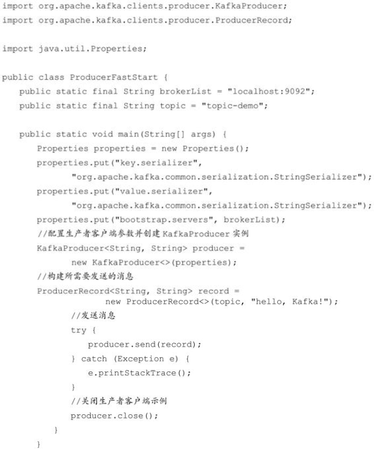

对应的消费消息也比较简单，首先创建一个消费者客户端实例并配置相应的参数，然后订阅主题并消费即可，具体的示例代码如代码清单1-2所示。

**代码清单1-2 消费者客户端示例代码**


通过这些示例，相信各位读者对 Kafka 应该有了初步的认识。这仅仅是一个开始，要正确、灵活地运用好 Kafka 还需要对它进行深入探索，包括生产者和消费者客户端的使用细节及原理、服务端的使用细节及原理、运维、监控等，每一个方面都等着读者去一一攻破。

## 1.4 服务端参数配置

在 1.2 节的 Kafka 安装与配置的说明中只是简单地表述了几个必要的服务端参数而没有对其进行详细的介绍，并且 Kafka 服务端参数(broker configs)也并非只有这几个。Kafka 服务端还有很多参数配置，涉及使用、调优的各个方面，虽然这些参数在大多数情况下不需要更改，但了解这些参数，以及在特殊应用需求的情况下进行有针对性的调优，可以更好地利用 Kafka 为我们工作。下面挑选一些重要的服务端参数来做细致的说明，这些参数都配置在 `$KAFKA_HOME/config/server.properties` 文件中。

**1.zookeeper.connect**

该参数指明 broker 要连接的 ZooKeeper 集群的服务地址(包含端口号)，没有默认值，且此参数为必填项。可以配置为 `localhost:2181`，如果 ZooKeeper 集群中有多个节点，则可以用逗号将每个节点隔开，类似于 `localhost1:2181，localhost2:2181，localhost3:2181` 这种格式。最佳的实践方式是再加一个 chroot 路径，这样既可以明确指明该 chroot 路径下的节点是为 Kafka 所用的，也可以实现多个 Kafka 集群复用一套 ZooKeeper 集群，这样可以节省更多的硬件资源。包含 chroot 路径的配置类似于 `localhost1:2181，localhost2:2181，localhost3:2181/kafka` 这种，如果不指定 chroot，那么默认使用 ZooKeeper 的根路径。

**2.listeners**

该参数指明 broker 监听客户端连接的地址列表，即为客户端要连接 broker 的入口地址列表，配置格式为 `protocol1://hostname1:port1，protocol2://hostname2:port2`，其中 protocol 代表协议类型，Kafka 当前支持的协议类型有PLAINTEXT、SSL、SASL_SSL 等，如果未开启安全认证，则使用简单的 PLAINTEXT 即可。hostname 代表主机名，port 代表服务端口，此参数的默认值为 null。比如此参数配置为 `PLAINTEXT://198.162.0.2:9092`，如果有多个地址，则中间以逗号隔开。**如果不指定主机名，则表示绑定默认网卡，注意有可能会绑定到 127.0.0.1，这样无法对外提供服务，所以主机名最好不要为空；如果主机名是 0.0.0.0，则表示绑定所有的网卡。**与此参数关联的还有 advertised.listeners，作用和 listeners 类似，默认值也为 null。不过 advertised.listeners 主要用于 IaaS(Infrastructure as a Service)环境，比如公有云上的机器通常配备有多块网卡，即包含私网网卡和公网网卡，对于这种情况而言，可以设置 advertised.listeners 参数绑定公网 IP 供外部客户端使用，而配置 listeners 参数来绑定私网 IP 地址供 broker 间通信使用。

**3.broker.id**

该参数用来指定 Kafka 集群中 broker 的唯一标识，默认值为 -1。如果没有设置，那么 Kafka 会自动生成一个。这个参数还和meta.properties 文件及服务端参数 broker.id.generation.enable 和 reserved.broker.max.id 有关，相关深度解析可以参考 6.5.1 节的内容。

**4.log.dir 和 log.dirs**

Kafka 把所有的消息都保存在磁盘上，而这两个参数用来配置 Kafka 日志文件存放的根目录。一般情况下，log.dir 用来配置单个根目录，而 log.dirs 用来配置多个根目录(以逗号分隔)，但是 Kafka 并没有对此做强制性限制，也就是说，log.dir 和 log.dirs 都可以用来配置单个或多个根目录。**log.dirs 的优先级比 log.dir 高，但是如果没有配置 log.dirs，则会以 log.dir 配置为准。**默认情况下只配置了 log.dir 参数，其默认值为 /tmp/kafka-logs。

**5.message.max.bytes**

该参数用来指定 broker 所能接收消息的最大值，默认值为 1000012(B)，约等于 976.6KB。如果 Producer 发送的消息大于这个参数所设置的值，那么(Producer)就会报出 RecordTooLargeException 的异常。如果需要修改这个参数，那么还要考虑 max.request.size (客户端参数)、max.message.bytes(topic 端参数)等参数的影响。为了避免修改此参数而引起级联的影响，建议在修改此参数之前考虑分拆消息的可行性。

还有一些服务端参数在本节没有提及，这些参数同样非常重要，它们需要用单独的章节或者场景来描述，比如 unclean.leader.election.enable、log.segment.bytes 等参数都会在后面的章节中提及。

## 1.5 总结

通过本章的介绍，相信读者对 Kafka 已经有了初步的了解，接下来我们就可以正式开始研究如何正确、有效地使用 Kafka，以及 Kafka 背后的实现原理了。


# 第 2 章 生产者

从编程的角度而言，生产者就是负责向 Kafka 发送消息的应用程序。在 Kafka 的历史变迁中，一共有两个大版本的生产者客户端:第一个是于 Kafka 开源之初使用 Scala 语言编写的客户端，我们可以称之为旧生产者客户端(Old Producer)或 Scala 版生产者客户端；第二个是从 Kafka 0.9.x 版本开始推出的使用 Java 语言编写的客户端，我们可以称之为新生产者客户端(New Producer)或 Java 版生产者客户端，它弥补了旧版客户端中存在的诸多设计缺陷。

虽然 Kafka 是用 Java/Scala 语言编写的，但这并不妨碍它对于多语言的支持，在 Kafka 官网中，“CLIENTS”的入口[[1\]](https://cwiki.apache.org/confluence/display/KAFKA/Clients)提供了一份多语言的支持列表，其中包括常用的 C/C++、Python、Go 等语言，不过这些其他类语言的客户端并非由 Kafka 社区维护，如果使用则需要另行下载。本章主要针对现下流行的新生产者(Java 语言编写的)客户端做详细介绍，而旧生产者客户端已被淘汰，故不再做相应的介绍了。

## 2.1 客户端开发

一个正常的生产逻辑需要具备以下几个步骤:

(1)配置生产者客户端参数及创建相应的生产者实例。

(2)构建待发送的消息。

(3)发送消息。

(4)关闭生产者实例。

代码清单 1-2 中已经简单对生产者客户端的编码做了一个基本演示，本节对其修改以做具体的分析，如代码清单 2-1所示。

**代码清单2-1 生产者客户端示例代码**


相比代码清单 1-2 而言，这里仅仅是让编码的逻辑显得更加“正统”一些，也更加方便下面内容的陈述。

这里有必要单独说明的是**构建的消息对象 ProducerRecord，它并不是单纯意义上的消息，它包含了多个属性，原本需要发送的与业务相关的消息体只是其中的一个 value 属性**，比如“Hello，Kafka！”只是 ProducerRecord 对象中的一个属性。ProducerRecord 类的定义如下(只截取成员变量):


其中 topic 和 partition 字段分别代表消息要发往的主题和分区号。headers 字段是消息的头部，Kafka 0.11.x 版本才引入这个属性，它大多用来设定一些与应用相关的信息，如无需要也可以不用设置。**key 是用来指定消息的键，它不仅是消息的附加信息，还可以用来计算分区号进而可以让消息发往特定的分区。前面提及消息以主题为单位进行归类，而这个key可以让消息再进行二次归类，同一个key的消息会被划分到同一个分区中**，详情参见 2.1.4 节。**有key的消息还可以支持日志压缩的功能**，详情参见 5.4 节。v**alue 是指消息体，一般不为空，如果为空则表示特定的消息—墓碑消息**，详情参见 5.4 节。timestamp 是指消息的时间戳，它有 CreateTime 和LogAppendTime 两种类型，前者表示消息创建的时间，后者表示消息追加到日志文件的时间，详情参见 5.2 节。

接下来我们将按照生产逻辑的各个步骤来一一做相应分析。

### 2.1.1 必要的参数配置

在创建真正的生产者实例前需要配置相应的参数，比如需要连接的 Kafka 集群地址。参照代码清单 2-1 中的 initConfig() 方法，在 Kafka生产者客户端 KafkaProducer 中有 3 个参数是必填的。

- bootstrap.servers:该参数用来指定生产者客户端连接 Kafka 集群所需的 broker 地址清单，具体的内容格式为 `host1:port1，host2:port2`，可以设置一个或多个地址，中间以逗号隔开，此参数的默认值为“”。注意这里并非需要所有的 broker 地址，因为生产者会从给定的 broker 里查找到其他 broker 的信息。不过建议至少要设置两个以上的 broker 地址信息，当其中任意一个宕机时，生产者仍然可以连接到 Kafka 集群上。有关此参数的更多释义可以参考 6.5.2 节。
- key.serializer 和 value.serializer:broker 端接收的消息必须以字节数组(byte[])的形式存在。代码清单 2-1 中生产者使用的`KafkaProducer\<String, String>` 和 `ProducerRecord\<String, String>` 中的泛型 `\<String,String>` 对应的就是消息中 key 和 value 的类型，生产者客户端使用这种方式可以让代码具有良好的可读性，不过在发往 broker 之前需要将消息中对应的 key 和 value 做相应的序列化操作来转换成字节数组。key.serializer 和 value.serializer 这两个参数分别用来指定 key 和 value 序列化操作的序列化器，这两个参数无默认值。注意这里必须填写序列化器的全限定名，如代码清单 2-1 中的`org.apache.kafka.common.serialization.StringSerializer`，单单指定 StringSerializer 是错误的，更多有关序列化的内容可以参考 2.1.3 节。

注意到代码清单 2-1 中的 initConfig() 方法里还设置了一个参数 client.id，这个参数用来设定 KafkaProducer 对应的客户端 id，默认值为“”。如果客户端不设置，则 KafkaProducer 会自动生成一个非空字符串，内容形式如“producer-1”“producer-2”，即字符串“producer-”与数字的拼接。

KafkaProducer 中的参数众多，远非示例 initConfig() 方法中的那样只有 4 个，开发人员可以根据业务应用的实际需求来修改这些参数的默认值，以达到灵活调配的目的。一般情况下，普通开发人员无法记住所有的参数名称，只能有个大致的印象。在实际使用过程中，诸如“key.serializer”“max.request.size”“interceptor.classes”之类的字符串经常由于人为因素而书写错误。为此，我们可以直接使用客户端中的 `org.apache.kafka.clients.producer.ProducerConfig` 类来做一定程度上的预防措施，每个参数在 ProducerConfig 类中都有对应的名称，以代码清单 2-1中的 initConfig() 方法为例，引入 ProducerConfig 后的修改结果如下:


注意到上面的代码中 key.serializer 和 value.serializer 参数对应类的全限定名比较长，也比较容易写错，这里通过 Java 中的技巧来做进一步的改进，相关代码如下:


如此代码便简洁了许多，同时进一步降低了人为出错的可能性。在配置完参数之后，我们就可以使用它来创建一个生产者实例，示例如下:


**KafkaProducer 是线程安全的，可以在多个线程中共享单个 KafkaProducer 实例，也可以将 KafkaProducer 实例进行池化来供其他线程调用。**

KafkaProducer 中有多个构造方法，比如在创建 KafkaProducer 实例时并没有设定 key.serializer 和 value.serializer 这两个配置参数，那么就需要在构造方法中添加对应的序列化器，示例如下:


其内部原理和无序列化器的构造方法一样，不过就实际应用而言，一般都选用 `public KafkaProducer(Properties properties)` 这个构造方法来创建 KafkaProducer 实例。

### 2.1.2 消息的发送

在创建完生产者实例之后，接下来的工作就是构建消息，即创建 ProducerRecord 对象。通过代码清单 2-1 中我们已经了解了ProducerRecord 的属性结构，其中 topic 属性和 value 属性是必填项，其余属性是选填项，对应的 ProducerRecord 的构造方法也有多种，参考如下:


代码清单 2-1 中使用的是最后一种构造方法，也是最简单的一种，这种方式相当于将 ProducerRecord 中除 topic 和 value 外的属性全部值设置为 null。在实际的应用中，还会用到其他构造方法，比如要指定 key，或者添加 headers 等。有可能会遇到这些构造方法都不满足需求的情况，需要自行添加更多的构造方法，比如下面的示例:


可以参阅 11.1 节的内容来了解此构造方法的具体应用。注意，针对不同的消息，需要构建不同的 ProducerRecord 对象，在实际应用中创建 ProducerRecord 对象是一个非常频繁的动作。

创建生产者实例和构建消息之后，就可以开始发送消息了。**发送消息主要有三种模式:发后即忘(fire-and-forget)、同步(sync)及异步(async)。**

代码清单 2-1 中的这种发送方式就是发后即忘，它只管往 Kafka 中发送消息而并不关心消息是否正确到达。在大多数情况下，这种发送方式没有什么问题，不过在某些时候(比如发生不可重试异常时)会造成消息的丢失。这种发送方式的性能最高，可靠性也最差。

KafkaProducer 的 send() 方法并非是 void 类型，而是 Future\<RecordMetadata>类型，send() 方法有 2 个重载方法，具体定义如下:


要实现同步的发送方式，可以利用返回的 Future 对象实现，示例如下:


实际上 send() 方法本身就是异步的，send() 方法返回的 Future 对象可以使调用方稍后获得发送的结果。示例中在执行 send() 方法之后直接链式调用了get() 方法来阻塞等待 Kafka 的响应，直到消息发送成功，或者发生异常。如果发生异常，那么就需要捕获异常并交由外层逻辑处理。

也可以在执行完 send() 方法之后不直接调用 get() 方法，比如下面的一种同步发送方式的实现:


这样可以获取一个 RecordMetadata 对象，在 RecordMetadata 对象里包含了消息的一些元数据信息，比如当前消息的主题、分区号、分区中的偏移量(offset)、时间戳等。如果在应用代码中需要这些信息，则可以使用这个方式。如果不需要，则直接采用producer.send(record).get() 的方式更省事。

**Future 表示一个任务的生命周期，并提供了相应的方法来判断任务是否已经完成或取消，以及获取任务的结果和取消任务等。既然KafkaProducer.send() 方法的返回值是一个 Future 类型的对象，那么完全可以用 Java 语言层面的技巧来丰富应用的实现，比如使用Future中的 get(long timeout，TimeUnit unit) 方法实现可超时的阻塞。**

KafkaProducer 中一般会发生两种类型的异常:可重试的异常和不可重试的异常。常见的可重试异常有:NetworkException、LeaderNotAvailableException、UnknownTopicOrPartitionException、NotEnoughReplicasException、NotCoordinatorException 等。比如 NetworkException 表示网络异常，这个有可能是由于网络瞬时故障而导致的异常，可以通过重试解决；又比如LeaderNotAvailableException 表示分区的 leader 副本不可用，这个异常通常发生在 leader 副本下线而新的 leader 副本选举完成之前，重试之后可以重新恢复。不可重试的异常，比如 1.4 节中提及的 RecordTooLargeException 异常，暗示了所发送的消息太大，KafkaProducer 对此不会进行任何重试，直接抛出异常。

对于可重试的异常，如果配置了 retries 参数，那么只要在规定的重试次数内自行恢复了，就不会抛出异常。retries 参数的默认值为 0，配置方式参考如下:


示例中配置了 10 次重试。如果重试了 10 次之后还没有恢复，那么仍会抛出异常，进而发送的外层逻辑就要处理这些异常了。

同步发送的方式可靠性高，要么消息被发送成功，要么发生异常。如果发生异常，则可以捕获并进行相应的处理，而不会像“发后即忘”的方式直接造成消息的丢失。不过同步发送的方式的性能会差很多，需要阻塞等待一条消息发送完之后才能发送下一条。

我们再来了解一下异步发送的方式，一般是在 send() 方法里指定一个 Callback 的回调函数，Kafka 在返回响应时调用该函数来实现异步的发送确认。有读者或许会有疑问，send() 方法的返回值类型就是 Future，而 Future 本身就可以用作异步的逻辑处理。这样做不是不行，只不过 Future 里的 get() 方法在何时调用，以及怎么调用都是需要面对的问题，消息不停地发送，那么诸多消息对应的 Future 对象的处理难免会引起代码处理逻辑的混乱。使用 Callback 的方式非常简洁明了，Kafka 有响应时就会回调，要么发送成功，要么抛出异常。异步发送方式的示例如下:


示例代码中遇到异常时(exception != null)只是做了简单的打印操作，在实际应用中应该使用更加稳妥的方式来处理，比如可以将异常记录以便日后分析，也可以做一定的处理来进行消息重发。**onCompletion() 方法的两个参数是互斥的，消息发送成功时，metadata 不为 null 而 exception 为 null；消息发送异常时，metadata 为 null 而 exception 不为 null。**


**对于同一个分区而言，如果消息 record1 于 record2 之前先发送(参考上面的示例代码)，那么 KafkaProducer 就可以保证对应的callback1 在 callback2 之前调用，也就是说，回调函数的调用也可以保证分区有序。**

通常，一个 KafkaProducer 不会只负责发送单条消息，更多的是发送多条消息，在发送完这些消息之后，需要调用 KafkaProducer 的close() 方法来回收资源。下面的示例中发送了 100 条消息，之后就调用了 close() 方法来回收所占用的资源:


close() 方法会阻塞等待之前所有的发送请求完成后再关闭 KafkaProducer。与此同时，KafkaProducer 还提供了一个带超时时间的 close() 方法，具体定义如下:


**如果调用了带超时时间 timeout 的close() 方法，那么只会在等待 timeout 时间内来完成所有尚未完成的请求处理，然后强行退出。在实际应用中，一般使用的都是无参的 close() 方法。**

### 2.1.3 序列化

生产者需要用序列化器(Serializer)把对象转换成字节数组才能通过网络发送给 Kafka。而在对侧，消费者需要用反序列化器(Deserializer)把从 Kafka 中收到的字节数组转换成相应的对象。在代码清单 2-1 中，为了方便，消息的 key 和 value 都使用了字符串，对应程序中的序列化器也使用了客户端自带的 `org.apache.kafka.common.serialization.StringSerializer`，除了用于 String类型的序列化器，还有 ByteArray、ByteBuffer、Bytes、Double、Integer、Long 这几种类型，它们都实现了`org.apache.kafka.common.serialization.Serializer` 接口，此接口有 3 个方法:


configure() 方法用来配置当前类，serialize() 方法用来执行序列化操作。**而 close() 方法用来关闭当前的序列化器，一般情况下 close() 是一个空方法，如果实现了此方法，则必须确保此方法的幂等性，因为这个方法很可能会被 KafkaProducer 调用多次。**

生产者使用的序列化器和消费者使用的反序列化器是需要一一对应的，如果生产者使用了某种序列化器，比如 StringSerializer，而消费者使用了另一种序列化器，比如 IntegerSerializer，那么是无法解析出想要的数据的。本节讨论的都是与生产者相关的，对于与消费者相关的反序列化器的内容请参见 3.2.3 节。

下面就以 StringSerializer 为例来看看 Serializer 接口中的 3 个方法的使用方法，StringSerializer 类的具体实现如代码清单 2-2 所示。

**代码清单2-2 StringSerializer的代码实现**


首先是 configure() 方法，这个方法是在创建 KafkaProducer 实例的时候调用的，主要用来确定编码类型，不过一般客户端对于 key.serializer.encoding、value.serializer.encoding 和 serializer.encoding 这几个参数都不会配置，在 KafkaProducer 的参数集合(ProducerConfig)里也没有这几个参数(它们可以看作用户自定义的参数)，所以一般情况下 encoding 的值就为默认的“UTF-8”。serialize() 方法非常直观，就是将 String 类型转为 byte[] 类型。

如果 Kafka 客户端提供的几种序列化器都无法满足应用需求，则可以选择使用如 Avro、JSON、Thrift、ProtoBuf 和 Protostuff 等通用的序列化工具来实现，或者使用自定义类型的序列化器来实现。下面就以一个简单的例子来介绍自定义类型的使用方法。

假设我们要发送的消息都是 Company 对象，这个 Company 的定义很简单，只有名称 name 和地址 address，示例代码参考如下(为了构建方便，示例中使用了 lombok 工具):


下面我们再来看一下 Company 对应的序列化器 CompanySerializer，示例代码如代码清单 2-3 所示。

**代码清单2-3 自定义的序列化器CompanySerializer**


上面的这段代码的逻辑很简单，configure() 和 close() 方法也都为空。与此对应的反序列化器 CompanyDeserializer的详细实现参见 3.2.3 节。

如何使用自定义的序列化器 CompanySerializer 呢？只需将 KafkaProducer 的 value.serializer 参数设置为 CompanySerializer 类的**全限定名**即可。假如我们要发送一个 Company 对象到 Kafka，关键代码如代码清单 2-4 所示。

**代码清单2-4 自定义序列化器使用示例**


注意，示例中消息的 key 对应的序列化器还是 StringSerializer，这个并没有改动。其实 key.serializer 和 value.serializer 并没有太大的区别，读者可以自行修改 key 对应的序列化器，看看会不会有不一样的效果。

### 2.1.4 分区器

消息在通过 send() 方法发往 broker 的过程中，有可能需要经过拦截器(Interceptor)、序列化器(Serializer)和分区器(Partitioner)的一系列作用之后才能被真正地发往 broker。拦截器(下一章会详细介绍)一般不是必需的，而序列化器是必需的。消息经过序列化之后就需要确定它发往的分区，如果消息 ProducerRecord 中指定了 partition 字段，那么就不需要分区器的作用，因为 partition 代表的就是所要发往的分区号。

如果消息 ProducerRecord 中没有指定 partition 字段，那么就需要依赖分区器，根据 key 这个字段来计算 partition 的值。分区器的作用就是为消息分配分区。

Kafka 中提供的默认分区器是 org.apache.kafka.clients.producer.internals.DefaultPartitioner，它实现了org.apache.kafka.clients.producer.Partitioner 接口，这个接口中定义了 2 个方法，具体如下所示。


其中 partition() 方法用来计算分区号，返回值为 int 类型。partition() 方法中的参数分别表示主题、键、序列化后的键、值、序列化后的值，以及集群的元数据信息，通过这些信息可以实现功能丰富的分区器。close() 方法在关闭分区器的时候用来回收一些资源。

Partitioner 接口还有一个父接口 org.apache.kafka.common.Configurable，这个接口中只有一个方法:


Configurable 接口中的 configure() 方法主要用来获取配置信息及初始化数据。

在默认分区器 DefaultPartitioner 的实现中，close() 是空方法，而在 partition() 方法中定义了主要的分区分配逻辑。如果 key 不为 null，那么默认的分区器会对 key 进行哈希(采用 MurmurHash2 算法，具备高运算性能及低碰撞率)，最终根据得到的哈希值来计算分区号，拥有相同 key 的消息会被写入同一个分区。如果 key 为 null，那么消息将会以轮询的方式发往主题内的各个可用分区。

**注意:**如果 key 不为 null，那么计算得到的分区号会是所有分区中的任意一个；如果 key 为 null，那么计算得到的分区号仅为可用分区中的任意一个，注意两者之间的差别。

在不改变主题分区数量的情况下，key 与分区之间的映射可以保持不变。不过，一旦主题中增加了分区，那么就难以保证 key 与分区之间的映射关系了。

除了使用 Kafka 提供的默认分区器进行分区分配，还可以使用自定义的分区器，只需同 DefaultPartitioner 一样实现 Partitioner 接口即可。**默认的分区器在 key 为 null 时不会选择非可用的分区**，我们可以通过自定义的分区器 DemoPartitioner 来打破这一限制，具体的实现可以参考下面的示例代码，如代码清单 2-5 所示。

**代码清单2-5 自定义分区器实现**


实现自定义的 DemoPartitioner 类之后，需要通过配置参数 partitioner.class 来显式指定这个分区器。示例如下:


这个自定义分区器的实现比较简单，读者也可以根据自身业务的需求来灵活实现分配分区的计算方式，比如一般大型电商都有多个仓库，可以将仓库的名称或 ID 作为 key 来灵活地记录商品信息。

### 2.1.5 生产者拦截器

拦截器(Interceptor)是早在 Kafka 0.10.0.0 中就已经引入的一个功能，Kafka 一共有两种拦截器:生产者拦截器和消费者拦截器。本节主要讲述生产者拦截器的相关内容，有关消费者拦截器的具体细节请参考 3.2.9 节。

**生产者拦截器既可以用来在消息发送前做一些准备工作，比如按照某个规则过滤不符合要求的消息、修改消息的内容等，也可以用来在发送回调逻辑前做一些定制化的需求，比如统计类工作。**

生产者拦截器的使用也很方便，主要是自定义实现 org.apache.kafka.clients.producer.ProducerInterceptor 接口。ProducerInterceptor 接口中包含 3 个方法:


KafkaProducer 在将消息序列化和计算分区之前会调用生产者拦截器的 onSend() 方法来对消息进行相应的定制化操作。一般来说最好不要修改消息 ProducerRecord 的 topic、key 和 partition 等信息，如果要修改，则需确保对其有准确的判断，否则会与预想的效果出现偏差。比如修改 key 不仅会影响分区的计算，同样会影响 broker 端日志压缩(Log Compaction)的功能。

KafkaProducer 会在消息被应答(Acknowledgement)之前或消息发送失败时调用生产者拦截器的 onAcknowledgement() 方法，优先于用户设定的 Callback 之前执行。**这个方法运行在 Producer 的 I/O 线程中，所以这个方法中实现的代码逻辑越简单越好，否则会影响消息的发送速度。**

close() 方法主要用于在关闭拦截器时执行一些资源的清理工作。**在这 3 个方法中抛出的异常都会被捕获并记录到日志中，但并不会再向上传递。**

ProducerInterceptor 接口与 2.1.4 节中的 Partitioner 接口一样，它也有一个同样的父接口 Configurable，具体的内容可以参见 Partitioner 接口的相关介绍。

下面通过一个示例来演示生产者拦截器的具体用法，ProducerInterceptorPrefix 中通过 onSend() 方法来为每条消息添加一个前缀“prefix1-”，并且通过 onAcknowledgement() 方法来计算发送消息的成功率。ProducerInterceptorPrefix 类的具体实现如代码清单 2-6 所示。

**代码清单2-6 生产者拦截器示例**


实现自定义的 ProducerInterceptorPrefix 之后，需要在 KafkaProducer 的配置参数 interceptor.classes 中指定这个拦截器，此参数的默认值为“”。示例如下:


然后使用指定了 ProducerInterceptorPrefix 的生产者连续发送 10 条内容为“kafka”的消息，在发送完之后客户端打印出如下信息:


如果消费这 10 条消息，会发现消费了的消息都变成了“prefix1-kafka”，而不是原来的“kafka”。

KafkaProducer 中不仅可以指定一个拦截器，还可以指定多个拦截器以形成拦截链。拦截链会按照 interceptor.classes 参数配置的拦截器的顺序来一一执行(配置的时候，各个拦截器之间使用逗号隔开)。下面我们再添加一个自定义拦截器ProducerInterceptorPrefixPlus，它只实现了 Interceptor 接口中的 onSend() 方法，主要用来为每条消息添加另一个前缀“prefix2-”，具体实现如下:


接着修改生产者的 interceptor.classes 配置，具体实现如下:


此时生产者再连续发送 10 条内容为“kafka”的消息，那么最终消费者消费到的是 10 条内容为“prefix2-prefix1-kafka”的消息。如果将 interceptor.classes 配置中的两个拦截器的位置互换:


那么最终消费者消费到的消息为“prefix1-prefix2-kafka”。

**如果拦截链中的某个拦截器的执行需要依赖于前一个拦截器的输出，那么就有可能产生“副作用”。设想一下，如果前一个拦截器由于异常而执行失败，那么这个拦截器也就跟着无法继续执行。在拦截链中，如果某个拦截器执行失败，那么下一个拦截器会接着从上一个执行成功的拦截器继续执行。**

## 2.2 原理分析

在前面的章节中，我们已经了解了 KafkaProducer 的具体使用方法，而本节的内容主要是对 Kafka 生产者客户端的内部原理进行分析，通过了解生产者客户端的整体脉络可以让我们更好地使用它，避免因为一些理解上的偏差而造成使用上的错误。

### 2.2.1 整体架构

在 2.1.4 节的开头介绍了消息在真正发往 Kafka 之前，有可能需要经历拦截器(Interceptor)、序列化器(Serializer)和分区器(Partitioner)等一系列的作用，那么在此之后又会发生什么呢？下面我们来看一下生产者客户端的整体架构，如图 2-1 所示。


图2-1 生产者客户端的整体架构

整个生产者客户端由两个线程协调运行，这两个线程分别为主线程和 Sender 线程(发送线程)。在主线程中由 KafkaProducer 创建消息，然后通过可能的拦截器、序列化器和分区器的作用之后缓存到消息累加器(RecordAccumulator，也称为消息收集器)中。Sender 线程负责从 RecordAccumulator 中获取消息并将其发送到 Kafka 中。

**RecordAccumulator 主要用来缓存消息以便 Sender 线程可以批量发送，进而减少网络传输的资源消耗以提升性能。**RecordAccumulator 缓存的大小可以通过生产者客户端参数 buffer.memory 配置，默认值为 33554432B，即 32MB。**如果生产者发送消息的速度超过发送到服务器的速度，则会导致生产者空间不足，这个时候 KafkaProducer 的 send() 方法调用要么被阻塞，要么抛出异常**，这个取决于参数 max.block.ms 的配置，此参数的默认值为 60000，即 60 秒。

主线程中发送过来的消息都会被追加到 RecordAccumulator 的某个双端队列(Deque)中，在 RecordAccumulator 的内部为**每个分区**都维护了一个双端队列，队列中的内容就是 ProducerBatch，即 Deque\<ProducerBatch>。消息写入缓存时，追加到双端队列的尾部；Sender 读取消息时，从双端队列的头部读取。注意 ProducerBatch 不是 ProducerRecord，ProducerBatch 中可以包含一至多个 ProducerRecord。通俗地说，ProducerRecord 是生产者中创建的消息，而 ProducerBatch 是指一个消息批次，ProducerRecord 会被包含在 ProducerBatch 中，这样可以使字节的使用更加紧凑。与此同时，将较小的 ProducerRecord 拼凑成一个较大的 ProducerBatch，也可以减少网络请求的次数以提升整体的吞吐量。ProducerBatch 和消息的具体格式有关，更多的详细内容可以参考 5.2 节。如果生产者客户端需要向很多分区发送消息，则可以将 buffer.memory 参数适当调大以增加整体的吞吐量。

**消息在网络上都是以字节(Byte)的形式传输的，在发送之前需要创建一块内存区域来保存对应的消息。在 Kafka 生产者客户端中，通过 java.io.ByteBuffer 实现消息内存的创建和释放。不过频繁的创建和释放是比较耗费资源的，在 RecordAccumulator 的内部还有一个BufferPool，它主要用来实现 ByteBuffer 的复用，以实现缓存的高效利用。不过 BufferPool 只针对特定大小的 ByteBuffer 进行管理，而其他大小的 ByteBuffer 不会缓存进 BufferPool 中，这个特定的大小由 batch.size 参数来指定，默认值为 16384B，即 16KB。我们可以适当地调大 batch.size 参数以便多缓存一些消息。**

**ProducerBatch 的大小和 batch.size 参数也有着密切的关系。当一条消息(ProducerRecord)流入 RecordAccumulator 时，会先寻找与消息分区所对应的双端队列(如果没有则新建)，再从这个双端队列的尾部获取一个 ProducerBatch(如果没有则新建)，查看 ProducerBatch 中是否还可以写入这个 ProducerRecord，如果可以则写入，如果不可以则需要创建一个新的 ProducerBatch。在新建ProducerBatch 时评估这条消息的大小是否超过 batch.size 参数的大小，如果不超过，那么就以 batch.size 参数的大小来创建 ProducerBatch，这样在使用完这段内存区域之后，可以通过 BufferPool 的管理来进行复用；如果超过，那么就以评估的大小来创建ProducerBatch，这段内存区域不会被复用。**

Sender 从 RecordAccumulator 中获取缓存的消息之后，会进一步将原本\<分区，Deque\<ProducerBatch>>的保存形式转变成\<Node，List\< ProducerBatch>>的形式，其中 Node 表示 Kafka 集群的 broker 节点。对于网络连接来说，生产者客户端是与具体的 broker 节点建立的连接，也就是向具体的 broker 节点发送消息，而并不关心消息属于哪一个分区；而对于 KafkaProducer 的应用逻辑而言，我们只关注向哪个分区中发送哪些消息，所以在这里需要做一个应用逻辑层面到网络I/O层面的转换。

**在转换成\<Node，List\<ProducerBatch>>的形式之后，Sender 还会进一步封装成\<Node，Request>的形式，这样就可以将 Request 请求发往各个 Node 了，这里的 Request 是指 Kafka 的各种协议请求，对于消息发送而言就是指具体的 ProduceRequest**，更多与 Kafka 协议有关的内容可以参考 6.1 节。

请求在从 Sender 线程发往 Kafka 之前还会保存到 InFlightRequests 中，InFlightRequests 保存对象的具体形式为 Map\<NodeId，Deque\<Request>>，它的主要作用是缓存了已经发出去但还没有收到响应的请求(NodeId 是一个 String 类型，表示节点的 id 编号)。与此同时，InFlightRequests 还提供了许多管理类的方法，并且通过配置参数还可以限制每个连接(也就是客户端与 Node 之间的连接)最多缓存的请求数。这个配置参数为 max.in.flight.requests.per.connection，默认值为 5，即每个连接最多只能缓存 5 个未响应的请求，超过该数值之后就不能再向这个连接发送更多的请求了，除非有缓存的请求收到了响应(Response)。通过比较 Deque\<Request>的 size 与这个参数的大小来判断对应的 Node 中是否已经堆积了很多未响应的消息，如果真是如此，那么说明这个 Node 节点负载较大或网络连接有问题，再继续向其发送请求会增大请求超时的可能。

### 2.2.2 元数据的更新

2.2.1 节中提及的 **InFlightRequests 还可以获得 leastLoadedNode，即所有 Node 中负载最小的那一个。这里的负载最小是通过每个Node 在 InFlightRequests 中还未确认的请求决定的，未确认的请求越多则认为负载越大**。对于图 2-2 中的 InFlightRequests 来说，图中展示了三个节点 Node0、Node1 和 Node2，很明显 Node1 的负载最小。也就是说，Node1 为当前的 leastLoadedNode。**选择leastLoadedNode 发送请求可以使它能够尽快发出，避免因网络拥塞等异常而影响整体的进度。leastLoadedNode 的概念可以用于多个应用场合，比如元数据请求、消费者组播协议的交互。**


图2-2 判定leastLoadedNode

我们使用如下的方式创建了一条消息 ProducerRecord:


我们只知道主题的名称，对于其他一些必要的信息却一无所知。KafkaProducer 要将此消息追加到指定主题的某个分区所对应的 leader 副本之前，首先需要知道主题的分区数量，然后经过计算得出(或者直接指定)目标分区，之后 KafkaProducer 需要知道目标分区的 leader 副本所在的 broker 节点的地址、端口等信息才能建立连接，最终才能将消息发送到 Kafka，在这一过程中所需要的信息都属于元数据信息。

在 2.1.1 节中我们了解了 bootstrap.servers 参数只需要配置部分 broker 节点的地址即可，不需要配置所有 broker 节点的地址，因为客户端可以自己发现其他 broker 节点的地址，这一过程也属于元数据相关的更新操作。与此同时，分区数量及 leader 副本的分布都会动态地变化，客户端也需要动态地捕捉这些变化。

**元数据是指 Kafka 集群的元数据，这些元数据具体记录了集群中有哪些主题，这些主题有哪些分区，每个分区的 leader 副本分配在哪个节点上，follower 副本分配在哪些节点上，哪些副本在 AR、ISR 等集合中，集群中有哪些节点，控制器节点又是哪一个等信息。**

**当客户端中没有需要使用的元数据信息时，比如没有指定的主题信息，或者超过 metadata.max.age.ms 时间没有更新元数据都会引起元数据的更新操作。客户端参数 metadata.max.age.ms 的默认值为 300000，即 5 分钟。元数据的更新操作是在客户端内部进行的，对客户端的外部使用者不可见。当需要更新元数据时，会先挑选出 leastLoadedNode，然后向这个 Node 发送 MetadataRequest 请求来获取具体的元数据信息。这个更新操作是由 Sender 线程发起的，在创建完 MetadataRequest 之后同样会存入 InFlightRequests，之后的步骤就和发送消息时的类似。元数据虽然由 Sender 线程负责更新，但是主线程也需要读取这些信息，这里的数据同步通过 synchronized 和 final 关键字来保障。**

## 2.3 重要的生产者参数

在 KafkaProducer 中，除了 2.1.1 节提及的 3 个默认的客户端参数，大部分的参数都有合理的默认值，一般不需要修改它们。不过了解这些参数可以让我们更合理地使用生产者客户端，其中还有一些重要的参数涉及程序的可用性和性能，如果能够熟练掌握它们，也可以让我们在编写相关的程序时能够更好地进行性能调优与故障排查。下面挑选一些重要的参数进行讲解。

**1.acks**

这个参数用来指定分区中必须要有多少个副本收到这条消息，之后生产者才会认为这条消息是成功写入的。acks 是生产者客户端中一个非常重要的参数，它涉及消息的可靠性和吞吐量之间的权衡。acks 参数有 3 种类型的值(都是字符串类型)。

- acks=1。默认值即为 1。生产者发送消息之后，只要分区的 leader 副本成功写入消息，那么它就会收到来自服务端的成功响应。如果消息无法写入 leader 副本，比如在 leader 副本崩溃、重新选举新的 leader 副本的过程中，那么生产者就会收到一个错误的响应，为了避免消息丢失，生产者可以选择重发消息。如果消息写入 leader 副本并返回成功响应给生产者，且在被其他 follower 副本拉取之前 leader 副本崩溃，那么此时消息还是会丢失，因为新选举的 leader 副本中并没有这条对应的消息。acks 设置为 1，是消息可靠性和吞吐量之间的折中方案。
- acks=0。生产者发送消息之后不需要等待任何服务端的响应。如果在消息从发送到写入 Kafka 的过程中出现某些异常，导致 Kafka 并没有收到这条消息，那么生产者也无从得知，消息也就丢失了。在其他配置环境相同的情况下，acks 设置为 0 可以达到最大的吞吐量。
- acks=-1 或 acks=all。生产者在消息发送之后，需要等待 ISR 中的所有副本都成功写入消息之后才能够收到来自服务端的成功响应。在其他配置环境相同的情况下，acks 设置为 -1(all)可以达到最强的可靠性。但这并不意味着消息就一定可靠，因为 ISR 中可能只有 leader 副本，这样就退化成了 acks=1 的情况。要获得更高的消息可靠性需要配合 min.insync.replicas 等参数的联动，消息可靠性分析的具体内容可以参考 8.3 节。

**注意 acks 参数配置的值是一个字符串类型，而不是整数类型。**举个例子，将 acks 参数设置为 0，需要采用下面这两种形式:


而不能配置成下面这种形式:


这样会报出如下的异常:


**2.max.request.size**

这个参数用来限制生产者客户端能发送的消息的最大值，默认值为 1048576B，即 1MB。一般情况下，这个默认值就可以满足大多数的应用场景了。笔者并不建议读者盲目地增大这个参数的配置值，尤其是在对 Kafka 整体脉络没有足够把控的时候。因为这个参数还涉及一些其他参数的联动，比如 broker 端的 message.max.bytes 参数，如果配置错误可能会引起一些不必要的异常。比如将 broker 端的message.max.bytes 参数配置为 10，而 max.request.size 参数配置为 20，那么当我们发送一条大小为 15B 的消息时，生产者客户端就会报出如下的异常:


**3.retries 和 retry.backoff.ms**

retries 参数用来配置生产者重试的次数，*默认值为 0*，即在发生异常的时候不进行任何重试动作。消息在从生产者发出到成功写入服务器之前可能发生一些临时性的异常，比如网络抖动、leader 副本的选举等，这种异常往往是可以自行恢复的，生产者可以通过配置 retries 大于 0 的值，以此通过内部重试来恢复而不是一味地将异常抛给生产者的应用程序。如果重试达到设定的次数，那么生产者就会放弃重试并返回异常。不过并不是所有的异常都是可以通过重试来解决的，比如消息太大，超过 max.request.size 参数配置的值时，这种方式就不可行了。

重试还和另一个参数 retry.backoff.ms 有关，这个参数的默认值为 100，它用来设定两次重试之间的时间间隔，避免无效的频繁重试。**在配置 retries 和 retry.backoff.ms 之前，最好先估算一下可能的异常恢复时间，这样可以设定总的重试时间大于这个异常恢复时间，以此来避免生产者过早地放弃重试。**

Kafka 可以保证同一个分区中的消息是有序的。如果生产者按照一定的顺序发送消息，那么这些消息也会顺序地写入分区，进而消费者也可以按照同样的顺序消费它们。对于某些应用来说，顺序性非常重要，比如 MySQL 的 binlog 传输，如果出现错误就会造成非常严重的后果。如果将 acks 参数配置为非零值，并且 max.in.flight.requests.per.connection 参数配置为大于 1 的值，那么就会出现错序的现象:如果第一批次消息写入失败，而第二批次消息写入成功，那么生产者会重试发送第一批次的消息，此时如果第一批次的消息写入成功，那么这两个批次的消息就出现了错序。一般而言，在需要保证消息顺序的场合建议把参数 max.in.flight.requests.per.connection 配置为 1，而不是把 acks 配置为 0，不过这样也会影响整体的吞吐。

**4.compression.type**

这个参数用来指定消息的压缩方式，默认值为“none”，即默认情况下，消息不会被压缩。该参数还可以配置为“gzip”“snappy”和“lz4”。对消息进行压缩可以极大地减少网络传输量、降低网络I/O，从而提高整体的性能。消息压缩是一种使用时间换空间的优化方式，如果对时延有一定的要求，则不推荐对消息进行压缩。

**5.connections.max.idle.ms**

这个参数用来指定在多久之后关闭限制的连接，默认值是 540000(ms)，即 9 分钟。

**6.linger.ms**

这个参数用来指定生产者发送 ProducerBatch 之前等待更多消息(ProducerRecord)加入ProducerBatch 的时间，默认值为 0。生产者客户端会在 ProducerBatch 被填满或等待时间超过 linger.ms 值时发送出去。增大这个参数的值会增加消息的延迟，但是同时能提升一定的吞吐量。这个 linger.ms 参数与 TCP 协议中的 Nagle 算法有异曲同工之妙。

**7.receive.buffer.bytes**

这个参数用来设置 Socket 接收消息缓冲区(SO_RECBUF)的大小，默认值为 32768(B)，即 32KB。如果设置为 -1，则使用操作系统的默认值。如果 Producer 与 Kafka 处于不同的机房，则可以适地调大这个参数值。

**8.send.buffer.bytes**

这个参数用来设置 Socket 发送消息缓冲区(SO_SNDBUF)的大小，默认值为 131072(B)，即 128KB。与 receive.buffer.bytes 参数一样，如果设置为 -1，则使用操作系统的默认值。

**9.request.timeout.ms**

这个参数用来配置 Producer 等待请求响应的最长时间，默认值为 30000(ms)。请求超时之后可以选择进行重试。注意这个参数需要比 broker 端参数 replica.lag.time.max.ms 的值要大，这样可以减少因客户端重试而引起的消息重复的概率。

还有一些生产者客户端的参数在本节中没有提及，这些参数同样非常重要，它们需要单独的章节或场景来描述。部分参数在前面的章节中已经提及，比如 bootstrap.servers，还有部分参数会在后面的章节中提及，比如 transactional.id。表 2-1 中罗列了一份详细的参数列表以供读者参阅。

表2-1 部分生产者客户端参数


续表


## 2.4 总结

本章主要讲述了生产者客户端的具体用法及其整体架构，主要内容包括配置参数的详解、消息的发送方式、序列化器、分区器、拦截器等。在实际应用中，一套封装良好的且灵活易用的客户端可以避免开发人员重复劳动，也提高了开发效率，还可以提高程序的健壮性和可靠性，而 Kafka 的客户端正好包含了这些特质。**对于 KafkaProducer 而言，它是线程安全的，我们可以在多线程的环境中复用它，而对于下一章的消费者客户端 KafkaConsumer 而言，它是非线程安全的，因为它具备了状态**，具体怎么使用我们不妨继续来了解下一章的内容。


# 第 3 章 消费者

与生产者对应的是消费者，应用程序可以通过 KafkaConsumer 来订阅主题，并从订阅的主题中拉取消息。不过在使用 KafkaConsumer 消费消息之前需要先了解消费者和消费组的概念，否则无法理解如何使用 KafkaConsumer。本章首先讲解消费者与消费组之间的关系，进而再细致地讲解如何使用 KafkaConsumer。

## 3.1 消费者与消费组

消费者(Consumer)负责订阅 Kafka 中的主题(Topic)，并且从订阅的主题上拉取消息。与其他一些消息中间件不同的是:在 Kafka 的消费理念中还有一层消费组(Consumer Group)的概念，每个消费者都有一个对应的消费组。当消息发布到主题后，只会被投递给订阅它的每个消费组中的一个消费者。

如图3-1所示，某个主题中共有4个分区(Partition):P0、P1、P2、P3。有两个消费组A和B都订阅了这个主题，消费组A中有4个消费者(C0、C1、C2和C3)，消费组B中有2个消费者(C4和C5)。按照Kafka默认的规则，最后的分配结果是消费组A中的每一个消费者分配到1个分区，消费组B中的每一个消费者分配到2个分区，两个消费组之间互不影响。每个消费者只能消费所分配到的分区中的消息。换言之，**每一个分区只能被一个消费组中的一个消费者所消费**。


图3-1 消费者与消费组

我们再来看一下消费组内的消费者个数变化时所对应的分区分配的演变。假设目前某消费组内只有一个消费者 C0，订阅了一个主题，这个主题包含 7 个分区:P0、P1、P2、P3、P4、P5、P6。也就是说，这个消费者C0订阅了7个分区，具体分配情形参考图3-2。


图3-2 消费组内只有1个消费者

此时消费组内又加入了一个新的消费者C1，按照既定的逻辑，需要将原来消费者C0的部分分区分配给消费者C1消费，如图3-3所示。消费者C0和C1各自负责消费所分配到的分区，彼此之间并无逻辑上的干扰。


图3-3 消费组内有2个消费者

紧接着消费组内又加入了一个新的消费者C2，消费者C0、C1和C2按照图3-4中的方式各自负责消费所分配到的分区。


图3-4 消费组内有3个消费者

消费者与消费组这种模型可以让整体的消费能力具备横向伸缩性，我们可以增加(或减少)消费者的个数来提高(或降低)整体的消费能力。对于分区数固定的情况，一味地增加消费者并不会让消费能力一直得到提升，如果消费者过多，出现了消费者的个数大于分区个数的情况，就会有消费者分配不到任何分区。参考图3-5，一共有8个消费者，7个分区，那么最后的消费者C7由于分配不到任何分区而无法消费任何消息。


图3-5 消费组内有过多的消费者

以上分配逻辑都是基于默认的分区分配策略进行分析的，可以通过消费者客户端参数partition.assignment.strategy 来设置消费者与订阅主题之间的分区分配策略，有关分区分配的更多细节可以参考7.1节。

**对于消息中间件而言，一般有两种消息投递模式:点对点(P2P，Point-to-Point)模式和发布/订阅(Pub/Sub)模式。**点对点模式是基于队列的，消息生产者发送消息到队列，消息消费者从队列中接收消息。发布订阅模式定义了如何向一个内容节点发布和订阅消息，这个内容节点称为主题(Topic)，主题可以认为是消息传递的中介，消息发布者将消息发布到某个主题，而消息订阅者从主题中订阅消息。主题使得消息的订阅者和发布者互相保持独立，不需要进行接触即可保证消息的传递，发布/订阅模式在消息的一对多广播时采用。Kafka 同时支持两种消息投递模式，而这正是得益于消费者与消费组模型的契合:

- 如果所有的消费者都隶属于同一个消费组，那么所有的消息都会被均衡地投递给每一个消费者，即每条消息只会被一个消费者处理，这就相当于点对点模式的应用。
- 如果所有的消费者都隶属于不同的消费组，那么所有的消息都会被广播给所有的消费者，即每条消息会被所有的消费者处理，这就相当于发布/订阅模式的应用。

消费组是一个逻辑上的概念，它将旗下的消费者归为一类，每一个消费者只隶属于一个消费组。每一个消费组都会有一个固定的名称，消费者在进行消费前需要指定其所属消费组的名称，这个可以通过消费者客户端参数group.id来配置，默认值为空字符串。

消费者并非逻辑上的概念，它是实际的应用实例，它可以是一个线程，也可以是一个进程。同一个消费组内的消费者既可以部署在同一台机器上，也可以部署在不同的机器上。

## 3.2 客户端开发

在了解了消费者与消费组之间的概念之后，我们就可以着手进行消费者客户端的开发了。在Kafka的历史中，消费者客户端同生产者客户端一样也经历了两个大版本:第一个是于Kafka开源之初使用 Scala 语言编写的客户端，我们可以称之为旧消费者客户端(Old Consumer)或Scala消费者客户端；第二个是从Kafka 0.9.x版本开始推出的使用Java编写的客户端，我们可以称之为新消费者客户端(New Consumer)或Java消费者客户端，它弥补了旧客户端中存在的诸多设计缺陷。

本节主要介绍目前流行的新消费者(Java 语言编写的)客户端，而旧消费者客户端已被淘汰，故不再做相应的介绍了。

一个正常的消费逻辑需要具备以下几个步骤:

(1)配置消费者客户端参数及创建相应的消费者实例。

(2)订阅主题。

(3)拉取消息并消费。

(4)提交消费位移。

(5)关闭消费者实例。

代码清单 1-2 中已经简单对消费者客户端的编码做了演示，本节对其稍做修改，如代码清单3-1所示。

**代码清单3-1 消费者客户端示例**


相比于代码清单 1-2 而言，修改过后的代码多了一点东西，我们按照消费逻辑的各个步骤来做相应的分析。

### 3.2.1 必要的参数配置

在创建真正的消费者实例之前需要做相应的参数配置，比如 3.1 节中的设置消费者所属的消费组的名称、连接地址等。参照代码清单3-1中的initConfig()方法，在Kafka消费者客户端KafkaConsumer中有4个参数是必填的。

- bootstrap.servers:该参数的释义和生产者客户端 KafkaProducer 中的相同，用来 指 定 连 接 Kafka 集 群 所 需 的 broker 地 址 清 单，具 体 内 容 形 式 为host1:port1，host2:post，可以设置一个或多个地址，中间用逗号隔开，此参数的默认值为“”。注意这里并非需要设置集群中全部的broker地址，消费者会从现有的配置中查找到全部的Kafka集群成员。这里设置两个以上的broker地址信息，当其中任意一个宕机时，消费者仍然可以连接到Kafka集群上。有关此参数的更多释义可以参考6.5.2节。

- group.id:消费者隶属的消费组的名称，默认值为“”。如果设置为空，则会报出异常:`Exception in thread "main" org.apache.kafka.common.errors.InvalidGroupIdException:The configured groupId is invalid`。一般而言，这个参数需要设置成具有一定的业务意义的名称。

- key.deserializer 和 value.deserializer:与生产者客户端 KafkaProducer中的key.serializer和value.serializer参数对应。消费者从broker端获取的消息格式都是字节数组(byte[])类型，所以需要执行相应的反序列化操作才能还原成原有的对象格式。这两个参数分别用来指定消息中key和value所需反序列化操作的反序列化器，这两个参数无默认值。**注意这里必须填写反序列化器类的全限定名**，比如示例中的org.apache.kafka.common.serialization.StringDeserializer，单单指定StringDeserializer是错误的。有关更多的反序列化内容可以参考3.2.3节。

注意到代码清单3-1中的initConfig()方法里还设置了一个参数client.id，这个参数用来设定KafkaConsumer对应的客户端id，默认值也为“”。如果客户端不设置，则KafkaConsumer会自动生成一个非空字符串，内容形式如“consumer-1”“consumer-2”，即字符串“consumer-”与数字的拼接。

KafkaConsumer中的参数众多，远非示例initConfig()方法中的那样只有5个，开发人员可以根据业务应用的实际需求来修改这些参数的默认值，以达到灵活调配的目的。一般情况下，普通开发人员无法全部记住所有的参数名称，只能有个大致的印象，在实际使用过程中，诸如“key.deserializer”“auto.offset.reset”之类的字符串经常由于人为因素而书写错误。为此，我们可以直接使用客户端中的 org.apache.kafka.clients.consumer.ConsumerConfig 类来做一定程度上的预防，每个参数在ConsumerConfig类中都有对应的名称，就以代码清单3-1中的initConfig()方法为例，引入ConsumerConfig后的修改结果如下:


注意到上面的代码中key.deserializer和value.deserializer参数对应类的全限定名比较长，也比较容易写错，这里通过Java中的技巧来做进一步的改进，相关代码如下:


如此代码就简洁了许多，同时也预防了人为出错的可能。在配置完参数之后，我们就可以使用它来创建一个消费者实例:


本节介绍的KafkaConsumer配置相关的内容基本上和介绍KafkaProducer配置时的一样，除了配置对应的反序列化器，只多了一个必要的group.id参数。

### 3.2.2 订阅主题与分区

在创建好消费者之后，我们就需要为该消费者订阅相关的主题了。一个消费者可以订阅一个或多个主题，代码清单3-1中我们使用subscribe()方法订阅了一个主题，对于这个方法而言，既可以以集合的形式订阅多个主题，也可以以正则表达式的形式订阅特定模式的主题。subscribe的几个重载方法如下:


对于消费者使用集合的方式(subscribe(Collection))来订阅主题而言，比较容易理解，订阅了什么主题就消费什么主题中的消息。**如果前后两次订阅了不同的主题，那么消费者以最后一次的为准。**


上面的示例中，最终消费者订阅的是topic2，而不是topic1，也不是topic1和topic2的并集。

如果消费者采用的是正则表达式的方式(subscribe(Pattern))订阅，在之后的过程中，如果有人又创建了新的主题，并且主题的名字与正则表达式相匹配，那么这个消费者就可以消费到新添加的主题中的消息。如果应用程序需要消费多个主题，并且可以处理不同的类型，那么这种订阅方式就很有效。在Kafka 和其他系统之间进行数据复制时，这种正则表达式的方式就显得很常见。正则表达式的方式订阅的示例如下:


细心的读者可能观察到在 subscribe 的重载方法中有一个参数类型是 ConsumerRebalance-Listener，这个是用来设置相应的再均衡监听器的，具体的内容可以参考3.2.8节。

消费者不仅可以通过KafkaConsumer.subscribe()方法订阅主题，还可以直接订阅某些主题的特定分区，在KafkaConsumer中还提供了一个assign()方法来实现这些功能，此方法的具体定义如下:


这个方法只接受一个参数partitions，用来指定需要订阅的分区集合。这里补充说明一下TopicPartition类，在Kafka的客户端中，它用来表示分区，这个类的部分内容如下所示。


TopicPartition类只有2个属性:topic和partition，分别代表分区所属的主题和自身的分区编号，这个类可以和我们通常所说的主题—分区的概念映射起来。

我们将代码清单3-1中的subscribe()方法修改为assign()方法，这里只订阅topic-demo主题中分区编号为0的分区，相关代码如下:


有读者会有疑问:如果我们事先并不知道主题中有多少个分区怎么办？KafkaConsumer 中的partitionsFor()方法可以用来查询指定主题的元数据信息，partitionsFor()方法的具体定义如下:


其中PartitionInfo类型即为主题的分区元数据信息，此类的主要结构如下:


PartitionInfo类中的属性topic表示主题名称，partition代表分区编号，leader代表分区的leader副本所在的位置，replicas代表分区的AR集合，inSyncReplicas代表分区的ISR集合，offlineReplicas代表分区的OSR集合。

通过partitionFor()方法的协助，我们可以通过assign()方法来实现订阅主题(全部分区)的功能，示例参考如下:


既然有订阅，那么就有取消订阅，可以使用 KafkaConsumer 中的 unsubscribe()方法来取消主题的订阅。这个方法既可以取消通过 subscribe(Collection)方式实现的订阅，也可以取消通过subscribe(Pattern)方式实现的订阅，还可以取消通过 assign(Collection)方式实现的订阅。示例代码如下:


**如果将subscribe(Collection)或assign(Collection)中的集合参数设置为空集合，那么作用等同于unsubscribe()方法**，下面示例中的三行代码的效果相同:


如果没有订阅任何主题或分区，那么再继续执行消费程序的时候会报出IllegalStateException异常:


**集合订阅的方式subscribe(Collection)、正则表达式订阅的方式subscribe(Pattern)和指定分区的订阅方式 assign(Collection)分表代表了三种不同的订阅状态:AUTO_TOPICS、AUTO_PATTERN和USER_ASSIGNED(如果没有订阅，那么订阅状态为NONE)。然而这三种状态是互斥的，在一个消费者中只能使用其中的一种**，否则会报出IllegalStateException异常:


**通过 subscribe()方法订阅主题具有消费者自动再均衡的功能**，在多个消费者的情况下可以根据分区分配策略来自动分配各个消费者与分区的关系。当消费组内的消费者增加或减少时，分区分配关系会自动调整，以实现消费负载均衡及故障自动转移。而通过assign()方法订阅分区时，是不具备消费者自动均衡的功能的，其实这一点从assign()方法的参数中就可以看出端倪，两种类型的subscribe()都有ConsumerRebalanceListener类型参数的方法，而assign()方法却没有。

### 3.2.3 反序列化

在2.1.3节中我们讲述了KafkaProducer对应的序列化器，那么与此对应的KafkaConsumer就会有反序列化器。Kafka所提供的反序列化器有ByteBufferDeserializer、ByteArrayDeserializer、BytesDeserializer、DoubleDeserializer、FloatDeserializer、IntegerDeserializer、LongDeserializer、ShortDeserializer、StringDeserializer，它们分别用于ByteBuffer、ByteArray、Bytes、Double、Float、Integer、Long、Short 及String类型的反序列化，这些序列化器也都实现了 Deserializer 接口，与KafkaProducer中提及的Serializer接口一样，Deserializer接口也有三个方法。

- public void configure(Map<String，？> configs，boolean isKey):用来配置当前类。

- public byte[] serialize(String topic，T data):用来执行反序列化。如果data为null，那么处理的时候直接返回null而不是抛出一个异常。

- public void close():用来关闭当前序列化器。

代码清单2-2中描述的是Kafka客户端自带的序列化器StringSerializer的具体实现，对应的反序列化器StringDeserializer的具体代码实现如下:


configure()方法中也有3个参数:key.deserializer.encoding、value.deserializer.encoding和deserializer.encoding，用来配置反序列化的编码类型，这3个都是用户自定义的参数类型，在KafkaConsumer的参数集合(ConsumerConfig)中并没有它们的身影。一般情况下，也不需要配置这几个参数，如果配置了，则需要和StringSerializer中配置的一致。默认情况下，编码类型为“UTF-8”。上面示例代码中的deserialize()方法非常直观，就是把byte[]类型转换为String类型。

在代码清单 2-3 和代码清单 2-4 中，我们演示了如何通过自定义的序列化器来序列化自定义的Company类，这里我们再来看一看与CompanySerializer对应的CompanyDeserializer的具体实现:


configure()方法和close()方法都是空实现，而deserializer()方法就是将字节数组转换成对应Company对象。在使用自定义的反序列化器的时候只需要将相应的value.deserializer参数配置为CompanyDeserializer即可，示例如下:


注意如无特殊需要，笔者还是不建议使用自定义的序列化器或反序列化器，因为这样会增加生产者与消费者之间的耦合度，在系统升级换代的时候很容易出错。自定义的类型有一个不得不面对的问题就是KafkaProducer和KafkaConsumer之间的序列化和反序列化的兼容性。对于StringSerializer来说，KafkaConsumer可以顺其自然地采用StringDeserializer，不过对于Company这种专用类型而言，某个上游应用采用CompanySerializer进行序列化之后，下游应用也必须实现对应的CompanyDeserializer。再者，如果上游的Company类型改变，那么下游也需要跟着重新实现一个新的CompanyDeserializer，后面所面临的难题可想而知。

在实际应用中，在Kafka提供的序列化器和反序列化器满足不了应用需求的前提下，推荐使用Avro、JSON、Thrift、ProtoBuf或Protostuff等通用的序列化工具来包装，以求尽可能实现得更加通用且前后兼容。使用通用的序列化工具也需要实现 Serializer 和 Deserializer 接口，因为Kafka客户端的序列化和反序列化入口必须是这两个类型。

本节的最后我们来看一下如何使用通用的序列化工具实现自定义的序列化器和反序列化器的封装。这里挑选了Protostuff来做演示，使用的Protostuff的Maven依赖如下:


为了简化说明，这里只展示出序列化器的serialize()方法和deserialize()方法，如下所示。


接下来要做的工作就和CompanyDeserializer一样，这里就不一一赘述了。读者可以添加或减少Company类中的属性，以此查看采用通用序列化工具的前后兼容性的效能。

### 3.2.4 消息消费

Kafka中的消费是基于拉模式的。消息的消费一般有两种模式:推模式和拉模式。推模式是服务端主动将消息推送给消费者，而拉模式是消费者主动向服务端发起请求来拉取消息。

从代码清单3-1中可以看出，Kafka中的消息消费是一个不断轮询的过程，消费者所要做的就是重复地调用poll()方法，而poll()方法返回的是所订阅的主题(分区)上的一组消息。

对于poll()方法而言，如果某些分区中没有可供消费的消息，那么此分区对应的消息拉取的结果就为空；如果订阅的所有分区中都没有可供消费的消息，那么poll()方法返回为空的消息集合。

poll()方法的具体定义如下:

```java
public ConsumerRecords<K,V> poll(final Duration timeout)
```

注意到poll()方法里还有一个超时时间参数timeout，用来控制poll()方法的阻塞时间，在消费者的缓冲区里没有可用数据时会发生阻塞。注意这里 timeout 的类型是 Duration，它是JDK8中新增的一个与时间有关的类型。在Kafka 2.0.0之前的版本中，timeout参数的类型为long，与此类型对应的poll()方法的具体定义如下:

```java
@Deprecated
public ConsumerRecords<K,V> poll(final long timeout)
```

poll(long)方法中timeout的时间单位固定为毫秒，而poll(Duration)方法可以根据Duration中的 ofMillis()、ofSeconds()、ofMinutes()、ofHours()等多种不同的方法指定不同的时间单位，灵活性更强。并且 poll(long)方法也已经被标注为@Deprecated，虽然目前还可以使用，如果条件允许的话，还是推荐使用poll(Duration)的方式。

timeout的设置取决于应用程序对响应速度的要求，比如需要在多长时间内将控制权移交给执行轮询的应用线程。可以直接将timeout设置为0，这样poll()方法会立刻返回，而不管是否已经拉取到了消息。如果应用线程唯一的工作就是从Kafka中拉取并消费消息，则可以将这个参数设置为最大值Long.MAX_VALUE。

消费者消费到的每条消息的类型为ConsumerRecord(注意与ConsumerRecords的区别)，这个和生产者发送的消息类型ProducerRecord相对应，不过ConsumerRecord中的内容更加丰富，具体的结构参考如下代码:

```java
public class ConsumerRecord<K,V>{
    private final string topic;
    private final int partition;
    private final long offset;
    private final long timestamp;
    private final TimestampType timestampType;
    private final int serializedKeysize;
    private final int serializedValuesize;
    private final Headers headers;
    private final K key;
    private final v value;
    private volatile Long checksum;//省略若干方法
}
```

topic 和 partition 这两个字段分别代表消息所属主题的名称和所在分区的编号。offset 表示消息在所属分区的偏移量。timestamp 表示时间戳，与此对应的timestampType 表示时间戳的类型。timestampType 有两种类型:CreateTime 和LogAppendTime，分别代表消息创建的时间戳和消息追加到日志的时间戳。headers表示消息的头部内容。key 和 value 分别表示消息的键和消息的值，一般业务应用要读取的就是value，比如使用2.1.3节中的CompanySerializer序列化了一个Company对象，然后将其存入Kafka，那么消费到的消息中的 value 就是经过 CompanyDeserializer 反序列化后的 Company对象。**serializedKeySize和serializedValueSize分别表示key和value经过序列化之后的大小，如果key为空，则serializedKeySize值为-1。同样，如果value为空，则serializedValueSize的值也会为-1。**checksum是CRC32的校验值。如需更加深入了解消息中的各个属性，则可以先跳到5.2节来查阅相关内容。

我们在消费消息的时候可以直接对 ConsumerRecord 中感兴趣的字段进行具体的业务逻辑处理。

poll()方法的返回值类型是 ConsumerRecords，它用来表示一次拉取操作所获得的消息集，内部包含了若干ConsumerRecord，它提供了一个iterator()方法来循环遍历消息集内部的消息，iterator()方法的定义如下:

```java
public Iterator<ConsumerRecord<K,V>> iterator()
```

在代码清单3-1中，我们使用这种方法来获取消息集中的每一个ConsumerRecord。除此之外，我们还**可以按照分区维度来进行消费**，这一点很有用，在手动提交位移时尤为明显，有关位移提交的内容我们会在下一节中详细陈述。**ConsumerRecords类提供了一个records(TopicPartition)方法来获取消息集中指定分区的消息**，此方法的定义如下:

```java
public List<ConsumerRecord<K, v>> records(TopicPartition partition)
```

我们不妨使用这个records(TopicPartition)方法来修改一下代码清单3-1中的消费逻辑，主要的示例代码如下:

```java
ConsumerRecords<String,String> records = consumer.poll(Duration.ofMillis(1000));
for (TopicPartition tp : records.partitions()){
    for (ConsumerRecord<String, String> record : records.records(tp)) {
        System.out.println (record.partition()+": "+record.value());
    }
}
```

上面示例中的 ConsumerRecords.partitions()方法用来获取消息集中所有分区。**在 ConsumerRecords类中还提供了按照主题维度来进行消费的方法，这个方法是records(TopicPartition)的重载方法**，具体定义如下:

```java
public Iterable<ConsumerRecord<K,V>> records(String topic)
```

ConsumerRecords 类中并没提供与 partitions()类似的 topics()方法来查看拉取的消息集中所包含的主题列表，如果要按照主题维度来进行消费，那么只能根据消费者订阅主题时的列表来进行逻辑处理了。下面的示例演示了如何使用ConsumerRecords中的record(String topic)方法:

```java
List<String> topicList = Arrays.asList(topicl,topic2);
consumer.subscribe(topicList);

try {
    while (isRunning.get()) {
        ConsumerRecords<String, String> records = consumer.poll(Duration.ofMillis(1000));
        for (String topic : topicList) {
            for (consumerRecord<string, string> record : records.records(topic)) {
                System.out.println(record.topic() +":" + record.value());
            }
        }
    }
} finally {
    consumer.close ( ) ;
}
```

在 ConsumerRecords 类中还提供了几个方法来方便开发人员对消息集进行处理:count()方法用来计算出消息集中的消息个数，返回类型是int；isEmpty()方法用来判断消息集是否为空，返回类型是boolean；empty()方法用来获取一个空的消息集，返回类型是ConsumerRecord<K，V>。

到目前为止，可以简单地认为poll()方法只是拉取一下消息而已，但就其内部逻辑而言并不简单，它涉及消费位移、消费者协调器、组协调器、消费者的选举、分区分配的分发、再均衡的逻辑、心跳等内容，在后面的章节中会循序渐进地介绍这些内容。

### 3.2.5 位移提交

对于Kafka中的分区而言，它的每条消息都有唯一的offset，用来表示消息在分区中对应的位置。对于消费者而言，它也有一个offset的概念，消费者使用offset来表示消费到分区中某个消息所在的位置。单词“offset”可以翻译为“偏移量”，也可以翻译为“位移”，读者可能并没有过多地在意这一点:在很多中文资料中都会交叉使用“偏移量”和“位移”这两个词，并没有很严谨地进行区分。笔者对offset做了一些区分:对于消息在分区中的位置，我们将offset称为“偏移量”；对于消费者消费到的位置，将 offset 称为“位移”，有时候也会更明确地称之为“消费位移”。做这一区分的目的是让读者在遇到 offset 的时候可以很容易甄别出是在讲分区存储层面的内容，还是在讲消费层面的内容，如此也可以使“偏移量”和“位移”这两个中文词汇具备更加丰富的意义。当然，对于一条消息而言，它的偏移量和消费者消费它时的消费位移是相等的，在某些不需要具体划分的场景下也可以用“消息位置”或直接用“offset”这个单词来进行表述。

在每次调用poll()方法时，它返回的是还没有被消费过的消息集(当然这个前提是消息已经存储在Kafka 中了，并且暂不考虑异常情况的发生)，要做到这一点，就需要记录上一次消费时的消费位移。并且这个消费位移必须做持久化保存，而不是单单保存在内存中，否则消费者重启之后就无法知晓之前的消费位移。再考虑一种情况，当有新的消费者加入时，那么必然会有再均衡的动作，对于同一分区而言，它可能在再均衡动作之后分配给新的消费者，如果不持久化保存消费位移，那么这个新的消费者也无法知晓之前的消费位移。

在旧消费者客户端中，消费位移是存储在ZooKeeper中的。而在新消费者客户端中，消费位移存储在Kafka内部的主题__consumer_offsets中。这里把将消费位移存储起来(持久化)的动作称为“提交”，消费者在消费完消息之后需要执行消费位移的提交。

参考图3-6的消费位移，x表示某一次拉取操作中此分区消息的最大偏移量，假设当前消费者已经消费了 x 位置的消息，那么我们就可以说消费者的消费位移为 x，图中也用了lastConsumedOffset这个单词来标识它。


图3-6 消费位移

不过需要非常明确的是，**当前消费者需要提交的消费位移并不是 x，而是 x+1，对应于图3-6中的position，它表示下一条需要拉取的消息的位置**。读者可能看过一些相关资料，里面所讲述的内容可能是提交的消费位移就是当前所消费到的消费位移，即提交的是 x，这明显是错误的。类似的错误还体现在对LEO(Log End Offset)的解读上，与此相关的细节可以参阅第5章的内容。**在消费者中还有一个committed offset的概念，它表示已经提交过的消费位移。**

KafkaConsumer 类提供了 position(TopicPartition)和 committed(TopicPartition)两个方法来分别获取上面所说的position和committed offset的值。这两个方法的定义如下所示。

```java
public long position(TopicPartition partition)
public OffsetAndMetadata committed(TopicPartition partition)
```

为了论证lastConsumedOffset、committed offset和position之间的关系，我们使用上面的这两个方法来做相关演示。我们向某个主题中分区编号为0的分区发送若干消息，之后再创建一个消费者去消费其中的消息，等待消费完这些消息之后就同步提交消费位移(调用commitSync()方法，这个方法的细节在下面详细介绍)，最后我们观察一下lastConsumedOffset、committed offset和position的值。示例代码如代码清单3-2所示。

**代码清单3-2 消费位移的演示**

```java
TopicPartition tp = new TopicPartition(topic, 0);
consumer.assign(Arrays.asList(tp));
long lastConsumedOffset = -1; // 当前消费到的位移

while (true) {
    ConsumerRecords<String, String> records = consumer.poll(1000);
    if (records.isEmpty()) {
        break;
    }

    List<ConsumerRecord<String, String>> partitionRecords = records.records(tp);
    lastConsumedOffset = partitionRecords.get(partitionRecords.size() - 1).offset();
    consumer.commitSync(); // 同步提交消费位移
    System.out.println("Consumed offset is " + lastConsumedOffset);
    OffsetAndMetadata offsetAndMetadata = consumer.committed(tp);
    System.out.println("Committed offset is " + offsetAndMetadata.offset());
    long position = consumer.position(tp);
    System.out.println("The offset of the next record is " + position);
}
```

示例中先通过assign()方法订阅了编号为0的分区，然后消费分区中的消息。示例中还通过调用 ConsumerRecords.isEmpty()方法来判断是否已经消费完分区中的消息，以此来退出while(true)的循环，当然这段逻辑并不严谨，这里只是用来演示，读者切勿在实际开发中效仿。

最终的输出结果如下:


可以看出，消费者消费到此分区消息的最大偏移量为377，对应的消费位移lastConsumedOffset也就是377。在消费完之后就执行同步提交，但是最终结果显示所提交的位移committed offset为 378，并且下一次所要拉取的消息的起始偏移量 position 也为 378。在本示例中，position=committed offset=lastConsumedOffset+1，当然position和committed offset并不会一直相同，这一点会在下面的示例中有所体现。

对于位移提交的具体时机的把握也很有讲究，有可能会造成重复消费和消息丢失的现象。参考图3-7，当前一次poll()操作所拉取的消息集为[x+2，x+7]，x+2代表上一次提交的消费位移，说明已经完成了x+1之前(包括x+1在内)的所有消息的消费，x+5表示当前正在处理的位置。如果拉取到消息之后就进行了位移提交，即提交了x+8，那么当前消费x+5的时候遇到了异常，在故障恢复之后，我们重新拉取的消息是从x+8开始的。也就是说，x+5至x+7之间的消息并未能被消费，如此便发生了消息丢失的现象。

再考虑另外一种情形，位移提交的动作是在消费完所有拉取到的消息之后才执行的，那么当消费x+5的时候遇到了异常，在故障恢复之后，我们重新拉取的消息是从x+2开始的。也就是说，x+2至x+4之间的消息又重新消费了一遍，故而又发生了重复消费的现象。


图3-7 消费位移的提交位置

而实际情况还会有比这两种更加复杂的情形，比如第一次的位移提交的位置为 x+8，而下一次的位移提交的位置为x+4，后面会做进一步的分析。

**在 Kafka 中默认的消费位移的提交方式是自动提交，这个由消费者客户端参数enable.auto.commit 配置，默认值为 true。当然这个默认的自动提交不是每消费一条消息就提交一次，而是定期提交，这个定期的周期时间由客户端参数auto.commit.interval.ms配置，默认值为5秒，此参数生效的前提是enable.auto.commit参数为true。**在代码清单3-1中并没有展示出这两个参数，说明使用的正是默认值。

在默认的方式下，消费者每隔5秒会将拉取到的每个分区中最大的消息位移进行提交。**自动位移提交的动作是在poll()方法的逻辑里完成的，在每次真正向服务端发起拉取请求之前会检查是否可以进行位移提交，如果可以，那么就会提交上一次轮询的位移。**

在Kafka消费的编程逻辑中位移提交是一大难点，自动提交消费位移的方式非常简便，它免去了复杂的位移提交逻辑，让编码更简洁。但随之而来的是重复消费和消息丢失的问题。假设刚刚提交完一次消费位移，然后拉取一批消息进行消费，在下一次自动提交消费位移之前，消费者崩溃了，那么又得从上一次位移提交的地方重新开始消费，这样便发生了重复消费的现象(对于再均衡的情况同样适用)。我们可以通过减小位移提交的时间间隔来减小重复消息的窗口大小，但这样并不能避免重复消费的发送，而且也会使位移提交更加频繁。

按照一般思维逻辑而言，自动提交是延时提交，重复消费可以理解，那么消息丢失又是在什么情形下会发生的呢？我们来看一下图3-8中的情形。拉取线程A不断地拉取消息并存入本地缓存，比如在BlockingQueue中，另一个处理线程B从缓存中读取消息并进行相应的逻辑处理。假设目前进行到了第y+1次拉取，以及第m次位移提交的时候，也就是x+6之前的位移已经确认提交了，处理线程B却还正在消费x+3的消息。此时如果处理线程B发生了异常，待其恢复之后会从第m此位移提交处，也就是x+6的位置开始拉取消息，那么x+3至x+6之间的消息就没有得到相应的处理，这样便发生消息丢失的现象。


图3-8 自动位移提交中消息丢失的情况

自动位移提交的方式在正常情况下不会发生消息丢失或重复消费的现象，但是在编程的世界里异常无可避免，与此同时，自动位移提交也无法做到精确的位移管理。在Kafka中还提供了手动位移提交的方式，这样可以使得开发人员对消费位移的管理控制更加灵活。很多时候并不是说拉取到消息就算消费完成，而是需要将消息写入数据库、写入本地缓存，或者是更加复杂的业务处理。在这些场景下，所有的业务处理完成才能认为消息被成功消费，手动的提交方式可以让开发人员根据程序的逻辑在合适的地方进行位移提交。开启手动提交功能的前提是消费者客户端参数enable.auto.commit配置为false，示例如下:

```java
props.put(ConsumerConfig.ENABLE_AUTO_COMMIT_CONFIG, false);
```

手动提交可以细分为同步提交和异步提交，对应于 KafkaConsumer 中的 commitSync()和commitAsync()两种类型的方法。我们这里先讲述同步提交的方式，commitSync()方法的定义如下:

```java
public void commitSync()
```

这个方法很简单，下面使用它演示同步提交的简单用法:

```java
while (isRunning.get()) {
    ConsumerRecords<String, String> records = consumer.poll(1000);
    for (ConsumerRecord<String, String> record : records) {
        // 进行逻辑处理
    }
    consumer.commitSync();
}
```

可以看到示例中先对拉取到的每一条消息做相应的逻辑处理，然后对整个消息集做同步提交。参考 KafkaConsumer 源码中提供的示例，针对上面的示例还可以修改为批量处理+批量提交的方式，关键代码如下:

```java
final int minBatchSize = 200;
List<ConsumerRecord<String, String>> buffer = new ArrayList<>();
while (isRunning.get()) {
    ConsumerRecords<String, String> records = consumer.poll(1000);
    for (ConsumerRecord<String, String> record : records) {
        buffer.add(record);
    }
    if (buffer.size() >= minBatchSize) {
        // 进行缓冲区内的逻辑处理
        for (ConsumerRecord<String, String> record : buffer) {
            // 执行逻辑处理
            System.out.println("Processing: " + record.value());
        }
        // 提交位移
        consumer.commitSync();
        buffer.clear();
    }
}
```

上面的示例中将拉取到的消息存入缓存 buffer，等到积累到足够多的时候，也就是示例中大于等于200个的时候，再做相应的批量处理，之后再做批量提交。这两个示例都有重复消费的问题，如果在业务逻辑处理完之后，并且在同步位移提交前，程序出现了崩溃，那么待恢复之后又只能从上一次位移提交的地方拉取消息，由此在两次位移提交的窗口中出现了重复消费的现象。

**commitSync()方法会根据poll()方法拉取的最新位移来进行提交(注意提交的值对应于图3-6中position的位置)，只要没有发生不可恢复的错误(Unrecoverable Error)，它就会阻塞消费者线程直至位移提交完成。**对于不可恢复的错误，比如CommitFailedException、WakeupException、InterruptException、AuthenticationException、AuthorizationException等，我们可以将其捕获并做针对性的处理。

对于采用 commitSync()的无参方法而言，它提交消费位移的频率和拉取批次消息、处理批次消息的频率是一样的，如果想寻求更细粒度的、更精准的提交，那么就需要使用commitSync()的另一个含参方法，具体定义如下:

```java
public void commitSync(final Map<TopicPartition,OffsetAndMetadata> offsets)
```

该方法提供了一个 offsets 参数，用来提交指定分区的位移。无参的 commitSync()方法只能提交当前批次对应的 position 值。如果需要提交一个中间值，比如业务每消费一条消息就提交一次位移，那么就可以使用这种方式，我们来看一下代码示例，如代码清单3-3所示。

**代码清单3-3 带参数的同步位移提交**

```java
while (isRunning.get()) {
    ConsumerRecords<String, String> records = consumer.poll(1000);
    for (ConsumerRecord<String, String> record : records) {
        // 执行一些逻辑处理
        long offset = record.offset();
        TopicPartition partition = new TopicPartition(record.topic(), record.partition());
        Map<TopicPartition, OffsetAndMetadata> offsets = Collections.singletonMap(partition, new OffsetAndMetadata(offset + 1));
        consumer.commitSync(offsets);
    }
}
```

在实际应用中，很少会有这种每消费一条消息就提交一次消费位移的必要场景。commitSync()方法本身是同步执行的，会耗费一定的性能，而示例中的这种提交方式会将性能拉到一个相当低的点。更多时候是按照分区的粒度划分提交位移的界限，这里我们就要用到了3.2.4 章中提及的 ConsumerRecords 类的 partitions()方法和 records(TopicPartition)方法，关键示例代码如代码清单3-4所示(修改自KafkaConsumer源码中的示例，注意代码中加粗的部分)。

**代码清单3-4 按分区粒度同步提交消费位移**

```java
try {
    while (isRunning.get()) {
        ConsumerRecords<String, String> records = consumer.poll(1000);
        for (TopicPartition partition : records.partitions()) {
            List<ConsumerRecord<String, String>> partitionRecords = records.records(partition);
            for (ConsumerRecord<String, String> record : partitionRecords) {
                // 执行一些逻辑处理。
            }
            long lastConsumedOffset = partitionRecords.get(partitionRecords.size() - 1).offset();
            consumer.commitSync(Collections.singletonMap(partition, new OffsetAndMetadata(lastConsumedOffset + 1)));
        }
    }
} finally {
    consumer.close();
}
```

与commitSync()方法相反，异步提交的方式(commitAsync())在执行的时候消费者线程不会被阻塞，可能在提交消费位移的结果还未返回之前就开始了新一次的拉取操作。异步提交可以使消费者的性能得到一定的增强。commitAsync方法有三个不同的重载方法，具体定义如下:

```java
public void commitAsync()
public void commitAsync(OffsetCommitCallback callback)
public void commitAsync(final Map<TopicPartition,offsetAndMetadata> offsets,
OffsetCommitCallback callback)
```

第一个无参的方法和第三个方法中的offsets都很好理解，对照commitSync()方法即可。关键的是这里的第二个方法和第三个方法中的callback参数，它提供了一个异步提交的回调方法，当位移提交完成后会回调 OffsetCommitCallback 中的 onComplete()方法。这里采用第二个方法来演示回调函数的用法，关键代码如下:

```java
while (isRunning.get()) {
    // 从 Kafka 集群获取消息
    ConsumerRecords<String, String> records = consumer.poll(1000);

    // 遍历每个分区的消息
    for (ConsumerRecord<String, String> record : records) {
        // 处理消息的业务逻辑
        // do some logical processing.
    }

    // 异步提交偏移量
    consumer.commitAsync(new OffsetCommitCallback() {
        @Override
        public void onComplete(Map<TopicPartition, OffsetAndMetadata> offsets, Exception exception) {
            if (exception == null) {
                // 偏移量提交成功
                System.out.println(offsets);
            } else {
                // 偏移量提交失败，记录错误日志
                log.error("Failed to commit offsets: " + offsets, exception);
            }
        }
    });
}

```

commitAsync()提交的时候同样会有失败的情况发生，那么我们应该怎么处理呢？读者有可能想到的是重试，问题的关键也就在这里了。**如果某一次异步提交的消费位移为 x，但是提交失败了，然后下一次又异步提交了消费位移为 x+y，这次成功了。如果这里引入了重试机制，前一次的异步提交的消费位移在重试的时候提交成功了，那么此时的消费位移又变为了 x。如果此时发生异常(或者再均衡)，那么恢复之后的消费者(或者新的消费者)就会从x处开始消费消息，这样就发生了重复消费的问题。**

为此我们可以设置一个递增的序号来维护异步提交的顺序，每次位移提交之后就增加序号相对应的值。在遇到位移提交失败需要重试的时候，可以检查所提交的位移和序号的值的大小，如果前者小于后者，则说明有更大的位移已经提交了，不需要再进行本次重试；如果两者相同，则说明可以进行重试提交。除非程序编码错误，否则不会出现前者大于后者的情况。

如果位移提交失败的情况经常发生，那么说明系统肯定出现了故障，在一般情况下，位移提交失败的情况很少发生，不重试也没有关系，后面的提交也会有成功的。**重试会增加代码逻辑的复杂度，不重试会增加重复消费的概率。如果消费者异常退出，那么这个重复消费的问题就很难避免，因为这种情况下无法及时提交消费位移；如果消费者正常退出或发生再均衡的情况，那么可以在退出或再均衡执行之前使用同步提交的方式做最后的把关。**

```java
try {
    while (isRunning.get()) {
        // 从 Kafka 集群获取消息并进行业务逻辑处理
        // do some logical processing.
        consumer.commitAsync();
    }
} finally {
    try {
        // 异步提交剩余的偏移量
        consumer.commitSync();
    } finally {
        // 关闭消费者
        consumer.close();
    }
}
```

示例代码中加粗的部分是在消费者正常退出时为位移提交“把关”添加的。发生再均衡情况的“把关”会在3.2.8节中做详细介绍。

### 3.2.6 控制或关闭消费

KafkaConsumer 提供了对消费速度进行控制的方法，在有些应用场景下我们可能需要暂停某些分区的消费而先消费其他分区，当达到一定条件时再恢复这些分区的消费。KafkaConsumer中使用pause()和resume()方法来分别实现暂停某些分区在拉取操作时返回数据给客户端和恢复某些分区向客户端返回数据的操作。这两个方法的具体定义如下:

```java
public void pause(Collection<TopicPartition> partitions);
public void resume(Collection<TopicPartition> partitions);
```

KafkaConsumer还提供了一个无参的paused()方法来返回被暂停的分区集合，此方法的具体定义如下:

```java
public Set<TopicPartition> paused()
```

之前的示例展示的都是使用一个while循环来包裹住poll()方法及相应的消费逻辑，如何优雅地退出这个循环也很有考究。细心的读者可能注意到有些示例代码并不是以 while(true)的形式做简单的包裹，而是使用 while(isRunning.get())的方式，这样可以通过在其他地方设定isRunning.set(false)来退出while循环。还有一种方式是调用KafkaConsumer的wakeup()方法，**wakeup()方法是 KafkaConsumer 中唯一可以从其他线程里安全调用的方法(KafkaConsumer 是非线程安全的**，可以通过3.2.10节了解更多细节)，**调用wakeup()方法后可以退出poll()的逻辑，并抛出 WakeupException 的异常，我们也不需要处理 WakeupException 的异常，它只是一种跳出循环的方式。**

跳出循环以后一定要显式地执行关闭动作以释放运行过程中占用的各种系统资源，包括内存资源、Socket连接等。KafkaConsumer提供了close()方法来实现关闭，close()方法有三种重载方法，分别如下:

```java
public void close()
public void close(Duration timeout)
@Deprecated
public void close(long timeout,TimeUnit timeUnit)
```

第二种方法是通过 timeout 参数来设定关闭方法的最长执行时间，有些内部的关闭逻辑会耗费一定的时间，比如设置了自动提交消费位移，这里还会做一次位移提交的动作；而第一种方法没有 timeout 参数，这并不意味着会无限制地等待，它内部设定了最长等待时间(30秒)；第三种方法已被标记为@Deprecated，可以不考虑。

一个相对完整的消费程序的逻辑可以参考下面的伪代码:

```java
consumer.subscribe(Arrays.asList(topic));

try {
    while (running.get()) {
        // 从 Kafka 集群获取消息
        ConsumerRecords<String, String> records = consumer.poll(Duration.ofMillis(100));

        // 处理每条记录
        for (ConsumerRecord<String, String> record : records) {
            // 处理消息的业务逻辑
            // commit offset
        }
    }
} catch (WakeupException e) {
    // 忽略 WakeupException 错误，通常用于主动关闭消费者
} catch (Exception e) {
    // 处理其他异常，执行逻辑处理
} finally {
    // 可能提交未提交的偏移量，然后关闭消费者
    // consumer.close();
}
```

当关闭这个消费逻辑的时候，可以调用consumer.wakeup()，也可以调用isRunning.set(false)。

### 3.2.7 指定位移消费

在3.2.5节中我们讲述了如何进行消费位移的提交，正是有了消费位移的持久化，才使消费者在关闭、崩溃或者在遇到再均衡的时候，可以让接替的消费者能够根据存储的消费位移继续进行消费。

试想一下，当一个新的消费组建立的时候，它根本没有可以查找的消费位移。或者消费组内的一个新消费者订阅了一个新的主题，它也没有可以查找的消费位移。当__consumer_offsets主题中有关这个消费组的位移信息过期而被删除后，它也没有可以查找的消费位移。

在 Kafka 中每当消费者查找不到所记录的消费位移时，就会根据消费者客户端参数auto.offset.reset的配置来决定从何处开始进行消费，这个参数的默认值为“latest”，表示从分区末尾开始消费消息。参考图3-9，按照默认的配置，消费者会从9开始进行消费(9是下一条要写入消息的位置)，更加确切地说是从9开始拉取消息。如果将auto.offset.reset参数配置为“earliest”，那么消费者会从起始处，也就是0开始消费。

举个例子，在 auto.offset.reset 参数默认的配置下，用一个新的消费组来消费主题topic-demo时，客户端会报出重置位移的提示信息，参考如下:


图3-9 auto.offset.reset配置

**除了查找不到消费位移，位移越界也会触发 auto.offset.reset 参数的执行**，这个在下面要讲述的seek系列的方法中会有相关的介绍。

auto.offset.reset参数还有一个可配置的值—“none”，配置为此值就意味着出现查到不到消费位移的时候，既不从最新的消息位置处开始消费，也不从最早的消息位置处开始消费，此时会报出NoOffsetForPartitionException异常，示例如下:


如果能够找到消费位移，那么配置为“none”不会出现任何异常。如果配置的不是“latest”、“earliest”和“none”，则会报出ConfigException异常，示例如下:


到目前为止，我们知道消息的拉取是根据poll()方法中的逻辑来处理的，这个poll()方法中的逻辑对于普通的开发人员而言是一个黑盒，无法精确地掌控其消费的起始位置。提供的auto.offset.reset 参数也只能在找不到消费位移或位移越界的情况下粗粒度地从开头或末尾开始消费。有些时候，我们需要一种更细粒度的掌控，可以让我们从特定的位移处开始拉取消息，而 KafkaConsumer 中的 seek()方法正好提供了这个功能，让我们得以追前消费或回溯消费。seek()方法的具体定义如下:

```java
public void seek(TopicPartition partition, long offset)
```

seek()方法中的参数partition表示分区，而offset参数用来指定从分区的哪个位置开始消费。**seek()方法只能重置消费者分配到的分区的消费位置，而分区的分配是在 poll()方法的调用过程中实现的。也就是说，在执行seek()方法之前需要先执行一次poll()方法，等到分配到分区之后才可以重置消费位置。**seek()方法的使用示例如代码清单3-5所示(只列出关键代码)。

**代码清单3-5 seek方法的使用示例**

```java
KafkaConsumer<String, String> consumer = new KafkaConsumer<>(props);  // 创建 Kafka 消费者实例
consumer.subscribe(Arrays.asList(topic));  // 订阅一个或多个主题

consumer.poll(Duration.ofMillis(10000));  // 第一次调用 poll，通常用于分配分区

Set<TopicPartition> assignment = consumer.assignment();  // 获取已分配的分区

for (TopicPartition tp : assignment) {
    consumer.seek(tp, 10);  // 从每个分区的偏移量 10 开始消费
}

while (true) {
    ConsumerRecords<String, String> records = consumer.poll(Duration.ofMillis(1000));  // 从 Kafka 集群获取消息

    // 处理每条记录
    for (ConsumerRecord<String, String> record : records) {
        // 执行消息处理逻辑
    }
}
```

上面示例中第9行设置了每个分区的消费位置为10。第6行中的assignment()方法是用来获取消费者所分配到的分区信息的，这个方法的具体定义如下:

```java
public Set<TopicPartition> assignment()
```

如果我们将代码清单3-5中第4行poll()方法的参数设置为0，即这一行替换为:

```java
consumer.poll(Duration.ofMillis(0));
```

在此之后，会发现seek()方法并未有任何作用。**因为当poll()方法中的参数为0时，此方法立刻返回，那么poll()方法内部进行分区分配的逻辑就会来不及实施。也就是说，消费者此时并未分配到任何分区**，如此第6行中的assignment便是一个空列表，第9行代码也不会执行。那么这里的 timeout 参数设置为多少合适呢？太短会使分配分区的动作失败，太长又有可能造成一些不必要的等待。我们可以通过KafkaConsumer的assignment()方法来判定是否分配到了相应的分区，参考下面的代码清单3-6:

**代码清单3-6 seek()方法的另一种使用示例**

```java
KafkaConsumer<String, String> consumer = new KafkaConsumer<>(props);  // 创建 Kafka 消费者实例
consumer.subscribe(Arrays.asList(topic));  // 订阅一个或多个主题

Set<TopicPartition> assignment = new HashSet<>();  // 创建分区集合

while (assignment.size() == 0) {  // 如果分区集合为空，说明还未成功分配分区
    consumer.poll(Duration.ofMillis(100));  // 进行一次短暂的轮询以分配分区
    assignment = consumer.assignment();  // 获取已分配的分区
}

for (TopicPartition tp : assignment) {
    consumer.seek(tp, 10);  // 从每个分区的偏移量 10 开始消费
}

while (true) {
    ConsumerRecords<String, String> records = consumer.poll(Duration.ofMillis(1000));  // 从 Kafka 集群获取消息

    // 处理每条记录
    for (ConsumerRecord<String, String> record : records) {
        // 执行消息处理逻辑
    }
}

```

如果对未分配到的分区执行seek()方法，那么会报出 IllegalStateException的异常。类似在调用subscribe()方法之后直接调用seek()方法:

```java
consumer.subscribe(Arrays.asList(topic)) ;
consumer.seek(new TopicPartition(topic,0), 10);
```

会报出如下的异常:


**如果消费组内的消费者在启动的时候能够找到消费位移，除非发生位移越界，否则auto.offset.reset参数并不会奏效，此时如果想指定从开头或末尾开始消费，就需要seek()方法的帮助了**，代码清单3-7用来指定从分区末尾开始消费。

**代码清单3-7 使用seek()方法从分区末尾消费**

```java
KafkaConsumer<String, String> consumer = new KafkaConsumer<>(props);  // 创建 Kafka 消费者实例
consumer.subscribe(Arrays.asList(topic));  // 订阅一个或多个主题

Set<TopicPartition> assignment = new HashSet<>();  // 创建分区集合

while (assignment.size() == 0) {  // 如果分区集合为空，说明还未成功分配分区
    consumer.poll(Duration.ofMillis(100));  // 进行一次短暂的轮询以协商分区分配
    assignment = consumer.assignment();  // 获取已分配的分区
}

Map<TopicPartition, Long> offsets = consumer.endOffsets(assignment);  // 获取每个分区的最新偏移量

for (TopicPartition tp : assignment) {
    consumer.seek(tp, offsets.get(tp));  // 设置每个分区的偏移量为最新偏移量
}

while (true) {
    ConsumerRecords<String, String> records = consumer.poll(Duration.ofMillis(1000));  // 从 Kafka 集群获取消息

    // 处理每条记录
    for (ConsumerRecord<String, String> record : records) {
        // 执行消息处理逻辑
    }
}
```

代码清单3-7中第11行的endOffsets()方法用来获取指定分区的末尾的消息位置，参考图3-9中9的位置，注意这里获取的不是8，是将要写入最新消息的位置。endOffsets的具体方法定义如下:

```java
public Map<TopicPartition,Long> endOffsets(Collection<TopicPartition> partitions);
public Map<TopicPartition,Long> endOffsets(Collection<TopicPartition> partitions,Duration timeout);
```

其中partitions参数表示分区集合，而timeout参数用来设置等待获取的超时时间。如果没有指定 timeout 参数的值，那么 endOffsets()方法的等待时间由客户端参数request.timeout.ms 来设置，默认值为 30000。与 endOffsets 对应的是 beginningOffsets()方法，**一个分区的起始位置起初是0，但并不代表每时每刻都为0，因为日志清理的动作会清理旧的数据，所以分区的起始位置会自然而然地增加**，日志清理的相关细节可以参考 5.4 节。beginningOffsets()方法的具体定义如下:

```java
public Map<TopicPartition, Long> beginningOffsets(Collection<TopicPartition> partitions)
public Map<TopicPartition, Long> beginningOffsets(Collection<TopicPartition> partitions,Duration timeout)
```

beginningOffsets()方法中的参数内容和含义都与 endOffsets()方法中的一样，配合这两个方法我们就可以从分区的开头或末尾开始消费。其实KafkaConsumer中直接提供了seekToBeginning()方法和seekToEnd()方法来实现这两个功能，这两个方法的具体定义如下:

```java
public void seekToBeginning(Collection<TopicPartition> partitions)
public void seekToEnd(Collection<TopicPartition> partitions)
```

有时候我们并不知道特定的消费位置，却知道一个相关的时间点，比如我们想要消费昨天8点之后的消息，这个需求更符合正常的思维逻辑。此时我们无法直接使用seek()方法来追溯到相应的位置。KafkaConsumer同样考虑到了这种情况，它提供了一个offsetsForTimes()方法，通过timestamp来查询与此对应的分区位置。

```java
public Map<TopicPartition，offsetAndTimestamp> offsetsForTimes(
	Map<TopicPartition, Long> timestampsToSearch)
public Map<TopicPartition，offsetAndTimestamp> offsetsForTimes(
	Map<TopicPartition, Long> timestampsToSearch, Duration timeout)
```

offsetsForTimes()方法的参数timestampsToSearch是一个Map类型，key为待查询的分区，而 value 为待查询的时间戳，该方法会返回时间戳大于等于待查询时间的第一条消息对应的位置和时间戳，对应于OffsetAndTimestamp中的offset和timestamp字段。

下面的示例演示了offsetsForTimes()和seek()之间的使用方法，首先通过offsetForTimes()方法获取一天之前的消息位置，然后使用 seek()方法追溯到相应位置开始消费，示例中的assignment变量和代码清单3-7中的一样，表示消费者分配到的分区集合。

```java
Map<TopicPartition, Long> timestampToSearch = new HashMap<>();
for (TopicPartition tp : assignment) {
    timestampToSearch.put(tp, System.currentTimeMillis() - 1 * 24 * 3600 * 1000);
}

Map<TopicPartition, OffsetAndTimestamp> offsets = consumer.offsetsForTimes(timestampToSearch);
for (TopicPartition tp : assignment) {
    OffsetAndTimestamp offsetAndTimestamp = offsets.get(tp);
    if (offsetAndTimestamp != null) {
        consumer.seek(tp, offsetAndTimestamp.offset());
    }
}
```

前面说过位移越界也会触发 auto.offset.reset 参数的执行，位移越界是指知道消费位置却无法在实际的分区中查找到，比如想要从图3-9中的位置10处拉取消息时就会发生位移越界。注意拉取图3-9中位置9处的消息时并未越界，这个位置代表特定的含义(LEO)。我们通过seek()方法来演示发生位移越界时的情形，将代码清单3-7中的第14行代码修改为:

```java
consumer.seek(tp, offsets.get(tp) + 1);
```

此时客户端会报出如下的提示信息:


通过上面加粗的提示信息可以了解到，原本拉取位置为101(fetch offset 101)，但已经越界了(out of range)，所以此时会根据auto.offset.reset参数的默认值来将拉取位置重置(resetting offset)为100，我们也能知道此时分区topic-demo-3中最大的消息offset为99。

**3.2.5节中提及了Kafka中的消费位移是存储在一个内部主题中的，而本节的seek（）方法可以突破这一限制：消费位移可以保存在任意的存储介质中**，例如数据库、文件系统等。以数据库为例，我们将消费位移保存在其中的一个表中，在下次消费的时候可以读取存储在数据表中的消费位移并通过seek()方法指向这个具体的位置，伪代码如代码清单3-8所示。

**代码清单3-8 消费位移保存在DB中**

```java
consumer.subscribe(Arrays.asList(topic)); // 订阅主题

// 省略 poll() 方法和获取 assignment 的逻辑

for (TopicPartition tp : assignment) {
    long offset = getOffsetFromDB(tp); // 从数据库中读取消费位移
    consumer.seek(tp, offset);
}

while (true) {
    ConsumerRecords<String, String> records = consumer.poll(Duration.ofMillis(1000));
    
    for (TopicPartition partition : records.partitions()) {
        List<ConsumerRecord<String, String>> partitionRecords = records.records(partition);
        
        for (ConsumerRecord<String, String> record : partitionRecords) {
            // 处理接收到的消息
        }
        
        long lastConsumedOffset = partitionRecords.get(partitionRecords.size() - 1).offset();
        
        // 将消费位移存储在数据库中
        storeOffsetToDB(partition, lastConsumedOffset + 1);
    }
}
```

seek()方法为我们提供了从特定位置读取消息的能力，我们可以通过这个方法来向前跳过若干消息，也可以通过这个方法来向后回溯若干消息，这样为消息的消费提供了很大的灵活性。seek()方法也为我们提供了将消费位移保存在外部存储介质中的能力，还可以配合再均衡监听器来提供更加精准的消费能力。

### 3.2.8 再均衡

再均衡是指分区的所属权从一个消费者转移到另一消费者的行为，它为消费组具备高可用性和伸缩性提供保障，使我们可以既方便又安全地删除消费组内的消费者或往消费组内添加消费者。不过**在再均衡发生期间，消费组内的消费者是无法读取消息的。也就是说，在再均衡发生期间的这一小段时间内，消费组会变得不可用**。另外，**当一个分区被重新分配给另一个消费者时，消费者当前的状态也会丢失**。比如消费者消费完某个分区中的一部分消息时还没有来得及提交消费位移就发生了再均衡操作，之后这个分区又被分配给了消费组内的另一个消费者，原来被消费完的那部分消息又被重新消费一遍，也就是发生了重复消费。一般情况下，应尽量避免不必要的再均衡的发生。

3.2.2 节中在讲述 subscribe()方法时提及再均衡监听器 ConsumerRebalanceListener，在subscribe(Collection\<String> topics，ConsumerRebalanceListener listener) 和 subscribe(Pattern pattern，ConsumerRebalanceListener listener)方法中都有它的身影。**再均衡监听器用来设定发生再均衡动作前后的一些准备或收尾的动作。**ConsumerRebalanceListener 是一个接口，包含2 个方法，具体的释义如下:

1. void onPartitionsRevoked(Collection\<TopicPartition>partitions)

   这个方法会在再均衡开始之前和消费者停止读取消息之后被调用。可以通过这个回调方法来处理消费位移的提交，以此来避免一些不必要的重复消费现象的发生。参数partitions表示再均衡前所分配到的分区。

2. void onPartitionsAssigned(Collection\<TopicPartition>partitions)

   这个方法会在重新分配分区之后和消费者开始读取消费之前被调用。参数partitions表示再均衡后所分配到的分区。

下面我们通过一个例子来演示ConsumerRebalanceListener的用法，具体内容如代码清单3-9所示。

**代码清单3-9 再均衡监听器的用法**

```java
Map<TopicPartition, OffsetAndMetadata> currentOffsets = new HashMap<>();
consumer.subscribe(Arrays.asList(topic), new ConsumerRebalanceListener() {
    @Override
    public void onPartitionsRevoked(Collection<TopicPartition> partitions) {
        // 在重新分配分区之前提交当前位移
        consumer.commitSync(currentOffsets);
        currentOffsets.clear();
    }

    @Override
    public void onPartitionsAssigned(Collection<TopicPartition> partitions) {
        // 重新分配分区时不执行任何操作
    }
});

try {
    while (isRunning.get()) {
        ConsumerRecords<String, String> records = consumer.poll(Duration.ofMillis(100));
        for (ConsumerRecord<String, String> record : records) {
            // 处理接收到的消息
            currentOffsets.put(
                new TopicPartition(record.topic(), record.partition()),
                new OffsetAndMetadata(record.offset() + 1)
            );
        }
        
        // 异步提交当前位移
        consumer.commitAsync(currentOffsets, null);
    }
} finally {
    consumer.close();
}
```

代码清单3-10中将消费位移暂存到一个局部变量currentOffsets中，这样在正常消费的时候可以通过commitAsync()方法来异步提交消费位移，在发生再均衡动作之前可以通过再均衡监听器的onPartitionsRevoked()回调执行commitSync()方法同步提交消费位移，以尽量避免一些不必要的重复消费。

再均衡监听器还可以配合外部存储使用。在代码清单 3-8 中，我们将消费位移保存在数据库中，这里可以通过再均衡监听器查找分配到的分区的消费位移，并且配合 seek()方法来进一步优化代码逻辑，将代码清单3-8中的第一行代码修改为如下内容:

```java
consumer.subscribe(Arrays.asList(topic), new ConsumerRebalanceListener() {
    @Override
    public void onPartitionsRevoked(Collection<TopicPartition> partitions) {
        // 在分区被撤销时，将位移存储到数据库
        for (TopicPartition tp : partitions) {
            storeOffsetToDB(tp);
        }
    }

    @Override
    public void onPartitionsAssigned(Collection<TopicPartition> partitions) {
        // 在分区被重新分配时，从数据库获取位移并定位到指定位移
        for (TopicPartition tp : partitions) {
            consumer.seek(tp, getOffsetFromDB(tp));
        }
    }
});
```

本节只是简单演示了再均衡监听器的用法，再均衡期间消费者客户端与Kafka服务端之间的交互逻辑及相关原理并不简单，更多的细节可以参考7.2节的内容。

### 3.2.9 消费者拦截器

2.1.5节中讲述了生产者拦截器的使用，对应的消费者也有相应的拦截器的概念。消费者拦截器主要在消费到消息或在提交消费位移时进行一些定制化的操作。

与生产者拦截器对应的，消费者拦截器需要自定义实现 org.apache.kafka.clients.consumer.ConsumerInterceptor接口。ConsumerInterceptor接口包含3个方法:

- public ConsumerRecords<K,V> onConsume(ConsumerRecords\<K,V>records);

- public void onCommit(Map<TopicPartition,OffsetAndMetadata>offsets);

- public void close()

KafkaConsumer会在poll()方法返回之前调用拦截器的onConsume()方法来对消息进行相应的定制化操作，比如修改返回的消息内容、按照某种规则过滤消息(可能会减少poll()方法返回的消息的个数)。**如果 onConsume()方法中抛出异常，那么会被捕获并记录到日志中，但是异常不会再向上传递。**

**KafkaConsumer会在提交完消费位移之后调用拦截器的onCommit()方法**，可以使用这个方法来记录跟踪所提交的位移信息，比如当消费者使用commitSync的无参方法时，我们不知道提交的消费位移的具体细节，而使用拦截器的onCommit()方法却可以做到这一点。

close()方法和ConsumerInterceptor的父接口中的configure()方法与生产者的ProducerInterceptor接口中的用途一样，这里就不赘述了。

在某些业务场景中会对消息设置一个有效期的属性，如果某条消息在既定的时间窗口内无法到达，那么就会被视为无效，它也就不需要再被继续处理了。下面使用消费者拦截器来实现一个简单的消息TTL(Time to Live，即过期时间)的功能。在代码清单3-10中，自定义的消费者拦截器 ConsumerInterceptorTTL使用消息的 timestamp 字段来判定是否过期，如果消息的时间戳与当前的时间戳相差超过10秒则判定为过期，那么这条消息也就被过滤而不投递给具体的消费者。

**代码清单3-10 自定义的消费者拦截器**

```java
public class ConsumerInterceptorTTL implements ConsumerInterceptor<String, String> {
    private static final long EXPIRE_INTERVAL = 10 * 1000;

    @Override
    public ConsumerRecords<String, String> onConsume(ConsumerRecords<String, String> records) {
        long now = System.currentTimeMillis();
        Map<TopicPartition, List<ConsumerRecord<String, String>>> newRecords = new HashMap<>();

        for (TopicPartition tp : records.partitions()) {
            List<ConsumerRecord<String, String>> tpRecords = records.records(tp);
            List<ConsumerRecord<String, String>> newTpRecords = new ArrayList<>();

            for (ConsumerRecord<String, String> record : tpRecords) {
                if (now - record.timestamp() < EXPIRE_INTERVAL) {
                    newTpRecords.add(record);
                }
            }

            if (!newTpRecords.isEmpty()) {
                newRecords.put(tp, newTpRecords);
            }
        }

        return new ConsumerRecords<>(newRecords);
    }

    @Override
    public void onCommit(Map<TopicPartition, OffsetAndMetadata> offsets) {
        offsets.forEach((tp, offset) ->
            System.out.println(tp + ": " + offset.offset()));
    }

    @Override
    public void close() {
        // 关闭逻辑
    }

    @Override
    public void configure(Map<String, ?> configs) {
        // 配置逻辑
    }
}
```

实现自定义的ConsumerInterceptorTTL之后，需要在KafkaConsumer中配置指定这个拦截器，这个指定的配置和KafkaProducer中的一样，也是通过interceptor.classes参数实现的，此参数的默认值为“”。示例如下:

```java
props.put(ConsumerConfig.INTERCEPTOR_CLASSES_CONFIG, ConsumerInterceptorTTL.class.getName());
```

我们在发送消息的时候修改ProducerRecord中的timestamp的值来使其变得超时，具体可以参考下面的示例:

```java
ProducerRecord<String, String> record1 = new ProducerRecord<>(topic, 0, System.currentTimeMillis() - EXPIRE_INTERVAL, null, "first-expire-data");
producer.send(record1).get();

ProducerRecord<String, String> record2 = new ProducerRecord<>(topic, 0, System.currentTimeMillis(), null, "normal-data");
producer.send(record2).get();

ProducerRecord<String, String> record3 = new ProducerRecord<>(topic, 0, System.currentTimeMillis() - EXPIRE_INTERVAL, null, "last-expire-data");
producer.send(record3).get();
```

示例代码中一共发送了三条消息:“first-expire-data”“normal-data”和“last-expire-data”，其中第一条和第三条消息都被修改成超时了，那么此时消费者通过 poll()方法只能拉取到“normal-data”这一条消息，另外两条就被过滤了。

*不过使用这种功能时需要注意的是:在使用类似代码清单 3-3 中这种带参数的位移提交的方式时，有可能提交了错误的位移信息。在一次消息拉取的批次中，可能含有最大偏移量的消息会被消费者拦截器过滤*。有关消息TTL的更多内容可以参考11.1节。

在消费者中也有拦截链的概念，和生产者的拦截链一样，也是按照interceptor.classes参数配置的拦截器的顺序来一一执行的(配置的时候，各个拦截器之间使用逗号隔开)。同样也要提防“副作用”的发生。如果在拦截链中某个拦截器执行失败，那么下一个拦截器会接着从上一个执行成功的拦截器继续执行。

### 3.2.10 多线程实现

KafkaProducer是线程安全的，然而KafkaConsumer却是非线程安全的。KafkaConsumer中定义了一个 acquire()方法，用来检测当前是否只有一个线程在操作，若有其他线程正在操作则会抛出ConcurrentModifcationException异常:


KafkaConsumer中的每个公用方法在执行所要执行的动作之前都会调用这个acquire()方法，只有wakeup()方法是个例外，具体用法可以参考3.2.6节。acquire ()方法的具体定义如下:

```java
private final AtomicLong currentThread = new AtomicLong(NO_CURRENT_THREAD); // KafkaConsumer 中的成员变量

private void acquire() {
    long threadId = Thread.currentThread().getId();
    if (threadId != currentThread.get() &&
        !currentThread.compareAndSet(NO_CURRENT_THREAD, threadId)) {
        throw new ConcurrentModificationException("KafkaConsumer is not safe for multi-threaded access");
    }
    refCount.incrementAndGet();
}
```

acquire()方法和我们通常所说的锁(synchronized、Lock等)不同，它不会造成阻塞等待，我们可以将其看作一个轻量级锁，它仅通过线程操作计数标记的方式来检测线程是否发生了并发操作，以此保证只有一个线程在操作。acquire()方法和release()方法成对出现，表示相应的加锁和解锁操作。release()方法也很简单，具体定义如下:

```java
private void release () {
    if (refcount.decrementAndGet() == 0)
        currentThread.set(NO_CURRENT_THREAD);
}
```

acquire()方法和release()方法都是私有方法，因此在实际应用中不需要我们显式地调用，但了解其内部的机理之后可以促使我们正确、有效地编写相应的程序逻辑。

KafkaConsumer 非线程安全并不意味着我们在消费消息的时候只能以单线程的方式执行。如果生产者发送消息的速度大于消费者处理消息的速度，那么就会有越来越多的消息得不到及时的消费，造成了一定的延迟。除此之外，由于Kafka 中消息保留机制的作用，有些消息有可能在被消费之前就被清理了，从而造成消息的丢失。我们可以通过多线程的方式来实现消息消费，多线程的目的就是为了提高整体的消费能力。多线程的实现方式有多种，第一种也是最常见的方式:线程封闭，即为每个线程实例化一个KafkaConsumer对象，如图3-10所示。


图3-10 一个线程对应一个KafkaConsumer实例

一个线程对应一个KafkaConsumer实例，我们可以称之为消费线程。一个消费线程可以消费一个或多个分区中的消息，所有的消费线程都隶属于同一个消费组。这种实现方式的并发度受限于分区的实际个数，根据 3.1 节中介绍的消费者与分区数的关系，当消费线程的个数大于分区数时，就有部分消费线程一直处于空闲的状态。

**与此对应的第二种方式是多个消费线程同时消费同一个分区，这个通过 assign()、seek()等方法实现，这样可以打破原有的消费线程的个数不能超过分区数的限制，进一步提高了消费的能力。不过这种实现方式对于位移提交和顺序控制的处理就会变得非常复杂，实际应用中使用得极少**，笔者也并不推荐。一般而言，分区是消费线程的最小划分单位。下面我们通过实际编码来演示第一种多线程消费实现的方式，详细示例参考如代码清单3-11所示。

**代码清单3-11 第一种多线程消费实现方式**

```java
import org.apache.kafka.clients.consumer.ConsumerConfig;
import org.apache.kafka.clients.consumer.ConsumerRecords;
import org.apache.kafka.clients.consumer.KafkaConsumer;
import org.apache.kafka.common.serialization.StringDeserializer;

import java.time.Duration;
import java.util.Arrays;
import java.util.Properties;

public class FirstMultiConsumerThreadDemo {
    public static final String brokerList = "localhost:9092";
    public static final String topic = "topic-demo";
    public static final String groupId = "group.demo";

    public static Properties initConfig() {
        Properties props = new Properties();
        props.put(ConsumerConfig.KEY_DESERIALIZER_CLASS_CONFIG, StringDeserializer.class.getName());
        props.put(ConsumerConfig.VALUE_DESERIALIZER_CLASS_CONFIG, StringDeserializer.class.getName());
        props.put(ConsumerConfig.BOOTSTRAP_SERVERS_CONFIG, brokerList);
        props.put(ConsumerConfig.GROUP_ID_CONFIG, groupId);
        props.put(ConsumerConfig.ENABLE_AUTO_COMMIT_CONFIG, true);
        return props;
    }

    public static void main(String[] args) {
        Properties props = initConfig();
        int consumerThreadNum = 4;
        for (int i = 0; i < consumerThreadNum; i++) {
            new KafkaConsumerThread(props, topic).start();
        }
    }

    public static class KafkaConsumerThread extends Thread {
        private KafkaConsumer<String, String> kafkaConsumer;

        public KafkaConsumerThread(Properties props, String topic) {
            this.kafkaConsumer = new KafkaConsumer<>(props);
            this.kafkaConsumer.subscribe(Arrays.asList(topic));
        }

        @Override
        public void run() {
            try {
                while (true) {
                    ConsumerRecords<String, String> records = kafkaConsumer.poll(Duration.ofMillis(100));
                    for (consumerRecord<String, String> record : records) {
                        // 处理消息模块
                    }
                }
            } catch (Exception e) {
                e.printStackTrace();
            } finally {
                kafkaConsumer.close();
            }
        }
    }
}

```

内部类KafkaConsumerThread代表消费线程，其内部包裹着一个独立的KafkaConsumer实例。通过外部类的main()方法来启动多个消费线程，消费线程的数量由consumerThreadNum变量指定。一般一个主题的分区数事先可以知晓，可以将consumerThreadNum设置成不大于分区数的值，如果不知道主题的分区数，那么也可以通过KafkaConsumer类的partitionsFor()方法来间接获取，进而再设置合理的consumerThreadNum值。

上面这种多线程的实现方式和开启多个消费进程的方式没有本质上的区别，它的优点是每个线程可以按顺序消费各个分区中的消息。缺点也很明显，**每个消费线程都要维护一个独立的TCP连接，如果分区数和consumerThreadNum的值都很大，那么会造成不小的系统开销**。

参考代码清单 3-11 中的第47行，如果这里对消息的处理非常迅速，那么 poll()拉取的频次也会更高，进而整体消费的性能也会提升；相反，如果在这里对消息的处理缓慢，比如进行一个事务性操作，或者等待一个RPC的同步响应，那么poll()拉取的频次也会随之下降，进而造成整体消费性能的下降。一般而言，poll()拉取消息的速度是相当快的，而整体消费的瓶颈也正是在处理消息这一块，如果我们通过一定的方式来改进这一部分，那么我们就能带动整体消费性能的提升。参考图3-11，考虑第三种实现方式，将处理消息模块改成多线程的实现方式，具体实现如代码清单3-12所示。


图3-11 第三种多线程消费实现方式

**代码清单3-12 第三种多线程消费实现方式**

```java
import org.apache.kafka.clients.consumer.ConsumerConfig;
import org.apache.kafka.clients.consumer.ConsumerRecords;
import org.apache.kafka.clients.consumer.KafkaConsumer;
import org.apache.kafka.common.serialization.StringDeserializer;

import java.time.Duration;
import java.util.Properties;
import java.util.concurrent.ExecutorService;
import java.util.concurrent.Executors;
import java.util.concurrent.ThreadPoolExecutor;
import java.util.concurrent.TimeUnit;
import java.util.concurrent.ArrayBlockingQueue;

public class ThirdMultiConsumerThreadDemo {
    public static final String brokerList = "localhost:9092";
    public static final String topic = "topic-demo";
    public static final String groupId = "group.demo";

    // 省略 initConfig() 方法

    public static void main(String[] args) {
        Properties props = initConfig();
        KafkaConsumerThread consumerThread = new KafkaConsumerThread(props, topic, Runtime.getRuntime().availableProcessors());
        consumerThread.start();
    }

    public static class KafkaConsumerThread extends Thread {
        private KafkaConsumer<String, String> kafkaConsumer;
        private ExecutorService executorService;
        private int threadNumber;

        public KafkaConsumerThread(Properties props, String topic, int threadNumber) {
            kafkaConsumer = new KafkaConsumer<>(props);
            kafkaConsumer.subscribe(Collections.singletonList(topic));
            this.threadNumber = threadNumber;
            executorService = new ThreadPoolExecutor(threadNumber, threadNumber, 0L, TimeUnit.MILLISECONDS, new ArrayBlockingQueue<>(1000), new ThreadPoolExecutor.CallerRunsPolicy());
        }

        @Override
        public void run() {
            try {
                while (true) {
                    ConsumerRecords<String, String> records = kafkaConsumer.poll(Duration.ofMillis(100));
                    if (!records.isEmpty()) {
                        executorService.submit(new RecordsHandler(records));
                    }
                }
            } catch (Exception e) {
                e.printStackTrace();
            } finally {
                kafkaConsumer.close();
            }
        }
    }

    public static class RecordsHandler extends Thread {
        public final ConsumerRecords<String, String> records;

        public RecordsHandler(ConsumerRecords<String, String> records) {
            this.records = records;
        }

        @Override
        public void run() {
            // 处理 records
        }
    }
}
```

代码清单3-12中的RecordHandler类是用来处理消息的，而KafkaConsumerThread类对应的是一个消费线程，里面通过线程池的方式来调用 RecordHandler 处理一批批的消息。**注意KafkaConsumerThread类中ThreadPoolExecutor里的最后一个参数设置的是CallerRunsPolicy()，这样可以防止线程池的总体消费能力跟不上poll()拉取的能力，从而导致异常现象的发生**。第三种实现方式还可以横向扩展，通过开启多个 KafkaConsumerThread 实例来进一步提升整体的消费能力。

第三种实现方式相比第一种实现方式而言，除了横向扩展的能力，还可以减少TCP连接对系统资源的消耗，不过缺点就是对于消息的顺序处理就比较困难了。在代码清单 3-11 中的initConfig()方法里笔者特意加了一个配置:

```java
props.put(ConsumerConfig.ENABLE_AUTO_COMMIT_CONFIG, true);
```

这样旨在说明在具体实现的时候并没有考虑位移提交的情况。对于第一种实现方式而言，如果要做具体的位移提交，它的具体实现和 3.2.5 节讲述的位移提交没有什么区别，直接在KafkaConsumerThread 中的 run()方法里实现即可。而对于第三种实现方式，这里引入一个共享变量offsets来参与提交，如图3-12所示。


图3-12 带有具体位移提交的第三种实现方式

每一个处理消息的 RecordHandler 类在处理完消息之后都将对应的消费位移保存到共享变量offsets中，KafkaConsumerThread在每一次poll()方法之后都读取offsets中的内容并对其进行位移提交。**注意在实现的过程中对offsets读写需要加锁处理，防止出现并发问题。并且在写入offsets的时候需要注意位移覆盖的问题**，针对这个问题，可以将RecordHandler类中的run()方法实现改为如下内容(参考代码清单3-4):

```java
for (TopicPartition tp : records.partitions()) {
    List<ConsumerRecord<String, String>> tpRecords = records.records(tp);

    // 处理 tpRecords，这部分代码应该放在此处

    long lastConsumedOffset = tpRecords.get(tpRecords.size() - 1).offset();

    synchronized (offsets) {
        if (!offsets.containsKey(tp)) {
            offsets.put(tp, new OffsetAndMetadata(lastConsumedOffset + 1));
        } else {
            long position = offsets.get(tp).offset();
            if (position < lastConsumedOffset + 1) {
                offsets.put(tp, new OffsetAndMetadata(lastConsumedOffset + 1));
            }
        }
    }
}
```

对应的位移提交实现可以添加在代码清单3-12中KafkaConsumerThread类的第46行代码下方，具体实现参考如下:

```java
synchronized (offsets) {
    if (!offsets.isEmpty()) {
        kafkaConsumer.commitSync(offsets);
        offsets.clear();
    }
}
```

读者可以细想一下这样实现是否万无一失？其实这种位移提交的方式会有数据丢失的风险。对于同一个分区中的消息，假设一个处理线程RecordHandler1正在处理offset为0～99的消息，而另一个处理线程RecordHandler2已经处理完了offset为100～199的消息并进行了位移提交，此时如果RecordHandler1发生异常，则之后的消费只能从200开始而无法再次消费0～99的消息，从而造成了消息丢失的现象。这里虽然针对位移覆盖做了一定的处理，但还没有解决异常情况下的位移覆盖问题。对此就要引入更加复杂的处理机制，这里再提供一种解决思路，参考图3-13，总体结构上是基于滑动窗口实现的。对于第三种实现方式而言，它所呈现的结构是通过消费者拉取分批次的消息，然后提交给多线程进行处理，而这里的滑动窗口式的实现方式是将拉取到的消息暂存起来，多个消费线程可以拉取暂存的消息，这个用于暂存消息的缓存大小即为滑动窗口的大小，总体上而言没有太多的变化，不同的是对于消费位移的把控。


图3-13 滑动窗口式多线程消费实现方式

如图3-13所示，每一个方格代表一个批次的消息，一个滑动窗口包含若干方格，startOffset标注的是当前滑动窗口的起始位置，endOffset标注的是末尾位置。每当startOffset指向的方格中的消息被消费完成，就可以提交这部分的位移，与此同时，窗口向前滑动一格，删除原来startOffset所指方格中对应的消息，并且拉取新的消息进入窗口。滑动窗口的大小固定，所对应的用来暂存消息的缓存大小也就固定了，这部分内存开销可控。方格大小和滑动窗口的大小同时决定了消费线程的并发数:一个方格对应一个消费线程，对于窗口大小固定的情况，方格越小并行度越高；对于方格大小固定的情况，窗口越大并行度越高。不过，若窗口设置得过大，不仅会增大内存的开销，而且在发生异常(比如Crash)的情况下也会引起大量的重复消费，同时还考虑线程切换的开销，建议根据实际情况设置一个合理的值，不管是对于方格还是窗口而言，过大或过小都不合适。

如果一个方格内的消息无法被标记为消费完成，那么就会造成 startOffset 的悬停。为了使窗口能够继续向前滑动，那么就需要设定一个阈值，当 startOffset 悬停一定的时间后就对这部分消息进行本地重试消费，如果重试失败就转入重试队列，如果还不奏效就转入死信队列，有关Kafka中重试队列和死信队列的实现可以参考11.3节。真实应用中无法消费的情况极少，一般是由业务代码的处理逻辑引起的，比如消息中的内容格式与业务处理的内容格式不符，无法对这条消息进行决断，这种情况可以通过优化代码逻辑或采取丢弃策略来避免。如果需要消息高度可靠，也可以将无法进行业务逻辑的消息(这类消息可以称为死信)存入磁盘、数据库或Kafka，然后继续消费下一条消息以保证整体消费进度合理推进，之后可以通过一个额外的处理任务来分析死信进而找出异常的原因。

### 3.2.11 重要的消费者参数

在KafkaConsumer中，除了3.2.1节提及的4个默认的客户端参数，大部分的参数都有合理的默认值，一般我们也不需要去修改它们。不过了解这些参数可以让我们更好地使用消费者客户端，其中还有一些重要的参数涉及程序的可用性和性能，如果能够熟练掌握它们，也可以让我们在编写相关的程序时能够更好地进行性能调优与故障排查。下面挑选一些重要的参数来做细致的讲解。

**1.fetch.min.bytes**

该参数用来配置Consumer在一次拉取请求(调用poll()方法)中能从Kafka中拉取的最小数据量，默认值为1(B)。Kafka在收到Consumer的拉取请求时，如果返回给Consumer的数据量小于这个参数所配置的值，那么它就需要进行等待，直到数据量满足这个参数的配置大小。可以适当调大这个参数的值以提高一定的吞吐量，不过也会造成额外的延迟(latency)，对于延迟敏感的应用可能就不可取了。

**2.fetch.max.bytes**

该参数与fetch.max.bytes参数对应，它用来配置Consumer在一次拉取请求中从Kafka中拉取的最大数据量，默认值为 52428800(B)，也就是 50MB。**如果这个参数设置的值比任何一条写入Kafka中的消息要小，那么会不会造成无法消费呢？很多资料对此参数的解读认为是无法消费的，比如一条消息的大小为10B，而这个参数的值是1(B)，既然此参数设定的值是一次拉取请求中所能拉取的最大数据量，那么显然 1B<10B，所以无法拉取。这个观点是错误的，该参数设定的不是绝对的最大值，如果在第一个非空分区中拉取的第一条消息大于该值，那么该消息将仍然返回，以确保消费者继续工作。也就是说，上面问题的答案是可以正常消费。**与此相关的，Kafka中所能接收的最大消息的大小通过服务端参数message.max.bytes(对应于主题端参数max.message.bytes)来设置。

**3.fetch.max.wait.ms**

这个参数也和fetch.min.bytes参数有关，如果Kafka仅仅参考fetch.min.bytes参数的要求，那么有可能会一直阻塞等待而无法发送响应给 Consumer，显然这是不合理的。fetch.max.wait.ms参数用于指定Kafka的等待时间，默认值为500(ms)。如果Kafka中没有足够多的消息而满足不了fetch.min.bytes参数的要求，那么最终会等待500ms。这个参数的设定和Consumer与Kafka之间的延迟也有关系，如果业务应用对延迟敏感，那么可以适当调小这个参数。

**4.max.partition.fetch.bytes**

这个参数用来配置从每个分区里返回给Consumer的最大数据量，默认值为1048576(B)，即1MB。这个参数与 fetch.max.bytes 参数相似，只不过前者用来限制一次拉取中每个分区的消息大小，而后者用来限制一次拉取中整体消息的大小。同样，**如果这个参数设定的值比消息的大小要小，那么也不会造成无法消费**，Kafka 为了保持消费逻辑的正常运转不会对此做强硬的限制。

**5.max.poll.records**

这个参数用来配置Consumer在一次拉取请求中拉取的最大消息数，默认值为500(条)。如果消息的大小都比较小，则可以适当调大这个参数值来提升一定的消费速度。

**6.connections.max.idle.ms**

这个参数用来指定在多久之后关闭限制的连接，默认值是540000(ms)，即9分钟。

**7.exclude.internal.topics**

Kafka中有两个内部的主题:\__consumer_offsets和__transaction_state。exclude.internal.topics用来指定Kafka中的内部主题是否可以向消费者公开，默认值为true。如果设置为true，那么只能使用subscribe(Collection)的方式而不能使用subscribe(Pattern)的方式来订阅内部主题，设置为false则没有这个限制。

**8.receive.buffer.bytes**

这个参数用来设置Socket接收消息缓冲区(SO_RECBUF)的大小，默认值为65536(B)，即64KB。如果设置为-1，则使用操作系统的默认值。如果Consumer与Kafka处于不同的机房，则可以适当调大这个参数值。

**9.send.buffer.bytes**

这个参数用来设置Socket发送消息缓冲区(SO_SNDBUF)的大小，默认值为131072(B)，即128KB。与receive.buffer.bytes参数一样，如果设置为-1，则使用操作系统的默认值。

**10.request.timeout.ms**

这个参数用来配置Consumer等待请求响应的最长时间，默认值为30000(ms)。

**11.metadata.max.age.ms**

这个参数用来配置元数据的过期时间，默认值为300000(ms)，即5分钟。如果元数据在此参数所限定的时间范围内没有进行更新，则会被强制更新，即使没有任何分区变化或有新的broker加入。

**12.reconnect.backoff.ms**

这个参数用来配置尝试重新连接指定主机之前的等待时间(也称为退避时间)，避免频繁地连接主机，默认值为50(ms)。这种机制适用于消费者向broker发送的所有请求。

**13.retry.backoff.ms**

这个参数用来配置尝试重新发送失败的请求到指定的主题分区之前的等待(退避)时间，避免在某些故障情况下频繁地重复发送，默认值为100(ms)。

**14.isolation.level**

这个参数用来配置消费者的事务隔离级别。字符串类型，有效值为“read_uncommitted”和“read_committed”，表示消费者所消费到的位置，如果设置为“read_committed”，那么消费者就会忽略事务未提交的消息，即只能消费到 LSO(LastStableOffset)的位置，默认情况下为“read_uncommitted”，即可以消费到HW(High Watermark)处的位置。有关事务和LSO的内容可以分别参考7.4节和10.2节。

还有一些消费者参数在本节没有提及，这些参数同样非常重要，它们需要用单独的章节或场景中描述。部分参数在前面的章节内容中已经提及，比如 boostrap.servers；还有部分参数会在后面的章节内容中提及，比如 heartbeat.interval.ms。表 3-1 罗列了部分消费者客户端的重要参数。

表3-1 部分消费者客户端的重要参数


续表


## 3.3 总结

本章主要讲述了消费者和消费组的概念，以及如何正确使用 KafkaConsumer。具体的内容还包括参数配置的讲解、订阅、反序列化、位移提交、再均衡、消费者拦截器、多线程的使用。不过本章并没有同前一章的生产者一样讲述具体的原理，因为考虑到KafkaConsumer内部实现相对复杂，具体的原理讲述篇幅较长，故将相关的内容编排到第7章中，如果读者迫切地想要了解这部分的知识，可以直接跳转到第7章进行阅读。


# 第4章 主题与分区

主题和分区是Kafka 的两个核心概念，前面章节中讲述的生产者和消费者的设计理念所针对的都是主题和分区层面的操作。主题作为消息的归类，可以再细分为一个或多个分区，分区也可以看作对消息的二次归类。分区的划分不仅为Kafka提供了可伸缩性、水平扩展的功能，还通过多副本机制来为Kafka提供数据冗余以提高数据可靠性。

从Kafka的底层实现来说，主题和分区都是逻辑上的概念，分区可以有一至多个副本，每个副本对应一个日志文件，每个日志文件对应一至多个日志分段(LogSegment)，每个日志分段还可以细分为索引文件、日志存储文件和快照文件等。不过对于使用Kafka进行消息收发的普通用户而言，了解到分区这一层面足以应对大部分的使用场景。本章只针对主题与分区这一层面的内容进行讲解，更底层的内容会在第5章中进行详述。

本章包括以下几个要点：

- 主题的管理；
- 初识KafkaAdminClient；
- 分区的管理；
- 分区数的选择。

## 4.1 主题的管理

主题的管理包括创建主题、查看主题信息、修改主题和删除主题等操作。可以通过 Kafka提供的 kafka-topics.sh 脚本来执行这些操作，这个脚本位于$KAFKA_HOME/bin/目录下，其核心代码仅有一行，具体如下：


可以看到其实质上是调用了kafka.admin.TopicCommand类来执行主题管理的操作。

主题的管理并非只有使用 kafka-topics.sh 脚本这一种方式，我们还可以通过KafkaAdminClient 的方式实现(这种方式实质上是通过发送 CreateTopicsRequest、DeleteTopicsRequest 等请求来实现的，对于 XXXRequest 系列的细节在 6.1 节中会有详细的介绍)，甚至我们还可以通过直接操纵日志文件和ZooKeeper节点来实现。下面按照创建主题、查看主题信息、修改主题、删除主题的顺序来介绍其中的操作细节。

### 4.1.1 创建主题

**如果broker端配置参数auto.create.topics.enable设置为true(默认值就是true)，那么当生产者向一个尚未创建的主题发送消息时，会自动创建一个分区数为num.partitions (默认值为1)、副本因子为default.replication.factor(默认值为1)的主题。除此之外，当一个消费者开始从未知主题中读取消息时，或者当任意一个客户端向未知主题发送元数据请求时，都会按照配置参数num.partitions和default.replication.factor的值来创建一个相应的主题。很多时候，这种自动创建主题的行为都是非预期的。除非有特殊应用需求，否则不建议将auto.create.topics.enable参数设置为true，这个参数会增加主题的管理与维护的难度。**

更加推荐也更加通用的方式是通过kafka-topics.sh脚本来创建主题。在1.3节演示消息的生产与消费时就通过这种方式创建了一个分区数为4、副本因子为3的主题topic-demo。下面通过创建另一个主题topic-create来回顾一下这种创建主题的方式，示例如下：


上面的示例中创建了一个分区数为 4、副本因子为 2 的主题。示例中的环境是一个包含 3个broker节点的集群，每个节点的名称和brokerId的对照关系如下：


在执行完脚本之后，Kafka会在log.dir或log.dirs参数所配置的目录下创建相应的主题分区，默认情况下这个目录为/tmp/kafka-logs/。我们来查看一下node1节点中创建的主题分区，参考如下：


可以看到 node1 节点中创建了 2 个文件夹 topic-create-0 和 topic-create-1，对应主题topic-create的2个分区编号为0和1的分区，命名方式可以概括为\<topic>-\<partition>。严谨地说，其实\<topic>-\<partition>这类文件夹对应的不是分区，分区同主题一样是一个逻辑的概念而没有物理上的存在。并且这里我们也只是看到了2个分区，而我们创建的是4个分区，其余2个分区被分配到了node2和node3节点中，参考如下：

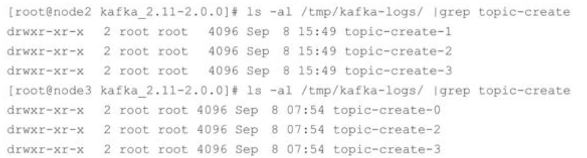

三个broker节点一共创建了8个文件夹，这个数字8实质上是分区数4与副本因子2的乘积。每个副本(或者更确切地说应该是日志，副本与日志一一对应)才真正对应了一个命名形式如\<topic>-\<partition>的文件夹。

主题、分区、副本和 Log(日志)的关系如图 4-1 所示，**主题和分区都是提供给上层用户的抽象，而在副本层面或更加确切地说是Log层面才有实际物理上的存在。同一个分区中的多个副本必须分布在不同的broker中，这样才能提供有效的数据冗余。**对于示例中的分区数为4、副本因子为2、broker数为3的情况下，按照2、3、3的分区副本个数分配给各个broker是最优的选择。再比如在分区数为3、副本因子为3，并且broker数同样为3的情况下，分配3、3、3的分区副本个数给各个broker是最优的选择，也就是每个broker中都拥有所有分区的一个副本。


图4-1 主题、分区、副本和Log之间的关系

我们不仅可以通过日志文件的根目录来查看集群中各个broker的分区副本的分配情况，还可以通过ZooKeeper客户端来获取。当创建一个主题时会在ZooKeeper的/brokers/topics/目录下创建一个同名的实节点，该节点中记录了该主题的分区副本分配方案。示例如下：


示例数据中的"2"：[1，2]表示分区 2 分配了 2 个副本，分别在 brokerId 为 1 和 2 的 broker节点中。

回顾一下1.3 节中提及的知识点：kafka-topics.sh脚本中的 zookeeper、partitions、replication-factor和topic这4个参数分别代表ZooKeeper连接地址、分区数、副本因子和主题名称。另一个 create 参数表示的是创建主题的指令类型，在 kafka-topics.sh 脚本中对应的还有list、describe、alter和delete这4个同级别的指令类型，每个类型所需要的参数也不尽相同。

还可以通过describe指令类型来查看分区副本的分配细节，示例如下：


示例中的Topic和Partition分别表示主题名称和分区号。PartitionCount表示主题中分区的个数，ReplicationFactor表示副本因子，而Configs表示创建或修改主题时指定的参数配置。Leader表示分区的leader副本所对应的brokerId，Isr表示分区的ISR集合，Replicas表示分区的所有的副本分配情况，即AR集合，其中的数字都表示的是brokerId。

使用kafka-topics.sh脚本创建主题的指令格式归纳如下：


到目前为止，创建主题时的分区副本都是按照既定的内部逻辑来进行分配的。kafka-topics.sh脚本中还提供了一个 replica-assignment 参数来手动指定分区副本的分配方案。replica-assignment参数的用法归纳如下：


这种方式根据分区号的数值大小按照从小到大的顺序进行排列，分区与分区之间用逗号“，”隔开，分区内多个副本用冒号“：”隔开。并且在使用replica-assignment参数创建主题时不需要原本必备的partitions和replication-factor这两个参数。

我们可以通过replica-assignment参数来创建一个与主题topic-create相同的分配方案的主题topic-create-same和不同的分配方案的主题topic-create-diff，示例如下：


注意同一个分区内的副本不能有重复，比如指定了0：0，1：1这种，就会报出AdminCommand-FailedException异常，示例如下：


如果分区之间所指定的副本数不同，比如0：1，0，1：0这种，就会报出AdminOperationException异常，示例如下：


当然，类似0：1，，0：1，1：0这种企图跳过一个分区的行为也是不被允许的，示例如下：


在创建主题时我们还可以通过config参数来设置所要创建主题的相关参数，通过这个参数可以**覆盖**原本的默认配置。在创建主题时可以同时设置多个参数，具体的用法归纳如下：


下面的示例使用了config参数来创建一个主题topic-config：


示例中设置了 cleanup.policy 参数为 compact，以及 max.message.bytes 参数为10000，这两个参数都是主题端的配置，我们再次通过 describe 指令来查看所创建的主题信息：


可以看到 Configs 一栏中包含了创建时所设置的参数。我们还可以通过 ZooKeeper 客户端查看所设置的参数，对应的ZooKeeper节点为/config/topics/[topic]，示例如下：


创建主题时对于主题名称的命名方式也很有讲究。**首先是不能与已经存在的主题同名，如果创建了同名的主题就会报错**。我们尝试创建一个已经存在的主题topic-create，示例如下：


通过上面的示例可以看出，**在发生命名冲突时会报出TopicExistsException的异常信息。在kafka-topics.sh 脚本中还提供了一个 if-not-exists 参数，如果在创建主题时带上了这个参数，那么在发生命名冲突时将不做任何处理(既不创建主题，也不报错)。如果没有发生命名冲突，那么和不带if-not-exists参数的行为一样正常创建主题**。我们再次尝试创建一个已经存在的主题topic-create，示例如下：


通过上面的示例可以看出，在添加if-not-exists参数之后，并没有像第一次创建主题时的那样出现“Created topic "topic-create".”的提示信息。通过describe指令查看主题中的分区数和副本因子数，还是同第一次创建时的一样分别为 4 和 2，也并没有被覆盖，如此便证实了if-not-exists参数可以在发生命名冲突时不做任何处理。在实际应用中，如果不想在创建主题的时候跳出TopicExistsException的异常信息，不妨试一下这个参数。

**kafka-topics.sh脚本在创建主题时还会检测是否包含“.”或“_”字符。为什么要检测这两个字符呢？因为在Kafka的内部做埋点时会根据主题的名称来命名metrics的名称，并且会将点号“.”改成下画线“\_”。**假设遇到一个名称为“topic.1_2”的主题，还有一个名称为“topic_1.2”的主题，那么最后的metrics的名称都会为“topic_1_2”，这样就发生了名称冲突。举例如下，首先创建一个以“topic.1_2”为名称的主题，提示 WARNING 警告，之后再创建“topic.1_2”时发生InvalidTopicException异常。


**注意要点：主题的命名同样不推荐(虽然可以这样做)使用双下画线“\_\_”开头，因为以双下画线开头的主题一般看作Kafka的内部主题，比如\_\_consumer_offsets和\_\_transaction_state。主题的名称必须由大小写字母、数字、点号“.”、连接线“-”、下画线“_”组成，不能为空，不能只有点号“.”，也不能只有双点号“..”，且长度不能超过249。**

Kafka从0.10.x版本开始支持指定broker的机架信息(机架的名称)。如果指定了机架信息，则在分区副本分配时会尽可能地让分区副本分配到不同的机架上。指定机架信息是通过broker端参数broker.rack来配置的，比如配置当前broker所在的机架为“RACK1”：


如果一个集群中有部分broker指定了机架信息，并且其余的broker没有指定机架信息，那么在执行kafka-topics.sh脚本创建主题时会报出的AdminOperationException的异常，示例如下：


此时若要成功创建主题，要么将集群中的所有broker都加上机架信息或都去掉机架信息，要么使用disable-rack-aware参数来忽略机架信息，示例如下：


如果集群中的所有broker都有机架信息，那么也可以使用disable-rack-aware参数来忽略机架信息对分区副本的分配影响，有关分区副本的分配细节会在4.1.2节中做详细介绍。

本节开头就提及了 kafka-topics.sh 脚本实质上是调用了 kafka.admin.TopicCommand 类，通过向 TopicCommand 类中传入一些关键参数来实现主题的管理。我们也可以直接调用TopicCommand类中的main()函数来直接管理主题，比如这里创建一个分区数为1、副本因子为1的主题topic-create-api，如代码清单4-1所示。

**代码清单4-1 使用TopicCommand创建主题**

```java
public static void createTopic() {
    String[] options = new String[] {
        "--zookeeper", "localhost:2181/kafka",
        "--create",
        "--replication-factor", "1",
        "--partitions", "1",
        "--topic", "topic-create-api"
    };
    kafka.admin.TopicCommand.main(options);
}
```

使用这种方式需要添加相应的Maven依赖：

```xml
<dependency>
    <groupId>org.apache.kafka</groupId>
    <artifactId>kafka_2.11</artifactId>
    <version>2.0.0</version>
</dependency>
```

可以看到这种方式与使用kafka-topics.sh脚本的方式并无太大差别，可以使用这种方式集成到自动化管理系统中来创建相应的主题。当然这种方式也可以适用于对主题的删、改、查等操作的实现，只需修改对应的参数即可。不过更推荐使用4.2节中介绍的KafkaAdminClient来代替这种实现方式。

### 4.1.2 分区副本的分配

4.1.1节中多处提及了分区副本的分配，读者对此或许有点迷惑，在生产者和消费者中也都有分区分配的概念。生产者的分区分配是指为每条消息指定其所要发往的分区，消费者中的分区分配是指为消费者指定其可以消费消息的分区，而这里的分区分配是指为集群制定创建主题时的分区副本分配方案，即在哪个broker中创建哪些分区的副本。

在创建主题时，如果使用了replica-assignment参数，那么就按照指定的方案来进行分区副本的创建；如果没有使用replica-assignment参数，那么就需要按照内部的逻辑来计算分配方案了。使用kafka-topics.sh脚本创建主题时的内部分配逻辑按照机架信息划分成两种策略：未指定机架信息和指定机架信息。如果集群中所有的 broker 节点都没有配置broker.rack参数，或者使用disable-rack-aware参数来创建主题，那么采用的就是未指定机架信息的分配策略，否则采用的就是指定机架信息的分配策略。

首先看一下未指定机架信息的分配策略，具体的实现涉及代码的逻辑细节，未指定机架信息的分配策略比较容易理解，这里通过源码来逐一进行分析。所对应的具体实现为kafka.admin.AdminUtils.scala文件中的assignReplicasToBrokersRackUnaware()方法，该方法的内容如下：


该方法参数列表中的fixedStartIndex和startPartitionId值是从上游的方法中调用传下来的，都是-1，分别表示第一个副本分配的位置和起始分区编号。assignReplicasToBrokersRackUnaware ()方法的核心是遍历每个分区 partition，然后从 brokerArray (brokerId 的列表)中选取replicationFactor个brokerId分配给这个partition。

该方法首先创建一个可变的Map用来存放该方法将要返回的结果，即分区partition和分配副本的映射关系。由于fixedStartIndex为-1，所以startIndex是一个随机数，用来计算一个起始分配的brokerId，同时又因为startPartitionId为-1，所以currentPartitionId的值为0，可见默认情况下创建主题时总是从编号为0的分区依次轮询进行分配。

nextReplicaShift表示下一次副本分配相对于前一次分配的位移量，从字面上理解有点绕口。举个例子：假设集群中有3个broker节点，对应于代码中的brokerArray，创建的某个主题中有3个副本和6个分区，那么首先从partitionId(partition的编号)为0的分区开始进行分配，假设第一次计算(由rand.nextInt(brokerArray.length)随机产生)得到的nextReplicaShift值为1，第一次随机产生的 startIndex 值为 2，那么 partitionId 为 0 的第一个副本的位置(这里指的是brokerArray的数组下标)firstReplicaIndex=(currentPartitionId+startIndex)%brokerArray.length=(0+2)%3=2，第二个副本的位置为replicaIndex(firstReplicaIndex，nextReplicaShift，j，brokerArray.length)=replicaIndex(2，nextReplicaShift+1，0，3)=？，这里引入了一个新的方法replicaIndex()，不过这个方法很简单，具体如下：


继续计算 replicaIndex(2，nextReplicaShift+1，0，3)=replicaIndex(2，2，0，3)=(2+(1+(2+0)%(3-1)))%3=0。继续计算下一个副本的位置replicaIndex(2，2，1，3)=(2+(1+(2+1)%(3-1)))%3=1。所以partitionId为0的副本分配位置列表为[2，0，1]，如果brokerArray正好是从0开始编号的，也正好是顺序不间断的，即brokerArray为[0，1，2]，那么当前partitionId为0的副本分配策略为[2，0，1]。如果brokerId不是从0开始的，也不是顺序的(有可能之前集群的其中几个broker下线了)，最终的brokerArray为[2，5，8]，那么partitionId为0的分区的副本分配策略为[8，2，5]。为了便于说明问题，可以简单假设brokerArray就是[0，1，2]。

同样计算下一个分区，即partitionId为1的副本分配策略。此时nextReplicaShift的值还是2，没有满足自增的条件。这个分区的 firstReplicaIndex=(1+2)%3=0。第二个副本的位置replicaIndex(0，2，0，3)=(0+(1+(2+0)%(3-1)))%3=1，第三个副本的位置replicaIndex(0，2，1，3)=2，最终partitionId为2的分区分配策略为[0，1，2]。

依次类推，更多的分配细节可以参考下面的示例，topic-test2的分区分配策略和上面陈述的一致：


我们无法预先获知startIndex和nextReplicaShift的值，因为都是随机产生的。startIndex和nextReplicaShift的值可以通过最终的分区分配方案来反推，比如上面的topic-test2，第一个分区(即partitionId=0的分区)的第一个副本为2，那么可由2=(0+startIndex)%3推断出startIndex为2。**之所以startIndex选择随机产生，是因为这样可以在多个主题的情况下尽可能地均匀分布分区副本**，如果这里固定为一个特定值，那么每次的第一个副本都是在这个broker上，进而导致少数几个broker所分配到的分区副本过多而其余broker分配到的分区副本过少，最终导致负载不均衡。尤其是某些主题的副本数和分区数都比较少，甚至都为1的情况下，所有的副本都落到了那个指定的broker上。与此同时，**在分配时位移量nextReplicaShift也可以更好地使分区副本分配得更加均匀**。

相比较而言，指定机架信息的分配策略比未指定机架信息的分配策略要稍微复杂一些，但主体思想并没相差很多，只是将机架信息作为附加的参考项。假设目前有3个机架rack1、rack2和rack3，Kafka集群中的9个broker点都部署在这3个机架之上，机架与broker节点的对照关系如下：


如果不考虑机架信息，那么对照assignReplicasToBrokersRackUnaware()方法里的brokerArray变量的值为[0，1，2，3，4，5,   6，7，8]。指定基架信息的assignReplicasToBrokersRackAware()方法里的brokerArray的值在这里就会被转换为[0，3，6，1，4，7，2，5，8]，显而易见，这是轮询各个机架而产生的结果，如此新的brokerArray(确切地说是arrangedBrokerList)中包含了简单的机架分配信息。之后的步骤也和assignReplicasToBrokersRackUnaware()方法类似，同样包含startIndex、currentPartiionId、nextReplicaShift 的概念，循环为每一个分区分配副本。分配副本时，除了处理第一个副本，其余的也调用 replicaIndex()方法来获得一个 broker，但这里和assignReplicasToBrokersRackUnaware()不同的是，这里不是简单地将这个broker添加到当前分区的副本列表之中，还要经过一层筛选，满足以下任意一个条件的broker不能被添加到当前分区的副本列表之中：

- 如果此broker所在的机架中已经存在一个broker拥有该分区的副本，并且还有其他的机架中没有任何一个broker拥有该分区的副本。

- 如果此broker中已经拥有该分区的副本，并且还有其他broker中没有该分区的副本。

**当创建一个主题时，无论通过kafka-topics.sh脚本，还是通过其他方式(比如4.2节中介绍的KafkaAdminClient)创建主题时，实质上是在ZooKeeper中的/brokers/topics节点下创建与该主题对应的子节点并写入分区副本分配方案，并且在/config/topics/节点下创建与该主题对应的子节点并写入主题相关的配置信息(这个步骤可以省略不执行)。而Kafka创建主题的实质性动作是交由控制器异步去完成的**，有关控制器的更多细节可以参考 6.4 节的相关内容。

知道了 kafka-topics.sh 脚本的实质之后，我们可以直接使用 ZooKeeper 的客户端在/brokers/topics节点下创建相应的主题节点并写入预先设定好的分配方案，这样就可以创建一个新的主题了。这种创建主题的方式还可以绕过一些原本使用kafka-topics.sh脚本创建主题时的一些限制，比如分区的序号可以不用从0开始连续累加了。首先我们通过ZooKeeper客户端创建一个除了与主题topic-create名称不同其余都相同的主题topic-create-zk，示例如下：


通过查看主题topic-create-zk的分配情况，可以看到与主题 topic-create 的信息没有什么差别。


我们再创建一个另类的主题，分配情况和主题 topic-create 一样，唯独分区号已经与主题topic-create-special大相径庭，示例如下：


可以看到分区号为10、21、33和40，而通过单纯地使用kafka-topics.sh脚本是无法实现的。不过这种方式也只是一些实战方面上的技巧，笔者还是建议使用更加正统的kafka-topics.sh脚本或KafkaAdminClient来管理相应的主题。

### 4.1.3 查看主题

4.1.1节中提及了kafka-topics.sh脚本有5种指令类型：create、list、describe、alter和delete。其中list和describe指令可以用来方便地查看主题信息，在前面的内容中我们已经接触过了describe指令的用法，本节会对其做更细致的讲述。

通过list指令可以查看当前所有可用的主题，示例如下：


前面的章节我们都是通过 describe 指令来查看单个主题信息的，如果不使用--topic指定主题，则会展示出所有主题的详细信息。--topic还支持指定多个主题，示例如下：


在使用 describe 指令查看主题信息时还可以额外指定 topics-with-overrides、under-replicated-partitions和unavailable-partitions这三个参数来增加一些附加功能。

增加topics-with-overrides参数可以找出所有包含覆盖配置的主题，它只会列出包含了与集群不一样配置的主题。注意使用topics-with-overrides参数时只显示原本只使用describe指令的第一行信息，参考示例如下：


under-replicated-partitions和unavailable-partitions参数都可以找出有问题的分区。通过 under-replicated-partitions 参数可以找出所有包含失效副本的分区。包含失效副本的分区可能正在进行同步操作，也有可能同步发生异常，此时分区的ISR集合小于 AR 集合。对于通过该参数查询到的分区要重点监控，因为这很可能意味着集群中的某个broker已经失效或同步效率降低等。有关失效副本的更多细节可以参阅8.1.1节。

举个例子，参照主题topic-create的环境，我们将集群中的node2节点下线，之后再通过这个参数来查看topic-create的信息，参考如下：


我们再将node2节点恢复，执行同样的命令，可以看到没有任何信息显示：


通过 unavailable-partitions 参数可以查看主题中没有 leader 副本的分区，这些分区已经处于离线状态，对于外界的生产者和消费者来说处于不可用的状态。

举个例子，参考主题topic-create的环境，我们将集群中的node2和node3节点下线，之后再通过这个参数来查看topic-create的信息，参考如下：


我们再将node2和node3恢复，执行同样的命令，可以看到没有任何信息：


### 4.1.4 修改主题

当一个主题被创建之后，依然允许我们对其做一定的修改，比如修改分区个数、修改配置等，这个修改的功能就是由kafka-topics.sh脚本中的alter指令提供的。

我们首先来看如何增加主题的分区数。以前面的主题topic-config为例，当前分区数为1，修改为3，示例如下：


注意上面提示的告警信息：当主题中的消息包含key时(即key不为null)，根据key计算分区的行为就会受到影响。当topic-config的分区数为1时，不管消息的key为何值，消息都会发往这一个分区；当分区数增加到3时，就会根据消息的key来计算分区号，原本发往分区0的消息现在有可能会发往分区1或分区2。如此还会影响既定消息的顺序，所以在增加分区数时一定要三思而后行。对于基于key计算的主题而言，建议在一开始就设置好分区数量，避免以后对其进行调整。

目前Kafka只支持增加分区数而不支持减少分区数。比如我们再将主题topic-config的分区数修改为1，就会报出InvalidPartitionException的异常，示例如下：


**为什么不支持减少分区？**

按照Kafka现有的代码逻辑，此功能完全可以实现，不过也会使代码的复杂度急剧增大。实现此功能需要考虑的因素很多，比如删除的分区中的消息该如何处理？如果随着分区一起消失则消息的可靠性得不到保障；如果需要保留则又需要考虑如何保留。直接存储到现有分区的尾部，消息的时间戳就不会递增，如此对于Spark、Flink这类需要消息时间戳(事件时间)的组件将会受到影响；如果分散插入现有的分区，那么在消息量很大的时候，内部的数据复制会占用很大的资源，而且在复制期间，此主题的可用性又如何得到保障？与此同时，顺序性问题、事务性问题，以及分区和副本的状态机切换问题都是不得不面对的。反观这个功能的收益点却是很低的，如果真的需要实现此类功能，则完全可以重新创建一个分区数较小的主题，然后将现有主题中的消息按照既定的逻辑复制过去即可。

在创建主题时有一个if-not-exists参数来忽略一些异常，在这里也有对应的参数，如果所要修改的主题不存在，可以通过 if-exists 参数来忽略异常。下面修改一个不存在的主题topic-unknown的分区，会报出错误信息“Topic topic-unknown does not exist”，示例如下：


除了修改分区数，我们还可以使用kafka-topics.sh脚本的alter指令来变更主题的配置。在创建主题的时候我们可以通过config参数来设置所要创建主题的相关参数，通过这个参数可以覆盖原本的默认配置。在创建完主题之后，我们还可以通过alter指令配合config参数增加或修改一些配置以覆盖它们配置原有的值。

下面的示例中演示了将主题topic-config的max.message.bytes配置值从10000修改为20000，示例如下：


我们再次覆盖主题topic-config的另一个配置segment.bytes(看上去相当于增加动作)，示例如下：


我们可以通过delete-config参数来删除之前覆盖的配置，使其恢复原有的默认值。下面的示例将主题topic-config中所有修改过的3个配置都删除：


注意到在变更(增、删、改)配置的操作执行之后都会提示一段告警信息，指明了使用kafka-topics.sh脚本的alter指令来变更主题配置的功能已经过时(deprecated)，将在未来的版本中删除，并且推荐使用kafka-configs.sh脚本来实现相关功能。

### 4.1.5 配置管理

kafka-configs.sh 脚本是专门用来对配置进行操作的，这里的操作是指在运行状态下修改原有的配置，如此可以达到动态变更的目的。kafka-configs.sh脚本包含变更配置alter和查看配置describe这两种指令类型。同使用kafka-topics.sh脚本变更配置的原则一样，增、删、改的行为都可以看作变更操作，不过kafka-configs.sh脚本不仅可以支持操作主题相关的配置，还可以支持操作broker、用户和客户端这3个类型的配置。

kafka-configs.sh脚本使用entity-type参数来指定操作配置的类型，并且使用entity-name参数来指定操作配置的名称。比如查看主题topic-config的配置可以按如下方式执行：


--describe指定了查看配置的指令动作，--entity-type指定了查看配置的实体类型，--entity-name指定了查看配置的实体名称。entity-type只可以配置4个值：topics、brokers、clients和users，entity-type与entity-name的对应关系如表4-1所示。

表4-1 entity-type和entity-name的对应关系


使用alter指令变更配置时，需要配合add-config和delete-config这两个参数一起使用。add-config参数用来实现配置的增、改，即覆盖原有的配置；delete-config参数用来实现配置的删，即删除被覆盖的配置以恢复默认值。

下面的示例演示了 add-config 参数的用法，覆盖了主题 topic-config 的两个配置cleanup.policy和max.message.bytes(示例执行之前主题topic-config无任何被覆盖的配置)：


上面示例中还使用了两种方式来查看主题topic-config中配置信息，注意比较这两者之间的差别。

使用delete-config参数删除配置时，同add-config参数一样支持多个配置的操作，多个配置之间用逗号“，”分隔，下面的示例中演示了如何删除上面刚刚增加的主题配置：


使用kafka-configs.sh脚本来变更(alter)配置时，会在ZooKeeper中创建一个命名形式为/config/\<entity-type>/\<entity-name>的节点，并将变更的配置写入这个节点，比如对于主题topic-config而言，对应的节点名称为/config/topics/topic-config，节点中的数据内容为：


可以推导出节点内容的数据格式为：


其中property-name代表属性名，property-value代表属性值。增加配置实际上是往节点内容中添加属性的键值对，修改配置是在节点内容中修改相应属性的属性值，删除配置是删除相应的属性键值对。

变更配置时还会在ZooKeeper中的/config/changes/节点下创建一个以“config_change\_”为前缀的持久顺序节点(PERSISTENT_SEQUENTIAL)，节点命名形式可以归纳为/config/changes/config_change_\<seqNo>。比如示例中的主题topic-config与此对应的节点名称和节点内容如下：


seqNo是一个单调递增的10位数字的字符串，不足位则用0补齐。

查看(describe)配置时，就是从/config/\<entity-type>/\<entity-name>节点中获取相应的数据内容。如果使用 kafka-configs.sh 脚本查看配置信息时没有指定entity-name参数的值，则会查看entity-type所对应的所有配置信息。示例如下：


### 4.1.6 主题端参数

与主题相关的所有配置参数在 broker 层面都有对应参数，比如主题端参数 cleanup.policy对应broker层面的log.cleanup.policy。如果没有修改过主题的任何配置参数，那么就会使用broker端的对应参数作为其默认值。可以在创建主题时覆盖相应参数的默认值，也可以在创建完主题之后变更相应参数的默认值。比如在创建主题的时候没有指定cleanup.policy 参数的值，那么就使用 log.cleanup.policy 参数所配置的值作为cleanup.policy的值。

与主题相关的参数也有很多，由于篇幅限制，在前面的配置变更的示例中难以一一列出所有的参数，但是从配置变更的角度而言，其操作方式都是一样的。为了便于读者查阅，表 4-2列出了主题端参数与broker端参数的对照关系。

表4-2 主题端参数与broker端参数的对照关系


续表


续表


### 4.1.7 删除主题

如果确定不再使用一个主题，那么最好的方式是将其删除，这样可以释放一些资源，比如磁盘、文件句柄等。kafka-topics.sh脚本中的delete指令就可以用来删除主题，比如删除一个主题topic-delete：


可以看到在执行完删除命令之后会有相关的提示信息，这个提示信息和broker端配置参数delete.topic.enable 有关。必须将delete.topic.enable参数配置为true才能够删除主题，这个参数的默认值就是true，如果配置为false，那么删除主题的操作将会被忽略。在实际生产环境中，建议将这个参数的值设置为true。

如果要删除的主题是 Kafka 的内部主题，那么删除时就会报错。截至 Kafka 2.0.0，Kafka的内部一共包含2个主题，分别为\_\_consumer_offsets和\__transaction_state。下面的示例中尝试删除内部主题__consumer_offsets：


尝试删除一个不存在的主题也会报错。比如下面的示例中尝试删除一个不存在的主题topic-unknown：


这里同alter指令一样，也可以通过if-exists参数来忽略异常，参考如下：


**使用kafka-topics.sh脚本删除主题的行为本质上只是在ZooKeeper中的/admin/delete_topics 路径下创建一个与待删除主题同名的节点，以此标记该主题为待删除的状态。与创建主题相同的是，真正删除主题的动作也是由Kafka的控制器负责完成的。**

了解这一原理之后，我们可以直接通过ZooKeeper的客户端来删除主题。下面示例中使用ZooKeeper客户端zkCli.sh来删除主题topic-delete：


我们还可以通过手动的方式来删除主题。主题中的元数据存储在 ZooKeeper 中的/brokers/topics 和/config/topics 路径下，主题中的消息数据存储在 log.dir 或log.dirs配置的路径下，我们只需要手动删除这些地方的内容即可。下面的示例中演示了如何删除主题topic-delete，总共分3个步骤，第一步和第二步的顺序可以互换。

第一步，删除ZooKeeper中的节点/config/topics/topic-delete。


第二步，删除ZooKeeper中的节点/brokers/topics/topic-delete及其子节点。


第三步，删除集群中所有与主题topic-delete有关的文件。

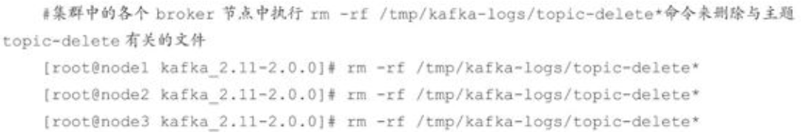

注意，**删除主题是一个不可逆的操作。一旦删除之后，与其相关的所有消息数据会被全部删除**，所以在执行这一操作的时候也要三思而后行。

介绍到这里，基本上kafka-topics.sh脚本的使用也就讲完了，为了方便读者查阅，表4-3中列出了所有kafka-topics.sh脚本中的参数。读者也可以通过执行无任何参数的kafka-topics.sh脚本，或者执行kafka-topics.sh-help来查看帮助信息。

表4-3 kafka-topics.sh脚本中的参数


续表


## 4.2 初识KafkaAdminClient

一般情况下，我们都习惯使用kafka-topics.sh脚本来管理主题，但有些时候我们希望将主题管理类的功能集成到公司内部的系统中，打造集管理、监控、运维、告警为一体的生态平台，那么就需要以程序调用API的方式去实现。本节主要介绍KafkaAdminClient的基本使用方式，以及采用这种调用API方式下的创建主题时的合法性验证。

### 4.2.1 基本使用

代码清单4-1中使用TopicCommand创建了一个主题，当然我们也可以用它来实现主题的删除、修改、查看等操作，实质上与使用 kafka-config.sh 脚本的方式无异。这种方式与应用程序之间的交互性非常差，且不说它的编程模型类似于拼写字符串，它本身调用的TopicCommand类的main()方法的返回值是一个void类，并不能提供给调用者有效的反馈信息。比如我们使用下面的方式来查看主题topic-create的详细信息，如代码清单4-2所示。

**代码清单4-2 查看主题**

```java
public static void describeTopic() {
    String[] options = new String[]{
        "--zookeeper", "localhost:2181/kafka200",
        "--describe",
        "--topic", "topic-create"
    };
    kafka.admin.TopicCommand.main(options);
}
```

当调用 describeTopic()方法时，虽然我们可以在终端看到主题 topic-create 的详细信息，但方法的调用者却无法捕获这个信息，因为返回值类型为void。对于方法的调用者而言，执行这个方法和不执行这个方法没有什么区别。

在 Kafka 0.11.0.0 版本之前，我们可以通过 kafka-core 包(Kafka 服务端代码)下的kafka.admin.AdminClient和kafka.admin.AdminUtils来实现部分Kafka的管理功能，但它们都已经过时了，在未来的版本中会被删除。从 0.11.0.0 版本开始，Kafka 提供了另一个工具类org.apache.kafka.clients.admin.KafkaAdminClient来作为替代方案。KafkaAdminClient不仅可以用来管理broker、配置和ACL(Access Control List)，还可以用来管理主题。

KafkaAdminClient继承了org.apache.kafka.clients.admin.AdminClient抽象类，并提供了多种方法。篇幅限制，下面只列出与本章内容相关的一些方法。

- 创建主题：CreateTopicsResult createTopics(Collection\<NewTopic>newTopics)。

- 删除主题：DeleteTopicsResult deleteTopics(Collection\<String>topics)。

- 列出所有可用的主题：ListTopicsResult listTopics()。

- 查看主题的信息：DescribeTopicsResult describeTopics(Collection\<String>topicNames)。

- 查询配置信息：DescribeConfigsResult describeConfigs(Collection\<ConfigResource>resources)。

- 修改配置信息：AlterConfigsResult alterConfigs(Map\<ConfigResource，Config>configs)。

- 增加分区：CreatePartitionsResult createPartitions(Map\<String，NewPartitions>newPartitions)。

下面分别介绍这些方法的具体使用方式。首先分析如何使用KafkaAdminClient创建一个主题，下面的示例中创建了一个分区数为 4、副本因子为 1 的主题 topic-admin，如代码清单 4-3所示。

**代码清单4-3 使用KafkaAdminClient创建一个主题**

```java
String brokerList = "localhost:9092";
String topic = "topic-admin";

Properties props = new Properties();
props.put(AdminClientConfig.BOOTSTRAP_SERVERS_CONFIG, brokerList);
props.put(AdminClientConfig.REQUEST_TIMEOUT_MS_CONFIG, 30000);
AdminClient client = AdminClient.create(props);

NewTopic newTopic = new NewTopic(topic, 4, (short) 1);
CreateTopicsResult result = client.createTopics(Collections.singleton(newTopic));
try {
    result.all().get();
} catch (InterruptedException | ExecutionException e) {
    e.printStackTrace();
} finally {
    client.close();
}
```

示例中第7行创建了一个KafkaAdminClient实例，实例中通过引入在第4行中建立的配置来连接 Kafka 集群。AdminClient.create()方法实际上调用的就是 KafkaAdminClient 中的createInternal方法构建的KafkaAdminClient实例，具体定义如下：

```java
public static AdminClient create(Properties props) {
    return KafkaAdminClient.createInternal(new AdminClientConfig(props), null);
}
```

第9行中的 NewTopic 用来设定所要创建主题的具体信息，包含创建主题时需要的主题名称、分区数和副本因子等。NewTopic中的成员变量如下所示。

```java
private final String name; // 主题名称
private final int numPartitions; // 分区数
private final short replicationFactor; // 副本因子
private final Map<Integer, List<Integer>> replicasAssignments; // 分配方案
private Map<String, String> configs = null; // 配置
```

同kafka-topics.sh脚本一样，可以通过指定分区数和副本因子来创建一个主题，也可以通过指定区副本的具体分配方案来创建一个主题，比如将第9行替换为下面的内容：

```java
NewTopic newTopic = new NewTopic(topic, numPartitions, replicationFactor);

// 为每个分区设置副本分配
newTopic.replicasAssignments().put(0, Arrays.asList(0));
newTopic.replicasAssignments().put(1, Arrays.asList(0));
newTopic.replicasAssignments().put(2, Arrays.asList(0));
newTopic.replicasAssignments().put(3, Arrays.asList(0));
```

也可以在创建主题时指定需要覆盖的配置。比如覆盖 cleanup.policy 配置，需要在第9和第10行之间加入如下代码：

```java
Map<String, String> configs = new HashMap<>();
configs.put("cleanup.policy", "compact");

newTopic.configs(configs);
```

第10行是真正的创建主题的核心。KafkaAdminClient内部使用Kafka 的一套自定义二进制协议来实现诸如创建主题的管理功能。它主要的实现步骤如下：

(1)客户端根据方法的调用创建相应的协议请求，比如创建主题的createTopics方法，其内部就是发送CreateTopicRequest请求。

(2)客户端将请求发送至服务端。

(3)服务端处理相应的请求并返回响应，比如这个与CreateTopicRequest请求对应的就是CreateTopicResponse。

(4)客户端接收相应的响应并进行解析处理。和协议相关的请求和相应的类基本都在org.apache.kafka.common.requests包下，AbstractRequest和AbstractResponse是这些请求和响应类的两个基本父类。

有关Kafka的自定义协议的更多内容可以参阅6.1节。

第10行中的返回值是CreateTopicsResult类型，它的具体定义也很简单，如代码清单4-4所示。

**代码清单4-4 CreateTopicsResult的具体内容**

```java
public class CreateTopicsResult {
    private final Map<String, KafkaFuture<Void>> futures;

    CreateTopicsResult(Map<String, KafkaFuture<Void>> futures) {
        this.futures = futures;
    }

    public Map<String, KafkaFuture<Void>> values() {
        return futures;
    }

    public KafkaFuture<Void> all() {
        return KafkaFuture.allOf(futures.values().toArray(new KafkaFuture[0]));
    }
}
```

CreateTopicsResult 中的方法主要还是针对成员变量 futures 的操作，futures 的类型Map\<String，KafkaFuture\<Void>>中的key代表主题名称，而KafkaFuture\<Void>代表创建后的返回值类型。KafkaAdminClient中的createTopics()方法可以一次性创建多个主题。KafkaFuture是原本为了支持JDK8以下的版本而自定义实现的一个类，实现了Future接口，可以通过Future.get()方法来等待服务端的返回，参见代码清单 4-3 中的第12行。在未来的版本中，会有计划地将KafkaFuture替换为JDK8中引入的CompletableFuture。

虽然这里创建主题之后的返回值类型为Void，但并不代表所有操作的返回值类型都是Void，比如 KafkaAdminClient 中的 listTopics()方法的返回值为 ListTopicsResult 类型，这个ListTopicsResult类型内部的成员变量future的类型为KafkaFuture\<Map\<String，TopicListing>>，这里就包含了具体的返回信息。

在使用KafkaAdminClient之后记得要调用close()方法来释放资源。

KafkaAdminClient中的deleteTopics()、listTopics()及describeTopics()方法都很简单，读者不妨自己实践一下。下面讲一讲describeConfigs()和alterConfigs()这两个方法。首先查看刚刚创建的主题topic-admin的具体配置信息，如代码清单4-5所示。

**代码清单4-5 describeConfigs()方法的使用示例**

```java
import org.apache.kafka.clients.admin.*;
import org.apache.kafka.common.config.ConfigResource;

import java.util.Collections;
import java.util.Properties;
import java.util.concurrent.ExecutionException;

public class DescribeTopicConfig {
    public static void describeTopicConfig() throws ExecutionException, InterruptedException {
        String brokerList = "localhost:9092";
        String topic = "topic-admin";

        Properties props = new Properties();
        props.put(AdminClientConfig.BOOTSTRAP_SERVERS_CONFIG, brokerList);
        props.put(AdminClientConfig.REQUEST_TIMEOUT_MS_CONFIG, 30000);

        AdminClient client = AdminClient.create(props);
        ConfigResource resource = new ConfigResource(ConfigResource.Type.TOPIC, topic);
        DescribeConfigsResult result = client.describeConfigs(Collections.singleton(resource));
        Config config = result.all().get().get(resource);
        System.out.println(config);
        client.close();
    }
}
```

最终的输出结果**不会只列出被覆盖的配置信息，而是会列出主题中所有的配置信息**。

alterConfigs()方法的使用方式也很简单。下面的示例中将主题 topic-admin 的cleanup.policy参数修改为compact，只需将代码清单4-5中的第18至第21行替换为下面的内容即可：

```java
ConfigResource resource = new ConfigResource(ConfigResource.Type.TOPIC, topic);
ConfigEntry entry = new ConfigEntry("cleanup.policy", "compact");
Config config = new Config(Collections.singleton(entry));
Map<ConfigResource, Config> configs = new HashMap<>();
configs.put(resource, config);

AlterConfigsResult result = client.alterConfigs(configs);
result.all().get();
```

本章的最后将演示如何使用KafkaAdminClient的createPartitions()方法来增加一个主题的分区。下面的示例将主题topic-admin的分区从4增加到5，只需将代码清单4-5中的第18至第21行替换为下面的内容即可：

```java
NewPartitions newPartitions = NewPartitions.increaseTo(5);
Map<String, NewPartitions> newPartitionsMap = new HashMap<>();
newPartitionsMap.put(topic, newPartitions);

CreatePartitionsResult result = client.createPartitions(newPartitionsMap);
result.all().get();
```

本节主要讲述如何使用KafkaAdminClient来管理主题，对于其他的功能介绍，以及如何改造扩展KafkaAdminClient的功能并没有涉及，不过这些都会在6.4.2节和10.2节中进行扩充。

### 4.2.2 主题合法性验证

一般情况下，Kafka 生产环境中的 auto.create.topics.enable 参数会被设置为false，即自动创建主题这条路会被堵住。kafka-topics.sh脚本创建的方式一般由运维人员操作，普通用户无权过问。那么KafkaAdminClient就为普通用户提供了一个“口子”，或者将其集成到公司内部的资源申请、审核系统中会更加方便。普通用户在创建主题的时候，有可能由于误操作或其他原因而创建了不符合运维规范的主题，比如命名不规范，副本因子数太低等，这些都会影响后期的系统运维。如果创建主题的操作封装在资源申请、审核系统中，那么在前端就可以根据规则过滤不符合规范的申请操作。如果用户用KafkaAdminClient或类似的工具创建了一个错误的主题，我们有什么办法可以做相应的规范处理呢？

Kafka broker 端有一个这样的参数：create.topic.policy.class.name，默认值为null，它提供了一个入口用来验证主题创建的合法性。使用方式很简单，只需要自定义实现org.apache.kafka.server.policy.CreateTopicPolicy 接口，比如下面示例中的 PolicyDemo。然后在broker 端的配置文件 config/server.properties 中配置参数 create.topic.policy.class.name的值为org.apache.kafka.server.policy.PolicyDemo，最后启动服务。PolicyDemo的代码参考代码清单4-6，主要实现接口中的configure()、close()及validate()方法，configure()方法会在Kafka服务启动的时候执行，validate()方法用来鉴定主题参数的合法性，其在创建主题时执行，close()方法在关闭Kafka服务时执行。

**代码清单4-6 主题合法性验证示例**

```java
import org.apache.kafka.server.policy.CreateTopicPolicy;
import org.apache.kafka.server.policy.PolicyViolationException;
import org.apache.kafka.server.policy.RequestMetadata;

import java.util.Map;

public class PolicyDemo implements CreateTopicPolicy {
    @Override
    public void configure(Map<String, ?> configs) {
        // 这里可以配置策略的参数
    }

    @Override
    public void close() throws Exception {
        // 在关闭策略时执行的操作
    }

    @Override
    public void validate(RequestMetadata requestMetadata) throws PolicyViolationException {
        if (requestMetadata.numPartitions() != null && requestMetadata.replicationFactor() != null) {
            if (requestMetadata.numPartitions() < 5) {
                throw new PolicyViolationException("Topic should have at least 5 partitions, received: " +
                        requestMetadata.numPartitions());
            }
            if (requestMetadata.replicationFactor() <= 1) {
                throw new PolicyViolationException("Topic should have at least 2 replication factor, received: " +
                        requestMetadata.replicationFactor());
            }
        }
    }
}
```

此时如果采用代码清单4-3中的方式创建一个分区数为4、副本因子为1的主题，那么客户端就出报出如下的错误：


相应的Kafka服务端的日志如下：


## 4.3 分区的管理

本节主要介绍与分区相关的知识和操作，包括优先副本的选举、分区重分配、复制限流、修改副本因子等内容。

### 4.3.1 优先副本的选举

分区使用多副本机制来提升可靠性，但只有leader副本对外提供读写服务，而follower副本只负责在内部进行消息的同步。如果一个分区的leader副本不可用，那么就意味着整个分区变得不可用，此时就需要Kafka从剩余的follower副本中挑选一个新的leader副本来继续对外提供服务。虽然不够严谨，但从某种程度上说，broker 节点中 leader 副本个数的多少决定了这个节点负载的高低。

在创建主题的时候，该主题的分区及副本会尽可能均匀地分布到 Kafka 集群的各个broker节点上，对应的leader副本的分配也比较均匀。比如我们使用kafka-topics.sh脚本创建一个分区数为3、副本因子为3的主题topic-partitions，创建之后的分布信息如下：


可以看到leader副本均匀分布在brokerId为0、1、2的broker节点之中。针对同一个分区而言，同一个broker节点中不可能出现它的多个副本，即Kafka集群的一个broker中最多只能有它的一个副本，我们可以将leader副本所在的broker节点叫作分区的leader节点，而follower副本所在的broker节点叫作分区的follower节点。

随着时间的更替，Kafka 集群的broker 节点不可避免地会遇到宕机或崩溃的问题，**当分区的leader节点发生故障时，其中一个follower节点就会成为新的leader节点，这样就会导致集群的负载不均衡，从而影响整体的健壮性和稳定性。当原来的leader节点恢复之后重新加入集群时，它只能成为一个新的follower节点而不再对外提供服务**。比如我们将brokerId为2的节点重启，那么主题topic-partitions新的分布信息如下：


可以看到原本分区1的leader节点为2，现在变成了0，如此一来原本均衡的负载变成了失衡：节点0的负载最高，而节点1的负载最低。

为了能够有效地治理负载失衡的情况，Kafka引入了优先副本(preferred replica)的概念。**所谓的优先副本是指在 AR 集合列表中的第一个副本**。比如上面主题 topic-partitions 中分区 0的AR集合列表(Replicas)为[1，2，0]，那么分区0的优先副本即为1。理想情况下，优先副本就是该分区的leader副本，所以也可以称之为preferred leader。**Kafka要确保所有主题的优先副本在Kafka集群中均匀分布**，这样就保证了所有分区的leader均衡分布。如果leader分布过于集中，就会造成集群负载不均衡。

所谓的**优先副本的选举是指通过一定的方式促使优先副本选举为leader副本**，以此来促进集群的负载均衡，这一行为也可以称为“分区平衡”。

需要注意的是，**分区平衡并不意味着Kafka集群的负载均衡，因为还要考虑集群中的分区分配是否均衡**。更进一步，每个分区的leader副本的负载也是各不相同的，有些leader副本的负载很高，比如需要承载TPS为30000的负荷，而有些leader副本只需承载个位数的负荷。也就是说，就算集群中的分区分配均衡、leader 分配均衡，也并不能确保整个集群的负载就是均衡的，还需要其他一些硬性的指标来做进一步的衡量，这个会在后面的章节中涉及，本节只探讨优先副本的选举。

在 Kafka 中可以提供分区自动平衡的功能，与此对应的 broker 端参数是 auto.leader.rebalance.enable，此参数的默认值为true，即默认情况下此功能是开启的。如果开启分区自动平衡的功能，则 Kafka 的控制器会启动一个定时任务，这个定时任务会轮询所有的 broker节点，计算每个broker节点的分区不平衡率(broker中的不平衡率=非优先副本的leader个数/分区总数)是否超过leader.imbalance.per.broker.percentage参数配置的比值，默认值为 10%，如果超过设定的比值则会自动执行优先副本的选举动作以求分区平衡。执行周期由参数leader.imbalance.check.interval.seconds控制，默认值为300秒，即5分钟。

不过在生产环境中不建议将auto.leader.rebalance.enable设置为默认的true，因为这可能引起负面的性能问题，也有可能引起客户端一定时间的阻塞。因为执行的时间无法自主掌控，如果在关键时期(比如电商大促波峰期)执行关键任务的关卡上执行优先副本的自动选举操作，势必会有业务阻塞、频繁超时之类的风险。前面也分析过，分区及副本的均衡也不能完全确保集群整体的均衡，并且集群中一定程度上的不均衡也是可以忍受的，为防止出现关键时期“掉链子”的行为，笔者建议还是将掌控权把控在自己的手中，可以针对此类相关的埋点指标设置相应的告警，在合适的时机执行合适的操作，而这个“合适的操作”就是指手动执行分区平衡。

Kafka中kafka-perferred-replica-election.sh脚本提供了对分区leader副本进行重新平衡的功能。**优先副本的选举过程是一个安全的过程，Kafka客户端可以自动感知分区leader副本的变更。**下面的示例演示了kafka-perferred-replica-election.sh脚本的具体用法：


可以看到在脚本执行之后，主题topic-partitions中的所有leader副本的分布已经和刚创建时的一样了，所有的优先副本都成为leader副本。

上面示例中的这种使用方式会将集群上所有的分区都执行一遍优先副本的选举操作，分区数越多打印出来的信息也就越多。leader 副本的转移也是一项高成本的工作，如果要执行的分区数很多，那么必然会对客户端造成一定的影响。如果集群中包含大量的分区，那么上面的这种使用方式有可能会失效。**在优先副本的选举过程中，具体的元数据信息会被存入 ZooKeeper的/admin/preferred_replica_election节点，如果这些数据超过了ZooKeeper节点所允许的大小，那么选举就会失败。默认情况下ZooKeeper所允许的节点数据大小为1MB。**

kafka-perferred-replica-election.sh脚本中还提供了path-to-json-file参数来小批量地对部分分区执行优先副本的选举操作。通过path-to-json-file参数来指定一个JSON文件，这个JSON文件里保存需要执行优先副本选举的分区清单。

举个例子，我们再将集群中 brokerId 为 2 的节点重启，不过我们现在只想对主题 topic-partitions执行优先副本的选举操作，那么先创建一个JSON文件，文件名假定为election.json，文件的内容如下：

```json
{
  "partitions": [
    {
      "partition": 0,
      "topic": "topic-partitions"
    },
    {
      "partition": 1,
      "topic": "topic-partitions"
    },
    {
      "partition": 2,
      "topic": "topic-partitions"
    }
  ]
}
```

然后通过kafka-perferred-replica-election.sh脚本配合path-to-json-file参数来对主题topic-partitions执行优先副本的选举操作，具体示例如下：


读者可以自行查看一下集群中的其他主题是否像之前没有使用 path-to-json-file 参数的一样也被执行了选举操作。

**在实际生产环境中，一般使用 path-to-json-file 参数来分批、手动地执行优先副本的选举操作。**尤其是在应对大规模的 Kafka 集群时，理应杜绝采用非 path-to-json-file参数的选举操作方式。同时，优先副本的选举操作也要注意避开业务高峰期，以免带来性能方面的负面影响。

### 4.3.2 分区重分配

当集群中的一个节点突然宕机下线时，如果节点上的分区是单副本的，那么这些分区就变得不可用了，在节点恢复前，相应的数据也就处于丢失状态；如果节点上的分区是多副本的，那么位于这个节点上的leader副本的角色会转交到集群的其他follower副本中。总而言之，这个节点上的分区副本都已经处于功能失效的状态，Kafka 并不会将这些失效的分区副本自动地迁移到集群中剩余的可用broker节点上，如果放任不管，则不仅会影响整个集群的均衡负载，还会影响整体服务的可用性和可靠性。

当要对集群中的一个节点进行有计划的下线操作时，为了保证分区及副本的合理分配，我们也希望通过某种方式能够将该节点上的分区副本迁移到其他的可用节点上。

当集群中新增broker节点时，只有新创建的主题分区才有可能被分配到这个节点上，而之前的主题分区并不会自动分配到新加入的节点中，因为在它们被创建时还没有这个新节点，这样新节点的负载和原先节点的负载之间严重不均衡。

为了解决上述问题，需要让分区副本再次进行合理的分配，也就是所谓的分区重分配。Kafka提供了 kafka-reassign-partitions.sh 脚本来执行分区重分配的工作，它可以在集群扩容、broker节点失效的场景下对分区进行迁移。

kafka-reassign-partitions.sh 脚本的使用分为 3 个步骤：首先创建需要一个包含主题清单的JSON 文件，其次根据主题清单和 broker 节点清单生成一份重分配方案，最后根据这份方案执行具体的重分配动作。

下面我们通过一个具体的案例来演示kafka-reassign-partitions.sh脚本的用法。首先在一个由3个节点(broker 0、broker 1、broker 2)组成的集群中创建一个主题topic-reassign，主题中包含4个分区和2个副本：


我们可以观察到主题topic-reassign在3个节点中都有相应的分区副本分布。由于某种原因，我们想要下线brokerId为1的broker节点，在此之前，我们要做的就是将其上的分区副本迁移出去。使用kafka-reassign-partitions.sh脚本的第一步就是要创建一个JSON文件(文件的名称假定为reassign.json)，文件内容为要进行分区重分配的主题清单。对主题topic-reassign而言，示例如下：

```json
{
  "topics": [
    {
      "topic": "topic-reassign"
    }
  ],
  "version": 1
}
```

第二步就是根据这个JSON文件和指定所要分配的broker节点列表来生成一份候选的重分配方案，具体内容参考如下：


上面的示例中包含4个参数，其中zookeeper已经很常见了，用来指定ZooKeeper的地址。generate是kafka-reassign-partitions.sh脚本中指令类型的参数，可以类比于kafka-topics.sh脚本中的 create、list 等，它用来生成一个重分配的候选方案。topic-to-move-json用来指定分区重分配对应的主题清单文件的路径，该清单文件的具体的格式可以归纳为{"topics"：[{"topic"："foo"}，{"topic"："foo1"}]，"version"：1}。broker-list用来指定所要分配的broker节点列表，比如示例中的“0，2”。

上面示例中打印出了两个JSON格式的内容。**第一个“Current partition replica assignment”所对应的 JSON 内容为当前的分区副本分配情况，在执行分区重分配的时候最好将这个内容保存起来，以备后续的回滚操作。第二个“Proposed partition reassignment configuration”所对应的JSON 内容为重分配的候选方案，注意这里只是生成一份可行性的方案，并没有真正执行重分配的动作。**生成的可行性方案的具体算法和创建主题时的一样，这里也包含了机架信息，具体的细节可以参考4.1.2节的内容。

我们需要将第二个JSON内容保存在一个JSON文件中，假定这个文件的名称为project.json。

第三步执行具体的重分配动作，详细参考如下：


我们再次查看主题topic-reassign的具体信息：


可以看到主题中的所有分区副本都只在0和2的broker节点上分布了。

在第三步的操作中又多了2个参数，execute也是指令类型的参数，用来指定执行重分配的动作。reassignment-json-file 指定分区重分配方案的文件路径，对应于示例中的project.json文件。

除了让脚本自动生成候选方案，用户还可以自定义重分配方案，这样也就不需要执行第一步和第二步的操作了。

**分区重分配的基本原理是先通过控制器为每个分区添加新副本(增加副本因子)，新的副本将从分区的leader副本那里复制所有的数据。根据分区的大小不同，复制过程可能需要花一些时间，因为数据是通过网络复制到新副本上的。在复制完成之后，控制器将旧副本从副本清单里移除(恢复为原先的副本因子数)。注意在重分配的过程中要确保有足够的空间。**

细心的读者可能观察到主题topic-reassign中有3个leader副本在broker 0上，而只有1个leader副本在broker 2上，这样负载就不均衡了。不过我们可以借助4.3.1节中的kafka-perferred-replica-election.sh 脚本来执行一次优先副本的选举动作，之后可以看到主题 topic-reassign 的具体信息已经趋于完美：


对于分区重分配而言，这里还有可选的第四步操作，即验证查看分区重分配的进度。只需将上面的execute替换为verify即可，具体示例如下：

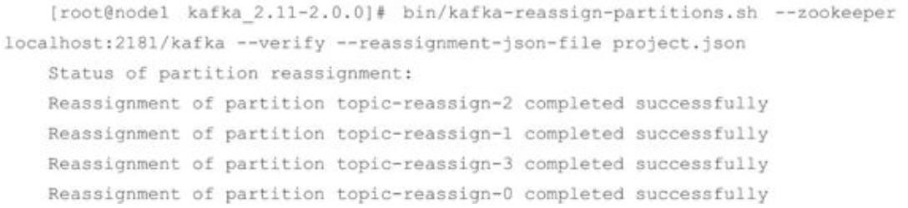

**分区重分配对集群的性能有很大的影响，需要占用额外的资源，比如网络和磁盘。在实际操作中，我们将降低重分配的粒度，分成多个小批次来执行**，以此来将负面的影响降到最低，这一点和优先副本的选举有异曲同工之妙。

还需要注意的是，**如果要将某个broker下线，那么在执行分区重分配动作之前最好先关闭或重启broker**。这样这个broker就不再是任何分区的leader节点了，它的分区就可以被分配给集群中的其他broker。这样可以减少broker间的流量复制，以此提升重分配的性能，以及减少对集群的影响。

### 4.3.3 复制限流

在4.3.2节中我们了解了分区重分配本质在于数据复制，先增加新的副本，然后进行数据同步，最后删除旧的副本来达到最终的目的。数据复制会占用额外的资源，如果重分配的量太大必然会严重影响整体的性能，尤其是处于业务高峰期的时候。减小重分配的粒度，以小批次的方式来操作是一种可行的解决思路。如果集群中某个主题或某个分区的流量在某段时间内特别大，那么只靠减小粒度是不足以应对的，这时就需要有一个限流的机制，可以对副本间的复制流量加以限制来保证重分配期间整体服务不会受太大的影响。

副本间的复制限流有两种实现方式：kafka-config.sh脚本和kafka-reassign-partitions.sh脚本。

首先，我们讲述如何通过 kafka-config.sh 脚本来实现限流，如果对这个脚本的使用有些遗忘，则可以再回顾一下4.1.5节的内容。不过4.1.5节里只演示了主题相关的配置变更，并没有涉及其他的类型，本节的内容会与 broker 类型的配置相关，不妨借助这个机会再来了解一下broker类型的配置用法。

kafka-config.sh脚本主要以动态配置的方式来达到限流的目的，在broker级别有两个与复制限流相关的配置参数：follower.replication.throttled.rate和leader.replication.throttled.rate，前者用于设置follower副本复制的速度，后者用于设置leader副本传输的速度，它们的单位都是B/s。通常情况下，两者的配置值是相同的。下面的示例中将broker 1中的leader副本和follower副本的复制速度限制在1024B/s之内，即1KB/s：


我们再来查看一下broker 1中刚刚添加的配置，参考如下：


在 4.1.5 节中我们了解到变更配置时会在 ZooKeeper 中创建一个命名形式为/config/\<entity-type>/\<entity-name>的节点，对于这里的示例而言，其节点就是/config/brokers/1，节点中相应的信息如下：


删除刚刚添加的配置也很简单，与4.1.5节中主题类型的方式一样，参考如下：


在主题级别也有两个相关的参数来限制复制的速度：leader.replication.throttled.replicas 和 follower.replication.throttled.replicas，它们分别用来配置被限制速度的主题所对应的leader副本列表和follower副本列表。为了演示具体的用法，我们先创建一个分区数为3、副本数为2的主题topic-throttle，并查看它的详细信息：


在上面示例中，主题topic-throttle的三个分区所对应的leader节点分别为0、1、2，即分区与代理的映射关系为0：0、1：1、2：2，而对应的 follower 节点分别为1、2、0，相关的分区与代理的映射关系为0：1、1：2、2：0，那么此主题的限流副本列表及具体的操作细节如下：


对应的ZooKeeper中的/config/topics/topic-throttle节点信息如下：


在了解了与限流相关的4个配置参数之后，我们演示一下带有限流的分区重分配的用法。首先按照4.3.2节的步骤创建一个包含可行性方案的project.json文件，内容如下：

```json
{
  "version": 1,
  "partitions": [
    {
      "topic": "topic-throttle",
      "partition": 1,
      "replicas": [2, 0],
      "log.dirs": ["any", "any"]
    },
    {
      "topic": "topic-throttle",
      "partition": 0,
      "replicas": [0, 2],
      "log.dirs": ["any", "any"]
    },
    {
      "topic": "topic-throttle",
      "partition": 2,
      "replicas": [0, 2],
      "log.dirs": ["any", "any"]
    }
  ]
}
```

接下来设置被限流的副本列表，这里就很有讲究了，首先看一下重分配前和分配后的分区副本布局对比，详细如下：


**如果分区重分配会引起某个分区AR集合的变更，那么这个分区中与leader有关的限制会应用于重分配前的所有副本，因为任何一个副本都可能是leader，而与follower有关的限制会应用于所有移动的目的地。**从概念上理解会比较抽象，这里不妨举个例子，对上面的布局对比而言，分区0重分配的AR为[0，1]，重分配后的AR为[0，2]，那么这里的目的地就是新增的2。也就是说，对分区0而言，leader.replication.throttled.replicas配置为[0：0，0：1]，follower.replication.throttled.replicas 配置为[0：2]。同理，对于分区 1 而言，leader.replication.throttled.replicas配置为[1：1，1：2]，follower.replication.throttled.replicas配置为[1：0]。分区3的AR集合没有发生任何变化，这里可以忽略。

获取限流副本列表之后，我们就可以执行具体的操作了，详细如下：


接下来再设置broker 2的复制速度为10B/s，这样在下面的操作中可以很方便地观察限流与不限流的不同：


在执行具体的重分配操作之前，我们需要开启一个生产者并向主题 topic-throttle 中发送一批消息，这样可以方便地观察正在进行数据复制的过程。

之后我们再执行正常的分区重分配的操作，示例如下：


执行之后，可以查看执行的进度，示例如下：


可以看到分区topic-throttle-0还在同步过程中，因为我们之前设置了broker 2的复制速度为10B/s，这样使同步变得缓慢，分区topic-throttle-0需要同步数据到位于broker 2的新增副本中。随着时间的推移，分区topic-throttle-0最终会变成“completed successful”的状态。

为了不影响Kafka本身的性能，往往对临时设置的一些限制性的配置在使用完后要及时删除，而 kafka-reassign-partitions.sh 脚本配合指令参数 verify 就可以实现这个功能，在所有的分区都重分配完成之后执行查看进度的命令时会有如下的信息：


注意到最后一行信息“Throttle was removed.”，它提示了所有之前针对限流做的配置都已经被清除了，读者可以自行查看一下相应的ZooKeeper节点中是否还有相关的配置。

kafka-reassign-partitions.sh脚本本身也提供了限流的功能，只需一个throttle参数即可，具体用法如下：


上面的信息中包含了明确的告警信息：需要周期性地执行查看进度的命令直到重分配完成，这样可以确保限流设置被移除。也就是说，使用这种方式的限流同样需要显式地执行某些操作以使在重分配完成之后可以删除限流的设置。上面的信息中还告知了目前限流的速度上限为10B/s。

如果想在重分配期间修改限制来增加吞吐量，以便完成得更快，则可以重新运行 kafka-reassign-partitions.sh脚本的execute命令，使用相同的reassignment-json-file，示例如下：


这样限流的速度上限为1024B/s，可以查看对应的ZooKeeper节点内容：


可以看到ZooKeeper节点内容中的限流副本列表和前面使用kafka-config.sh脚本时的一样。其实kafka-reassign-partitions.sh脚本提供的限流功能背后的实现原理就是配置与限流相关的那4个参数而已，没有什么太大的差别。不过使用 kafka-config.sh 脚本的方式来实现复制限流的功能比较烦琐，并且在手动配置限流副本列表时也比较容易出错，这里推荐大家使用kafka-reassign-partitions.sh脚本配合throttle参数的方式，方便快捷且不容易出错。

### 4.3.4 修改副本因子

创建主题之后我们还可以修改分区的个数，同样可以修改副本因子(副本数)。修改副本因子的使用场景也很多，比如在创建主题时填写了错误的副本因子数而需要修改，再比如运行一段时间之后想要通过增加副本因子数来提高容错性和可靠性。

前面主要讲述了分区重分配的相关细节，本节中修改副本因子的功能也是通过重分配所使用的 kafka-reassign-partition.sh 脚本实现的。我们仔细观察一下 4.3.4 节中的示例使用的project.json文件：

```json
{
  "version": 1,
  "partitions": [
    {
      "topic": "topic-throttle",
      "partition": 1,
      "replicas": [2, 0],
      "log_dirs": ["any", "any"]
    },
    {
      "topic": "topic-throttle",
      "partition": 0,
      "replicas": [0, 2],
      "log_dirs": ["any", "any"]
    },
    {
      "topic": "topic-throttle",
      "partition": 2,
      "replicas": [0, 2],
      "log_dirs": ["any", "any"]
    }
  ]
}
```

可以观察到JSON内容里的replicas都是2个副本，我们可以自行添加一个副本，比如对分区1而言，可以改成下面的内容(注意加粗的部分)：

```json
{
  "topic": "topic-throttle",
  "partition": 1,
  "replicas": [2, 1, 0],
  "log_dirs": ["any", "any", "any"]
}
```

我们可以将其他分区的 replicas 内容也改成[0，1，2]，这样每个分区的副本因子就都从 2增加到了3。注意增加副本因子时也要在log_dirs中添加一个“any”，这个log_dirs代表Kafka中的日志目录，对应于broker端的log.dir或log.dirs参数的配置值，如果不需要关注此方面的细节，那么可以简单地设置为“any”。我们将修改后的JSON内容保存为新的add.json文件。在执行kafka-reassign-partition.sh脚本前，主题topic-throttle的详细信息(副本因子为2)如下：


执行kafka-reassign-partition.sh脚本(execute)，详细信息如下：


执行之后再次查看主题topic-throttle的详细信息，详细信息如下：


可以看到相应的副本因子数已经增加到3了。

与修改分区数不同的是，副本数还可以减少，这个其实很好理解，最直接的方式是关闭一些broker，不过这种手法不太正规。这里我们同样可以通过kafka-reassign-partition.sh脚本来减少分区的副本因子。再次修改project.json文件中的内容，内容参考如下：

```json
{
  "version": 1,
  "partitions": [
    {
      "topic": "topic-throttle",
      "partition": 2,
      "replicas": [0],
      "log dirs": ["any"]
    },
    {
      "topic": "topic-throttle",
      "partition": 1,
      "replicas": [1],
      "log dirs": ["any"]
    },
    {
      "topic": "topic-throttle",
      "partition": 0,
      "replicas": [2],
      "log dirs": ["any"]
    }
  ]
}
```

再次执行kafka-reassign-partition.sh脚本(execute)之后，主题topic-throttle的详细信息如下：


可以看到主题topic-throttle 的副本因子又被修改为1 了。细心的读者可能注意到我们执行kafka-reassign-partition.sh脚本(execute)所使用的候选方案都是手动修改的，在增加副本因子的时候由于整个示例集群中只有3个broker节点，从2增加到3只需填满副本即可。再者，示例中减少副本因子的时候改成了1，这样可以简单地把各个broker节点轮询一遍，如此也就不太会有负载不均衡的影响。不过在真实应用中，可能面对的是一个包含了几十个broker节点的集群，将副本数从2修改为5，或者从4修改为3的时候，如何进行合理的分配是一个关键的问题。我们可以参考4.1.2节中的分区副本的分配来进行相应的计算，不过如果不是通过程序来得出结果而是通过人工去计算的，也确实比较烦琐。下面演示了如何通过程序来计算出分配方案(实质上是4.1.2节中对应的方法)，如代码清单4-7所示。

**代码清单4-7 分配方案计算(Scala)**

```scala
object ComputeReplicaDistribution {
  val partitions = 3
  val replicaFactor = 2

  def main(args: Array[String]): Unit = {
    val brokerMetadatas = List(
      new BrokerMetadata(0, Some("rack1")),
      new BrokerMetadata(1, Some("rack1")),
      new BrokerMetadata(2, Some("rack1"))
    )
    val replicaAssignment = AdminUtils.assignReplicasToBrokers(brokerMetadatas, partitions, replicaFactor)
    println(replicaAssignment)
  }
}
```

代码中计算的是集群节点为[0，1，2]、分区数为3、副本因子为2、无机架信息的分配方案，程序输出如下：


分区2对应于[0，2]，分区1对应于[2，1]，分区0对应于[1，0]，所以在一个3节点的集群中将副本因子修改为2的对应候选方案为：

```json
{
  "version": 1,
  "partitions": [
    {
      "topic": "topic-throttle",
      "partition": 2,
      "replicas": [0, 2],
      "log_dirs": ["any", "any"]
    },
    {
      "topic": "topic-throttle",
      "partition": 1,
      "replicas": [2, 1],
      "log_dirs": ["any", "any"]
    },
    {
      "topic": "topic-throttle",
      "partition": 0,
      "replicas": [1, 0],
      "log_dirs": ["any", "any"]
    }
  ]
}
```

## 4.4 如何选择合适的分区数

如何选择合适的分区数？这是很多Kafka的使用者经常面临的问题，不过对这个问题而言，似乎并没有非常权威的答案。而且这个问题显然也没有固定的答案，只能从某些角度来做具体的分析，最终还是要根据实际的业务场景、软件条件、硬件条件、负载情况等来做具体的考量。本节主要介绍与本问题相关的一些重要决策因素，使读者在遇到类似问题时能够有参考依据。

### 4.4.1 性能测试工具

在Kafka中，性能与分区数有着必然的关系，在设定分区数时一般也需要考虑性能的因素。对不同的硬件而言，其对应的性能也会不太一样。在实际生产环境中，我们需要了解一套硬件所对应的性能指标之后才能分配其合适的应用和负荷，所以性能测试工具必不可少。

本节要讨论的性能测试工具是 Kafka 本身提供的用于生产者性能测试的 kafka-producer-perf-test.sh和用于消费者性能测试的kafka-consumer-perf-test.sh。

首先我们通过一个示例来了解一下kafka-producer-perf-test.sh脚本的使用。我们向一个只有1个分区和1个副本的主题topic-1中发送100万条消息，并且每条消息大小为1024B，生产者对应的acks参数为1。详细内容参考如下：


示例中在使用kafka-producer-perf-test.sh脚本时用了多一个参数，其中topic用来指定生产者发送消息的目标主题；num-records 用来指定发送消息的总条数；record-size 用来设置每条消息的字节数；producer-props 参数用来指定生产者的配置，可同时指定多组配置，各组配置之间以空格分隔，与producer-props参数对应的还有一个producer.config参数，它用来指定生产者的配置文件；throughput用来进行限流控制，当设定的值小于0时不限流，当设定的值大于0时，当发送的吞吐量大于该值时就会被阻塞一段时间。下面的示例中设置了throughout的值为100字节，我们来看一下实际的效果：


kafka-producer-perf-test.sh脚本中还有一个有意思的参数print-metrics，指定了这个参数时会在测试完成之后打印很多指标信息，对很多测试任务而言具有一定的参考价值。示例参考如下：


kafka-producer-perf-test.sh 脚本中还有一些其他的参数，比如 payload-delimiter、transactional-id等，读者可以自行探索一下此脚本的更多细节。

我们再来关注kafka-producer-perf-test.sh脚本的输出信息，以下面的一行内容为例：


records sent表示测试时发送的消息总数；records/sec表示以每秒发送的消息数来统计吞吐量，括号中的MB/sec表示以每秒发送的消息大小来统计吞吐量，注意这两者的维度；avg latency表示消息处理的平均耗时；max latency表示消息处理的最大耗时；50th、95th、99th和99.9th分别表示50%、95%、99%和99.9%的消息处理耗时。

kafka-consumer-perf-test.sh 脚本的使用也比较简单，下面的示例简单地演示了其使用方式：


示例中只是简单地消费主题topic-1中的100万条消息。脚本中还包含了许多其他的参数，比如from-latest、group、print-metrics、threads等，篇幅限制，读者可以自行了解这些参数的使用细节。

输出结果中包含了多项信息，分别对应起始运行时间(start.time)、结束运行时间(end.time)、消费的消息总量(data.consumed.in.MB，单位为MB)、按字节大小计算的消费吞吐量(MB.sec，单位为MB/s)、消费的消息总数(data.consumed.in.nMsg)、按消息个数计算的吞吐量(nMsg.sec)、再平衡的时间(rebalance.time.ms，单位为ms)、拉取消息的持续时间(fetch.time.ms，单位为ms)、每秒拉取消息的字节大小(fetch.MB.sec，单位为 MB/s)、每秒拉取消息的个数(fetch.nMsg.sec)。其中fetch.time.ms=end.time-start.time-rebalance.time.ms。

这里只是简单地了解两个脚本的基本用法，读者还可以通过设置不同的参数来调节测试场景以获得针对当前硬件资源的一份相对比较完善的测试报告。

### 4.4.2 分区数越多吞吐量就越高吗

分区是Kafka 中最小的并行操作单元，对生产者而言，每一个分区的数据写入是完全可以并行化的；对消费者而言，Kafka 只允许单个分区中的消息被一个消费者线程消费，一个消费组的消费并行度完全依赖于所消费的分区数。如此看来，如果一个主题中的分区数越多，理论上所能达到的吞吐量就越大，那么事实真的如预想的一样吗？

我们使用4.4.1节中介绍的性能测试工具来实际测试一下。首先分别创建分区数为1、20、50、100、200、500、1000的主题，对应的主题名称分别为topic-1、topic-20、topic-50、topic-100、topic-200、topic-500、topic-1000，所有主题的副本因子都设置为1。

消息中间件的性能一般是指吞吐量(广义来说还包括延迟)。抛开硬件资源的影响，消息写入的吞吐量还会受到消息大小、消息压缩方式、消息发送方式(同步/异步)、消息确认类型(acks)、副本因子等参数的影响，消息消费的吞吐量还会受到应用逻辑处理速度的影响。本案例中暂不考虑这些因素的影响，所有的测试除了主题的分区数不同，其余的因素都保持相同。

本次案例中使用的测试环境为一个由3台普通云主机组成的3节点的Kafka集群，每台云主机的内存大小为8GB、磁盘大小为40GB、4核CPU的主频为2600MHz。JVM版本为1.8.0_112，Linux系统版本为2.6.32-504.23.4.el6.x86_64。

使用kafka-producer-perf-test.sh脚本分别向这些主题中发送100万条消息体大小为1KB的消息，对应的测试命令如下：

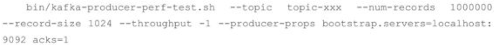

对应的生产者性能测试结果如图 4-2 所示。不同的硬件环境，甚至不同批次的测试得到的测试结果也不会完全相同，但总体趋势还是会保持和图4-2中的一样。


图4-2 生产者性能测试结果

在图4-2中，我们可以看到分区数为1时吞吐量最低，随着分区数的增长，相应的吞吐量也跟着上涨。一旦分区数超过了某个阈值之后，整体的吞吐量是不升反降的。也就是说，并不是分区数越多吞吐量也越大。这里的分区数临界阈值针对不同的测试环境也会表现出不同的结果，实际应用中可以通过类似的测试案例(比如复制生产流量以便进行测试回放)来找到一个合理的临界值区间。

上面针对的是消息生产者的测试，对消息消费者而言同样有吞吐量方面的考量。使用kafka-consumer-perf-test.sh脚本分别消费这些主题中的100万条消息，对应的测试命令如下：


消费者性能测试的结果如图 4-3 所示。与生产者性能测试相同的是，不同的测试环境或不同的测试批次所得到的测试结果也不尽相同，但总体趋势还是会保持和图4-3中的一样。

在图 4-3 中，随着分区数的增加，相应的吞吐量也会有所增长。一旦分区数超过了某个阈值之后，整体的吞吐量也是不升反降的，同样说明了分区数越多并不会使吞吐量一直增长。


图4-3 消费者性能测试

在同一套环境下，我们还可以测试一下同时往两个分区数为200的主题中发送消息的性能，假设测试结果中两个主题所对应的吞吐量分别为A和B，再测试一下只往一个分区数为200的主题中发送消息的性能，假设此次测试结果中得到的吞吐量为C，会发现A\<C、B\<C且A+B>C。可以发现由于共享系统资源的因素，A和B之间会彼此影响。通过A+B>C的结果，可知图4-2中topic-200的那个点位也并没有触及系统资源的瓶颈，发生吞吐量有所下降的结果也并非是系统资源瓶颈造成的。

本节针对分区数越多吞吐量越高这个命题进行反证，其实要证明一个观点是错误的，只需要举个反例即可，本节的内容亦是如此。不过本节并没有指明分区数越多吞吐量就越低这个观点，并且具体吞吐量的数值和走势还会和磁盘、文件系统、I/O调度策略相关。分区数越多吞吐量也就越高？网络上很多资料都认可这一观点，但实际上很多事情都会有一个临界值，当超过这个临界值之后，很多原本符合既定逻辑的走向又会变得不同。读者需要对此有清晰的认知，懂得去伪求真，实地测试验证不失为一座通向真知的桥梁。

### 4.4.3 分区数的上限

**一味地增加分区数并不能使吞吐量一直得到提升，并且分区数也并不能一直增加，如果超过默认的配置值，还会引起Kafka进程的崩溃。**读者可以试着在一台普通的Linux机器上创建包含10000个分区的主题，比如在下面示例中创建一个主题topic-bomb：


执行完成后可以检查 Kafka 的进程是否还存在(比如通过 jps 命令或 ps-aux|grep kafka命令)。一般情况下，会发现原本运行完好的Kafka服务已经崩溃。此时或许会想到，创建这么多分区，是不是因为内存不够而引起的进程崩溃？我们在启动 Kafka 进程的时候将JVM堆设置得大一点是不是就可以解决问题了。其实不然，创建这些分区而引起的内存增长完全不足以让Kafka“畏惧”。

为了分析真实的原因，我们可以打开 Kafka 的服务日志文件($KAFKA_HOME/logs/server.log)来一探究竟，会发现服务日志中出现大量的异常：


异常中最关键的信息是“Too many open flies”，这是一种常见的Linux系统错误，通常意味着文件描述符不足，它一般发生在创建线程、创建 Socket、打开文件这些场景下。在 Linux系统的默认设置下，这个文件描述符的个数不是很多，通过ulimit命令可以查看：


ulimit是在系统允许的情况下，提供对特定shell可利用的资源的控制。-H和-S选项指定资源的硬限制和软限制。硬限制设定之后不能再添加，而软限制则可以增加到硬限制规定的值。如果-H和-S选项都没有指定，则软限制和硬限制同时设定。限制值可以是指定资源的数值或hard、soft、unlimited这些特殊值，其中hard代表当前硬限制，soft代表当前软件限制，unlimited代表不限制。如果不指定限制值，则打印指定资源的软限制值，除非指定了-H选项。硬限制可以在任何时候、任何进程中设置，但硬限制只能由超级用户设置。软限制是内核实际执行的限制，任何进程都可以将软限制设置为任意小于等于硬限制的值。

我们可以通过测试来验证本案例中的 Kafka 的崩溃是否是由于文件描述符的限制而引起的。下面我们在一个包含3个节点的Kafka集群中挑选一个节点进行具体的分析。首先通过jps命令查看Kafka进程pid的值：


查看当前Kafka进程所占用的文件描述符的个数(注意这个值并不是Kafka第一次启动时就需要占用的文件描述符的个数，示例中的Kafka环境下已经存在了若干主题)：


我们再新建一个只有一个分区的主题，并查看Kafka进程所占用的文件描述符的个数：


可以看到增加了一个分区，对应的也只增加了一个文件描述符。之前我们通过ulimit命令可以看到软限制是1024，我们创建一个具有829(1024-195=829)个分区的主题：


可以看到Kafka进程此时占用了1024个文件描述符，并且运行完好。这时我们还可以联想到硬限制4096这个关键数字，我们再创建一个包含3071(4096-1024=3072，这里特地少创建1个分区)个分区的主题，示例如下：


Kafka进程依旧完好，文件描述符占用为4095，逼近最高值4096。最后我们再次创建一个只有一个分区的主题：


此时Kafka已经崩溃，查看进程号时已没有相关信息。查看Kafka中的日志，还会发现报出前面提及的异常“java.io.IOException：Too many open files”，表明已达到上限。

如何避免这种异常情况？对于一个高并发、高性能的应用来说，1024 或 4096 的文件描述符限制未免太少，可以适当调大这个参数。比如使用 ulimit-n 65535 命令将上限提高到65535，这样足以应对大多数的应用情况，再高也完全没有必要了。


也可以在/etc/security/limits.conf文件中设置，参考如下：


limits.conf文件修改之后需要重启才能生效。limits.conf文件与ulimit命令的区别在于前者是针对所有用户的，而且在任何shell中都是生效的，即与shell无关，而后者只是针对特定用户的当前shell的设定。在修改最大文件打开数时，最好使用limits.conf文件来修改，通过这个文件，可以定义用户、资源类型、软硬限制等。也可以通过在/etc/profile文件中添加ulimit的设置语句来使全局生效。

设置之后可以再次尝试创建10000个分区的主题，检查一下Kafka是否还会再次崩溃。

### 4.4.4 考量因素

如何选择合适的分区数？一个“恰如其分”的答案就是视具体情况而定。

从吞吐量方面考虑，增加合适的分区数可以在一定程度上提升整体吞吐量，但超过对应的阈值之后吞吐量不升反降。如果应用对吞吐量有一定程度上的要求，则建议在投入生产环境之前对同款硬件资源做一个完备的吞吐量相关的测试，以找到合适的分区数阈值区间。

在创建主题之后，虽然我们还能够增加分区的个数，但基于key计算的主题需要严谨对待。当生产者向Kafka中写入基于key的消息时，Kafka通过消息的key来计算出消息将要写入哪个具体的分区，这样具有相同 key 的数据可以写入同一个分区。Kafka 的这一功能对于一部分应用是极为重要的，比如日志压缩(Log Compaction)，详细可以参考5.4节；再比如对于同一个key 的所有消息，消费者需要按消息的顺序进行有序的消费，如果分区的数量发生变化，那么有序性就得不到保证。在创建主题时，最好能确定好分区数，这样也可以省去后期增加分区所带来的多余操作。尤其对于与key高关联的应用，在创建主题时可以适当地多创建一些分区，以满足未来的需求。通常情况下，可以根据未来2年内的目标吞吐量来设定分区数。当然如果应用与key弱关联，并且具备便捷的增加分区数的操作接口，那么也可以不用考虑那么长远的目标。

有些应用场景会要求主题中的消息都能保证顺序性，这种情况下在创建主题时可以设定分区数为1，通过分区有序性的这一特性来达到主题有序性的目的。

当然分区数也不能一味地增加，参考4.4.3节的内容，分区数会占用文件描述符，而一个进程所能支配的文件描述符是有限的，这也是通常所说的文件句柄的开销。虽然我们可以通过修改配置来增加可用文件描述符的个数，但凡事总有一个上限，在选择合适的分区数之前，最好再考量一下当前Kafka进程中已经使用的文件描述符的个数。

分区数的多少还会影响系统的可用性。在前面章节中，我们了解到 Kafka通过多副本机制来实现集群的高可用和高可靠，每个分区都会有一至多个副本，每个副本分别存在于不同的broker节点上，并且只有leader副本对外提供服务。在Kafka集群的内部，所有的副本都采用自动化的方式进行管理，并确保所有副本中的数据都能保持一定程度上的同步。当broker发生故障时，leader副本所属宿主的broker节点上的所有分区将暂时处于不可用的状态，此时Kafka会自动在其他的 follower 副本中选举出新的 leader 用于接收外部客户端的请求，整个过程由Kafka控制器负责完成(有关控制器的内容可以参考6.4节)。分区在进行leader角色切换的过程中会变得不可用，不过对于单个分区来说这个过程非常短暂，对用户而言可以忽略不计。如果集群中的某个broker节点宕机，那么就会有大量的分区需要同时进行leader角色切换，这个切换的过程会耗费一笔可观的时间，并且在这个时间窗口内这些分区也会变得不可用。

分区数越多也会让Kafka的正常启动和关闭的耗时变得越长，与此同时，主题的分区数越多不仅会增加日志清理的耗时，而且在被删除时也会耗费更多的时间。对旧版的生产者和消费者客户端而言，分区数越多，也会增加它们的开销，不过这一点在新版的生产者和消费者客户端中有效地得到了抑制。

如何选择合适的分区数？从某种意思来说，考验的是决策者的实战经验，更透彻地说，是对Kafka本身、业务应用、硬件资源、环境配置等多方面的考量而做出的选择。在设定完分区数，或者更确切地说是创建主题之后，还要对其追踪、监控、调优以求更好地利用它。读者看到本节的内容之前或许没有对分区数有太大的困扰，而看完本节的内容之后反而困惑了起来，其实大可不必太过惊慌，一般情况下，根据预估的吞吐量及是否与key相关的规则来设定分区数即可，后期可以通过增加分区数、增加broker或分区重分配等手段来进行改进。如果一定要给一个准则，则建议将分区数设定为集群中broker的倍数，即假定集群中有3个broker节点，可以设定分区数为3、6、9等，至于倍数的选定可以参考预估的吞吐量。不过，如果集群中的broker 节点数有很多，比如大几十或上百、上千，那么这种准则也不太适用，在选定分区数时进一步可以引入基架等参考因素。

## 4.5 总结

本章主要讲述了Kafka概念中的两大核心—主题和分区。通过对主题的增删查改、配置管理等内容来了解主题相关的知识点。通过对分区副本的一系列操作及分区数设定的考量因素来理解分区相关的概念，比如优先副本、限流、分区重分配等。还介绍了 KafkaAdminClient、kafka-topics.sh、kafka-configs.sh、kafka-perferred-replica-election.sh、kafka-reassign-partitions.sh、kafka-producer-perf-test.sh和kafka-consumer-perf-test.sh等脚本的具体使用，读者可以通过实地操作来加深对本章内容的理解。


# 第5章 日志存储

学习完前4章的内容，我们可以较好地使用Kafka来完成基本的开发任务了。如果了解Kafka内部的一些细节，则可以让我们扬其长、避其短，进而可以更好地利用 Kafka。本章讲述的是有关Kafka日志存储相关的知识点，我们知道Kafka中的消息是存储在磁盘上的，那么为什么要使用磁盘作为存储介质？具体消息的存储格式又是什么呢？怎么样能够快速检索到指定的消息？消息不可能无限制存储，那么清理规则又是什么呢？带着这些疑问，我们来一探究竟。

## 5.1 文件目录布局

回顾之前所学的知识:Kafka 中的消息是以主题为基本单位进行归类的，各个主题在逻辑上相互独立。每个主题又可以分为一个或多个分区，分区的数量可以在主题创建的时候指定，也可以在之后修改。每条消息在发送的时候会根据分区规则被追加到指定的分区中，分区中的每条消息都会被分配一个唯一的序列号，也就是通常所说的偏移量(offset)，具有4个分区的主题的逻辑结构见图1-2。

如果分区规则设置得合理，那么所有的消息可以均匀地分布到不同的分区中，这样就可以实现水平扩展。不考虑多副本的情况，一个分区对应一个日志(Log)。为了防止 Log 过大，Kafka又引入了日志分段(LogSegment)的概念，将Log切分为多个LogSegment，相当于一个巨型文件被平均分配为多个相对较小的文件，这样也便于消息的维护和清理。事实上，Log 和LogSegment 也不是纯粹物理意义上的概念，**Log 在物理上只以文件夹的形式存储，而每个LogSegment 对应于磁盘上的一个日志文件和两个索引文件，以及可能的其他文件(比如以“.txnindex”为后缀的事务索引文件)**。图4-1描绘了主题、分区与副本之间的关系，在图5-1中又补充了Log和LogSegment的关系。


图5-1 日志关系

在4.1.1节中我们知道Log对应了一个命名形式为\<topic>-\<partition>的文件夹。举个例子，假设有一个名为“topic-log”的主题，此主题中具有 4 个分区，那么在实际物理存储上表现为“topic-log-0”“topic-log-1”“topic-log-2”“topic-log-3”这4个文件夹:


向Log 中追加消息时是顺序写入的，只有最后一个 LogSegment 才能执行写入操作，在此之前所有的 LogSegment 都不能写入数据。为了方便描述，我们将最后一个 LogSegment 称为“activeSegment”，即表示当前活跃的日志分段。随着消息的不断写入，当activeSegment满足一定的条件时，就需要创建新的activeSegment，之后追加的消息将写入新的activeSegment。

为了便于消息的检索，每个LogSegment中的日志文件(以“.log”为文件后缀)都有对应的两个索引文件:偏移量索引文件(以“.index”为文件后缀)和时间戳索引文件(以“.timeindex”为文件后缀)。每个 LogSegment 都有一个基准偏移量 baseOffset，用来表示当前 LogSegment中第一条消息的offset。偏移量是一个64位的长整型数，日志文件和两个索引文件都是根据基准偏移量(baseOffset)命名的，名称固定为20位数字，没有达到的位数则用0填充。比如第一个LogSegment的基准偏移量为0，对应的日志文件为00000000000000000000.log。

举例说明，向主题topic-log中发送一定量的消息，某一时刻topic-log-0目录中的布局如下所示。


示例中第2个LogSegment对应的基准位移是133，也说明了该LogSegment中的第一条消息的偏移量为133，同时可以反映出第一个LogSegment中共有133条消息(偏移量从0至132的消息)。

注意每个LogSegment中不只包含“.log”“.index”“.timeindex”这3种文件，还可能包含“.deleted”“.cleaned”“.swap”等临时文件，以及可能的“.snapshot”“.txnindex”“leader-epoch-checkpoint”等文件。

从更加宏观的视角上看，Kafka 中的文件不只上面提及的这些文件，比如还有一些检查点文件，当一个Kafka服务第一次启动的时候，默认的根目录下就会创建以下5个文件:


在 3.2.5 节中我们了解到消费者提交的位移是保存在 Kafka 内部的主题__consumer_offsets中的，初始情况下这个主题并不存在，当第一次有消费者消费消息时会自动创建这个主题。

在某一时刻，Kafka 中的文件目录布局如图 5-2 所示。每一个根目录都会包含最基本的 4个检查点文件(xxx-checkpoint)和 meta.properties 文件。在创建主题的时候，如果当前 broker中不止配置了一个根目录，那么会挑选分区数最少的那个根目录来完成本次创建任务。


图5-2 文件目录布局

## 5.2 日志格式的演变

对一个成熟的消息中间件而言，消息格式(或者称为“日志格式”)不仅关系功能维度的扩展，还牵涉性能维度的优化。随着 Kafka 的迅猛发展，其消息格式也在不断升级改进，从0.8.x版本开始到现在的2.0.0版本，Kafka的消息格式也经历了3个版本:v0版本、v1版本和v2版本。

每个分区由内部的每一条消息组成，如果消息格式设计得不够精炼，那么其功能和性能都会大打折扣。比如有冗余字段，势必会不必要地增加分区的占用空间，进而不仅使存储的开销变大、网络传输的开销变大，也会使Kafka的性能下降。反观如果缺少字段，比如在最初的Kafka消息版本中没有timestamp字段，对内部而言，其影响了日志保存、切分策略，对外部而言，其影响了消息审计、端到端延迟、大数据应用等功能的扩展。虽然可以在消息体内部添加一个时间戳，但解析变长的消息体会带来额外的开销，而存储在消息体(参考图5-3中的value字段)前面可以通过指针偏移量获取其值而容易解析，进而减少了开销(可以查看v1版本)，虽然相比于没有 timestamp 字段的开销会大一点。由此可见，仅在一个字段的一增一减之间就有这么多门道，那么Kafka具体是怎么做的呢？本节只针对Kafka 0.8.x之上(包含)的版本做相应说明，对于之前的版本不做陈述。

### 5.2.1 v0版本

Kafka消息格式的第一个版本通常称为v0版本，在Kafka 0.10.0之前都采用的这个消息格式(在0.8.x版本之前，Kafka还使用过一个更古老的消息格式，不过对目前的Kafka而言，我们也不需要了解这个版本的消息格式)。如无特殊说明，我们只讨论消息未压缩的情形。

图5-3中左边的“RECORD”部分就是v0版本的消息格式，大多数人会把图5-3中左边的整体(即包括offset和message size字段)都看作消息，因为每个RECORD(v0和v1版)必定对应一个offset和message size。*<u>每条消息都有一个offset 用来标志它在分区中的偏移量，这个offset是逻辑值，而非实际物理偏移值</u>*，message size表示消息的大小，这两者在一起被称为日志头部(LOG_OVERHEAD)，固定为12B。LOG_OVERHEAD和RECORD一起用来描述一条消息，为了配合陈述的语境，在讲述具体消息格式时会偏向于将单纯的RECORD看作消息，而在其他地方则偏向于将LOG_OVERHEAD和RECORD的整体看作消息，读者需要留意其中的区别。与消息对应的还有消息集的概念，消息集中包含一条或多条消息，消息集不仅是存储于磁盘及在网络上传输(Produce＆Fetch)的基本形式，而且是Kafka中压缩的基本单元，详细结构参考图5-3中的右边部分。


图5-3 v0版本的消息格式

下面具体陈述一下消息格式中的各个字段，从crc32开始算起，各个字段的解释如下。

- crc32(4B):crc32校验值。校验范围为magic至value之间。

- magic(1B):消息格式版本号，此版本的magic值为0。

- attributes(1B):消息的属性。总共占1个字节，低3位表示压缩类型：0表示NONE、1表示GZIP、2表示SNAPPY、3表示LZ4(LZ4自Kafka 0.9.x引入)，其余位保留。

- key length(4B)：表示消息的key的长度。如果为-1，则表示没有设置key，即key=null。

- key:可选，如果没有key则无此字段。

- value length(4B):实际消息体的长度。如果为-1，则表示消息为空。

- value:消息体。可以为空，比如墓碑(tombstone)消息。

v0版本中一个消息的最小长度(RECORD_OVERHEAD_V0)为crc32+magic+attributes+key length+value length=4B+1B+1B+4B+4B=14B。也就是说，v0版本中一条消息的最小长度为14B，如果小于这个值，那么这就是一条破损的消息而不被接收。

这里我们来做一个测试，首先创建一个分区数和副本因子都为 1 的主题，名称为“msg_format_v0”，然后往msg_format_v0中发送一条key="key"、value="value"的消息，之后查看对应的日志(这里采用Kafka 0.8.2.1的版本):


日志的大小(即 00000000000000000000.log 文件的大小)为 34B，其值正好等于LOG_OVERHEAD+RECORD_OVERHEAD_V0+3B的key+5B的value=12B+14B+3B+5B=34B。


我们再发送一条key=null，value="value"的消息，之后查看日志的大小:


日志大小为 65B，减去上一条 34B 的消息(LOG_OVERHEAD+RECORD)，可以得知本条消息的大小为31B，正好等于LOG_OVERHEAD+RECORD_OVERHEAD_V0+5B的value=12B+14B+5B=31B。

### 5.2.2 v1版本

Kafka从0.10.0版本开始到0.11.0版本之前所使用的消息格式版本为v1，比v0版本就多了一个timestamp字段，表示消息的时间戳。v1版本的消息结构如图5-4所示。


图5-4 v1版本的消息结构

v1版本的magic字段的值为1。v1版本的attributes字段中的低3位和v0版本的一样，还是表示压缩类型，而第4个位(bit)也被利用了起来:0表示timestamp类型为CreateTime，而1表示timestamp类型为LogAppendTime，其他位保留。timestamp类型由broker端参数log.message.timestamp.type来配置，默认值为CreateTime，即采用生产者创建消息时的时间戳。**如果在创建 ProducerRecord 时没有显式指定消息的时间戳，那么 KafkaProducer也会在发送这条消息前自动添加上。**下面是KafkaProducer中与此对应的一句关键代码:


v1 版本的消息的最小长度(RECORD_OVERHEAD_V1)要比 v0 版本的大 8 个字节，即22B。如果像v0版本介绍的一样发送一条key="key"、value="value"的消息，那么此条消息在v1版本中会占用42B，具体测试步骤参考v0版的相关介绍。

### 5.2.3 消息压缩

常见的压缩算法是数据量越大压缩效果越好，一条消息通常不会太大，这就导致压缩效果并不是太好。而Kafka实现的压缩方式是将多条消息一起进行压缩，这样可以保证较好的压缩效果。在一般情况下，生产者发送的压缩数据在broker中也是保持压缩状态进行存储的，消费者从服务端获取的也是压缩的消息，消费者在处理消息之前才会解压消息，这样保持了端到端的压缩。

Kafka 日志中使用哪种压缩方式是通过参数 compression.type 来配置的，默认值为“producer”，表示保留生产者使用的压缩方式。这个参数还可以配置为“gzip”“snappy”“lz4”，分别对应 GZIP、SNAPPY、LZ4 这 3 种压缩算法。如果参数 compression.type 配置为“uncompressed”，则表示不压缩。

**注意要点:**压缩率是压缩后的大小与压缩前的对比。例如:把100MB的文件压缩后是90MB，压缩率为90/100×100%=90%，压缩率越小，压缩效果越好。一般口语化陈述时会误描述为压缩率越高越好，为了避免混淆，本节不引入学术上的压缩率而引入压缩效果，这样容易达成共识。

以上都是针对消息未压缩的情况，而当消息压缩时是将整个消息集进行压缩作为内层消息(inner message)，内层消息整体作为外层(wrapper message)的 value，其结构如图 5-5所示。


图5-5 消息压缩

压缩后的外层消息(wrapper message)中的key为null，所以图5-5左半部分没有画出key字段，value字段中保存的是多条压缩消息(inner message，内层消息)，其中Record表示的是从 crc32 到 value 的消息格式。当生产者创建压缩消息的时候，对内部压缩消息设置的offset从0开始为每个内部消息分配offset，详细可以参考图5-6右半部分。


图5-6 外层消息和内层消息

其实每个从生产者发出的消息集中的消息offset都是从0开始的，当然这个offset不能直接存储在日志文件中，对 offset 的转换是在服务端进行的，客户端不需要做这个工作。外层消息保存了内层消息中最后一条消息的绝对位移(absolute offset)，绝对位移是相对于整个分区而言的。参考图5-6，对于未压缩的情形，图右内层消息中最后一条的offset理应是1030，但被压缩之后就变成了5，而这个1030被赋予给了外层的offset。当消费者消费这个消息集的时候，首先解压缩整个消息集，然后找到内层消息中最后一条消息的inner offset，根据如下公式找到内层消息中最后一条消息前面的消息的absolute offset(RO表示Relative Offset，IO表示Inner Offset，而AO表示Absolute Offset):


注意这里的RO是前面的消息相对最后一条消息的IO而言的，所以其值小于等于0，0表示最后一条消息自身。

**注意要点:**压缩消息，英文是compress message，Kafka中还有一个compact message，常常被人们直译成压缩消息，需要注意两者的区别。compact message是针对日志清理策略而言的(cleanup.policy=compact)，是指日志压缩(Log Compaction)后的消息，这个在5.4节中会有相关介绍。本节中的压缩消息单指compress message，即采用GZIP、LZ4等压缩工具压缩的消息。

在讲述v1版本的消息时，我们了解到v1版本比v0版的消息多了一个timestamp字段。对于压缩的情形，外层消息的timestamp设置为:

- 如果timestamp类型是CreateTime，那么设置的是内层消息中最大的时间戳。

- 如果timestamp类型是LogAppendTime，那么设置的是Kafka服务器当前的时间戳。

内层消息的timestamp设置为:

- 如果外层消息的timestamp类型是CreateTime，那么设置的是生产者创建消息时的时间戳。

- 如果外层消息的timestamp类型是LogAppendTime，那么所有内层消息的时间戳都会被忽略。

对 attributes 字段而言，它的 timestamp 位只在外层消息中设置，内层消息中的timestamp类型一直都是CreateTime。

### 5.2.4 变长字段

Kafka从0.11.0版本开始所使用的消息格式版本为v2，这个版本的消息相比v0和v1的版本而言改动很大，同时还参考了[Protocol Buffer](https://developers.google.com/protocol-buffers/docs/encoding)而引入了变长整型(Varints)和ZigZag编码。为了更加形象地说明问题，首先我们来了解一下变长整型。

Varints是使用一个或多个字节来序列化整数的一种方法。数值越小，其占用的字节数就越少。Varints中的每个字节都有一个位于最高位的msb位(most significant bit)，除最后一个字节外，其余msb位都设置为1，最后一个字节的msb位为0。这个msb位表示其后的字节是否和当前字节一起来表示同一个整数。除msb位外，剩余的7位用于存储数据本身，这种表示类型又称为Base 128。通常而言，一个字节8位可以表示256个值，所以称为Base 256，而这里只能用7位表示，2的7次方即128。Varints中采用的是小端字节序，即最小的字节放在最前面。

举个例子，比如数字1，它只占一个字节，所以msb位为0:


再举一个复杂点的例子，比如数字300:


300的二进制表示原本为0000 0001 0010 1100=256+32+8+4=300，那么为什么300的变长表示为上面的这种形式？

首先去掉每个字节的msb位，表示如下:


如前所述，varints 使用的是小端字节序的布局方式，所以这里两个字节的位置需要翻转一下:


Varints 可以用来表示 int32、int64、uint32、uint64、sint32、sint64、bool、enum 等类型。在实际使用过程中，如果当前字段可以表示为负数，那么对int32/int64和sint32/sint64而言，它们在进行编码时存在较大的区别。比如使用int64表示一个负数，那么哪怕是-1，其编码后的长度始终为10个字节(可以通过下面的代码来测试长度)，就如同对待一个很大的无符号长整型数一样。为了使编码更加高效，Varints使用了ZigZag的编码方式。

```java
public int sizeOfLong(int v) {
    int bytes = 1;
    while ((v & 0xffffffffffffff80L) != 0L) {
        bytes += 1;
        v >>>= 7;
    }
    return bytes;
}
```

ZigZag编码以一种锯齿形(zig-zags)的方式来回穿梭正负整数，将带符号整数映射为无符号整数，这样可以使绝对值较小的负数仍然享有较小的Varints编码值，比如-1编码为1，1编码为2，-2编码为3，如表5-1所示。

表5-1 ZigZag编码示例表


对应的公式为:


这是对sint32而言的，sint64对应的公式为:


以-1为例，其二进制表现形式为1111 1111 1111 1111 1111 1111 1111 1111(补码)。


最终-1的Varints编码为0000 0001，这样原本用4个字节表示的-1现在可以用1个字节来表示了。1就显得非常简单了，其二进制表现形式为0000 0000 0000 0000 0000 0000 0000 0001。


最终1的Varints编码为0000 0010，也只占用1个字节。

前面说过Varints中的一个字节中只有7位是有效数值位，即只能表示128个数值，转变成绝对值之后其实质上只能表示64个数值。比如对消息体长度而言，其值肯定是大于等于0的正整数，那么一个字节长度的Varints最大只能表示64。65的二进制数表示为:


经过ZigZag处理后为:


每个字节的低7位是有效数值位，所以1000 0010进一步转变为:


而Varints使用小端字节序，所以需要翻转一下位置:


设置非最后一个字节的msb位为1，最后一个字节的msb位为0，最终有:


所以最终65表示为1000 0010 0000 0001，而64却表示为0100 0000。

具体的编码实现如下(针对int32类型):

```java
public static void writeVarint(int value, ByteBuffer buffer) {
    int v = (value << 1) | (value >> 31);
    while ((v & 0xffffff80) != 0L) {
        byte b = (byte)((v & 0x7f) | 0x80);
        buffer.put(b);
        v >>>= 7;
    }
    buffer.put((byte) v);
}
```

对应的解码实现如下(针对int32类型):

```java
public static int readVarint(ByteBuffer buffer) {
    int value = 0;
    int i = 0;
    int b;
    while (((b = buffer.get()) & 0x80) != 0) {
        value |= (b & 0x7f) << i;
        i += 7;
        if (i > 28) {
            throw new IllegalVarintException(value);
        }
    }
    value |= b << i;
    return (value >>> 1) ^ -(value & 1);
}
```

回顾Kafka v0和v1版本的消息格式，如果消息本身没有key，那么key length字段为-1，int类型的需要4个字节来保存，而如果采用Varints来编码则只需要1个字节。根据Varints的规则可以推导出0～63之间的数字占1个字节，64～8191之间的数字占2个字节，8192～1048575之间的数字占3个字节。而Kafka broker端配置message.max.bytes的默认大小为1000012 (Varints编码占3个字节)，如果消息格式中与长度有关的字段采用Varints的编码，那么绝大多数情况下都会节省空间，而v2版本的消息格式也正是这样做的。

不过需要注意的是，Varints 并非一直会节省空间，一个int32 最长会占用5 个字节(大于默认的4个字节)，一个int64最长会占用10个字节(大于默认的8个字节)。下面的代码展示了如何计算一个int32占用的字节个数:

```java
public static int sizeofVarint(int value) {
    int v = (value << 1) ^ (value >> 31);
    int bytes = 1;
    while ((v & 0xffffff80) != 0L) {
        bytes += 1;
        v >>>= 7;
    }
    return bytes;
}
```

有关int32/int64的更多实现细节可以参考org.apache.kafka.common.utils.ByteUtils。

### 5.2.5 v2版本

v2版本中消息集称为Record Batch，而不是先前的Message Set，其内部也包含了一条或多条消息，消息的格式参见图5-7的中部和右部。在消息压缩的情形下，Record Batch Header部分(参见图5-7左部，从first offset到records count字段)是不被压缩的，而被压缩的是records字段中的所有内容。生产者客户端中的ProducerBatch对应这里的RecordBatch，而ProducerRecord对应这里的Record。


图5-7 v2版本的消息结构

先讲述消息格式Record的关键字段，可以看到内部字段大量采用了Varints，这样Kafka可以根据具体的值来确定需要几个字节来保存。v2版本的消息格式去掉了crc字段，另外增加了length(消息总长度)、timestamp delta(时间戳增量)、offset delta(位移增量)和headers信息，并且attributes字段被弃用了，笔者对此做如下分析(key、key length、value、value length字段同v0和v1版本的一样，这里不再赘述)。

- length:消息总长度。

- attributes:弃用，但还是在消息格式中占据1B的大小，以备未来的格式扩展。

- timestamp delta:时间戳增量。通常一个timestamp需要占用8个字节，如果像这里一样保存与RecordBatch的起始时间戳的差值，则可以进一步节省占用的字节数。

- offset delta:位移增量。保存与 RecordBatch起始位移的差值，可以节省占用的字节数。

- headers:这个字段用来支持应用级别的扩展，而不需要像v0和v1版本一样不得不将一些应用级别的属性值嵌入消息体。Header的格式如图5-7最右部分所示，包含key和value，一个Record里面可以包含0至多个Header。

对于 v1 版本的消息，如果用户指定的 timestamp 类型是 LogAppendTime 而不是CreateTime，那么消息从生产者进入 broker 后，timestamp 字段会被更新，此时消息的 crc值将被重新计算，而此值在生产者中已经被计算过一次。再者，broker 端在进行消息格式转换时(比如v1版转成v0版的消息格式)也会重新计算crc的值。在这些类似的情况下，消息从生产者到消费者之间流动时，crc的值是变动的，需要计算两次crc的值，所以这个字段的设计在 v0 和 v1 版本中显得比较“鸡肋”。在 v2 版本中将 crc 的字段从 Record 中转移到了RecordBatch中。

v2版本对消息集(RecordBatch)做了彻底的修改，参考图5-7最左部分，除了刚刚提及的crc字段，还多了如下字段。

- first offset:表示当前RecordBatch的起始位移。

- length:计算从partition leader epoch字段开始到末尾的长度。

- partition leader epoch:分区leader纪元，可以看作分区leader的版本号或更新次数，详细内容请参考8.1.4节。

- magic:消息格式的版本号，对v2版本而言，magic等于2。

- attributes:消息属性，注意这里占用了两个字节。低3位表示压缩格式，可以参考v0和v1；第4位表示时间戳类型；第5位表示此RecordBatch是否处于事务中，0表示非事务，1表示事务。第6位表示是否是控制消息(ControlBatch)，0表示非控制消息，而1表示是控制消息，控制消息用来支持事务功能，详细内容请参考7.4节。

- last offset delta:RecordBatch中最后一个Record的offset与first offset的差值。主要被broker用来确保RecordBatch中Record组装的正确性。

- first timestamp:RecordBatch中第一条Record的时间戳。

- max timestamp:RecordBatch 中最大的时间戳，一般情况下是指最后一个 Record的时间戳，和last offset delta的作用一样，用来确保消息组装的正确性。

- producer id:PID，用来支持幂等和事务，详细内容请参考7.4节。

- producer epoch:和producer id一样，用来支持幂等和事务，详细内容请参考7.4节。

- first sequence:和 producer id、producer epoch 一样，用来支持幂等和事务，详细内容请参考7.4节。

- records count:RecordBatch中Record的个数。

为了验证这个格式的正确性，我们往某个分区中一次性发送6 条key为“key”、value为“value”的消息，相应的日志内容如下:


可以看到全部是以16进制数来表示的，未免晦涩难懂，下面对照图5-7来详细讲解每个字节所表示的具体含义，具体参考如下:


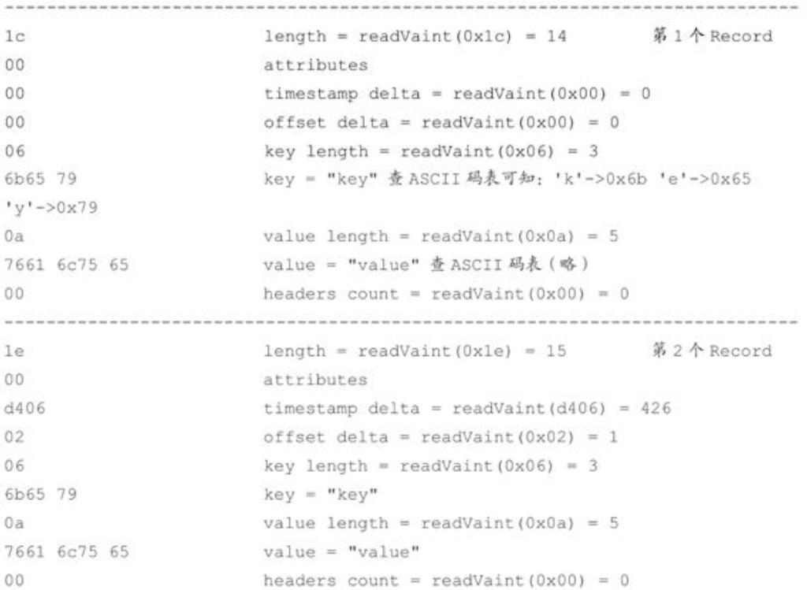


这里我们再来做一个测试，在2.0.0版本的 Kafka 中创建一个分区数和副本因子数都为 1的主题，名称为“msg_format_v2”。然后同样插入一条key="key"、value="value"的消息，日志结果如下:


可以看到示例中size字段为76，我们根据图5-7中的v2 版本的日志格式来验证一下，Record Batch Header部分共61B。Record部分中的attributes占1B；timestamp delta的值为0，占1B；offset delta的值为0，占1B；key length的值为3，占1B；key占3B；value length的值为5，占1B，value占5B；headers count的值为0，占1B；无headers。Record部分的总长度=1B+1B+1B+1B+3B+1B+5B+1B=14B，所以Record的length字段的值为 14，编码变为长整型数之后占 1B。最后推导出这条消息的占用字节数=61B+14B+1B=76B，符合测试结果。同样再发一条key=null、value="value"的消息，可以计算出这条消息占73B。

这么看上去v2版本的消息好像要比之前版本的消息所占用的空间大得多，的确对单条消息而言是这样的，如果我们连续向主题msg_format_v2中再发送10条value长度为6、key为null的消息，可以得到:


本来应该占用740B大小的空间，实际上只占用了191B，在v0版本中这10条消息需要占用320B的空间大小，而v1版本则需要占用400B的空间大小，这样看来v2版本又节省了很多空间，因为它将多个消息(Record)打包存放到单个RecordBatch中，又通过Varints编码极大地节省了空间。有兴趣的读者可以自行测试一下在大批量消息的情况下，v2版本和其他版本消息占用大小的对比，比如往主题msg_format_v0和msg_format_v2中各自发送100万条1KB的消息。

v2版本的消息不仅提供了更多的功能，比如事务、幂等性等，某些情况下还减少了消息的空间占用，总体性能提升很大。

细心的读者可能注意到前面在演示如何查看日志内容时，既使用了 kafka-run-class.sh kafka.tools.DumpLogSegments的方式，又使用了kafka-dump-log.sh的方式。而kafka-dump-log.sh脚本的内容为:


两种方式在本质上没有什么区别，只不过在Kafka 2.0.0之前并没有kafka-dump-log.sh脚本，所以只能使用kafka-run-class.sh kafka.tools.DumpLogSegments的形式，而从Kafka 2.0.0开始，可以直接使用kafka-dump-log.sh脚本来避免书写错误。

## 5.3 日志索引

本章开头就提及了每个日志分段文件对应了两个索引文件，主要用来提高查找消息的效率。偏移量索引文件用来建立消息偏移量(offset)到物理地址之间的映射关系，方便快速定位消息所在的物理文件位置；时间戳索引文件则根据指定的时间戳(timestamp)来查找对应的偏移量信息。

Kafka 中的索引文件以稀疏索引(sparse index)的方式构造消息的索引，它并不保证每个消息在索引文件中都有对应的索引项。每当写入一定量(由 broker 端参数 log.index.interval.bytes指定，默认值为4096，即4KB)的消息时，偏移量索引文件和时间戳索引文件分别增加一个偏移量索引项和时间戳索引项，增大或减小log.index.interval.bytes的值，对应地可以增加或缩小索引项的密度。

稀疏索引通过MappedByteBuffer将索引文件映射到内存中，以加快索引的查询速度。偏移量索引文件中的偏移量是单调递增的，查询指定偏移量时，使用二分查找法来快速定位偏移量的位置，如果指定的偏移量不在索引文件中，则会返回小于指定偏移量的最大偏移量。时间戳索引文件中的时间戳也保持严格的单调递增，查询指定时间戳时，也根据二分查找法来查找不大于该时间戳的最大偏移量，至于要找到对应的物理文件位置还需要根据偏移量索引文件来进行再次定位。稀疏索引的方式是在磁盘空间、内存空间、查找时间等多方面之间的一个折中。

本章开头也提及日志分段文件达到一定的条件时需要进行切分，那么其对应的索引文件也需要进行切分。日志分段文件切分包含以下几个条件，满足其一即可。

- 当前日志分段文件的大小超过了 broker 端参数 log.segment.bytes 配置的值。log.segment.bytes参数的默认值为1073741824，即1GB。

- 当前日志分段中消息的最大时间戳与当前系统的时间戳的差值大于 log.roll.ms或log.roll.hours参数配置的值。如果同时配置了log.roll.ms和log.roll.hours参数，那么log.roll.ms的优先级高。默认情况下，只配置了log.roll.hours参数，其值为168，即7天。

- 偏移量索引文件或时间戳索引文件的大小达到broker端参数log.index.size.max.bytes配置的值。log.index.size.max.bytes的默认值为10485760，即10MB。

- 追加的消息的偏移量与当前日志分段的偏移量之间的差值大于Integer.MAX_VALUE，即要追加的消息的偏移量不能转变为相对偏移量(offset-baseOffset>Integer.MAX_VALUE)。

对非当前活跃的日志分段而言，其对应的索引文件内容已经固定而不需要再写入索引项，所以会被设定为只读。而对当前活跃的日志分段(activeSegment)而言，索引文件还会追加更多的索引项，所以被设定为可读写。在索引文件切分的时候，Kafka 会关闭当前正在写入的索引文件并置为只读模式，同时以可读写的模式创建新的索引文件，索引文件的大小由broker端参数 log.index.size.max.bytes 配置。Kafka 在创建索引文件的时候会为其预分配log.index.size.max.bytes 大小的空间，注意这一点与日志分段文件不同，只有当索引文件进行切分的时候，Kafka 才会把该索引文件裁剪到实际的数据大小。也就是说，与当前活跃的日志分段对应的索引文件的大小固定为 log.index.size.max.bytes，而其余日志分段对应的索引文件的大小为实际的占用空间。

### 5.3.1 偏移量索引

偏移量索引项的格式如图5-8所示。每个索引项占用8个字节，分为两个部分。

- relativeOffset:相对偏移量，表示消息相对于baseOffset 的偏移量，占用4 个字节，当前索引文件的文件名即为baseOffset的值。

- position:物理地址，也就是消息在日志分段文件中对应的物理位置，占用4个字节。


图5-8 偏移量索引项的格式

消息的偏移量(offset)占用8个字节，也可以称为绝对偏移量。索引项中没有直接使用绝对偏移量而改为只占用4个字节的相对偏移量(relativeOffset=offset-baseOffset)，这样可以减小索引文件占用的空间。举个例子，一个日志分段的 baseOffset 为 32，那么其文件名就是00000000000000000032.log，offset为35的消息在索引文件中的relativeOffset的值为35-32=3。

再来回顾一下前面日志分段文件切分的第4个条件:追加的消息的偏移量与当前日志分段的偏移量之间的差值大于Integer.MAX_VALUE。如果彼此的差值超过了Integer.MAX_VALUE，那么relativeOffset就不能用4个字节表示了，进而不能享受这个索引项的设计所带来的便利了。

我们以本章开头topic-log-0目录下的00000000000000000000.index为例来进行具体分析，截取00000000000000000000.index部分内容如下:


虽然是以16进制数表示的，但参考索引项的格式可以知道如下内容:


这里也可以使用前面讲的kafka-dump-log.sh脚本来解析.index文件(还包括.timeindex、.snapshot、.txnindex等文件)，示例如下:


单纯地讲解数字不免过于枯燥，我们这里给出 00000000000000000000.index 和00000000000000000000.log的对照图来做进一步的陈述，如图5-9所示。


图5-9 偏移量索引示意图

如果我们要查找偏移量为23的消息，那么应该怎么做呢？首先通过二分法在偏移量索引文件中找到不大于23的最大索引项，即[22，656]，然后从日志分段文件中的物理位置656开始顺序查找偏移量为23的消息。

以上是最简单的一种情况。参考图5-10，如果要查找偏移量为268的消息，那么应该怎么办呢？首先肯定是定位到baseOffset为251的日志分段，然后计算相对偏移量relativeOffset=268-251=17，之后再在对应的索引文件中找到不大于17的索引项，最后根据索引项中的position定位到具体的日志分段文件位置开始查找目标消息。那么又是如何查找baseOffset 为251的日志分段的呢？这里并不是顺序查找，而是用了**跳跃表**的结构。Kafka 的每个日志对象中使用了ConcurrentSkipListMap来保存各个日志分段，每个日志分段的baseOffset作为key，这样可以根据指定偏移量来快速定位到消息所在的日志分段。


图5-10 查找偏移量

还需要注意的是，Kafka 强制要求索引文件大小必须是索引项大小的整数倍，对偏移量索引文件而言，必须为8的整数倍。如果broker端参数log.index.size.max.bytes配置为67，那么Kafka在内部会将其转换为64，即不大于67，并且满足为8的整数倍的条件。

### 5.3.2 时间戳索引

时间戳索引项的格式如图5-11所示。


图5-11 时间戳索引项的格式

每个索引项占用12个字节，分为两个部分。

- timestamp:当前日志分段最大的时间戳。

- relativeOffset:时间戳所对应的消息的相对偏移量。

时间戳索引文件中包含若干时间戳索引项，**每个追加的时间戳索引项中的 timestamp 必须大于之前追加的索引项的 timestamp，否则不予追加**。如果 broker 端参数 log.message.timestamp.type设置为LogAppendTime，那么消息的时间戳必定能够保持单调递增；相反，如果是 CreateTime 类型则无法保证。生产者可以使用类似 ProducerRecord(String topic，Integer partition，Long timestamp，K key，V value)的方法来指定时间戳的值。即使生产者客户端采用自动插入的时间戳也无法保证时间戳能够单调递增，如果两个不同时钟的生产者同时往一个分区中插入消息，那么也会造成当前分区的时间戳乱序。

与偏移量索引文件相似，时间戳索引文件大小必须是索引项大小(12B)的整数倍，如果不满足条件也会进行裁剪。同样假设broker端参数log.index.size.max.bytes配置为67，那么对应于时间戳索引文件，Kafka在内部会将其转换为60。

我们已经知道每当写入一定量的消息时，就会在偏移量索引文件和时间戳索引文件中分别增加一个偏移量索引项和时间戳索引项。**两个文件增加索引项的操作是同时进行的，但并不意味着偏移量索引中的relativeOffset和时间戳索引项中的relativeOffset是同一个值**。与上面偏移量索引一节示例中所对应的时间戳索引文件00000000000000000000.timeindex的部分内容如下:


有兴趣的读者可以自行解析上面内容的16进制数据。和讲述偏移量索引时一样，我们画出00000000000000000000.timeindex的具体结构，详细参考图5-12左上角。


图5-12 时间戳索引示意图

如果要查找指定时间戳targetTimeStamp=1526384718288开始的消息，首先是找到不小于指定时间戳的日志分段。这里就无法使用跳跃表来快速定位到相应的日志分段了，需要分以下几个步骤来完成。

**步骤1：**将targetTimeStamp和每个日志分段中的最大时间戳largestTimeStamp逐一对比，直到找到不小于 targetTimeStamp 的 largestTimeStamp 所对应的日志分段。日志分段中的largestTimeStamp的计算是先查询该日志分段所对应的时间戳索引文件，找到最后一条索引项，若最后一条索引项的时间戳字段值大于0，则取其值，否则取该日志分段的最近修改时间。

**步骤2：**找到相应的日志分段之后，在时间戳索引文件中使用二分查找算法查找到不大于targetTimeStamp的最大索引项，即[1526384718283，28]，如此便找到了一个相对偏移量28。

**步骤3：**在偏移量索引文件中使用二分算法查找到不大于28的最大索引项，即[26，838]。

**步骤4：**从步骤1中找到日志分段文件中的838的物理位置开始查找不小于targetTimeStamp的消息。

## 5.4 日志清理

Kafka 将消息存储在磁盘中，为了控制磁盘占用空间的不断增加就需要对消息做一定的清理操作。Kafka 中每一个分区副本都对应一个 Log，而 Log 又可以分为多个日志分段，这样也便于日志的清理操作。Kafka提供了两种日志清理策略。

- 日志删除(Log Retention):按照一定的保留策略直接删除不符合条件的日志分段。

- 日志压缩(Log Compaction):针对每个消息的key进行整合，对于有相同key的不同value值，只保留最后一个版本。

我们可以通过broker端参数log.cleanup.policy来设置日志清理策略，此参数的默认值为“delete”，即采用日志删除的清理策略。如果要采用日志压缩的清理策略，就需要将log.cleanup.policy设置为“compact”，并且还需要将log.cleaner.enable(默认值为true)设定为true。通过将log.cleanup.policy参数设置为“delete，compact”，还可以同时支持日志删除和日志压缩两种策略。日志清理的粒度可以控制到主题级别，比如与log.cleanup.policy 对应的主题级别的参数为 cleanup.policy，为了简化说明，本节只采用broker端参数做陈述，topic级别的参数可以查看4.1.6节。

### 5.4.1 日志删除

在Kafka的日志管理器中会有一个专门的日志删除任务来周期性地检测和删除不符合保留条件的日志分段文件，这个周期可以通过broker端参数log.retention.check.interval.ms来配置，默认值为300000，即5分钟。当前日志分段的保留策略有3种:基于时间的保留策略、基于日志大小的保留策略和基于日志起始偏移量的保留策略。

**1.基于时间**

日志删除任务会检查当前日志文件中是否有保留时间超过设定的阈值(retentionMs)来寻找可删除的日志分段文件集合(deletableSegments)，如图5-13所示。retentionMs可以通过broker端参数log.retention.hours、log.retention.minutes和log.retention.ms来配置，其中 log.retention.ms 的优先级最高，log.retention.minutes 次之，log.retention.hours最低。默认情况下只配置了log.retention.hours参数，其值为168，故默认情况下日志分段文件的保留时间为7天。


图5-13 基于时间的保留策略

查找过期的日志分段文件，并不是简单地根据日志分段的最近修改时间 lastModifiedTime来计算的，而是根据日志分段中最大的时间戳 largestTimeStamp 来计算的。因为日志分段的lastModifiedTime可以被有意或无意地修改，比如执行了touch操作，或者分区副本进行了重新分配，lastModifiedTime并不能真实地反映出日志分段在磁盘的保留时间。要获取日志分段中的最大时间戳 largestTimeStamp 的值，首先要查询该日志分段所对应的时间戳索引文件，查找时间戳索引文件中最后一条索引项，若最后一条索引项的时间戳字段值大于 0，则取其值，否则才设置为最近修改时间lastModifiedTime。

若待删除的日志分段的总数等于该日志文件中所有的日志分段的数量，那么说明所有的日志分段都已过期，但该日志文件中还要有一个日志分段用于接收消息的写入，即必须要保证有一个活跃的日志分段 activeSegment，在此种情况下，会先切分出一个新的日志分段作为activeSegment，然后执行删除操作。

删除日志分段时，首先会从Log对象中所维护日志分段的跳跃表中移除待删除的日志分段，以保证没有线程对这些日志分段进行读取操作。然后将日志分段所对应的所有文件添加上“.deleted”的后缀(当然也包括对应的索引文件)。最后交由一个以“delete-file”命名的延迟任务来删除这些以“.deleted”为后缀的文件，这个任务的延迟执行时间可以通过file.delete.delay.ms参数来调配，此参数的默认值为60000，即1分钟。

**2.基于日志大小**

日志删除任务会检查当前日志的大小是否超过设定的阈值(retentionSize)来寻找可删除的日志分段的文件集合(deletableSegments)，如图5-14所示。retentionSize可以通过broker端参数log.retention.bytes来配置，默认值为-1，表示无穷大。注意log.retention.bytes配置的是Log中所有日志文件的总大小，而不是单个日志分段(确切地说应该为.log日志文件)的大小。单个日志分段的大小由 broker 端参数 log.segment.bytes 来限制，默认值为1073741824，即1GB。


图5-14 基于日志大小的保留策略

基于日志大小的保留策略与基于时间的保留策略类似，首先计算日志文件的总大小size和retentionSize的差值diff，即计算需要删除的日志总大小，然后从日志文件中的第一个日志分段开始进行查找可删除的日志分段的文件集合 deletableSegments。查找出 deletableSegments 之后就执行删除操作，这个删除操作和基于时间的保留策略的删除操作相同，这里不再赘述。

**3.基于日志起始偏移量**

一般情况下，日志文件的起始偏移量 logStartOffset 等于第一个日志分段的 baseOffset，但这并不是绝对的，logStartOffset 的值可以通过 DeleteRecordsRequest 请求(比如使用KafkaAdminClient的deleteRecords()方法、使用kafka-delete-records.sh脚本，具体用法参考9.1.3节)、日志的清理和截断等操作进行修改。

基于日志起始偏移量的保留策略的判断依据是某日志分段的下一个日志分段的起始偏移量baseOffset 是否小于等于logStartOffset，若是，则可以删除此日志分段。如图 5-15 所示，假设logStartOffset等于25，日志分段1的起始偏移量为0，日志分段2的起始偏移量为11，日志分段3的起始偏移量为23，通过如下动作收集可删除的日志分段的文件集合deletableSegments:

1. 从头开始遍历每个日志分段，日志分段 1 的下一个日志分段的起始偏移量为 11，小于logStartOffset的大小，将日志分段1加入deletableSegments。
2. 日志分段2的下一个日志偏移量的起始偏移量为23，也小于logStartOffset的大小，将日志分段2页加入deletableSegments。
3. 日志分段3的下一个日志偏移量在logStartOffset的右侧，故从日志分段3开始的所有日志分段都不会加入deletableSegments。


图5-15 基于日志起始偏移量的保留策略

收集完可删除的日志分段的文件集合之后的删除操作同基于日志大小的保留策略和基于时间的保留策略相同，这里不再赘述。

### 5.4.2 日志压缩

Kafka中的Log Compaction是指在默认的日志删除(Log Retention)规则之外提供的一种清理过时数据的方式。如图5-16所示，Log Compaction对于有相同key的不同value值，只保留最后一个版本。如果应用只关心key对应的最新value值，则可以开启Kafka的日志清理功能，Kafka会定期将相同key的消息进行合并，只保留最新的value值。


图5-16 日志压缩

有很多中文资料会把Log Compaction翻译为“日志压缩”，笔者认为不够妥当，压缩应该是指Compression，在Kafka中消息可以采用gzip、Snappy、LZ4等压缩方式进行压缩，如果把Log Compaction翻译为日志压缩，容易让人和消息压缩(Message Compression)产生关联，其实是两个不同的概念。英文“Compaction”可以直译为“压紧、压实”，如果这里将Log Compaction直译为“日志压紧”或“日志压实”又未免太过生硬。考虑到“日志压缩”的说法已经广为用户接受，笔者这里勉强接受此种说法，不过文中尽量直接使用英文Log Compaction来表示日志压缩。读者在遇到类似“压缩”的字眼之时需格外注意这个压缩具体是指日志压缩(Log Compaction)还是指消息压缩(Message Compression)。

Log Compaction执行前后，日志分段中的每条消息的偏移量和写入时的偏移量保持一致。Log Compaction会生成新的日志分段文件，日志分段中每条消息的物理位置会重新按照新文件来组织。Log Compaction执行过后的偏移量不再是连续的，不过这并不影响日志的查询。

Kafka中的Log Compaction可以类比于Redis中的RDB的持久化模式。试想一下，如果一个系统使用 Kafka 来保存状态，那么每次有状态变更都会将其写入 Kafka。在某一时刻此系统异常崩溃，进而在恢复时通过读取Kafka 中的消息来恢复其应有的状态，那么此系统关心的是它原本的最新状态而不是历史时刻中的每一个状态。如果 Kafka 的日志保存策略是日志删除(Log Deletion)，那么系统势必要一股脑地读取Kafka中的所有数据来进行恢复，如果日志保存策略是 Log Compaction，那么可以减少数据的加载量进而加快系统的恢复速度。Log Compaction在某些应用场景下可以简化技术栈，提高系统整体的质量。

我们知道可以通过配置log.dir或log.dirs参数来设置Kafka日志的存放目录，而每一个日志目录下都有一个名为“cleaner-offset-checkpoint”的文件，这个文件就是清理检查点文件，用来记录每个主题的每个分区中已清理的偏移量。通过清理检查点文件可以将Log分成两个部分，如图5-17所示。通过检查点cleaner checkpoint来划分出一个已经清理过的clean部分和一个还未清理过的 dirty 部分。在日志清理的同时，客户端也可以读取日志中的消息。dirty部分的消息偏移量是逐一递增的，而 clean 部分的消息偏移量是断续的，如果客户端总能赶上dirty部分，那么它就能读取日志的所有消息，反之就不可能读到全部的消息。


图5-17 清理检查点

图5-17中的firstDirtyOffset(与cleaner checkpoint相等)表示dirty部分的起始偏移量，而firstUncleanableOffset为dirty部分的截止偏移量，整个dirty部分的偏移量范围为[firstDirtyOffset，firstUncleanableOffset)，注意这里是左闭右开区间。为了避免当前活跃的日志分段activeSegment成为热点文件，activeSegment 不会参与 Log Compaction 的执行。同时 Kafka 支持通过参数log.cleaner.min.compaction.lag.ms(默认值为0)来配置消息在被清理前的最小保留时间，默认情况下firstUncleanableOffset等于activeSegment的baseOffset。

注意Log Compaction是针对key的，所以在使用时应注意每个消息的key值不为null。每个broker会启动log.cleaner.thread(默认值为1)个日志清理线程负责执行清理任务，这些线程会选择“污浊率”最高的日志文件进行清理。用cleanBytes表示clean部分的日志占用大小，dirtyBytes表示dirty部分的日志占用大小，那么这个日志的污浊率(dirtyRatio)为:


为了防止日志不必要的频繁清理操作，Kafka 还使用了参数 log.cleaner.min.cleanable.ratio(默认值为0.5)来限定可进行清理操作的最小污浊率。Kafka中用于保存消费者消费位移的主题__consumer_offsets使用的就是Log Compaction策略。

这里我们已经知道怎样选择合适的日志文件做清理操作，然而怎么对日志文件中消息的key进行筛选操作呢？Kafka中的每个日志清理线程会使用一个名为“SkimpyOffsetMap”的对象来构建 key与offset 的映射关系的哈希表。日志清理需要遍历两次日志文件，第一次遍历把每个key的哈希值和最后出现的offset都保存在SkimpyOffsetMap中，映射模型如图5-18所示。第二次遍历会检查每个消息是否符合保留条件，如果符合就保留下来，否则就会被清理。假设一条消息的offset为O1，这条消息的key在SkimpyOffsetMap中对应的offset为O2，如果O1大于等于O2即满足保留条件。


图5-18 映射模型

默认情况下，SkimpyOffsetMap使用MD5来计算key的哈希值，占用空间大小为16B，根据这个哈希值来从 SkimpyOffsetMap 中找到对应的槽位，如果发生冲突则用线性探测法处理。为了防止哈希冲突过于频繁，也可以通过 broker 端参数 log.cleaner.io.buffer.load.factor(默认值为0.9)来调整负载因子。偏移量占用空间大小为8B，故一个映射项占用大小为24B。每个日志清理线程的SkimpyOffsetMap的内存占用大小为log.cleaner.dedupe.buffer.size/log.cleaner.thread，默认值为=128MB/1=128MB。所以默认情况下SkimpyOffsetMap可以保存128MB×0.9/24B ≈ 5033164 个 key 的记录。假设每条消息的大小为 1KB，那么这个SkimpyOffsetMap可以用来映射4.8GB的日志文件，如果有重复的key，那么这个数值还会增大，整体上来说，SkimpyOffsetMap极大地节省了内存空间且非常高效。

**题外话:**“SkimpyOffsetMap”的取名也很有意思，“Skimpy”可以直译为“不足的”，可以看出它最初的设计者也认为这种实现不够严谨。如果遇到两个不同的 key但哈希值相同的情况，那么其中一个key所对应的消息就会丢失。虽然说MD5这类摘要算法的冲突概率非常小，但根据墨菲定律，任何一个事件，只要具有大于0的概率，就不能假设它不会发生，所以在使用Log Compaction策略时要注意这一点。

Log Compaction会保留key相应的最新value值，那么当需要删除一个key时怎么办？Kafka提供了一个墓碑消息(tombstone)的概念，如果一条消息的key不为null，但是其value为null，那么此消息就是墓碑消息。日志清理线程发现墓碑消息时会先进行常规的清理，并保留墓碑消息一段时间。墓碑消息的保留条件是当前墓碑消息所在的日志分段的最近修改时间lastModifiedTime大于deleteHorizonMs，如图5-17所示。这个deleteHorizonMs的计算方式为clean部分中最后一个日志分段的最近修改时间减去保留阈值 deleteRetionMs(通过 broker 端参数log.cleaner.delete.retention.ms配置，默认值为86400000，即24小时)的大小，即:


所以墓碑消息的保留条件为(可以对照图5-17中的deleteRetionMs所标记的位置去理解):


Log Compaction执行过后的日志分段的大小会比原先的日志分段的要小，为了防止出现太多的小文件，Kafka 在实际清理过程中并不对单个的日志分段进行单独清理，而是将日志文件中offset从0至firstUncleanableOffset的所有日志分段进行分组，每个日志分段只属于一组，分组策略为：按照日志分段的顺序遍历，每组中日志分段的占用空间大小之和不超过segmentSize(可以通过broker端参数log.segment.bytes设置，默认值为1GB)，且对应的索引文件占用大小之和不超过 maxIndexSize(可以通过broker 端参数 log.index.interval.bytes设置，默认值为10MB)。同一个组的多个日志分段清理过后，只会生成一个新的日志分段。

如图5-19所示，假设所有的参数配置都为默认值，在Log Compaction之前checkpoint的初始值为 0。执行第一次 Log Compaction 之后，每个非活跃的日志分段的大小都有所缩减，checkpoint的值也有所变化。执行第二次Log Compaction时会组队成[0.4GB，0.4GB]、[0.3GB，0.7GB]、[0.3GB]、[1GB]这4个分组，并且从第二次Log Compaction开始还会涉及墓碑消息的清除。同理，第三次Log Compaction过后的情形可参考图5-19的尾部。Log Compaction过程中会将每个日志分组中需要保留的消息复制到一个以“.clean”为后缀的临时文件中，此临时文件以当前日志分组中第一个日志分段的文件名命名，例如 00000000000000000000.log.clean。Log Compaction过后将“.clean”的文件修改为“.swap”后缀的文件，例如:00000000000000000000.log.swap。然后删除原本的日志文件，最后才把文件的“.swap”后缀去掉。整个过程中的索引文件的变换也是如此，至此一个完整Log Compaction操作才算完成。


图5-19 执行日志压缩

以上是整个日志压缩(Log Compaction)过程的详解，读者需要注意将日志压缩和日志删除区分开，日志删除是指清除整个日志分段，而日志压缩是针对相同key的消息的合并清理。

## 5.5 磁盘存储

Kafka 依赖于文件系统(更底层地来说就是磁盘)来存储和缓存消息。在我们的印象中，对于各个存储介质的速度认知大体同图5-20所示的相同，层级越高代表速度越快。很显然，磁盘处于一个比较尴尬的位置，这不禁让我们怀疑Kafka 采用这种持久化形式能否提供有竞争力的性能。在传统的消息中间件 RabbitMQ 中，就使用内存作为默认的存储介质，而磁盘作为备选介质，以此实现高吞吐和低延迟的特性。然而，事实上磁盘可以比我们预想的要快，也可能比我们预想的要慢，这完全取决于我们如何使用它。


图5-20 各个存储介质的速度层级

有关测试结果表明，一个由6块7200r/min的RAID-5阵列组成的磁盘簇的线性(顺序)写入速度可以达到600MB/s，而随机写入速度只有100KB/s，两者性能相差6000倍。操作系统可以针对线性读写做深层次的优化，比如预读(read-ahead，提前将一个比较大的磁盘块读入内存)和后写(write-behind，将很多小的逻辑写操作合并起来组成一个大的物理写操作)技术。顺序写盘的速度不仅比随机写盘的速度快，而且也比随机写内存的速度快，如图5-21所示。


图5-21 磁盘、SSD和内存的I/O速度对比

Kafka 在设计时采用了文件追加的方式来写入消息，即只能在日志文件的尾部追加新的消息，并且也不允许修改已写入的消息，这种方式属于典型的顺序写盘的操作，所以就算 Kafka使用磁盘作为存储介质，它所能承载的吞吐量也不容小觑。但这并不是让Kafka在性能上具备足够竞争力的唯一因素，我们不妨继续分析。

### 5.5.1 页缓存

页缓存是操作系统实现的一种主要的磁盘缓存，以此用来减少对磁盘 I/O 的操作。具体来说，就是把磁盘中的数据缓存到内存中，把对磁盘的访问变为对内存的访问。为了弥补性能上的差异，现代操作系统越来越“激进地”将内存作为磁盘缓存，甚至会非常乐意将所有可用的内存用作磁盘缓存，这样当内存回收时也几乎没有性能损失，所有对于磁盘的读写也将经由统一的缓存。

当一个进程准备读取磁盘上的文件内容时，操作系统会先查看待读取的数据所在的页(page)是否在页缓存(pagecache)中，如果存在(命中)则直接返回数据，从而避免了对物理磁盘的 I/O 操作；如果没有命中，则操作系统会向磁盘发起读取请求并将读取的数据页存入页缓存，之后再将数据返回给进程。同样，如果一个进程需要将数据写入磁盘，那么操作系统也会检测数据对应的页是否在页缓存中，如果不存在，则会先在页缓存中添加相应的页，最后将数据写入对应的页。被修改过后的页也就变成了脏页，操作系统会在合适的时间把脏页中的数据写入磁盘，以保持数据的一致性。

Linux操作系统中的vm.dirty_background_ratio参数用来指定当脏页数量达到系统内存的百分之多少之后就会触发 pdflush/flush/kdmflush 等后台回写进程的运行来处理脏页，一般设置为小于10的值即可，但不建议设置为0。与这个参数对应的还有一个vm.dirty_ratio参数，它用来指定当脏页数量达到系统内存的百分之多少之后就不得不开始对脏页进行处理，在此过程中，新的 I/O 请求会被阻挡直至所有脏页被冲刷到磁盘中。对脏页有兴趣的读者还可以自行查阅vm.dirty_expire_centisecs、vm.dirty_writeback.centisecs等参数的使用说明。

对一个进程而言，它会在进程内部缓存处理所需的数据，然而这些数据有可能还缓存在操作系统的页缓存中，因此同一份数据有可能被缓存了两次。并且，除非使用Direct I/O的方式，否则页缓存很难被禁止。此外，用过Java的人一般都知道两点事实:对象的内存开销非常大，通常会是真实数据大小的几倍甚至更多，空间使用率低下；Java的垃圾回收会随着堆内数据的增多而变得越来越慢。基于这些因素，使用文件系统并依赖于页缓存的做法明显要优于维护一个进程内缓存或其他结构，至少我们可以省去了一份进程内部的缓存消耗，同时还可以通过结构紧凑的字节码来替代使用对象的方式以节省更多的空间。如此，我们可以在 32GB 的机器上使用28GB至30GB的内存而不用担心GC所带来的性能问题。此外，即使Kafka服务重启，页缓存还是会保持有效，然而进程内的缓存却需要重建。这样也极大地简化了代码逻辑，因为维护页缓存和文件之间的一致性交由操作系统来负责，这样会比进程内维护更加安全有效。

Kafka 中大量使用了页缓存，这是 Kafka 实现高吞吐的重要因素之一。虽然消息都是先被写入页缓存，然后由操作系统负责具体的刷盘任务的，但在Kafka中同样提供了同步刷盘及间断性强制刷盘(fsync)的功能，这些功能可以通过 log.flush.interval.messages、log.flush.interval.ms 等参数来控制。同步刷盘可以提高消息的可靠性，防止由于机器掉电等异常造成处于页缓存而没有及时写入磁盘的消息丢失。不过笔者并不建议这么做，刷盘任务就应交由操作系统去调配，消息的可靠性应该由多副本机制来保障，而不是由同步刷盘这种严重影响性能的行为来保障。

Linux系统会使用磁盘的一部分作为swap分区，这样可以进行进程的调度:把当前非活跃的进程调入 swap 分区，以此把内存空出来让给活跃的进程。对大量使用系统页缓存的 Kafka而言，应当尽量避免这种内存的交换，否则会对它各方面的性能产生很大的负面影响。我们可以通过修改vm.swappiness参数(Linux系统参数)来进行调节。vm.swappiness参数的上限为 100，它表示积极地使用 swap 分区，并把内存上的数据及时地搬运到 swap 分区中；vm.swappiness 参数的下限为 0，表示在任何情况下都不要发生交换(vm.swappiness=0的含义在不同版本的 Linux 内核中不太相同，这里采用的是变更后的最新解释)，这样一来，当内存耗尽时会根据一定的规则突然中止某些进程。笔者建议将这个参数的值设置为 1，这样保留了swap的机制而又最大限度地限制了它对Kafka性能的影响。

### 5.5.2 磁盘I/O流程

读者可能对于前面提及的页缓存、Direct I/O、文件系统等概念的认知比较模糊，下面通过一张磁盘I/O的流程图来加深理解，如图5-22所示。

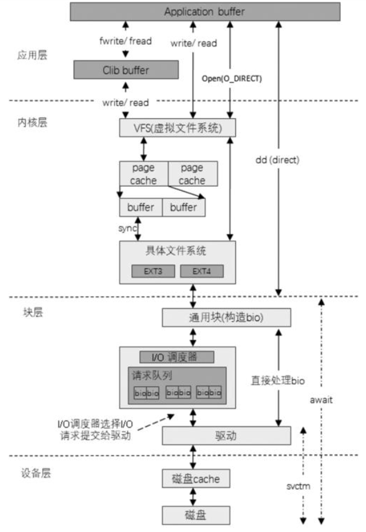

图5-22 磁盘I/O的流程

参考图5-22，从编程角度而言，一般磁盘I/O的场景有以下四种。

(1)用户调用标准C库进行I/O操作，数据流为:应用程序buffer→C库标准IObuffer→文件系统页缓存→通过具体文件系统到磁盘。

(2)用户调用文件 I/O，数据流为:应用程序 buffer→文件系统页缓存→通过具体文件系统到磁盘。

(3)用户打开文件时使用O_DIRECT，绕过页缓存直接读写磁盘。

(4)用户使用类似dd工具，并使用direct参数，绕过系统cache与文件系统直接写磁盘。

发起I/O请求的步骤可以表述为如下的内容(以最长链路为例)。

- **写操作:**用户调用fwrite把数据写入C库标准IObuffer后就返回，即写操作通常是异步操作；数据写入C库标准IObuffer后，不会立即刷新到磁盘，会将多次小数据量相邻写操作先缓存起来合并，最终调用write函数一次性写入(或者将大块数据分解多次write 调用)页缓存；数据到达页缓存后也不会立即刷新到磁盘，内核有 pdflush 线程在不停地检测脏页，判断是否要写回到磁盘，如果是则发起磁盘I/O请求。
- **读操作:**用户调用fread到C库标准IObuffer中读取数据，如果成功则返回，否则继续；到页缓存中读取数据，如果成功则返回，否则继续；发起 I/O 请求，读取数据后缓存buffer和C库标准IObuffer并返回。可以看出，读操作是同步请求。
- **I/O请求处理:**通用块层根据I/O请求构造一个或多个bio结构并提交给调度层；调度器将 bio 结构进行排序和合并组织成队列且确保读写操作尽可能理想:将一个或多个进程的读操作合并到一起读，将一个或多个进程的写操作合并到一起写，尽可能变随机为顺序(因为随机读写比顺序读写要慢)，读必须优先满足，而写也不能等太久。

针对不同的应用场景，I/O调度策略也会影响I/O的读写性能，目前Linux系统中的I/O调度策略有4种，分别为NOOP、CFQ、DEADLINE和ANTICIPATORY，默认为CFQ。

**1.NOOP**

NOOP算法的全写为No Operation。该算法实现了最简单的FIFO队列，所有I/O请求大致按照先来后到的顺序进行操作。之所以说“大致”，原因是NOOP在FIFO的基础上还做了相邻I/O请求的合并，并不是完全按照先进先出的规则满足I/O请求。

假设有如下的I/O请求序列:


NOOP将会按照如下顺序满足I/O请求:


**2.CFQ**

CFQ算法的全写为Completely Fair Queuing。该算法的特点是按照I/O请求的地址进行排序，而不是按照先来后到的顺序进行响应。

假设有如下的I/O请求序列:


CFQ将会按照如下顺序满足:


CFQ是默认的磁盘调度算法，对于通用服务器来说是最好的选择。它试图均匀地分布对/IO带宽的访问。CFQ为每个进程单独创建一个队列来管理该进程所产生的请求，也就是说，每个进程一个队列，各队列之间的调度使用时间片进行调度，以此来保证每个进程都能被很好地分配到I/O带宽。I/O调度器每次执行一个进程的4次请求。在传统的SAS盘上，磁盘寻道花去了绝大多数的I/O响应时间。CFQ的出发点是对I/O地址进行排序，以尽量少的磁盘旋转次数来满足尽可能多的I/O请求。在CFQ算法下，SAS盘的吞吐量大大提高了。相比于NOOP的缺点是，先来的I/O请求并不一定能被满足，可能会出现“饿死”的情况。

**3.DEADLINE**

DEADLINE在CFQ的基础上，解决了I/O请求“饿死”的极端情况。除了CFQ本身具有的I/O排序队列，DEADLINE额外分别为读I/O和写I/O提供了FIFO队列。读FIFO队列的最大等待时间为500ms，写FIFO队列的最大等待时间为5s。FIFO队列内的I/O请求优先级要比CFQ队列中的高，而读FIFO队列的优先级又比写FIFO队列的优先级高。优先级可以表示如下:


**4.ANTICIPATORY**

CFQ和DEADLINE考虑的焦点在于满足零散I/O请求上。对于连续的I/O请求，比如顺序读，并没有做优化。为了满足随机I/O和顺序I/O混合的场景，Linux还支持ANTICIPATORY调度算法。ANTICIPATORY在DEADLINE的基础上，为每个读I/O都设置了6ms的等待时间窗口。如果在6ms内OS收到了相邻位置的读I/O请求，就可以立即满足。ANTICIPATORY算法通过增加等待时间来获得更高的性能，假设一个块设备只有一个物理查找磁头(例如一个单独的SATA硬盘)，将多个随机的小写入流合并成一个大写入流(相当于将随机读写变顺序读写)，通过这个原理来使用读取/写入的延时换取最大的读取/写入吞吐量。适用于大多数环境，特别是读取/写入较多的环境。

不同的磁盘调度算法(以及相应的I/O优化手段)对Kafka 这类依赖磁盘运转的应用的影响很大，建议根据不同的业务需求来测试并选择合适的磁盘调度算法。

从文件系统层面分析，Kafka 操作的都是普通文件，并没有依赖于特定的文件系统，但是依然推荐使用EXT4或XFS。尤其是对XFS而言，它通常有更好的性能，这种性能的提升主要影响的是Kafka的写入性能。

### 5.5.3 零拷贝

除了消息顺序追加、页缓存等技术，Kafka还使用零拷贝(Zero-Copy)技术来进一步提升性能。所谓的零拷贝是指将数据直接从磁盘文件复制到网卡设备中，而不需要经由应用程序之手。零拷贝大大提高了应用程序的性能，减少了内核和用户模式之间的上下文切换。对 Linux操作系统而言，零拷贝技术依赖于底层的 sendfile()方法实现。对应于 Java 语言，FileChannal.transferTo()方法的底层实现就是sendfile()方法。

单纯从概念上理解“零拷贝”比较抽象，这里简单地介绍一下它。考虑这样一种常用的情形:你需要将静态内容(类似图片、文件)展示给用户。这个情形就意味着需要先将静态内容从磁盘中复制出来放到一个内存buf中，然后将这个buf通过套接字(Socket)传输给用户，进而用户获得静态内容。这看起来再正常不过了，但实际上这是很低效的流程，我们把上面的这种情形抽象成下面的过程:


首先调用read()将静态内容(这里假设为文件A)读取到tmp_buf，然后调用write()将tmp_buf写入Socket，如图5-23所示。

在这个过程中，文件A经历了4次复制的过程:

(1)调用read()时，文件A中的内容被复制到了内核模式下的Read Buffer中。

(2)CPU控制将内核模式数据复制到用户模式下。

(3)调用write()时，将用户模式下的内容复制到内核模式下的Socket Buffer中。

(4)将内核模式下的Socket Buffer的数据复制到网卡设备中传送。


图5-23 非零拷贝技术

从上面的过程可以看出，数据平白无故地从内核模式到用户模式“走了一圈”，浪费了 2次复制过程:第一次是从内核模式复制到用户模式；第二次是从用户模式再复制回内核模式，即上面4次过程中的第2步和第3步。而且在上面的过程中，内核和用户模式的上下文的切换也是4次。

如果采用了零拷贝技术，那么应用程序可以直接请求内核把磁盘中的数据传输给 Socket，如图5-24所示。


图5-24 零拷贝技术

零拷贝技术通过DMA(Direct Memory Access)技术将文件内容复制到内核模式下的Read Buffer 中。不过没有数据被复制到 Socket Buffer，相反只有包含数据的位置和长度的信息的文件描述符被加到Socket Buffer中。DMA引擎直接将数据从内核模式中传递到网卡设备(协议引擎)。这里数据只经历了2次复制就从磁盘中传送出去了，并且上下文切换也变成了2次。零拷贝是针对内核模式而言的，数据在内核模式下实现了零拷贝。

## 5.6 总结

本章主要讲述的是Kafka中与存储相关的知识点，既包含Kafka自身的日志格式、日志索引、日志清理等方面的内容，也包含底层物理存储相关的知识点。通过对本章内容的学习，相信读者对Kafka的一些核心机理有了比较深刻的认知。下一章会讲述在存储层之上的Kafka的核心实现原理，这样可以让读者对Kafka的整理实现脉络有比较清晰的认知。


# 第6章 深入服务端

在前面的章节中我们学习了服务端的配置搭建、生产者客户端和消费者客户端的使用、主题与分区的管理操作和原理解析，以及日志存储等相关内容，但对于Kafka 服务端的一些核心设计与运行机理还未涉及，如果要对Kafka有一个更深层次的了解，那么本章的内容就必不可少了。本章涉及协议设计、时间轮、延迟操作、控制器及参数解密，尤其是协议设计和控制器的介绍，这些是深入了解Kafka的必备知识点。

## 6.1 协议设计

在实际应用中，Kafka经常被用作高性能、可扩展的消息中间件。Kafka自定义了一组基于TCP的二进制协议，只要遵守这组协议的格式，就可以向Kafka发送消息，也可以从Kafka中拉取消息，或者做一些其他的事情，比如提交消费位移等。

在目前的 Kafka 2.0.0 中，一共包含了 43 种协议类型，每种协议类型都有对应的请求（Request）和响应（Response），它们都遵守特定的协议模式。每种类型的Request都包含相同结构的协议请求头（RequestHeader）和不同结构的协议请求体（RequestBody），如图6-1所示。

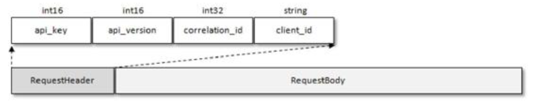

图6-1 协议请求头

协议请求头中包含 4 个域（Field）：api_key、api_version、correlation_id 和client_id，这4个域对应的描述可以参考表6-1。

表6-1 协议请求头


每种类型的Response也包含相同结构的协议响应头（ResponseHeader）和不同结构的响应体（ResponseBody），如图6-2所示。


图6-2 协议响应头

协议响应头中只有一个correlation_id，对应的释义可以参考表6-1中的相关描述。

细心的读者会发现不管是在图6-1中还是在图6-2中都有类似int32、int16、string的字样，它们用来表示当前域的数据类型。Kafka中所有协议类型的Request和Response的结构都是具备固定格式的，并且它们都构建于多种基本数据类型之上。这些基本数据类型如表6-2所示。

表6-2 基本数据类型


续表


下面就以最常见的消息发送和消息拉取的两种协议类型做细致的讲解。首先要讲述的是消息发送的协议类型，即ProduceRequest/ProduceResponse，对应的api_key=0，表示PRODUCE。从Kafka建立之初，其所支持的协议类型就一直在增加，并且对特定的协议类型而言，内部的组织结构也并非一成不变。以ProduceRequest/ProduceResponse为例，截至目前就经历了7个版本（V0～V6）的变迁。下面就以最新版本（V6，即api_version=6）的结构为例来做细致的讲解。ProduceRequest的组织结构如图6-3所示。


图6-3 ProduceRequest的组织结构

除了请求头中的4个域，其余ProduceRequest请求体中各个域的含义如表6-3所示。

表6-3 ProduceRequest请求体中各个域的含义


在 2.2.1 节中我们了解到：消息累加器 RecordAccumulator 中的消息是以\<分区，Deque\<ProducerBatch>>的形式进行缓存的，之后由Sender线程转变成\<Node，List\<ProducerBatch>>的形式，针对每个Node，Sender线程在发送消息前会将对应的List\<ProducerBatch>形式的内容转变成 ProduceRequest 的具体结构。List\<ProducerBatch>中的内容首先会按照主题名称进行分类（对应ProduceRequest中的域topic），然后按照分区编号进行分类（对应ProduceRequest中的域partition），分类之后的ProducerBatch集合就对应ProduceRequest中的域record_set。从另一个角度来讲，每个分区中的消息是顺序追加的，那么在客户端中按照分区归纳好之后就可以省去在服务端中转换的操作了，这样将负载的压力分摊给了客户端，从而使服务端可以专注于它的分内之事，如此也可以提升整体的性能。

如果参数acks设置非0值，那么生产者客户端在发送ProduceRequest请求之后就需要（异步）等待服务端的响应ProduceResponse。对ProduceResponse而言，V6版本中ProduceResponse的组织结构如图6-4所示。


图6-4 ProduceResponse的组织结构

除了响应头中的correlation_id，其余ProduceResponse各个域的含义如表6-4所示。

表6-4 其余ProduceResponse各个域的含义


消息追加是针对单个分区而言的，那么响应也是针对分区粒度来进行划分的，这样ProduceRequest和ProduceResponse做到了一一对应。

我们再来了解一下拉取消息的协议类型，即FetchRequest/FetchResponse，对应的api_key=1，表示FETCH。截至目前，FetchRequest/FetchResponse一共历经了9个版本（V0～V8）的变迁，下面就以最新版本（V8）的结构为例来做细致的讲解。FetchRequest的组织结构如图6-5所示。

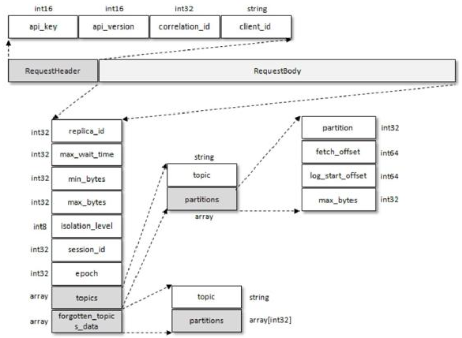

图6-5 FetchRequest的组织结构

除了请求头中的4个域，其余FetchRequest中各个域的含义如表6-5所示。

表6-5 其余FetchRequest请求体中各域的释义

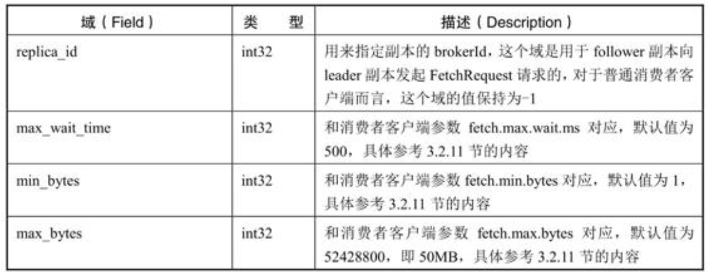

续表


不管是 follower 副本还是普通的消费者客户端，如果要拉取某个分区中的消息，就需要指定详细的拉取信息，也就是需要设定 partition、fetch_offset、log_start_offset和max_bytes这4个域的具体值，那么对每个分区而言，就需要占用4B+8B+8B+4B=24B的空间。一般情况下，不管是 follower 副本还是普通的消费者，它们的订阅信息是长期固定的。也就是说，FetchRequest 中的 topics 域的内容是长期固定的，只有在拉取开始时或发生某些异常时会有所变动。FetchRequest 请求是一个非常频繁的请求，如果要拉取的分区数有很多，比如有1000个分区，那么在网络上频繁交互FetchRequest时就会有固定的1000×24B ≈ 24KB的字节的内容在传动，如果可以将这 24KB 的状态保存起来，那么就可以节省这部分所占用的带宽。

Kafka从1.1.0版本开始针对FetchRequest引入了session_id、epoch和forgotten_topics_data等域，session_id和epoch确定一条拉取链路的fetch session，当session建立或变更时会发送全量式的 FetchRequest，所谓的全量式就是指请求体中包含所有需要拉取的分区信息；当session稳定时则会发送增量式的FetchRequest请求，里面的topics域为空，因为topics域的内容已经被缓存在了session链路的两侧。如果需要从当前fetch session中取消对某些分区的拉取订阅，则可以使用forgotten_topics_data字段来实现。

这个改进在大规模（有大量的分区副本需要及时同步）的Kafka集群中非常有用，它可以提升集群间的网络带宽的有效使用率。不过对客户端而言效果不是那么明显，一般情况下单个客户端不会订阅太多的分区，不过总体上这也是一个很好的优化改进。

与FetchRequest对应的FetchResponse的组织结构（V8版本）可以参考图6-6。


图6-6 FetchResponse的组织结构

FetchResponse结构中的域也很多，它主要分为4层，第1层包含throttle_time_ms、error_code、session_id 和 responses，前面 3 个域都见过，其中 session_id 和FetchRequest中的session_id对应。responses是一个数组类型，表示响应的具体内容，也就是FetchResponse结构中的第2层，具体地细化到每个分区的响应。第3层中包含分区的元数据信息（partition、error_code 等）及具体的消息内容（record_set），aborted_transactions和事务相关。

除了Kafka客户端开发人员，绝大多数的其他开发人员基本接触不到或不需要接触具体的协议，那么我们为什么还要了解它们呢？其实，协议的具体定义可以让我们从另一个角度来了解Kafka的本质。以PRODUCE和FETCH为例，从协议结构中就可以看出消息的写入和拉取消费都是细化到每一个分区层级的。并且，通过了解各个协议版本变迁的细节也能够从侧面了解 Kafka 变迁的历史，在变迁的过程中遇到过哪方面的瓶颈，又采取哪种优化手段，比如FetchRequest中的session_id的引入。

由于篇幅限制，笔者并不打算列出所有Kafka协议类型的细节。不过对于Kafka协议的介绍并没有到此为止，后面的章节中会针对其余41种类型的部分协议进行相关的介绍，完整的协议类型列表可以参考[官方文档](http://kafka.apache.org/protocol.html#protocol_api_keys)。Kafka中最枯燥的莫过于它的上百个参数、几百个监控指标和几十种请求协议，掌握这三者的“套路”，相信你会对Kafka有更深入的理解。

## 6.2 时间轮

Kafka中存在大量的延时操作，比如延时生产、延时拉取和延时删除等。Kafka并没有使用JDK自带的Timer或DelayQueue来实现延时的功能，而是基于时间轮的概念自定义实现了一个用于延时功能的定时器（SystemTimer）。JDK中Timer和DelayQueue的插入和删除操作的平均时间复杂度为O（nlogn）并不能满足Kafka的高性能要求，而基于时间轮可以将插入和删除操作的时间复杂度都降为O（1）。时间轮的应用并非Kafka独有，其应用场景还有很多，在Netty、Akka、Quartz、ZooKeeper等组件中都存在时间轮的踪影。

如图6-7所示，Kafka中的时间轮（TimingWheel）是一个存储定时任务的环形队列，底层采用数组实现，数组中的每个元素可以存放一个定时任务列表（TimerTaskList）。TimerTaskList是一个环形的双向链表，链表中的每一项表示的都是定时任务项（TimerTaskEntry），其中封装了真正的定时任务（TimerTask）。

时间轮由多个时间格组成，每个时间格代表当前时间轮的基本时间跨度（tickMs）。时间轮的时间格个数是固定的，可用wheelSize来表示，那么整个时间轮的总体时间跨度（interval）可以通过公式 tickMs×wheelSize计算得出。时间轮还有一个表盘指针（currentTime），用来表示时间轮当前所处的时间，currentTime是tickMs的整数倍。currentTime可以将整个时间轮划分为到期部分和未到期部分，currentTime当前指向的时间格也属于到期部分，表示刚好到期，需要处理此时间格所对应的TimerTaskList中的所有任务。


图6-7 时间轮结构

若时间轮的tickMs为1ms且wheelSize等于20，那么可以计算得出总体时间跨度interval为20ms。初始情况下表盘指针currentTime指向时间格0，此时有一个定时为2ms的任务插进来会存放到时间格为2的TimerTaskList中。随着时间的不断推移，指针currentTime不断向前推进，过了2ms之后，当到达时间格2时，就需要将时间格2对应的TimeTaskList中的任务进行相应的到期操作。此时若又有一个定时为 8ms 的任务插进来，则会存放到时间格 10 中，currentTime再过8ms后会指向时间格10。如果同时有一个定时为19ms的任务插进来怎么办？新来的TimerTaskEntry会复用原来的TimerTaskList，所以它会插入原本已经到期的时间格1。总之，整个时间轮的总体跨度是不变的，随着指针currentTime的不断推进，当前时间轮所能处理的时间段也在不断后移，总体时间范围在currentTime和currentTime+interval之间。

如果此时有一个定时为350ms的任务该如何处理？直接扩充wheelSize的大小？Kafka中不乏几万甚至几十万毫秒的定时任务，这个wheelSize的扩充没有底线，就算将所有的定时任务的到期时间都设定一个上限，比如100万毫秒，那么这个wheelSize为100万毫秒的时间轮不仅占用很大的内存空间，而且也会拉低效率。Kafka 为此引入了层级时间轮的概念，当任务的到期时间超过了当前时间轮所表示的时间范围时，就会尝试添加到上层时间轮中。

如图6-8所示，复用之前的案例，第一层的时间轮tickMs=1ms、wheelSize=20、interval=20ms。第二层的时间轮的tickMs为第一层时间轮的interval，即20ms。每一层时间轮的wheelSize是固定的，都是20，那么第二层的时间轮的总体时间跨度interval为400ms。以此类推，这个400ms也是第三层的tickMs的大小，第三层的时间轮的总体时间跨度为8000ms。

对于之前所说的350ms的定时任务，显然第一层时间轮不能满足条件，所以就升级到第二层时间轮中，最终被插入第二层时间轮中时间格17所对应的TimerTaskList。如果此时又有一个定时为450ms的任务，那么显然第二层时间轮也无法满足条件，所以又升级到第三层时间轮中，最终被插入第三层时间轮中时间格1的TimerTaskList。注意到在到期时间为[400ms，800ms）区间内的多个任务（比如446ms、455ms和473ms的定时任务）都会被放入第三层时间轮的时间格1，时间格1对应的TimerTaskList的超时时间为400ms。随着时间的流逝，当此TimerTaskList到期之时，原本定时为450ms的任务还剩下50ms的时间，还不能执行这个任务的到期操作。这里就有一个时间轮降级的操作，会将这个剩余时间为 50ms 的定时任务重新提交到层级时间轮中，此时第一层时间轮的总体时间跨度不够，而第二层足够，所以该任务被放到第二层时间轮到期时间为[40ms，60ms）的时间格中。再经历40ms之后，此时这个任务又被“察觉”，不过还剩余10ms，还是不能立即执行到期操作。所以还要再有一次时间轮的降级，此任务被添加到第一层时间轮到期时间为[10ms，11ms）的时间格中，之后再经历 10ms 后，此任务真正到期，最终执行相应的到期操作。


图6-8 多层时间轮

设计源于生活。我们常见的钟表就是一种具有三层结构的时间轮，第一层时间轮tickMs=1ms、wheelSize=60、interval=1min，此为秒钟；第二层 tickMs=1min、wheelSize=60、interval=1hour，此为分钟；第三层tickMs=1hour、wheelSize=12、interval=12hours，此为时钟。

在 Kafka 中，第一层时间轮的参数同上面的案例一样：tickMs=1ms、wheelSize=20、interval=20ms，各个层级的wheelSize也固定为20，所以各个层级的tickMs和interval也可以相应地推算出来。Kafka在具体实现时间轮TimingWheel时还有一些小细节：

- TimingWheel 在创建的时候以当前系统时间为第一层时间轮的起始时间（startMs），这里的当前系统时间并没有简单地调用 System.currentTimeMillis()，而是调用了Time.SYSTEM.hiResClockMs，这是因为 currentTimeMillis() 方法的时间精度依赖于操作系统的具体实现，有些操作系统下并不能达到毫秒级的精度，而Time.SYSTEM.hiResClockMs实质上采用了System.nanoTime()/1_000_000来将精度调整到毫秒级。

- TimingWheel中的每个双向环形链表TimerTaskList都会有一个哨兵节点（sentinel），引入哨兵节点可以简化边界条件。哨兵节点也称为哑元节点（dummy node），它是一个附加的链表节点，该节点作为第一个节点，它的值域中并不存储任何东西，只是为了操作的方便而引入的。如果一个链表有哨兵节点，那么线性表的第一个元素应该是链表的第二个节点。

- 除了第一层时间轮，其余高层时间轮的起始时间（startMs）都设置为创建此层时间轮时前面第一轮的currentTime。每一层的currentTime都必须是tickMs的整数倍，如果不满足则会将currentTime修剪为tickMs的整数倍，以此与时间轮中的时间格的到期时间范围对应起来。修剪方法为：currentTime=startMs-(startMs%tickMs)。currentTime会随着时间推移而推进，但不会改变为tickMs的整数倍的既定事实。若某一时刻的时间为timeMs，那么此时时间轮的currentTime=timeMs-(timeMs%tickMs)，时间每推进一次，每个层级的时间轮的currentTime都会依据此公式执行推进。

- Kafka 中的定时器只需持有 TimingWheel 的第一层时间轮的引用，并不会直接持有其他高层的时间轮，但每一层时间轮都会有一个引用（overflowWheel）指向更高一层的应用，以此层级调用可以实现定时器间接持有各个层级时间轮的引用。

关于时间轮的细节就描述到这里，各个组件中对时间轮的实现大同小异。读者读到这里是否会好奇文中一直描述的一个情景—“随着时间的流逝”或“随着时间的推移”，那么在Kafka中到底是怎么推进时间的呢？类似采用JDK中的scheduleAtFixedRate来每秒推进时间轮？显然这样并不合理，TimingWheel也失去了大部分意义。

Kafka中的定时器借了JDK中的DelayQueue来协助推进时间轮。具体做法是对于每个使用到的TimerTaskList都加入DelayQueue，“每个用到的TimerTaskList”特指非哨兵节点的定时任务项TimerTaskEntry对应的TimerTaskList。DelayQueue会根据TimerTaskList对应的超时时间expiration来排序，最短expiration的TimerTaskList会被排在DelayQueue的队头。Kafka中会有一个线程来获取 DelayQueue 中到期的任务列表，有意思的是这个线程所对应的名称叫作“ExpiredOperationReaper”，可以直译为“过期操作收割机”，和5.4.2节中的“SkimpyOffsetMap”的取名有异曲同工之妙。当“收割机”线程获取 DelayQueue 中超时的任务列表 TimerTaskList之后，既可以根据 TimerTaskList 的 expiration 来推进时间轮的时间，也可以就获取的TimerTaskList执行相应的操作，对里面的TimerTaskEntry该执行过期操作的就执行过期操作，该降级时间轮的就降级时间轮。

读到这里或许会感到困惑，开头明确指明的DelayQueue不适合Kafka这种高性能要求的定时任务，为何这里还要引入DelayQueue呢？注意对定时任务项TimerTaskEntry的插入和删除操作而言，TimingWheel时间复杂度为O（1），性能高出DelayQueue很多，如果直接将TimerTaskEntry插入DelayQueue，那么性能显然难以支撑。就算我们根据一定的规则将若干TimerTaskEntry划分到TimerTaskList这个组中，然后将TimerTaskList插入DelayQueue，如果在TimerTaskList中又要多添加一个TimerTaskEntry时该如何处理呢？对DelayQueue而言，这类操作显然变得力不从心。

分析到这里可以发现，Kafka 中的 TimingWheel 专门用来执行插入和删除 TimerTaskEntry的操作，而 DelayQueue 专门负责时间推进的任务。试想一下，DelayQueue 中的第一个超时任务列表的expiration为200ms，第二个超时任务为840ms，这里获取DelayQueue的队头只需要O(1)的时间复杂度（获取之后DelayQueue内部才会再次切换出新的队头）。如果采用每秒定时推进，那么获取第一个超时的任务列表时执行的200次推进中有199次属于“空推进”，而获取第二个超时任务时又需要执行639次“空推进”，这样会无故空耗机器的性能资源，这里采用DelayQueue来辅助以少量空间换时间，从而做到了“精准推进”。Kafka中的定时器真可谓“知人善用”，用TimingWheel做最擅长的任务添加和删除操作，而用DelayQueue做最擅长的时间推进工作，两者相辅相成。

## 6.3 延时操作

如果在使用生产者客户端发送消息的时候将 acks 参数设置为-1，那么就意味着需要等待ISR集合中的所有副本都确认收到消息之后才能正确地收到响应的结果，或者捕获超时异常。

如图6-9、图6-10和图6-11所示，假设某个分区有3个副本：leader、follower1和follower2，它们都在分区的ISR集合中。为了简化说明，这里我们不考虑ISR集合伸缩的情况。Kafka在收到客户端的生产请求（ProduceRequest）后，将消息3和消息4写入leader副本的本地日志文件。由于客户端设置了acks为-1，那么需要等到follower1和follower2两个副本都收到消息3和消息4后才能告知客户端正确地接收了所发送的消息。如果在一定的时间内，follower1副本或follower2副本没能够完全拉取到消息3和消息4，那么就需要返回超时异常给客户端。生产请求的超时时间由参数request.timeout.ms配置，默认值为30000，即30s。

那么这里等待消息3和消息4写入follower1副本和follower2副本，并返回相应的响应结果给客户端的动作是由谁来执行的呢？在将消息写入 leader 副本的本地日志文件之后，Kafka会创建一个延时的生产操作（DelayedProduce），用来处理消息正常写入所有副本或超时的情况，以返回相应的响应结果给客户端。


图6-9 消息写入1


图6-10 消息写入2


图6-11 消息写入3

在Kafka中有多种延时操作，比如前面提及的延时生产，还有延时拉取（DelayedFetch）、延时数据删除（DelayedDeleteRecords）等。延时操作需要延时返回响应的结果，首先它必须有一个超时时间（delayMs），如果在这个超时时间内没有完成既定的任务，那么就需要强制完成以返回响应结果给客户端。其次，**延时操作不同于定时操作，定时操作是指在特定时间之后执行的操作，而延时操作可以在所设定的超时时间之前完成，所以延时操作能够支持外部事件的触发**。就延时生产操作而言，它的外部事件是所要写入消息的某个分区的 HW（高水位）发生增长。也就是说，随着follower副本不断地与leader副本进行消息同步，进而促使HW进一步增长，HW 每增长一次都会检测是否能够完成此次延时生产操作，如果可以就执行以此返回响应结果给客户端；如果在超时时间内始终无法完成，则强制执行。

延时操作创建之后会被加入延时操作管理器（DelayedOperationPurgatory）来做专门的处理。延时操作有可能会超时，每个延时操作管理器都会配备一个定时器（SystemTimer）来做超时管理，定时器的底层就是采用时间轮（TimingWheel）实现的。在6.2节中提及时间轮的轮转是靠“收割机”线程ExpiredOperationReaper来驱动的，这里的“收割机”线程就是由延时操作管理器启动的。也就是说，定时器、“收割机”线程和延时操作管理器都是一一对应的。延时操作需要支持外部事件的触发，所以还要配备一个监听池来负责监听每个分区的外部事件—查看是否有分区的HW发生了增长。另外需要补充的是，ExpiredOperationReaper不仅可以推进时间轮，还会定期清理监听池中已完成的延时操作。

**题外话：**在Kafka中将延时操作管理器称为DelayedOperationPurgatory，这个名称比之前提及的ExpiredOperationReaper和SkimpyOffsetMap的取名更有意思。Purgatory直译为“炼狱”，但丁的《神曲》中有炼狱的相关描述。炼狱共有9层，在生前犯有罪过但可以得到宽恕的灵魂，按照人类的七宗罪（傲慢、忌妒、愤怒、怠惰、贪财、贪食、贪色）分别在这里修炼洗涤，而后一层层升向光明和天堂。Kafka 中采用这一称谓，将延时操作看作需要被洗涤的灵魂，在炼狱中慢慢修炼，等待解脱升入天堂（即完成延时操作）。

图 6-12 描绘了客户端在请求写入消息到收到响应结果的过程中与延时生产操作相关的细节，在了解相关的概念之后应该比较容易理解：如果客户端设置的 acks 参数不为-1，或者没有成功的消息写入，那么就直接返回结果给客户端，否则就需要创建延时生产操作并存入延时操作管理器，最终要么由外部事件触发，要么由超时触发而执行。


图6-12 延时生产的细节

有延时生产就有延时拉取。以图6-13为例，两个follower副本都已经拉取到了leader副本的最新位置，此时又向leader副本发送拉取请求，而leader副本并没有新的消息写入，那么此时leader副本该如何处理呢？可以直接返回空的拉取结果给follower副本，不过在leader副本一直没有新消息写入的情况下，follower副本会一直发送拉取请求，并且总收到空的拉取结果，这样徒耗资源，显然不太合理。


图6-13 延时拉取

Kafka选择了延时操作来处理这种情况。Kafka在处理拉取请求时，会先读取一次日志文件，如果收集不到足够多（fetchMinBytes，由参数fetch.min.bytes配置，默认值为1）的消息，那么就会创建一个延时拉取操作（DelayedFetch）以等待拉取到足够数量的消息。当延时拉取操作执行时，会再读取一次日志文件，然后将拉取结果返回给 follower 副本。延时拉取操作也会有一个专门的延时操作管理器负责管理，大体的脉络与延时生产操作相同，不再赘述。如果拉取进度一直没有追赶上leader副本，那么在拉取leader副本的消息时一般拉取的消息大小都会不小于fetchMinBytes，这样Kafka也就不会创建相应的延时拉取操作，而是立即返回拉取结果。

延时拉取操作同样是由超时触发或外部事件触发而被执行的。超时触发很好理解，就是等到超时时间之后触发第二次读取日志文件的操作。外部事件触发就稍复杂了一些，因为拉取请求不单单由 follower 副本发起，也可以由消费者客户端发起，两种情况所对应的外部事件也是不同的。如果是follower副本的延时拉取，它的外部事件就是消息追加到了leader副本的本地日志文件中；如果是消费者客户端的延时拉取，它的外部事件可以简单地理解为HW的增长。

目前版本的Kafka还引入了事务的概念，对于消费者或follower副本而言，其默认的事务隔离级别为“read_uncommitted”。不过消费者可以通过客户端参数isolation.level将事务隔离级别设置为“read_committed”（注意：follower副本不可以将事务隔离级别修改为这个值），这样消费者拉取不到生产者已经写入却尚未提交的消息。对应的消费者的延时拉取，它的外部事件实际上会切换为由LSO（LastStableOffset）的增长来触发。LSO是HW之前除去未提交的事务消息的最大偏移量，LSO≤HW，有关事务和LSO的内容可以分别参考7.4节和10.2节。

本节主要讲述与日志（消息）存储有关的延时生产和延时拉取的操作，至于其他类型的延时操作就不一一介绍了，不过在讲解到相关内容时会做相应的阐述。

## 6.4 控制器

在 Kafka 集群中会有一个或多个 broker，其中有一个 broker 会被选举为控制器（Kafka Controller），它负责管理整个集群中所有分区和副本的状态。当某个分区的leader副本出现故障时，由控制器负责为该分区选举新的leader副本。当检测到某个分区的ISR集合发生变化时，由控制器负责通知所有broker更新其元数据信息。当使用kafka-topics.sh脚本为某个topic增加分区数量时，同样还是由控制器负责分区的重新分配。

### 6.4.1 控制器的选举及异常恢复

Kafka中的控制器选举工作依赖于ZooKeeper，成功竞选为控制器的broker会在ZooKeeper中创建/controller这个临时（EPHEMERAL）节点，此临时节点的内容参考如下：


其中version在目前版本中固定为1，brokerid表示成为控制器的broker的id编号，timestamp表示竞选成为控制器时的时间戳。

在任意时刻，集群中有且仅有一个控制器。每个 broker 启动的时候会去尝试读取/controller节点的brokerid的值，如果读取到brokerid的值不为-1，则表示已经有其他 broker 节点成功竞选为控制器，所以当前 broker 就会放弃竞选；如果 ZooKeeper 中不存在/controller节点，或者这个节点中的数据异常，那么就会尝试去创建/controller节点。当前broker去创建节点的时候，也有可能其他broker同时去尝试创建这个节点，只有创建成功的那个broker才会成为控制器，而创建失败的broker竞选失败。每个broker都会在内存中保存当前控制器的brokerid值，这个值可以标识为activeControllerId。

ZooKeeper 中还有一个与控制器有关的/controller_epoch 节点，这个节点是持久（PERSISTENT）节点，节点中存放的是一个整型的controller_epoch值。controller_epoch用于记录控制器发生变更的次数，即记录当前的控制器是第几代控制器，我们也可以称之为“控制器的纪元”。

controller_epoch的初始值为1，即集群中第一个控制器的纪元为1，当控制器发生变更时，每选出一个新的控制器就将该字段值加1。每个和控制器交互的请求都会携带controller_epoch这个字段，如果请求的controller_epoch值小于内存中的controller_epoch值，则认为这个请求是向已经过期的控制器所发送的请求，那么这个请求会被认定为无效的请求。如果请求的controller_epoch值大于内存中的controller_epoch值，那么说明已经有新的控制器当选了。由此可见，Kafka 通过 controller_epoch 来保证控制器的唯一性，进而保证相关操作的一致性。

具备控制器身份的broker需要比其他普通的broker多一份职责，具体细节如下：

- 监听分区相关的变化。为ZooKeeper中的/admin/reassign_partitions 节点注册 PartitionReassignmentHandler，用来处理分区重分配的动作。为 ZooKeeper 中的/isr_change_notification节点注册IsrChangeNotificetionHandler，用来处理ISR集合变更的动作。为ZooKeeper中的/admin/preferred-replica-election节点添加PreferredReplicaElectionHandler，用来处理优先副本的选举动作。

- 监听主题相关的变化。为 ZooKeeper 中的/brokers/topics 节点添加TopicChangeHandler，用来处理主题增减的变化；为 ZooKeeper 中的/admin/delete_topics节点添加TopicDeletionHandler，用来处理删除主题的动作。

- 监听broker相关的变化。为ZooKeeper中的/brokers/ids节点添加BrokerChangeHandler，用来处理broker增减的变化。

- 从ZooKeeper中读取获取当前所有与主题、分区及broker有关的信息并进行相应的管理。对所有主题对应的 ZooKeeper 中的/brokers/topics/\<topic>节点添加PartitionModificationsHandler，用来监听主题中的分区分配变化。

- 启动并管理分区状态机和副本状态机。

- 更新集群的元数据信息。

- 如果参数 auto.leader.rebalance.enable 设置为 true，则还会开启一个名为“auto-leader-rebalance-task”的定时任务来负责维护分区的优先副本的均衡。

控制器在选举成功之后会读取 ZooKeeper 中各个节点的数据来初始化上下文信息（ControllerContext），并且需要管理这些上下文信息。比如为某个主题增加了若干分区，控制器在负责创建这些分区的同时要更新上下文信息，并且需要将这些变更信息同步到其他普通的broker 节点中。不管是监听器触发的事件，还是定时任务触发的事件，或者是其他事件（比如ControlledShutdown，具体可以参考 6.4.2 节）都会读取或更新控制器中的上下文信息，那么这样就会涉及多线程间的同步。如果单纯使用锁机制来实现，那么整体的性能会大打折扣。针对这一现象，Kafka 的控制器使用单线程基于事件队列的模型，将每个事件都做一层封装，然后按照事件发生的先后顺序暂存到 LinkedBlockingQueue 中，最后使用一个专用的线程（ControllerEventThread）按照FIFO（First Input First Output，先入先出）的原则顺序处理各个事件，这样不需要锁机制就可以在多线程间维护线程安全，具体可以参考图6-14。

在Kafka的早期版本中，并没有采用Kafka Controller这样一个概念来对分区和副本的状态进行管理，而是依赖于ZooKeeper，每个broker都会在ZooKeeper上为分区和副本注册大量的监听器（Watcher）。当分区或副本状态变化时，会唤醒很多不必要的监听器，这种严重依赖ZooKeeper 的设计会有脑裂、羊群效应，以及造成 ZooKeeper 过载的隐患（旧版的消费者客户端存在同样的问题，详细内容参考7.2.1节）。在目前的新版本的设计中，只有Kafka Controller在ZooKeeper上注册相应的监听器，其他的broker极少需要再监听ZooKeeper中的数据变化，这样省去了很多不必要的麻烦。不过每个broker还是会对/controller节点添加监听器，以此来监听此节点的数据变化（ControllerChangeHandler）。


图6-14 控制器

当/controller 节点的数据发生变化时，每个 broker 都会更新自身内存中保存的activeControllerId。如果broker 在数据变更前是控制器，在数据变更后自身的 brokerid 值与新的 activeControllerId 值不一致，那么就需要“退位”，关闭相应的资源，比如关闭状态机、注销相应的监听器等。有可能控制器由于异常而下线，造成/controller 这个临时节点被自动删除；也有可能是其他原因将此节点删除了。

当/controller节点被删除时，每个broker都会进行选举，如果broker在节点被删除前是控制器，那么在选举前还需要有一个“退位”的动作。如果有特殊需要，则可以手动删除/controller 节点来触发新一轮的选举。当然关闭控制器所对应的 broker，以及手动向/controller节点写入新的brokerid的所对应的数据，同样可以触发新一轮的选举。

### 6.4.2 优雅关闭

如何优雅地关闭Kafka？笔者在做测试的时候经常性使用jps（或者ps ax）配合kill-9的方式来快速关闭Kafka broker的服务进程，显然kill-9这种“强杀”的方式并不够优雅，它并不会等待Kafka 进程合理关闭一些资源及保存一些运行数据之后再实施关闭动作。在有些场景中，用户希望主动关闭正常运行的服务，比如更换硬件、操作系统升级、修改Kafka配置等。如果依然使用上述方式关闭就略显粗暴。

那么合理的操作应该是什么呢？Kafka自身提供了一个脚本工具，就是存放在其bin目录下的kafka-server-stop.sh，这个脚本的内容非常简单，具体内容如下：


可以看出kafka-server-stop.sh首先通过ps ax的方式找出正在运行Kafka的进程号PIDS，然后使用kill-s TERM $PIDS的方式来关闭。但是这个脚本在很多时候并不奏效，这一点与ps命令有关系。在Linux操作系统中，ps命令限制输出的字符数不得超过页大小 PAGE_SIZE，一般 CPU 的内存管理单元（Memory Management Unit，简称 MMU）的PAGE_SIZE为4096。也就是说，ps命令的输出的字符串长度限制在4096内，这会有什么问题呢？我们使用ps ax命令来输出与Kafka进程相关的信息，如图6-15所示。


图6-15 Kafka进程信息

细心的读者可以留意到白色部分中的信息并没有打印全，因为已经达到了4096的字符数的限制。而且打印的信息里面也没有 kafka-server-stop.sh 中 ps ax|grep-i'kafka\.Kafka'所需要的“kafka.Kafka”这个关键字段，因为这个关键字段在4096个字符的范围之外。与Kafka进程有关的输出信息太长，所以kafka-server-stop.sh脚本在很多情况下并不会奏效。

**注意要点：**Kafka服务启动的入口就是kafka.Kafka，采用Scala语言编写object。

那么怎么解决这种问题呢？我们先来看一下 ps 命令的相关源码（Linux 2.6.x 源码的/fs/proc/base.c文件中的部分内容）：


我们可以看到ps的输出长度len被硬编码成小于等于PAGE_SIZE的大小，那么我们调大这个PAGE_SIZE的大小不就可以了吗？这样是肯定行不通的，因为对于一个CPU来说，它的MMU的页大小PAGE_SIZE的值是固定的，无法通过参数调节。要想改变PAGE_SIZE的大小，就必须更换成相应的CPU，显然这也太过于“兴师动众”了。还有一种办法是，将上面代码中的 PAGE_SIZE 换成一个更大的其他值，然后重新编译，这个办法对于大多数人来说不太适用，需要掌握一定深度的Linux的相关知识。

那么有没有其他的办法呢？这里我们可以直接修改 kafka-server-stop.sh 脚本的内容，将其中的第一行命令修改如下：


即把“\.Kafka”去掉，这样在绝大多数情况下是可以奏效的。如果有极端情况，即使这样也不能关闭，那么只需要按照以下两个步骤就可以优雅地关闭Kafka的服务进程：

（1）获取Kafka的服务进程号PIDS。可以使用Java中的jps命令或使用Linux系统中的ps命令来查看。

（2）使用 kill-s TERM \$PIDS 或 kill-15 \$PIDS 的方式来关闭进程，注意千万不要使用kill-9的方式。

为什么这样关闭的方式会是优雅的？Kafka 服务入口程序中有一个名为“kafka-shutdown-hock”的关闭钩子，待 Kafka 进程捕获终止信号的时候会执行这个关闭钩子中的内容，其中除了正常关闭一些必要的资源，还会执行一个控制关闭（ControlledShutdown）的动作。使用ControlledShutdown的方式关闭Kafka有两个优点：一是可以让消息完全同步到磁盘上，在服务下次重新上线时不需要进行日志的恢复操作；二是 ControllerShutdown 在关闭服务之前，会对其上的leader副本进行迁移，这样就可以减少分区的不可用时间。

若要成功执行 ControlledShutdown 动作还需要有一个先决条件，就是参数 controlled.shutdown.enable的值需要设置为true，不过这个参数的默认值就为true，即默认开始此项功能。ControlledShutdown 动作如果执行不成功还会重试执行，这个重试的动作由参数controlled.shutdown.max.retries 配置，默认为 3 次，每次重试的间隔由参数controlled.shutdown.retry.backoff.ms设置，默认为5000ms。

下面我们具体探讨ControlledShutdown的整个执行过程。

参考图6-16，假设此时有两个broker，其中待关闭的broker的id为x，Kafka控制器所对应的broker的id为y。待关闭的broker在执行ControlledShutdown动作时首先与Kafka控制器建立专用连接（对应图 6-16 中的步骤①），然后发送 ControlledShutdownRequest 请求，ControlledShutdownRequest 请求中只有一个brokerId字段，这个brokerId字段的值设置为自身的brokerId的值，即x（对应图6-16中的步骤②）。

Kafka控制器在收到ControlledShutdownRequest请求之后会将与待关闭broker有关联的所有分区进行专门的处理，这里的“有关联”是指分区中有副本位于这个待关闭的broker之上（这里会涉及Kafka控制器与待关闭broker之间的多次交互动作，涉及leader副本的迁移和副本的关闭动作，对应图6-16中的步骤③）。


图6-16 ControlledShutdown的执行过程

ControlledShutdownRequest的结构如图6-17所示。


图6-17 ControlledShutdownRequest的结构

如果这些分区的副本数大于1且leader副本位于待关闭broker上，那么需要实施leader副本的迁移及新的 ISR 的变更。具体的选举分配的方案由专用的选举器 ControlledShutdown-LeaderSelector提供，有关选举的细节可以参考6.4.3节的内容。

如果这些分区的副本数只是大于1，leader副本并不位于待关闭broker上，那么就由Kafka控制器来指导这些副本的关闭。如果这些分区的副本数只是为 1，那么这个副本的关闭动作会在整个ControlledShutdown动作执行之后由副本管理器来具体实施。

对于分区的副本数大于1且leader副本位于待关闭broker上的这种情况，如果在Kafka控制器处理之后leader副本还没有成功迁移，那么会将这些没有成功迁移leader副本的分区记录下来，并且写入 ControlledShutdownResponse 的响应（对应图 6-16 中的步骤④，整个ControlledShutdown动作是一个同步阻塞的过程）。ControlledShutdownResponse的结构如图6-18所示。


图6-18 ControlledShutdownResponse的结构

待关闭的broker在收到ControlledShutdownResponse响应之后，需要判断整个ControlledShutdown动作是否执行成功，以此来进行可能的重试或继续执行接下来的关闭资源的动作。执行成功的标准是ControlledShutdownResponse中error_code字段值为0，并且partitions_remaining数组字段为空。

**注意要点：**图6-16中也有可能x=y，即待关闭的broker同时是Kafka控制器，这也就意味着自己可以给自己发送 ControlledShutdownRequest 请求，以及等待自身的处理并接收ControlledShutdownResponse的响应，具体的执行细节和x!=y的场景相同。

在了解了整个 ControlledShutdown 动作的具体细节之后，我们不难看出这一切实质上都是由ControlledShutdownRequest请求引发的，我们完全可以自己开发一个程序来连接Kafka控制器，以此来模拟对某个 broker 实施 ControlledShutdown 的动作。为了实现方便，我们可以对KafkaAdminClient做一些扩展来达到目的。

首先参考org.apache.kafka.clients.admin.AdminClient接口中的惯有编码样式来添加两个方法：


第一个方法中的ControlledShutdownOptions和ControlledShutdownResult都是KafkaAdminClient的惯有编码样式，ControlledShutdownOptions中没有实质性的内容，具体参考如下：


ControlledShutdownResult的实现如下：


ControlledShutdownResult中没有像KafkaAdminClient中惯有的那样对ControlledShutdownResponse进行细致化的处理，而是直接将 ControlledShutdownResponse 暴露给用户，这样用户可以更加细腻地操控内部的细节。

第二个方法中的参数Node是我们需要执行ControlledShutdown动作的broker节点，Node的构造方法至少需要三个参数：id、host和port，分别代表所对应的broker的id编号、IP地址和端口号。一般情况下，对用户而言，并不一定清楚这个三个参数的具体值，有的要么只知道要关闭的broker的IP地址和端口号，要么只清楚具体的id编号，为了程序的通用性，我们还需要做进一步的处理。详细看一下 org.apache.kafka.clients.admin.KafkaAdminClient 中的具体做法：


我们可以看到在内部的 createRequest 方法中对 Node 的 id 做了一些处理，因为对ControlledShutdownRequest协议的包装只需要这个id的值。程序中首先判断Node的id是否大于0，如果不是则需要根据host和port去KafkaAdminClient缓存的元数据metadata中查找匹配的id。注意到代码里还有一个标粗的ControllerNodeProvider，它提供了Kafka控制器对应的节点信息，这样用户只需要提供Kafka集群中的任意节点的连接信息，不需要知晓具体的Kafka控制器是谁。

最后我们再用一段测试程序来模拟发送 ControlledShutdownRequest 请求及处理ControlledShutdownResponse，详细参考如下：


其中brokerUrl 是连接的任意节点，node是需要关闭的broker节点，当然这两个可以是同一个节点，即代码中的hostname1等于hostname2。使用KafkaAdminClient的整个流程为：首先连接集群中的任意节点；接着通过这个连接向 Kafka 集群发起元数据请求（MetadataRequest）来获取集群的元数据metadata；然后获取需要关闭的broker节点的id，如果没有指定则去metadata中查找，根据这个id封装ControlledShutdownRequest请求；之后再去metadata中查找Kafka控制器的节点，向这个Kafka控制器节点发送请求；最后等待Kafka控制器的ControlledShutdownResponse响应并做相应的处理。

注意ControlledShutdown只是关闭Kafka broker的一个中间过程，所以不能寄希望于只使用ControlledShutdownRequest请求就可以关闭整个Kafka broker的服务进程。

### 6.4.3 分区leader的选举

分区leader副本的选举由控制器负责具体实施。当创建分区（创建主题或增加分区都有创建分区的动作）或分区上线（比如分区中原先的leader副本下线，此时分区需要选举一个新的leader 上线来对外提供服务）的时候都需要执行 leader 的选举动作，对应的选举策略为OfflinePartitionLeaderElectionStrategy。这种策略的基本思路是按照 AR 集合中副本的顺序查找第一个存活的副本，并且这个副本在ISR集合中。一个分区的AR集合在分配的时候就被指定，并且只要不发生重分配的情况，集合内部副本的顺序是保持不变的，而分区的ISR集合中副本的顺序可能会改变。

注意这里是根据AR的顺序而不是ISR的顺序进行选举的。举个例子，集群中有3个节点：broker0、broker1和broker2，在某一时刻具有3个分区且副本因子为3的主题topic-leader的具体信息如下：


此时关闭broker0，那么对于分区2而言，存活的AR就变为[1，2]，同时ISR变为[2，1]。此时查看主题topic-leader的具体信息（参考如下），分区2的leader就变为了1而不是2。


如果ISR集合中没有可用的副本，那么此时还要再检查一下所配置的unclean.leader.election.enable参数（默认值为false）。如果这个参数配置为true，那么表示允许从非ISR列表中的选举leader，从AR列表中找到第一个存活的副本即为leader。

当分区进行重分配（可以先回顾一下4.3.2节的内容）的时候也需要执行leader的选举动作，对应的选举策略为 ReassignPartitionLeaderElectionStrategy。这个选举策略的思路比较简单：从重分配的AR列表中找到第一个存活的副本，且这个副本在目前的ISR列表中。

当发生优先副本（可以先回顾一下4.3.1节的内容）的选举时，直接将优先副本设置为leader即可，AR集合中的第一个副本即为优先副本（PreferredReplicaPartitionLeaderElectionStrategy）。

还有一种情况会发生 leader 的选举，当某节点被优雅地关闭（也就是执行ControlledShutdown）时，位于这个节点上的leader副本都会下线，所以与此对应的分区需要执行leader的选举。与此对应的选举策略（ControlledShutdownPartitionLeaderElectionStrategy）为：从AR列表中找到第一个存活的副本，且这个副本在目前的ISR列表中，与此同时还要确保这个副本不处于正在被关闭的节点上。

## 6.5 参数解密

如果broker端没有显式配置listeners（或advertised.listeners）使用IP地址，那么最好将bootstrap.server配置成主机名而不要使用IP地址，因为Kafka内部使用的是全称域名（Fully Qualified Domain Name）。如果不统一，则会出现无法获取元数据的异常。

### 6.5.1 broker.id

broker.id是broker在启动之前必须设定的参数之一，在Kafka集群中，每个broker都有唯一的 id（也可以记作 brokerId）值用来区分彼此。broker 在启动时会在 ZooKeeper 中的/brokers/ids路径下创建一个以当前brokerId为名称的虚节点，broker的健康状态检查就依赖于此虚节点。当 broker 下线时，该虚节点会自动删除，其他 broker 节点或客户端通过判断/brokers/ids路径下是否有此broker的brokerId节点来确定该broker的健康状态。

可以通过 broker 端的配置文件 config/server.properties 里的 broker.id 参数来配置brokerId，默认情况下broker.id值为-1。在Kafka中，brokerId值必须大于等于0才有可能正常启动，但这里并不是只能通过配置文件config/server.properties来设定这个值，还可以通过meta.properties文件或自动生成功能来实现。

首先了解一下meta.properties文件，meta.properties文件中的内容参考如下：


meta.properties文件中记录了与当前Kafka版本对应的一个version字段，不过目前只有一个为0的固定值。还有一个broker.id，即brokerId值。broker在成功启动之后在每个日志根目录下都会有一个meta.properties文件。

meta.properties文件与broker.id的关联如下：

（1）如果 log.dir 或 log.dirs 中配置了多个日志根目录，这些日志根目录中的meta.properties文件所配置的broker.id不一致则会抛出InconsistentBrokerIdException的异常。

（2）如果config/server.properties配置文件里配置的broker.id的值和meta.properties文件里的broker.id值不一致，那么同样会抛出InconsistentBrokerIdException的异常。

（3）如果 config/server.properties 配置文件中并未配置 broker.id 的值，那么就以meta.properties文件中的broker.id值为准。

（4）如果没有meta.properties文件，那么在获取合适的broker.id值之后会创建一个新的meta.properties文件并将broker.id值存入其中。

如果 config/server.properties 配置文件中并未配置 broker.id，并且日志根目录中也没有任何meta.properties文件（比如第一次启动时），那么应该如何处理呢？

Kafka 还提供了另外两个 broker 端参数：broker.id.generation.enable 和reserved.broker.max.id来配合生成新的brokerId。broker.id.generation.enable参数用来配置是否开启自动生成 brokerId 的功能，默认情况下为 true，即开启此功能。自动生成的 brokerId 有一个基准值，即自动生成的 brokerId 必须超过这个基准值，这个基准值通过reserverd.broker.max.id参数配置，默认值为1000。也就是说，默认情况下自动生成的brokerId从1001开始。

自动生成的brokerId的原理是先往ZooKeeper中的/brokers/seqid节点中写入一个空字符串，然 后 获 取 返 回 的 Stat 信 息 中 的 version 值，进 而 将 version 的 值 和reserved.broker.max.id参数配置的值相加。先往节点中写入数据再获取Stat信息，这样可以确保返回的 version 值大于 0，进而就可以确保生成的 brokerId 值大于reserved.broker.max.id 参数配置的值，符合非自动生成的 broker.id 的值在[0，reserved.broker.max.id]区间设定。

初始化时ZooKeeper中/brokers/seqid节点的状态如下：

```bash
[zk: xxx.XXX.XXx.xxx:2181/kafka (CONNECTED)6] get /brokers/seqidnull
czxid = 0x200001b2b
ctime = Mon Nov 13 17:39:54 CST 2018
mzxid = 0x200001b2b
mtime = Mon Nov 13 17:39:54 CST 2018
pzxid = 0x200001b2b
cversion = 0
dataversion = 0
aclVersion = 0
ephemeralOwner = 0x0
dataLength = 0
numchildren = 0
```

可以看到 dataVersion=0，这个就是前面所说的 version。在插入一个空字符串之后，dataVersion就自增1，表示数据发生了变更，这样通过ZooKeeper 的这个功能来实现集群层面的序号递增，整体上相当于一个发号器。

```bash
[zk: xxx.xxx.xxx.xxx;2181/kafka (CONNECTED) 7] set /brokers/segid ""
cZxid = 0x200001b2b
ctime = Mon Nov 13 17:39:54 CST 2017
mZxid = 0x2000e6eb2
mtime = Mon May 28 18:19:03 CST 2018
pZxid = 0x200001b2b
cversion = 0
dataversion = 1
aclVersion = 0
ephemeralOwner = 0x0
dataLength = 2
numChildren = 0
```

大多数情况下我们一般通过并且习惯于用最普通的config/server.properties配置文件的方式来设定brokerId的值，如果知晓其中的细枝末节，那么在遇到诸如InconsistentBrokerIdException异常时就可以处理得游刃有余，也可以通过自动生成brokerId的功能来实现一些另类的功能。

### 6.5.2 bootstrap.servers

bootstrap.servers不仅是Kafka Producer、Kafka Consumer客户端中的必备参数，而且在Kafka Connect、Kafka Streams和KafkaAdminClient中都有涉及，是一个至关重要的参数。

如果你使用过旧版的生产者或旧版的消费者客户端，那么你可能还会对bootstrap.servers相关的另外两个参数metada.broker.list和zookeeper.connect有些许印象，这3个参数也见证了Kafka的升级变迁。

我们一般可以简单地认为 bootstrap.servers 这个参数所要指定的就是将要连接的Kafka集群的broker地址列表。不过从深层次的意义上来讲，这个参数配置的是用来发现Kafka集群元数据信息的服务地址。为了更加形象地说明问题，我们先来看一下图6-19。


图6-19 bootstrap.servers参数原理示意图

客户端KafkaProducer1与Kafka Cluster直连，这是客户端给我们的既定印象，而事实上客户端连接Kafka集群要经历以下3个过程，如图6-19中的右边所示。

（1）客户端KafkaProducer2与bootstrap.servers参数所指定的Server连接，并发送MetadataRequest请求来获取集群的元数据信息。

（2）Server在收到MetadataRequest请求之后，返回MetadataResponse给KafkaProducer2，在MetadataResponse中包含了集群的元数据信息。

（3）客户端KafkaProducer2收到的MetadataResponse之后解析出其中包含的集群元数据信息，然后与集群中的各个节点建立连接，之后就可以发送消息了。

在绝大多数情况下，Kafka 本身就扮演着第一步和第二步中的 Server 角色，我们完全可以将这个Server的角色从Kafka中剥离出来。我们可以在这个Server的角色上大做文章，比如添加一些路由的功能、负载均衡的功能。

下面演示如何将Server的角色与Kafka分开。默认情况下，客户端从Kafka中的某个节点来拉取集群的元数据信息，我们可以将所拉取的元数据信息复制一份存放到Server中，然后对外提供这份副本的内容信息。

由此可见，我们首先需要做的就是获取集群信息的副本，可以在Kafka的org.apache.kafka.common.request.MetadataResponse的构造函数中嵌入代码来复制信息，MetadataResponse的构造函数如下所示。

```scala
public MetadataResponse(int throttleTimeMs, List<Node> brokers, String clusterId, int controllerId, List<TopicMetadata> topicMetadata) {
    this.throttleTimeMs = throttleTimeMs;
    this.brokers = brokers;
    this.controller = getControllerNode(controllerId, brokers);
    this.topicMetadata = topicMetadata;
    this.clusterId = clusterId;
    // 客户端在获取集群的元数据之后会调用这个构造函数，
    // 所以在这里嵌入代码将5个成员变量的值保存起来，为后面的 Server 提供内容
}
```

获取集群元数据的副本之后，我们就可以实现一个服务程序来接收MetadataRequest请求和返回 MetadataResponse，从零开始构建一个这样的服务程序也需要不少的工作量，需要实现对MetadataRequest与MetadataResponse相关协议解析和包装，这里不妨再修改一下Kafka的代码，让其只提供Server相关的内容。整个示例的架构如图6-20所示。


图6-20 整个示例的架构（Server与Kafka角色分离）

为了演示方便，图6-20中的Kafka Cluster1和Kafka Cluster2都只包含一个broker节点。Kafka Cluster1扮演的是Server的角色，下面我们修改它的代码让其返回Kafka Cluster2的集群元数据信息。假设我们已经通过前面一步的操作获取了 Kafka Cluster2 的集群元数据信息，在Kafka Cluster1中将这份副本回放。

在Kafka的代码kafka.server.KafkaApis中有关专门处理元数据信息的方法如下所示。

```scala
def handleTopicMetadataRequest(request: RequestChannel.Request)
```

我们将这个方法内部的最后一段代码替换，详情如下：

```scala
// sendResponseMaybeThrottle(request, requestThrottleMs => new MetadataResponse(
//   requestThrottleMs,
//   brokers.flatMap(_.getNode(request.context.listenerName)).asJava,
//   clusterId,
//   metadataCache.getControllerId.getOrElse(MetadataResponse.NO_CONTROLLER_ID),
//   completeTopicMetadata.asJava
// ))

sendResponseMaybeThrottle(request, requestThrottleMs =>
  BootstrapServerParam.getMetadata(requestThrottleMs)
)
```

上面示例代码中有 “//” 注释的是原本的代码实现，没有 “//” 注释的两行代码是我们修改后的代码实现，代码里的BootstrapServerParam.getMetadata() 方法也是需要自定义实现的，这个方法返回的就是从Kafka Cluster2中获取的元数据信息的副本回放，BootstrapServerParam的实现如下：

```java
import org.apache.kafka.common.Node;
import org.apache.kafka.common.errors.Errors;
import org.apache.kafka.common.requests.MetadataResponse;

import java.util.ArrayList;
import java.util.Collections;
import java.util.List;

public class BootstrapServerParam {
    public static final String TOPIC = "topic-demo";

    public static MetadataResponse getMetadata(int throttleTimeMs) {
        Node node = new Node(0, "localhost", 9093);
        List<Node> brokers = Collections.singletonList(node);
        int controllerId = 0;
        String clusterId = "64PniqfkRHa4ASfUisNXrw";
        List<Node> empty = new ArrayList<>();

        PartitionMetadata pMeta1 = new PartitionMetadata(Errors.NONE, 0, node, brokers, brokers, empty);
        PartitionMetadata pMeta2 = new PartitionMetadata(Errors.NONE, 1, node, brokers, brokers, empty);
        PartitionMetadata pMeta3 = new PartitionMetadata(Errors.NONE, 2, node, brokers, brokers, empty);
        PartitionMetadata pMeta4 = new PartitionMetadata(Errors.NONE, 3, node, brokers, brokers, empty);

        List<PartitionMetadata> pMetaList = new ArrayList<>();
        pMetaList.add(pMeta1);
        pMetaList.add(pMeta2);
        pMetaList.add(pMeta3);
        pMetaList.add(pMeta4);

        TopicMetadata tMeta1 = new TopicMetadata(Errors.NONE, TOPIC, false, pMetaList);

        List<TopicMetadata> tMetaList = new ArrayList<>();
        tMetaList.add(tMeta1);

        return new MetadataResponse(throttleTimeMs, brokers, clusterId, controllerId, tMetaList);
    }

    private static class PartitionMetadata {
        public PartitionMetadata(Errors error, int partition, Node leader, List<Node> replicas,
                                 List<Node> isr, List<Node> offlineReplicas) {
            // Implementation of PartitionMetadata constructor
        }
    }

    private static class TopicMetadata {
        public TopicMetadata(Errors error, String topic, boolean isInternal,
                             List<PartitionMetadata> partitionsMetadata) {
            // Implementation of TopicMetadata constructor
        }
    }
}
```

示例代码中用了最笨的方法来创建了一个 MetadataResponse，如果我们在复制 Kafka Cluster2 元数据信息的时候使用了某种序列化手段，那么在这里我们就简单地执行一下反序列化来创建一个MetadataResponse对象。

修改完Kafka Cluster1的代码之后我们将它和Kafka Cluster2都启动起来，然后创建一个生产者KafkaProducer来持续发送消息，这个KafkaProducer中的bootstrap.servers参数配置为Kafka Cluster1的服务地址。我们再创建一个消费者KafkaConsumer来持续消费消息，这个KafkaConsumer中的bootstrap.servers参数配置为Kafka Cluster2的服务地址。

实验证明，KafkaProducer中发送的消息都流入Kafka Cluster2并被KafkaConsumer消费。查看Kafka Cluster1中的日志文件，发现并没有消息流入。如果此时我们再关闭Kafka Cluster1的服务，会发现KafkaProducer和KafkaConsumer都运行完好，已经完全没有Kafka Cluster1的任何事情了。

这里只是为了讲解 bootstrap.servers 参数所代表的真正含义而做的一些示例演示，笔者并不建议在真实应用中像示例中的一样分离出Server的角色。

在旧版的生产者客户端（Scala版本）中还没有bootstrap.servers这个参数，与此对应的是metadata.broker.list参数。metadata.broker.list这个参数很直观，metadata表示元数据，broker.list表示broker的地址列表，从取名我们可以看出这个参数很直接地表示所要连接的 Kafka broker 的地址，以此获取元数据。而新版的生产者客户端中的bootstrap.servers参数的取名显然更有内涵，可以直观地翻译为“引导程序的服务地址”，这样在取名上就多了一层“代理”的空间，让人可以遐想出Server角色与Kafka分离的可能。在旧版的消费者客户端（Scala版本）中也没有bootstrap.servers这个参数，与此对应的是zookeeper.connect参数，意为通过ZooKeeper来建立消费连接。

很多读者从 0.8.x 版本开始沿用到现在的 2.0.0 版本，对于版本变迁的客户端中出现的bootstrap.servers、metadata.broker.list、zookeeper.connect 参数往往不是很清楚。这一现象还存在Kafka所提供的诸多脚本之中，在这些脚本中连接Kafka采用的选项参数有--bootstrap-server、--broker-list和--zookeeper（分别与前面的3个参数对应），这让很多Kafka的老手也很难分辨哪个脚本该用哪个选项参数。

--bootstrap-server是一个逐渐盛行的选项参数，这一点毋庸置疑。而--broker-list已经被淘汰，但在2.0.0版本中还没有完全被摒弃，在kafka-console-producer.sh脚本中还是使用的这个选项参数，在后续的 Kafka 版本中可能会被替代为--bootstrap-server。--zookeeper这个选项参数也逐渐被替代，在目前的2.0.0版本中，kafka-console-consumer.sh中已经完全没有了它的影子，但并不意味着这个参数在其他脚本中也被摒弃了。在kafka-topics.sh脚本中还是使用的--zookeeper这个选项参数，并且在未来的可期版本中也不见得会被替换，因为kafka-topics.sh脚本实际上操纵的就是ZooKeeper中的节点，而不是Kafka本身，它并没有被替代的必要。

### 6.5.3 服务端参数列表

还有一些服务端参数没有在 1.4 节及本节中提及，这些参数同样非常重要，它们需要用单独的章节或场景来描述，比如 unclean.leader.election.enable、log.segment.bytes等参数都会在后面的章节中提及。表6-6列出了部分服务端重要参数。

表6-6 部分服务端重要参数


续表


续表


续表


## 6.6 总结

本章主要讲解Kafka服务端的一些核心概念，方便读者加深对Kafka的理解，并且为下面章节中的讲解做好铺垫。比如，本章涉及的协议设计，它可以帮助我们更好地理解组协调器和事务协调器的工作原理，还可以帮助我们理解Kafka中的数据可靠性、数据一致性等更深层次的理念。如果读者对Kafka 的源码有兴趣，那么掌握好本章中的内容可以让你在阅读源码的时候事半功倍。附录A中演示了如何搭建Kafka源码环境，有兴趣的读者可以参考一下。


# 第 7 章 深入客户端

第2章和第3章分别讲述了如何使用生产者客户端和消费者客户端，理解了这两章的内容，足以应付大多数的开发场景。但在需要解决某些异常问题时，或者开发封装某些高级或复杂的功能时，这两章的内容就难以应对了。

虽然本章的题目为“深入客户端”，但客户端也是需要与服务端交互的，要能够深入理解客户端，那么深入理解服务端的过程也是必不可少的。本章从客户端的角度入手，同时涉及客户端和服务端的内容，以便深入地挖掘Kafka的实现原理，从底层的概念去构建Kafka的知识体系。

## 7.1 分区分配策略

在 3.1 节中讲述了消费者与消费组的模型，并且在默认分区分配策略的背景下通过案例进行了具体的分析。Kafka提供了消费者客户端参数partition.assignment.strategy来设置消费者与订阅主题之间的分区分配策略。默认情况下，此参数的值为 org.apache.kafka.clients.consumer.RangeAssignor，即采用RangeAssignor分配策略。除此之外，Kafka还提供了另外两种分配策略：RoundRobinAssignor 和 StickyAssignor。消费者客户端参数 partition.assignment.strategy可以配置多个分配策略，彼此之间以逗号分隔。

### 7.1.1 RangeAssignor分配策略

RangeAssignor 分配策略的原理是按照消费者总数和分区总数进行整除运算来获得一个跨度，然后将分区按照跨度进行平均分配，以保证分区尽可能均匀地分配给所有的消费者。对于**每一个主题**，RangeAssignor策略会将消费组内所有订阅这个主题的消费者**按照名称的字典序排序**，然后为每个消费者划分固定的分区范围，如果不够平均分配，那么字典序靠前的消费者会被多分配一个分区。

假设n=分区数/消费者数量，m=分区数%消费者数量，那么前m个消费者每个分配n+1个分区，后面的（消费者数量-m）个消费者每个分配n个分区。

除了第3.1节的示例，为了更加通俗地讲解RangeAssignor策略，我们不妨再举一些示例。假设消费组内有2个消费者C0和C1，都订阅了主题t0和t1，并且每个主题都有4个分区，那么订阅的所有分区可以标识为：t0p0、t0p1、t0p2、t0p3、t1p0、t1p1、t1p2、t1p3。最终的分配结果为：


这样分配得很均匀，那么这个分配策略能够一直保持这种良好的特性吗？我们不妨再来看另一种情况。假设上面例子中2个主题都只有3个分区，那么订阅的所有分区可以标识为：t0p0、t0p1、t0p2、t1p0、t1p1、t1p2。最终的分配结果为：


可以明显地看到这样的分配并不均匀，如果将类似的情形扩大，则有可能出现部分消费者过载的情况。对此我们再来看另一种RoundRobinAssignor策略的分配效果如何。

### 7.1.2 RoundRobinAssignor分配策略

RoundRobinAssignor分配策略的原理是**将消费组内所有消费者及消费者订阅的所有主题的分区按照字典序排序，然后通过轮询方式逐个将分区依次分配给每个消费者**。RoundRobinAssignor分配策略对应的 partition.assignment.strategy 参数值为 org.apache.kafka.clients.consumer.RoundRobinAssignor。

**如果同一个消费组内所有的消费者的订阅信息都是相同的，那么RoundRobinAssignor分配策略的分区分配会是均匀的。**举个例子，假设消费组中有2个消费者C0和C1，都订阅了主题t0和t1，并且每个主题都有3个分区，那么订阅的所有分区可以标识为：t0p0、t0p1、t0p2、t1p0、t1p1、t1p2。最终的分配结果为：


**如果同一个消费组内的消费者订阅的信息是不相同的，那么在执行分区分配的时候就不是完全的轮询分配，有可能导致分区分配得不均匀。**如果某个消费者没有订阅消费组内的某个主题，那么在分配分区的时候此消费者将分配不到这个主题的任何分区。

举个例子，假设消费组内有3个消费者（C0、C1和C2），它们共订阅了3个主题（t0、t1、t2），这3个主题分别有1、2、3个分区，即整个消费组订阅了t0p0、t1p0、t1p1、t2p0、t2p1、t2p2这6个分区。具体而言，消费者C0订阅的是主题t0，消费者C1订阅的是主题t0和t1，消费者C2订阅的是主题t0、t1和t2，那么最终的分配结果为：


可以看到RoundRobinAssignor策略也不是十分完美，这样分配其实并不是最优解，因为完全可以将分区t1p1分配给消费者C1。

### 7.1.3 StickyAssignor分配策略

我们再来看一下StickyAssignor分配策略，“sticky”这个单词可以翻译为“黏性的”，Kafka从0.11.x版本开始引入这种分配策略，它主要有两个目的：

（1）分区的分配要尽可能均匀。

（2）分区的分配尽可能与上次分配的保持相同。

当两者发生冲突时，第一个目标优先于第二个目标。鉴于这两个目标，StickyAssignor分配策略的具体实现要比RangeAssignor和RoundRobinAssignor这两种分配策略要复杂得多。我们举例来看一下StickyAssignor分配策略的实际效果。

假设消费组内有3个消费者（C0、C1和C2），它们都订阅了4个主题（t0、t1、t2、t3），并且每个主题有2个分区。也就是说，整个消费组订阅了t0p0、t0p1、t1p0、t1p1、t2p0、t2p1、t3p0、t3p1这8个分区。最终的分配结果如下：


这样初看上去似乎与采用RoundRobinAssignor分配策略所分配的结果相同，但事实是否真的如此呢？再假设此时消费者 C1 脱离了消费组，那么消费组就会执行再均衡操作，进而消费分区会重新分配。如果采用RoundRobinAssignor分配策略，那么此时的分配结果如下：


如分配结果所示，RoundRobinAssignor分配策略会按照消费者C0和C2进行重新轮询分配。如果此时使用的是StickyAssignor分配策略，那么分配结果为：


可以看到分配结果中保留了上一次分配中对消费者C0和C2的所有分配结果，并将原来消费者C1的“负担”分配给了剩余的两个消费者C0和C2，最终C0和C2的分配还保持了均衡。

如果发生分区重分配，那么对于同一个分区而言，有可能之前的消费者和新指派的消费者不是同一个，之前消费者进行到一半的处理还要在新指派的消费者中再次复现一遍，这显然很浪费系统资源。StickyAssignor 分配策略如同其名称中的“sticky”一样，让分配策略具备一定的“黏性”，尽可能地让前后两次分配相同，进而减少系统资源的损耗及其他异常情况的发生。

到目前为止，我们分析的都是消费者的订阅信息都是相同的情况，我们来看一下订阅信息不同的情况下的处理。

举个例子，同样消费组内有3个消费者（C0、C1和C2），集群中有3个主题（t0、t1和t2），这3个主题分别有1、2、3个分区。也就是说，集群中有t0p0、t1p0、t1p1、t2p0、t2p1、t2p2这6个分区。消费者C0订阅了主题t0，消费者C1订阅了主题t0和t1，消费者C2订阅了主题t0、t1和t2。

如果此时采用RoundRobinAssignor分配策略，那么最终的分配结果如分配清单7-1所示（和讲述RoundRobinAssignor分配策略时的一样，这样不妨赘述一下）：

**分配清单7-1 RoundRobinAssignor分配策略的分配结果**


如果此时采用的是StickyAssignor分配策略，那么最终的分配结果如分配清单7-2所示。

**分配清单7-2 StickyAssignor分配策略的分配结果**


可以看到这才是一个最优解（消费者C0没有订阅主题t1和t2，所以不能分配主题t1和t2中的任何分区给它，对于消费者C1也可同理推断）。

假如此时消费者C0脱离了消费组，那么RoundRobinAssignor分配策略的分配结果为：


可以看到RoundRobinAssignor策略保留了消费者C1和C2中原有的3个分区的分配：t2p0、t2p1和t2p2（针对分配清单 7-1）。如果采用的是StickyAssignor分配策略，那么分配结果为：


可以看到StickyAssignor分配策略保留了消费者C1和C2中原有的5个分区的分配：t1p0、t1p1、t2p0、t2p1、t2p2。

对ConsumerRebalanceListener而言，StickyAssignor分配策略可以提供一定程度上的优化：


如前所述，使用StickyAssignor分配策略的一个优点就是可以使分区重分配具备“黏性”，减少不必要的分区移动（即一个分区剥离之前的消费者，转而分配给另一个新的消费者）。


从结果上看，StickyAssignor分配策略比另外两者分配策略而言显得更加优异，这个策略的代码实现也异常复杂，如果读者没有接触过这种分配策略，不妨使用一下来尝尝鲜。

### 7.1.4 自定义分区分配策略

读者不仅可以任意选用Kafka提供的3种分配策略，还可以自定义分配策略来实现更多可选的功能。自定义的分配策略必须要实现 org.apache.kafka.clients.consumer.internals.PartitionAssignor接口。PartitionAssignor接口的定义如下：


PartitionAssignor接口中定义了两个内部类：Subscription和Assignment。

Subscription类用来表示消费者的订阅信息，类中有两个属性：topics和userData，分别表示消费者的订阅主题列表和用户自定义信息。PartitionAssignor接口通过subscription()方法来设置消费者自身相关的 Subscription 信息，注意到此方法中只有一个参数 topics，与Subscription类中的topics的相呼应，但并没有体现有关userData的参数。为了增强用户对分配结果的控制，可以在 subscription()方法内部添加一些影响分配的用户自定义信息赋予userData，比如权重、IP地址、host或机架（rack）等。

举个例子，在 subscription()方法中提供机架信息，标识此消费者所部署的机架位置，在分区分配时可以根据分区的leader副本所在的机架位置来实施具体的分配，这样可以让消费者与所需拉取消息的broker节点处于同一机架。参考图7-1，消费者consumer1和broker1都部署在机架rack1上，消费者consumer2和broker2都部署在机架rack2上。如果分区的分配不是机架感知的，那么有可能与图7-1（上半部分）中的分配结果一样，consumer1消费broker2中的分区，而consumer2消费broker1中的分区；如果分区的分配是机架感知的，那么就会出现图7-1 （下半部分）的分配结果，consumer1消费broker1中的分区，而consumer2消费broker2中的分区，这样相比前一种情形，既可以减少消费延时，又可以减少跨机架带宽的占用。

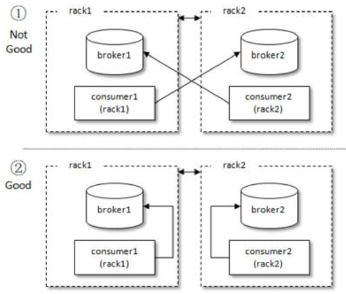

图7-1 机架感知的分区分配

再来说一下Assignment类，它用来表示分配结果信息，类中也有两个属性：partitions和userData，分别表示所分配到的分区集合和用户自定义的数据。PartitionAssignor接口中的onAssignment()方法是在每个消费者收到消费组 leader 分配结果时的回调函数，例如在StickyAssignor 分配策略中就是通过这个方法保存当前的分配方案，以备在下次消费组再均衡（rebalance）时可以提供分配参考依据。

接口中的 name()方法用来提供分配策略的名称，对 Kafka 提供的 3 种分配策略而言，RangeAssignor 对应的 protocol_name 为“range”，RoundRobinAssignor 对应的 protocol_name为“roundrobin”，StickyAssignor 对应的 protocol_name 为“sticky”，所以自定义的分配策略中要注意命名的时候不要与已存在的分配策略发生冲突。这个命名用来标识分配策略的名称，在后面所描述的加入消费组及选举消费组leader的时候会有涉及。

真正的分区分配方案的实现是在assign()方法中，方法中的参数metadata表示集群的元数据信息，而 subscriptions 表示消费组内各个消费者成员的订阅信息，最终方法返回各个消费者的分配信息。

Kafka还提供了一个抽象类org.apache.kafka.clients.consumer.internals.AbstractPartitionAssignor，它可以简化实现 PartitionAssignor 接口的工作，并对 assign()方法进行了详细实现，其中会将Subscription中的userData信息去掉后再进行分配。Kafka提供的3种分配策略都继承自这个抽象类。如果开发人员在自定义分区分配策略时需要使用userData信息来控制分区分配的结果，那么就不能直接继承 AbstractPartitionAssignor 这个抽象类，而需要直接实现 PartitionAssignor接口。

下面笔者参考Kafka的RangeAssignor分配策略来自定义一个随机的分配策略，这里笔者称之为RandomAssignor，具体代码实现如下：


在使用时，消费者客户端需要添加相应的Properties参数，示例如下：


这里只是演示如何自定义实现一个分区分配策略，RandomAssignor 的实现并不是特别理想，并不见得会比Kafka自身提供的RangeAssignor之类的策略要好。

在第3章中陈述了一个事实：按照Kafka默认的消费逻辑设定，一个分区只能被同一个消费组（ConsumerGroup）内的一个消费者消费。但这一设定不是绝对的，我们可以通过自定义分区分配策略使一个分区可以分配给多个消费者消费。

考虑一种极端情况，同一消费组内的任意消费者都可以消费订阅主题的所有分区，从而实现了一种“组内广播（消费）”的功能。针对第3章中图3-4的7个分区和3个消费者的情形，如果采用组内广播的分配策略，那么就会变成图7-2中的这种分配结果。


图7-2 组内广播的分配策略

下面展示了组内广播分配策略的具体代码实现：


注意组内广播的这种实现方式会有一个严重的问题—默认的消费位移的提交会失效。所有的消费者都会提交它自身的消费位移到__consumer_offsets中，后提交的消费位移会覆盖前面提交的消费位移。

假设消费者consumer1提交了分区tp0的消费位移为10，这时消费者consumer2紧接着提交了同一分区 tp0 的消费位移为 12，如果此时消费者 consumer1 由于某些原因重启了，那么consumer1就会从位移12之后重新开始消费，这样consumer1就丢失了部分消息。

再考虑另一种情况，同样消费者consumer1提交了分区tp0的消费位移为10，这时消费者consumer2紧接着提交了同一分区的消费位移为8，如果此时消费者consumer1由于某些原因重启了，那么consumer1就会从位移8之后重新开始消费，这样consumer1就重复消费了消息。很多情形下，重复消费少量消息对于上层业务应用来说可以忍受。但是设想这样一种情况，消费组内的消费者对于分区 tp0 的消费位移都在 100000 之后了，此时又有一个新的消费者consumer3加入进来，消费了部分消息之后提交了tp0的消费位移为9，那么此时原消费组内的任何消费者重启都会从这个消费位移9之后再开始重新消费，这样大量的重复消息会让上层业务应用猝不及防，同样会造成计算资源的浪费。

针对上述这种情况，如果要真正实现组内广播，则需要自己保存每个消费者的消费位移。笔者的实践经验是，可以通过将消费位移保存到本地文件或数据库中等方法来实现组内广播的位移提交。

虽然说可以通过自定义分区分配策略来打破Kafka中“一个分区只能被同一个消费组内的一个消费者消费”的禁忌（参考图7-3中的消费者C0和C1），但想要通过自定义分区分配策略来实现图7-3中的消费者C3和C4共同分享单个分区的消息是不现实的。更加通俗一点来说，图7-3中的消费者C3和C4都处于正常稳定的状态，此时它们想要共同分享分区3中的消息，即C3消费0、1、2这3条消息，而C4消费3、4这2条消息，紧接着C3再消费5、6、7这3条消息，这种分配是无法实现的。不过这种诉求可以配合 KafkaConsumer 中的 seek()方法来实现，实际应用价值不大。


图7-3 不可能的情形

## 7.2 消费者协调器和组协调器

了解了Kafka 中消费者的分区分配策略之后是否会有这样的疑问：如果消费者客户端中配置了两个分配策略，那么以哪个为准呢？如果有多个消费者，彼此所配置的分配策略并不完全相同，那么以哪个为准？多个消费者之间的分区分配是需要协同的，那么这个协同的过程又是怎样的呢？这一切都是交由消费者协调器（ConsumerCoordinator）和组协调器（GroupCoordinator）来完成的，它们之间使用一套组协调协议进行交互。

### 7.2.1 旧版消费者客户端的问题

消费者协调器和组协调器的概念是针对新版的消费者客户端而言的，Kafka 建立之初并没有它们。旧版的消费者客户端是使用ZooKeeper的监听器（Watcher）来实现这些功能的。

每个消费组（\<group>）在ZooKeeper中都维护了一个/consumers/\<group>/ids路径，在此路径下使用临时节点记录隶属于此消费组的消费者的唯一标识（consumerIdString），consumerIdString由消费者启动时创建。消费者的唯一标识由consumer.id+主机名+时间戳+UUID的部分信息构成，其中 consumer.id 是旧版消费者客户端中的配置，相当于新版客户端中的client.id。比如某个消费者的唯一标识为consumerId_localhost-1510734527562-64b377f5，那么其中consumerId为指定的consumer.id，localhost为计算机的主机名，1510734527562代表时间戳，而64b377f5表示UUID的部分信息。

参考图7-4，与/consumers/\<group>/ids同级的还有两个节点：owners和offsets，/consumers/\<group>/owner 路径下记录了分区和消费者的对应关系，/consumers/\<group>/offsets路径下记录了此消费组在分区中对应的消费位移。


图7-4 ZooKeeper中与消费有关的路径节点

每个broker、主题和分区在ZooKeeper中也都对应一个路径：/brokers/ids/\<id>记录了 host、port 及分配在此 broker 上的主题分区列表；/brokers/topics/\<topic>记录了每个分区的 leader 副本、ISR 集合等信息。/brokers/topics/\<topic>/partitions/\<partition>/state记录了当前leader副本、leader_epoch等信息。

每个消费者在启动时都会在/consumers/\<group>/ids 和/brokers/ids 路径上注册一个监听器。当/consumers/\<group>/ids路径下的子节点发生变化时，表示消费组中的消费者发生了变化；当/brokers/ids路径下的子节点发生变化时，表示broker出现了增减。这样通过ZooKeeper所提供的Watcher，每个消费者就可以监听消费组和Kafka集群的状态了。

这种方式下每个消费者对ZooKeeper的相关路径分别进行监听，当触发再均衡操作时，一个消费组下的所有消费者会同时进行再均衡操作，而消费者之间并不知道彼此操作的结果，这样可能导致Kafka工作在一个不正确的状态。与此同时，这种严重依赖于ZooKeeper集群的做法还有两个比较严重的问题。

（1）羊群效应（Herd Effect）：所谓的羊群效应是指ZooKeeper中一个被监听的节点变化，大量的 Watcher 通知被发送到客户端，导致在通知期间的其他操作延迟，也有可能发生类似死锁的情况。

（2）脑裂问题（Split Brain）：消费者进行再均衡操作时每个消费者都与ZooKeeper进行通信以判断消费者或broker变化的情况，由于ZooKeeper本身的特性，可能导致在同一时刻各个消费者获取的状态不一致，这样会导致异常问题发生。

### 7.2.2 再均衡的原理

新版的消费者客户端对此进行了重新设计，将全部消费组分成多个子集，每个消费组的子集在服务端对应一个GroupCoordinator对其进行管理，GroupCoordinator是Kafka服务端中用于管理消费组的组件。而消费者客户端中的ConsumerCoordinator组件负责与GroupCoordinator进行交互。

ConsumerCoordinator与GroupCoordinator之间最重要的职责就是负责执行消费者再均衡的操作，包括前面提及的分区分配的工作也是在再均衡期间完成的。就目前而言，一共有如下几种情形会触发再均衡的操作：

- 有新的消费者加入消费组。
- 有消费者宕机下线。消费者并不一定需要真正下线，例如遇到长时间的 GC、网络延迟导致消费者长时间未向GroupCoordinator发送心跳等情况时，GroupCoordinator会认为消费者已经下线。
- 有消费者主动退出消费组（发送 LeaveGroupRequest 请求）。比如客户端调用了unsubscrible()方法取消对某些主题的订阅。
- 消费组所对应的GroupCoorinator节点发生了变更。
- 消费组内所订阅的任一主题或者主题的分区数量发生变化。

下面就以一个简单的例子来讲解一下再均衡操作的具体内容。当有消费者加入消费组时，消费者、消费组及组协调器之间会经历一下几个阶段。

**第一阶段（FIND_COORDINATOR）**

消费者需要确定它所属的消费组对应的GroupCoordinator所在的broker，并创建与该broker相互通信的网络连接。如果消费者已经保存了与消费组对应的 GroupCoordinator 节点的信息，并且与它之间的网络连接是正常的，那么就可以进入第二阶段。否则，就需要向集群中的某个节点发送FindCoordinatorRequest请求来查找对应的GroupCoordinator，这里的“某个节点”并非是集群中的任意节点，而是负载最小的节点，即2.2.2节中的leastLoadedNode。

如图7-5所示，FindCoordinatorRequest请求体中只有两个域（Field）：coordinator_key和 coordinator_type。coordinator_key 在这里就是消费组的名称，即 groupId，coordinator_type置为0。这个FindCoordinatorRequest请求还会在Kafka事务（参考7.4.3节）中提及，为了便于说明问题，这里我们暂且忽略它。


图7-5 FindCoordinatorRequest的结构

Kafka 在收到 FindCoordinatorRequest 请求之后，会根据 coordinator_key（也就是groupId）查找对应的GroupCoordinator节点，如果找到对应的GroupCoordinator则会返回其相对应的node_id、host和port信息。

具体查找GroupCoordinator的方式是先根据消费组groupId的哈希值计算__consumer_offsets中的分区编号，具体算法如代码清单7-1所示。：

**代码清单7-1 消费组所对应的分区号的计算方式**


其中 groupId.hashCode 就是使用 Java 中 String 类的 hashCode()方法获得的，groupMetadataTopicPartitionCount 为主题__consumer_offsets 的分区个数，这个可以通过broker端参数offsets.topic.num.partitions来配置，默认值为50。

找到对应的__consumer_offsets中的分区之后，再寻找此分区leader副本所在的broker节点，该broker节点即为这个groupId所对应的GroupCoordinator节点。消费者groupId最终的分区分配方案及组内消费者所提交的消费位移信息都会发送给此分区leader副本所在的broker节点，让此broker节点既扮演GroupCoordinator的角色，又扮演保存分区分配方案和组内消费者位移的角色，这样可以省去很多不必要的中间轮转所带来的开销。

**第二阶段（JOIN_GROUP）**

在成功找到消费组所对应的 GroupCoordinator 之后就进入加入消费组的阶段，在此阶段的消费者会向GroupCoordinator发送JoinGroupRequest请求，并处理响应。

如图7-6所示，JoinGroupRequest的结构包含多个域：

- group_id就是消费组的id，通常也表示为groupId。

- session_timout 对应消费端参数 session.timeout.ms，默认值为 10000，即10秒。GroupCoordinator超过session_timeout指定的时间内没有收到心跳报文则认为此消费者已经下线。

- rebalance_timeout 对应消费端参数 max.poll.interval.ms，默认值为300000，即 5 分钟。表示当消费组再平衡的时候，GroupCoordinator 等待各个消费者重新加入的最长等待时间。

- member_id 表示 GroupCoordinator 分配给消费者的 id 标识。消费者第一次发送JoinGroupRequest请求的时候此字段设置为null。

- protocol_type表示消费组实现的协议，对于消费者而言此字段值为“consumer”。


图7-6 JoinGroupRequest的结构

JoinGroupRequest中的group_protocols域为数组类型，其中可以囊括多个分区分配策略，这个主要取决于消费者客户端参数 partition.assignment.strategy 的配置。如果配置了多种策略，那么 JoinGroupRequest 中就会包含多个 protocol_name 和 protocol_metadata。其中protocol_name对应于PartitionAssignor接口中的name()方法，我们在讲述消费者分区分配策略的时候提及过相关内容（参考7.1.4节）。而protocol_metadata和PartitionAssignor接口中的subscription()方法有直接关系，protocol_metadata是一个bytes类型，其实质上还可以更细粒度地划分为version、topics和user_data，如图7-7所示。


图7-7 protocol_metadata的结构

version占2个字节，目前其值固定为0；topics对应PartitionAssignor接口的subscription()方法返回值类型Subscription中的topics，代表一个主题列表；user_data对应Subscription中的userData，可以为空。

如果是原有的消费者重新加入消费组，那么在真正发送JoinGroupRequest 请求之前还要执行一些准备工作：

（1）如果消费端参数enable.auto.commit设置为true（默认值也为true），即开启自动提交位移功能，那么在请求加入消费组之前需要向 GroupCoordinator 提交消费位移。这个过程是阻塞执行的，要么成功提交消费位移，要么超时。

（2）如果消费者添加了自定义的再均衡监听器（ConsumerRebalanceListener），那么此时会调用onPartitionsRevoked()方法在重新加入消费组之前实施自定义的规则逻辑，比如清除一些状态，或者提交消费位移等。

（3）因为是重新加入消费组，之前与GroupCoordinator节点之间的心跳检测也就不需要了，所以在成功地重新加入消费组之前需要禁止心跳检测的运作。

消费者在发送JoinGroupRequest请求之后会阻塞等待Kafka服务端的响应。服务端在收到JoinGroupRequest 请求后会交由 GroupCoordinator 来进行处理。GroupCoordinator 首先会对JoinGroupRequest请求做合法性校验，比如group_id是否为空、当前broker节点是否是请求的消费者组所对应的组协调器、rebalance_timeout的值是否在合理的范围之内。如果消费者是第一次请求加入消费组，那么JoinGroupRequest 请求中的member_id值为null，即没有它自身的唯一标志，此时组协调器负责为此消费者生成一个 member_id。这个生成的算法很简单，具体如以下伪代码所示。


其中clientId为消费者客户端的clientId，对应请求头中的client_id。由此可见消费者的member_id由clientId和UUID用“-”字符拼接而成。

**选举消费组的leader**

GroupCoordinator需要为消费组内的消费者选举出一个消费组的leader，这个选举的算法也很简单，分两种情况分析。如果消费组内还没有 leader，那么第一个加入消费组的消费者即为消费组的 leader。如果某一时刻 leader 消费者由于某些原因退出了消费组，那么会重新选举一个新的leader，这个重新选举leader的过程又更“随意”了，相关代码如下：


解释一下这2行代码：在GroupCoordinator中消费者的信息是以HashMap的形式存储的，其中key为消费者的member_id，而 value是消费者相关的元数据信息。leaderId表示leader消费者的 member_id，它的取值为 HashMap 中的第一个键值对的 key，这种选举的方式基本上和随机无异。总体上来说，消费组的leader选举过程是很随意的。

**选举分区分配策略**

每个消费者都可以设置自己的分区分配策略，对消费组而言需要从各个消费者呈报上来的各个分配策略中选举一个彼此都“信服”的策略来进行整体上的分区分配。这个分区分配的选举并非由leader消费者决定，而是根据消费组内的各个消费者投票来决定的。这里所说的“根据组内的各个消费者投票来决定”不是指 GroupCoordinator 还要再与各个消费者进行进一步交互，而是根据各个消费者呈报的分配策略来实施。最终选举的分配策略基本上可以看作被各个消费者支持的最多的策略，具体的选举过程如下：

（1）收集各个消费者支持的所有分配策略，组成候选集candidates。

（2）每个消费者从候选集candidates中找出第一个自身支持的策略，为这个策略投上一票。

（3）计算候选集中各个策略的选票数，选票数最多的策略即为当前消费组的分配策略。

如果有消费者并不支持选出的分配策略，那么就会报出异常 IllegalArgumentException：Member does not support protocol。需要注意的是，这里所说的“消费者所支持的分配策略”是指 partition.assignment.strategy 参数配置的策略，如果这个参数值只配置了RangeAssignor，那么这个消费者客户端只支持 RangeAssignor 分配策略，而不是消费者客户端代码中实现的3种分配策略及可能的自定义分配策略。

在此之后，Kafka服务端就要发送JoinGroupResponse响应给各个消费者，leader消费者和其他普通消费者收到的响应内容并不相同，首先我们看一下JoinGroupResponse的具体结构，如图7-8所示。

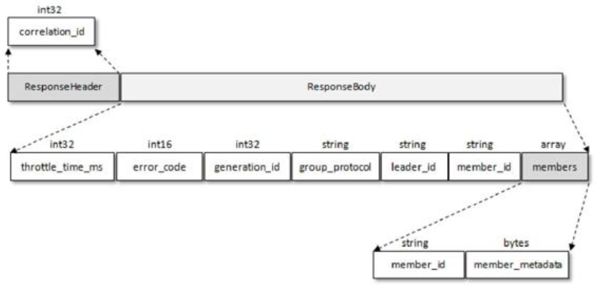

图7-8 JoinGroupResponse的结构

JoinGroupResponse 包含了多个域，其中 generation_id 用来标识当前消费组的年代信息，避免受到过期请求的影响。leader_id表示消费组leader消费者的member_id。

Kafka发送给普通消费者的JoinGroupResponse中的members内容为空，而只有leader消费者的JoinGroupResponse中的members包含有效数据。members为数组类型，其中包含各个成员信息。member_metadata 为消费者的订阅信息，与 JoinGroupRequest 中的protocol_metadata内容相同，不同的是JoinGroupRequest可以包含多个\<protocol_name，protocol_metadata>的键值对，在收到JoinGroupRequest之后，GroupCoordinator已经选举出唯一的分配策略。也就是说，protocol_name已经确定（group_protocol），那么对应的 protocol_metadata 也就确定了，最终各个消费者收到的 JoinGroupResponse 响应中的member_metadata就是这个确定了的protocol_metadata。由此可见，Kafka把分区分配的具体分配交还给客户端，自身并不参与具体的分配细节，这样即使以后分区分配的策略发生了变更，也只需要重启消费端的应用即可，而不需要重启服务端。

本阶段的内容可以简要概括为图7-9和图7-10。


图7-9 客户端发送JoinGroupRequest请求


图7-10 客户端接收JoinGroupResponse响应

**第三阶段（SYNC_GROUP）**

leader 消费者根据在第二阶段中选举出来的分区分配策略来实施具体的分区分配，在此之后需要将分配的方案同步给各个消费者，此时leader消费者并不是直接和其余的普通消费者同步分配方案，而是通过 GroupCoordinator 这个“中间人”来负责转发同步分配方案的。在第三阶段，也就是同步阶段，各个消费者会向GroupCoordinator发送SyncGroupRequest请求来同步分配方案，如图7-11所示。

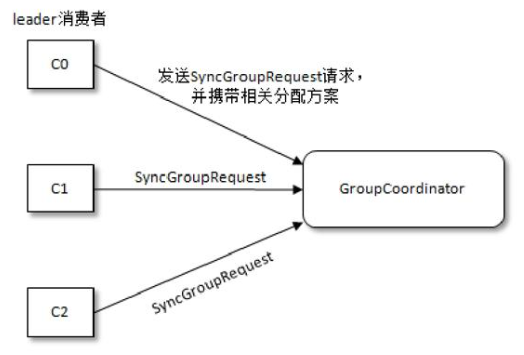

图7-11 客户端发送SyncGroupRequest请求

我们再来看一下 SyncGroupRequest 请求的具体结构，如图 7-12 所示。SyncGroupRequest中的group_id、generation_id和member_id前面都有涉及，这里不再赘述。只有leader消费者发送的 SyncGroupRequest 请求中才包含具体的分区分配方案，这个分配方案保存在group_assignment中，而其余消费者发送的SyncGroupRequest请求中的group_assignment为空。


图7-12 SyncGroupRequest的结构

group_assignment 是一个数组类型，其中包含了各个消费者对应的具体分配方案：member_id表示消费者的唯一标识，而member_assignment是与消费者对应的分配方案，它还可以做更具体的划分，member_assignment的结构如图7-13所示。


图7-13 member_assignment的结构

与JoinGroupRequest请求中的protocol_metadata类似，都可以细分为3个更具体的字段，只不过protocol_metadata存储的是主题的列表信息，而member_assignment存储的是分区信息，member_assignment中可以包含多个主题的多个分区信息。

服务端在收到消费者发送的SyncGroupRequest请求之后会交由GroupCoordinator来负责具体的逻辑处理。GroupCoordinator同样会先对SyncGroupRequest请求做合法性校验，在此之后会将从 leader 消费者发送过来的分配方案提取出来，连同整个消费组的元数据信息一起存入Kafka的__consumer_offsets主题中，最后发送响应给各个消费者以提供给各个消费者各自所属的分配方案。

这里所说的响应就是指SyncGroupRequest请求对应的SyncGroupResponse，SyncGroupResponse的内容很简单，里面包含的就是消费者对应的所属分配方案，SyncGroupResponse 的结构如图7-14所示，具体字段的释义可以从前面的内容中推测出来，这里就不赘述了。


图7-14 SyncGroupResponse的结构

当消费者收到所属的分配方案之后会调用PartitionAssignor中的onAssignment()方法。随后再调用ConsumerRebalanceListener中的OnPartitionAssigned()方法。之后开启心跳任务，消费者定期向服务端的GroupCoordinator发送HeartbeatRequest来确定彼此在线。

**消费组元数据信息**

我们知道消费者客户端提交的消费位移会保存在Kafka的__consumer_offsets主题中，这里也一样，只不过保存的是消费组的元数据信息（GroupMetadata）。具体来说，每个消费组的元数据信息都是一条消息，不过这类消息并不依赖于具体版本的消息格式，因为它只定义了消息中的key和value字段的具体内容，所以消费组元数据信息的保存可以做到与具体的消息格式无关。

图7-15中对应的就是消费组元数据信息的具体内容格式，上面是消息的key，下面是消息的value。可以看到key和value中都包含version字段，用来标识具体的key和value的版本信息，不同的版本对应的内容格式可能并不相同，就目前版本而言，key的version为2，而value的version为1，读者在理解时其实可以忽略这个字段而探究其他具备特定含义的内容。key中除了 version 就是 group 字段，它表示消费组的名称，和 JoinGroupRequest 或SyncGroupRequest请求中的group_id是同一个东西。虽然key中包含了version字段，但确定这条信息所要存储的分区还是根据单独的group字段来计算的，这样就可以保证消费组的元数据信息与消费组对应的GroupCoordinator处于同一个broker节点上，省去了中间轮转的开销。


图7-15 消费组元数据信息

value 中包含的内容有很多，可以参照和JoinGroupRequest 或SyncGroupRequest 请求中的内容来理解，具体各个字段的释义如下。

- protocol_type：消费组实现的协议，这里的值为“consumer”。

- generation：标识当前消费组的年代信息，避免收到过期请求的影响。

- protocol：消费组选取的分区分配策略。

- leader：消费组的leader消费者的名称。

- members：数组类型，其中包含了消费组的各个消费者成员信息，图7-15中右边部分就是消费者成员的具体信息，每个具体字段都比较容易辨别，需要着重说明的是subscription和assignment这两个字段，分别代码消费者的订阅信息和分配信息。

**第四阶段（HEARTBEAT）**

进入这个阶段之后，消费组中的所有消费者就会处于正常工作状态。在正式消费之前，消费者还需要确定拉取消息的起始位置。假设之前已经将最后的消费位移提交到了GroupCoordinator，并且GroupCoordinator将其保存到了Kafka内部的__consumer_offsets主题中，此时消费者可以通过OffsetFetchRequest请求获取上次提交的消费位移并从此处继续消费。

消费者通过向 GroupCoordinator 发送心跳来维持它们与消费组的从属关系，以及它们对分区的所有权关系。只要消费者以正常的时间间隔发送心跳，就被认为是活跃的，说明它还在读取分区中的消息。心跳线程是一个独立的线程，可以在轮询消息的空档发送心跳。如果消费者停止发送心跳的时间足够长，则整个会话就被判定为过期，GroupCoordinator 也会认为这个消费者已经死亡，就会触发一次再均衡行为。消费者的心跳间隔时间由参数heartbeat.interval.ms指定，默认值为3000，即3秒，这个参数必须比session.timeout.ms参数设定的值要小，一般情况下heartbeat.interval.ms的配置值不能超过session.timeout.ms配置值的1/3。这个参数可以调整得更低，以控制正常重新平衡的预期时间。

如果一个消费者发生崩溃，并停止读取消息，那么 GroupCoordinator 会等待一小段时间，确认这个消费者死亡之后才会触发再均衡。在这一小段时间内，死掉的消费者并不会读取分区里的消息。这个一小段时间由session.timeout.ms参数控制，该参数的配置值必须在broker端参数 group.min.session.timeout.ms（默认值为 6000，即 6 秒）和 group.max.session.timeout.ms（默认值为300000，即5分钟）允许的范围内。

还有一个参数 max.poll.interval.ms，它用来指定使用消费者组管理时 poll()方法调用之间的最大延迟，也就是消费者在获取更多消息之前可以空闲的时间量的上限。如果此超时时间期满之前poll() 没有调用，则消费者被视为失败，并且分组将重新平衡，以便将分区重新分配给别的成员。

除了被动退出消费组，还可以使用 LeaveGroupRequest 请求主动退出消费组，比如客户端调用了unsubscrible()方法取消对某些主题的订阅，这个比较简单，这里就不再赘述了。

## 7.3__consumer_offsets剖析

位移提交是使用消费者客户端过程中一个比较“讲究”的操作，3.2.5节也使用了较大的篇幅来介绍它。位移提交的内容最终会保存到Kafka的内部主题\_\_consumer\_offsets中，对于主题\_\_consumer\_offsets的深度掌握也可以让我们更好地理解和使用好位移提交。

一般情况下，当集群中第一次有消费者消费消息时会自动创建主题__consumer_offsets，不过它的副本因子还受offsets.topic.replication.factor参数的约束，这个参数的默认值为3（下载安装的包中此值可能为1），分区数可以通过offsets.topic.num.partitions参数设置，默认为50。客户端提交消费位移是使用 OffsetCommitRequest 请求实现的，OffsetCommitRequest 的结构如图7-16所示。


图7-16 OffsetCommitRequest的结构

如果已经掌握了6.1节和7.2节的内容，那么就很容易理解OffsetCommitRequest的结构。请求体第一层中的group_id、generation_id和member_id在前面的内容中已经介绍过多次了，retention_time 表示当前提交的消费位移所能保留的时长，不过对于消费者而言这个值保持为-1。也就是说，按照 broker 端的配置 offsets.retention.minutes 来确定保留时长。offsets.retention.minutes的默认值为10080，即7天，超过这个时间后消费位移的信息就会被删除（使用墓碑消息和日志压缩策略）。注意这个参数在2.0.0版本之前的默认值为1440，即1天，很多关于消费位移的异常也是由这个参数的值配置不当造成的。有些定时消费的任务在执行完某次消费任务之后保存了消费位移，之后隔了一段时间再次执行消费任务，如果这个间隔时间超过offsets.retention.minutes的配置值，那么原先的位移信息就会丢失，最后只能根据客户端参数 auto.offset.reset 来决定开始消费的位置，遇到这种情况时就需要根据实际情况来调配offsets.retention.minutes参数的值。

OffsetCommitRequest中的其余字段大抵也是按照分区的粒度来划分消费位移的：topic表示主题名称，partition表示分区编号等。注意这里还有一个metadata字段。在3.2.5节中讲到手动位移提交时提到了可以通过Map\<TopicPartition，OffsetAndMetadata> offsets参数来指定要提交的分区位移，相关使用方法可以参考代码清单3-3和代码清单3-4。OffsetAndMetadata中包含2个成员变量（offset和metadata），与此对应的有两个构造方法，详细如下：


代码清单 3-3 和代码清单 3-4 等示例都只用到了第一种构造方法而忽略了 metadata。metadata是自定义的元数据信息，如果不指定这个参数，那么就会被设置为空字符串，注意metadata 的长度不能超过 offset.metadata.max.bytes 参数（broker 端配置，默认值为4096）所配置的大小。

同消费组的元数据信息一样，最终提交的消费位移也会以消息的形式发送至主题__consumer_offsets，与消费位移对应的消息也只定义了 key 和 value 字段的具体内容，它不依赖于具体版本的消息格式，以此做到与具体的消息格式无关。

图7-17中展示了消费位移对应的消息内容格式，上面是消息的key，下面是消息的value。可以看到key和value中都包含了version字段，这个用来标识具体的key和value的版本信息，不同的版本对应的内容格式可能并不相同。就目前版本而言，key和value的version值都为1。key中除了version字段还有group、topic、partition字段，分别表示消费组的groupId、主题名称和分区编号。虽然key中包含了4个字段，但最终确定这条消息所要存储的分区还是根据单独的 group 字段来计算的，这样就可以保证消费位移信息与消费组对应的GroupCoordinator 处于同一个 broker 节点上，省去了中间轮转的开销，这一点与消费组的元数据信息的存储是一样的。

value中包含了5个字段，除version字段外，其余的offset、metadata、commit_timestamp、expire_timestamp字段分别表示消费位移、自定义的元数据信息、位移提交到 Kafka 的时间戳、消费位移被判定为超时的时间戳。其中 offset 和 metadata 与OffsetCommitRequest 请求体中的 offset 和 metadata 对应，而 expire_timestamp 和OffsetCommitRequest 请求体中的 retention_time 也有关联，commit_timestamp 值与offsets.retention.minutes参数值之和即为expire_timestamp（默认情况下）。


图7-17 消费位移对应的内容格式

在处理完消费位移之后，Kafka返回OffsetCommitResponse给客户端，OffsetCommitResponse的结构如图7-18所示。OffsetCommitResponse中各个域的具体含义可以通过前面内容中推断出来，这里就不再赘述了。


图7-18 OffsetCommitResponse的结构

我们可以通过kafka-console-consumer.sh脚本来查看__consumer_offsets中的内容，不过要设定formatter 参数为kafka.coordinator.group.GroupMetadataManager$OffsetsMessageFormatter。假设我们要查看消费组“consumerGroupId”的位移提交信息，首先可以根据代码清单7-1中的计算方式得出分区编号为20，然后查看这个分区中的消息，相关示例如下：


一般情况下，使用OffsetsMessageFormatter打印的格式可以概括为：


这里面几个字段的含义可以参照图7-17来理解。这里需要说明的是，如果某个key（version+group+topic+partition的组合）对应的消费位移过期了，那么对应的value就会被设置为null，也就是墓碑消息（主题__consumer_offsets使用的是日志压缩策略），对应的打印结果也会变成如下的形式：


有时候在查看主题__consumer_offsets中的内容时有可能出现下面这种情况：


这说明对应的消费位移已经过期了。在Kafka中有一个名为“delete-expired-group-metadata”的定时任务来负责清理过期的消费位移，这个定时任务的执行周期由参数 offsets.retention.check.interval.ms控制，默认值为600000，即10分钟。

还有 metadata，一般情况下它的值要么为 null 要么为空字符串，出现这种情况时，OffsetsMessageFormatter会把它展示为“NO_METADATA”，否则就按实际值进行展示。

> 如果有若干消费者消费了某个主题中的消息，并且也提交了相应的消费位移，那么在删除这个主题之后会一并将这些消费位移信息删除。

## 7.4 事务

### 7.4.1 消息传输保障

一般而言，消息中间件的消息传输保障有3个层级，分别如下。

（1）at most once：至多一次。消息可能会丢失，但绝对不会重复传输。

（2）at least once：最少一次。消息绝不会丢失，但可能会重复传输。

（3）exactly once：恰好一次。每条消息肯定会被传输一次且仅传输一次。

Kafka 的消息传输保障机制非常直观。当生产者向 Kafka 发送消息时，一旦消息被成功提交到日志文件，由于多副本机制的存在，这条消息就不会丢失。如果生产者发送消息到 Kafka之后，遇到了网络问题而造成通信中断，那么生产者就无法判断该消息是否已经提交。虽然Kafka无法确定网络故障期间发生了什么，但生产者可以进行多次重试来确保消息已经写入 Kafka，这个重试的过程中有可能会造成消息的重复写入，所以这里 Kafka 提供的消息传输保障为 at least once。

对消费者而言，消费者处理消息和提交消费位移的顺序在很大程度上决定了消费者提供哪一种消息传输保障。如果消费者在拉取完消息之后，应用逻辑先处理消息后提交消费位移，那么在消息处理之后且在位移提交之前消费者宕机了，待它重新上线之后，会从上一次位移提交的位置拉取，这样就出现了重复消费，因为有部分消息已经处理过了只是还没来得及提交消费位移，此时就对应at least once。如果消费者在拉完消息之后，应用逻辑先提交消费位移后进行消息处理，那么在位移提交之后且在消息处理完成之前消费者宕机了，待它重新上线之后，会从已经提交的位移处开始重新消费，但之前尚有部分消息未进行消费，如此就会发生消息丢失，此时就对应at most once。

Kafka从0.11.0.0版本开始引入了幂等和事务这两个特性，以此来实现EOS（exactly once semantics，精确一次处理语义）。

### 7.4.2 幂等

所谓的幂等，简单地说就是对接口的多次调用所产生的结果和调用一次是一致的。生产者在进行重试的时候有可能会重复写入消息，而使用Kafka的幂等性功能之后就可以避免这种情况。

开启幂等性功能的方式很简单，只需要显式地将生产者客户端参数enable.idempotence设置为true即可（这个参数的默认值为false），参考如下：


不过如果要确保幂等性功能正常，还需要确保生产者客户端的 retries、acks、max.in.flight.requests.per.connection这几个参数不被配置错。实际上在使用幂等性功能的时候，用户完全可以不用配置（也不建议配置）这几个参数。

如果用户显式地指定了 retries 参数，那么这个参数的值必须大于 0，否则会报出ConfigException：


如果用户没有显式地指定 retries 参数，那么 KafkaProducer 会将它置为 Integer.MAX_VALUE。同时还需要保证max.in.flight.requests.per.connection参数的值不能大于5（这个参数的值默认为5，在2.2.1节中有相关的介绍），否则也会报出ConfigException：


如果用户还显式地指定了 acks 参数，那么还需要保证这个参数的值为-1（all），如果不为-1（这个参数的值默认为1，2.3节中有相关的介绍），那么也会报出ConfigException：


如果用户没有显式地指定这个参数，那么KafkaProducer会将它置为-1。开启幂等性功能之后，生产者就可以如同未开启幂等时一样发送消息了。

为了实现生产者的幂等性，Kafka为此引入了producer id（以下简称PID）和序列号（sequence number）这两个概念，这两个概念其实在 5.2.5 节中就讲过，分别对应 v2 版的日志格式中RecordBatch的producer id和first seqence这两个字段（参考图5-7）。每个新的生产者实例在初始化的时候都会被分配一个PID，这个PID对用户而言是完全透明的。对于每个PID，消息发送到的每一个分区都有对应的序列号，这些序列号从0开始单调递增。生产者每发送一条消息就会将\<PID，分区>对应的序列号的值加1。

broker端会在内存中为每一对\<PID，分区>维护一个序列号。对于收到的每一条消息，只有当它的序列号的值（SN_new）比broker端中维护的对应的序列号的值（SN_old）大1（即SN_new=SN_old+1）时，broker才会接收它。如果SN_new\<SN_old+1，那么说明消息被重复写入，broker可以直接将其丢弃。如果SN_new>SN_old+1，那么说明中间有数据尚未写入，出现了乱序，暗示可能有消息丢失，对应的生产者会抛出OutOfOrderSequenceException，这个异常是一个严重的异常，后续的诸如 send()、beginTransaction()、commitTransaction()等方法的调用都会抛出IllegalStateException的异常。

引入序列号来实现幂等也只是针对每一对\<PID，分区>而言的，也就是说，Kafka的幂等只能保证单个生产者会话（session）中单分区的幂等。


注意，上面示例中发送了两条相同的消息，不过这仅仅是指消息内容相同，但对Kafka 而言是两条不同的消息，因为会为这两条消息分配不同的序列号。Kafka 并不会保证消息内容的幂等。

### 7.4.3 事务

幂等性并不能跨多个分区运作，而事务[[1\]](https://www.neat-reader.cn/Text/chapter8.xhtml#n5085011A434D4EC89DA0B3660C138E01)可以弥补这个缺陷。事务可以保证对多个分区写入操作的原子性。操作的原子性是指多个操作要么全部成功，要么全部失败，不存在部分成功、部分失败的可能。

对流式应用（Stream Processing Applications）而言，一个典型的应用模式为“consume-transform-produce”。在这种模式下消费和生产并存：应用程序从某个主题中消费消息，然后经过一系列转换后写入另一个主题，消费者可能在提交消费位移的过程中出现问题而导致重复消费，也有可能生产者重复生产消息。Kafka 中的事务可以使应用程序将消费消息、生产消息、提交消费位移当作原子操作来处理，同时成功或失败，即使该生产或消费会跨多个分区。

为了实现事务，应用程序必须提供唯一的 transactionalId，这个 transactionalId 通过客户端参数transactional.id来显式设置，参考如下：


事务要求生产者开启幂等特性，因此通过将transactional.id参数设置为非空从而开启事务特性的同时需要将 enable.idempotence 设置为 true （如果未显式设置，则KafkaProducer默认会将它的值设置为true），如果用户显式地将enable.idempotence设置为false，则会报出ConfigException：


transactionalId与PID一一对应，两者之间所不同的是transactionalId由用户显式设置，而PID是由Kafka内部分配的。另外，为了保证新的生产者启动后具有相同transactionalId的旧生产者能够立即失效，每个生产者通过transactionalId获取PID的同时，还会获取一个单调递增的producer epoch（对应下面要讲述的 KafkaProducer.initTransactions()方法）。如果使用同一个transactionalId开启两个生产者，那么前一个开启的生产者会报出如下的错误：


producer epoch 同 PID 和序列号一样在 5.2.5 节中就讲过了，对应 v2 版的日志格式中RecordBatch的producer epoch字段（参考图5-7）。

从生产者的角度分析，通过事务，Kafka 可以保证跨生产者会话的消息幂等发送，以及跨生产者会话的事务恢复。前者表示具有相同 transactionalId 的新生产者实例被创建且工作的时候，旧的且拥有相同transactionalId的生产者实例将不再工作。后者指当某个生产者实例宕机后，新的生产者实例可以保证任何未完成的旧事务要么被提交（Commit），要么被中止（Abort），如此可以使新的生产者实例从一个正常的状态开始工作。

而从消费者的角度分析，事务能保证的语义相对偏弱。出于以下原因，Kafka 并不能保证已提交的事务中的所有消息都能够被消费：

- 对采用日志压缩策略的主题而言，事务中的某些消息有可能被清理（相同key的消息，后写入的消息会覆盖前面写入的消息）。

- 事务中消息可能分布在同一个分区的多个日志分段（LogSegment）中，当老的日志分段被删除时，对应的消息可能会丢失。

- 消费者可以通过seek()方法访问任意offset的消息，从而可能遗漏事务中的部分消息。

- 消费者在消费时可能没有分配到事务内的所有分区，如此它也就不能读取事务中的所有消息。

KafkaProducer提供了5个与事务相关的方法，详细如下：


initTransactions()方法用来初始化事务，这个方法能够执行的前提是配置了transactionalId，如果没有则会报出IllegalStateException：


beginTransaction()方法用来开启事务；sendOffsetsToTransaction()方法为消费者提供在事务内的位移提交的操作；commitTransaction()方法用来提交事务；abortTransaction()方法用来中止事务，类似于事务回滚。

一个典型的事务消息发送的操作如代码清单7-2所示。

**代码清单7-2 事务消息发送示例**


在消费端有一个参数isolation.level，与事务有着莫大的关联，这个参数的默认值为“read_uncommitted”，意思是说消费端应用可以看到（消费到）未提交的事务，当然对于已提交的事务也是可见的。这个参数还可以设置为“read_committed”，表示消费端应用不可以看到尚未提交的事务内的消息。举个例子，如果生产者开启事务并向某个分区值发送3条消息msg1、msg2和msg3，在执行commitTransaction()或abortTransaction()方法前，设置为“read_committed”的消费端应用是消费不到这些消息的，不过在KafkaConsumer内部会缓存这些消息，直到生产者执行 commitTransaction()方法之后它才能将这些消息推送给消费端应用。反之，如果生产者执行了 abortTransaction()方法，那么 KafkaConsumer 会将这些缓存的消息丢弃而不推送给消费端应用。

日志文件中除了普通的消息，还有一种消息专门用来标志一个事务的结束，它就是控制消息（ControlBatch）。控制消息一共有两种类型：COMMIT和ABORT，分别用来表征事务已经成功提交或已经被成功中止。KafkaConsumer 可以通过这个控制消息来判断对应的事务是被提交了还是被中止了，然后结合参数isolation.level配置的隔离级别来决定是否将相应的消息返回给消费端应用，如图7-19所示。注意ControlBatch对消费端应用不可见，后面还会对它有更加详细的介绍。


图7-19 ControlBatch的作用

本节开头就提及了 consume-transform-produce 这种应用模式，这里还涉及在代码清单 7-2中尚未使用的 sendOffsetsToTransaction()方法。该模式的具体结构如图 7-20 所示。与此对应的应用示例如代码清单7-3所示。

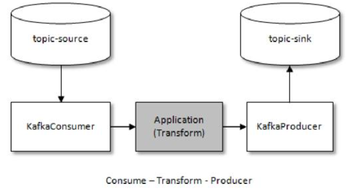

图7-20 consume-transform-produce结构

**代码清单7-3 消费—转换—生产模式示例**


注意：在使用KafkaConsumer的时候要将enable.auto.commit参数设置为false，代码里也不能手动提交消费位移。

为了实现事务的功能，Kafka还引入了事务协调器（TransactionCoordinator）来负责处理事务，这一点可以类比一下组协调器（GroupCoordinator）。每一个生产者都会被指派一个特定的TransactionCoordinator，所有的事务逻辑包括分派 PID 等都是由 TransactionCoordinator 来负责实施的。TransactionCoordinator 会将事务状态持久化到内部主题__transaction_state 中。下面就以最复杂的consume-transform-produce的流程（参考图7-21）为例来分析Kafka事务的实现原理。


图7-21 consume-transform-produce流程

**1.查找TransactionCoordinator**

TransactionCoordinator负责分配PID和管理事务，因此生产者要做的第一件事情就是找出对应的TransactionCoordinator所在的broker节点。与查找GroupCoordinator节点一样，也是通过FindCoordinatorRequest请求来实现的，只不过FindCoordinatorRequest中的coordinator_type就由原来的0变成了1，由此来表示与事务相关联（FindCoordinatorRequest请求的具体结构参考图7-5）。

Kafka 在收到 FindCoorinatorRequest 请求之后，会根据 coordinator_key （也就是transactionalId）查找对应的TransactionCoordinator节点。如果找到，则会返回其相对应的node_id、host和port信息。具体查找TransactionCoordinator的方式是根据transactionalId的哈希值计算主题__transaction_state中的分区编号，具体算法如代码清单7-4所示。

**代码清单7-4 计算分区编号**


其中transactionTopicPartitionCount为主题__transaction_state中的分区个数，这个可以通过broker端参数transaction.state.log.num.partitions来配置，默认值为50。

找到对应的分区之后，再寻找此分区leader副本所在的broker节点，该broker节点即为这个transactionalId对应的TransactionCoordinator节点。细心的读者可以发现，这一整套的逻辑和查找GroupCoordinator的逻辑如出一辙（参考7.2.2节）。

**2.获取PID**

在找到TransactionCoordinator节点之后，就需要为当前生产者分配一个PID了。凡是开启了幂等性功能的生产者都必须执行这个操作，不需要考虑该生产者是否还开启了事务。生产者获取PID的操作是通过InitProducerIdRequest请求来实现的，InitProducerIdRequest请求体结构如图 7-22 所示，其中 transactional_id 表示事务的 transactionalId，transaction_timeout_ms表示TransactionCoordinaor等待事务状态更新的超时时间，通过生产者客户端参数transaction.timeout.ms配置，默认值为60000。


图7-22 InitProducerIdRequest请求体结构

**保存PID**

生产者的InitProducerIdRequest请求会被发送给TransactionCoordinator。注意，如果未开启事务特性而只开启幂等特性，那么 InitProducerIdRequest 请求可以发送给任意的 broker。当TransactionCoordinator第一次收到包含该transactionalId的InitProducerIdRequest请求时，它会把transactionalId和对应的PID以消息（我们习惯性地把这类消息称为“事务日志消息”）的形式保存到主题\_\_transaction_state中，如图7-21步骤2.1所示。这样可以保证\<transaction_Id，PID>的对应关系被持久化，从而保证即使TransactionCoordinator宕机该对应关系也不会丢失。存储到主题\_\_transaction_state中的具体内容格式如图7-23所示。

其 中 transaction_status 包 含 Empty（0）、Ongoing（1）、PrepareCommit（2）、PrepareAbort（3）、CompleteCommit（4）、CompleteAbort（5）、Dead（6）这几种状态。在存入主题__transaction_state之前，事务日志消息同样会根据单独的transactionalId来计算要发送的分区，算法同代码清单7-4一样。


图7-23 主题__transaction_state中的具体内容格式

与InitProducerIdRequest对应的InitProducerIdResponse响应体结构如图7-24所示，除了返回PID，InitProducerIdRequest还会触发执行以下任务：

- 增加该 PID 对应的 producer_epoch。具有相同 PID 但 producer_epoch 小于该producer_epoch的其他生产者新开启的事务将被拒绝。

- 恢复（Commit）或中止（Abort）之前的生产者未完成的事务。


图7-24 InitProducerIdResponse响应体结构

**3.开启事务**

通过KafkaProducer的beginTransaction()方法可以开启一个事务，调用该方法后，生产者本地会标记已经开启了一个新的事务，只有在生产者发送第一条消息之后 TransactionCoordinator才会认为该事务已经开启。

**4.Consume-Transform-Produce**

这个阶段囊括了整个事务的数据处理过程，其中还涉及多种请求。注：如果没有给出具体的请求体或响应体结构，则说明其并不影响读者对内容的理解，笔者为了缩减篇幅而将其省略。

**1)AddPartitionsToTxnRequest**

当生产者给一个新的分区（TopicPartition）发送数据前，它需要先向TransactionCoordinator发送AddPartitionsToTxnRequest请求（AddPartitionsToTxnRequest请求体结构如图7-25所示），这个请求会让 TransactionCoordinator 将\<transactionId，TopicPartition>的对应关系存储在主题__transaction_state中，如图7-21步骤4.1所示。有了这个对照关系之后，我们就可以在后续的步骤中为每个分区设置COMMIT或ABORT标记，如图7-21步骤5.2所示。


图7-25 AddPartitionsToTxnRequest请求体结构

如果该分区是对应事务中的第一个分区，那么此时TransactionCoordinator还会启动对该事务的计时。

**2)ProduceRequest**

这一步骤很容易理解，生产者通过ProduceRequest 请求发送消息（ProducerBatch）到用户自定义主题中，这一点和发送普通消息时相同，如图7-21步骤4.2所示。和普通的消息不同的是，ProducerBatch中会包含实质的PID、producer_epoch和sequence number，可以对照5.2.5节的内容。

**3)AddOffsetsToTxnRequest**

通过KafkaProducer的sendOffsetsToTransaction()方法可以在一个事务批次里处理消息的消费和发送，方法中包含2个参数：Map\<TopicPartition，OffsetAndMetadata> offsets和groupId。这 个 方 法 会 向 TransactionCoordinator 节 点 发 送 AddOffsetsToTxnRequest 请 求（AddOffsetsToTxnRequest请求体结构如图7-26所示），TransactionCoordinator收到这个请求之后会通过groupId来推导出在\_\_consumer_offsets中的分区，之后TransactionCoordinator会将这个分区保存在\_\_transaction_state中，如图7-21步骤4.3所示。


图7-26 AddOffsetsToTxnRequest请求体结构

**4)TxnOffsetCommitRequest**

这个请求也是sendOffsetsToTransaction()方法中的一部分，在处理完AddOffsetsToTxnRequest之后，生产者还会发送 TxnOffsetCommitRequest 请求给 GroupCoordinator，从而将本次事务中包含的消费位移信息offsets存储到主题__consumer_offsets中，如图7-21步骤4.4所示。

**5.提交或者中止事务**

一旦数据被写入成功，我们就可以调用 KafkaProducer 的 commitTransaction()方法或abortTransaction()方法来结束当前的事务。

**1)EndTxnRequest**

无论调用 commitTransaction()方法还是 abortTransaction()方法，生产者都会向TransactionCoordinator发送EndTxnRequest请求（对应的EndTxnRequest请求体结构如图7-27所示），以此来通知它提交（Commit）事务还是中止（Abort）事务。


图7-27 EndTxnRequest请求体结构

TransactionCoordinator在收到EndTxnRequest请求后会执行如下操作：

（1）将PREPARE_COMMIT或PREPARE_ABORT消息写入主题__transaction_state，如图7-21步骤5.1所示。

（2）通过WriteTxnMarkersRequest请求将COMMIT或ABORT信息写入用户所使用的普通主题和__consumer_offsets，如图7-21步骤5.2所示。

（3）将COMPLETE_COMMIT或COMPLETE_ABORT信息写入内部主题__transaction_state，如图7-21步骤5.3所示。

**2)WriteTxnMarkersRequest**

WriteTxnMarkersRequest 请求是由TransactionCoordinator 发向事务中各个分区的leader 节点的，当节点收到这个请求之后，会在相应的分区中写入控制消息（ControlBatch）。控制消息用来标识事务的终结，它和普通的消息一样存储在日志文件中，图 5-7 中提及了控制消息，RecordBatch中attributes字段的第6位用来标识当前消息是否是控制消息。如果是控制消息，那么这一位会置为1，否则会置为0，如图7-28所示。


图7-28 v2版RecordBatch中的attributes属性结构

attributes字段中的第5位用来标识当前消息是否处于事务中，如果是事务中的消息，那么这一位置为1，否则置为0。由于控制消息也处于事务中，所以attributes字段的第5位和第6位都被置为1。ControlBatch中只有一个Record，Record中的timestamp delta字段和offset delta字段的值都为0，而控制消息的key和value的内容如图7-29所示。


图7-29 控制消息的key和value的内容

就目前的Kafka版本而言，key和value内部的version值都为0，key中的type表示控制类型：0 表示 ABORT，1 表示 COMMIT；value 中的 coordinator_epoch 表示TransactionCoordinator的纪元（版本），TransactionCoordinator切换的时候会更新其值。

**3）写入最终的COMPLETE_COMMIT或COMPLETE_ABORT**

TransactionCoordinator将最终的COMPLETE_COMMIT或COMPLETE_ABORT信息写入主题\_\_transaction_state以表明当前事务已经结束，此时可以删除主题\_\_transaction_state中所有关于该事务的消息。由于主题\_\_transaction_state 采用的日志清理策略为日志压缩，所以这里的删除只需将相应的消息设置为墓碑消息即可。

## 7.5 总结

本章内容涉及第3章中未详细说明的分区分配策略，以及消费者协调器和组协调器之间的交互原理。本章还对主题__consumer_offsets和位移提交做了深层次的描述，想必读者对位移提交有了一个更加深刻的认知。本章最后还对 Kafka 中的事务进行了详述，Kafka 的事务可以看作 Kafka 中最难的知识点之一，它和 Kafka 中的控制器有的一拼。如果读者只是想了解 Kafka事务的使用方式、流转方式和实现机理，那么本章中的内容足以满足要求，如果读者想要深挖事务中涉及的各个模块、异常处理等更加细节化的内容，那么建议细致地去阅读Kafka的源码。引入事务之后，还会涉及新的知识点，比如引入事务隔离级别和 LSO（LastStableOffset），这些内容在后面的章节中也会有针对性的说明。


# 第 8 章 可靠性探究

Kafka 中采用了多副本的机制，这是大多数分布式系统中惯用的手法，以此来实现水平扩展、提供容灾能力、提升可用性和可靠性等。我们对此可以引申出一系列的疑问：Kafka 多副本之间如何进行数据同步，尤其是在发生异常时候的处理机制又是什么？多副本间的数据一致性如何解决，基于的一致性协议又是什么？如何确保 Kafka 的可靠性？Kafka 中的可靠性和可用性之间的关系又如何？

本章从副本的角度切入来深挖Kafka中的数据一致性、数据可靠性等问题，主要包括副本剖析、日志同步机制和可靠性分析等内容。

## 8.1 副本剖析

副本（Replica）是分布式系统中常见的概念之一，指的是分布式系统对数据和服务提供的一种冗余方式。在常见的分布式系统中，为了对外提供可用的服务，我们往往会对数据和服务进行副本处理。数据副本是指在不同的节点上持久化同一份数据，当某一个节点上存储的数据丢失时，可以从副本上读取该数据，这是解决分布式系统数据丢失问题最有效的手段。另一类副本是服务副本，指多个节点提供同样的服务，每个节点都有能力接收来自外部的请求并进行相应的处理。

组成分布式系统的所有计算机都有可能发生任何形式的故障。一个被大量工程实践所检验过的“黄金定理”：任何在设计阶段考虑到的异常情况，一定会在系统实际运行中发生，并且在系统实际运行过程中还会遇到很多在设计时未能考虑到的异常故障。所以，除非需求指标允许，否则在系统设计时不能放过任何异常情况。

Kafka从0.8版本开始为分区引入了多副本机制，通过增加副本数量来提升数据容灾能力。同时，Kafka通过多副本机制实现故障自动转移，在Kafka集群中某个broker节点失效的情况下仍然保证服务可用。在 1.1 节中我们已经简要介绍过副本的概念，并且同时介绍了与副本相关的AR、ISR、HW和LEO的概念，这里简要地复习一下相关的概念：

- 副本是相对于分区而言的，即副本是特定分区的副本。

- 一个分区中包含一个或多个副本，其中一个为leader副本，其余为follower副本，各个副本位于不同的broker节点中。只有leader副本对外提供服务，follower副本只负责数据同步。

- 分区中的所有副本统称为 AR，而ISR 是指与leader 副本保持同步状态的副本集合，当然leader副本本身也是这个集合中的一员。

- LEO标识每个分区中最后一条消息的下一个位置，分区的每个副本都有自己的LEO，ISR中最小的LEO即为HW，俗称高水位，消费者只能拉取到HW之前的消息。

从生产者发出的一条消息首先会被写入分区的leader副本，不过还需要等待ISR集合中的所有 follower 副本都同步完之后才能被认为已经提交，之后才会更新分区的 HW，进而消费者可以消费到这条消息。

### 8.1.1 失效副本

正常情况下，分区的所有副本都处于ISR集合中，但是难免会有异常情况发生，从而某些副本被剥离出ISR集合中。在ISR集合之外，也就是处于同步失效或功能失效（比如副本处于非存活状态）的副本统称为失效副本，失效副本对应的分区也就称为同步失效分区，即under-replicated分区。

正常情况下，我们通过kafka-topics.sh脚本的under-replicated-partitions参数来显示主题中包含失效副本的分区时结果会返回空。比如我们来查看一下主题topic-partitions的相关信息（主题topic-partitions的信息可以参考4.3.1节的相关内容）：


读者可以自行验证一下，上面的示例中返回为空。紧接着我们将集群中的brokerId为2的节点关闭，再来执行同样的命令，结果显示如下：


可以看到主题 topic-partitions 中的三个分区都为 under-replicated 分区，因为它们都有副本处于下线状态，即处于功能失效状态。

前面提及失效副本不仅是指处于功能失效状态的副本，处于同步失效状态的副本也可以看作失效副本。怎么判定一个分区是否有副本处于同步失效的状态呢？Kafka从0.9.x版本开始就通过唯一的broker端参数replica.lag.time.max.ms来抉择，当ISR集合中的一个follower副本滞后leader副本的时间超过此参数指定的值时则判定为同步失败，需要将此follower副本剔除出ISR集合，具体可以参考图8-1。replica.lag.time.max.ms参数的默认值为10000。


图8-1 失效副本的判定

具体的实现原理也很容易理解，当follower副本将leader副本LEO（LogEndOffset）之前的日志全部同步时，则认为该 follower 副本已经追赶上 leader 副本，此时更新该副本的lastCaughtUpTimeMs 标识。Kafka 的副本管理器会启动一个副本过期检测的定时任务，而这个定时任务会定时检查当前时间与副本的 lastCaughtUpTimeMs 差值是否大于参数replica.lag.time.max.ms 指定的值。千万不要错误地认为 follower 副本只要拉取 leader副本的数据就会更新 lastCaughtUpTimeMs。试想一下，当 leader 副本中消息的流入速度大于follower 副本中拉取的速度时，就算 follower 副本一直不断地拉取 leader 副本的消息也不能与leader副本同步。如果还将此follower副本置于ISR集合中，那么当leader副本下线而选取此follower副本为新的leader副本时就会造成消息的严重丢失。

Kafka源码注释中说明了一般有两种情况会导致副本失效：

- follower副本进程卡住，在一段时间内根本没有向leader副本发起同步请求，比如频繁的Full GC。

- follower副本进程同步过慢，在一段时间内都无法追赶上leader副本，比如I/O开销过大。

在这里再补充一点，如果通过工具增加了副本因子（参考4.3.4节），那么新增加的副本在赶上leader副本之前也都是处于失效状态的。如果一个follower副本由于某些原因（比如宕机）而下线，之后又上线，在追赶上leader副本之前也处于失效状态。

在0.9.x版本之前，Kafka中还有另一个参数replica.lag.max.messages（默认值为4000），它也是用来判定失效副本的，当一个 follower 副本滞后 leader 副本的消息数超过replica.lag.max.messages 的大小时，则判定它处于同步失效的状态。它与replica.lag.time.max.ms参数判定出的失效副本取并集组成一个失效副本的集合，从而进一步剥离出分区的ISR集合。

不过这个replica.lag.max.messages参数很难给定一个合适的值，若设置得太大，则这个参数本身就没有太多意义，若设置得太小则会让follower副本反复处于同步、未同步、同步的死循环中，进而又造成ISR集合的频繁伸缩。而且这个参数是broker级别的，也就是说，对broker中的所有主题都生效。以默认的值4000为例，对于消息流入速度很低的主题（比如TPS为10），这个参数并无用武之地；而对于消息流入速度很高的主题（比如TPS为20000），这个参数的取值又会引入ISR的频繁变动。所以从0.9.x版本开始，Kafka就彻底移除了这一参数，相关的资料还可以参考KIP16[[1\]](https://www.neat-reader.cn/Text/chapter9.xhtml#n7A7F012B5080425EB6CDC155AC037418)。

具有失效副本的分区可以从侧面反映出Kafka集群的很多问题，毫不夸张地说：如果只用一个指标来衡量 Kafka，那么同步失效分区（具有失效副本的分区）的个数必然是首选。有关同步失效分区的更多内容可以参考10.3节。

### 8.1.2 ISR的伸缩

Kafka 在启动的时候会开启两个与 ISR 相关的定时任务，名称分别为“isr-expiration”和“isr-change-propagation”。isr-expiration任务会周期性地检测每个分区是否需要缩减其ISR集合。这个周期和replica.lag.time.max.ms参数有关，大小是这个参数值的一半，默认值为5000ms。当检测到ISR集合中有失效副本时，就会收缩ISR集合。如果某个分区的ISR集合发生变更，则会将变更后的数据记录到 ZooKeeper 对应的/brokers/topics/\<topic>/partition/\<parititon>/state节点中。节点中的数据示例如下：


其中controller_epoch表示当前Kafka控制器的epoch，leader表示当前分区的leader副本所在的broker的id编号，version表示版本号（当前版本固定为1），leader_epoch表示当前分区的leader纪元，isr表示变更后的ISR列表。

除此之外，当 ISR 集合发生变更时还会将变更后的记录缓存到 isrChangeSet 中，isr-change-propagation任务会周期性（固定值为 2500ms）地检查 isrChangeSet，如果发现isrChangeSet中有ISR集合的变更记录，那么它会在ZooKeeper的/isr_change_notification路径下创建一个以 isr_change_开头的持久顺序节点（比如/isr_change_notification/isr_change_0000000000），并将isrChangeSet中的信息保存到这个节点中。Kafka控制器为/isr_change_notification添加了一个Watcher，当这个节点中有子节点发生变化时会触发Watcher的动作，以此通知控制器更新相关元数据信息并向它管理的broker节点发送更新元数据的请求，最后删除/isr_change_notification路径下已经处理过的节点。频繁地触发Watcher会影响Kafka控制器、ZooKeeper甚至其他broker节点的性能。为了避免这种情况，Kafka添加了限定条件，当检测到分区的ISR集合发生变化时，还需要检查以下两个条件：

（1）上一次ISR集合发生变化距离现在已经超过5s。

（2）上一次写入ZooKeeper的时间距离现在已经超过60s。

满足以上两个条件之一才可以将ISR集合的变化写入目标节点。

有缩减对应就会有扩充，那么Kafka又是何时扩充ISR的呢？

随着follower副本不断与leader副本进行消息同步，follower副本的LEO也会逐渐后移，并最终追赶上leader副本，此时该follower副本就有资格进入ISR集合。追赶上leader副本的判定准则是此副本的LEO是否不小于leader副本的HW，注意这里并不是和leader副本的LEO相比。ISR扩充之后同样会更新ZooKeeper中的/brokers/topics/\<topic>/partition/\<parititon>/state节点和isrChangeSet，之后的步骤就和ISR收缩时的相同。

当ISR集合发生增减时，或者ISR集合中任一副本的LEO发生变化时，都可能会影响整个分区的HW。

如图8-2所示，leader副本的LEO为9，follower1副本的LEO为7，而follower2副本的LEO为6，如果判定这3个副本都处于ISR集合中，那么这个分区的HW为6；如果follower3已经被判定为失效副本被剥离出ISR集合，那么此时分区的HW为leader副本和follower1副本中LEO的最小值，即为7。


图8-2 HW的变更

**冷门知识：**很多读者对Kafka中的HW的概念并不陌生，但是却并不知道还有一个LW的概念。LW是Low Watermark的缩写，俗称“低水位”，代表AR集合中最小的logStartOffset值。副本的拉取请求（FetchRequest，它有可能触发新建日志分段而旧的被清理，进而导致logStartOffset的增加）和删除消息请求（DeleteRecordRequest）都有可能促使LW的增长。

### 8.1.3 LEO与HW

对于副本而言，还有两个概念：本地副本（Local Replica）和远程副本（Remote Replica），本地副本是指对应的Log分配在当前的broker节点上，远程副本是指对应的Log分配在其他的broker节点上。在Kafka中，同一个分区的信息会存在多个broker节点上，并被其上的副本管理器所管理，这样在逻辑层面每个broker节点上的分区就有了多个副本，但是只有本地副本才有对应的日志。如图8-3所示，某个分区有3个副本分别位于broker0、broker1和broker2节点中，其中带阴影的方框表示本地副本。假设broker0上的副本1为当前分区的leader副本，那么副本2和副本3就是follower副本，整个消息追加的过程可以概括如下：

（1）生产者客户端发送消息至leader副本（副本1）中。

（2）消息被追加到leader副本的本地日志，并且会更新日志的偏移量。

（3）follower副本（副本2和副本3）向leader副本请求同步数据。

（4）leader副本所在的服务器读取本地日志，并更新对应拉取的follower副本的信息。

（5）leader副本所在的服务器将拉取结果返回给follower副本。

（6）follower副本收到leader副本返回的拉取结果，将消息追加到本地日志中，并更新日志的偏移量信息。


图8-3 本地副本与远程副本

了解了这些内容后，我们再来分析在这个过程中各个副本LEO和HW的变化情况。下面的示例采用同图8-3中相同的环境背景，如图8-4所示，生产者一直在往leader副本（带阴影的方框）中写入消息。某一时刻，leader副本的LEO增加至5，并且所有副本的HW还都为0。

之后follower副本（不带阴影的方框）向leader副本拉取消息，在拉取的请求中会带有自身的LEO信息，这个LEO信息对应的是FetchRequest请求中的fetch_offset。leader副本返回给follower副本相应的消息，并且还带有自身的HW信息，如图8-5所示，这个HW信息对应的是FetchResponse中的high_watermark。


图8-4 情形1（初始状态）


图8-5 情形2

此时两个follower副本各自拉取到了消息，并更新各自的LEO为3和4。与此同时，follower副本还会更新自己的HW，更新HW的算法是比较当前LEO和leader副本中传送过来的HW的值，取较小值作为自己的HW值。当前两个follower副本的HW都等于0（min（0，0）=0）。

接下来follower副本再次请求拉取leader副本中的消息，如图8-6所示。

此时leader副本收到来自follower副本的FetchRequest请求，其中带有LEO的相关信息，选取其中的最小值作为新的HW，即min（15，3，4）=3。然后连同消息和HW一起返回FetchResponse给follower副本，如图8-7所示。注意leader副本的HW是一个很重要的东西，因为它直接影响了分区数据对消费者的可见性。


图8-6 情形3


图8-7 情形4

两个follower副本在收到新的消息之后更新LEO并且更新自己的HW为3（min（LEO，3）=3）。

在一个分区中，leader副本所在的节点会记录所有副本的LEO，而follower副本所在的节点只会记录自身的LEO，而不会记录其他副本的LEO。对HW而言，各个副本所在的节点都只记录它自身的HW。变更图8-3，使其带有相应的LEO和HW信息，如图8-8所示。leader副本中带有其他 follower 副本的 LEO，那么它们是什么时候更新的呢？leader 副本收到 follower副本的FetchRequest请求之后，它首先会从自己的日志文件中读取数据，然后在返回给follower副本数据前先更新follower副本的LEO。


图8-8 LEO和HW在各个副本中的维护情况

在图 5-2 中，Kafka 的根目录下有 cleaner-offset-checkpoint、log-start-offset-checkpoint、recovery-point-offset-checkpoint和replication-offset-checkpoint四个检查点文件，除了在5.4.2节中提及了cleaner-offset-checkpoint，其余章节都没有做过多的说明。

recovery-point-offset-checkpoint 和replication-offset-checkpoint 这两个文件分别对应了 LEO和 HW。Kafka 中会有一个定时任务负责将所有分区的 LEO 刷写到恢复点文件 recovery-point-offset-checkpoint 中，定时周期由 broker 端参数 log.flush.offset.checkpoint.interval.ms来配置，默认值为60000。还有一个定时任务负责将所有分区的HW刷写到复制点文件replication-offset-checkpoint中，定时周期由broker端参数replica.high.watermark.checkpoint.interval.ms来配置，默认值为5000。

log-start-offset-checkpoint文件对应logStartOffset（注意不能缩写为LSO，因为在Kafka中LSO是LastStableOffset的缩写），这个在5.4.1节中就讲过，在FetchRequest和FetchResponse中也有它的身影，它用来标识日志的起始偏移量。各个副本在变动 LEO 和 HW 的过程中，logStartOffset 也有可能随之而动。Kafka 也有一个定时任务来负责将所有分区的 logStartOffset书写到起始点文件log-start-offset-checkpoint中，定时周期由broker端参数log.flush.start.offset.checkpoint.interval.ms来配置，默认值为60000。

### 8.1.4 Leader Epoch的介入

8.1.3节的内容所陈述的都是在正常情况下的leader副本与follower副本之间的同步过程，如果leader副本发生切换，那么同步过程又该如何处理呢？在0.11.0.0版本之前，Kafka使用的是基于HW的同步机制，但这样有可能出现数据丢失或leader副本和follower副本数据不一致的问题。[[2\]](https://www.neat-reader.cn/Text/chapter9.xhtml#nDFF839DA32344D8F8BEC755F26B52989)

首先我们来看一下数据丢失的问题，如图8-9所示，Replica B是当前的leader副本（用L标记），Replica A是follower副本。参照8.1.3节中的图8-4至图8-7的过程来进行分析：在某一时刻，B中有2条消息m1和m2，A从B中同步了这两条消息，此时A和B的LEO都为2，同时HW都为1；之后A再向B中发送请求以拉取消息，FetchRequest请求中带上了A的LEO信息，B在收到请求之后更新了自己的HW为2；B中虽然没有更多的消息，但还是在延时一段时间之后（参考6.3节中的延时拉取）返回FetchResponse，并在其中包含了HW信息；最后A根据FetchResponse中的HW信息更新自己的HW为2。


图8-9 数据丢失场景（part 1）

可以看到整个过程中两者之间的HW同步有一个间隙，在A写入消息m2之后（LEO更新为2）需要再一轮的FetchRequest/FetchResponse才能更新自身的HW为2。如图8-10所示，如果在这个时候A宕机了，那么在A重启之后会根据之前HW位置（这个值会存入本地的复制点文件replication-offset-checkpoint）进行日志截断，这样便会将m2这条消息删除，此时A只剩下m1这一条消息，之后A再向B发送FetchRequest请求拉取消息。


图8-10 数据丢失场景（part 2）

此时若B 再宕机，那么 A 就会被选举为新的leader，如图8-11 所示。B 恢复之后会成为follower，由于follower副本HW不能比leader副本的HW高，所以还会做一次日志截断，以此将HW调整为1。这样一来m2这条消息就丢失了（就算B不能恢复，这条消息也同样丢失）。


图8-11 数据丢失场景（part 3）

对于这种情况，也有一些解决方法，比如等待所有follower副本都更新完自身的HW之后再更新leader副本的HW，这样会增加多一轮的FetchRequest/FetchResponse延迟，自然不够妥当。还有一种方法就是follower副本恢复之后，在收到leader副本的FetchResponse前不要截断follower副本（follower副本恢复之后会做两件事情：截断自身和向leader发送FetchRequest请求），不过这样也避免不了数据不一致的问题。

如图8-12所示，当前leader副本为A，follower副本为B，A中有2条消息m1和m2，并且HW和LEO都为2，B中有1条消息m1，并且HW和LEO都为1。假设A和B同时“挂掉”，然后B第一个恢复过来并成为leader，如图8-13所示。


图8-12 数据不一致场景（part 1）


图8-13 数据不一致场景（part 2）

之后B写入消息m3，并将LEO和HW更新至2（假设所有场景中的min.insync.replicas参数配置为1）。此时A也恢复过来了，根据前面数据丢失场景中的介绍可知它会被赋予follower的角色，并且需要根据HW截断日志及发送FetchRequest至B，不过此时A的HW正好也为2，那么就可以不做任何调整了，如图8-14所示。


图8-14 数据不一致场景（part 3）

如此一来A中保留了m2而B中没有，B中新增了m3而A也同步不到，这样A和B就出现了数据不一致的情形。

为了解决上述两种问题，Kafka从0.11.0.0开始引入了leader epoch的概念，在需要截断数据的时候使用leader epoch作为参考依据而不是原本的HW。leader epoch代表leader的纪元信息（epoch），初始值为0。每当leader变更一次，leader epoch的值就会加1，相当于为leader增设了一个版本号。与此同时，每个副本中还会增设一个矢量\<LeaderEpoch=>StartOffset>，其中StartOffset表示当前LeaderEpoch下写入的第一条消息的偏移量。每个副本的Log下都有一个leader-epoch-checkpoint文件，在发生leader epoch变更时，会将对应的矢量对追加到这个文件中，其实这个文件在图5-2中已有所呈现。5.2.5节中讲述v2版本的消息格式时就提到了消息集中的partition leader epoch字段，而这个字段正对应这里讲述的leader epoch。

下面我们再来看一下引入 leader epoch 之后如何应付前面所说的数据丢失和数据不一致的场景。首先讲述应对数据丢失的问题，如图8-15所示，这里只比图8-9中多了LE（LeaderEpoch的缩写，当前A和B中的LE都为0）。


图8-15 应对数据丢失（part 1）

同样 A 发生重启，之后 A 不是先忙着截断日志而是先发送 OffsetsForLeaderEpochRequest请求给 B（OffsetsForLeaderEpochRequest 请求体结构如图 8-16 所示，其中包含 A 当前的LeaderEpoch值），B作为目前的leader在收到请求之后会返回当前的LEO（LogEndOffset，注意图中LE0和LEO的不同），与请求对应的响应为OffsetsForLeaderEpochResponse，对应的响应体结构可以参考图8-17，整个过程可以参考图8-18。


图8-16 OffsetsForLeaderEpochRequest请求体结构

如果A中的LeaderEpoch（假设为LE_A）和B中的不相同，*<u>那么B此时会查找LeaderEpoch为 LE_A+1 对应的 StartOffset 并返回给 A</u>*，也就是 LE_A 对应的 LEO，所以我们可以将OffsetsForLeaderEpochRequest的请求看作用来查找follower副本当前LeaderEpoch的LEO。

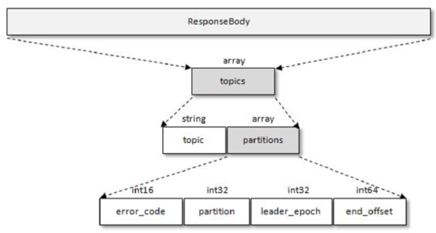

图8-17 OffsetsForLeaderEpochResponse响应体结构


图8-18 应对数据丢失（part 2）

如图8-18所示，A在收到2之后发现和目前的LEO相同，也就不需要截断日志了。之后同图8-11所示的一样，B发生了宕机，A成为新的leader，那么对应的LE=0也变成了LE=1，对应的消息m2此时就得到了保留，这是原本图8-11中所不能的，如图8-19所示。之后不管B有没有恢复，后续的消息都可以以LE1为LeaderEpoch陆续追加到A中。


图8-19 应对数据丢失（part 3）

下面我们再来看一下leader epoch如何应对数据不一致的场景。如图8-20所示，当前A为leader，B为follower，A中有2条消息m1和m2，而B中有1条消息m1。假设A和B同时“挂掉”，然后B第一个恢复过来并成为新的leader。


图8-20 应对数据不一致（part 1）

之后B写入消息m3，并将LEO和HW更新至2，如图8-21所示。注意此时的LeaderEpoch已经从LE0增至LE1了。


图8-21 应对数据不一致（part 2）

紧接着A也恢复过来成为follower并向B发送OffsetsForLeaderEpochRequest请求，此时A的LeaderEpoch为LE0。B根据LE0查询到对应的offset为1并返回给A，A就截断日志并删除了消息m2，如图8-22所示。之后A发送FetchRequest至B请求来同步数据，最终A和B中都有两条消息m1和m3，HW和LEO都为2，并且LeaderEpoch都为LE1，如此便解决了数据不一致的问题。


图8-22 应对数据不一致（part 3）

### 8.1.5 为什么不支持读写分离

在Kafka中，生产者写入消息、消费者读取消息的操作都是与leader副本进行交互的，从而实现的是一种主写主读的生产消费模型。数据库、Redis等都具备主写主读的功能，与此同时还支持主写从读的功能，主写从读也就是读写分离，为了与主写主读对应，这里就以主写从读来称呼。Kafka并不支持主写从读，这是为什么呢？

从代码层面上来说，虽然增加了代码复杂度，但在Kafka中这种功能完全可以支持。对于这个问题，我们可以从“收益点”这个角度来做具体分析。主写从读可以让从节点去分担主节点的负载压力，预防主节点负载过重而从节点却空闲的情况发生。但是主写从读也有2个很明显的缺点：

（1）数据一致性问题。数据从主节点转到从节点必然会有一个延时的时间窗口，这个时间窗口会导致主从节点之间的数据不一致。某一时刻，在主节点和从节点中A数据的值都为X，之后将主节点中A的值修改为Y，那么在这个变更通知到从节点之前，应用读取从节点中的A数据的值并不为最新的Y，由此便产生了数据不一致的问题。

（2）延时问题。类似Redis这种组件，数据从写入主节点到同步至从节点中的过程需要经历网络→主节点内存→网络→从节点内存这几个阶段，整个过程会耗费一定的时间。而在Kafka中，主从同步会比 Redis 更加耗时，它需要经历网络→主节点内存→主节点磁盘→网络→从节点内存→从节点磁盘这几个阶段。对延时敏感的应用而言，主写从读的功能并不太适用。

现实情况下，很多应用既可以忍受一定程度上的延时，也可以忍受一段时间内的数据不一致的情况，那么对于这种情况，Kafka是否有必要支持主写从读的功能呢？

主读从写可以均摊一定的负载却不能做到完全的负载均衡，比如对于数据写压力很大而读压力很小的情况，从节点只能分摊很少的负载压力，而绝大多数压力还是在主节点上。而在Kafka中却可以达到很大程度上的负载均衡，而且这种均衡是在主写主读的架构上实现的。我们来看一下Kafka的生产消费模型，如图8-23所示。


图8-23 Kafka的生产消费模型

如图8-23所示，在Kafka集群中有3个分区，每个分区有3个副本，正好均匀地分布在3个broker上，灰色阴影的代表leader副本，非灰色阴影的代表follower副本，虚线表示follower副本从leader副本上拉取消息。当生产者写入消息的时候都写入leader副本，对于图8-23中的情形，每个broker都有消息从生产者流入；当消费者读取消息的时候也是从leader副本中读取的，对于图8-23中的情形，每个broker都有消息流出到消费者。

我们很明显地可以看出，每个broker上的读写负载都是一样的，这就说明Kafka可以通过主写主读实现主写从读实现不了的负载均衡。图8-23展示是一种理想的部署情况，有以下几种情况（包含但不仅限于）会造成一定程度上的负载不均衡：

（1）broker端的分区分配不均。当创建主题的时候可能会出现某些broker分配到的分区数多而其他broker分配到的分区数少，那么自然而然地分配到的leader副本也就不均。

（2）生产者写入消息不均。生产者可能只对某些broker中的leader副本进行大量的写入操作，而对其他broker中的leader副本不闻不问。

（3）消费者消费消息不均。消费者可能只对某些broker中的leader副本进行大量的拉取操作，而对其他broker中的leader副本不闻不问。

（4）leader副本的切换不均。在实际应用中可能会由于broker宕机而造成主从副本的切换，或者分区副本的重分配等，这些动作都有可能造成各个broker中leader副本的分配不均。

对此，我们可以做一些防范措施。针对第一种情况，在主题创建的时候尽可能使分区分配得均衡，好在Kafka 中相应的分配算法也是在极力地追求这一目标，如果是开发人员自定义的分配，则需要注意这方面的内容。*<u>对于第二和第三种情况，主写从读也无法解决</u>*。对于第四种情况，Kafka 提供了优先副本的选举来达到 leader 副本的均衡，与此同时，也可以配合相应的监控、告警和运维平台来实现均衡的优化。

在实际应用中，配合监控、告警、运维相结合的生态平台，在绝大多数情况下Kafka都能做到很大程度上的负载均衡。总的来说，Kafka 只支持主写主读有几个优点：可以简化代码的实现逻辑，减少出错的可能；将负载粒度细化均摊，与主写从读相比，不仅负载效能更好，而且对用户可控；没有延时的影响；在副本稳定的情况下，不会出现数据不一致的情况。为此，Kafka 又何必再去实现对它而言毫无收益的主写从读的功能呢？这一切都得益于 Kafka 优秀的架构设计，从某种意义上来说，主写从读是由于设计上的缺陷而形成的权宜之计。

## 8.2 日志同步机制

在分布式系统中，日志同步机制既要保证数据的一致性，也要保证数据的顺序性。虽然有许多方式可以实现这些功能，但最简单高效的方式还是从集群中选出一个leader来负责处理数据写入的顺序性。只要leader还处于存活状态，那么follower只需按照leader中的写入顺序来进行同步即可。

通常情况下，只要leader不宕机我们就不需要关心follower的同步问题。不过当leader宕机时，我们就要从follower中选举出一个新的leader。follower的同步状态可能落后leader很多，甚至还可能处于宕机状态，所以必须确保选择具有最新日志消息的follower作为新的leader。日志同步机制的一个基本原则就是：如果告知客户端已经成功提交了某条消息，那么即使 leader宕机，也要保证新选举出来的leader中能够包含这条消息。这里就有一个需要权衡（tradeoff）的地方，如果leader在消息被提交前需要等待更多的follower确认，那么在它宕机之后就可以有更多的follower替代它，不过这也会造成性能的下降。

对于这种tradeoff，一种常见的做法是“少数服从多数”，它可以用来负责提交决策和选举决策。虽然Kafka不采用这种方式，但可以拿来探讨和理解tradeoff的艺术。在这种方式下，如果我们有2f+1个副本，那么在提交之前必须保证有f+1个副本同步完消息。同时为了保证能正确选举出新的leader，至少要保证有f+1个副本节点完成日志同步并从同步完成的副本中选举出新的leader节点。并且在不超过f个副本节点失败的情况下，新的leader需要保证不会丢失已经提交过的全部消息。这样在任意组合的 f+1 个副本中，理论上可以确保至少有一个副本能够包含已提交的全部消息，这个副本的日志拥有最全的消息，因此会有资格被选举为新的 leader来对外提供服务。

“少数服从多数”的方式有一个很大的优势，系统的延迟取决于最快的几个节点，比如副本数为3，那么延迟就取决于最快的那个follower而不是最慢的那个（除了leader，只需要另一个follower确认即可）。不过它也有一些劣势，为了保证leader选举的正常进行，它所能容忍的失败follower数比较少，如果要容忍1个follower失败，那么至少要有3个副本，如果要容忍2个follower失败，必须要有5个副本。也就是说，在生产环境下为了保证较高的容错率，必须要有大量的副本，而大量的副本又会在大数据量下导致性能的急剧下降。这也就是“少数服从多数”的这种Quorum模型常被用作共享集群配置（比如ZooKeeper），而很少用于主流的数据存储中的原因。

与“少数服从多数”相关的一致性协议有很多，比如Zab、Raft和Viewstamped Replication等。而Kafka使用的更像是微软的PacificA算法。

在Kafka中动态维护着一个ISR集合，处于ISR集合内的节点保持与leader相同的高水位（HW），只有位列其中的副本（unclean.leader.election.enable配置为false）才有资格被选为新的 leader。写入消息时只有等到所有 ISR 集合中的副本都确认收到之后才能被认为已经提交。位于 ISR 中的任何副本节点都有资格成为 leader，选举过程简单（详细内容可以参考6.4.3节）、开销低，这也是Kafka选用此模型的重要因素。Kafka中包含大量的分区，leader副本的均衡保障了整体负载的均衡，所以这一因素也极大地影响Kafka的性能指标。

在采用ISR模型和（f+1）个副本数的配置下，一个Kafka分区能够容忍最大f个节点失败，相比于“少数服从多数”的方式所需的节点数大幅减少。实际上，为了能够容忍f个节点失败，“少数服从多数”的方式和ISR的方式都需要相同数量副本的确认信息才能提交消息。比如，为了容忍1个节点失败，“少数服从多数”需要3个副本和1个follower的确认信息，采用ISR的方式需要2个副本和1个follower的确认信息。在需要相同确认信息数的情况下，采用ISR的方式所需要的副本总数变少，复制带来的集群开销也就更低，“少数服从多数”的优势在于它可以绕开最慢副本的确认信息，降低提交的延迟，而对Kafka而言，这种能力可以交由客户端自己去选择。

另外，一般的同步策略依赖于稳定的存储系统来做数据恢复，也就是说，在数据恢复时日志文件不可丢失且不能有数据上的冲突。不过它们忽视了两个问题：首先，磁盘故障是会经常发生的，在持久化数据的过程中并不能完全保证数据的完整性；其次，即使不存在硬件级别的故障，我们也不希望在每次写入数据时执行同步刷盘（fsync）的动作来保证数据的完整性，这样会极大地影响性能。而 Kafka 不需要宕机节点必须从本地数据日志中进行恢复，Kafka 的同步方式允许宕机副本重新加入ISR集合，但在进入ISR之前必须保证自己能够重新同步完leader中的所有数据。

## 8.3 可靠性分析

很多人问过笔者类似这样的一些问题：怎样可以确保Kafka 完全可靠？如果这样做就可以确保消息不丢失了吗？笔者认为：就可靠性本身而言，它并不是一个可以用简单的“是”或“否”来衡量的一个指标，而一般是采用几个9来衡量的。任何东西不可能做到完全的可靠，即使能应付单机故障，也难以应付集群、数据中心等集体故障，即使躲得过天灾也未必躲得过人祸。就可靠性而言，我们可以基于一定的假设前提来做分析。本节要讲述的是：在只考虑Kafka本身使用方式的前提下如何最大程度地提高可靠性。

就Kafka而言，越多的副本数越能够保证数据的可靠性，副本数可以在创建主题时配置，也可以在后期修改，不过副本数越多也会引起磁盘、网络带宽的浪费，同时会引起性能的下降。一般而言，设置副本数为3即可满足绝大多数场景对可靠性的要求，而对可靠性要求更高的场景下，可以适当增大这个数值，比如国内部分银行在使用 Kafka 时就会设置副本数为 5。与此同时，如果能够在分配分区副本的时候引入基架信息（broker.rack 参数），那么还要应对机架整体宕机的风险。

仅依靠副本数来支撑可靠性是远远不够的，大多数人还会想到生产者客户端参数 acks。在2.3节中我们就介绍过这个参数：相比于0和1，acks=-1（客户端还可以配置为all，它的含义与-1一样，以下只以-1来进行陈述）可以最大程度地提高消息的可靠性。

对于acks=1的配置，生产者将消息发送到leader副本，leader副本在成功写入本地日志之后会告知生产者已经成功提交，如图8-24所示。如果此时ISR集合的follower副本还没来得及拉取到leader中新写入的消息，leader就宕机了，那么此次发送的消息就会丢失。


图8-24 acks=1的配置情形

对于ack=-1的配置，生产者将消息发送到leader副本，leader副本在成功写入本地日志之后还要等待 ISR 中的 follower 副本全部同步完成才能够告知生产者已经成功提交，即使此时leader副本宕机，消息也不会丢失，如图8-25所示。


图8-25 acks=-1的配置情形（成功）

同样对于acks=-1的配置，如果在消息成功写入leader副本之后，并且在被ISR中的所有副本同步之前leader副本宕机了，那么生产者会收到异常以此告知此次发送失败，如图8-26所示。


图8-26 acks=-1的配置情形（失败）

在2.1.2节中，我们讨论了消息发送的3种模式，即发后即忘、同步和异步。对于发后即忘的模式，不管消息有没有被成功写入，生产者都不会收到通知，那么即使消息写入失败也无从得知，因此发后即忘的模式不适合高可靠性要求的场景。如果要提升可靠性，那么生产者可以采用同步或异步的模式，在出现异常情况时可以及时获得通知，以便可以做相应的补救措施，比如选择重试发送（可能会引起消息重复）。

有些发送异常属于可重试异常，比如 NetworkException，这个可能是由瞬时的网络故障而导致的，一般通过重试就可以解决。对于这类异常，如果直接抛给客户端的使用方也未免过于兴师动众，客户端内部本身提供了重试机制来应对这种类型的异常，通过 retries 参数即可配置。默认情况下，retries参数设置为0，即不进行重试，对于高可靠性要求的场景，需要将这个值设置为大于 0 的值，在 2.3 节中也谈到了与 retries 参数相关的还有一个retry.backoff.ms参数，它用来设定两次重试之间的时间间隔，以此避免无效的频繁重试。在配置retries和retry.backoff.ms之前，最好先估算一下可能的异常恢复时间，这样可以设定总的重试时间大于这个异常恢复时间，以此来避免生产者过早地放弃重试。如果不知道 retries 参数应该配置为多少，则可以参考 KafkaAdminClient，在 KafkaAdminClient 中retries参数的默认值为5。

注意如果配置的retries参数值大于0，则可能引起一些负面的影响。首先同2.3节中谈及的一样，由于默认的max.in.flight.requests.per.connection参数值为5，这样可能会影 响消 息的顺 序 性，对 此要 么放弃 客 户端内 部的 重试功 能，要么 将max.in.flight.requests.per.connection参数设置为1，这样也就放弃了吞吐。其次，有些应用对于时延的要求很高，很多时候都是需要快速失败的，设置retries > 0会增加客户端对于异常的反馈时延，如此可能会对应用造成不良的影响。

我们回头再来看一下acks=-1的情形，它要求ISR中所有的副本都收到相关的消息之后才能够告知生产者已经成功提交。试想一下这样的情形，leader 副本的消息流入速度很快，而follower副本的同步速度很慢，在某个临界点时所有的follower副本都被剔除出了ISR集合，那么ISR中只有一个leader副本，最终acks=-1演变为acks=1的情形，如此也就加大了消息丢失的风险。Kafka也考虑到了这种情况，并为此提供了min.insync.replicas参数（默认值为1）来作为辅助（配合acks=-1来使用），这个参数指定了ISR集合中最小的副本数，如果不满足条件就会抛出NotEnoughReplicasException或NotEnoughReplicasAfterAppendException。在正常的配置下，需要满足副本数 > min.insync.replicas参数的值。一个典型的配置方案为：副本数配置为 3，min.insync.replicas 参数值配置为 2。注意 min.insync.replicas参数在提升可靠性的时候会从侧面影响可用性。试想如果ISR中只有一个leader副本，那么最起码还可以使用，而此时如果配置 min.insync.replicas>1，则会使消息无法写入。

与可靠性和ISR集合有关的还有一个参数—unclean.leader.election.enable。这个参数的默认值为false，如果设置为true就意味着当leader下线时候可以从非ISR集合中选举出新的 leader，这样有可能造成数据的丢失。如果这个参数设置为 false，那么也会影响可用性，非ISR集合中的副本虽然没能及时同步所有的消息，但最起码还是存活的可用副本。随着Kafka 版本的变更，有的参数被淘汰，也有新的参数加入进来，而传承下来的参数一般都很少会修改既定的默认值，而 unclean.leader.election.enable 就是这样一个反例，从0.11.0.0 版本开始，unclean.leader.election.enable 的默认值由原来的 true 改为了false，可以看出Kafka的设计者愈发地偏向于可靠性的提升。

在broker端还有两个参数log.flush.interval.messages和log.flush.interval.ms，用来调整同步刷盘的策略，默认是不做控制而交由操作系统本身来进行处理。同步刷盘是增强一个组件可靠性的有效方式，Kafka 也不例外，但笔者对同步刷盘有一定的疑问—绝大多数情景下，一个组件（尤其是大数据量的组件）的可靠性不应该由同步刷盘这种极其损耗性能的操作来保障，而应该采用多副本的机制来保障。

对于消息的可靠性，很多人都会忽视消费端的重要性，如果一条消息成功地写入 Kafka，并且也被Kafka完好地保存，而在消费时由于某些疏忽造成没有消费到这条消息，那么对于应用来说，这条消息也是丢失的。

enable.auto.commit 参数的默认值为 true，即开启自动位移提交的功能，虽然这种方式非常简便，但它会带来重复消费和消息丢失的问题，对于高可靠性要求的应用来说显然不可取，所以需要将 enable.auto.commit 参数设置为 false 来执行手动位移提交。在执行手动位移提交的时候也要遵循一个原则：如果消息没有被成功消费，那么就不能提交所对应的消费位移。对于高可靠要求的应用来说，宁愿重复消费也不应该因为消费异常而导致消息丢失。有时候，由于应用解析消息的异常，可能导致部分消息一直不能够成功被消费，那么这个时候为了不影响整体消费的进度，可以将这类消息暂存到死信队列（查看11.3节）中，以便后续的故障排除。

对于消费端，Kafka 还提供了一个可以兜底的功能，即回溯消费，通过这个功能可以让我们能够有机会对漏掉的消息相应地进行回补，进而可以进一步提高可靠性。

## 8.4 总结

笔者接触Kafka以来被问得最多的就是Kafka的可靠性问题，本章以此为引来对Kafka相关的知识点进行讲解，最后通过可靠性分析来做一个总结，希望能够为读者在遇到此类问题时提供参考。
