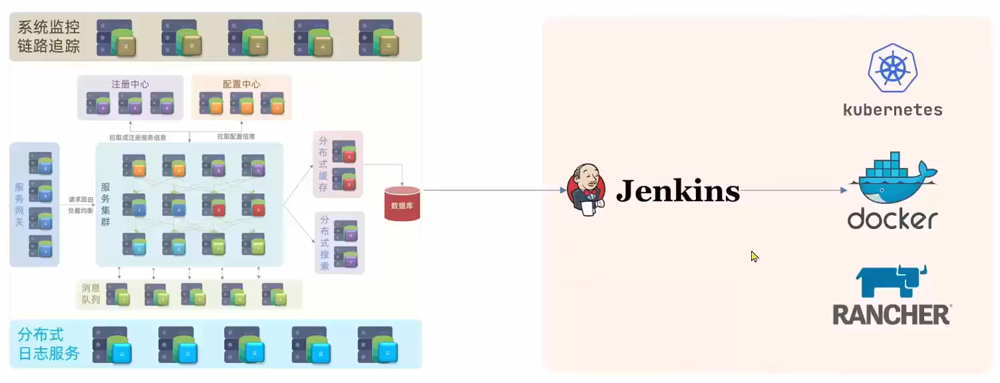
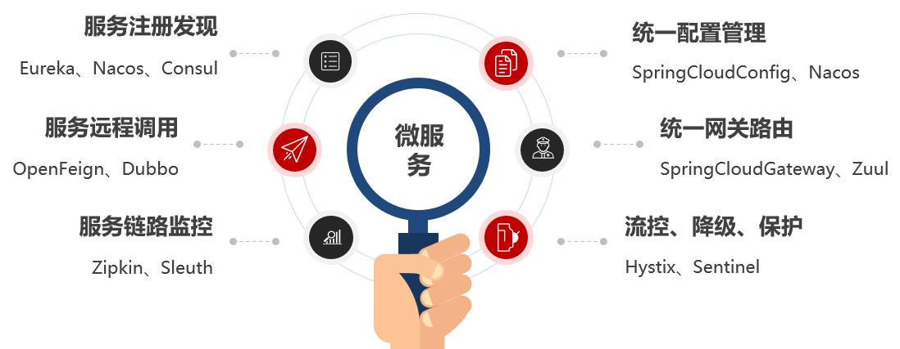
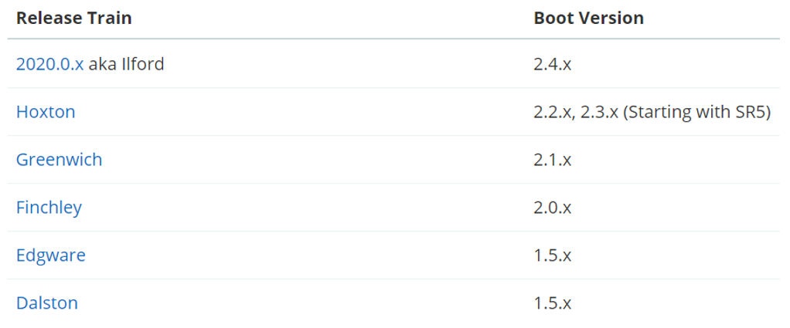
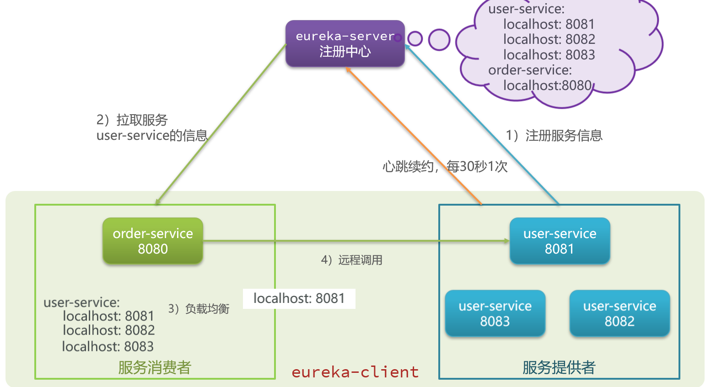

# 导学篇

什么是微服务？

首先要明确微服务绝对不等于 SpringCloud，SpringCloud仅仅解决了服务拆分时的服务治理问题，对于其他分布式的问题并没有给出解决方案。或者说，SpringCloud 仅仅是微服务中的一部分

微服务技术栈

<a href="https://imgse.com/i/piQRXyd"></a>

- 服务集群：有很多负责单一功能的服务组成的服务集群，共同来完成一个业务。服务之间存在复杂的调用关系。

- 注册中心：管理和记录服务。记录提供的服务和地址（IP + 端口）。服务之间不需要知道对方的地址，只需在配置中心查找要调用的服务的地址，进行调用。

- 配置中心：管理服务集群中的配置。可以通知服务集群中的服务，实现配置的热更新。

- 服务网关

  1. 校验用户身份，拦截非法请求
  2. 将合法请求路由到正确的具体的服务
  3. 负载均衡

- 分布式缓存

  缓存简单查询

- 分布式搜索

  实现复杂查询

- 消息队列

  解耦服务调用，实现异步调用
  
- 分布式日志服务
  负责统计集群中所有服务的日志，统一地存储统计分析 

- 系统的监控和链路追踪
  实时监控集群中每个节点的运行状态信息，一旦出现问题，可以定位到具体的方法 

- 自动化部署技术 

  - Jenkins
  - docker
  - kubernetes
  - rancher

## 0.2 微服务技术栈的大类划分

- 微服务治理
- 缓存技术
- 搜索技术
- 异步通信技术
- DevOps

# 第一章 认识微服务

## 1.1 微服务架构演变

### 单体架构

将业务的所有功能集中在一个项目中开发，达成一个包部署

优点：架构简单、部署成本低

缺点：耦合度高

### 分布式架构

根据业务功能对系统进行划分，每个业务模块作为独立项目开发，称为一个服务

优点：降低服务耦合、有利于服务升级拓展

缺点：复杂（服务拆分、服务治理、远程调用、服务健康状态感知）

### 微服务

一种经过良好架构设计的分布式架构方案，具有以下特征：

- 单一职责：微服务拆分粒度更小，每一个服务都对应唯一的业务能力，做到单一职责，避免重复业务开发
- 面向服务：微服务对外暴露业务接口
- 自治：团队独立、技术独立、数据独立、部署独立
- 隔离性强：服务调用做好隔离、容错、降级，避免出现级联问题

## 1.2 微服务技术对比

在国内比较知名的落地技术为 SpringCloud、Dubbo 和 SpringCloudAlibaba

|                | Dubbo                 | SpringCloud              | SpringCloudAlibaba       |
| -------------- | --------------------- | ------------------------ | ------------------------ |
| 注册中心       | zookeeper、redis      | Eureka、Consul           | Nacos、Eureka            |
| 远程服务调用   | Dubbo  协议           | Feign（http 协议）       | Dubbo、Feign             |
| 配置中心       | 无                    | SpringCloudConfig        | SpringCloudConfig、Nacos |
| 服务网关       | 无                    | SpringCloudGateway、Zuul | SpringCloudGateway、Zuul |
| 服务监控和保护 | Dubbo-admin（功能弱） | Hystrix                  | Sentinel                 |

## 1.3 SpringCloud

SpringCloud是目前国内使用最广泛的微服务框架。官网地址：https://spring.io/projects/spring-cloud。

SpringCloud集成了各种微服务功能组件，并**基于SpringBoot实现了这些组件的自动装配**，从而提供了良好的开箱即用体验：



SpringCloud 基于 SpringBoot 提供自动装配服务，因此存在两者的版本兼容问题，准确的兼容关系如下：




# 第 2 章 服务拆分及远程调用

## 2.1 服务拆分

**服务拆分注意事项：**

- 单一职责：根据业务模块拆分；不同微服务，不要重复开发相同业务
- 数据独立：独立的数据库，不要访问其它微服务的数据库
- 面向服务：将自己的业务暴露为接口，供其它微服务调用

## 2.2 远程调用

**微服务调用方式**

- 基于RestTemplate发起的http请求实现远程调用
- http请求做远程调用是与语言无关的调用，只要知道对方的ip、端口、接口路径、请求参数即可。

**服务调用关系**

- 服务提供者：暴露接口给其它微服务调用
- 服务消费者：调用其它微服务提供的接口
- 提供者与消费者角色其实是**相对**的
- 一个服务可以同时是服务提供者和服务消费者

## 2.3 Eureka注册中心

**服务调用出现的问题**

- 服务消费者该如何获取服务提供者的地址信息？
- 如果有多个服务提供者，消费者该如何选择？
- 消费者如何得知服务提供者的健康状态？

**Eureka的作用**

- 消费者该如何获取服务提供者具体信息？
  - 服务提供者启动时向eureka注册自己的信息
  - eureka保存这些信息
  - 消费者根据服务名称向eureka拉取提供者信息

- 如果有多个服务提供者，消费者该如何选择？
  - 服务消费者利用负载均衡算法，从服务列表中挑选一个

- 消费者如何感知服务提供者健康状态？

  - 服务提供者会每隔30秒向EurekaServer发送心跳请求，报告健康状态

  - eureka会更新记录服务列表信息，心跳不正常会被剔除

  - 消费者就可以拉取到最新的信息



**Eureka架构**

在Eureka架构中，微服务角色有两类：

- EurekaServer：服务端，注册中心
  - 记录服务信息
  - 心跳监控

- EurekaClient：客户端
  - Provider：服务提供者，例如案例中的 user-service
    - 注册自己的信息到EurekaServer
    - 每隔30秒向EurekaServer发送心跳
  - consumer：服务消费者，例如案例中的 order-service
    - 根据服务名称从EurekaServer拉取服务列表
    - 基于服务列表做负载均衡，选中一个微服务后发起远程调用

**搭建Eureka服务**

搭建EurekaServer服务步骤如下：

1. 创建项目，引入spring-cloud-starter-netflix-eureka-server的依赖

   ```xml
   <dependency>
       <groupId>org.springframework.cloud</groupId>
       <artifactId>spring-cloud-starter-netflix-eureka-server</artifactId>
   </dependency>
   ```

2. 编写启动类，添加@EnableEurekaServer注解

3. 添加application.yml文件，编写下面的配置

   ```yaml
   server:
     port: 10086
   spring:
     application:
       name: eurekaserver
   eureka:
     client:
       service-url:
         defaultZone: http://127.0.0.1:10086/eureka/
   ```

   Eureka本身也是一个微服务，需要有自己的服务名和地址，以方便在多Eureka实例时相互沟通

**服务注册**

- 按照以下两步完成服务注册：

  1. 引入spring-cloud-starter-netflix-eureka-client的依赖

     ```xml
     <dependency>
         <groupId>org.springframework.cloud</groupId>
         <artifactId>spring-cloud-starter-netflix-eureka-client</artifactId>
     </dependency>
     ```

  2. 在application.yml文件，编写下面的配置

     ```yaml
     spring:
       application:
         name: xxxserver
     eureka:
       client:
         service-url:
           defaultZone: http://127.0.0.1:10086/eureka/
     ```

- 无论是消费者还是提供者，引入eureka-client依赖、知道eureka地址后，都可以完成服务注册