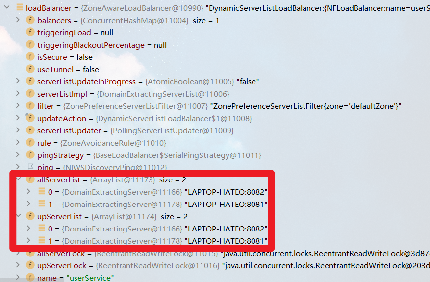

# 导学篇

## 0.1 什么是微服务？

首先要明确微服务绝对不等于 SpringCloud，SpringCloud仅仅解决了服务拆分时的服务治理问题，对于其他分布式的问题并没有给出解决方案。或者说，SpringCloud 仅仅是微服务中的一部分

## 0.2 微服务技术栈

<a href="https://imgse.com/i/piQRXyd"></a>

- 服务集群：有很多负责单一功能的服务组成的服务集群，共同来完成一个业务。服务之间存在复杂的调用关系。

- 注册中心：管理和记录服务。记录提供的服务和地址（IP + 端口）。服务之间不需要知道对方的地址，只需在配置中心查找要调用的服务的地址，进行调用。

- 配置中心：管理服务集群中的配置。可以通知服务集群中的服务，实现配置的热更新。

- 服务网关

  1. 校验用户身份，拦截非法请求
  2. 将合法请求路由到正确的具体的服务
  3. 负载均衡

- 分布式缓存

  缓存简单查询

- 分布式搜索

  实现复杂查询

- 消息队列

  解耦服务调用，实现异步调用
  
- 分布式日志服务
  负责统计集群中所有服务的日志，统一地存储统计分析 

- 系统的监控和链路追踪
  实时监控集群中每个节点的运行状态信息，一旦出现问题，可以定位到具体的方法 

- 自动化部署技术 

  - Jenkins
  - docker
  - kubernetes
  - rancher

## 0.2 微服务技术栈的大类划分

- 微服务治理
- 缓存技术
- 搜索技术
- 异步通信技术
- DevOps


# 第 1 章 认识微服务

## 1.1 微服务架构演变

### 单体架构

将业务的所有功能集中在一个项目中开发，达成一个包部署

优点：架构简单、部署成本低

缺点：耦合度高

### 分布式架构

根据业务功能对系统进行划分，每个业务模块作为独立项目开发，称为一个服务

优点：降低服务耦合、有利于服务升级拓展

缺点：复杂（服务拆分、服务治理、远程调用、服务健康状态感知）

### 微服务

一种经过良好架构设计的分布式架构方案，具有以下特征：

- 单一职责：微服务拆分粒度更小，每一个服务都对应唯一的业务能力，做到单一职责，避免重复业务开发
- 面向服务：微服务对外暴露业务接口
- 自治：团队独立、技术独立、数据独立、部署独立
- 隔离性强：服务调用做好隔离、容错、降级，避免出现级联问题

## 1.2 微服务技术对比

在国内比较知名的落地技术为 SpringCloud、Dubbo 和 SpringCloudAlibaba

|                | Dubbo                 | SpringCloud              | SpringCloudAlibaba       |
| -------------- | --------------------- | ------------------------ | ------------------------ |
| 注册中心       | zookeeper、redis      | Eureka、Consul           | Nacos、Eureka            |
| 远程服务调用   | Dubbo  协议           | Feign（http 协议）       | Dubbo、Feign             |
| 配置中心       | 无                    | SpringCloudConfig        | SpringCloudConfig、Nacos |
| 服务网关       | 无                    | SpringCloudGateway、Zuul | SpringCloudGateway、Zuul |
| 服务监控和保护 | Dubbo-admin（功能弱） | Hystrix                  | Sentinel                 |

## 1.3 SpringCloud

SpringCloud是目前国内使用最广泛的微服务框架。官网地址：https://spring.io/projects/spring-cloud。

SpringCloud集成了各种微服务功能组件，并**基于SpringBoot实现了这些组件的自动装配**，从而提供了良好的开箱即用体验：


SpringCloud 基于 SpringBoot 提供自动装配服务，因此存在两者的版本兼容问题，准确的兼容关系如下：


# 第 2 章 服务拆分及远程调用

任何分布式架构都离不开服务的拆分，微服务也是一样。

## 2.1 服务拆分

### 2.1.1 服务拆分原则

- 单一职责：根据业务模块拆分；不同微服务，不要重复开发相同业务
- 数据独立：独立的数据库，不要访问其它微服务的数据库
- 面向服务：将自己的业务暴露为接口，供其它微服务调用

### 2.1.2 服务拆分示例

以课前资料中的微服务cloud-demo为例，其结构如下：


cloud-demo：父工程，管理依赖

- order-service：订单微服务，负责订单相关业务
- user-service：用户微服务，负责用户相关业务

要求：

- 订单微服务和用户微服务都必须有各自的数据库，相互独立
- 订单服务和用户服务都对外暴露Restful的接口
- 订单服务如果需要查询用户信息，只能调用用户服务的Restful接口，不能查询用户数据库

## 2.2 远程调用

### 2.2.1 远程调用方式

- 基于 RestTemplate 发起的 http 请求实现远程调用
- http 请求做远程调用是与语言无关的调用，只要知道对方的 ip、端口、接口路径、请求参数即可。

### 2.2.2 远程调用示例

**需求**

修改 order-service 中的根据 id 查询订单业务，要求在查询订单的同时，根据订单中包含的 userId 查询出用户信息，一起返回。


**思路**

我们需要在 order-service 中向 user-service 发起一个 http 的请求，调用 `http://localhost:8081/user/{userId}` 这个接口。

大概的步骤是这样的：

- 注册一个 RestTemplate 的实例到 Spring 容器
- 修改 order-service 服务中的 OrderService 类中的 queryOrderById 方法，根据 Order 对象中的 userId 查询 User
- 将查询的 User 填充到 Order 对象，一起返回

**实现**

1. 注册 RestTemplate

   首先，我们在 order-service 服务中的 OrderApplication 启动类中，注册 RestTemplate 实例：

   ```java
   package com.github.taohe.order;
   
   import org.mybatis.spring.annotation.MapperScan;
   import org.springframework.boot.SpringApplication;
   import org.springframework.boot.autoconfigure.SpringBootApplication;
   import org.springframework.context.annotation.Bean;
   import org.springframework.web.client.RestTemplate;
   
   @MapperScan("com.github.taohe.order.mapper")
   @SpringBootApplication
   public class OrderApplication {
   
       public static void main(String[] args) {
           SpringApplication.run(OrderApplication.class, args);
       }
   
       @Bean
       public RestTemplate restTemplate() {
           return new RestTemplate();
       }
   
   }
   ```

2. 实现远程调用

   修改 order-service 服务中的 com.github.taohe.order.service 包下的 OrderService 类中的 queryOrderById 方法：

   ```java
   package com.github.taohe.order.service;
   
   import com.github.taohe.order.pojo.Order;
   import com.github.taohe.order.mapper.OrderMapper;
   import com.github.taohe.order.pojo.User;
   import org.springframework.beans.factory.annotation.Autowired;
   import org.springframework.stereotype.Service;
   import org.springframework.web.client.RestTemplate;
   
   import javax.annotation.Resource;
   
   @Service
   public class OrderService {
   
       @Resource
       private OrderMapper orderMapper;
   
       @Resource
       private RestTemplate restTemplate;
   
       public Order queryOrderById(Long orderId) {
   
           Order order = orderMapper.findById(orderId);
   
           completeOrder(order);
   
           return order;
       }
   
       private void completeOrder(Order order) {
   
           String url = "http://localhost:8081/user/" + order.getUserId();
           User user = restTemplate.getForObject(url, User.class);
           order.setUser(user);
       }
   }
   ```

**结果**

打开 `http://localhost:8080/order/101`，结果如下：

```json
{
	"id": 101,
	"price": 699900,
	"name": "Apple 苹果 iPhone 12 ",
	"num": 1,
	"userId": 1,
	"user": {
		"id": 1,
		"username": "柳岩",
		"address": "湖南省衡阳市"
	}
}
```

### 2.2.3 服务调用关系

- 服务提供者：暴露接口给其它微服务调用
- 服务消费者：调用其它微服务提供的接口
- 提供者与消费者角色其实是**相对**的
- 一个服务可以同时是服务提供者和服务消费者

## 2.3 Eureka 注册中心

### 2.3.1 Eureka 的作用

- 消费者该如何获取服务提供者具体信息？
  - 服务提供者实例启动后，将自己的信息注册到 eureka-server（Eureka服务端）。这个叫服务注册
  - eureka-server 保存服务名称到服务实例地址列表的映射关系
  - 消费者根据服务名称，拉取实例地址列表。这个叫服务发现或服务拉取
- 如果有多个服务提供者，消费者该如何选择？
  - 服务消费者从实例列表中利用负载均衡算法选中一个实例地址
  - 向该实例地址发起远程调用
- 消费者如何感知服务提供者健康状态？

  - 服务提供者会每隔一段时间（默认30秒）向 eureka-server 发起请求，报告自己状态，称为心跳
  - 当超过一定时间没有发送心跳时，eureka-server 会认为微服务实例故障，将该实例从服务列表中剔除
  - 消费者拉取服务时，就能将故障实例排除了

> 一个微服务，既可以是服务提供者，又可以是服务消费者，因此 eureka 将服务注册、服务发现等功能统一封装到了 eureka-client 端


### 2.3.2 Eureka 架构

在Eureka架构中，微服务角色有两类：

- EurekaServer：服务端，注册中心
  - 记录服务信息
  - 心跳监控

- EurekaClient：客户端
  - Provider：服务提供者，例如案例中的 user-service
    - 注册自己的信息到EurekaServer
    - 每隔30秒向EurekaServer发送心跳
  - consumer：服务消费者，例如案例中的 order-service
    - 根据服务名称从EurekaServer拉取服务列表
    - 基于服务列表做负载均衡，选中一个微服务后发起远程调用

### 2.3.3 搭建 Eureka 服务

首先应该意识到注册中心服务端：eureka-server，这必须是一个独立的微服务

搭建 EurekaServer 服务步骤如下：

1. 创建项目，引入 spring-cloud-starter-netflix-eureka-server 的依赖

   ```xml
   <dependency>
       <groupId>org.springframework.cloud</groupId>
       <artifactId>spring-cloud-starter-netflix-eureka-server</artifactId>
   </dependency>
   ```

2. 编写启动类，添加 @EnableEurekaServer 注解

3. 添加 application.yml 文件，编写下面的配置

   ```yaml
   server:
     port: 10086
   spring:
     application:
       name: eurekaserver
   eureka:
     client:
       service-url:
         defaultZone: http://127.0.0.1:10086/eureka/
   ```

   Eureka 本身也是一个微服务，需要有自己的服务名和地址，以方便在多 Eureka 实例时相互沟通
   
4. 启动微服务，然后在浏览器访问：http://127.0.0.1:10086

   看到下面结果应该是成功了：

   

### 2.3.4 服务注册

下面，我们将 user-service 注册到 eureka-server 中去。

按照以下两步完成服务注册：

1. 引入 spring-cloud-starter-netflix-eureka-client 的依赖

   ```xml
   <dependency>
       <groupId>org.springframework.cloud</groupId>
       <artifactId>spring-cloud-starter-netflix-eureka-client</artifactId>
   </dependency>
   ```

2. 在 application.yml 文件，编写下面的配置

   ```yaml
   spring:
     application:
       name: xxxserver
   eureka:
     client:
       service-url:
         defaultZone: http://127.0.0.1:10086/eureka/
   ```
   
3. 同时启动 eureka-service 和 user-service，在 eureka 控制台可以看到 user-service 上线：

   

>  无论是消费者还是提供者，引入 eureka-client 依赖、知道 eureka 地址后，都可以完成服务注册

### 2.3.5 单服务多实例

为了演示一个服务有多个实例的场景，我们添加一个 SpringBoot 的启动配置，再启动一个 user-service。

首先，复制原来的 user-service 启动配置：


然后，在弹出的窗口中，填写信息：

> 注意修改端口信息


> 如果没有 Environment variables 配置项，在此处勾选该项即可：
>
> 

现在，SpringBoot 窗口会出现两个 user-service 启动配置：


不过，第一个是 8081 端口，第二个是 8082 端口。

启动两个 user-service 实例：


查看 eureka-server 管理页面：


### 2.3.6 服务发现

下面，我们将 order-service 的逻辑修改：向 eureka-server 拉取 user-service 的信息，实现服务发现。

1. 引入依赖

   之前说过，服务发现、服务注册统一都封装在 eureka-client 依赖，因此这一步与服务注册时一致。

   在 order-service 的 pom 文件中，引入下面的 eureka-client 依赖：

   ```xml
   <dependency>
       <groupId>org.springframework.cloud</groupId>
       <artifactId>spring-cloud-starter-netflix-eureka-client</artifactId>
   </dependency>
   ```

2. 配置文件

   服务发现也需要知道 eureka 地址，因此第二步与服务注册一致，都是配置 eureka 信息：

   在 order-service 中，修改 application.yml 文件，添加服务名称、eureka 地址：

   ```yml
   spring:
     application:
       name: orderservice
   eureka:
     client:
       service-url:
         defaultZone: http://127.0.0.1:10086/eureka
   ```

3. 服务拉取和负载均衡

   最后，我们要去 eureka-server 中拉取 user-service 服务的实例列表，并且实现负载均衡。

   不过这些动作不用我们去做，只需要添加一些注解即可。

   在 order-service 的 OrderApplication 中，给 RestTemplate 这个 Bean 添加一个 @LoadBalanced 注解：

   ```java
   @Bean
   @LoadBalanced
   public RestTemplate restTemplate() {
       return new RestTemplate();
   }
   ```

   修改 order-service 服务中的 com.github.taohe.order.service.OrderService 类中的 completeOrder 方法。修改访问的 url 路径，用服务名代替 ip、端口：

   ```java
   private void completeOrder(Order order) {
   
       // String url = "http://localhost:8081/user/" + order.getUserId();
       String url = "http://userService/user/" + order.getUserId();
       User user = restTemplate.getForObject(url, User.class);
       order.setUser(user);
   }
   ```

   spring 会自动帮助我们从 eureka-server 端，根据 userservice 这个服务名称，获取实例列表，而后完成负载均衡。

## 2.4 Ribbon 负载均衡

上一节中，我们添加了 @LoadBalanced 注解，即可实现负载均衡功能，这是什么原理呢？

### 2.4.1 负载均衡原理

SpringCloud 底层其实是利用了一个名为 Ribbon 的组件，来实现负载均衡功能的。


那么我们发出的请求明明是 `http://userservice/user/1`，怎么变成了 `http://localhost:8081/user/1` 的呢？

### 2.4.2 源码跟踪

为什么我们只输入了 service 名称就可以访问了呢？之前还要获取 ip 和端口。

显然有人帮我们根据 service 名称，获取到了服务实例的 ip 和端口。它就是`LoadBalancerInterceptor`，这个类会在对 RestTemplate 的请求进行拦截，然后从 Eureka 根据服务 id 获取服务列表，随后利用负载均衡算法得到真实的服务地址信息，替换服务 id。

我们进行源码跟踪：

**LoadBalancerIntercepor**


可以看到这里的 intercept 方法，拦截了用户的 HttpRequest 请求，然后做了几件事：

- `request.getURI()`：获取请求 uri，本例中就是 http://userService/user/1
- `originalUri.getHost()`：获取 uri 路径的主机名，其实就是服务 id，`userService`
- `this.loadBalancer.execute()`：处理服务 id，和用户请求。

这里的`this.loadBalancer`是`LoadBalancerClient`类型，我们继续跟入。

**LoadBalancerClient**

继续跟入 execute 方法：


代码是这样的：

- getLoadBalancer(serviceId)：根据服务 id 获取 ILoadBalancer，而 ILoadBalancer 会拿着服务 id 去 eureka 中获取服务列表并保存起来。

  

- getServer(loadBalancer)：利用内置的负载均衡算法，从服务列表中选择一个。本例中，可以看到获取了 8082 端口的服务

放行后，再次访问并跟踪，发现获取的是 8081：

 

果然实现了负载均衡。

**负载均衡策略IRule**

在刚才的代码中，可以看到获取服务使通过一个`getServer`方法来做负载均衡:


我们继续跟入：


继续跟踪源码 chooseServer 方法，发现这么一段代码：

 

我们看看这个 rule 是谁：

 

这里的 rule 默认值是一个`RoundRobinRule`，看类的介绍：

 

这不就是轮询的意思嘛。

到这里，整个负载均衡的流程我们就清楚了。

**总结**

SpringCloudRibbon的底层采用了一个拦截器，拦截了RestTemplate发出的请求，对地址做了修改。用一幅图来总结一下：


基本流程如下：

- 拦截我们的RestTemplate请求 http://userservice/user/1
- RibbonLoadBalancerClient会从请求url中获取服务名称，也就是userService
- DynamicServerListLoadBalancer根据userService到eureka拉取服务列表
- eureka返回列表，localhost:8081、localhost:8082
- IRule利用内置负载均衡规则，从列表中选择一个，例如localhost:8081
- RibbonLoadBalancerClient修改请求地址，用localhost:8081替代userService，得到http://localhost:8081/user/1，发起真实请求

### 2.4.3 负载均衡策略

**负载均衡策略**

负载均衡的规则都定义在IRule接口中，而IRule有很多不同的实现类：


不同规则的含义如下：

| **内置负载均衡规则类**    | **规则描述**                                                 |
| ------------------------- | ------------------------------------------------------------ |
| RoundRobinRule            | 简单轮询服务列表来选择服务器。它是Ribbon默认的负载均衡规则。<br />内部使用原子整数实现线程安全的轮询，默认只会轮询10次。 |
| AvailabilityFilteringRule | 对以下两种服务器进行忽略：   （1）在默认情况下，这台服务器如果3次连接失败，这台服务器就会被设置为“短路”状态。短路状态将持续30秒，如果再次连接失败，短路的持续时间就会几何级地增加。  （2）并发数过高的服务器。如果一个服务器的并发连接数过高，配置了AvailabilityFilteringRule规则的客户端也会将其忽略。并发连接数的上限，可以由客户端的、\<clientName>.\<clientConfigNameSpace>.ActiveConnectionsLimit属性进行配置。 |
| WeightedResponseTimeRule  | 为每一个服务器赋予一个权重值。服务器响应时间越长，这个服务器的权重就越小。这个规则会随机选择服务器，这个权重值会影响服务器的选择。 |
| **ZoneAvoidanceRule**     | 以区域可用的服务器为基础进行服务器的选择。使用Zone对服务器进行分类，这个Zone可以理解为一个机房、一个机架等。而后再对Zone内的多个服务做轮询。 |
| BestAvailableRule         | 忽略那些短路的服务器，并选择并发数较低的服务器。             |
| RandomRule                | 随机选择一个可用的服务器。<br />内部使用 ThreadLocalRandom 类获取线程安全的随机数。 |
| RetryRule                 | 重试机制的选择逻辑                                           |

默认的实现就是ZoneAvoidanceRule，是一种轮询方案

**自定义负载均衡策略**

通过定义IRule实现可以修改负载均衡规则，有两种方式：

1. 代码方式：在order-service中的OrderApplication类中，定义一个新的IRule：

   ```java
   @Bean
   public IRule randomRule(){
       return new RandomRule();
   }
   ```

2. 配置文件方式：在order-service的application.yml文件中，添加新的配置也可以修改规则：

   ```yml
   userservice: # 给某个微服务配置负载均衡规则，这里是userservice服务
     ribbon:
       NFLoadBalancerRuleClassName: com.netflix.loadbalancer.RandomRule # 负载均衡规则 
   ```

> **注意**，一般用默认的负载均衡规则，不做修改。

### 2.4.4 饥饿加载

Ribbon默认是采用懒加载，即第一次访问时才会去创建LoadBalanceClient，请求时间会很长。

而饥饿加载则会在项目启动时创建，降低第一次访问的耗时，通过下面配置开启饥饿加载：

```yml
ribbon:
  eager-load:
    enabled: true
    clients: userservice
```

## 2.5 Nacos注册中心

国内公司一般都推崇阿里巴巴的技术，比如注册中心，SpringCloudAlibaba也推出了一个名为Nacos的注册中心。

### 2.5.1 认识和安装Nacos

[Nacos](https://nacos.io/)是阿里巴巴的产品，现在是[SpringCloud](https://spring.io/projects/spring-cloud)中的一个组件。相比[Eureka](https://github.com/Netflix/eureka)功能更加丰富，在国内受欢迎程度较高。


安装方式可以参考资料《Nacos安装指南.md》

### 2.5.2 服务注册到nacos

Nacos是SpringCloudAlibaba的组件，而SpringCloudAlibaba也遵循SpringCloud中定义的服务注册、服务发现规范。因此使用Nacos和使用Eureka对于微服务来说，并没有太大区别。

主要差异在于：

- 依赖不同
- 服务地址不同

**1）引入依赖**

在cloud-demo父工程的pom文件中的`<dependencyManagement>`中引入SpringCloudAlibaba的依赖：

```xml
<dependency>
    <groupId>com.alibaba.cloud</groupId>
    <artifactId>spring-cloud-alibaba-dependencies</artifactId>
    <version>2.2.6.RELEASE</version>
    <type>pom</type>
    <scope>import</scope>
</dependency>
```

然后在user-service和order-service中的pom文件中引入nacos-discovery依赖：

```xml
<dependency>
    <groupId>com.alibaba.cloud</groupId>
    <artifactId>spring-cloud-starter-alibaba-nacos-discovery</artifactId>
</dependency>
```

> **注意**：不要忘了注释掉eureka的依赖。

**2）配置nacos地址**

在user-service和order-service的application.yml中添加nacos地址：

```yaml
spring:
  cloud:
    nacos:
      server-addr: localhost:8848
```

> **注意**：不要忘了注释掉eureka的地址

**3）重启**

重启微服务后，登录nacos管理页面，可以看到微服务信息：


### 2.5.3 服务分级存储模型

一个**服务**可以有多个**实例**，例如我们的user-service，可以有:

- 127.0.0.1:8081
- 127.0.0.1:8082
- 127.0.0.1:8083

假如这些实例分布于全国各地的不同机房，例如：

- 127.0.0.1:8081，在上海机房
- 127.0.0.1:8082，在上海机房
- 127.0.0.1:8083，在杭州机房

Nacos就将同一机房内的实例 划分为一个**集群**。

也就是说，user-service是服务，一个服务可以包含多个集群，如杭州、上海，每个集群下可以有多个实例，形成分级模型，如图：


微服务互相访问时，应该尽可能访问同集群实例，因为本地访问速度更快。当本集群内不可用时，才访问其它集群。例如：


杭州机房内的order-service应该优先访问同机房的user-service。

**给user-service配置集群**

修改user-service的application.yml文件，添加集群配置：

```yaml
spring:
  cloud:
    nacos:
      server-addr: localhost:8848
      discovery:
        cluster-name: HZ # 集群名称
```

重启两个user-service实例后，我们可以在nacos控制台看到下面结果：


我们再次复制一个user-service启动配置，添加属性：

```sh
-Dserver.port=8083 -Dspring.cloud.nacos.discovery.cluster-name=SH
```

配置如图所示：


启动UserApplication3后再次查看nacos控制台：


**同集群优先的负载均衡**

默认的`ZoneAvoidanceRule`并不能实现根据同集群优先来实现负载均衡。

因此Nacos中提供了一个`NacosRule`的实现，可以优先从同集群中挑选实例。

1）给order-service配置集群信息

修改order-service的application.yml文件，添加集群配置：

```sh
spring:
  cloud:
    nacos:
      server-addr: localhost:8848
      discovery:
        cluster-name: HZ # 集群名称
```

2）修改负载均衡规则

修改order-service的application.yml文件，修改负载均衡规则：

```yaml
userservice:
  ribbon:
    NFLoadBalancerRuleClassName: com.alibaba.cloud.nacos.ribbon.NacosRule # 负载均衡规则 
```

### 2.5.4 权重配置

实际部署中会出现这样的场景：

服务器设备性能有差异，部分实例所在机器性能较好，另一些较差，我们希望性能好的机器承担更多的用户请求。

但默认情况下NacosRule是同集群内随机挑选，不会考虑机器的性能问题。

因此，Nacos提供了权重配置来控制访问频率，权重越大则访问频率越高。

在nacos控制台，找到user-service的实例列表，点击编辑，即可修改权重：


在弹出的编辑窗口，修改权重：


> **注意**：如果权重修改为0，则该实例永远不会被访问

### 2.5.5 环境隔离

Nacos提供了namespace来实现环境隔离功能。

- nacos中可以有多个namespace
- namespace下可以有group、service等
- 不同namespace之间相互隔离，例如不同namespace的服务互相不可见


**创建namespace**

默认情况下，所有service、data、group都在同一个namespace，名为public：


我们可以点击页面新增按钮，添加一个namespace：


然后，填写表单：


就能在页面看到一个新的namespace：


**给微服务配置namespace**

给微服务配置namespace只能通过修改配置来实现。

例如，修改order-service的application.yml文件：

```yaml
spring:
  cloud:
    nacos:
      server-addr: localhost:8848
      discovery:
        cluster-name: HZ
        namespace: 492a7d5d-237b-46a1-a99a-fa8e98e4b0f9 # 命名空间，填ID
```

重启order-service后，访问控制台，可以看到下面的结果：


此时访问order-service，因为namespace不同，会导致找不到userservice，控制台会报错：


### 2.5.6 Nacos与Eureka的区别

Nacos的服务实例分为两种l类型：

- 临时实例：如果实例宕机超过一定时间，会从服务列表剔除，默认的类型。

- 非临时实例：如果实例宕机，不会从服务列表剔除，也可以叫永久实例。

配置一个服务实例为永久实例：

```yaml
spring:
  cloud:
    nacos:
      discovery:
        ephemeral: false # 设置为非临时实例
```

Nacos和Eureka整体结构类似，服务注册、服务拉取、心跳等待，但是也存在一些差异：


- Nacos与eureka的共同点
  - 都支持服务注册和服务拉取
  - 都支持服务提供者心跳方式做健康检测

- Nacos与Eureka的区别
  - Nacos支持服务端主动检测提供者状态：临时实例采用心跳模式，非临时实例采用主动检测模式
  - 临时实例心跳不正常会被剔除，非临时实例则不会被剔除
  - Nacos支持服务列表变更的消息推送模式，服务列表更新更及时
  - Nacos集群默认采用AP方式，当集群中存在非临时实例时，采用CP模式；Eureka采用AP方式

# 第 3 章 配置中心

