## 说说你对线程安全性的理解

#### 1. 什么是线程安全

《Java 并发编程实战》一书中是这么描述的：当多个线程访问某个类时，不管运行时环境采用何种调度方式或者这些线程将如何交替执行，并且在调用代码中不需要任何额外的同步或协同，这个类都能表现出正确的行为，那么就称这个类是线程安全的。

简单的说，线程安全是指程序在并发环境运行时，多线程之间能够正确地处理共享变量，程序总是表现出正确完成的行为。注意关键词：并发环境、多线程、共享变量、正确完成。这里所谓的正确完成，就是要保证并发的三大特征：原子性、可见性、有序性。

#### 2. 如何保证线程安全

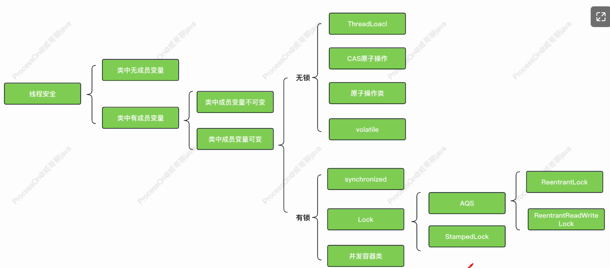

#### 3. 拓展知识

- **共享变量**

  所谓共享变量，就是多个线程都可以操作的变量。

  在 Java 中，堆和方法区是多个线程内存共享的区域。也就是说，保存在堆和方法区中的变量就是 Java 中的共享变量。

  Java 中共有 3 种变量，分别是类变量、成员变量和局部变量，它们分别存放在 JVM 的方法区、堆内存和栈内存中。其中，类变量和成员变量就是共享变量。


## 说说 hash 冲突的解决办法

Hash，就是把任意长度的输入（又叫做预映射，pre-image），通过散列算法，变换成固定长度的输出，该输出就是散列值，输入的微小变化会导致输出的巨大变化。所以 Hash 常用在消息摘要或签名上，常用 hash 消息摘要算法有：

- MD4
- MD5：它对输入仍以512位分组，其输出是4个32位字的级联
- SHA-1及其他。

Hash 属于压缩映射，一定概率会产生多个实际值映射为一个 Hash 值的情况，这就产生了冲突，常见处理 Hash 冲突方法：

**开放定址法**

基本思想是，出现 hash 冲突后，按照一定算法查找一个空位置存放，根据算法的不同又可以分为线性探测再散列、二次探测再散列、伪随机探测再散列。

- 线性探测再散列：依次向后查
- 二次探测再散列：探测过程：$$x+1^2,x-1^2,x+2^2,x-2^2,...$$ 出现负值，从尾部查找
- 伪随机探测再散列：随机产生一个增量位移

ThreadLocal 里用的则是线性探测再散列

**链地址法**

基本思想是，出现 hash 冲突后，将同一个 hash 的所有值形成一个链表。查询的时候，使用 hash 值定位到该链表，然后在遍历链表找到目标结果。

HashMap 用的就是链地址法

**再哈希法**

基本思想是，出现 hash 冲突后，调用多个不同的 hash 函数，直到不产生冲突为止。

**建立公共溢出区**

基本思想是，将哈希表分为基本表和溢出表两部分，凡是和基本表发生冲突的元素，一律填入溢出表。


## 线程的上下文切换

> 对于单核单线程 CPU 而言，在某一时刻只能执行一条 CPU 指令。从用户角度看，计算机能够并行运行多个进程，这恰恰是操作系统通过快速上下文切换造成的结果。每个时间片的大小一般为几十毫秒，所以在一秒钟就可能发生几十上百次的线程相互切换,给我们的感觉就是同时进行的。

在处理多线程并发任务时，处理器会给每个线程分配 CPU 时间片，线程在各自分配的时间片内占用处理器并执行任务。

当线程的时间片用完了，或者自身原因被迫暂停运行的时候，就会有另外一个线程来占用这个处理器。

这种一个线程让出处理器使用权，另外一个线程获取处理器使用权的过程就叫做上下文切换。

> - CPU 寄存器，是 CPU 内置的容量小、但速度极快的内存。
> - 程序计数器，则是用来存储 CPU 正在执行的指令位置以及即将执行的下一条指令位置。

一个线程让出 CPU 处理器使用权，就是“切出”；另外一个线程获取 CPU 处理器使用权，就是“切入”。

在这个切入切出的过程中，操作系统会保存和恢复相关的进度信息，而这个进度信息就是我们所熟悉的 CPU 寄存器以及程序计数器。

线程的上下文切换分为两种情况：

- 前后两个线程属于同一个进程。此时，同一个进程下的 2 个线程在切换时，虚拟内存、全局变量这些资源就保持不动，只需要切换线程的私有数据，比如栈和寄存器等不共享的数据。
- 前后两个线程属于不同进程。此时，因为不同进程资源不共享，所以这 2 个线程切换过程，不仅包括了虚拟内存、栈、全局变量等用户空间的资源，还包括了内核堆栈、寄存器等内核空间的状态的修改。

在并发编程中，并不是线程越多就效率越高，线程数太少可能导致资源不能充分利用，线程数太多可能导致竞争资源激烈，导致上下文切换频繁造成系统的额外开销，因为上下文的保存和恢复过程是有成本的，需要内核在 CPU 上完成，每次切换都需要几十纳秒到数微秒的 CPU 时间，在进程上下文切换次数较多的情况下，很容易导致 CPU 将大量时间耗费在寄存器、内核栈以及虚拟内存等资源的保存和恢复上。

在多线程环境下，我们应该尽可能的减少线程频繁的上下文切换：

- 减少线程数

  - 线程数不是越多越好，合理的线程数可以减少频繁的上下文切换而造成的额外开销。

  - 可以使用合理的线程池来管理线程的创建和销毁。

- 使用无锁并发编程

  - 比如说 CAS＋自旋操作。
  - 无锁并发编程可以避免线程因获取锁失败而进入阻塞状态，从而减少线程的上下文切换。

- 使用协程

  协程是一种用户态线程，线程的切换不需要操作系统的参与，可以减少上下文切换带来的性能开销。

### 拓展知识

#### 线程的调度

线程调度是指系统为线程分配 CPU 使用权的过程，主要调度方式有两种：

- 协同式线程调度(Cooperative Threads-Scheduling)
- 抢占式线程调度(Preemptive Threads-Scheduling)

使用协同式线程调度的多线程系统，线程执行的时间由线程本身来控制，线程把自己的工作执行完之后，要主动通知系统切换到另外一个线程上。使用协同式线程调度的最大好处是实现简单，由于线程要把自己的事情做完后才会通知系统进行线程切换，所以没有线程同步的问题，但是坏处也很明显，如果一个线程出了问题，则程序就会一直阻塞。

使用抢占式线程调度的多线程系统，每个线程执行的时间以及是否切换都由系统决定。在这种情况下，线程的执行时间不可控，所以不会有「—个线程导致整个进程阻塞」的问题出现。

#### 线程和协程

任何语言实现线程主要有三种方式：使用内核线程实现(1:1实现)，使用用户线程实现(1:N实现)，使用用户线程加轻量级进程混合实现(N:M实现)。

**内核线程实现**

使用内核线程实现的方式也被称为 1:1 实现。内核线程(Kernel-Level Thread，KLT)就是直接由操作系统内核(Kernel，下称内核)支持的线程，这种线程由内核来完成线程切换，内核通过操纵调度器(Scheduler)对线程进行调度，并负责将线程的任务映射到各个处理器上。

由于内核线程的支持，每个线程都成为一个独立的调度单元，即使其中某一个在系统调用中被阻塞了，也不会影响整个进程继续工作，相关的调度工作也不需要额外考虑，已经由操作系统处理了。

局限性：

- 首先，由于是基于内核线程实现的，所以各种线程操作，如创建、析构及同步，都需要进行系统调用。而系统调用的代价相对较高，需要在用户态(User Mode)和内核态(Kernel Mode)中来回切换。
- 其次，每个语言层面的线程都需要有一个内核线程的支持，因此要消耗一定的内核资源(如内核线程的栈空间)，因此一个系统支持的线程数量是有限的。

## 什么是零拷贝

从字面上理解，是不需要将数据从一个存储区域复制到另一个存储区域。最早的零拷贝定义来源于 Linux 系统的 sendfile 方法逻辑。

> 在 Linux2.4 内核中，sendfile 系统调用方法，可以将磁盘数据通过 DMA 拷贝到内核态 Buffer 后，再通过 DMA 拷贝到 Socket Buffer，无需 CPU 拷贝，这个过程称之为零拷贝。

零拷贝并不是不需要拷贝，而是减少了不必要的拷贝。

零拷贝技术有以下两点优势：

- 减少数据拷贝和共享总线操作的次数。消除传输数据在存储器之间不必要的中间拷贝，从而有效地提高数据传输效率；
- 零拷贝技术减少了用户态和内核态之间因为上下文切换而带来的性能开销；

常见的零拷贝方式有 mmap、sendfile 和 splice 等。

#### 1. 传统 IO 拷贝流程

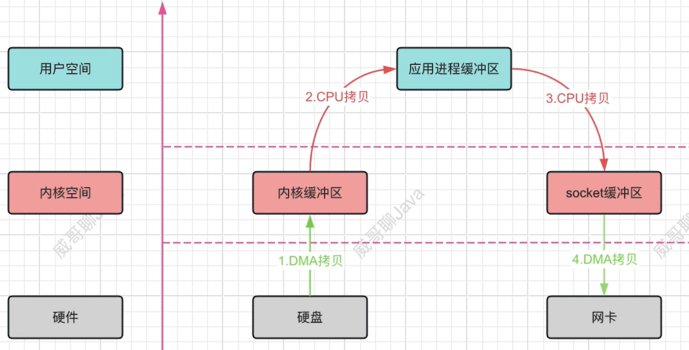

如上图，传统的 IO 读写流程如下∶

1. 应用程序调用 read 方法，CPU 由用户态切换到内核态，通过 DMA 技术将硬盘中的数据拷贝到内核缓冲区；
2. DMA 拷贝完成后，会发起一个中断通知 CPU，然后 CPU 会将内核缓冲区的数据拷贝到应用程序缓冲区；
3. 数据拷贝完成后，CPU 由用户态切换到内核态，应用程序线程进行业务处理；
4. 应用程序调用 write 方法对请求进行响应，CPU 由用户态切换到内核态，同时将应用缓冲区的数据拷贝到 socket 网络发送缓冲区；
5. 拷贝完成后，再由网络适配器通过 DMA 技术将 socket 网络发送缓冲区中的数据拷贝到网卡；
6. 拷贝完成后，CPU会将内核态切换回用户态，同时网卡会将数据发送出去；

整个过程,共产生 4 次数据拷贝和 4 次上下文切换：

- 4 次数据拷贝：2 次 DMA 拷贝，2 次 CPU 拷贝；
- 4 次上下文切换：read() / write() 调用各 2 次用户态和内核态的切换；

其中，用户空间和内核空间的 2 次 CPU 拷贝，作用是为了安全和缓存。那么，是否存在这么—种技术，既能保证操作系统的安全，
又能减少这种看似没有必要的 CPU 拷贝呢?接下来让我们看下 mmap 内存映射技术。

#### 2. mmap 内存映射

mmap 全称 memory map，翻译过来就是内存映射。它可以将内核态和用户态的内存映射在一起，以避免数据的来回拷贝。实现了这样的映射关系后，进程就可以采用指针的方式来操作这一段内存，系统会自动回写脏页面到对应的文件磁盘上，即完成了对文件的操作而不必再调用 read，write 等系统调用函数。相反，内核空间对这段内存区域的修改也会直接反映到用户空间，从而可以实现不同进程间的文件共享。

一般来说，mmap 内存映射技术可以替代 read 方法，即把传统的 read / write 替换为 mmap + write方式，替换后的流程如下图：

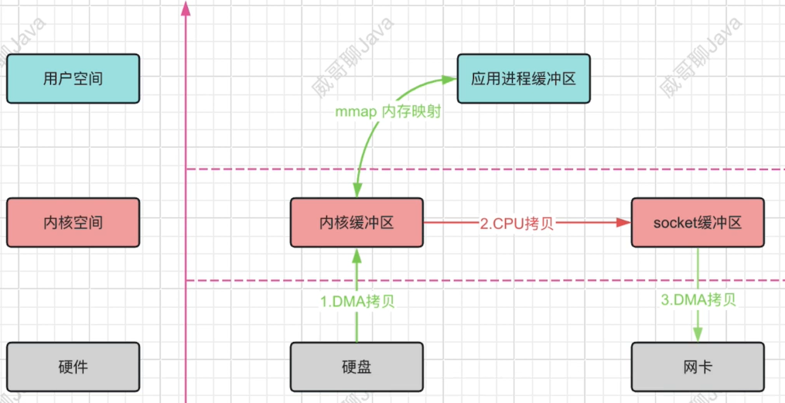

很明显，这种方案整个过程，会产生 3 次数据拷贝和 4 次上下文切换：

- 3 次数据拷贝：2 次 DMA 拷贝，1 次 CPU 拷贝；
- 4 次上下文切换：mmap() / write() 调用各 2 次用户态和内核态的切换；

情况似乎得到了一些改善，但是对于仅做文件传输，应用程序并不会数据做任何的修改的场景，此方案还是有可优化的空间的。接下来让我们看下 sendfile。

#### 3. sendfile

我们可以通过 sendfile 的方式，只做文件传输，而不通过用户态对数据进行任何干预。流程图如下：

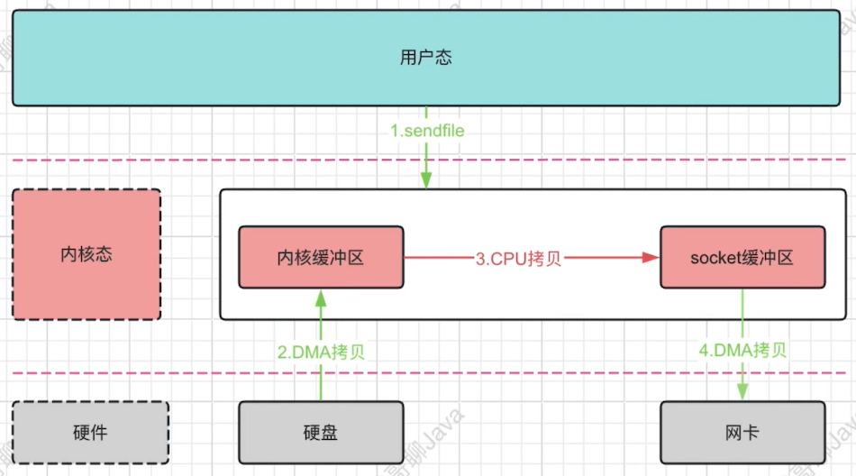

此时，我们发现，整个过程变为了 3 次数据拷贝和 2 次上下文切换：

- 3 次数据拷贝：2 次 DMA 拷贝，1 次 CPU 拷贝；
- 2 次上下文切换：sendfile() 的调用产生的 2 次用户态和内核态的切换；

还是很不甘心，有木有？我们注意下第三步的中 CPU 拷贝，既然都在内核态，那么有木有方案能把它优化掉呢？接下里让我们看下
sendfile + DMA scatter/gather 的拷贝流程。

#### 4. sendfile + DMA scatter/gather

在 Linux 2.4 内核版本中，对 sendfile 系统方法做了优化升级，引入 SG-DMA 技术，当然该技术需要 DMA 控制器硬件的支持。DMA gather 读取内核缓冲区(page cache)中的数据描述信息，包括内存地址和偏移量，并将其记录到 socket cache 中，DMA 根据这些数据描述信息，可以将内核缓冲区的数据直接拷贝到网卡，从而减少了一次 CPU 拷贝的过程。具体流程图如下：

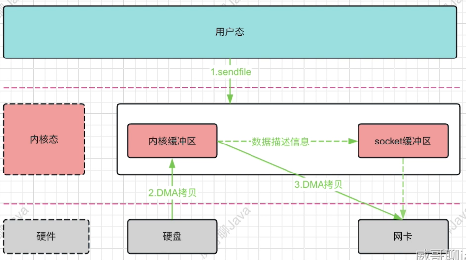

由上图可以看出，整个过程变为了 2 次数据拷贝和 2 次上下文切换。似乎一切近乎完美了，但是这种方式需要硬件的支持，有木有更完美的方式呢？最后，让我们看一下 splice。

#### 5. splice

在 Linux 2.6.17 内核版本中，引入了 splice 系统调用方法，和 sendfile 方法不同的是，splice 不需要硬件支持。

它将数据从磁盘读取到 OS 内核缓冲区后，内核缓冲区和 socket 缓冲区之间通过建立管道来传输数据，避免了两者之间的 CPU 拷贝操作。

整个拷贝过程，可以用如下流程图来描述：

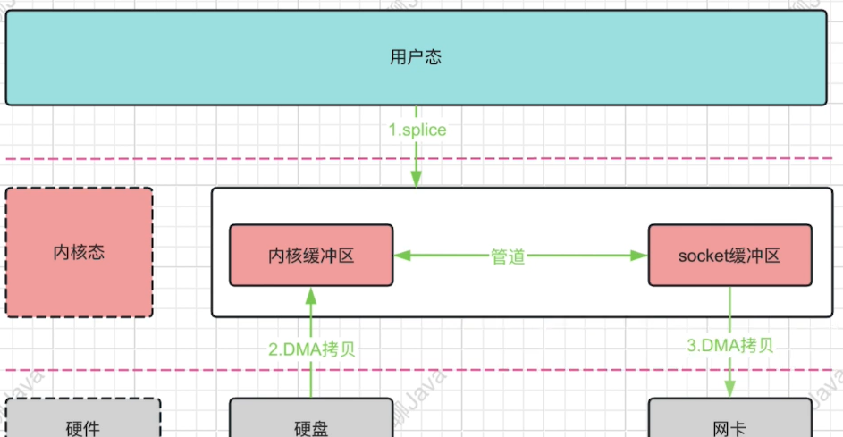

同样，该方案的整个过程也是 2 次数据拷贝和 2 次上下文切换。

#### 6. 拓展知识

- **什么是 DMA？**

  DMA，英文全称是 Direct Memory Access，即直接内存访问。DMA 本质上是一块主板上独立的芯片，允许外设设备和内存存储器之间直接进行 IO 数据传输，其过程不需要CPU 的参与。

- **内核空间和用户空间**

  操作系统的核心是内核，与普通的应用程序不同，它可以访问受保护的内存空间，也有访问底层硬件设备的权限。

  为了避免用户进程直接操作内核，保证内核安全，操作系统将虚拟内存划分为两部分，一部分是内核空间(Kernel-space)，一部分是用户空间(User-space)。在 Linux 系统中，内核模块运行在内核空间，对应的进程处于内核态；而用户程序运行在用户空间，对应的进程处于用户态。

  内核空间总是驻留在内存中，它是为操作系统的内核保留的。应用程序是不允许直接在该区域进行读写或直接调用内核代码定义的函数的。

  当启动某个应用程序时，操作系统会给应用程序分配一个单独的用户空间，其实就是一个用户独享的虚拟内存，每个普通的用户进程之间的用户空间是完全隔离的、不共享的，当用户进程结束的时候，用户空间的虚拟内存也会随之释放。

  同时处于用户态的进程不能访问内核空间中的数据，也不能直接调用内核函数。如果要调用系统资源，就要将进程切换到内核态，由内核程序来进行操作。

- **Java 中零拷贝的实现**

  Linux 提供的零拷贝技术，Java 并不是全部支持，目前只支持以下 2 种：

  - mmap
  - sendfile

- **Java NIO 对 mmap 的支持**

  Java NIO 有一个 MappedByteBuffer 的类，可以用来实现内存映射。它的底层是调用了 Linux 内核的 mmap 的 API。代码实现如下:

  ```java
  ```

- **Kafka 中的零拷贝实现**

  Kafka 两个重要过程都使用了零拷贝技术，一是 Producer 生产的数据存到 broker，二是 Consumer 从 broker 读取数据。

  Producer 生产的数据持久化到 broker，broker 里采用 mmap 文件映射，实现顺序的快速写入；

  Customer 从 broker 读取数据，broker 里采用 sendfile，将磁盘文件读到 OS 内核缓冲区后，直接转到 socket buffer 进行网络发送。

- **Netty 中的零拷贝实现**

  Netty 的零拷贝主要包含三个方面：

  - 在网络通信上，Netty 的接收和发送 ByteBuffer 采用 DIRECT BUFFERS，使用堆外直接内存进行 Socket 读写，不需要进行字节缓冲区的二次拷贝。
  - 在缓存操作上，Netty 提供了 CompositeByteBuf 类，它可以将多个 ByteBuf 合并为一个逻辑上的 ByteBuf，避免了各个 ByteBuf 之间的拷贝。通过 wrap 操作，我们可以将 byte[] 数组、ByteBuf、ByteBuffer 等包装成一个 Netty ByteBuf 对象，进而避免了拷贝操作。ByteBuf 支持 slice 操作，因此可以将 ByteBuf 分解为多个共享同一个存储区域的 ByteBuf，避免了内存的拷贝。
  - 在文件传输上，Netty 的通过 FileRegion 包装的 FileChannel.tranferTo 实现文件传输，它可以直接将文件缓冲区的数据发送到目标 Channel，避免了传统通过循环 write 方式导致的内存拷贝问题。


## 介绍一下 Netty

Netty 是由 JBOSS 提供的一个 Java 开源框架。它提供异步的、基于事件驱动的网络应用程序框架，可以快速开发高性能、高可靠性的网络 IO 程序。Netty 的应用场景主要是网络通信，比如用作 RPC 框架的通信工具、即时通讯的系统、实时消息推送的系统等。

Netty 是一个基于 NIO 的网络编程框架，相比于 Java 中自带的 NIO，它具备以下优势：

1. API 使用简单，开发门槛低；
2. 功能强大：Netty 预置了多种编解码功能，支持多种主流协议；
3. 扩展性强：通过 ChannelHandler 可以进行灵活的拓展，具备很强的定制能力；
4. 高性能：与其他业界主流 NIO 框架相比，Netty 综合性能更优，主要体现在吞吐量更高、延迟更低、减少资源消耗以及最小化不必要的内存复制等；
5. 社区活跃：版本迭代周期短，发现的BUG可以被及时修复；
6. 成熟稳定：Netty 修复了 Java NlO 已被发现的所有 BUG，另外，它经受了很多知名项目的使用和考验，比如 Dubbo / Zookeeper / ES / RocketMQ / Spark / Hadoop 等。

#### 1. 为什么 Netty 使用 NIO 而不是 AIO？

首先，让我们看下 Netty 的作者对这个问题的回答：

> Not faster than NIO(epoll) on unix systems (which is true)
>
> There is no daragram suppport
>
> Unnecessary threading model (too much abstraction without usage)

针对这个问题，总结以下三点：

- 在 Linux 系统上，AIO 的底层实现仍使用 EPOLL，在性能上没有明显的优势，而且被 JDK 封装了一层不容易深度优化；
- Netty 整体架构是 reactor 模型，而 AlO 是 proactor 模型，糅合在一起会非常混乱；
- AIO 还有个缺点就是接收数据需要预先分配缓存，而不是 NIO 那种需要接收时才需要分配缓存，所以对连接数量非常大但流量小的情况，内存浪费很多。

#### 2. 为什么不用 Netty 5？

Netty 5 已经停止开发了。


## Netty 的核心组件有哪些？

#### 1. 概述

Netty 的核心组件主要有以下六组：

- Bootstrap & ServerBootStrap;
- NioEventLoop & NioEventLoopGroup;
- Channel;
- Selector;
- ChannelPipeline & ChannelHandler & ChannelHandlerContext;
- ChannelFuture.

#### 2. 详解

- **Bootstrap & ServerBootStrap**

  基于 Netty 开发的应用程序通常是由创建一个 Bootstrap 开始，Bootstrap 的主要作用是配置整个 Netty 程序，串联各个组件。Netty 中  Bootstrap 类是客户端程序的启动引导类，主要负责客户端启动并连接远程的 Netty Server，而 ServerBootstrap 是服务端的启动引导类，主要用来监听指定的端口。

  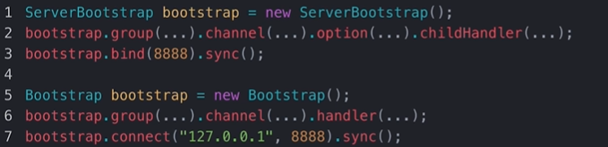

- **NioEventLoop & NioEventLoopGroup**

  NioEventLoop 中维护了一个线程和一个任务队列。它支持异步提交执行任务，线程启动时会调用 NioEventLoop 的 run 方法，执行 I/O 任务和非 I/O 任务：

  - l/O 任务，即 selectionKey 中 ready 的事件，如 accept、connect、read、write 等，由 processSelectedKeys 方法触发；
  - 非 I/O 任务，添加到 taskQueue 中的任务，如 register0、bind0 等任务，由 runAllTasks 方法触发。

  NioEventLoopGroup，可以理解为一个线程池，内部维护了一组线程，每个线程( NioEventLoop )负责处理多个 Channel 上的事件，而一个 Channel 只对应于一个线程。

  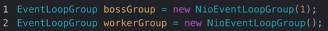

- **Channel**

  Channel 相当于完成网络通信的载体，能够用于执行网络 I/O 操作。下面是一些常用的 Channel 类型：

  - NioSocketChannel：异步的客户端 TCP Socket 连接；

  - NioServerSocketChannel：异步的服务器端 TCP Socket 连接；

  - NioDatagramChannel：异步的 UDP 连接；

  - NioSctpChannel：异步的客户端 Sctp 连接；

  - NioSctpServerChannel：异步的 Sctp 服务器端连接。

  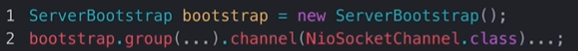

- **Selector**

  Netty 是基于 Selector 对象实现的 I/О 多路复用，通过 Selector 一个线程可以监听多个连接的 Channel 事件。

  当向一个 Selector 中注册 Channel 后，Selector 可以自动不断地查询（ Select ）这些注册的 Channel 是否有已就绪的 I/О 事件，这样程序就可以很简单地使用一个线程高效地管理多个 Channel 。

- **ChannelHandler & ChannelPipeline & ChannelHandlerContext**

  ChannelHandler 主要负责处理输入输出数据的逻辑，它可以接收入站事件和出站事件，并执行相应的处理逻辑。ChannelHandler 被添加到 ChannelPipeline 中，形成处理链。入站和出站事件的操作可以通过实现如下的接口或者继承如下的适配器来完成:

  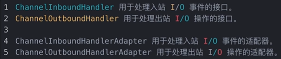

  ChannelPipeline 是一个双向链表，当数据通过 Channel 时，它会依次经过每个 ChannelHandler 进行处理。

  ChannelHandlerContext 是 ChannelHandler 的上下文环境，包含与 ChannelHandler 相关联的各种信息，如 Channel、
  EventLoop、ChannelPipeline 等。另外，ChannelHandlerContext 还提供了丰富的方法，以便于 ChannelHandler 可以与其他组件进行交互。

  它们之间的关系如下下图：

  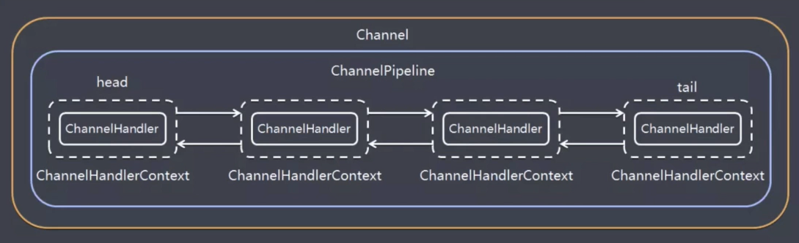

  一个 Channel 包含了一个 ChannelPipeline，而 ChannelPipeline 中又维护了一个由 ChannelHandlerContext 组成的双向链表，并且每个 ChannelHandlerContext 中又关联着一个 ChannelHandler。

- **ChannelFuture**

  在 Netty 中所有的 IO 操作都是异步的，因此，我们并不能立刻得到操作是否执行成功。但是，你可以通过 ChannelFuture 接口的 addLlistener() 方法注册一个 ChannelFuturelListener，当操作执行成功或者失败时，监听就会自动触发返回结果。另外，我们还可以通过 ChannelFuture 接口的 sync() 方法让异步的操作变成同步的。

  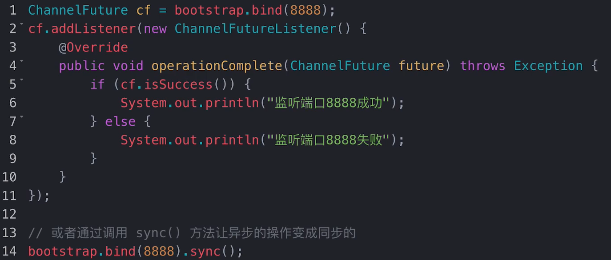


## 说说 Netty 的线程模型

Netty 是基于 Reactor 模型通过多路复用器接收并处理用户请求的。我们知道，Reactor 模式有三种经典的模型可以选择：Reactor 单线程模型、Reactor 多线程模型和主从 Reactor 多线程模型，具体可以参考如下笔记：

Netty 主要是基于主从 Reactor 多线程模型实现的，并在其基础上进行了改进。其线程模型如下图：

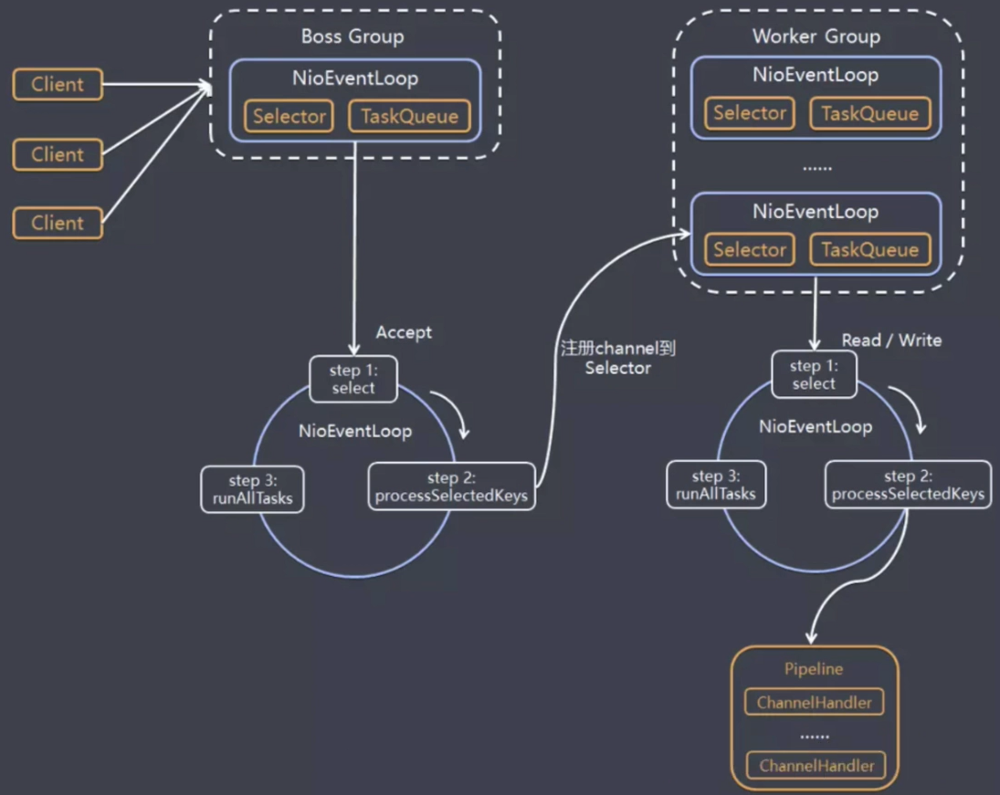

Netty 的线程模型解释如下：

1. Netty 抽象出两组线程池，Boss Group 和 Work Group，Boss Group 负责接收客户端的连接，而 Work Group 负责网络的读写；

2. Boss Group 和 Work Group 都是 NioEventLoopGroup 类的实例；

3. NioEventLoopGroup 相当于一个事件循环线程组，它包含多个事件循环线程。每一个事件循环线程都是一个 NioEventLoop；

4. 每一个 NioEventLoop 都有一个 Selector，用于监听注册在其上的 socketChannel 的网络通信；

5. Boss Group 下的 NioEventLoop 线程内部循环执行的步骤如下：

   a. 轮询 accept 事件；

   b. 处理 accept 事件，与客户端建立连接，生成 NioSocketChannel，并将其注册到 Worker Group 上的某个NioEventLoop 上的 Selector；

   c. 处理任务队列中的任务，即 runAllTasks。

6. Worker Group 下的 NioEventLoop 线程内部循环执行的步骤如下：

   a. 轮询注册到自己 Selector 上的所有 NioSocketChannel上的 read/ write 事件；

   b. 在对应的 NioScocketChannel 上处理 I/O 事件，即 read/ write 事件；

   c. 处理任务队列中的任务，即 runAllTasks。

7. 每个 Worker Group 下的 NIOEventLoop 处理业务时，会使用 pipeline(管道)，pipeline 中维护了很多的 ChannelHandler 来对我
   们的数据进行一系列的处理。
